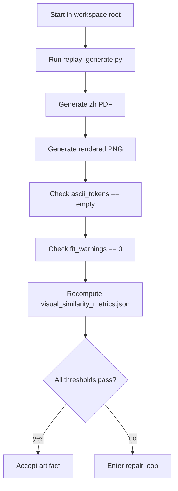

# Regression Fixture Replay Contract: R1_01_source_single_timeline

This directory is a regression fixture for reproducing the historical `01_source.pdf` output.

It is not the reusable core workflow. The reusable contracts, prompts, state machine, and tools live at:

```text
pdf_translation_workflow_core
```

This fixture may contain sample-specific thresholds and evidence because its only job is to protect the R1 regression anchor. New PDFs must not copy behavior from this fixture.

## Answer To Reproducibility Question

A new Codex session should not rely on the prose process document alone. It should use this directory as the replay contract.

Required entrypoint:

```powershell
python pdf_translation_workflow_core\regression\fixtures\R1_01_source_single_timeline\replay_contract\replay_generate.py
```

Required working directory:

```text
D:\项目\开源项目\MerqFin\spikes\独立测试
```

Expected output:

```text
docs\output\01_source.zh.pdf
docs\output\01_source.zh.page_01.png
tmp\pdfs\translation_backfill_evidence.json
tmp\pdfs\visual_similarity_metrics.json
```

## Acceptance Contract

The output is accepted only if all machine checks pass:

| Dimension | Required value |
|---|---|
| page_count | `1` |
| page_rect | `[0.0, 0.0, 552.756, 841.89]` |
| ascii_tokens | `[]` |
| fit_warnings | `0` |
| per-column y_span_ratio | `0.90 <= value <= 1.10` |
| per-column area_ratio | `value >= 0.70` |
| per-column line_count_ratio | `value >= 0.75` |
| per-column median_gap_delta | `abs(value) <= 2.10` |

Current L9 visual metrics are stored in:

```text
visual_similarity_metrics.json
```

## Non-Subjective Review Rule

Do not approve an output because it "looks good". Use:

1. rendered PNG inspection for collisions and obvious visual defects;
2. `translation_backfill_evidence.json` for line counts, insertion records, and overflow;
3. `visual_similarity_metrics.json` for visual occupancy comparison against the source.

## Rebuild Sequence



## Current Artifact Evidence

| Artifact | Size | SHA256 |
|---|---:|---|
| `01_source.pdf` | `98072` | `b75e85067467cf583eba04179ac12f2970085150fd89bd522d68a9ee1eb99cd3` |
| `docs\output\01_source.zh.pdf` | `30833649` | `91a51fb62d6e0305b789fa07dfd49c9c4844c106c4d89e9011e279b99d09c4b9` |
| `replay_generate.py` | `18095` | `79fed090b96d889b57d078e1faf01a2a738921afcf81baca3d03367f4b474b96` |

The SHA256 values are evidence for this run. If a PDF writer changes metadata or object order, verify by the acceptance contract above rather than by hash alone.
