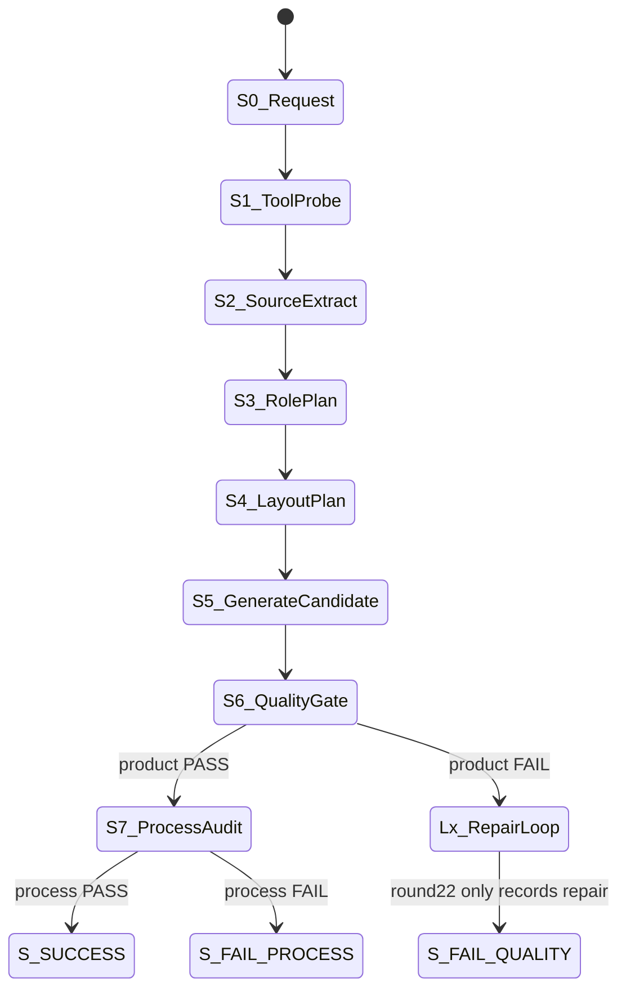
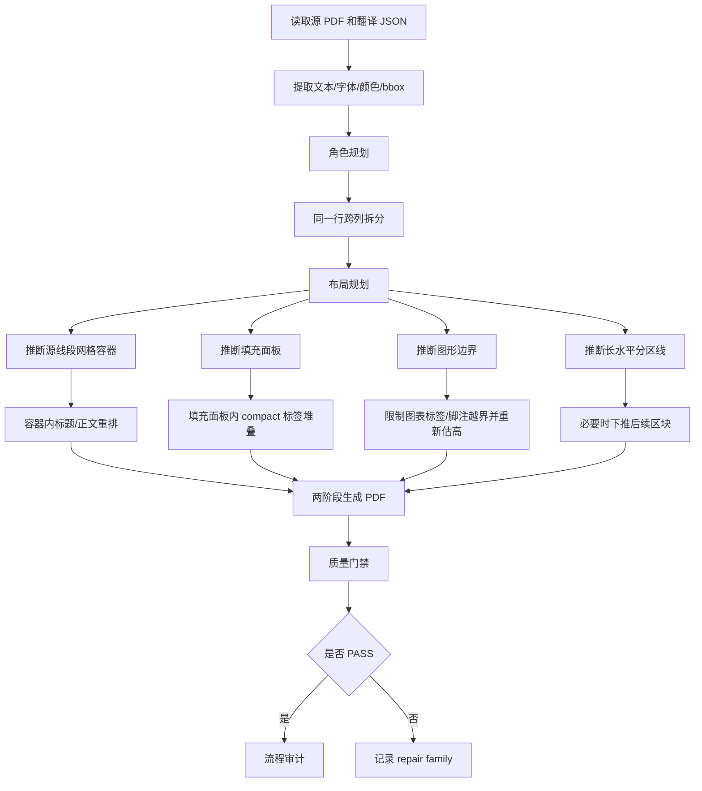
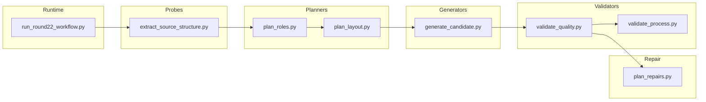

# PDF 语义翻译回填 Round22 设计增量与合入指南

## 1. 文档目的

本文档记录 `docs/output/round22` 中新增的版面修复设计、工具契约、状态机影响和合入建议。

它不是主流程设计文档的替代品。主流程设计文档仍是：

`docs/业务流程/PDF_语义翻译回填_标准流程设计.md`

Round22 的定位是隔离实验包。合入主框架前，只允许迁移已经被源几何、运行证据和门禁验证过的通用规则；不得迁移样本输入、输出 PDF、预览图、离线参考文件或运行报告作为生产依赖。

## 2. 当前结论

Round22 最新验证命令：

```powershell
python docs\output\round22\run_round22_workflow.py
```

最新候选 PDF：

`docs/output/round22/output/R22_PAGES_03_05_06_candidate.pdf`

当前状态：

| 项目 | 结果 |
|---|---|
| 流程契约 | `process_contract_verdict=PASS` |
| 产品质量 | `product_quality_verdict=FAIL` |
| 生成候选 PDF | 已生成 |
| 主要已修复问题 | 图表标签越界、灰色填充卡片白条、同一行跨列标题合并 |
| 主要未闭环问题 | 部分页仍有溢出、局部重叠、字体低于源相对门槛 |

合入判断：

- 可以合入为“布局修复能力增量”的候选设计。
- 不可以把 round22 的候选 PDF 视为最终质量通过样本。
- 不可以宣称主流程闭环已完成，因为 Lx repair 目前只记录修复族，没有自动修改布局后重跑 S3-S6。

## 3. Round22 目录与产物边界

允许作为合入参考的文件：

| 类别 | 路径 |
|---|---|
| 执行入口 | `docs/output/round22/run_round22_workflow.py` |
| 状态机契约 | `docs/output/round22/contracts/state_machine.md` |
| 工具契约 | `docs/output/round22/contracts/tool_contracts.md` |
| 执行过程 | `docs/output/round22/contracts/execution_procedure.md` |
| 执行说明 | `docs/output/round22/EXECUTION.md` |
| 角色规划工具 | `docs/output/round22/tools/planners/plan_roles.py` |
| 布局规划工具 | `docs/output/round22/tools/planners/plan_layout.py` |
| 生成工具 | `docs/output/round22/tools/generators/generate_candidate.py` |
| 质量门禁 | `docs/output/round22/tools/validators/validate_quality.py` |
| 提示词模板 | `docs/output/round22/prompts/templates/*.json` |

禁止合入为主框架运行依赖的文件：

| 类别 | 路径 |
|---|---|
| 输入样本 | `docs/output/round22/input/` |
| 离线对照 | `docs/output/round22/offline_reference_compare/` |
| 候选输出 | `docs/output/round22/output/` |
| 预览图 | `docs/output/round22/previews/` |
| 本轮运行报告 | `docs/output/round22/reports/` |

这些禁止项只能作为人工复盘证据，不能进入主框架的运行路径。

## 4. 设计增量总览

Round22 新增或强化了以下通用布局能力。

| 设计增量 | 解决的问题 | 源输入 | 输出证据 |
|---|---|---|---|
| `horizontal_row_clusters` | 同一行跨列标题被合并成一个组 | 当前页文本行 bbox、行高、列间距 | `role_plan.json.line_ids` 拆分结果 |
| `source_line_grid_container_relayout` | 卡片/表格中译文塞进原小框 | 源 PDF 横竖线段、相邻最小网格 | `layout_plan.json.source_line_grid_containers`、`flow_adjustments` |
| `source_graphic_boundary_limit` | 图表标签、脚注扩展到右侧卡片 | 源 PDF 线段边界 | `flow_adjustments.reason=source_graphic_boundary_limit` |
| `filled_panel_compact_stack` | 灰色填充卡片出现白条和压字 | 源 PDF 填充矩形和填充色 | `source_filled_rectangles`、`background_rgb` |
| `section_pushdown_after_source_rule` | 上游译文变长后侵入下一节 | 源 PDF 长水平分隔线 | `flow_adjustments.reason=section_pushdown_after_source_rule` |
| `symbol_font_leakage_sanitization` | bullet 字体被误读成普通字母 | 文本清洗和符号字体证据 | 清洗后的 `target_text` |

这些规则都必须满足反过拟合约束：

- 不允许使用文件名分支。
- 不允许使用固定页码分支。
- 不允许使用样本文案分支。
- 不允许使用样本数值分支。
- 必须从源 PDF 当前页几何、字体、颜色、绘图对象中推断。

## 5. 状态机影响

Round22 没有新增主状态，只是在既有状态内部增加决策维度。



Round22 与主流程的关键差异：

| 状态 | Round22 当前行为 | 合入主流程时应补齐 |
|---|---|---|
| S4_LayoutPlan | 已执行容器、边界、填充面板、分区下推规则 | 迁移为主框架 layout policy 的可配置 repair actions |
| S6_QualityGate | 能识别 overflow、font floor、local overlap | 继续补可视残留、容器密度、边界侵入等门禁 |
| Lx_RepairLoop | 只选择修复族，不自动应用 | 必须自动执行 repair action 后回到 S4 或 S5 重跑 |

## 6. 活动流



## 7. Block Definition Diagram



## 8. 工具函数到主框架的迁移映射

| Round22 函数/逻辑 | 当前文件 | 建议主框架落点 | 迁移说明 |
|---|---|---|---|
| `horizontal_row_clusters` | `tools/generate_round22_layout_candidate.py` | `pdf_translation_workflow_core/tools/probes/extract_pdf_structure.py` 或布局分组模块 | 应作为文本分组阶段的通用行内跨列拆分能力 |
| `sanitize_text` 的 symbol 泄漏清理 | `tools/generate_round22_layout_candidate.py` | 翻译物化或文本规范化模块 | 只能清理符号字体泄漏，不得清理正常单词 |
| `drawing_segments` | `tools/planners/plan_layout.py` | PDF 结构提取或 layout policy builder | 提取源 PDF 横线、竖线、矩形对象 |
| `infer_line_grid_containers` | `tools/planners/plan_layout.py` | layout policy builder | 只允许相邻线段形成最小容器，禁止跨列大容器 |
| `infer_filled_rectangles` | `tools/planners/plan_layout.py` | layout policy builder | 记录填充色，供擦除背景使用 |
| `apply_container_layout` | `tools/planners/plan_layout.py` | layout repair planner | 容器内标题/正文重排 |
| `apply_graphic_boundary_limits` | `tools/planners/plan_layout.py` | layout repair planner | 防止图表标签/脚注侵入邻接卡片 |
| `apply_filled_panel_compact_layout` | `tools/planners/plan_layout.py` | layout repair planner | 填充卡片内 compact 标签堆叠 |
| `apply_section_pushdown` | `tools/planners/plan_layout.py` | layout repair planner | 上游内容扩张后的下游整体下推 |
| 两阶段渲染 | `tools/generators/generate_candidate.py` | backfill candidate generator | 先统一擦除，再统一插入，避免后擦除覆盖前文字 |
| `local_text_overlap` | `tools/validators/validate_quality.py` | product quality validator | 以源 overlap 为 baseline，而不是绝对零重叠 |

## 9. 裁决矩阵

| 门禁/问题 | 维度 | 修复族 | 触发证据 | 修补工具 |
|---|---|---|---|---|
| `all_groups_fit` | `overflow` | `expand_or_reflow_slot` | `fit_status=overflow_after_fit` | layout planner |
| `source_relative_font_floor` | `font_floor` | `reflow_before_shrink` | 输出字号低于源字号比例门槛 | layout planner |
| `local_text_overlap` | `visual_crowding` | `vertical_flow_relayout` | 输出 overlap 超过源 baseline + tolerance | layout planner |
| `container_grid_merge` | `role/grouping` | `source_line_grid_container_relayout` | 相邻列被合并成跨列组 | role planner + layout planner |
| `chart_or_panel_boundary_intrusion` | `boundary` | `source_graphic_boundary_limit` | 图表标签/脚注跨入邻接图形区域 | layout planner |
| `filled_panel_text_collision` | `filled_panel` | `filled_panel_compact_stack` | 填充面板内白条、压字、擦除色不一致 | layout planner + generator |
| `section_pushdown_needed` | `flow` | `section_pushdown_after_source_rule` | 上游内容侵入源分区线下方 | layout planner |
| `symbol_font_leakage` | `text_normalization` | `text_sanitization` | 符号字体被抽成普通单字母 | text normalization |

## 10. 提示词契约变化

Round22 更新了两个提示词模板：

| 模板 | 当前版本 | 新增判断 |
|---|---|---|
| `visual_quality_adjudication.prompt.json` | `round22.visual_quality_adjudication.v2` | 容器合并、图形边界侵入、填充面板白条、分区下推、符号泄漏 |
| `repair_selection.prompt.json` | `round22.repair_selection.v2` | 新增 `source_graphic_boundary_limit`、`filled_panel_compact_stack` 等修复族 |

合入时必须同步更新主框架：

- `pdf_translation_workflow_core/prompts/prompt_tool_bindings.json`
- `pdf_translation_workflow_core/prompts/templates/D5_D7_quality_gate.prompt.json`
- `pdf_translation_workflow_core/prompts/templates/D8_repair_selection.prompt.json`

提示词槽位必须包含：

- `source_line_grid_containers`
- `source_filled_rectangles`
- `source_section_rules_y`
- `flow_adjustments`
- `generation_evidence.groups[].fit_attempts`
- `quality_gates.blocking_failures`

## 11. 合入步骤

建议按以下顺序合入，避免一次性迁移导致无法定位问题。

1. 合入文档。
   - 更新 `docs/业务流程/PDF_语义翻译回填_标准流程设计.md`。
   - 增加本文档中的状态机影响、活动流、裁决矩阵和工具映射。

2. 合入结构提取能力。
   - 迁移绘图线段、填充矩形、源图形边界提取。
   - 先只生成结构 JSON，不改变 PDF 输出。

3. 合入角色分组能力。
   - 迁移同一行跨列拆分。
   - 用现有样本验证 role/group 数量变化是否符合源几何。

4. 合入布局规划能力。
   - 迁移容器重排、边界限制、填充面板堆叠、分区下推。
   - 每个能力独立开关或独立 repair action，便于定位。

5. 合入生成器能力。
   - 确保两阶段擦除/回填。
   - 确保填充面板使用 panel fill color，而不是文字内部采样色。

6. 合入质量门禁。
   - 增加 `chart_or_panel_boundary_intrusion`。
   - 增加 `filled_panel_text_collision`。
   - 保留 `font_floor`，不允许靠无限缩字通过。

7. 合入 repair loop。
   - `plan_repairs.py` 不能只记录修复族。
   - 必须执行一个 repair action，然后回到 S4 或 S5 重跑。
   - 达到最大 loop 或连续无改善时，诚实失败。

## 12. 回归用例

合入后至少用以下用例回归：

| 用例 | 目的 |
|---|---|
| HSBC 页 3 | 检查 KPI、红色注释、metric value 排版 |
| HSBC 页 5 | 检查图表标签和右侧卡片边界 |
| HSBC 页 6 | 检查填充面板 compact 标签 |
| AIA 英译中页面 | 检查英文到中文的文本收缩和表格/正文 |
| AIA 中译英页面 | 检查中文到英文的文本扩张和下游区块重排 |
| 任意非 AIA/HSBC PDF | 检查反过拟合 |

## 13. 合入验收标准

主框架合入时，必须同时满足：

- `process_contract_verdict=PASS`
- `product_quality_verdict=PASS`
- 没有 `overflow_after_fit`
- 没有源相对字体门槛失败
- 没有明显白条、背景擦除残留
- 没有图表标签侵入卡片/表格区域
- 没有同一行跨列标题被合并
- repair loop 至少能自动执行一次修复并重跑门禁

如果只满足流程 PASS，不满足产品 PASS，只能作为实验能力保留，不能标记为主流程质量闭环。

## 14. 当前未合入风险

| 风险 | 说明 |
|---|---|
| 容器边框扩展/重绘未完成 | 当前能在容器内重排，但长标题仍可能触发 font floor 失败 |
| Repair loop 未闭环 | 当前只记录 repair family，不自动应用 |
| 可视残留门禁不足 | 背景残留主要靠人工预览，自动门禁仍弱 |
| 多页全局重排不足 | 当前主要是局部容器和分区下推，不是完整页面重排引擎 |

## 15. 合入原则

Round22 只能以“可复用规则”合入，不能以“样本结果”合入。

可复用规则必须具备：

- 明确源输入；
- 明确输出字段；
- 明确触发门禁；
- 明确修复族；
- 明确反过拟合约束；
- 有对应渲染证据；
- 有失败时的诚实终态。

