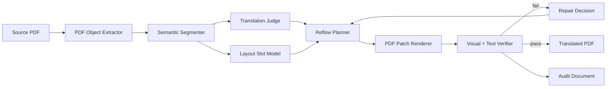
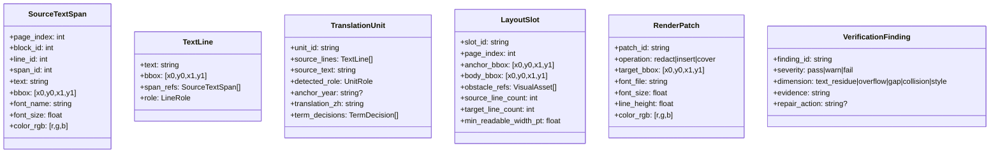
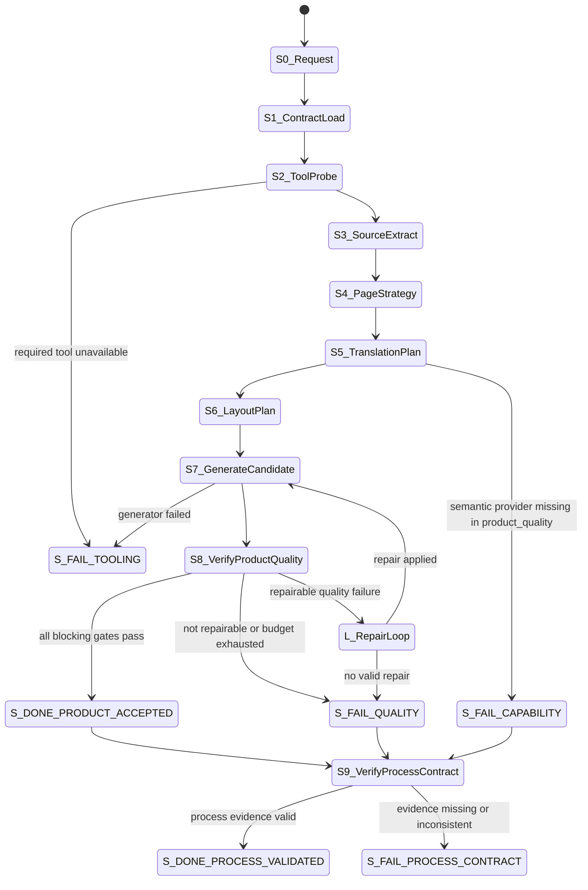
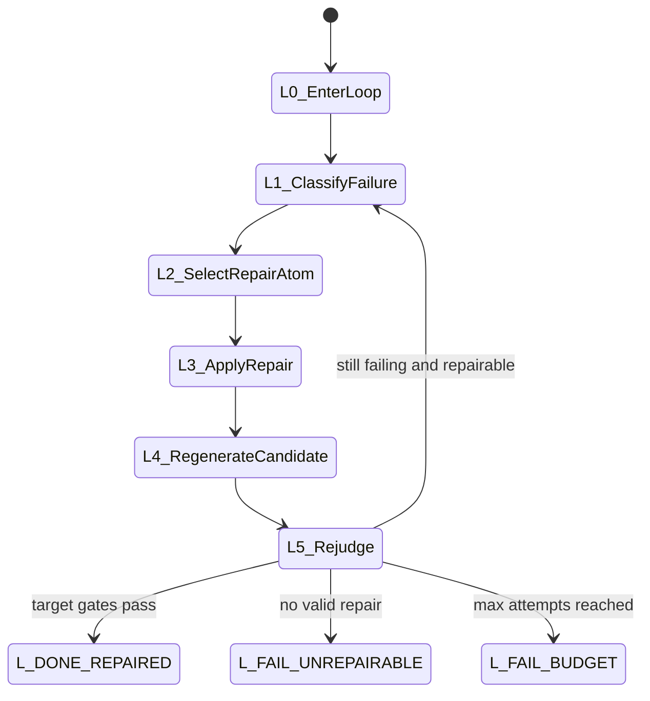
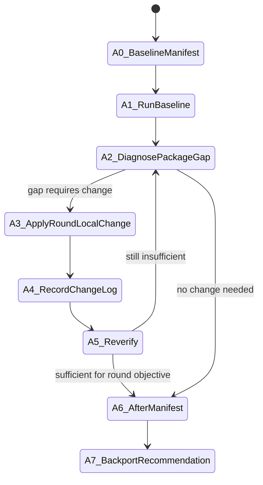
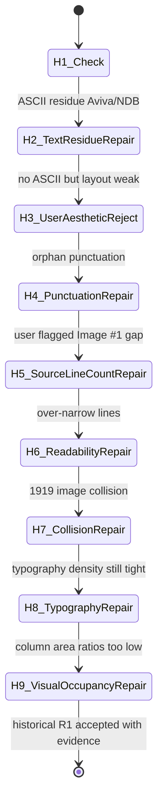
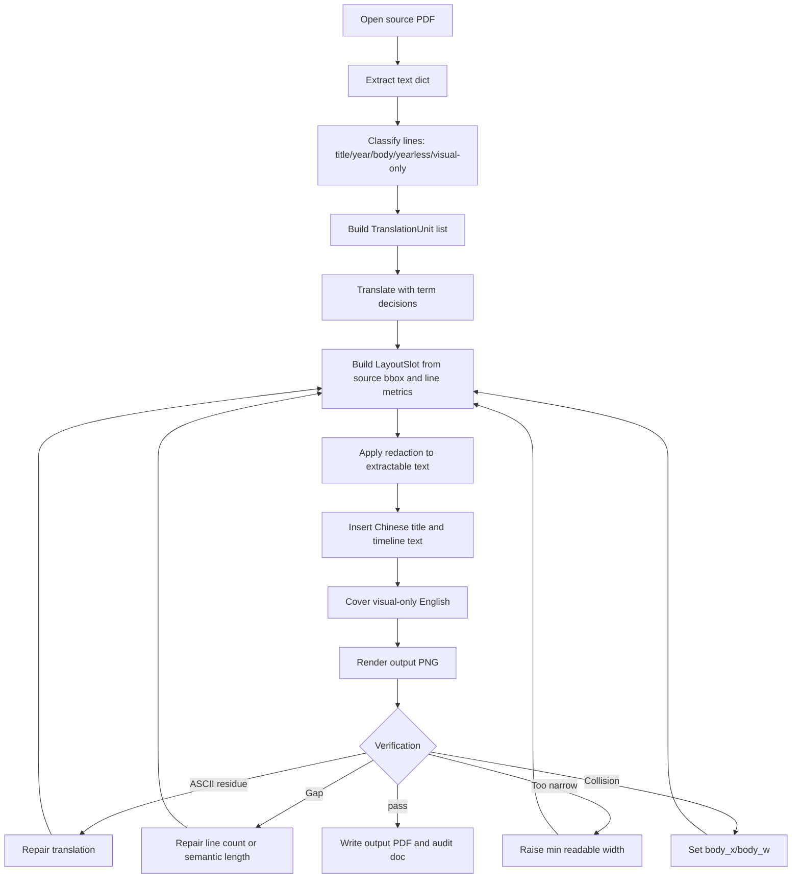

# 01_source.pdf 英文翻译回填详细流程记录

记录日期：2026-07-05  
工作目录：`D:\项目\开源项目\MerqFin\spikes\独立测试`  
源文件：`01_source.pdf`  
最终 PDF：`docs\output\01_source.zh.pdf`  
最终渲染图：`docs\output\01_source.zh.page_01.png`

## 0. 诚实边界

- 没有调用外部 OpenAI API、Claude API 或第三方翻译 API。
- 翻译、术语选择、版式判断、是否需要继续循环，是本次 Codex/OpenAI 模型在对话中完成的判断。
- 本地实际执行工具包括 PowerShell、Python、PyMuPDF、`view_image`、`apply_patch`。
- `pdfinfo`/Poppler 不在 PATH，未用于最终流程。
- `reportlab` 未安装，未用于最终流程。
- 原 PDF 未被覆盖；最终结果写入 `docs\output`。
- 图片中的照片内容保留原样；可抽取英文文本被删除并回填中文，肉眼可见且不是可抽取文本的 `MDRT®` 被单独覆盖为 `百万圆桌®`。

## 1. 输入与输出

| 项 | 路径 | 结果 |
|---|---|---|
| 源 PDF | `01_source.pdf` | 存在，大小 98072 字节 |
| 过程脚本 | `tmp\pdfs\generate_translated_pdf.py` | 用于可复跑生成 |
| 文本对象证据 | `tmp\pdfs\source_text_objects.json` | 记录原 PDF 文本块、坐标、字号、颜色 |
| 回填证据 | `tmp\pdfs\translation_backfill_evidence.json` | 记录 redaction、insertions、视觉覆盖 |
| 最终核验证据 | `tmp\pdfs\final_verification.json` | 记录最终页数、尺寸、英文残留、溢出警告 |
| 最终 PDF | `docs\output\01_source.zh.pdf` | 已生成 |
| 最终 PNG | `docs\output\01_source.zh.page_01.png` | 已渲染检查 |

## 2. 状态迁移总表

| 状态 | 含义 | 进入原因 | 退出条件 |
|---|---|---|---|
| S0 | 接收需求 | 用户要求翻译 `01_source.pdf` 并记录全流程 | 开始工具检查 |
| S1 | 工具能力检查 | 需要知道本机可用 PDF 工具 | 发现 PyMuPDF 可用 |
| S1_FAIL_PATH | 路径编码失败 | Python 脚本内直接写中文绝对路径后路径被破坏 | 改用 `Path.cwd()` + 相对路径 |
| S2 | 源 PDF 解析 | 提取页数、页面尺寸、文本块、图片块 | 得到 1 页、12 个文本块、3 个非文本块 |
| S3 | 源页视觉检查 | 渲染源页确认真实版式 | 确认四列时间线、红色标题区、浅灰内容区、图片/标志 |
| S4 | Redaction 探针 | 先只删除文本，验证不会破坏背景/图片 | 探针通过 |
| S5 | 创建回填脚本 | 固定输入输出，便于复跑 | `generate_translated_pdf.py` 创建成功 |
| L1 | 第 1 轮生成 | 初稿生成、机器检查、人工检查 | 发现 `Aviva NDB` 英文残留 |
| L2 | 第 2 轮生成 | 修补英文残留 | 机器通过，但用户指出版式不够美观 |
| L3 | 第 3 轮美观修补 | 调轻字重、增加目标行数 | 人工检查发现孤立标点行，失败 |
| L4 | 第 4 轮换行修补 | 标点贴前行、限制最小换行宽度 | 机器通过，但后续被用户指出与原文仍有明显差距 |
| L5 | 第 5 轮源行数修补 | 量化 Image #1 区域，按源行数修补 1931/后续段 | 空洞改善，但 2009/2010 过窄 |
| L6 | 第 6 轮可读宽度修补 | 补足译文语义，提高最小宽度 | 可读性改善，但 1919 接近建筑图片 |
| L7 | 第 7 轮图片避障修补 | 增加 `body_x/body_w`，让 1919 正文缩进 | 避障通过，但后续进入字体密度修补 |
| L8 | 第 8 轮字体密度修补 | 正文字号从 `7.65` 调到 `7.05`，行高从 `9.8` 调到 `10.4` | 行距更松，但第 2/3 列文本面积仍偏低 |
| L9 | 第 9 轮视觉占用修补 | 补足第 2/3 列译文语义，提升行数/面积比 | 当前最终版 |
| S_DONE | 交付 | 最终 PDF 写入 `docs\output`，流程文档写入 `docs\业务流程` | 完成 |

## 3. 逐步操作流水

| 步骤 | 操作 | 工具 | 输入 | 输出/结果 | 备注 |
|---|---|---|---|---|---|
| 1 | 读取 PDF 技能说明 | PowerShell `Get-Content` | `C:\Users\best_\.codex\...\pdf\SKILL.md` | 确认推荐 PyMuPDF/pdfplumber/pypdf/渲染检查 | 规范要求渲染检查 |
| 2 | 查历史记忆 | `rg` | `C:\Users\best_\.codex\memories\MEMORY.md` | 找到 MerqFin PDF 回填相关注意事项 | 记忆只用于避免过拟合、强调真实渲染验证 |
| 3 | 列目录 | PowerShell `Get-ChildItem` | 当前目录 | 看到 `01_source.pdf` 和 `docs` | 确认源文件存在 |
| 4 | 尝试 `pdfinfo` | PowerShell | `01_source.pdf` | 失败：`pdfinfo` 不是可识别命令 | 记录失败，改用 PyMuPDF |
| 5 | 检查 Python 包 | Python | `fitz,pdfplumber,pypdf,reportlab` | `fitz/pdfplumber/pypdf=True`, `reportlab=False` | 选择 PyMuPDF |
| 6 | 第一次 Python 路径脚本 | Python | 直接写入中文绝对路径 | 失败：`WinError 123`，路径显示为乱码问号 | 进入 `S1_FAIL_PATH` |
| 7 | 改用当前目录 | Python `Path.cwd()` | `01_source.pdf` | 成功解析 PDF | 避免脚本源码编码破坏中文路径 |
| 8 | 提取文本块 | PyMuPDF `page.get_text("dict")` | `01_source.pdf` | 12 个文本块、3 个非文本块 | 输出到 `source_text_objects.json` |
| 9 | 渲染源页 | PyMuPDF `get_pixmap` | `01_source.pdf` | `tmp\pdfs\source_page_01.png` | 供视觉检查 |
| 10 | 查看源页 | `view_image` | 源页 PNG | 确认四列时间线、红色标题、浅灰背景、照片和 MDRT 标志 | 这是模型视觉判断 |
| 11 | 字体探测 | PowerShell + Python | `C:\Windows\Fonts` | 找到 `msyh.ttc`, `msyhbd.ttc`, `msyhl.ttc`, `simhei.ttf` | 最终选择微软雅黑系列 |
| 12 | Redaction 探针 | PyMuPDF | 所有文本块 bbox | `redaction_text_only_probe.pdf/png` | 删除文字但保留图片/背景 |
| 13 | 查看探针 | `view_image` | 探针 PNG | 背景、照片、MDRT 图形保留 | 允许矢量 PDF 回填 |
| 14 | 创建生成脚本 | `apply_patch` | 翻译表、坐标、字体、redaction 策略 | `tmp\pdfs\generate_translated_pdf.py` | 可复跑工具 |
| 15 | 第 1 轮生成 | Python 脚本 | 源 PDF | 输出 PDF/PNG/证据 JSON | 机器发现 ASCII 残留 |
| 16 | 第 1 轮文本检查 | PyMuPDF + regex | 输出 PDF | ASCII token: `Aviva`, `NDB` | 失败 |
| 17 | 第 1 轮视觉检查 | `view_image` | 输出 PNG | 版式可读，但 `Aviva NDB` 未中文化 | 失败 |
| 18 | 修补翻译 | `apply_patch` | `sri_lanka` 项 | `Aviva NDB` 改为 `英杰华保险业务` | 只改一处 |
| 19 | 第 2 轮生成 | Python 脚本 | 修补后脚本 | 机器通过，无 ASCII、无溢出 | 通过机器检查 |
| 20 | 第 2 轮视觉检查 | `view_image` | 输出 PNG | 能读、无遮挡，但整体美观度弱于原文 | 用户明确指出失败 |
| 21 | 美观修补 | `apply_patch` | 字体和换行参数 | 正文改 `msyhl.ttc`，字号 7.35，行高 9.35，增加目标行数 | 进入 L3 |
| 22 | 第 3 轮生成 | Python 脚本 | 美观修补后脚本 | 机器通过 | 但还需人工看 |
| 23 | 第 3 轮视觉检查 | `view_image` | 输出 PNG | 发现孤立 `。` 行，视觉失败 | 失败原因是目标行数算法过度收窄 |
| 24 | 换行算法修补 | `apply_patch` | `wrap_cjk` | 标点贴前一行；最小换行宽度不低于列宽约 78% | 进入 L4 |
| 25 | 第 4 轮生成 | Python 脚本 | 修补后脚本 | 输出最终 PDF/PNG/证据 JSON | 机器通过 |
| 26 | 第 4 轮视觉检查 | `view_image` | 最终 PNG | 无英文残留、无孤立标点、版式比第 2 轮更接近原文 | 接受为当前最终版 |
| 27 | 最终核验 | Python + PyMuPDF + regex | `docs\output\01_source.zh.pdf` | 1 页、尺寸不变、ASCII tokens 为空、fit warnings 为 0 | 写入 `final_verification.json` |
| 28 | 写流程文档 | `apply_patch` | 本记录 | `docs\业务流程\01_source_pdf_中文回填_详细流程记录.md` | 本文件 |

## 4. 交给 Codex/OpenAI 模型判断的事项

### 4.1 翻译判断

模型判断提示词摘要：

```text
输入：PDF 提取出的英文文本块、年份、行内容、坐标和源页渲染图。
任务：将所有可见英文翻译为简体中文；保留年份；专有名词选择常用中文译名；
不得留下 ASCII 英文字母；译文要适合窄栏时间线版式。
输出维度：source_id、年份、原文含义、中文译文、是否专有名词、是否需要视觉覆盖。
```

模型输出维度实际使用：

| 维度 | 用途 |
|---|---|
| `id/year` | 对应原 PDF 时间线项目 |
| `body` | 中文回填文本 |
| `x/y/w/bottom` | 继承原 PDF 坐标作为回填锚点 |
| `target_lines` | 美观修补中用于控制中文段落高度 |
| `visual_overlays` | 记录非文本层英文的覆盖动作 |

### 4.2 版式判断

模型判断提示词摘要：

```text
对比源页渲染和输出页渲染。
检查：红色标题块是否保持、浅灰内容区是否保持、四列时间线是否保持、
图片是否被破坏、中文是否遮挡图片、是否有英文残留、是否有孤立标点、
正文视觉重量是否接近原文、栏内留白是否过于突兀。
输出：通过/失败、失败原因、下一轮最小修补动作。
```

模型判断结果：

| 轮次 | 判断结果 | 失败/通过原因 | 下一步 |
|---|---|---|---|
| L1 | 失败 | `Aviva NDB` 仍为英文 | 改为中文译名 |
| L2 | 失败 | 用户指出整体美观度不如原文；中文块偏紧，栏内节奏不自然 | 做美观 reflow |
| L3 | 失败 | 过度收窄导致孤立 `。` 行 | 修补标点换行和最小宽度 |
| L4 | 通过 | 无英文残留、无孤立标点、无明显遮挡，整体更接近原文 | 输出最终版 |

## 5. 本地工具选择与原因

| 工具 | 是否使用 | 原因 |
|---|---|---|
| PyMuPDF (`fitz`) | 使用 | 可解析文本块、redaction、插入中文、渲染 PNG |
| `view_image` | 使用 | 需要肉眼/模型视觉判断版式是否美观 |
| `pdfinfo` | 未使用 | 本机 PATH 中不存在 |
| Poppler `pdftoppm` | 未使用 | 不在 PATH，PyMuPDF 已满足渲染需求 |
| `reportlab` | 未使用 | Python 环境未安装；且本任务更适合在原 PDF 上 redaction 回填 |
| 外部翻译 API | 未使用 | 翻译由 Codex 模型完成 |
| OCR | 未使用 | PDF 文本可抽取；照片内容保留 |

## 6. PDF 回填方法

1. 打开 `01_source.pdf`。
2. 对 12 个文本块添加 redaction annotation。
3. 调用：

```python
page.apply_redactions(
    images=fitz.PDF_REDACT_IMAGE_NONE,
    graphics=fitz.PDF_REDACT_LINE_ART_NONE,
    text=fitz.PDF_REDACT_TEXT_REMOVE,
)
```

4. 这一步只删除文本，不删除图片和矢量图形。
5. 插入中文标题，位置沿用原标题左上区域。
6. 插入 22 个时间线项目，位置沿用原年份/正文锚点。
7. 覆盖 `MDRT®` 矢量文字区域，并插入 `百万圆桌®`。
8. 保存到 `docs\output\01_source.zh.pdf`。
9. 渲染为 `docs\output\01_source.zh.page_01.png` 做视觉检查。

## 7. 循环记录

| 循环 | 进入条件 | 执行动作 | 判断主体 | 判断标准 | 结果 | 下一状态 |
|---|---|---|---|---|---|---|
| L1 | 初稿脚本已生成 | 删除英文文本、插入中文、覆盖 MDRT | Python regex + Codex 视觉判断 | 无 ASCII；无明显遮挡 | 失败：`Aviva NDB` 残留 | L2 |
| L2 | 英文残留已修补 | 重新生成 PDF | Python regex + Codex 视觉判断 + 用户反馈 | 无 ASCII；美观接近原文 | 失败：用户指出版式不够美观 | L3 |
| L3 | 需要提升美观度 | 改 Light 字体、字号、行高、目标行数 | Python regex + Codex 视觉判断 | 无 ASCII；无孤立标点；栏内节奏自然 | 失败：孤立 `。` 行 | L4 |
| L4 | 需要修复换行缺陷 | 标点贴前行；限制最小换行宽度 | Python regex + Codex 视觉判断 | 无 ASCII；无孤立标点；无明显遮挡 | 被后续用户复核否定：整体仍不像原文 | L5 |
| L5 | 用户指出 Image #1 区域存在明显版式差距 | 量化源文和译文在 1931/后续段落的行数与 y 轴间距 | PyMuPDF 指标 + Codex 视觉判断 | 译文段落高度不能显著小于源文；相邻段落不能出现异常大空洞 | 部分通过：1931 空洞改善，但 2009/2010 被压成过窄短行 | L6 |
| L6 | 需要同时满足源文节奏和中文可读宽度 | 补足翻译语义；提高最小排版宽度到 62-64pt | PyMuPDF 指标 + Codex 视觉判断 | 不为追行数牺牲可读性；无英文；无溢出 | 失败：1919 正文延伸后碰到建筑图片 | L7 |
| L7 | 需要处理图片避障 | 增加 `body_x/body_w` 元数据，让 1919 正文从图片右侧缩进开始 | PyMuPDF 指标 + Codex 视觉判断 | 文字不遮挡图片；1931 区域行数接近源文；无英文；无溢出 | 避障通过，但用户继续指出字体密度问题 | L8 |
| L8 | 用户继续指出行距、字距、文字大小与源文仍不相似 | 只改正文排版参数：`font_size=7.05`、`line_height=10.4` | PyMuPDF 指标 + Codex 视觉判断 | 不考虑中英文语义，只比较行距、字号比例、空白面积 | 部分通过：行距改善，但第 2/3 列文本面积仍偏低 | L9 |
| L9 | 需要提升列内视觉占用相似度 | 补足第 2/3 列被压缩的译文语义，重新生成视觉指标 | PyMuPDF 指标 + Codex 视觉判断 | y 轴覆盖接近源文，面积比不低于阈值，无英文残留，无溢出 | 通过 | S_DONE |

## 8. 翻译表

| 项 | 中文回填 |
|---|---|
| 标题 | 自1919年以来 / 推动亚洲经济 / 与社会发展 |
| 1919 | 友邦保险在亚洲奠定企业根基：集团创始人康纳利·范德·斯塔尔先生在上海创办保险代理机构。 |
| 1921 | 康纳利·范德·斯塔尔先生在上海创办亚洲人寿保险公司，这是他的首家人寿保险企业。 |
| 1931 | 康纳利·范德·斯塔尔先生在上海创办国际保险有限公司，简称国际保险公司。 |
| INTASCO branches | 国际保险有限公司在香港和新加坡设立分支办事处。 |
| 1947 | 菲律宾美国人寿及综合保险公司，即友邦菲律宾，在菲律宾成立。 |
| INTASCO head office | 国际保险公司将总部迁至香港。 |
| 1948 | 国际保险有限公司更名为美国国际保险有限公司。 |
| 1992 | 我们通过设于上海的分公司重新建立在中国的业务布局，成为国内首家获准经营的人寿保险外资企业。 |
| 1998 | 我们庆祝重返位于上海外滩的昔日总部大楼。 |
| 2009 | 我们完成由美国国际集团2008年流动性危机推动的重组，由此为公司公开上市完成定位与准备。 |
| 2010 | 友邦保险控股有限公司成功在香港联合交易所主板上市，是当时全球第三大的首次公开募股项目。 |
| 2011 | 友邦保险控股有限公司成为恒生指数的成份股。 |
| ADR programme | 我们推出一项由公司赞助的一级美国存托凭证计划。 |
| 2013 | 友邦保险完成对友邦保险与荷兰国际集团马来西亚业务的全面整合。 |
| Sri Lanka | 我们通过收购斯里兰卡英杰华保险业务，在斯里兰卡开展业务。 |
| 2014 | 友邦保险与花旗银行建立一项具有里程碑意义、长期且独家的银保合作伙伴关系，覆盖亚太11个市场。 |
| Tottenham | 友邦保险成为托特纳姆热刺足球俱乐部官方球衣合作伙伴，推广运动作为健康生活的重要元素。 |
| 2015 | 友邦保险成为全球第一的百万圆桌公司。 |
| MDRT visual text | 百万圆桌® |
| 2016 | 友邦领导力中心在曼谷启用。 |
| Tata AIA | 我们将友邦保险集团在印度合资企业塔塔友邦人寿保险有限公司的持股比例由26%提高至49%。 |
| 2017 | 友邦保险呈献香港摩天轮和友邦健康活力公园。 |
| 2018 | 友邦保险推出全新品牌承诺：更健康、更长久、更美好的人生。 |

## 9. 最终核验结果

最终核验命令使用 PyMuPDF 读取输出 PDF，并用正则检查可抽取文本中的 ASCII 英文。

结果：

```json
{
  "page_count": 1,
  "page_rect": [0.0, 0.0, 552.756, 841.89],
  "ascii_tokens": [],
  "fit_warnings": 0,
  "visual_overlay_count": 1,
  "text_redaction_count": 12,
  "insertion_count": 25,
  "1919_line_count": 5,
  "1931_line_count": 5,
  "intasco_branches_line_count": 3,
  "1947_line_count": 4
}
```

判断：

- 页数与源 PDF 一致：1 页。
- 页面尺寸与源 PDF 一致：`552.756 x 841.89`。
- 可抽取文本中没有 ASCII 英文 token。
- 脚本记录的文本框溢出警告为 0。
- 有 1 个视觉覆盖：`MDRT® -> 百万圆桌®`。
- 有 12 个文本 redaction，对应原 PDF 12 个可抽取文本块。
- 有 25 个中文插入项：3 行标题 + 22 个时间线/说明项。

## 10. 工程化契约与元数据模型

这一节是为了复用到其他 PDF，不是为了把 `1921`、`1931` 写死到算法里。本次样本中的 `1921`、`1931` 是按下面的通用规则从 PDF 文本对象中提取出来的：文本行内容匹配 `^\d{4}$`，字号约 `12pt`，颜色与正文一致，且在同一时间线文本块内位于正文行之前。

### 10.1 系统上下文



### 10.2 Block Definition Diagram



### 10.3 字段契约

| 字段 | 类型 | 产生工具 | 含义 | 本样本例子 | 复用要求 |
|---|---|---|---|---|---|
| `page_index` | int | PyMuPDF | PDF 页号，从 0 开始 | `0` | 不可由模型猜 |
| `block_id` | int | PyMuPDF | PDF 文本块编号 | `0` | 用于追溯 redaction |
| `line_id` | int | PyMuPDF | 块内行编号 | `8` | 用于恢复源阅读顺序 |
| `text` | string | PyMuPDF | 原始提取文本 | `1921`、`1931` | 不可手写伪造 |
| `bbox` | float[4] | PyMuPDF | 文本/图片边界框，单位 pt | `1931: [102.68,448.24,...]` | 所有布局判断必须引用 |
| `font_size` | float | PyMuPDF | 原字体大小 | 年份约 `12`，正文约 `8` | 用于角色分类 |
| `role` | enum | 规则 + Codex 判断 | `title/year/body/image_text/visual_only` | `1931 -> year` | 先规则，歧义再交给模型 |
| `anchor_year` | string? | 规则 | 年份锚点 | `1931` | 不是预置列表 |
| `source_line_count` | int | PyMuPDF | 源段落正文行数 | `1931 -> 5` | 用于版式节奏目标 |
| `target_line_count` | int | Reflow Planner | 中文目标行数 | `1931 -> 5` | 可以低于源行数，但要记录原因 |
| `min_readable_width_pt` | float | Reflow Planner | 中文每行最小可读宽度 | `62-64pt` | 防止压成竖排短行 |
| `body_x/body_w` | float | Reflow Planner | 避障后的正文区域 | `1919 body_x=115, body_w=78` | 只在图片/图形碰撞时设置 |
| `translation_zh` | string | Codex/OpenAI 判断 | 中文译文 | `国际保险有限公司...` | 必须无 ASCII 英文字母，除非用户允许 |
| `verification.dimension` | enum | Verifier | 失败维度 | `gap/collision/style` | 修补循环必须引用 |

## 11. 提取逻辑

### 11.1 文本对象提取

工具：PyMuPDF `page.get_text("dict")`

输出维度：

```json
{
  "block_id": 0,
  "type": 0,
  "bbox": [102.677, 295.162, 192.802, 509.708],
  "lines": [
    {
      "line_id": 0,
      "text": "1919",
      "spans": [
        {"font": "AIAEverest-CondensedMedi", "size": 12.0, "color": 2773603}
      ]
    }
  ]
}
```

判断逻辑：

1. `type == 0` 视为可抽取文本块。
2. `type == 1` 视为图片/非文本对象，不参与文本翻译，但进入视觉检查。
3. 对每行合并 span 文本，保留 `bbox/font/size/color`。
4. 行内容匹配 `^\d{4}$` 且字号明显大于正文时，分类为 `year_heading`。
5. 年份后的连续正文行归入同一 `TranslationUnit`，直到下一个年份行或块结束。
6. 如果没有年份但处于时间线列中，例如 `INTASCO established branch offices...`，分类为 `yearless_event`，保留自己的 `unit_id`，不把它吞进上一个年份。

### 11.2 年份提取实例

| 源行 | 规则命中 | 角色 | 结果 |
|---|---|---|---|
| `1921` | `^\d{4}$` + 字号 `12pt` + 位于正文前 | `year_heading` | 创建 `TranslationUnit(id=1921)` |
| `1931` | `^\d{4}$` + 字号 `12pt` + 位于正文前 | `year_heading` | 创建 `TranslationUnit(id=1931)` |
| `1947` | 同上 | `year_heading` | 创建 `TranslationUnit(id=1947)` |

结论：`1921`、`1931` 不是预先知道的，也不是写死推断出来的；它们来自 PDF 文本行提取和年份正则。

### 11.3 视觉英文提取

`MDRT®` 没有作为 `type == 0` 文本返回，而是保留在图形/矢量内容里。判断流程：

1. redaction 探针删除所有可抽取文本。
2. 渲染探针图。
3. 如果探针图仍有英文可见，分类为 `visual_only_text`。
4. 对本页，`MDRT®` 被分类为 `visual_only_text`，修补动作是覆盖矢量文字区域并插入 `百万圆桌®`。

## 12. 翻译判断契约

### 12.1 Prompt 模板

```text
角色：PDF 时间线翻译与版式回填判断器。
输入：
- TranslationUnit.unit_id
- source_text
- anchor_year
- source_line_count
- bbox
- surrounding_units
- visual_context_summary
任务：
1. 翻译为简体中文。
2. 不保留 ASCII 英文字母，除非用户明确允许。
3. 年份数字保持原样。
4. 专有名词优先用常见中文译名；无确定译名时音译或意译，但记录 term_decision。
5. 译文长度要支持窄栏回填；不得故意省略原文语义。
输出 JSON：
{
  "unit_id": "...",
  "translation_zh": "...",
  "term_decisions": [
    {"source": "...", "target": "...", "reason": "..."}
  ],
  "layout_risk": "low|medium|high",
  "requires_visual_overlay": false
}
```

### 12.2 本页术语决策

| 源术语 | 中文 | 原因 | 是否保留英文 |
|---|---|---|---|
| AIA | 友邦保险 | 品牌通用中文名 | 否 |
| Mr. Cornelius Vander Starr | 康纳利·范德·斯塔尔先生 | 人名音译 | 否 |
| INTASCO | 国际保险公司/国际保险有限公司 | 结合全称 `International Assurance Company, Limited` | 否 |
| Asia Life Insurance Company | 亚洲人寿保险公司 | 公司名意译 | 否 |
| The Bund | 上海外滩 | 地名通用译法 | 否 |
| AIG | 美国国际集团 | 通用中文名 | 否 |
| The Stock Exchange of Hong Kong Limited | 香港联合交易所 | 通用中文名 | 否 |
| Level 1 American Depositary Receipt | 一级美国存托凭证 | 金融术语通用译法 | 否 |
| Aviva NDB Insurance | 英杰华保险业务 | 避免 ASCII 残留，语义译法 | 否 |
| Tottenham Hotspur Football Club | 托特纳姆热刺足球俱乐部 | 通用中文名 | 否 |
| MDRT | 百万圆桌 | 行业通用中文名 | 否 |

## 13. 布局规划契约

### 13.1 LayoutSlot 计算

输入：

- 原文 `bbox`
- 年份行 `bbox`
- 正文行 `bbox` 列表
- 图片/图形 `bbox`
- 源正文行数
- 源段落高度

输出：

```json
{
  "slot_id": "1931",
  "anchor_bbox": [102.68, 448.24, 122.03, 461.51],
  "body_bbox": [102.68, 461.64, 192.80, 509.71],
  "source_line_count": 5,
  "target_line_count": 5,
  "min_readable_width_pt": 56,
  "font_family": "Microsoft YaHei Light",
  "font_size": 7.65,
  "line_height": 9.8
}
```

### 13.2 换行逻辑

1. 中文按汉字、ASCII 数字、标点拆成 token。
2. 标点不允许单独起行；如果候选 token 是 `，。；：、！？` 等闭合标点，强制追加到上一行。
3. 先用完整 `body_w` 试排。
4. 如果行数低于 `target_line_count`，逐步缩小可用宽度。
5. 缩小宽度不得低于 `min_readable_width_pt`。
6. 如果仍达不到目标行数，接受较少行数，但记录 `body_lines`，供视觉检查判断是否产生空洞。

### 13.3 避障逻辑

触发条件：

- 文本 `bbox` 与图片/图形 `bbox` 相交，或视觉检查发现文字压到图片边缘。

修补动作：

- 不移动年份锚点。
- 给正文设置 `body_x/body_w`，只移动正文区域。

本页实例：

```json
{
  "unit_id": "1919",
  "year_x": 102.7,
  "body_x": 115.0,
  "body_w": 78,
  "reason": "1919 中文正文向下延伸后接近左侧建筑图片，原文同一区域也存在局部缩进。"
}
```

## 14. 验证与失败判定

### 14.1 机器检查维度

| 维度 | 检查方法 | 通过标准 |
|---|---|---|
| `text_residue` | PyMuPDF 抽取输出 PDF 文本，正则找 `[A-Za-z]` | token 列表为空 |
| `overflow` | 生成脚本记录每个 `body_rect` 的最终 y | `fit_warnings == 0` |
| `page_geometry` | PyMuPDF 读取页面尺寸 | 与源 PDF 相同 |
| `redaction_coverage` | redaction 数量对比文本块数量 | 可抽取文本块均有 redaction |
| `visual_overlay` | 探针图 + 证据 JSON | 视觉英文有明确覆盖记录 |

### 14.2 视觉检查维度

| 维度 | 判定逻辑 | 失败例子 | 修补动作 |
|---|---|---|---|
| `gap` | 译文段落结束到下一段开始的间距显著大于源文同区域 | Image #1 中 1931 后出现大空洞 | 增加目标行数或补足译文语义 |
| `readability_width` | 为追行数导致每行过短，形成近似竖排 | 第 5 轮 2009/2010 | 提高 `min_readable_width_pt` |
| `punctuation_orphan` | `。` 等标点单独成行 | 第 3 轮 | 标点贴前行 |
| `collision` | 文字覆盖或贴近图片/标志 | 第 6 轮 1919 接近建筑图 | 设置 `body_x/body_w` 避障 |
| `style_weight` | 中文字重明显黑于原文字重 | 第 2 轮 | 改用微软雅黑 Light |

### 14.3 Image #1 具体判定

用户截图对应第一列中下部：`1931 -> INTASCO branches -> 1947`。

| 指标 | 源文 | 早期中文失败版 | 第 7 轮 |
|---|---:|---:|---:|
| `1931` 正文行数 | 5 | 2 | 5 |
| `INTASCO branches` 行数 | 3 | 2 | 3 |
| `1947` 正文行数 | 5 | 3 | 4 |
| 英文残留 | 无要求 | 无 | 无 |
| 判定 | 源节奏 | 失败：段落高度不足，空洞明显 | 通过：区域节奏明显接近源文 |

第 7 轮最终行内容：

```json
{
  "1931_lines": [
    "康纳利·范德·斯塔",
    "尔先生在上海创",
    "办国际保险有限",
    "公司，简称国际",
    "保险公司。"
  ],
  "intasco_branches_lines": [
    "国际保险有限公司在香",
    "港和新加坡设立分支办",
    "事处。"
  ],
  "1947_lines": [
    "菲律宾美国人寿及综",
    "合保险公司，即友邦",
    "菲律宾，在菲律宾成",
    "立。"
  ]
}
```

## 15. 状态机

本节定义通用状态机。`Loop` 不是一串线性状态，而是可重复进入的复合状态。

### 15.1 通用主状态机



### 15.2 RepairLoop 复合状态

`L_RepairLoop` 是一个可循环的复合状态。它内部每次只处理一个失败类别，修复后必须重新生成候选并重新判定质量。



RepairLoop 的一次迭代记录必须包含：

```json
{
  "loop_iteration": 1,
  "entered_from_state": "S8_VerifyProductQuality",
  "failure_class": "semantic_coverage|text_fit|collision|visual_similarity|...",
  "failed_gate_ids": ["..."],
  "repair_atom": "selected repair action",
  "files_or_parameters_changed": ["..."],
  "verification_to_run": ["..."],
  "exit_decision": "retry|done|fail_quality"
}
```

### 15.3 方法论自适应循环

`Ax_AdaptiveChange` 不是 PDF 产品修复 loop。它是方法论/工具自修正 loop，用于 round 包不足时在当前 round 工作区内补文档、契约、prompt 或工具，并把修改记录为可回灌证据。



自适应循环的成熟度判定：

```json
{
  "modification_count": 0,
  "core_sufficiency_observed": "PASS"
}
```

如果 `modification_count > 0`，说明本轮执行有价值，但根核心仍不完整，需要把变更审查后回灌。

### 15.4 历史修复轨迹不是通用状态机

早期文档中的 `L1_Check -> L2_TextResidueRepair -> ... -> L9_VisualOccupancyRepair` 是 `01_source.pdf` 的历史修复轨迹，不是通用状态机。它只能作为证据说明当时发生了哪些失败和修补动作。



约束：历史 trace 不能被新 PDF 当作执行状态机复用；新 PDF 必须走 15.1 的主状态机，并在质量失败时进入 15.2 的复合 RepairLoop。

## 16. 活动流



## 17. 第 5-7 轮新增操作记录

| 步骤 | 操作 | 工具 | 输入 | 输出/结果 | 结论 |
|---|---|---|---|---|---|
| 29 | 量化源/译文段落行数 | PyMuPDF + JSON evidence | 源 PDF、输出 PDF、`translation_backfill_evidence.json` | `1931` 早期译文 2 行，源文同段 5 行 | 复现 Image #1 空洞问题 |
| 30 | 第 5 轮修补 | `apply_patch` | `target_lines/min_width` | `1931` 改为目标 5 行，后续段目标 3 行 | 空洞改善，但长段过窄 |
| 31 | 第 5 轮检查 | Python + `view_image` | 第 5 轮 PNG | 2009/2010 近似竖排短行 | 失败，进入 L6 |
| 32 | 第 6 轮修补 | `apply_patch` | 翻译文本、最小宽度 | 补足 `Limited/INTASCO` 等语义，`min_width` 提高到 62-64pt | 可读性改善 |
| 33 | 第 6 轮检查 | Python + `view_image` | 第 6 轮 PNG | 1919 正文接近建筑图 | 失败，进入 L7 |
| 34 | 第 7 轮修补 | `apply_patch` | `draw_timeline_item`、1919 元数据 | 新增 `body_x/body_w`，1919 正文缩进到图片右侧 | 避障通过 |
| 35 | 第 7 轮最终核验 | Python + PyMuPDF + regex | 最终 PDF | ASCII tokens 为空；fit warnings 为 0；1931 为 5 行 | 当前最终版 |

## 18. 第 8-9 轮视觉相似度操作记录

| 步骤 | 操作 | 工具 | 输入 | 输出/结果 | 结论 |
|---|---|---|---|---|---|
| 36 | 建立视觉相似度指标 | PyMuPDF + Python | 源 PDF、中文 PDF | 每列 `line_count_ratio/y_span_ratio/area_ratio/median_gap_delta` | 从主观审美转为可度量指标 |
| 37 | 第 8 轮字体密度修补 | `apply_patch` | `body_size/body_line_height` | 正文改为 `7.05pt`，行高改为 `10.4pt` | 行距改善，但第 2/3 列面积仍偏低 |
| 38 | 第 9 轮视觉占用修补 | `apply_patch` | 第 2/3 列译文 | 补足译文语义，重新生成 PDF | 第 2 列行数比 `0.621 -> 0.759`，第 3 列 `0.677 -> 0.871` |
| 39 | 固化 R1 回归复现夹具 | PowerShell + `apply_patch` | replay 脚本、manifest、schema、metrics | `pdf_translation_workflow_core\regression\fixtures\R1_01_source_single_timeline\replay_contract` | 仅用于复现 `01_source.pdf` 历史输出，不是通用核心契约 |

第 9 轮视觉指标：

```json
{
  "col1": {"line_count_ratio": 0.861, "y_span_ratio": 0.953, "area_ratio": 0.754, "median_gap_delta": 0.6},
  "col2": {"line_count_ratio": 0.759, "y_span_ratio": 0.979, "area_ratio": 0.721, "median_gap_delta": 0.6},
  "col3": {"line_count_ratio": 0.871, "y_span_ratio": 1.011, "area_ratio": 0.756, "median_gap_delta": 0.6},
  "col4": {"line_count_ratio": 0.95, "y_span_ratio": 1.005, "area_ratio": 0.912, "median_gap_delta": 1.97}
}
```

## 19. 独立复现契约目录

目录：

```text
pdf_translation_workflow_core\regression\fixtures\R1_01_source_single_timeline\replay_contract
```

内容：

| 文件 | 作用 |
|---|---|
| `README.md` | 新会话复现入口、验收阈值、当前 artifact hash |
| `manifest.json` | 输入、输出、工具链、命令、阈值、hash |
| `contract.schema.json` | manifest 的 JSON Schema |
| `replay_generate.py` | 可执行生成脚本 |
| `visual_similarity_metrics.json` | 当前 L9 视觉相似度指标 |
| `toolchain.md` | 工具选择和路径编码规则 |
| `state_machine.mmd` | 状态机 |
| `activity_flow.mmd` | 活动流 |

明确回答：只读这份 Markdown 文档，不足以保证新 Codex 会话生成同样结果。若目标是复现 `01_source.pdf` 的历史输出，应读取 `pdf_translation_workflow_core\regression\fixtures\R1_01_source_single_timeline\replay_contract` 并运行 `replay_generate.py`，再按 `manifest.json` 的阈值验收。若目标是处理新 PDF，不能使用该 replay 脚本作为核心逻辑，必须从 `pdf_translation_workflow_core` 的通用状态机、工具契约和产品质量契约进入。

## 20. 工具依赖与工具契约矩阵

### 20.1 诚实覆盖结论

前面章节已经记录了工具清单、逐步操作、状态迁移、字段契约、翻译契约、布局契约和复现目录；但这些信息原先分散在第 3、5、10、11、13、14、19 节。为了让新的 Codex 或 Claude 能按工程契约复核，本节把工具依赖集中成一张矩阵。

本节不声称所有判断都是工具自动完成。翻译、术语取舍、视觉是否接近原文、是否继续进入下一轮循环，是 Codex/OpenAI 模型结合工具产物做出的判断；机器工具只提供文本、坐标、渲染图、指标、失败信号和证据文件。

### 20.2 工具总契约

| 工具/能力 | 最终是否依赖 | 使用状态/流程 | 前置条件 | 输入契约 | 输出契约 | 失败信号 | 回退/处置 | 证据 |
|---|---:|---|---|---|---|---|---|---|
| PowerShell | 是 | S1 工具检查、S2 文件发现、S_DONE 复现目录固化 | 当前工作目录为 `D:\项目\开源项目\MerqFin\spikes\独立测试`；可读写目标目录 | 文件路径、命令、环境查询 | 目录列表、包检查结果、命令退出码 | 命令不存在、路径解析失败、输出乱码 | 不把中文绝对路径嵌入 Python 源码；改用 `Path.cwd()` 和相对路径 | 第 3 节步骤 3-7、39 |
| Python 3 | 是 | S1-S9、L1-L9 全部自动化脚本执行 | Python 可启动；`fitz` 可导入 | 相对路径、PDF 文件、布局元数据、翻译表 | PDF、PNG、JSON evidence、指标 JSON | ImportError、WinError 123、脚本异常、输出文件缺失 | 缩小脚本输入；避免中文路径字面量；失败时记录状态并修补脚本 | `01_source_pdf_replay_generate.py`、`tmp\pdfs\*.json` |
| PyMuPDF `fitz.open` | 是 | S2/S3 读取源 PDF，S9 读取输出 PDF | 源 PDF 存在且未损坏 | `Path("01_source.pdf")` 或复现目录中的相对 PDF 路径 | `Document`、页数、页面尺寸 | 打不开 PDF、页数不匹配、页面尺寸异常 | 停止生成，不进入回填；先确认输入文件 | `final_verification.json`、`manifest.json` |
| PyMuPDF `page.get_text("dict")` | 是 | S3 提取文本块；L5-L9 量化源/译文行数 | PDF 含可抽取文本 | 页面对象 | block/line/span、`bbox`、`text`、`size`、`font`、`color` | 文本为空、关键标题/年份未出现、bbox 不完整 | 若文本不可抽取才考虑 OCR；本样本未触发 OCR | `source_text_objects.json`、第 10.3 节字段表 |
| PyMuPDF `page.get_text("text")` + regex | 是 | L1-L9 文本残留检查、最终核验 | 输出 PDF 已生成 | 输出 PDF 页面文本 | ASCII token 列表 | `[A-Za-z]` token 非空，例如早期 `Aviva`、`NDB` | 回到翻译表或视觉覆盖规则修补；重新生成 | `final_verification.json`、第 7 节循环记录 |
| PyMuPDF `add_redact_annot` + `apply_redactions` | 是 | S5 删除原英文文本 | 已有源文本 bbox；需保留图片和图形 | 每个可抽取英文文本块的 bbox | 原文本被删除，背景、照片、矢量图保留 | 图片/矢量被误删，或英文仍可抽取 | 使用 `images=PDF_REDACT_IMAGE_NONE`、`graphics=PDF_REDACT_LINE_ART_NONE`、`text=PDF_REDACT_TEXT_REMOVE`；重新渲染探针检查 | `redaction_text_only_probe.pdf/png`、第 6 节代码契约 |
| PyMuPDF `insert_text` | 是 | S6/S7/S8 插入标题、年份、正文、视觉覆盖中文 | 字体文件可用；坐标和字号已确定 | x/y 坐标、中文字符串、字体名、字号、颜色 | 页面上出现中文文本 | 字体缺失、中文不显示、文字遮挡、溢出 | 切换微软雅黑字体；调整 `font_size`、`line_height`、`body_x/body_w`、换行宽度 | `translation_backfill_evidence.json`、输出 PNG |
| PyMuPDF `get_pixmap` | 是 | S4 渲染源页，S9 渲染输出页，L1-L9 视觉对比 | PDF 页面可渲染 | 页面对象、缩放矩阵 | PNG 预览图 | PNG 未生成、页面空白、图像尺寸异常 | 停止视觉判断；先修复 PDF 生成 | `source_page_01.png`、`01_source.zh.page_01.png` |
| Windows 字体 `msyhl.ttc` | 是 | L3-L9 正文中文回填 | `C:\Windows\Fonts\msyhl.ttc` 存在 | 中文正文、字号、行高 | 更轻的正文笔画密度 | 字体不存在、嵌入失败、中文显示异常 | 回退到 `msyh.ttc`，但必须重新检查视觉密度 | 第 11 步字体探测、`toolchain.md` |
| Windows 字体 `msyhbd.ttc` | 是 | 年份、红色标题、强调文字 | `C:\Windows\Fonts\msyhbd.ttc` 存在 | 年份和标题文本 | 接近源文粗体层级 | 字重过轻或显示失败 | 回退到 `msyh.ttc` 或调整字号/颜色 | `toolchain.md`、输出 PNG |
| `view_image` | 是 | S4/S5/S9、L1-L9 人眼/模型视觉检查 | PNG 已生成 | 源 PNG、探针 PNG、输出 PNG | 视觉判断：遮挡、空洞、行距、字号、标点、相似度 | 发现遮挡、孤立标点、文字过窄、空白异常 | 进入下一轮布局修补；把失败原因写入循环记录 | 第 3 节步骤 10、13、17、20、23、26、31、33 |
| `apply_patch` | 是 | 创建/修补生成脚本、修补翻译表、补充文档 | 需要修改文件；目标文件路径明确 | patch hunk | 文件内容变更 | patch 匹配失败、改动范围过大 | 重新读取上下文，只做更小 patch | 第 3 节步骤 14、18、21、24、30、32、34、37、38、39 |
| Codex/OpenAI 模型判断 | 是 | S0-S_DONE 全流程决策；第 4、12、13、14 节 | 用户需求、PDF 渲染图、提取文本、指标、失败反馈可见 | 原文文本、上下文、用户审美要求、机器指标 | 翻译、术语选择、角色分类、布局修补方向、是否进入下一轮 | 用户指出不相似；机器指标不达标；视觉发现失败 | 不把判断伪装成工具输出；用下一轮工具证据复验 | 第 4 节、第 7 节、第 12-14 节 |
| `pdfinfo`/Poppler | 否 | S1 尝试后放弃 | PATH 中应存在命令；本机不满足 | 源 PDF | 理论上输出页数/尺寸 | `pdfinfo` 不是可识别命令 | 改用 PyMuPDF 读取页数和尺寸 | 第 3 节步骤 4、第 5 节 |
| ReportLab | 否 | S1 包检查后放弃 | Python 包应已安装；本机不满足 | 新建 PDF 绘制指令 | 理论上生成 PDF | 包不存在；且不适合保留原 PDF 底图 | 改为 PyMuPDF 在原 PDF 上 redaction + 回填 | 第 3 节步骤 5、第 5 节 |
| OCR | 否 | 仅作为文本不可抽取时的备选 | PDF 文本不可抽取或图片内文字必须翻译 | 页面图片 | OCR 文本和 bbox | 本样本不需要；图片内小字不翻译 | 保留照片真实性，不做 OCR 局部修图 | 第 0 节、第 20.5 节 |

### 20.3 状态到工具的映射

| 状态/循环 | 主工具 | 工具产物 | 模型判断维度 | 退出条件 |
|---|---|---|---|---|
| S1 工具能力检查 | PowerShell、Python import | 可用包、不可用工具、字体候选 | 选择 PyMuPDF 而不是 ReportLab/Poppler | PyMuPDF 和字体可用 |
| S1_FAIL_PATH 路径失败 | Python、PowerShell | `WinError 123`、中文路径乱码现象 | 判断失败来自脚本源码路径编码，而不是 PDF 损坏 | 改用 `Path.cwd()` 后 PDF 可打开 |
| S3 文本抽取 | PyMuPDF `get_text("dict")` | block/line/span/bbox/font_size | 判断年份、标题、正文、无年份段落、视觉-only 图形 | 所有可抽取英文进入 TranslationUnit |
| S4 源页渲染 | PyMuPDF `get_pixmap`、`view_image` | 源 PNG | 判断四列时间线、图片避障、红色标题、浅灰背景 | 形成布局保真目标 |
| S5 redaction 探针 | PyMuPDF redaction、`view_image` | 探针 PDF/PNG | 判断删除文字但保留照片和矢量图是否成立 | 探针通过才允许原 PDF 底图回填 |
| S6-S8 中文插入 | PyMuPDF `insert_text`、Windows 字体 | 输出 PDF/PNG、evidence JSON | 判断字体、行高、换行、避障、视觉覆盖 | 无明显遮挡且可继续核验 |
| L1-L4 初始修补循环 | regex、`view_image`、`apply_patch` | ASCII token、输出 PNG | 判断英文残留、孤立标点、明显溢出 | 进入更细视觉相似度阶段 |
| L5-L9 视觉相似度循环 | PyMuPDF metrics、Python、`view_image`、`apply_patch` | `line_count_ratio`、`y_span_ratio`、`area_ratio`、`median_gap_delta` | 判断行距、字体密度、空白面积、列内视觉占用是否接近源文 | 指标过阈值，且视觉检查无阻断问题 |
| S_DONE 交付固化 | Python、PowerShell、`apply_patch` | 输出 PDF、PNG、JSON、contract 目录 | 判断复现路径是否足够给新会话执行 | 输出文件和契约目录齐全 |

### 20.4 工具输入输出文件契约

| 文件 | 产生工具 | 消费方 | 必备字段/内容 | 判定用途 |
|---|---|---|---|---|
| `tmp\pdfs\source_text_objects.json` | PyMuPDF `get_text("dict")` | Codex/OpenAI、布局脚本 | `page_index`、`block_id`、`line_id`、`text`、`bbox`、`font_size` | 证明 `1921`、`1931` 等来自 PDF 抽取，不是手写猜测 |
| `tmp\pdfs\translation_backfill_evidence.json` | 生成脚本 | Codex/OpenAI、复核者 | 状态迁移、插入文本、坐标、字体、输出路径、post-save 文本 | 追踪每次回填动作和最终可抽取文本 |
| `tmp\pdfs\visual_similarity_metrics.json` | Python + PyMuPDF 指标脚本 | Codex/OpenAI、复核者 | `line_count_ratio`、`y_span_ratio`、`area_ratio`、`median_gap_delta` | 把“美观接近”拆成可比较指标 |
| `tmp\pdfs\final_verification.json` | Python + PyMuPDF + regex | 交付检查 | 页数、页面尺寸、ASCII token、fit warnings | 最终交付前的机器门禁 |
| `pdf_translation_workflow_core\regression\fixtures\R1_01_source_single_timeline\replay_contract\manifest.json` | 固化脚本/手工维护 | R1 回归复现 | 输入输出路径、工具版本、命令、阈值、hash | `01_source.pdf` 专用 fixture |
| `pdf_translation_workflow_core\regression\fixtures\R1_01_source_single_timeline\replay_contract\toolchain.md` | 手工维护 | R1 回归复现 | 工具版本、字体、路径编码规则、弃用工具 | 约束 R1 replay 执行时的工具选择 |

### 20.5 未使用工具的明确边界

- 没有调用外部 OpenAI API、Claude API 或第三方翻译 API；翻译由本次 Codex/OpenAI 对话模型直接判断。
- 没有使用 OCR；原因是源 PDF 文本可抽取，照片内部极小文字属于图片内容，替换会引入照片修图风险。
- 没有使用 ReportLab；原因是本机未安装，且从零重绘 PDF 会降低与原页面底图的一致性。
- 没有使用 Poppler；原因是 `pdfinfo` 不在 PATH，且 PyMuPDF 已覆盖页数、页面尺寸、渲染和文本抽取。
- 没有把 `replay_generate.py` 设计成任意 PDF 的一键通用翻译器；它是 `01_source.pdf` 的复现脚本。泛化到 AIA 多页样本时，应复用本节契约、状态机、字段维度和验证门禁，而不是直接复用样本特定坐标。

## 21. 大模型裁决提示词与输入数据契约

### 21.1 诚实边界

本次没有调用外部 OpenAI API、Claude API 或第三方翻译 API，因此不存在可导出的 HTTP request/response 日志。本节记录的是本次 Codex/OpenAI 会话中由模型承担的裁决任务、显式输入数据、可复用提示词契约、期望输出维度和实际使用结果。

本节不记录隐藏系统提示、开发者提示或模型内部推理链；这些不是我可以导出的业务流程资产。可复验资产应记录为：输入数据、任务提示、输出 schema、裁决结论、证据文件和下一状态。

### 21.2 模型裁决输入数据清单

| 输入包 | 来源 | 是否持久化 | 路径/位置 | 提供给模型的用途 |
|---|---|---:|---|---|
| 用户初始需求 | 对话文本 | 是，摘要写入本文档 | 第 0-4 节 | 确定目标：英文全翻中文、回填 PDF、美观接近源文、记录细粒度流程 |
| 用户细化要求 | 对话文本 | 是，摘要写入本文档 | 第 7、12-14、20-21 节 | 确定不能粗粒度记录；循环、状态迁移、工具契约、提示词、输出维度都要明确 |
| 用户审美反馈截图 1 | 对话图片 | 是 | `docs\业务流程\input_evidence\feedback_01_early_layout_gap.png` | 裁决早期整体布局不如源文，触发 L5 之后的视觉相似度循环 |
| 用户审美反馈截图 2 | 对话图片 | 是 | `docs\业务流程\input_evidence\feedback_02_1931_region_gap.png` | 裁决 `1931` 区域行距、文字密度和空白面积不接近源文 |
| 用户审美反馈截图 3 | 对话图片 | 是 | `docs\业务流程\input_evidence\feedback_03_full_timeline_spacing_gap.png` | 裁决整页时间线的行距、列内占用、字号比例仍需修补 |
| AIA 验证截图 1 | 对话图片 | 是 | `docs\业务流程\input_evidence\aia_reference_pages_08_09.png` | 作为泛化验证目标：图表、饼图、图例、脚注密集页 |
| AIA 验证截图 2 | 对话图片 | 是 | `docs\业务流程\input_evidence\aia_reference_pages_24_25.png` | 作为泛化验证目标：表格、正文段落、脚注页 |
| 源 PDF 文本对象 | PyMuPDF | 是 | `tmp\pdfs\source_text_objects.json` | 提供 `text/bbox/font_size/page_index/block_id/line_id`，用于角色分类和翻译 |
| 源 PDF 渲染图 | PyMuPDF | 是 | `tmp\pdfs\source_page_01.png` | 提供版式、图片避障、视觉-only 英文、色彩和空间节奏 |
| redaction 探针图 | PyMuPDF | 是 | `tmp\pdfs\redaction_text_only_probe.png` | 判断删除英文是否保留背景、照片和矢量图 |
| 生成过程证据 | Python 脚本 | 是 | `tmp\pdfs\translation_backfill_evidence.json` | 提供每个插入动作、状态迁移、字体、坐标和输出文本 |
| 视觉相似度指标 | Python + PyMuPDF | 是 | `tmp\pdfs\visual_similarity_metrics.json` | 提供列级行数比、y 轴覆盖比、面积比、行距差 |
| 最终机器核验 | Python + PyMuPDF | 是 | `tmp\pdfs\final_verification.json` | 提供页数、页面尺寸、ASCII token、fit warnings |

补充操作记录：为避免用户截图只停留在临时剪贴板路径，本轮已复制到 `docs\业务流程\input_evidence`。第一次复制时 `New-Item -LiteralPath` 在当前 PowerShell 环境不被接受，目录未创建导致复制失败；随后改用 `New-Item -Path` 成功复制。该失败属于工具兼容性问题，不影响 PDF 生成结果，但影响证据持久化流程，已在此记录。

### 21.3 模型裁决请求信封

后续任意 PDF 都应把交给模型的裁决整理成这个信封，不允许只写“模型判断通过”：

```json
{
  "decision_id": "D1_role_classification",
  "state": "S3_extract_text",
  "purpose": "classify extracted PDF text into layout roles",
  "input_artifacts": [
    {"path": "tmp/pdfs/source_text_objects.json", "kind": "pymupdf_text_dict"},
    {"path": "tmp/pdfs/source_page_01.png", "kind": "rendered_source_page"}
  ],
  "prompt_contract": "See section 21.4 D1.",
  "required_output_dimensions": ["role", "source_id", "bbox", "confidence", "evidence_signal", "risk_flags"],
  "model_output_record": "Record only conclusion/rationale signal, not hidden chain-of-thought.",
  "next_state_rule": "Proceed only when every visible English text item is mapped to either extractable text, visual-only text, or explicitly out-of-scope image content."
}
```

### 21.4 裁决提示词契约

下面是可复用的提示词契约。它们不是外部 API 日志，而是本次裁决中实际遵循的任务指令，应作为下一次 Codex/Claude 复验时的显式 prompt。

| 决策 ID | 状态/循环 | 输入数据 | 提示词契约 | 要求输出维度 | 失败后下一步 |
|---|---|---|---|---|---|
| D1_role_classification | S3 | `source_text_objects.json`、源页 PNG | “只根据工具抽取文本和渲染图分类，不根据文件名或样本记忆猜测。把每个文本行分类为 `title/year/body/yearless_body/visual_only/out_of_scope_image_text`。年份如 `1921`、`1931` 必须来自抽取文本或视觉证据。” | `source_id`、`text`、`bbox`、`role`、`page_index`、`read_order`、`confidence`、`evidence_signal`、`risk_flags` | 若可见英文未覆盖，回到 S3/S4 补抽取或标记 visual-only |
| D2_translation | S3/S6 | 分类后的 TranslationUnit、用户要求“所有英文翻译成中文” | “将所有英文译为中文，保留年份数字。公司名、地名、组织名按中文商业报告语境翻译；不允许残留 ASCII 英文字母，除非用户明确允许。译文不能为了省空间删掉实质语义；可为了中文自然度调整语序。” | `unit_id`、`source_text`、`translation_zh`、`term_decisions`、`proper_name_policy`、`ascii_allowed`、`semantic_coverage`、`layout_risk` | 若 regex 发现英文残留，进入 L1/L2 修补翻译 |
| D3_visual_only_text | S4/S5/S8 | 源页 PNG、redaction 探针 PNG、抽取文本差异 | “识别渲染图中可见但 PyMuPDF 文本未抽取的英文或标识。判断它是需要覆盖翻译、保留为品牌/图形、还是属于照片内部 out-of-scope 内容。不得把抽取不到的内容假装成文本对象。” | `visual_item_id`、`visible_text`、`region_hint`、`treatment`、`cover_color`、`replacement_zh`、`risk` | 若需要覆盖，进入 S8；若是照片内部文字，记录 out-of-scope |
| D4_layout_plan | S6/S7 | bbox、字体大小、列宽、图片区域、译文长度、源页 PNG | “在不考虑中英文差异的审美目标下，让译文的字号比例、行距、文本面积、空白面积、列内节奏尽量接近源文。不要为了追求行数把中文排成过窄短行；遇到图片区域必须避障。” | `slot_id`、`anchor_bbox`、`font_file`、`font_size`、`line_height`、`wrap_width`、`target_lines`、`min_width`、`body_x`、`body_w`、`avoid_regions` | 若视觉失败，进入 L5-L9 调整字体/行高/宽度/译文长度 |
| D5_initial_verification | L1-L4 | 输出 PDF 文本、输出 PNG、evidence JSON | “检查输出 PDF 是否仍有英文 ASCII、文字是否遮挡图片、是否溢出、是否出现孤立标点、是否有明显不自然空洞。输出必须是可执行问题列表，不写泛泛评价。” | `gate`、`status`、`finding_type`、`evidence`、`affected_unit`、`repair_hint`、`next_state` | 按问题类型进入翻译修补、换行修补或避障修补 |
| D6_user_feedback_adjudication | L5-L8 | 用户截图、用户文字反馈、源 PNG、译文 PNG | “把用户指出的区域作为失败证据。比较源文和译文的行间距、文字大小、列内文本面积、段落间空白、阅读节奏；不要只说‘可读’，要指出哪个视觉维度不像源文。” | `feedback_id`、`region`、`failed_dimensions`、`source_observation`、`translated_observation`、`repair_dimensions`、`metric_to_add` | 新增或调整量化指标，进入下一轮修补 |
| D7_similarity_gate | L8/L9 | `visual_similarity_metrics.json`、源/译 PNG | “按列比较 `line_count_ratio`、`y_span_ratio`、`area_ratio`、`median_gap_delta`。如果某列文本面积明显偏低或 y 轴覆盖明显偏离，即使没有英文残留，也不能判定美观通过。” | `column_id`、`metric_values`、`threshold_result`、`visual_verdict`、`blocking_reason`、`repair_hint` | 调整译文语义长度、行高、字号或 wrap 宽度 |
| D8_minimal_repair_selection | L1-L9 | 失败列表、脚本 diff 上下文、输出证据 | “选择能直接修复当前失败的最小改动。不要顺手重构无关代码，不改变未失败的页面元素。每次循环必须说明为什么进入下一状态。” | `repair_id`、`failed_gate`、`patch_scope`、`changed_parameters`、`expected_effect`、`verification_to_run` | 使用 `apply_patch` 后重新生成并复验 |
| D9_final_acceptance | S_DONE | 最终 PDF、最终 PNG、`final_verification.json`、metrics JSON | “最终接受必须同时满足：页数和尺寸不变、无可抽取英文残留、无明显遮挡/溢出/孤立标点、源文与译文的视觉密度接近、输出路径正确、流程文档和复现契约存在。” | `accepted`、`machine_gates`、`visual_gates`、`known_risks`、`output_files`、`replay_artifacts` | 若任何阻断项失败，不能交付，返回对应循环 |

### 21.5 模型输出记录格式

每次模型裁决应落成下面的结构，而不是自由文本：

```json
{
  "decision_id": "D6_user_feedback_adjudication",
  "input_artifacts": [
    "docs/业务流程/input_evidence/feedback_02_1931_region_gap.png",
    "tmp/pdfs/source_page_01.png",
    "docs/output/01_source.zh.page_01.png"
  ],
  "verdict": "fail",
  "failed_dimensions": ["line_spacing", "text_density", "blank_area"],
  "evidence_signal": "1931 area has fewer occupied text lines and larger perceived vertical void than source",
  "repair_dimensions": ["target_lines", "line_height", "wrap_width", "translation_semantic_length"],
  "next_state": "L6"
}
```

本次实际文档已经记录了 L1-L9 的裁决结论；新增要求是以后每轮都要同时记录 `input_artifacts`、`prompt_contract`、`required_output_dimensions`、`verdict` 和 `next_state`，这样另一个模型才能按同一契约复核。

### 21.6 本次用户截图输入的持久化清单

| 原临时输入 | 持久化文件 | 参与裁决 |
|---|---|---|
| `codex-clipboard-uIkvBX.png` | `docs\业务流程\input_evidence\feedback_01_early_layout_gap.png` | 早期整体布局不佳，触发更细视觉修补 |
| `codex-clipboard-N8PSml.png` | `docs\业务流程\input_evidence\feedback_02_1931_region_gap.png` | `1931` 局部行距和空白问题 |
| `codex-clipboard-Ytn16K.png` | `docs\业务流程\input_evidence\feedback_03_full_timeline_spacing_gap.png` | 整页行间距、文字距离、列内占用问题 |
| `codex-clipboard-MKqolk.png` | `docs\业务流程\input_evidence\aia_reference_pages_08_09.png` | AIA 第 8、9 页验证样式参考 |
| `codex-clipboard-1NKPcn.png` | `docs\业务流程\input_evidence\aia_reference_pages_24_25.png` | AIA 第 24、25 页验证样式参考 |

## 22. 方法论升级：流程审计与产品质量分层

### 22.1 升级原因

round02 证明：只做 PDF 输出和机器检查，容易出现“PDF 可读但状态机、模型裁决、提示词和证据链不完整”的假通过。

round03 证明：只验证状态机和裁决记录，能够形成完整过程证据，但不会自动得到高质量 PDF。round03 输出质量弱于 round02，不是状态机本身无效，而是运行目标被限定为 `process_validation`，质量失败只被记录为观察，没有强制进入修补闭环。

因此，后续方法必须分层：

| 层级 | 目标 | 成功条件 |
|---|---|---|
| 流程审计层 | 验证状态机、工具契约、模型裁决、操作记录是否完整 | `process_contract_verdict: PASS` |
| 产品质量层 | 生成视觉上接近源 PDF 的中文回填 PDF | `product_quality_verdict: PASS` |

任何新会话必须明确运行模式，不允许只写一个泛泛的 `PASS`。

### 22.2 新核心工作目录

核心工作目录已从 `docs` 下抽出，放在：

```text
pdf_translation_workflow_core
```

目录职责：

| 路径 | 职责 |
|---|---|
| `pdf_translation_workflow_core\README.md` | 新会话入口，说明目录结构和非过拟合规则 |
| `pdf_translation_workflow_core\contracts\run_modes.md` | 定义 `process_validation` 与 `product_quality` |
| `pdf_translation_workflow_core\contracts\state_machine.md` | 通用状态机和退出条件 |
| `pdf_translation_workflow_core\contracts\tool_contracts.md` | 工具分类、输入输出、失败信号、回退策略 |
| `pdf_translation_workflow_core\contracts\decision_contracts.md` | D1-D9 大模型裁决契约 |
| `pdf_translation_workflow_core\contracts\product_quality_contract.md` | 产品质量 gate、视觉指标、阻断规则 |
| `pdf_translation_workflow_core\contracts\page_type_repair_matrix.md` | 页面类型和 repair atom 矩阵 |
| `pdf_translation_workflow_core\tools\README.md` | 工具目录分类和工具晋升规则 |
| `pdf_translation_workflow_core\prompts\README.md` | 后端大模型提示词包规则，不放外部 round 指令 |
| `pdf_translation_workflow_core\prompts\prompt_manifest.json` | 后端模型提示词包清单 |
| `pdf_translation_workflow_core\prompts\prompt_tool_bindings.json` | 状态、工具、prompt、槽位、下一状态绑定 |
| `pdf_translation_workflow_core\prompts\model_tool_orchestration_contract.md` | 工具输出如何填槽位、模型 JSON 如何驱动下一工具 |
| `pdf_translation_workflow_core\prompts\templates\*.prompt.json` | system prompt、user prompt template、slots、required output schema |
| `pdf_translation_workflow_core\regression\regression_manifest.json` | 回归输入 manifest |
| `pdf_translation_workflow_core\regression\regression_matrix.md` | 回归矩阵和反过拟合检查 |

`docs\业务流程` 保留业务流程总记录；`pdf_translation_workflow_core` 是可复用方法和工具契约入口。

明确边界：

| 目录 | 性质 | 是否属于核心工程契约 |
|---|---|---:|
| `pdf_translation_workflow_core\contracts` | 状态机、工具、质量、修补契约 | 是 |
| `pdf_translation_workflow_core\tools` | 可执行通用工具 | 是 |
| `pdf_translation_workflow_core\prompts` | 后端模型封装提示词包、槽位、输出 schema、工具绑定 | 是 |
| `pdf_translation_workflow_core\regression` | 回归 manifest 和 fixture | 是，但 fixture 不能变成通用逻辑 |
| `docs\reports\pdf_translation_workflow_core` | 运行报告和证据产物 | 否 |
| `docs\测试提示词` | 给另一个 Codex/人工 round 的外部执行提示词 | 否 |
| `docs\output` | 交付 PDF 和预览图 | 否 |

禁止把运行报告、外部 round 指令、某个样本的专属 replay 脚本放回核心契约目录。

### 22.3 运行模式契约

每次运行必须在 S0 记录：

```json
{
  "run_mode": "process_validation|product_quality",
  "target_inputs": ["..."],
  "success_criteria": ["..."],
  "non_goals": ["..."]
}
```

模式区别：

| 模式 | 是否要求输出质量过关 | 允许终态 |
|---|---:|---|
| `process_validation` | 否 | `S_DONE_PROCESS_VALIDATED` 或 `S_FAIL_PROCESS_CONTRACT` |
| `product_quality` | 是 | `S_DONE_PRODUCT_ACCEPTED`、`S_FAIL_QUALITY`、`S_FAIL_PROCESS_CONTRACT`、`S_FAIL_TOOLING` |

在 `product_quality` 模式下，任何阻断质量失败都必须进入 repair loop 或终止为 `S_FAIL_QUALITY`，不能进入 done 状态。

### 22.4 产品质量闭环

产品质量模式必须同时满足：

| Gate | 证据 | 阻断 |
|---|---|---:|
| `page_count` | PyMuPDF 页数 | 是 |
| `page_geometry` | PyMuPDF 页面尺寸 | 是 |
| `text_residue` | 可抽取文本 + regex | 是 |
| `text_fit` | 插入返回值、bbox 检查 | 是 |
| `clipping` | PNG、bbox | 是 |
| `collision` | bbox 相交 + PNG | 是 |
| `visual_similarity` | 指标 + 源/译 PNG | 是 |
| `table_integrity` | 表格线、单元格、数字对齐 | 表格页是 |
| `chart_integrity` | 图表几何、标签、图例 | 图表页是 |
| `footnote_readability` | 字号、行距、占用面积 | 脚注页是 |
| `semantic_coverage` | TranslationUnit 覆盖 | 是 |

最低视觉指标：

```text
text_area_ratio
y_span_ratio
line_count_ratio
median_gap_delta
font_size_ratio
blank_area_delta
background_delta
```

这些指标必须按 `page_type` 和 `region_type` 解释。表格单元格、正文段落、脚注、图表标题不能共用同一阈值。

### 22.5 页面类型与修补原子

必须先分类页面/区域，再选择修补动作：

| 页面类型 | 典型区域 | 必要关注 |
|---|---|---|
| `timeline` | 年份、正文、图片、徽标 | 列节奏、图片避障、年份层级 |
| `bar_chart_dashboard` | 图表标题、轴标签、柱体、增长块 | 图表几何保留、标签清晰 |
| `pie_chart_legend_footnote` | 饼图、图例、脚注、侧边导航 | 图例映射、脚注密度、导航处理 |
| `table_body` | 表头、数据行、脚注、正文段落 | 表格线、单元格适配、数字对齐 |
| `body_nav` | 正文、侧边导航、页脚 | 段落节奏、导航保真 |

修补原子示例：

| 失败类别 | 修补原子 |
|---|---|
| `ascii_residue` | `retranslate_or_cover_residue` |
| `text_fit_overflow` | `reduce_font_or_reflow` |
| `visual_density_low` | `expand_translation_or_adjust_line_height` |
| `over_narrow_lines` | `increase_wrap_width_or_reduce_target_lines` |
| `background_patch_visible` | `resample_fill_color_or_split_redaction` |
| `table_cell_collision` | `cell_reflow` |
| `table_grid_damage` | `preserve_or_redraw_grid` |
| `chart_label_overlap` | `local_label_reflow` |
| `legend_mismatch` | `legend_item_mapping_repair` |
| `footnote_unreadable` | `footnote_microtype_adjust` |
| `side_nav_corruption` | `side_nav_region_strategy` |
| `image_collision` | `avoid_region_reflow` |

每轮只修一个 failure class，不顺手改无关区域。

### 22.6 回归矩阵

当前回归输入：

| 回归 ID | 文件 | 覆盖 |
|---|---|---|
| `R1_01_source_single_timeline` | `01_source.pdf` | 单页时间线、窄栏、图片、徽标 |
| `R2_AIA_pages_08_09_24_25` | `测试数据\AIA_2020_Annual_Report_en_pages_08_09_24_25.pdf` | 图表、饼图、表格、正文、脚注、侧边导航 |

每个回归结果必须写：

```json
{
  "regression_id": "R2_AIA_pages_08_09_24_25",
  "run_mode": "product_quality",
  "process_contract_verdict": "PASS|FAIL",
  "product_quality_verdict": "PASS|FAIL|NOT_ATTEMPTED",
  "anti_overfit_verdict": "PASS|FAIL",
  "evidence_artifacts": ["..."]
}
```

### 22.7 反过拟合规则

禁止把以下内容写进通用逻辑：

- 文件名包含 `AIA` 或 `01_source`；
- 固定页码；
- 固定文本字符串；
- 固定坐标；
- 固定颜色；
- 已知文档身份。

允许：

- 当前页提取出的文本作为 evidence；
- 当前页 bbox 作为当前 layout slot 输入；
- 当前区域采样颜色作为当前 redaction fill provenance；
- 在报告中引用样本事实作为证据。

### 22.8 下一轮验证建议

下一轮应以 `product_quality` 模式验证，不再只做过程审计：

```text
docs\测试提示词\ROUND04_PROCESS_AND_QUALITY_VALIDATION_PROMPT.md
```

Round04 成功不要求一次性完美修复所有 PDF，但必须做到：

- 流程契约完整；
- 质量失败不能被忽略；
- 质量失败必须进入 repair loop 或明确 `S_FAIL_QUALITY`；
- `01_source.pdf` 回归不能退化；
- AIA 四页不能用样本硬编码换取通过。

### 22.9 后端模型提示词与工具绑定

核心提示词的最大价值不是“给人看的话术”，而是把大模型裁决和工具链串起来：

```text
工具输出 -> 槽位归一化 -> system prompt + user prompt template -> 模型 JSON -> 状态迁移 -> 下一工具
```

核心绑定文件：

```text
pdf_translation_workflow_core\prompts\prompt_tool_bindings.json
```

每次模型裁决必须记录：

| 产物 | 内容 |
|---|---|
| `prompt_instance.json` | system prompt、填槽后的 user prompt、模型/供应商 |
| `slot_values.json` | 实际送入槽位的结构化数据 |
| `model_output.json` | 原始模型 JSON 输出 |
| `decision_record.json` | 归一化 verdict、confidence、next_state、evidence_refs |

这些产物必须被 `decision_log.jsonl` 引用。

状态、工具、prompt 绑定如下：

| 状态 | 先运行的工具 | 填充槽位 | 模型提示词包 | 输出 | 下一状态规则 |
|---|---|---|---|---|---|
| `S2_ToolProbe` | `tools\probes\tool_probe.py` | 无 | 无 | `tool_probe.json` | 成功到 `S3_SourceExtract`，失败到 `S_FAIL_TOOLING` |
| `S3_SourceExtract` | `extract_pdf_structure.py`、`render_pdf.py` | 无 | 无 | `source_extraction.json`、`source_render_manifest.json`、PNG | 成功到 `S4_PageStrategy` |
| `S4_PageStrategy` | 无 | `source_pdf_ref`、`page_context`、`tool_evidence_refs` | `D1_page_strategy.prompt.json` | `page_strategy.json` | 模型输出 `S5_TranslationPlan` 或 `S_FAIL_PROCESS_CONTRACT` |
| `S5_TranslationPlan` | 无 | `translation_units`、`terminology_policy` | `D2_translation.prompt.json` | `translations.json` | 模型输出 `S6_LayoutPlan` 或失败 |
| `S6_LayoutPlan` | 无 | `page_strategy`、`translated_units`、`source_geometry`、`font_capabilities` | `D4_layout_plan.prompt.json` | `layout_plan.json` | 模型输出 `S7_GenerateCandidate` 或失败 |
| `S7_GenerateCandidate` | `generate_backfill_candidate.py` | `source_pdf`、`source_extraction.json`，输出低保真 `translations.json` 和 `layout_plan.json` | 无 | `candidate.pdf`、`translations.json`、`layout_plan.json`、`candidate_generation_evidence.json` | 成功到 `S8_VerifyProductQuality`，失败到 `S_FAIL_TOOLING` |
| `S8_VerifyProductQuality` | `render_pdf.py`、`evaluate_pdf_quality.py` | `quality_gate_summary`、`visual_metrics`、`render_refs` | `D5_D7_quality_gate.prompt.json` | `quality_findings.json` | 模型输出 `S9`、`Lx_RepairLoop`、`S_FAIL_QUALITY` 或失败 |
| `Lx_RepairLoop` | 无 | `failed_findings`、`page_strategy`、`repair_atom_catalog`、`prior_loop_summary` | `D8_repair_selection.prompt.json` | `repair_plan.json` | 修补回 `S7`，不可修补到 `S_FAIL_QUALITY` |
| `S9_VerifyProcessContract` | `validate_process_artifacts.py` | `state_trace_summary`、`process_validation_summary`、`product_quality_summary`、`anti_overfit_evidence` | `D9_final_acceptance.prompt.json` | `final_acceptance.json`、`audit_report.md` | 输出最终 split verdict |

当前真实缺口：

- `S7_GenerateCandidate` 已有低保真中文回填候选生成器，但不是高质量翻译排版引擎。
- `generate_backfill_candidate.py` 会删除可抽取英文行并插入中文占位译文，产出真实回填候选 PDF。
- 由于它使用确定性占位译文，`semantic_coverage` 必须失败，不能进入 `S_DONE_PRODUCT_ACCEPTED`。
- `generate_minimal_candidate.py` 只允许作为 debug smoke copy 工具，不能作为 `product_quality` 默认路径。
- 因此新 Codex 严格按流程走，应该能复现“真实回填候选已生成，但产品质量因语义/视觉不足失败”的结论。

### 22.10 R1 fixture 边界

`01_source.pdf` 没有“专属核心契约”。它只有一个回归 fixture：

```text
pdf_translation_workflow_core\regression\fixtures\R1_01_source_single_timeline\replay_contract
```

允许用途：

- 复现历史 `01_source.zh.pdf`；
- 保护 R1 单页时间线回归；
- 作为反例证明通用改动是否让 R1 退化。

禁止用途：

- 把其中固定坐标、阈值、字体大小、字符串、颜色复制进通用工具；
- 把 `replay_generate.py` 当成通用 PDF 翻译引擎；
- 用 R1 fixture 的成功替代新 PDF 的产品质量验收。

## 23. 2026-07-05 工具链自测与 AIA 四页交付记录

### 23.1 已补齐的核心工具

核心工具目录：

```text
pdf_translation_workflow_core\tools
```

已落盘工具：

| 工具 | 职责 | 输入 | 输出 |
|---|---|---|---|
| `probes\tool_probe.py` | 探测 Python 包、字体、Poppler/ReportLab 能力 | `--out` | 环境能力 JSON |
| `probes\extract_pdf_structure.py` | 抽取页面、文本行、bbox、字体、绘图计数、图片计数 | `--input --out` | PDF 结构 JSON |
| `renderers\render_pdf.py` | 渲染 PDF 为 PNG | `--input --out-dir --prefix --zoom --manifest` | PNG 和 manifest |
| `generators\generate_backfill_candidate.py` | 生成低保真中文回填候选 PDF | `--input --source-extraction --output --evidence --translations --layout-plan` | 候选 PDF、生成证据、翻译单元、布局计划 |
| `generators\generate_minimal_candidate.py` | 生成最小 source-copy 候选 PDF | `--input --output --evidence` | debug-only；不能作为 product_quality 默认路径 |
| `validators\evaluate_pdf_quality.py` | 自动质量 gate | `--source --output --out` | page_count、page_geometry、text_residue 和指标 JSON |
| `validators\validate_process_artifacts.py` | 校验流程产物完整性 | `--run-dir --out` | process_contract_verdict JSON |
| `run_state_machine_selftest.py` | 运行回归自测状态机 | 回归 manifest | 每个回归的 trace、operation、decision、quality、summary |

工具索引已写入：

```text
pdf_translation_workflow_core\tools\README.md
```

工具契约已写入：

```text
pdf_translation_workflow_core\contracts\tool_contracts.md
```

产品质量自动化边界已写入：

```text
pdf_translation_workflow_core\contracts\product_quality_contract.md
```

### 23.2 自测运行记录

执行命令：

```text
python pdf_translation_workflow_core\tools\run_state_machine_selftest.py
```

输出目录：

```text
docs\reports\pdf_translation_workflow_core\selftest_20260705_163347
```

汇总文件：

```text
docs\reports\pdf_translation_workflow_core\selftest_20260705_163347\selftest_summary.json
```

结果：

| 回归 ID | run_mode | process_contract_verdict | product_quality_verdict | terminal_state |
|---|---|---|---|---|
| `R1_01_source_single_timeline` | `process_validation` | PASS | NOT_ATTEMPTED | `S_DONE_PROCESS_VALIDATED` |
| `R2_AIA_pages_08_09_24_25` | `process_validation` | PASS | NOT_ATTEMPTED | `S_DONE_PROCESS_VALIDATED` |
| `R1_01_source_single_timeline` | `product_quality` | PASS | FAIL | `S_FAIL_QUALITY` |
| `R2_AIA_pages_08_09_24_25` | `product_quality` | PASS | FAIL | `S_FAIL_QUALITY` |

解释：

- `process_validation` 证明状态迁移、操作日志、裁决日志和证据文件能闭环。
- `product_quality` 使用最小候选生成器复制源 PDF，自动 gate 正确识别英文残留并进入 `S_FAIL_QUALITY`。
- 这证明质量失败没有被流程吞掉，但不证明通用高质量回填引擎已经完成。

### 23.3 AIA 四页交付候选

输入 PDF：

```text
测试数据\AIA_2020_Annual_Report_en_pages_08_09_24_25.pdf
```

输出 PDF：

```text
docs\output\AIA_2020_Annual_Report_zh_pages_08_09_24_25.hq.pdf
```

预览目录：

```text
docs\output\AIA_2020_Annual_Report_zh_pages_08_09_24_25.previews
```

证据目录：

```text
docs\reports\pdf_translation_workflow_core\manual_aia_quality_eval
```

关键证据：

| 文件 | 用途 |
|---|---|
| `tool_probe.json` | 记录可用工具、字体、缺失依赖 |
| `aia_source_structure.json` | 源 PDF 结构抽取 |
| `aia_hq_structure.json` | 输出 PDF 结构抽取 |
| `aia_source_render_manifest.json` | 源 PDF 渲染 manifest |
| `aia_output_render_manifest.json` | 输出 PDF 渲染 manifest |
| `aia_hq_quality_gates.json` | 自动质量 gate 结果 |
| `AIA_HQ_DELIVERY_REPORT.md` | 本轮交付裁决、输入、输出和残留风险 |

自动 gate 结果：

```json
{
  "page_count": "pass",
  "page_geometry": "pass",
  "text_residue": "pass",
  "blocking_failure_count": 0
}
```

重要边界：

- `evaluate_pdf_quality.py` 当前自动阻断只覆盖页数、页面尺寸、可抽取英文残留。
- `text_area_ratio`、`line_count_ratio`、`font_size_ratio` 等已经记录，但还没有全部升级为阻断 gate。
- 表格线损伤、局部覆盖痕迹、图表标签可读性、脚注视觉密度仍依赖 PNG 视觉裁决。
- 因此这次 AIA 文件是“交付候选已生成并通过当前自动阻断 gate”，不是“通用引擎已能自动产出完美排版”。

### 23.4 本轮大模型裁决记录

本轮没有单独调用 OpenAI API，也没有向外部模型提交独立 prompt。

发生的大模型裁决是 Codex 会话内的视觉裁决，输入是渲染 PNG 和结构 JSON，裁决维度如下：

```text
请比较源 PDF 渲染图与中文输出渲染图。在不把中英文字符宽度差异本身视为错误的前提下，判断：
1. 页面几何和主要区域是否保持；
2. 图表、表格、侧边导航、页脚是否损坏；
3. 中文标题、正文、脚注是否可读；
4. 是否存在遮挡、明显溢出、英文残留；
5. 是否存在可见覆盖块、视觉密度明显下降、行距节奏异常；
6. 结论必须按 page-level verdict 输出，并标明 PASS、PASS_WITH_WARN、FAIL。
```

输出维度：

| 页 | 页面类型 | 裁决 | 主要理由 | 残留问题 |
|---|---|---|---|---|
| page 08 | `bar_chart_dashboard` | PASS_WITH_WARN | 图表几何、数字、红色增长块、页脚保持 | 中文标题比英文更紧 |
| page 09 | `pie_chart_legend_footnote` | PASS_WITH_WARN | 饼图、图例、侧边导航、脚注位置保持 | 中文脚注面积小于英文，页面下半部略空 |
| page 24 | `table_body` | PASS_WITH_WARN | 表格线、数字列、正文段落可读 | 表格内有局部浅色覆盖痕迹 |
| page 25 | `body_nav` | PASS_WITH_WARN | 正文段落、侧边导航和页脚保持 | 中文正文比英文短，底部空白增加 |

整体裁决：

```json
{
  "delivery_candidate": "ACCEPTED_WITH_WARNINGS",
  "automated_blocking_gates": "PASS",
  "manual_visual_review": "PASS_WITH_WARN",
  "methodology_proof": "PARTIAL",
  "generic_engine_status": "NOT_COMPLETE"
}
```

### 23.5 不过拟合说明

本轮新增工具和契约没有把以下样本事实写入通用逻辑：

- `AIA` 文件名；
- 页码 08、09、24、25；
- 已知英文标题或表格文字；
- 固定坐标；
- 固定颜色；
- 已知文档身份。

样本事实只作为回归 evidence 出现在报告中。

### 23.6 目录收敛与验证结果

本轮目录收敛后的权威入口：

| 类别 | 路径 | 说明 |
|---|---|---|
| 总流程文档 | `docs\业务流程\01_source_pdf_中文回填_详细流程记录.md` | 新会话首先阅读；这里必须体现状态、工具、prompt、报告边界 |
| 工程核心 | `pdf_translation_workflow_core` | 只放通用契约、工具、后端 prompt 包、回归 manifest/fixture |
| 外部测试提示词 | `docs\测试提示词` | 给新 Codex round 的人类执行提示词，不属于后端 prompt 包 |
| 运行报告 | `docs\reports\pdf_translation_workflow_core` | 自测、AIA 评估、渲染证据、质量 gate |
| 交付输出 | `docs\output` | 最终 PDF 和预览图 |

已删除/迁移的旧入口：

| 旧路径 | 处理 |
|---|---|
| `docs\pdf_translation_workflow_core` | 删除；旧 staging 目录，不再使用 |
| `docs\pdf_translation_contract_01_source` | 迁移为 R1 fixture |
| `pdf_translation_workflow_core\reports` | 删除；报告移动到 `docs\reports\pdf_translation_workflow_core` |
| `pdf_translation_workflow_core\prompts\ROUND04_PROCESS_AND_QUALITY_VALIDATION_PROMPT.md` | 移到 `docs\测试提示词` |

当前验证命令和结果：

| 检查 | 命令/方法 | 结果 |
|---|---|---|
| 旧路径可执行引用扫描 | `rg "pdf_translation_workflow_core\\reports|prompts\\ROUND04|docs\\pdf_translation_workflow_core|docs\\pdf_translation_contract_01_source"` | 除本节“已删除/迁移的旧入口”说明外，无可执行入口引用 |
| 旧目录存在性 | `Test-Path` 三个旧目录 | 全部 `False` |
| JSON 有效性 | Python 递归读取 `pdf_translation_workflow_core` 与 `docs\reports\pdf_translation_workflow_core` 下 `*.json` | 47 个 JSON 全部可解析 |
| Python 工具编译 | `python -m compileall pdf_translation_workflow_core\tools` | 通过 |
| 编译缓存清理 | 删除 `pdf_translation_workflow_core\tools\**\__pycache__` | 已清理 |
| 状态机自测 | `python pdf_translation_workflow_core\tools\run_state_machine_selftest.py` | `overall_process_contract_verdict: PASS` |
| AIA 自动质量 gate | `evaluate_pdf_quality.py` | `product_quality_verdict: PASS`，`blocking_failure_count: 0` |

状态机自测最新报告：

```text
docs\reports\pdf_translation_workflow_core\selftest_20260705_163347\selftest_summary.json
```

AIA 评估最新报告：

```text
docs\reports\pdf_translation_workflow_core\manual_aia_quality_eval\AIA_HQ_DELIVERY_REPORT.md
```

对“新 Codex 按文档能否得到同样结果”的诚实回答：

| 目标 | 是否应该能复现 | 条件 |
|---|---:|---|
| 目录边界、状态机、工具调用、过程日志、质量失败不被吞掉 | 是 | 新会话按本节和 `prompt_tool_bindings.json` 执行 |
| 当前 AIA `hq.pdf` 候选文件路径和当前 gate 结果 | 是 | 直接使用已生成的输出和报告证据 |
| 对任意新 PDF 自动达到同等排版质量 | 否 | 还缺真正消费 `translations.json` 和 `layout_plan.json` 的通用中文回填生成器 |
| 对新 PDF 诚实识别失败并进入 repair loop 或 `S_FAIL_QUALITY` | 应该能 | 现有工具和状态机已覆盖失败闭环 |

## 24. 2026-07-05 Round05 设计修正：必须生成真实回填候选

Round04 暴露的问题：

```text
round04 只生成 smoke candidate；candidate_generation_evidence.json 明确写着 not_a_translation_engine: true。
```

因此第 5 轮设计改为：

| 项 | Round04 | Round05 |
|---|---|---|
| `S7_GenerateCandidate` 默认工具 | `generate_minimal_candidate.py` | `generate_backfill_candidate.py` |
| 候选 PDF | source-copy smoke candidate | 删除可抽取英文并插入中文占位译文 |
| `docs\output` | 不保证发布候选 | runner 自动发布候选 PDF 和预览图 |
| 质量结论 | `text_residue` 失败 | `text_residue` 应通过，`backfill_generation` 应通过，`semantic_coverage` 应失败 |
| 成功定义 | 流程和失败闭环 | 流程、失败闭环、真实回填生成动作 |

Round05 的产品质量预期不是 PASS，而是：

```json
{
  "process_contract_verdict": "PASS",
  "product_quality_verdict": "FAIL",
  "terminal_state": "S_FAIL_QUALITY",
  "required_generation_evidence": {
    "real_backfill_pdf": true,
    "redacted_line_count": ">0",
    "inserted_line_count": ">0",
    "translations_json": "present",
    "layout_plan_json": "present"
  },
  "expected_blocking_failure": "semantic_coverage"
}
```

新增/修改工具：

| 工具 | 状态 | 作用 |
|---|---|---|
| `pdf_translation_workflow_core\tools\generators\generate_backfill_candidate.py` | 新增 | 低保真真实回填；不追求质量，但必须产出中文候选 |
| `pdf_translation_workflow_core\tools\validators\evaluate_pdf_quality.py` | 修改 | 支持 `--generation-evidence`，增加 `backfill_generation` 和 `semantic_coverage` gate |
| `pdf_translation_workflow_core\tools\run_state_machine_selftest.py` | 修改 | 默认 `--generator backfill_placeholder`，并发布候选到 `docs\output` |

Round05 必须检查的文件：

```text
docs\output\*_backfill_placeholder_candidate.pdf
docs\output\previews\*_backfill_placeholder_page_*.png
docs\reports\pdf_translation_workflow_core\selftest_*\product_quality\*\candidate_generation_evidence.json
docs\reports\pdf_translation_workflow_core\selftest_*\product_quality\*\translations.json
docs\reports\pdf_translation_workflow_core\selftest_*\product_quality\*\layout_plan.json
docs\reports\pdf_translation_workflow_core\selftest_*\product_quality\*\product_quality_gates.json
```

如果 Round05 没有生成 `docs\output\*_backfill_placeholder_candidate.pdf`，即使流程日志完整，也应判定设计执行失败。

本地修正后验证记录：

```text
python pdf_translation_workflow_core\tools\run_state_machine_selftest.py --modes product_quality
```

最新报告：

```text
docs\reports\pdf_translation_workflow_core\selftest_20260705_171204
```

关键结果：

| 回归 | 输出 PDF | gate 结果 |
|---|---|---|
| `R1_01_source_single_timeline` | `docs\output\R1_01_source_single_timeline_backfill_placeholder_candidate.pdf` | `text_residue: pass`、`backfill_generation: pass`、`semantic_coverage: fail` |
| `R2_AIA_pages_08_09_24_25` | `docs\output\R2_AIA_pages_08_09_24_25_backfill_placeholder_candidate.pdf` | `text_residue: pass`、`backfill_generation: pass`、`semantic_coverage: fail` |

解释：

- `text_residue: pass` 证明候选 PDF 已不再是 source-copy smoke candidate。
- `backfill_generation: pass` 证明生成证据中存在真实回填动作。
- `semantic_coverage: fail` 是预期失败，因为当前译文是确定性中文占位，不是语义翻译。

## 25. 2026-07-05 Round06 独立工作包

Round06 的目标不是提高质量，而是把流程、契约、状态机、工具绑定和审计要求整理成一个可独立执行的工作包。

### 25.1 工作包边界

Round06 工作目录：

```text
spikes\round06
```

工作包内必须包含：

| 类别 | 路径 |
|---|---|
| 单页回归输入 | `01_source.pdf` |
| 多页回归输入 | `测试数据\AIA_2020_Annual_Report_en_pages_08_09_24_25.pdf` |
| 主流程文档 | `docs\业务流程\01_source_pdf_中文回填_详细流程记录.md` |
| 执行提示词 | `docs\测试提示词\ROUND06_INDEPENDENT_WORKFLOW_PROMPT.md` |
| 通用核心契约与工具 | `pdf_translation_workflow_core` |
| 运行报告目录 | `docs\reports` |
| 候选 PDF 输出目录 | `docs\output` |

### 25.2 执行要求

Round06 提示词必须明确：

1. 所有命令都从 `spikes\round06` 根目录执行；
2. 所有输入、输出、报告和审计文件都使用相对路径；
3. 先阅读 `README.md`、`PACKAGE_MANIFEST.md`、主流程文档、核心契约、prompt manifest 和 regression manifest；
4. 只执行产品质量路径：

```powershell
python pdf_translation_workflow_core\tools\run_state_machine_selftest.py --modes product_quality
```

5. 不使用 `--generator smoke_copy`；
6. 不修改 `pdf_translation_workflow_core` 工具代码；
7. 不手工复制 PDF 到 `docs\output` 伪造候选；
8. 必须输出 `docs\reports\round06_execution_audit.md`；
9. 必须报告候选 PDF 是否真实存在于 `docs\output`；
10. 如果失败，必须定位到契约、状态、工具或输出边界。

### 25.3 判定契约

Round06 的合格结论不是“产品质量通过”，而是：

```json
{
  "workspace_boundary": "PASS",
  "package_completeness": "PASS",
  "process_contract_verdict": "PASS",
  "generation_verdict": "PASS",
  "product_quality_verdict": "FAIL",
  "expected_quality_failure_observed": "PASS",
  "terminal_state": "S_FAIL_QUALITY"
}
```

如果没有生成：

```text
docs\output\*_backfill_placeholder_candidate.pdf
```

则 `generation_verdict` 必须为 `FAIL`。

如果没有完整记录 `S0` 到 `S8`、终态、D1-D9、工具调用和输出文件，则 `process_contract_verdict` 必须为 `FAIL`。

Round06 的测试提示词入口：

```text
docs\测试提示词\ROUND06_INDEPENDENT_WORKFLOW_PROMPT.md
```

## 26. 2026-07-05 Round06 失败追踪与设计修正

Round06 的外部执行结果：

```json
{
  "round": "round06",
  "workspace_boundary": "PASS",
  "package_completeness": "PASS",
  "process_contract_verdict": "PASS",
  "generation_verdict": "PASS",
  "product_quality_verdict": "FAIL",
  "expected_quality_failure_observed": "PASS",
  "terminal_state": "S_FAIL_QUALITY",
  "requires_design_revision": true
}
```

### 26.1 失败定位

Round06 失败边界不是 PDF 生成失败，而是语义能力边界：

| 证据 | 结果 | 解释 |
|---|---|---|
| `candidate_generation_evidence.json` | `semantic_coverage: placeholder_not_semantic` | 候选 PDF 使用确定性占位中文，不是真实语义翻译 |
| `translations.json` | `translation_provider: deterministic_placeholder` | 翻译来源是本地占位逻辑，不是模型/API/人工审校翻译 |
| `product_quality_gates.json` | `semantic_coverage: fail` | 质量 gate 正确阻断了产品成功 |
| `round06_execution_audit.md` | `requires_design_revision: true` | 执行者正确识别到设计仍需修改 |

### 26.2 根因

Round06 暴露了三个设计缺陷：

| 缺陷 | 原因 | 修正 |
|---|---|---|
| `product_quality` 与占位回填验证混在一起 | `run_state_machine_selftest.py --modes product_quality` 默认使用 `backfill_placeholder` | 新增 `backfill_candidate_validation` 模式，占位候选只能在该模式运行 |
| 产品质量路径没有真实翻译能力边界 | 缺少 `translation_provider` 和 `translation_authenticity` 硬 gate | `product_quality` 必须要求非占位翻译提供方和 `full_semantic_translation` |
| 提示词要求根级日志，但工具只写每回归日志 | prompt 和工具输出契约不一致 | `run_state_machine_selftest.py` 新增根级 `operation_log.jsonl` 与 `decision_log.jsonl` 聚合输出 |

### 26.3 工具层修正

已修改：

| 文件 | 修正 |
|---|---|
| `pdf_translation_workflow_core\tools\run_state_machine_selftest.py` | 默认模式改为 `process_validation + backfill_candidate_validation` |
| `pdf_translation_workflow_core\tools\run_state_machine_selftest.py` | 支持 `backfill_candidate_validation`，并禁止 `product_quality` 搭配 `backfill_placeholder` |
| `pdf_translation_workflow_core\tools\run_state_machine_selftest.py` | 新增根级聚合 `operation_log.jsonl` 和 `decision_log.jsonl` |
| `pdf_translation_workflow_core\tools\generators\generate_backfill_candidate.py` | 明确 `mode_scope: backfill_candidate_validation only`，输出 `translation_provider: deterministic_placeholder` |
| `pdf_translation_workflow_core\tools\validators\evaluate_pdf_quality.py` | 新增 `translation_authenticity` gate，确定性占位译文必须失败 |

### 26.4 契约层修正

已修改：

| 文件 | 修正 |
|---|---|
| `contracts\run_modes.md` | 增加 `backfill_candidate_validation`；`product_quality` 必须使用真实语义翻译能力 |
| `contracts\state_machine.md` | 增加 `S_FAIL_CAPABILITY`；占位译文只能用于候选生成机制验证 |
| `contracts\product_quality_contract.md` | 增加 `translation_authenticity` gate 和产品质量语义前置条件 |
| `contracts\tool_contracts.md` | 增加 generator mode contract，禁止产品质量路径静默回退到占位生成器 |
| `prompts\prompt_tool_bindings.json` | 标记当前生成器只属于 `backfill_candidate_validation` |
| `prompts\templates\D2_translation.prompt.json` | 要求输出 `translation_provider` 和语义覆盖字段 |
| `regression\regression_matrix.md` | 回归目标从“产品质量通过”改为“流程和候选生成机制稳定；产品质量另需语义能力” |

### 26.5 新的模式边界

| 模式 | 允许占位译文 | 允许生成候选 PDF | 允许产品质量 PASS | 目标 |
|---|---:|---:|---:|---|
| `process_validation` | 是 | 否 | 否 | 验证流程证据完整 |
| `backfill_candidate_validation` | 是 | 是 | 否 | 验证删除英文、插入中文、日志和 gate 是否闭环 |
| `product_quality` | 否 | 是 | 是 | 验证真实翻译与高质量回填 |

### 26.6 当前诚实结论

当前工具链已经能证明：

- 回归样本能被抽取；
- 可抽取英文能被定位；
- 候选 PDF 能被生成；
- 候选 PDF 能发布到 `docs\output`；
- 占位译文不会被误判为产品质量成功；
- 外部 Codex 能按文档写出失败边界。

当前工具链还不能证明：

- 已接入真实语义翻译提供方；
- `translations.json` 来自真实翻译而不是占位；
- 中文回填达到视觉质量；
- 图表、表格、脚注、正文段落都完成角色级重排；
- `product_quality` 可以进入 `S_DONE_PRODUCT_ACCEPTED`。

因此当时如果目标是继续验证流程，应运行 `backfill_candidate_validation`；如果目标是验证产品质量，应先实现 `semantic_backfill` 或等价真实翻译/回填生成器。

更新：第 29 节已补齐最小 `semantic_backfill` 工具链。后续真实译文回填验证应以第 29 节和 `ROUND09_SEMANTIC_BACKFILL_PRODUCT_VALIDATION_PROMPT.md` 为准。

## 27. 2026-07-05 Round07 失败追踪与自适应修改机制

Round07 的外部执行结果：

```json
{
  "round": "round07",
  "run_mode": "backfill_candidate_validation",
  "workspace_boundary": "PASS",
  "package_completeness": "PASS",
  "process_contract_verdict": "PASS",
  "generation_verdict": "PASS",
  "root_log_aggregation": "PASS",
  "product_quality_verdict": "FAIL",
  "expected_quality_failure_observed": "PASS",
  "terminal_state": "S_FAIL_QUALITY",
  "requires_design_revision": true
}
```

### 27.1 失败定位

Round07 不是状态机执行失败。它按 Round07 提示词完成了占位候选生成验证：

| 证据 | 结果 |
|---|---|
| 根级 `operation_log.jsonl` | 已生成 |
| 根级 `decision_log.jsonl` | 已生成 |
| R1/R2 候选 PDF | 已生成 |
| `translation_authenticity` | fail |
| `semantic_coverage` | fail |
| 工具/文档修改 | 无 |

用户认为产出仍“不对”的原因是：Round07 仍然只验证了占位候选闭环，没有给执行 Codex 权限去修补设计文档、契约或工具。提示词明确写了“不要修改 `pdf_translation_workflow_core` 下的工具代码”，因此执行者即使发现能力不足，也只能报告失败，不能补齐缺口。

### 27.2 新判断

只靠禁止修改的验证轮无法证明文档和工具完整。更有效的验证方式是：

1. 给执行 Codex 一个独立 round 包；
2. 允许它在 round 内修改文档、契约、prompt 或工具；
3. 要求每个修改都有原因、假设、文件列表、前后证据、验证命令和结果；
4. 本轮结束后，把这些改动作为根核心目录的改进输入；
5. 持续迭代，直到某一轮 `modification_count = 0` 且目标验证通过。

这时才能说：当前文档和工具对该目标是充分的。

### 27.3 新增契约与工具

已新增：

| 文件 | 作用 |
|---|---|
| `pdf_translation_workflow_core\contracts\change_control_contract.md` | 定义 round 内允许修改、禁止修改、必需变更日志和成熟度信号 |
| `pdf_translation_workflow_core\tools\validators\collect_change_manifest.py` | 生成修改前/修改后文件哈希清单和 delta |

已修改：

| 文件 | 修正 |
|---|---|
| `pdf_translation_workflow_core\README.md` | 增加 adaptive rounds 说明 |
| `contracts\run_modes.md` | 增加 `adaptive_changes_allowed` 执行策略字段 |
| `contracts\state_machine.md` | 增加 `Ax_AdaptiveChange` 状态和 schema |
| `contracts\tool_contracts.md` | 增加 `change_tracking` 工具类别 |

### 27.4 Round08 新目标

Round08 不再是纯只读执行验证。Round08 是自适应验证：

| 阶段 | 要求 |
|---|---|
| baseline 前 | 生成 `round08_change_manifest_before.json` |
| baseline | 运行 `backfill_candidate_validation` |
| 判断 | 如果文档/工具不足，进入 `Ax_AdaptiveChange` |
| 修改 | 只允许改 round08 工作区内文件 |
| 记录 | 写 `round08_change_log.md` |
| 复验 | 运行相关最小验证 |
| 结束 | 生成 `round08_change_manifest_after.json` 和 `round08_change_manifest_delta.json` |

Round08 的核心判断字段：

```json
{
  "modification_count": 0,
  "core_sufficiency_observed": "PASS|FAIL",
  "requires_core_backport": true
}
```

如果 `modification_count > 0`，说明根核心仍不完整；这些改动必须被审查并回灌后才能进入下一轮。

Round08 的测试提示词入口：

```text
docs\测试提示词\ROUND08_ADAPTIVE_WORKFLOW_VALIDATION_PROMPT.md
```

## 28. 当前遗留风险

- 视觉美观判断包含 Codex 模型的主观判断；已按源图对比，但不是专业设计师人工精修。
- 照片内部极小文字没有做 OCR 和局部修图；原因是它们属于嵌入图片内容，且替换会破坏照片真实性和清晰度。
- 最终 PDF 文件较大，因为嵌入了中文字体，以保证在其他机器上打开时中文可显示。

## 29. 2026-07-05 下一轮真实译文回填修正

### 29.1 Round08 失败边界复盘

Round08 产出 R2 PDF，但不是“真实译文回填”。原因不是 PDF 生成失败，而是目标模式仍是：

```text
adaptive_backfill_candidate_validation
```

该模式调用的是：

```text
--modes backfill_candidate_validation
--generator backfill_placeholder
```

其生成器 `generate_backfill_candidate.py` 的契约就是：

```text
redact_extractable_ascii_lines_and_insert_placeholder_chinese
```

证据字段包括：

```json
{
  "translation_provider": "deterministic_placeholder",
  "translation_quality": "placeholder_not_semantic",
  "semantic_coverage": "placeholder_not_semantic"
}
```

因此 Round08 只能证明：

- 英文可被定位；
- 英文可被遮盖；
- 中文占位文本可被插入；
- 质量 gate 能识别占位译文失败。

它不能证明：

- 英文被真实翻译；
- 每个英文 unit 有对应中文译文；
- 译文来自真实 provider；
- 回填 PDF 是语义译文回填。

### 29.2 新目标

下一轮目标必须明确为：

```text
真实语义译文回填验证
```

对应 run mode：

```text
product_quality
```

对应 generator：

```text
semantic_backfill
```

标准执行命令：

```powershell
python pdf_translation_workflow_core\tools\run_state_machine_selftest.py `
  --modes product_quality `
  --generator semantic_backfill `
  --semantic-translations-dir docs\input\semantic_translations
```

### 29.3 新增核心契约

已新增：

```text
pdf_translation_workflow_core\contracts\semantic_translation_contract.md
```

该契约定义真实译文输入位置：

```text
docs\input\semantic_translations\<regression_id>.translations.json
```

每个文件必须包含：

| 字段 | 要求 |
|---|---|
| `translation_provider` | 真实 model/API/human-reviewed provider；禁止 placeholder |
| `translation_quality` | 必须是 `semantic_translation` |
| `semantic_coverage` | 必须是 `full_semantic_translation` |
| `prompt_artifacts` | 必须引用 prompt_instance、slot_values、model_output、decision_record |
| `coverage.source_unit_count` | 当前 source extraction 中需要翻译的英文 unit 数 |
| `coverage.translated_unit_count` | 已翻译 unit 数 |
| `coverage.missing_unit_ids` | 必须为空 |
| `units[*].unit_id` | 必须匹配 source extraction |
| `units[*].source_text` | 必须和 source extraction 原文一致 |
| `units[*].translation_zh` | 必须是真实中文译文，不能是占位 |
| `units[*].preserve_tokens` | 记录数字、年份、百分比、货币、脚注等保留项 |
| `units[*].term_decisions` | 记录术语决策 |
| `units[*].layout_risk` | 记录布局风险 |

禁止译文：

```text
中文回填
中文标题
中文标签
待翻译
占位
placeholder
TBD
```

### 29.4 新增工具

本节记录的是 Round09 真实语义回填路径的第一次补齐。2026-07-05 的过拟合整改后，`generate_semantic_backfill.py` 还必须消费 `layout_policy.json`；以第 31 节的 policy-driven 契约为准。

已新增：

| 工具 | 状态 | 作用 |
|---|---|---|
| `tools\validators\validate_semantic_translations.py` | `S5_TranslationPlan` | 校验真实译文 JSON 是否覆盖所有英文 unit |
| `tools\planners\build_layout_policy.py` | `S6_LayoutPlan` | 基于当前 PDF extraction 生成显式 layout policy |
| `tools\generators\generate_semantic_backfill.py` | `S7_GenerateCandidate` | 消费真实译文 JSON 和 layout policy，遮盖英文并插入中文译文 |

`validate_semantic_translations.py` 校验维度：

| 维度 | 失败条件 |
|---|---|
| provider | 空、`deterministic_placeholder`、`placeholder`、`manual_placeholder` |
| quality | 不是 `semantic_translation` |
| coverage | 不是 `full_semantic_translation` |
| unit coverage | 缺少任一 source unit |
| source alignment | `source_text` 与 source extraction 不一致 |
| Chinese text | `translation_zh` 为空或没有中文字符 |
| placeholder text | 包含占位词 |
| source copy | 译文等于英文源文 |
| numeric preservation | 源文数字没有在译文中保留 |

`generate_semantic_backfill.py` 输出证据必须包含：

```json
{
  "tool": "generate_semantic_backfill",
  "strategy": "redact_extractable_ascii_lines_and_insert_semantic_chinese_regions",
  "real_backfill_pdf": true,
  "translation_quality": "semantic_translation",
  "semantic_coverage": "full_semantic_translation",
  "semantic_translation_validation": "PASS",
  "layout_policy_json": "...",
  "layout_policy_sha256": "..."
}
```

如果译文 JSON 缺失或无效，该工具必须失败，不能替换成占位译文。

### 29.5 状态机修正

`product_quality` 的真实译文路径：

```text
S0_Request
  -> S1_ContractLoad
  -> S2_ToolProbe
  -> S3_SourceExtract
  -> S4_PageStrategy
  -> S5_TranslationPlan
      -> validate_semantic_translations.py
      -> S_FAIL_CAPABILITY if missing/invalid
  -> S6_LayoutPlan
  -> S7_GenerateCandidate
      -> generate_semantic_backfill.py
      -> S_FAIL_CAPABILITY if semantic input invalid
      -> S_FAIL_TOOLING if PDF generation tooling fails
  -> S8_VerifyProductQuality
      -> S_DONE_PRODUCT_ACCEPTED if all blocking gates pass
      -> Lx_RepairLoop or S_FAIL_QUALITY if layout/visual/text-fit gates fail
  -> S9_VerifyProcessContract
```

`backfill_candidate_validation` 仍存在，但只能用于机制验证。它不能作为下一轮“真实译文回填”的主路径。

### 29.6 新质量 gate

已补充：

| Gate | 证据 | 阻断 |
|---|---|---:|
| `semantic_translation_preflight` | generation evidence 中 `semantic_translation_validation` | 是 |
| `translation_authenticity` | `translation_provider` | 是 |
| `semantic_coverage` | `semantic_coverage` | 是 |
| `text_fit` | `fit_warning_count` | 是 |
| `visual_similarity` | source-vs-output PNG adjudication | 是 |

`fit_warning_count > 0` 说明文本缩放或 fallback 插入发生，不能直接接受为产品质量成功。

如果没有明确的 source-vs-output PNG 视觉验收记录，`visual_similarity` 必须失败。这样可以证明真实译文回填路径已跑通，但不能把未审美验收的候选 PDF 误报为最终产品质量成功。

### 29.7 下一轮提示词

已新增：

```text
docs\测试提示词\ROUND09_SEMANTIC_BACKFILL_PRODUCT_VALIDATION_PROMPT.md
```

该提示词要求：

1. 先读取核心契约；
2. 基于当前 `source_extraction.json` 生成真实译文 JSON；
3. 保存 D2 prompt evidence；
4. 运行 `validate_semantic_translations.py`；
5. 运行 `product_quality + semantic_backfill`；
6. 输出 `*_semantic_backfill_candidate.pdf`；
7. 报告语义译文、候选生成、placeholder absence、产品质量和终态。

### 29.8 成功/失败解释

下一轮如果出现：

```json
{
  "translation_provider": "deterministic_placeholder",
  "semantic_coverage": "placeholder_not_semantic"
}
```

则说明仍未进入真实译文路径。

下一轮如果出现：

```json
{
  "translation_quality": "semantic_translation",
  "semantic_coverage": "full_semantic_translation",
  "semantic_candidate_generation": "PASS",
  "product_quality_verdict": "FAIL"
}
```

则说明真实译文回填路径已跑通，但视觉、排版或 text-fit 仍需修复。

这两类失败边界必须区分，不能混在一起。

## 30. 2026-07-05 Round09 排版质量失败后的区域级重排修正

### 30.1 触发条件

Round09 已经产生真实语义回填 PDF：

```text
spikes\round09\docs\output\R2_AIA_pages_08_09_24_25_semantic_backfill_candidate.pdf
```

但用户截图指出两个产品质量问题：

| 问题 | 用户观察 | 工程化 failure class |
|---|---|---|
| 中文正文过早换行 | 一行没有写完就换行，太遵循原始英文换行 | `line_fragmentation` |
| 脚注区视觉差 | 脚注两栏比英文源文视觉效果差很多 | `footnote_readability` + `paragraph_rhythm_mismatch` |

本轮假设：

```text
不是翻译语义失败，而是回填布局策略失败。
```

验证该假设前，不允许修改译文内容来掩盖排版问题。

### 30.2 实际检查的输入证据

本轮检查了以下文件：

| 文件 | 用途 |
|---|---|
| `测试数据\AIA_2020_Annual_Report_en_pages_08_09_24_25.pdf` | R2 源 PDF |
| `spikes\round09\docs\output\R2_AIA_pages_08_09_24_25_semantic_backfill_candidate.pdf` | Round09 失败候选 |
| `docs\output\AIA_2020_Annual_Report_zh_pages_08_09_24_25.hq.pdf` | 旧 hq 参考候选，只作为视觉比较，不作为工具分支条件 |
| `spikes\round09\docs\reports\pdf_translation_workflow_core\selftest_20260705_190817\product_quality\R2_AIA_pages_08_09_24_25\source_extraction.json` | 源提取结构 |
| `spikes\round09\docs\input\semantic_translations\R2_AIA_pages_08_09_24_25.translations.json` | Round09 已生成真实译文 |
| `spikes\round09\docs\reports\pdf_translation_workflow_core\selftest_20260705_190817\product_quality\R2_AIA_pages_08_09_24_25\candidate_generation_evidence.json` | Round09 生成证据 |

Round09 原始生成证据中的关键字段：

```json
{
  "strategy": "redact_extractable_ascii_lines_and_insert_semantic_chinese",
  "layout_provider": "bbox_copy_semantic_layout",
  "source_unit_count": 209,
  "redacted_line_count": 209,
  "inserted_line_count": 209,
  "fit_warning_count": 14
}
```

该证据说明：候选 PDF 是真实语义回填，但布局是逐行 bbox copy。每个英文 line slot 都对应一个中文插入 slot，因此中文继承英文行框宽度。

### 30.3 根因判断

从 `source_extraction.json` 观察到：

- 源提取 unit id 形如 `p3_b2_l0`、`p3_b2_l1`；
- 同一段落的多行共享 block 前缀，例如 `p3_b2`；
- 脚注也按 block 形成多个连续行；
- 因此可以用当前运行的结构元数据做泛化分组，而不依赖文件名、页码、固定文本或固定坐标。

根因：

```text
S7_GenerateCandidate 逐行插入中文，缺少 S6/S7 的 region_reflow 布局模式。
```

错误状态迁移：

```text
S6_LayoutPlan
  -> 只产生 line-preserve slots
S7_GenerateCandidate
  -> bbox_copy_semantic_layout
S8_VerifyProductQuality
  -> semantic gates pass
  -> product visual/text-fit gates fail
```

### 30.4 修正后的布局契约

修正后的通用规则：

| 区域类型 | 判定输入 | 布局模式 | 说明 |
|---|---|---|---|
| body paragraph | 同一 block 多行，非窄标签，非图例 | `region_reflow` | 合并英文行 bbox 为区域，中文按区域重排 |
| footnote block | 小字号，页面下部，多行 block | `region_reflow` | 保持脚注列区域，使用更小中文字号 |
| heading / short label | 标题或短标签 | `region_reflow` 或 `line_preserve` | 视宽度和行数决定 |
| compact table label | bbox 很窄或单元格很小 | `line_preserve` + 中文缩写 | 只能压缩为中文，不得退回英文 |
| legend / vertical nav | 图例、竖排导航、极窄文本 | `line_preserve` | 保留原布局 |
| image text | 嵌入图片内文字 | `visual_only` | 无 OCR 时不能伪装成已翻译 |

核心约束：

```text
英文行逐个 redaction；中文按区域插入。
```

这样既能确保所有英文被擦除，又避免中文继承英文逐行换行。

### 30.5 修改的核心工具

修改文件：

```text
pdf_translation_workflow_core\tools\generators\generate_semantic_backfill.py
pdf_translation_workflow_core\tools\validators\evaluate_pdf_quality.py
```

`generate_semantic_backfill.py` 新增/强化的逻辑：

| 函数/逻辑 | 作用 |
|---|---|
| `block_key(unit_id)` | 从 `pX_bY_lZ` 提取 block key，作为泛化区域分组依据 |
| `region_kind(items, page_rect)` | 根据 bbox、字号、页面位置判断 `body`、`footnote`、`compact_label`、`legend` 等 |
| `should_reflow_region(items, page_rect)` | 判断该 block 是否应合并为区域重排 |
| `join_translation_fragments(items)` | 合并同一 block 的中文译文片段 |
| `explicit_layout_text(item, kind, policy)` | 只从译文输入的 `layout_variants` 读取显式短文本；生成器不得硬编码或发明短写 |
| `build_regions(items, page_rect)` | 生成 region-level layout plan |
| `insert_region(page, region, fontfile)` | 按区域插入中文，按区域类型设定字号和 shrink 策略 |

明确禁止：

```text
为了 fit，把中文或符号退回英文样式，例如 “不适用 -> n/m”；
为了 fit，在生成器里写死样本文本替换，例如把某个财报标签固定替换成某个短写。
```

原因：这会触发 `text_residue`，也违反“英文全部翻译”的目标。

`evaluate_pdf_quality.py` 修改：

| 修改 | 原因 |
|---|---|
| `backfill_generation` 使用 `inserted_unit_count` 判断覆盖 | `inserted_region_count` 可能小于源 unit 数，这是区域重排的正常结果 |
| 增加可选参数 `--visual-adjudication` | D7 视觉裁决应是独立 artifact，不应塞进 generation evidence |
| `visual_similarity` gate 读取独立视觉裁决 verdict | 没有裁决或裁决不是 PASS，产品质量仍失败 |

### 30.6 重新生成的候选和证据

重新生成的新候选：

```text
spikes\round09\docs\output\R2_AIA_pages_08_09_24_25_semantic_region_reflow_candidate.pdf
```

新证据：

```text
spikes\round09\docs\reports\layout_reflow_repair\R2_AIA_pages_08_09_24_25\candidate_generation_evidence.json
spikes\round09\docs\reports\layout_reflow_repair\R2_AIA_pages_08_09_24_25\layout_plan.json
spikes\round09\docs\reports\layout_reflow_repair\R2_AIA_pages_08_09_24_25\translations.json
spikes\round09\docs\reports\layout_reflow_repair\R2_AIA_pages_08_09_24_25\candidate_render_manifest.json
spikes\round09\docs\reports\layout_reflow_repair\R2_AIA_pages_08_09_24_25\product_quality_gates.json
spikes\round09\docs\reports\layout_reflow_repair\R2_AIA_pages_08_09_24_25\visual_adjudication.json
```

新生成证据关键字段：

```json
{
  "strategy": "redact_extractable_ascii_lines_and_insert_semantic_chinese_regions",
  "layout_provider": "region_reflow_semantic_layout",
  "source_unit_count": 209,
  "redacted_line_count": 209,
  "inserted_line_count": 209,
  "inserted_unit_count": 209,
  "inserted_region_count": 127,
  "fit_warning_count": 0
}
```

解释：

- `redacted_line_count=209`：所有源英文 unit 都按原 bbox 擦除；
- `inserted_unit_count=209`：所有源 unit 都有中文译文覆盖；
- `inserted_region_count=127`：多个英文行被合并成更少中文区域，这是预期；
- `fit_warning_count=0`：没有 fallback 插入或溢出告警。

### 30.7 本轮工具调用和操作记录

本轮使用的工具：

| 操作 | 工具 | 输入 | 输出 |
|---|---|---|---|
| 渲染 source/round09/hq PDF | `render_pdf.py` / PyMuPDF | PDF 文件 | per-page PNG |
| 构造局部对比图 | Python + PIL | source/round09/hq/reflow PNG | `page04_body_compare_latest.png`、`page02_notes_compare_latest.png` |
| 视觉查看 | `view_image` | 局部对比图 | 当前 Codex 会话内的视觉判断 |
| 修改生成器 | `apply_patch` | `generate_semantic_backfill.py` | region reflow 逻辑 |
| 生成候选 PDF | `generate_semantic_backfill.py` | source extraction + semantic translations + layout policy | region-reflow candidate PDF |
| 质量验证 | `evaluate_pdf_quality.py` | source PDF + candidate PDF + evidence + visual adjudication | `product_quality_gates.json` |
| 修改契约/提示词 | `apply_patch` | contracts/prompts/docs | 更新后的工程化文档 |

本轮没有调用外部 OpenAI API 做独立视觉裁决。视觉判断由当前 Codex 会话基于 `view_image` 返回的对比图完成。该事实必须记录，不能伪装成可复放的 API 调用。

### 30.8 交给大模型判断的提示词和输出维度

本轮当前 Codex 会话实际判断时的隐式任务来自用户请求和对比图输入。为了让后续轮次可复放，已将 D5/D7 prompt 模板补强为：

```text
pdf_translation_workflow_core\prompts\templates\D5_D7_quality_gate.prompt.json
```

核心 system prompt 约束：

```text
你是 PDF 产品质量裁决者。流程通过不是产品通过。在 product_quality 模式下，阻断失败不能被接受。只能使用给定 metrics、gate JSON、渲染证据、source-vs-output 对比图。不能根据文件名、页码、已知文本或记忆样本过拟合。返回严格 JSON。
```

核心 user slots：

| Slot | 内容 |
|---|---|
| `quality_gate_summary` | `product_quality_gates.json` |
| `visual_metrics` | `product_quality_gates.json.page_metrics` |
| `render_refs` | source/candidate page PNG |
| `comparison_refs` | source-vs-output crop/contact-sheet |
| `tool_evidence_refs` | generation evidence、layout plan、visual adjudication |

必须输出维度：

```text
text_residue
text_fit
line_fragmentation
paragraph_rhythm
footnote_readability
table_integrity
chart_integrity
visual_similarity
semantic_coverage
```

必需输出 schema：

```json
{
  "verdict": "PASS|PASS_WITH_WARN|FAIL|NEEDS_EVIDENCE",
  "findings": [
    {
      "gate_id": "visual_similarity",
      "dimension": "line_fragmentation",
      "scope": "page_04.body",
      "status": "PASS|FAIL|PASS_WITH_WARN",
      "blocking": true,
      "evidence": "source-vs-output comparison reference",
      "repair_hint": "region_reflow",
      "repair_atom": "region_reflow"
    }
  ],
  "blocking_failure_count": 1,
  "confidence": 0.0,
  "evidence_refs": [],
  "next_state": "S9_VerifyProcessContract|Lx_RepairLoop|S_FAIL_QUALITY|S_FAIL_PROCESS_CONTRACT"
}
```

### 30.9 本轮状态迁移

实际迁移：

```text
S8_VerifyProductQuality
  -> Lx_RepairLoop(loop_iteration=1)
       failure_class=line_fragmentation
       repair_atom=region_reflow
       failed_gates=[text_fit, visual_similarity]
  -> Ax_AdaptiveChange
       files_changed=[
         generate_semantic_backfill.py,
         evaluate_pdf_quality.py,
         product_quality_contract.md,
         tool_contracts.md,
         state_machine.md,
         tools/README.md,
         prompt_tool_bindings.json,
         D5_D7_quality_gate.prompt.json,
         01_source_pdf_中文回填_详细流程记录.md
       ]
  -> S6_LayoutPlan
       layout_provider=region_reflow_semantic_layout
  -> S7_GenerateCandidate
       candidate=R2_AIA_pages_08_09_24_25_semantic_region_reflow_candidate.pdf
  -> S8_VerifyProductQuality
       text_residue=PASS
       text_fit=PASS
       semantic_coverage=PASS
       visual_similarity=FAIL
  -> Lx_RepairLoop or S_FAIL_QUALITY
```

说明：

- 本轮没有进入 `S_DONE_PRODUCT_ACCEPTED`；
- 工具层已修复 `line_fragmentation` 和 `text_fit`；
- 产品最终视觉相似仍未通过，不能宣称高质量终稿完成。

### 30.10 本轮质量门结果

重新验证结果：

```json
{
  "product_quality_verdict": "FAIL",
  "blocking_failure_count": 1,
  "failed_gate": "visual_similarity",
  "visual_quality_adjudication": "FAIL"
}
```

已经通过的关键 gate：

| Gate | 状态 | 证据 |
|---|---|---|
| `text_residue` | PASS | 不再有 `n/m` 等英文残留 |
| `backfill_generation` | PASS | `redacted_line_count=209` 且 `inserted_unit_count=209` |
| `text_fit` | PASS | `fit_warning_count=0` |
| `translation_authenticity` | PASS | `translation_provider=codex_gpt5_manual_semantic_translation` |
| `semantic_translation_preflight` | PASS | `semantic_translation_validation=PASS` |
| `semantic_coverage` | PASS | `semantic_coverage=full_semantic_translation` |

仍失败：

| Gate | 状态 | 原因 |
|---|---|---|
| `visual_similarity` | FAIL | 正文和脚注区域虽然不再短行碎片化，但字体黑度、文本面积和整体视觉密度仍与源文有明显差异 |

### 30.11 下一步修复方向

下一轮不应再回到逐行 bbox copy。应在 `region_reflow_semantic_layout` 基础上做视觉修补：

| repair atom | 目标 | 风险 |
|---|---|---|
| `font_density_adjust` | 提高正文/脚注视觉黑度和文本面积 | 字号过大会重新引发溢出 |
| `region_width_and_gap_tuning` | 调整区域宽度、段间距、脚注列节奏 | 可能遮挡图表或页脚 |
| `role_specific_font_scale` | body、footnote、table label 使用不同字号曲线 | 需要避免样本特化 |
| `deterministic_fragmentation_metric` | 把短行碎片化从人工判断升级为自动 gate | 需要按 region role 设阈值 |

成功条件：

```text
同一候选同时满足：
text_residue=PASS
backfill_generation=PASS
text_fit=PASS
semantic_coverage=PASS
visual_adjudication.verdict=PASS
```

只有满足以上条件，才允许进入 `S_DONE_PRODUCT_ACCEPTED`。

## 31. 2026-07-05 过拟合整改：从生成器常量改为显式 layout policy

### 31.1 用户指出的问题

用户指出两类过拟合/泛化风险：

| 位置 | 问题 | 判断 |
|---|---|---|
| `generate_semantic_backfill.py::compact_region_text` | 工具里写死 `按年增长（实际汇率）`、`不适用` 等文本替换 | 明确样本文本过拟合，必须删除 |
| `insert_region` 字号曲线 | `footnote`、`compact_label`、`heading` 等角色的字号范围和 shrink list 写死在函数里 | 不是样本文本过拟合，但属于隐藏布局决策；应外置为 policy |
| 数字校验 | validator 要求 `US$4,154 million` 原字符串出现在中文译文 | 过粗契约，不应把英文格式当作必须照抄 |
| 提示词契约 | 函数签名变为需要 policy 后，旧 D4/S7 prompt 仍不知道 policy | 必须同步 prompt binding 和模板 |

### 31.2 修正原则

核心原则：

```text
生成器只执行，不裁决。
D2/D4 或 policy planner 输出显式决策。
所有参数和短文本必须在 artifact 中可追踪。
```

新的 product-quality 路径：

```text
S3_SourceExtract
  -> S5_TranslationPlan
       semantic_translations.json
       optional units[*].layout_variants
  -> S6_LayoutPlan
       build_layout_policy.py
       layout_policy.json
       optional D4 model policy revision
  -> S7_GenerateCandidate
       generate_semantic_backfill.py --layout-policy layout_policy.json
  -> S8_VerifyProductQuality
```

### 31.3 新增工具

新增：

```text
pdf_translation_workflow_core\tools\planners\build_layout_policy.py
```

输入：

```text
source_extraction.json
optional semantic_translations.json
```

输出：

```text
layout_policy.json
```

`layout_policy.json` 包含：

| 字段 | 含义 |
|---|---|
| `statistics.font_size` | 当前 PDF 的字号分布，例如 q25/q50/q75/q95/max |
| `statistics.line_width` | 当前 PDF 的行宽分布 |
| `classification_rules` | `footnote`、`vertical_nav`、`compact_label`、`short_label`、`legend`、`heading` 的分类阈值 |
| `region_expansion` | 各类区域 bbox 扩展策略 |
| `reflow` | 哪些 region kind 允许 `region_reflow`，哪些必须 `line_preserve` |
| `layout_text_variants` | 哪些 region kind 可读取 `compact_label_zh`、`short_label_zh` 等短文本 |
| `font_profiles` | 各 region kind 的字号 scale、min/max、shrink scales |
| `fallback` | point fit 和 fallback insertion 的参数 |
| `anti_overfit` | 禁止文件名、固定页码、固定文本、固定坐标分支 |

### 31.4 修改的生成器契约

`generate_semantic_backfill.py` 新 CLI：

```powershell
python pdf_translation_workflow_core\tools\generators\generate_semantic_backfill.py `
  --input <source.pdf> `
  --source-extraction <source_extraction.json> `
  --semantic-translations <semantic_translations.json> `
  --layout-policy <layout_policy.json> `
  --output <candidate.pdf> `
  --evidence <candidate_generation_evidence.json> `
  --translations <translations.json> `
  --layout-plan <layout_plan.json>
```

生成器删除的行为：

- 不再有 `compact_region_text` 样本文本替换；
- 不再在 `insert_region` 内写死各角色字号曲线；
- 不再硬编码所有插入文字颜色为黑色。

生成器保留的行为：

- 按源 extraction unit 逐个 redaction；
- 按 policy 分组和回填；
- 从 `layout_variants` 选择显式短文本；
- 从源 extraction 继承 dominant text color；
- 将 `layout_policy_json`、`layout_policy_sha256`、`layout_policy_statistics` 写入 evidence。

### 31.5 修改的提示词契约

已修改：

```text
pdf_translation_workflow_core\prompts\templates\D2_translation.prompt.json
pdf_translation_workflow_core\prompts\templates\D4_layout_plan.prompt.json
pdf_translation_workflow_core\prompts\prompt_tool_bindings.json
pdf_translation_workflow_core\prompts\model_tool_orchestration_contract.md
```

D2 新要求：

| 输出字段 | 要求 |
|---|---|
| `preserve_tokens` | 按 typed token 记录年份、百分比、货币数值、脚注号等 |
| `layout_variants` | 可选；如果紧凑区域需要短文本，必须由 D2/D4 明确给出 |

D4 新要求：

| 输出字段 | 要求 |
|---|---|
| `layout_policy` | 完整 policy 或明确 policy overrides |
| `policy_decisions` | 每个参数的证据、取值、拒绝选项和原因 |
| `global_risks` | 可能造成视觉失败的风险 |

S7 新输入：

```json
{
  "required_generator_inputs": [
    "source_pdf",
    "source_extraction.json",
    "layout_policy.json",
    "semantic_translations.json in product_quality"
  ]
}
```

如果 prompt 没有生成或引用 `layout_policy.json`，则不能进入 `S7_GenerateCandidate`。

### 31.6 数字契约修正

`validate_semantic_translations.py` 从粗糙数字正则改为 typed token：

| Token type | 示例 | 判定 |
|---|---|---|
| `percentage` | `6%` | 数值和百分号语义必须保留 |
| `currency_amount` | `US$4,154 million` | 数值 core `4,154` 必须保留；不要求英文格式原样出现 |
| `footnote_marker` | `(8)` | 脚注标记必须保留 |
| `year` | `2019` | 年份必须保留 |
| `number` | `3.0` | 数值必须保留 |

这避免把英文财报格式强行复制到中文译文。例如：

```text
US$4,154 million -> 4,154百万美元
```

这是可接受的数值保留，不再误判为缺失 `US$4,154 million`。

### 31.7 回归验证

验证输入：

```text
01_source.pdf
测试数据\AIA_2020_Annual_Report_en_pages_08_09_24_25.pdf
```

输出：

```text
docs\output\R1_01_source_single_timeline_policy_refactor_candidate.pdf
docs\output\R2_AIA_pages_08_09_24_25_policy_refactor_candidate.pdf
```

证据目录：

```text
docs\reports\policy_refactor_validation
docs\reports\policy_refactor_selftest
```

机器验证结果：

| Regression | inserted units | inserted regions | fit warnings | product gate |
|---|---:|---:|---:|---|
| R1 | 103 | 82 | 0 | FAIL: `visual_similarity` |
| R2 | 209 | 127 | 0 | FAIL: `visual_similarity` |

状态机自测：

```json
{
  "overall_process_contract_verdict": "PASS",
  "R1": {
    "process_contract_verdict": "PASS",
    "product_quality_verdict": "FAIL",
    "terminal_state": "S_FAIL_QUALITY"
  },
  "R2": {
    "process_contract_verdict": "PASS",
    "product_quality_verdict": "FAIL",
    "terminal_state": "S_FAIL_QUALITY"
  }
}
```

解释：

- 这次整改验证了工具链泛化结构：同一生成器可消费不同文档各自的 `layout_policy.json`；
- R1 的 hero heading 字号来自该文档 `font_size.max=30`，不是写死；
- R2 的 heading 字号来自该文档 `font_size.max=16`，不是复用 R1；
- 源文字颜色从 extraction 继承，R1 红底白字不再被硬改成黑字；
- 产品质量仍未接受，因为视觉裁决明确为 FAIL。

### 31.8 当前真实边界

已修复：

- 样本文本替换过拟合；
- 生成器隐藏字号曲线；
- 生成器隐藏颜色；
- S7 CLI 与 prompt 契约不一致；
- 数字格式校验过严。

仍未完成：

- `build_layout_policy.py` 的自动 policy 是统计 baseline，不等同专业排版优化；
- `visual_similarity` 仍需 D7 视觉裁决 PASS；
- R2 脚注和正文密度仍偏轻；
- R1 时间线正文节奏仍可能需要 D4 进一步调参；
- 还没有把 `line_fragmentation`、`paragraph_rhythm`、`footnote_readability` 全部升级成 deterministic validator。

因此当前终态仍应是：

```text
process_contract_verdict=PASS
product_quality_verdict=FAIL
terminal_state=S_FAIL_QUALITY
```

## 32. 2026-07-05 审美机制修复：正文密度、侧栏方向、字体层级

### 32.1 触发输入

用户反馈的新增失败信号：

| 反馈点 | 对应失败类别 | 说明 |
|---|---|---|
| 正文段落之间空隙比源文大 | `paragraph_density_mismatch` / `internal_paragraph_gap` | 中文逐段回填后，每个英文段落框内出现空洞，段间视觉节奏变稀 |
| 文章末尾可以有空白，但正文内部间距要合理 | `end_blank_allowed` | 末尾空白与段间空洞分开裁决 |
| 侧边栏中文逐字竖排，源文是旋转横排 | `sidebar_orientation_fail` | 需要 `rotated_text` draw mode，而不是单字换行 |
| 注释和正文的字号比例与源文不同 | `font_hierarchy_ratio_mismatch` | 不能只看单个字号是否可读，必须看 note/body/title/table 的相对层级 |

### 32.2 新增状态迁移

本轮不是新增顶层状态，而是在 `Lx_RepairLoop` 内新增三个可重复的修复分支：

```text
S8_VerifyProductQuality
  -> Lx_RepairLoop(loop_iteration=n, failure_class=paragraph_density_mismatch)
  -> S6_LayoutPlan(update layout_policy.flow_grouping.body)
  -> S7_GenerateCandidate
  -> S8_VerifyProductQuality

S8_VerifyProductQuality
  -> Lx_RepairLoop(loop_iteration=n, failure_class=sidebar_orientation_fail)
  -> S6_LayoutPlan(update layout_policy.draw_modes.vertical_nav)
  -> S7_GenerateCandidate
  -> S8_VerifyProductQuality

S8_VerifyProductQuality
  -> Lx_RepairLoop(loop_iteration=n, failure_class=font_hierarchy_ratio_mismatch)
  -> S6_LayoutPlan(update classification_rules.table_note and font_profiles.table_note)
  -> S7_GenerateCandidate
  -> S8_VerifyProductQuality
```

`Loop` 仍然是复合状态，不是线性状态串。每次进入 loop 只处理一个失败类别，修复后必须重新生成 PDF、重新渲染、重新跑质量门禁。

### 32.3 新增/修改工具

所有通用工具仍放在：

```text
pdf_translation_workflow_core\tools
```

| 工具 | 变更 | 契约 |
|---|---|---|
| `tools\planners\build_layout_policy.py` | 新增 `classification_rules.table_note`、`flow_grouping.body`、`draw_modes.vertical_nav`、`font_profiles.table_note`、`font_profiles.body_flow` | 参数来自当前 PDF 抽取统计和用户反馈证据，不允许按文件名、页码、固定坐标分支 |
| `tools\generators\generate_semantic_backfill.py` | 新增 `table_note` 分类、`body_flow` 合并、`rotated_text` 插入、layout slot 记录 `draw_mode/rotation_degrees` | 只消费 `layout_policy.json`；生成器不得隐藏字号曲线、文本替换、方向策略 |
| `tools\renderers\render_source_output_crop.py` | 新增通用源文/候选裁剪对比图工具 | 裁剪框由运行证据传入；工具内不得硬编码样本坐标 |
| `tools\validators\evaluate_pdf_quality.py` | 新增 `source_font_hierarchy`、`output_font_hierarchy`、`small_to_body_ratio_delta`；消费 `font_hierarchy_ratio` 视觉裁决维度 | 自动指标辅助 D7；最终视觉 PASS 仍需 source-vs-output 裁决 |

### 32.4 D4 布局规划契约新增字段

`D4_layout_plan` 现在必须能够输出或审查：

| 字段 | 含义 | 来源 |
|---|---|---|
| `classification_rules.table_note` | 识别宽 `Note:` / `Notes:` 注释块 | 当前源 PDF 的文本、bbox、字号、相对位置 |
| `flow_grouping.body` | 判断多个正文段落是否合并为一个连续正文流 | 当前源 PDF 的 x/width 统计 |
| `draw_modes.vertical_nav` | 判断侧栏是否使用旋转文本 | 当前源 PDF 的窄高 bbox 与源文方向 |
| `font_profiles.table_note` | 注释字号 profile | 当前源 PDF 字号分布 + 字体层级比例目标 |
| `font_profiles.body_flow` | 连续正文流字号 profile | 当前源 PDF 正文字号分布 + 段内密度目标 |

### 32.5 D7 视觉裁决新增维度

`D5_D7_quality_gate.prompt.json` 必须要求模型/人工裁决以下维度：

```json
[
  "paragraph_density",
  "internal_paragraph_gap",
  "end_blank_allowed",
  "font_hierarchy_ratio",
  "sidebar_orientation",
  "visual_similarity"
]
```

裁决规则：

| 维度 | PASS 条件 | FAIL 条件 |
|---|---|---|
| `paragraph_density` | 活动正文区域密度接近源文，或仅存在可解释的末尾留白 | 正文段落框之间出现明显空洞 |
| `internal_paragraph_gap` | 活动段落之间间距合理 | 段间空白显著大于源文 |
| `end_blank_allowed` | 空白只出现在最后一个活动段落之后 | 把正文内部空洞误判为可接受末尾空白 |
| `font_hierarchy_ratio` | 注释、正文、标题、表格标签的相对字号层级接近源文 | 注释变成正文大小、标题/正文层级坍塌或标签不可读 |
| `sidebar_orientation` | 源文旋转侧栏在译文中保持旋转文本 | 译文逐字竖排或方向明显错误 |
| `visual_similarity` | 所有阻断视觉维度通过 | 任一阻断视觉维度失败 |

### 32.6 本轮实际输出和证据

round02 输出用于正文流与侧栏方向修复验证：

```text
docs\output\round02\R1_01_source_single_timeline_round02_bodyflow_candidate.pdf
docs\output\round02\R2_AIA_pages_08_09_24_25_round02_bodyflow_candidate.pdf
docs\reports\round02_aesthetic_refinement
```

round03 输出用于字体层级修复验证：

```text
docs\output\round03\R1_01_source_single_timeline_round03_font_hierarchy_candidate.pdf
docs\output\round03\R2_AIA_pages_08_09_24_25_round03_font_hierarchy_candidate.pdf
docs\reports\round03_font_hierarchy_refinement
```

关键源文/候选对比证据：

```text
docs\reports\round03_font_hierarchy_refinement\compare\R2_page03_note_body_font_source_vs_round03.png
docs\reports\round03_font_hierarchy_refinement\compare\R2_page04_body_source_vs_round03.png
docs\reports\round03_font_hierarchy_refinement\compare\R2_page04_sidebar_source_vs_round03.png
docs\reports\round03_font_hierarchy_refinement\compare\R1_page01_source_vs_round03.png
```

### 32.7 本轮真实质量结论

机器和视觉裁决结果：

| Regression | output | inserted units | inserted regions | fit warnings | product gate |
|---|---|---:|---:|---:|---|
| R1 | `docs\output\round03\R1_01_source_single_timeline_round03_font_hierarchy_candidate.pdf` | 103 | 82 | 0 | FAIL: `visual_similarity` |
| R2 | `docs\output\round03\R2_AIA_pages_08_09_24_25_round03_font_hierarchy_candidate.pdf` | 209 | 117 | 0 | FAIL: `visual_similarity` |

R2 本轮改善项：

- `table_note` 已从正文流中分离，注释不再被当作正文放大；
- `body_flow` 继续减少正文内部段间空洞；
- `vertical_nav` 继续使用 `rotated_text`，避免逐字竖排；
- `evaluate_pdf_quality.py` 已记录字体层级指标。

仍未通过项：

- `visual_similarity` 仍是 FAIL；
- 中文正文整体 y 覆盖短于源文；
- R1 的标题和时间线节奏仍未达到最终产品级相似；
- `font_hierarchy_ratio` 当前是 `PASS_WITH_WARN`，不是最终无警告通过。

因此当前真实终态仍是：

```text
process_contract_verdict=PASS for updated toolchain wiring
product_quality_verdict=FAIL
terminal_state=S_FAIL_QUALITY
next_state=Lx_RepairLoop
```

## 33. 2026-07-05 侧栏字体方向纠偏：横排整体旋转 vs 逐字竖排

### 33.1 用户反馈修正

用户指出：问题不是简单的“有没有旋转”，而是字体方向不同。

| 对比对象 | 字体方向语义 |
|---|---|
| 源文侧栏 | 横排标签整体旋转后放入竖向侧栏 |
| 错误译文 | 中文字符按竖排/逐字堆叠，看起来不是横排标签整体旋转 |

因此旧维度 `sidebar_orientation` 太粗，必须拆成：

```json
[
  "sidebar_orientation_group_consistency",
  "sidebar_glyph_orientation"
]
```

### 33.2 状态迁移

该问题仍属于 `Lx_RepairLoop` 内的质量修复，不新增顶层状态：

```text
S8_VerifyProductQuality
  -> Lx_RepairLoop(loop_iteration=n, failure_class=sidebar_glyph_orientation_fail)
  -> S6_LayoutPlan(update draw_modes.vertical_nav=rotated_horizontal_text_image)
  -> S7_GenerateCandidate
  -> S8_VerifyProductQuality(back-rotated crop glyph check)
```

### 33.3 工具和契约变更

| 文件 | 变更 |
|---|---|
| `pdf_translation_workflow_core\tools\planners\build_layout_policy.py` | `draw_modes.vertical_nav.mode` 改为 `rotated_horizontal_text_image`，并记录 `writing_mode=horizontal_line_rotated_as_unit`、`glyph_orientation=rotate_glyphs_with_line` |
| `pdf_translation_workflow_core\tools\generators\generate_semantic_backfill.py` | 新增 `insert_rotated_horizontal_text_image`，将中文先按横排标签生成透明图，再整体旋转贴回源 bbox |
| `pdf_translation_workflow_core\tools\renderers\render_source_output_crop.py` | 新增 `--backrotate-output-degrees` 和 `--backrotate-output-out`，用于生成候选侧栏反向旋转证据 |
| `pdf_translation_workflow_core\tools\validators\evaluate_pdf_quality.py` | 新增 `sidebar_orientation_group_consistency`、`sidebar_glyph_orientation` 视觉维度 gate |
| `pdf_translation_workflow_core\prompts\templates\D5_D7_quality_gate.prompt.json` | 要求 D7 对侧栏提供 back-rotated output crop，并判断其是否为可读横排中文 |

### 33.4 判定规则

`sidebar_glyph_orientation` 的工程化判定：

1. 用 `render_source_output_crop.py` 裁剪源文侧栏与候选侧栏；
2. 对候选侧栏裁剪执行反向旋转，例如 `--backrotate-output-degrees -90`；
3. 如果反向旋转后是可读的横排中文标签，则 `sidebar_glyph_orientation=PASS`；
4. 如果反向旋转后仍是逐字竖排、乱码、问号、不可读文本或方向不一致，则 `sidebar_glyph_orientation=FAIL`；
5. 该判断必须记录到 `visual_adjudication.json`，并由 `evaluate_pdf_quality.py` 读入质量门禁。

### 33.5 round05 验证输出

本地验证输出：

```text
docs\output\round05\R1_01_source_single_timeline_round05_sidebar_glyph_orientation_candidate.pdf
docs\output\round05\R2_AIA_pages_08_09_24_25_round05_sidebar_glyph_orientation_candidate.pdf
```

关键证据：

```text
docs\reports\round05_sidebar_glyph_orientation_validation\compare\R2_page04_sidebar_source_vs_round05.png
docs\reports\round05_sidebar_glyph_orientation_validation\compare\R2_page04_sidebar_round05_backrotated.png
docs\reports\round05_sidebar_glyph_orientation_validation\R2\visual_adjudication.json
docs\reports\round05_sidebar_glyph_orientation_validation\R2\product_quality_gates.json
```

round05 R2 质量门禁摘要：

```json
{
  "product_quality_verdict": "FAIL",
  "blocking_failure_count": 1,
  "failed_gate": "visual_similarity",
  "sidebar_orientation_group_consistency": "pass",
  "sidebar_glyph_orientation": "pass"
}
```

诚实结论：

- 用户指出的“字体方向”问题在 round05 的 R2 侧栏证据中已按当前机制修复；
- 该修复不能推出整个 PDF 已美观通过；
- 当前产品质量仍是 `FAIL`，因为 `visual_similarity` 仍未通过；
- 下一轮外部 Codex 验证必须检查 back-rotated crop，而不能只看 `draw_mode` 字段。

## 34. 2026-07-05 新增状态、工具、契约、提示词的设计增量归档

### 34.1 为什么需要补充这一节

第 33 节记录的是一个具体缺陷：侧栏中文不应逐字竖排，而应是横排标签整体旋转。
但为修复这个缺陷，实际新增或强化了多个工程对象：

```text
质量维度 -> 失败分类 -> 状态机循环 -> 布局策略 -> 生成器执行路径 -> 裁剪证据 -> 质量门禁
```

因此本节把这些新增对象合并成设计增量，避免后续执行者只看到局部修复，而不知道应该如何完整调用工具和记录裁决。

### 34.2 本次新增的状态机影响范围

本次没有新增顶层状态，也没有改变主流程顺序。新增的是 `S8_VerifyProductQuality` 失败后的 `Lx_RepairLoop` 内部失败分类和修复原子。

| 项 | 设计结论 |
|---|---|
| 顶层状态是否新增 | 否 |
| 主流程是否改序 | 否 |
| 新增 loop 失败分类 | `sidebar_glyph_orientation_fail`、`side_nav_group_consistency_fail` |
| 新增修复原子 | `rotated_horizontal_text_image_draw_mode`、`backrotated_crop_glyph_check` |
| 进入条件 | D7 或人工视觉裁决发现侧栏为逐字竖排、字形方向不一致、反向旋转后不可横读 |
| 退出条件 | 反向旋转裁剪图中，候选侧栏标签可横向阅读，且同一侧栏组保持一致 writing mode |

状态迁移模板：

```text
S8_VerifyProductQuality
  -> Lx_RepairLoop(loop_iteration=n, failure_class=sidebar_glyph_orientation_fail)
  -> S6_LayoutPlan(repair_atom=rotated_horizontal_text_image_draw_mode)
  -> S7_GenerateCandidate(generator_path=rotated_horizontal_text_image)
  -> S8_VerifyProductQuality(evidence=source_output_crop + backrotated_output_crop)
```

### 34.3 新增或强化的工具职责

| 工具 | 新增职责 | 输入契约 | 输出契约 | 不能做什么 |
|---|---|---|---|---|
| `tools\planners\build_layout_policy.py` | 在结构检测到窄侧栏导航时，输出 `draw_modes.vertical_nav.mode=rotated_horizontal_text_image` | 源 PDF 几何统计、区域分类结果、字体分位数、D4 策略要求 | `layout_policy.json`，包含 `writing_mode=horizontal_line_rotated_as_unit`、`glyph_orientation=rotate_glyphs_with_line`、`rotation_degrees=90` | 不能按样本文件名、页码、具体文本硬编码侧栏策略 |
| `tools\generators\generate_semantic_backfill.py` | 执行横排中文透明图生成，并将整张文本图整体旋转后贴回 bbox | `layout_policy.json`、翻译单元、英文擦除后的底图、字体文件、源 bbox | 候选 PDF、`candidate_generation_evidence.json`，插入记录中包含 `status=rotated_horizontal_image_fit` 或失败状态 | 不能用逐字竖排中文替代整体旋转；不能只因为 `rotate=90` 就判定合格 |
| `tools\renderers\render_source_output_crop.py` | 为侧栏生成源/候选对比裁剪，并额外输出反向旋转候选图 | 源 PDF、候选 PDF、页码、侧栏 bbox、`--backrotate-output-degrees`、`--backrotate-output-out` | contact sheet PNG、manifest JSON、`backrotated_output` PNG | 不能只输出整页截图后让人工猜测字形方向 |
| `tools\validators\evaluate_pdf_quality.py` | 把 D7 视觉裁决中的侧栏维度转成阻塞 gate | `candidate_generation_evidence.json`、`visual_adjudication.json`、源/候选 PDF | `product_quality_gates.json`，包含 `sidebar_orientation_group_consistency` 和 `sidebar_glyph_orientation` | 不能在缺少侧栏裁剪证据时自动判 PASS |

### 34.4 新增质量维度与裁决数据结构

新增的 D7 维度必须写入 `visual_adjudication.json`：

```json
{
  "dimensions": [
    {
      "dimension": "sidebar_orientation_group_consistency",
      "status": "PASS|FAIL|PASS_WITH_WARN",
      "evidence": "same side-nav group uses one writing mode; source/output comparison named"
    },
    {
      "dimension": "sidebar_glyph_orientation",
      "status": "PASS|FAIL|PASS_WITH_WARN",
      "evidence": "back-rotated output crop is or is not readable horizontal Chinese"
    }
  ]
}
```

`sidebar_orientation_group_consistency` 判断同一侧栏组是否采用一致 writing mode。
`sidebar_glyph_orientation` 判断候选侧栏在反向旋转后是否能作为横排中文阅读。

这两个维度不替代 `visual_similarity`。它们只解决侧栏字形方向和侧栏组一致性问题；正文密度、字号比例、段落节奏、页边空白仍由 `visual_similarity`、`font_hierarchy_ratio`、`paragraph_density` 等 gate 继续裁决。

### 34.5 大模型裁决提示词的新增槽位

D4 布局计划提示词必须包含以下输入槽位：

```text
source_geometry
baseline_layout_policy
font_capabilities
vertical_nav side_nav_group writing mode
rotated_horizontal_text_image draw mode
anti_overfit constraints
```

D4 输出必须包含：

```json
{
  "draw_modes": {
    "vertical_nav": {
      "mode": "rotated_horizontal_text_image",
      "render_backend": "PIL_transparent_png",
      "writing_mode": "horizontal_line_rotated_as_unit",
      "glyph_orientation": "rotate_glyphs_with_line",
      "rotation_degrees": 90,
      "single_line": true,
      "center_on_source_bbox": true
    }
  }
}
```

D7 质量裁决提示词必须包含以下输入槽位：

```text
quality_gate_summary
visual_metrics
render_refs
comparison_refs
backrotated_output_crop
candidate_generation_evidence
```

D7 输出必须包含：

```text
gate findings
blocking status
repair hints
next_state
sidebar_orientation_group_consistency
sidebar_glyph_orientation
visual_similarity
```

如果 D7 没有看到 `backrotated_output_crop`，则不得把 `sidebar_glyph_orientation` 判为 `PASS`。

### 34.6 报告与审计要求

每次触发该 repair atom，报告中必须记录：

| 审计项 | 必填内容 |
|---|---|
| 失败来源 | 哪个截图、裁剪图、人工反馈或 D7 维度触发 `sidebar_glyph_orientation_fail` |
| 状态迁移 | 从 `S8` 到 `Lx_RepairLoop` 再回到 `S6/S7/S8` 的完整链路 |
| 工具调用 | `build_layout_policy.py`、`generate_semantic_backfill.py`、`render_source_output_crop.py`、`evaluate_pdf_quality.py` 的输入输出路径 |
| 裁决输入 | 源/候选侧栏裁剪图、反向旋转候选裁剪图、生成证据 JSON |
| 裁决输出 | `visual_adjudication.json` 中两个侧栏维度的状态和原因 |
| 质量结论 | 明确区分“侧栏字形方向通过”和“整体产品质量通过” |

### 34.7 反过拟合边界

该设计不能依赖：

```text
样本文件名
固定页码
固定坐标
固定中文词条
固定英文词条
固定颜色值
已知文档身份
```

允许依赖：

```text
区域几何形态
窄高比
侧栏组相邻关系
源文文字方向证据
候选反向旋转后的可读性
source-vs-output 对比证据
```

样本 PDF、round05 产物和截图只能作为回归证据，不能进入核心工具的判断条件。

### 34.8 当前设计增量的验收状态

截至本节写入时：

```json
{
  "sidebar_orientation_group_consistency": "implemented_and_documented",
  "sidebar_glyph_orientation": "implemented_and_documented",
  "rotated_horizontal_text_image": "implemented_and_documented",
  "backrotated_output_crop": "implemented_and_documented",
  "overall_product_quality": "not_accepted",
  "remaining_blocker": "visual_similarity"
}
```

因此后续 round10 或外部 Codex 验证的目标不是重新发明侧栏机制，而是检查：

1. 是否按本节调用工具和记录证据；
2. 是否能在没有上下文侵入的情况下复现相同状态迁移；
3. 是否还能继续修复 `visual_similarity` 下的正文密度、字号比例、段落节奏和空白问题。

## 35. round10 引擎执行调度表

### 35.1 设计目的

round10 的新 Codex 会把本文档当成执行引擎规格，而不是只当成背景说明。
因此本节给出状态到工具的直接调度关系。

执行原则：

```text
状态先行
工具由状态触发
大模型只做明确裁决
裁决必须落 JSON
JSON 决定 next_state
每次 loop 必须记录 loop_iteration
```

### 35.2 运行目录与产物约定

round10 应使用独立工作目录，例如：

```text
spikes\round10\
```

目录结构必须至少包含：

```text
spikes\round10\
  pdf_translation_workflow_core\
  docs\
    业务流程\
    input\
    output\
    reports\
    测试提示词\
  state_trace.json
  operation_log.jsonl
```

`pdf_translation_workflow_core` 是执行工具和契约目录。
`docs\业务流程\01_source_pdf_中文回填_详细流程记录.md` 是流程解释和审计规格。
`state_trace.json` 是状态迁移机器可读记录。
`operation_log.jsonl` 是逐步操作流水。

### 35.3 状态-工具-提示词调度矩阵

| 状态 | 准入条件 | 必须调用的工具 | 是否调用大模型 | 必须产物 | next_state 规则 |
|---|---|---|---|---|---|
| `S0_Request` | 用户给出输入 PDF、run 目标、输出目录 | 无；只记录 run header | 否 | `run_request.json` | 输入齐全 -> `S1_ContractLoad`；输入缺失 -> 请求用户补齐 |
| `S1_ContractLoad` | round 工作目录存在 | 读取 `docs\业务流程\01_source_pdf_中文回填_详细流程记录.md`、`pdf_translation_workflow_core\contracts\*.md`、`pdf_translation_workflow_core\prompts\*.json` | 否 | `contract_load_record.json` | 核心文件齐全 -> `S2_ToolProbe`；缺文件 -> `S_FAIL_PROCESS_CONTRACT` |
| `S2_ToolProbe` | 契约已加载 | `tools\probes\tool_probe.py` | 否 | `tool_probe.json` | 必需工具/字体可用 -> `S3_SourceExtract`；不可用且无替代 -> `S_FAIL_TOOLING` |
| `S3_SourceExtract` | 工具探测通过 | `tools\probes\extract_pdf_structure.py`、`tools\renderers\render_pdf.py` | 否 | `source_extraction.json`、`source_render_manifest.json`、源 PNG | 所有目标页有结构和渲染 -> `S4_PageStrategy`；提取失败 -> `S_FAIL_TOOLING` |
| `S4_PageStrategy` | 源结构可用 | 无硬性工具；可读 `source_extraction.json` 和源 PNG | 是，使用 `D1_page_strategy.prompt.json` | `page_strategy.json`、D1 裁决记录 | 页面类型和区域角色明确 -> `S5_TranslationPlan`；裁决缺字段 -> `S_FAIL_PROCESS_CONTRACT` |
| `S5_TranslationPlan` | 页面策略完成 | `tools\validators\validate_semantic_translations.py` 用于校验已生成译文 | 是，使用 `D2_translation.prompt.json` | `docs\input\semantic_translations\*.translations.json`、`semantic_translation_validation.json` | 语义译文完整 -> `S6_LayoutPlan`；placeholder 或覆盖不足 -> `S_FAIL_CAPABILITY` |
| `S6_LayoutPlan` | 译文通过校验 | `tools\planners\build_layout_policy.py` | 是，使用 `D4_layout_plan.prompt.json` 修订或确认策略 | `layout_policy.json`、`layout_plan.json`、D4 裁决记录 | policy 完整且可追溯 -> `S7_GenerateCandidate`；缺 policy 或过拟合 -> `S_FAIL_PROCESS_CONTRACT` |
| `S7_GenerateCandidate` | layout policy 和译文都存在 | product_quality 用 `tools\generators\generate_semantic_backfill.py`；占位验证才可用 `generate_backfill_candidate.py` | 否 | 候选 PDF、`candidate_generation_evidence.json`、候选渲染 PNG | 真实中文回填候选生成 -> `S8_VerifyProductQuality`；生成器失败 -> `S_FAIL_TOOLING` |
| `S8_VerifyProductQuality` | 候选 PDF 存在 | `tools\renderers\render_pdf.py`、`tools\renderers\render_source_output_crop.py`、`tools\validators\evaluate_pdf_quality.py` | 是，使用 `D5_D7_quality_gate.prompt.json` | `product_quality_gates.json`、`visual_adjudication.json`、裁剪证据 PNG | 全部阻塞 gate 通过 -> `S9_VerifyProcessContract`；可修复失败 -> `Lx_RepairLoop`；不可修复 -> `S_FAIL_QUALITY` |
| `Lx_RepairLoop` | S8 给出阻塞且可修复失败 | 由 failure_class 选择工具；通常回到 `build_layout_policy.py` 或生成器 | 是，使用 `D8_repair_selection.prompt.json` | `repair_plan.json`、loop 记录、变更记录 | repair_plan 选定 -> 回到 `S6` 或 `S7`；无修复方案 -> `S_FAIL_QUALITY` |
| `Ax_AdaptiveChange` | 工具/契约/提示词不足以表达失败或修复 | `collect_change_manifest.py` 可用于前后清单；实际改动用补丁 | 可调用，用于裁决为什么要改方法论 | `adaptive_change_record.json`、前后 manifest、变更说明 | 设计/工具补齐 -> 返回触发状态；无法补齐 -> `S_FAIL_CAPABILITY` |
| `S9_VerifyProcessContract` | 产品 gate 完成或过程验证目标完成 | `tools\validators\validate_process_artifacts.py`、`tools\validators\scan_core_overfit.py`、可选 `run_state_machine_selftest.py` | 是，使用 `D9_final_acceptance.prompt.json` | `process_validation.json`、`anti_overfit_scan.json`、`final_acceptance.json`、`audit_report.md` | 产品质量通过 -> `S_DONE_PRODUCT_ACCEPTED`；仅过程通过 -> `S_DONE_PROCESS_VALIDATED`；否则按失败类型终止 |

### 35.4 `run_state_machine_selftest.py` 的定位

`tools\run_state_machine_selftest.py` 不是完整执行器，不能替代 Codex 执行状态机。

它的职责是：

```text
检查流程包完整性
检查状态机关键契约是否存在
生成或验证最小过程证据
暴露明显缺文档、缺工具、缺 gate 的问题
```

它不能负责：

```text
真实语义翻译
视觉审美裁决
手工查看源/候选渲染图
根据视觉失败修改布局策略
替 Codex 选择 repair atom
```

因此 round10 的执行主体仍是新 Codex；selftest 只是 `S9` 或前置健康检查工具。

### 35.5 大模型裁决点

只有以下状态允许把判断交给大模型：

| 裁决 ID | 所属状态 | 提示词模板 | 输入槽位 | 输出维度 |
|---|---|---|---|---|
| `D1_page_strategy` | `S4_PageStrategy` | `D1_page_strategy.prompt.json` | 源结构、源渲染、页上下文 | 页面类型、区域角色、图表/表格/正文/侧栏分类 |
| `D2_translation` | `S5_TranslationPlan` | `D2_translation.prompt.json` | 翻译单元、术语策略、源文本 | 真实中文译文、术语一致性、语义覆盖 |
| `D4_layout_plan` | `S6_LayoutPlan` | `D4_layout_plan.prompt.json` | page_strategy、source_geometry、baseline_layout_policy、font_capabilities | reflow/line_preserve/vertical_nav 策略、字体比例、fallback 风险 |
| `D5_D7_quality_gate` | `S8_VerifyProductQuality` | `D5_D7_quality_gate.prompt.json` | quality_gate_summary、visual_metrics、render_refs、comparison_refs、backrotated_output_crop | gate findings、blocking status、repair hints、next_state |
| `D8_repair_selection` | `Lx_RepairLoop` | `D8_repair_selection.prompt.json` | failed_findings、repair_atom_catalog、prior_loop_summary | repair_atom、目标状态、预期验证 |
| `D9_final_acceptance` | `S9_VerifyProcessContract` | `D9_final_acceptance.prompt.json` | state_trace、process_validation、product_quality_summary、anti_overfit_evidence | final verdict、残留风险、终态 |

禁止把以下事项交给大模型“凭感觉”决定：

```text
文件是否存在
JSON 是否可解析
候选 PDF 是否生成
页数是否一致
是否有英文残留
是否调用了指定工具
状态 trace 是否缺项
```

这些必须由工具或文件系统证据决定。

### 35.6 提示词模板边界

round10 不能新生成一套判断提示词，也不能把裁决维度换成新口径。

允许做的事：

```text
使用现有 prompt templates
把当前 run 的文件路径、页码、裁剪图、metrics、gate summary 填入模板槽位
因 round 目录不同调整 artifact path
因输入 PDF 不同调整 source_context 和 page_context
因工具输出字段顺序不同做 JSON 读取适配
把轻微适配记录到 operation_log.jsonl
```

不允许做的事：

```text
新写一个替代 D4/D7/D8/D9 的判断提示词
删除既有必填维度
把 blocking gate 改成非 blocking
把 placeholder 译文当作 product_quality 通过
绕过 backrotated_output_crop 直接判 sidebar_glyph_orientation=PASS
把样本页码、固定坐标、固定文本写入提示词作为规则
```

如果现有提示词模板无法表达必须的判断，只能进入 `Ax_AdaptiveChange`：

```text
Sx_current_state
  -> Ax_AdaptiveChange(change_type=prompt|contract|tool)
  -> write adaptive_change_record.json
  -> record before/after manifest
  -> return to triggering state
```

`Ax_AdaptiveChange` 不是静默修改。它必须说明：

```json
{
  "why_existing_prompt_insufficient": "...",
  "changed_files": ["..."],
  "changed_dimensions": [],
  "backward_compatibility": "existing required dimensions preserved",
  "verification_after_change": ["JSON parse", "state trace update", "quality gate rerun"]
}
```

如果只是路径、run_id、页码、artifact 名称、当前 metrics 槽位不同，不允许进入 `Ax_AdaptiveChange`，只能作为正常填槽位处理。

### 35.7 loop 执行算法

`Lx_RepairLoop` 是组合状态，不是线性 `L1/L2/L3` 状态。

伪代码：

```text
while product_quality_verdict != PASS:
  read product_quality_gates.json
  read visual_adjudication.json
  pick first blocking failure by severity
  map failure_class to repair_atom from contracts\page_type_repair_matrix.md
  write repair_plan.json
  append loop_iteration to state_trace.json
  apply the smallest needed doc/tool/policy change
  regenerate candidate if product artifact changed
  rerun S8 gates
  if same failure repeats and no new repair exists:
    terminal_state = S_FAIL_QUALITY
    break
```

每次循环必须记录：

```json
{
  "loop_iteration": 1,
  "entered_from_state": "S8_VerifyProductQuality",
  "failure_class": "sidebar_glyph_orientation_fail",
  "failed_gate_ids": ["sidebar_glyph_orientation"],
  "repair_atom": "rotated_horizontal_text_image_draw_mode",
  "tools": [
    "tools/planners/build_layout_policy.py",
    "tools/generators/generate_semantic_backfill.py",
    "tools/renderers/render_source_output_crop.py",
    "tools/validators/evaluate_pdf_quality.py"
  ],
  "verification_to_run": [
    "render candidate page",
    "crop side navigation",
    "backrotate output crop",
    "evaluate product quality gates"
  ],
  "next_state": "S6_LayoutPlan"
}
```

### 35.8 失败分类到修复原子的调度表

| failure_class | 主要证据 | repair_atom | 回到状态 | 必跑验证 |
|---|---|---|---|---|
| `line_fragmentation` | 中文正文短行、继承英文窄 bbox | `body_flow_region_reflow` | `S6_LayoutPlan` | 整页渲染、段落行宽对比、`visual_similarity` |
| `paragraph_rhythm_mismatch` | 段间空隙远大于源文 | `paragraph_gap_rebalance` | `S6_LayoutPlan` | 段落间距裁剪、page_metrics |
| `paragraph_density_mismatch` | 文本面积比例明显偏低或偏高 | `font_size_and_region_density_rebalance` | `S6_LayoutPlan` | text_area_ratio、font_size_ratio |
| `font_hierarchy_ratio_mismatch` | 注释/正文/标题字号比例失真 | `font_hierarchy_profile_repair` | `S6_LayoutPlan` | font_hierarchy_ratio |
| `sidebar_glyph_orientation_fail` | 反向旋转后不是横排可读中文 | `rotated_horizontal_text_image_draw_mode` | `S6_LayoutPlan` | source/output crop、backrotated crop、侧栏 gate |
| `side_nav_group_consistency_fail` | 同一侧栏组 writing mode 不一致 | `side_nav_group_writing_mode_policy` | `S6_LayoutPlan` | 侧栏组裁剪和 D7 裁决 |
| `footnote_readability` | 注释过小、行距过密、无法阅读 | `footnote_font_profile_repair` | `S6_LayoutPlan` | footnote crop、font hierarchy |
| `text_fit_overflow` | 生成证据出现 overflow/fallback | `region_fit_repair` | `S6_LayoutPlan` | `candidate_generation_evidence.fit_warning_count=0` |
| `visual_similarity_fail` | 整体视觉仍不接近源文 | `visual_similarity_targeted_repair` | `S6_LayoutPlan` | source-vs-output 全页对比和 D7 |
| `table_integrity_fail` | 表格线、列、数字、标签破坏 | `table_region_preserve_or_reflow_repair` | `S6_LayoutPlan` | 表格裁剪、数字残留和布局裁决 |

### 35.9 round10 最小合格审计包

round10 即使最终质量失败，也必须产出以下文件：

```text
state_trace.json
operation_log.jsonl
docs\reports\round10_execution_audit.md
docs\reports\*\tool_probe.json
docs\reports\*\source_extraction.json
docs\reports\*\page_strategy.json
docs\input\semantic_translations\*.translations.json
docs\reports\*\semantic_translation_validation.json
docs\reports\*\layout_policy.json
docs\reports\*\candidate_generation_evidence.json
docs\reports\*\product_quality_gates.json
docs\reports\*\visual_adjudication.json
docs\reports\*\anti_overfit_scan.json
```

如果触发侧栏修复，还必须产出：

```text
docs\reports\*\compare\*_sidebar_source_vs_output.png
docs\reports\*\compare\*_sidebar_backrotated_output.png
```

如果触发 adaptive change，还必须产出：

```text
docs\reports\*\adaptive_change_record.json
docs\reports\*\change_manifest_before.json
docs\reports\*\change_manifest_after.json
```

### 35.10 round10 终态判定

| 条件 | 终态 |
|---|---|
| 所有产品质量阻塞 gate 通过，且过程契约通过 | `S_DONE_PRODUCT_ACCEPTED` |
| 任务只要求验证流程，产品质量失败已被诚实记录，过程契约通过 | `S_DONE_PROCESS_VALIDATED` |
| 语义译文缺失、placeholder、覆盖不足 | `S_FAIL_CAPABILITY` |
| 工具缺失、字体缺失、PDF 不能读写且无替代 | `S_FAIL_TOOLING` |
| 状态 trace、审计文件、关键契约缺失 | `S_FAIL_PROCESS_CONTRACT` |
| 产品质量 gate 失败且没有可继续修复的 repair atom | `S_FAIL_QUALITY` |

终态报告必须同时写：

```text
process_contract_verdict
product_quality_verdict
terminal_state
blocking_failure_count
requires_design_revision
```

## 36. 当前完备性与反过拟合结论

### 36.1 当前已补齐的设计对象

截至本节写入，以下对象已经在核心目录和本文档中同步：

| 对象 | 文件 | 状态 |
|---|---|---|
| 状态机调度 | `pdf_translation_workflow_core\contracts\state_machine.md`、本文第 35 节 | 已补充 S9 anti-overfit 证据和 round10 调度表 |
| 工具契约 | `pdf_translation_workflow_core\contracts\tool_contracts.md`、`pdf_translation_workflow_core\tools\README.md` | 已补充 `scan_core_overfit.py`、侧栏反向旋转裁剪、生成器职责 |
| 提示词绑定 | `pdf_translation_workflow_core\prompts\prompt_tool_bindings.json` | 已补充模板不可重造、只可槽位适配、S9 必跑 anti-overfit scan |
| D9 终验提示词 | `pdf_translation_workflow_core\prompts\templates\D9_final_acceptance.prompt.json` | 已要求输入 `anti_overfit_scan.json` |
| 语义翻译契约 | `pdf_translation_workflow_core\contracts\semantic_translation_contract.md` | 已去掉样本化路径和样本术语示例 |
| 自检线束 | `pdf_translation_workflow_core\tools\run_state_machine_selftest.py` | 已去掉历史 round 文案，并把 process doc 改为参数/动态发现 |
| 反过拟合扫描 | `pdf_translation_workflow_core\tools\validators\scan_core_overfit.py` | 新增；用于证明生产 `tools/contracts/prompts` 没有样本 token 阻塞命中 |

### 36.2 当前反过拟合扫描结果

当前扫描命令：

```text
python pdf_translation_workflow_core\tools\validators\scan_core_overfit.py --root pdf_translation_workflow_core --out docs\reports\anti_overfit_scan_current.json
```

当前结果：

```json
{
  "verdict": "PASS",
  "blocking_hit_count": 0,
  "warning_hit_count": 0,
  "evidence_only_hit_count": 40,
  "scanner_dictionary_hit_count": 11
}
```

解释：

- `blocking_hit_count=0` 表示生产 `tools/contracts/prompts` 当前没有命中已知样本文件名、样本文本、固定页码或固定术语规则；
- `evidence_only_hit_count=40` 来自 `regression` 目录，属于回归样本锚点，不参与生产工具分支；
- `scanner_dictionary_hit_count=11` 是扫描器自己的可疑词典，不是业务逻辑；
- 该扫描只能证明“未发现已知样本 token 过拟合”，不能证明工具对所有未知 PDF 都能达到高质量视觉排版。

### 36.3 对“换一页 PDF 是否还能用”的诚实边界

可以认为当前设计比前几轮更泛化，因为：

```text
页面策略来自当前源 PDF 提取结果
布局策略来自当前 run 的几何统计和 D4 裁决
生成器消费 layout_policy.json 而不是隐藏样本参数
质量裁决依赖 source-vs-output 当前渲染证据
侧栏字形方向依赖当前裁剪和反向旋转证据
反过拟合扫描阻止样本事实进入生产工具/契约/提示词
```

但不能承诺“任意换一页 PDF 都高质量一次通过”，原因是：

```text
未知 PDF 可能有新的版式类型
图片内文字如果未授权 OCR 仍是 visual_only 边界
复杂表格/图表可能需要新的 repair atom
字体缺失可能导致 S_FAIL_TOOLING
视觉审美仍需要 D7 对当前 source-vs-output 证据裁决
```

因此 round10 的正确目标不是证明“所有 PDF 都能完美”，而是证明：

1. 新 Codex 能按本文档状态机调度；
2. 不新造提示词，只填现有模板槽位；
3. 不把样本事实写入生产工具；
4. 遇到新失败时进入 `Lx_RepairLoop` 或 `Ax_AdaptiveChange` 并留下审计；
5. 终态能诚实区分 `process_contract_verdict` 和 `product_quality_verdict`。
