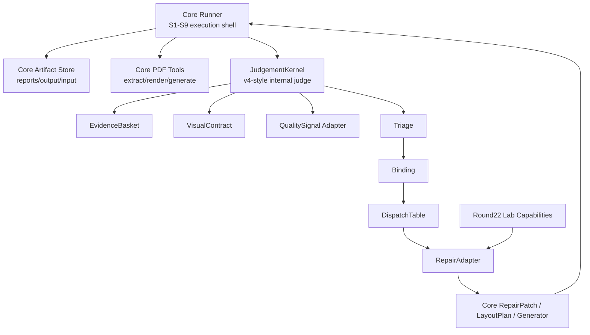

# PDF 语义翻译回填 Core / Round22 / V4 收敛问题分析与最小闭环

日期：2026-07-08

## 1. 本文目的

本文只解决一个问题：当前 `pdf_translation_workflow_core` 在合入 `round22_table_layout` 能力时，为什么容易破坏旧效果、为什么修宽场景困难，以及 `translation_layout_harness_engine_spike_v4` 是否能帮助解决这个问题。

本文不是新的执行流程文档，也不是替代 `PDF_语义翻译回填_标准流程设计.md` 的最终规范。它是一次架构诊断和收敛方案，后续若结论成立，再把稳定内容迁入标准流程、契约、工具和测试。

## 2. 明确假设

1. 当前最重要的问题不是翻译准确率，而是译文回填后的视觉布局、质量裁决、修复分发和闭环验证。
2. 翻译可以先保持简单：运行时只需要有语义可接受的 `semantic_translations.json`，暂不把后端翻译能力、术语库、跨页一致性作为主战场。
3. 人工中英文对照 PDF 只能作为运行后的离线评估资料，不能进入运行时 prompt、布局规划、质量 gate、修复参数或坐标来源。
4. `round22_table_layout` 是实验能力来源，不是产品流程本身。
5. `translation_layout_harness_engine_spike_v4` 复用了 MerqFin 的一些后端/Provider 思路，但它最有价值的部分不是翻译 Provider，而是判断内核：Evidence、QualitySignal、Triage、Binding、Dispatch、VisualContract、RepairLoop。
6. 当前目标不是把 v4 整包搬进 core，而是判断哪些 Interface 值得迁移，哪些 Implementation 只能作为参考。

## 3. 调研依据

### 3.1 当前 core

核心路径：

```text
pdf_translation_workflow_core
```

当前 core 已经具备：

```text
tools/run_semantic_product_quality_round.py
tools/probes/extract_pdf_structure.py
tools/planners/build_role_plan.py
tools/planners/build_layout_policy.py
tools/planners/build_layout_plan.py
tools/generators/generate_semantic_backfill.py
tools/validators/collect_visual_region_metrics.py
tools/validators/evaluate_pdf_quality.py
tools/repairs/build_repair_patch.py
tools/repairs/apply_repair_patch.py
contracts/state_machine.md
contracts/product_quality_contract.md
contracts/page_type_repair_matrix.md
prompts/templates/D1-D9
```

实盘证据显示，core 已有 S3-S9 工具链、`role_plan.json`、`layout_plan.json`、`visual_region_metrics.json`、`product_quality_gates.json` 和 `repair_patch_<n>.json`，也能执行 `Lx_RepairLoop`。

但 core 当前缺少一个深的判断 Module。它更多是“流程驱动工具串联”，而不是“质量信号 -> 疾病判断 -> 工具绑定 -> 修复验收”的内核。表现为：

1. `product_quality_gates.json` 能指出失败，但失败类型和修复工具之间还缺少强约束的疾病分发表。
2. `build_repair_patch.py` 能生成修复 patch，但 patch 的 Interface 仍偏浅，很多语义依赖外部约定和当前工具实现。
3. `S8_VerifyProductQuality` 与 `Lx_RepairLoop` 有流程记录，但缺少 v4 那种 JUDGE 内部的 Triage/Binding/Re-gather 结构。
4. 质量失败可以进入 loop，但 loop 选择的 repair atom 不一定对应真正的失败轴，导致“修了，但没有修到病灶”。
5. 新视觉能力合入时容易被全局套用，表格、正文、图片背景、标题、指标数字等不同问题没有被严格分层，导致修一个问题破坏另一个问题。

### 3.2 Round22

核心路径：

```text
pdf_translation_workflow_lab/rounds/round22_table_layout
```

round22 已经证明了一批有价值的排版能力：

```text
source-derived role classification
source-derived layout planning
table-like block split
table neighbor binding
table-region obstacle packing
vertical flow
section pushdown
filled panel compact layout
container layout
metric stack layout
source-derived font/spacing/color sampling
background sampling
local text overlap gate
source-relative font floor gate
all groups fit gate
```

但 round22 的问题也很明确：

1. 它是实验包，很多判断在 `generate_round22_layout_candidate.py`、`plan_roles.py`、`plan_layout.py` 中耦合在一起。
2. 它有能力，但没有形成可复用的核心判断 Interface。
3. 它的执行路径适合证明“这个样本能做得更好”，不适合作为产品主流程直接复制。
4. 它的修复选择更多是记录和人工推动，没有完全形成可重复的自动闭环。
5. 如果把 round22 的能力直接塞进 core 的 generator 或 planner，会继续出现“局部有效、全局难控”的问题。

### 3.3 V4

核心路径：

```text
D:\项目\开源项目\MerqFin\spikes\translation_layout_harness_engine_spike_v4
```

v4 的关键结构：

```text
translation_layout_harness/orchestrator/models.py
translation_layout_harness/orchestrator/transitions.py
translation_layout_harness/orchestrator/loop.py
translation_layout_harness/orchestrator/judge.py
translation_layout_harness/dispatch/table.py
translation_layout_harness/evaluation/visual_contract.py
translation_layout_harness/evaluation/aesthetic.py
translation_layout_harness/evaluation/role_similarity.py
translation_layout_harness/atoms/repair/relayout/relayout_slot.py
translation_layout_harness/orchestrator/document_repair_loop.py
```

v4 已有的关键 Interface：

```text
EvidenceBasket
QualitySignal
LayoutBinding
TriageRequest
TriageResult
BindingRequest
BindingResult
ToolSpec
JudgeDecision
BudgetState
DispatchEntry
CHECKPOINT_CONTRACTS
VisualContract
RoleSimilarityVector
```

v4 的主状态机：

```text
INTAKE -> PRODUCE -> JUDGE <-> REPAIR -> DECIDE
```

其中 `GATHER` 不是顶层状态，而是 JUDGE 内部 re-gather 动作。这个设计比把所有 loop 都平铺成主状态更清晰。

v4 的疾病分发表把问题拆得更细：

```text
l2_text_fit_overflow
l2_text_lost
l2_text_over_image
l2_cross_slot_overlap
l2_font_size_regression
l2_color_regression
l2_vertical_misplacement
l2_block_structure_regression
translation_segment_missing
translation_semantic_omission
```

我复跑了 v4 关键测试：

```text
tests/test_triage_binding.py
tests/test_p9m_document_repair_loop.py
tests/test_p9m7_visual_contract.py
tests/test_p9m4a_aesthetic_review.py
```

结果：

```text
26 passed
```

这说明 v4 的 Triage/Binding、文档级 repair loop、视觉契约和审美裁决基础结构当前是可执行的。

## 4. 问题本质

### 4.1 不是“某个布局工具不够强”

如果问题只是某个布局工具不够强，继续从 round22 搬函数到 core 就应该明显改善。但实际现象是：

1. 某些页面改善。
2. 某些表格页被破坏。
3. 某些图片背景页被擦坏。
4. 某些文本重排页仍然拥挤。
5. loop 执行了，但没有稳定地回到正确病灶。

这说明问题不是单点工具能力，而是判断和分发的 Interface 太浅。

### 4.2 当前 core 的浅 Interface

当前 core 的外层流程看起来完整：

```text
提取 -> 翻译 -> 布局 -> 生成 -> 质量 -> 修复 -> 复测
```

但关键 Interface 不够深：

```text
质量失败是什么病？
这个病属于内容轴、布局轴、图片轴、背景轴、表格轴，还是翻译轴？
这个病能否修？
应该调用哪个 repair atom？
repair atom 允许改哪些参数？
修复后验收哪个 checkpoint？
如果目标病改善但其他硬约束退化，能不能接受？
如果修复 no-op，下一轮怎么换病灶？
```

这些问题现在分散在：

```text
product_quality_gates.json
visual_region_metrics.json
visual_repair_plan.json
page_type_repair_matrix.md
D8 prompt
build_repair_patch.py
apply_repair_patch.py
runner 内部判断
```

这些文件都重要，但它们没有统一成一个深 Module。因此后续每加一个能力，就会在多个地方同时改，Locality 差。

### 4.3 Round22 的能力缺少稳定 Seam

round22 的实际价值不是“某个最终 PDF”，而是：

```text
从当前源页提取 role
按当前源页几何推导布局
把表格/容器/正文/指标数字分开处理
用当前源页证据控制字体、宽度、避让和顺序
```

这些能力应该成为 core 的内部 Module，而不是把 round22 runner 或 generator 直接复制进去。

否则 generator 会越来越大，所有角色、布局、质量、修复逻辑都混在一个 Implementation 里，任何修复都会影响全局。

### 4.4 v4 解决的是判断内核，不是直接产品化路径

v4 的优势：

1. 状态机更小、更清晰。
2. JUDGE 内部有 Triage/Binding。
3. 疾病和工具有静态分发表。
4. repair tool 有 checkpoint contract。
5. VisualContract 和 RoleSimilarity 是源文-候选对比，不是固定阈值。
6. QualitySignal 让规则、LLM、工具输出能进入同一个信号池。
7. BudgetState 能约束 loop 次数、re-gather 次数和裁决次数。

v4 的限制：

1. 它复用了 MerqFin 的 Provider/Backend 思路，直接搬入独立测试目录会引入不必要复杂度。
2. 它不是当前 `pdf_translation_workflow_core` 的产品执行路径。
3. 它的 `repair_page_reflow` 当前在 v4 中仍标注为实验 helper，没有正式进入 `DISPATCH_TABLE`。
4. 它的真实 PDF 生成链路不等同于我们当前 core 的语义回填工具链。

所以，v4 不能整体替换 core，但 v4 的判断内核值得迁移。

## 5. 架构判断

### 5.1 不建议继续“直接搬 round22 工具到 core”

原因：

1. 这会让 core 的 planner/generator 继续变胖。
2. gate 与 repair 的映射仍然靠文档和 runner 约定。
3. 新能力会继续绕过统一疾病分发。
4. 表格、正文、图片背景、标题层级仍可能互相破坏。
5. 很难证明不过拟合，因为判断散落在多个脚本中。

### 5.2 不建议整体改用 v4

原因：

1. 当前 core 已经有大量真实执行资产：输入目录、输出目录、标准流程、prompt、tools、regression、spike 验证、样本。
2. v4 的 Provider 和 MerqFin 接入能力不是当前最小目标。
3. 直接换 v4 会引入迁移风险，且不能保证立刻复现 round22 视觉效果。
4. 用户当前需要的是 PDF 回填工作流可验证闭环，不是平台重建。

### 5.3 推荐：Interface 收敛，Implementation 渐进迁移

推荐路线：

```text
core 保留为产品执行壳
v4 提供判断内核 Interface
round22 提供可迁移的排版能力 Implementation
```

也就是说，两者逐步靠拢，但不是目录合并，也不是谁替代谁。收敛点应该是 Interface：

```text
EvidenceBasket
QualitySignal
VisualContract
TriageRequest / TriageResult
BindingRequest / BindingResult
DispatchTable
RepairCheckpoint
RoleSimilarityVector
```

core 的 `S8/Lx` 应该吸收 v4 的 JUDGE 内核，而不是继续把所有质量和修复逻辑堆在 `evaluate_pdf_quality.py`、`plan_visual_region_repairs.py`、`build_repair_patch.py` 和 runner 里。

## 6. 目标架构

### 6.1 保留 core 的外部 Interface

短期不改外部入口：

```text
python pdf_translation_workflow_core/tools/run_semantic_product_quality_round.py
  --round-id <run_id>
  --source-dir <source_pdf_dir>
  --semantic-dir <semantic_translations_dir>
  --input-dir <input_dir>
  --output-dir <output_dir>
  --report-dir <report_dir>
  --max-repair-loops <n>
```

外部仍然看到：

```text
source_extraction.json
semantic_translations.json
layout_policy.json
role_plan.json
layout_plan.json
candidate PDF
candidate_generation_evidence.json
visual_region_metrics.json
product_quality_gates.json
repair_loop_<n>.json
final_verdict.json
```

### 6.2 在 S8 内部引入 JudgementKernel

新增或抽象一个内部深 Module：

```text
JudgementKernel
```

它的 Interface：

```text
input:
  source_pdf
  candidate_pdf
  source_extraction.json
  role_plan.json
  layout_plan.json
  candidate_generation_evidence.json
  visual_region_metrics.json
  product_quality_gates.json
  current budget

output:
  visual_contract_bundle
  quality_signals
  triage_result
  binding_result
  judge_decision
  repair_dispatch
  checkpoint_contract
```

它隐藏的 Implementation：

```text
source/candidate visual contract builder
quality gate to QualitySignal adapter
rule hard-negative collector
optional LLM adjudication prompt builder
disease triage
repair tool binding
budget and loop policy
```

### 6.3 S8/Lx 的新内部活动

现有主状态机可以不推翻，但 S8 内部要细化为：

```text
S8A BuildVisualContract
  -> source_visual_contract.json
  -> current_visual_contract.json
  -> visual_contract_delta.json

S8B CollectQualitySignals
  -> quality_signals.json

S8C TriageDisease
  -> triage_request.json
  -> triage_result.json

S8D BindRepairTool
  -> binding_request.json
  -> binding_result.json
  -> judge_decision.json

S8E Decide
  -> accept / repair / fail / gather
```

当 `S8E` 输出 repair：

```text
Lx_RepairLoop
  -> build_repair_patch.py 或正式 RepairAdapter
  -> apply repair
  -> regenerate candidate
  -> rerun S8A-S8E
```

当 `S8E` 输出 gather：

```text
S8 internal re-gather
  -> 补采样 / 补裁剪 / 补 visual evidence
  -> 回到 S8B 或 S8C
```

这个 gather 不应成为新的顶层状态，避免状态机膨胀。

## 7. 疾病分层建议

### 7.1 轴分类

建议把质量问题分成五个轴：

| 轴 | 说明 | 是否可由翻译修复 |
|---|---|---|
| content_axis | 缺段、错段、语义遗漏 | 是 |
| layout_axis | 溢出、重叠、错位、块结构破坏 | 否，优先布局修 |
| typography_axis | 字号层级、行距、段距、权重 | 否，优先样式修 |
| background_axis | 擦除残留、图片破坏、背景色块 | 否，优先重绘/背景采样修 |
| table_chart_axis | 表格、图例、图表、矩阵结构 | 通常否，优先结构保护 |

### 7.2 首批最小疾病集

不要一开始全量迁移 v4 疾病。建议最小闭环只选 4 个：

| disease | 来源 | 典型症状 | repair 方向 |
|---|---|---|---|
| `l2_cross_slot_overlap` | v4 | 文字压文字、文字侵入相邻块 | reflow / obstacle pack / expand slot |
| `l2_font_size_regression` | v4 | 为塞 bbox 把关键标题/指标压得过小 | source-relative font floor + expand/reflow |
| `l2_block_structure_regression` | v4 | 表格、图表、面板结构被破坏 | table/graphic hard-slot preservation |
| `l2_text_over_image` | v4 | 前景文字回填破坏图片或复杂底图 | image-overlay background preserve |

翻译轴保留两个：

| disease | 说明 | repair 方向 |
|---|---|---|
| `translation_segment_missing` | 明确缺译一个 source unit | patch missing segment |
| `translation_semantic_omission` | 语义覆盖不足 | retranslate/backfill |

### 7.3 gate 到 disease 的映射

| 当前 core gate / finding | 目标 disease | 说明 |
|---|---|---|
| `local_text_overlap` | `l2_cross_slot_overlap` | 文字与文字或槽位重叠 |
| `insertion_collision` | `l2_cross_slot_overlap` | 生成插入之间互相碰撞 |
| `source_relative_font_floor` | `l2_font_size_regression` | 相对源文层级过小 |
| `table_text_legibility` | `l2_block_structure_regression` 或 `l2_text_fit_overflow` | 先判断是否结构破坏，再判断是否单元格 fit |
| `background_residue_artifact` | `l2_color_regression` 或 `l2_text_over_image` | 如果破坏复杂图片，优先 `text_over_image` |
| `image_color_integrity` | `l2_text_over_image` | 图片底图被擦坏 |
| `source_anchor_order` | `l2_block_structure_regression` 或 `l2_vertical_misplacement` | 阅读顺序或块结构错乱 |
| `semantic_coverage` | `translation_segment_missing` / `translation_semantic_omission` | 必须拆开缺段与语义遗漏 |

## 8. Repair 分发原则

### 8.1 大模型只裁决 disease，不直接选任意工具

如果使用后端大模型，prompt 只能让模型在候选 disease 中选择、解释证据、给出置信度。工具选择必须由静态 DispatchTable 决定。

原因：

1. 可审计。
2. 可测试。
3. 防止模型绕过工具契约。
4. 防止模型为了“看起来合理”选择不存在或错误工具。

### 8.2 Binding 只暴露 repair knobs

BindingRequest 给模型或规则看到的 ToolSpec 不能暴露任意文件写入能力，只能暴露 repair knobs，例如：

```text
allow_expand_slot
allow_font_floor_repair
allow_table_obstacle_pack
allow_image_overlay_background_preserve
max_vertical_shift_from_source_band
max_loop_count
```

具体 PDF 写入、文件路径、目录边界、候选生成仍由 runner 和工具负责。

### 8.3 Checkpoint 必须按 disease 验收

不能只看整页相似度或 PDF 存在。每个 repair 之后必须验收目标 disease：

```text
before_metric
after_metric
target_disease_improved
no_new_p1_regression
accepted / rejected / rollback
```

示例：

```text
l2_cross_slot_overlap:
  checkpoint = overlap_area 或 overlapping_pair_count 降低
  hard reject = 新增 text_lost / text_over_image / table intrusion

l2_font_size_regression:
  checkpoint = role_similarity font hierarchy 改善
  hard reject = 关键文本变成不可读或进入图片区域

l2_text_over_image:
  checkpoint = image background delta 降低
  hard reject = 可抽取前景文字缺失
```

## 9. 反过拟合规则

### 9.1 允许的参数来源

参数只能来自当前运行：

```text
source page geometry
candidate page geometry
source/candidate rendered pixels
source text font stats
source/candidate bbox adjacency
drawing objects
image blocks
table-like geometry
current language direction
current semantic translations length ratio
current gate evidence
```

### 9.2 禁止的参数来源

禁止：

```text
文件名
公司名
固定页码
固定年份
固定文本
人工对照 PDF 坐标
历史 round 输出
特定样本的颜色常量
特定样本的财务术语白名单
```

### 9.3 数值阈值如何避免过拟合

数值阈值不是一律禁止。禁止的是样本绑定常量。允许三类数值：

1. PDF 几何通用下限，例如 bbox 合法、页边界、非负面积。
2. 从当前源页统计出来的相对阈值，例如 source font quantile、source line gap median、source role hierarchy ratio。
3. 有 schema 和测试保护的保守默认值，但必须能被当前页证据覆盖，不能绑定文件/页码/文本。

建议规则：

```text
hard-coded constant -> 只能用于通用安全边界
source-derived ratio -> 可用于质量判断
sample-derived value -> 禁止进入 core
reference-derived coordinate -> 禁止进入 core
```

## 10. 最小验证闭环

### 10.1 目标

最小闭环不是一次性达到产品质量 PASS，而是证明：

```text
同一个失败能被结构化识别为 disease
disease 能确定性绑定 repair tool
repair tool 能执行
执行后能重新生成候选
候选能被同一 disease checkpoint 复测
目标 disease 指标改善或诚实失败
全程没有引入样本过拟合证据
```

### 10.2 最小输入

建议使用一个最小输入，而不是全矩阵：

```text
pdf_translation_workflow_lab/rounds/round22_table_layout/input/source_pdfs/00005_2025_annual_report_zh_pages_003_005_006.pdf
```

原因：

1. 页 3/5/6 已暴露标题、指标、面板、正文增长、容器布局问题。
2. 页数少，能快速迭代。
3. 不依赖人工英文对照作为运行输入。
4. 可在运行后用人工英文对照离线评估，但不进入 runtime。

### 10.3 最小执行命令

以当前 core 外部入口为壳：

```powershell
python pdf_translation_workflow_core\tools\run_semantic_product_quality_round.py `
  --round-id kernel_tracer_00005_pages_003_005_006 `
  --source-dir <source_pdf_dir> `
  --semantic-dir <semantic_translations_dir> `
  --input-dir <run_input_dir> `
  --output-dir <run_output_dir> `
  --report-dir <run_report_dir> `
  --max-repair-loops 1
```

### 10.4 必须新增或物化的证据

最小闭环必须产生：

```text
source_visual_contract.json
current_visual_contract.json
visual_contract_delta.json
quality_signals.json
triage_request.json
triage_result.json
binding_request.json
binding_result.json
judge_decision.json
dispatch_trace.json
repair_checkpoint_before.json
repair_checkpoint_after.json
repair_acceptance.json
anti_overfit_scan.json
```

如果没有这些文件，只能证明“流程跑了”，不能证明“判断内核成立”。

### 10.5 最小通过标准

第一阶段不要求 product quality PASS。要求：

| 项 | 通过标准 |
|---|---|
| process contract | PASS |
| candidate generation | PASS |
| visual contract | source/current/delta 三件套存在 |
| quality signals | 至少一个 blocking signal 有 source/candidate 证据 |
| triage | blocking signal 被映射到最小 disease 集之一 |
| binding | disease 通过 DispatchTable 绑定唯一 repair tool |
| repair | `operation_count > 0` 或明确 `unrepairable_reason` |
| rejudge | repair 后重新生成 candidate 并重跑同一 checkpoint |
| acceptance | 目标 disease 改善，且无新增 P1 hard regression |
| anti-overfit | 不引用文件名、页码、固定文本、人工对照坐标 |

### 10.6 失败也算有效的条件

以下失败是有效闭环：

```text
disease identified
repair tool bound
repair attempted
checkpoint shows no improvement
rollback or reject recorded
terminal_state = S_FAIL_QUALITY
```

以下失败不是有效闭环：

```text
只生成 candidate，没有 disease
只写 repair plan，没有执行 repair
repair no-op 却算成功
换了候选但没有重跑同一 gate
product FAIL 但没有可追溯 disease
使用人工对照 PDF 坐标修复
```

## 11. 迁移阶段建议

### 阶段 A：只迁 Interface，不迁复杂 Implementation

新增或固化以下 schema：

```text
QualitySignal
VisualContract
TriageRequest
TriageResult
BindingRequest
BindingResult
JudgeDecision
DispatchEntry
RepairCheckpoint
BudgetState
```

验收：

```text
schema tests pass
现有 core runner 输出不变
旧 regression 不被破坏
```

### 阶段 B：把 current gates 适配为 QualitySignal

写 Adapter：

```text
product_quality_gates.json + visual_region_metrics.json
  -> quality_signals.json
```

验收：

```text
每个 blocking gate 都能对应一个 QualitySignal
每个 QualitySignal 都有 evidence_refs
没有 evidence_refs 的信号不得进入 Triage
```

### 阶段 C：引入最小 DispatchTable

先只支持 4 个 layout disease + 2 个 translation disease：

```text
l2_cross_slot_overlap
l2_font_size_regression
l2_block_structure_regression
l2_text_over_image
translation_segment_missing
translation_semantic_omission
```

验收：

```text
每个 disease 有唯一默认 repair tool
每个 repair tool 有 checkpoint contract
未知 disease 不能悄悄 fallback 到通用修复
```

### 阶段 D：把 round22 能力拆成 RepairAdapter

不要把 round22 generator 直接搬进 core。应拆成：

```text
role classification adapter
layout planning adapter
table obstacle pack adapter
vertical flow adapter
image overlay background preserve adapter
font hierarchy repair adapter
```

每个 Adapter 必须满足：

```text
输入当前运行证据
输出有限 repair knobs 或 layout delta
不直接读取人工对照
不引用固定页码/文本/颜色
有 checkpoint
```

### 阶段 E：跑最小闭环

只跑：

```text
00005_2025_annual_report_zh_pages_003_005_006.pdf
```

要求闭环证据齐全。不要求整本质量通过。

### 阶段 F：跑 1-20 页泛化

最小闭环通过后，再跑：

```text
00005_2025_annual_report_zh_pages_001_020.pdf
```

要求：

```text
问题能归类
失败能追溯
repair 不破坏表格/图片/背景
product PASS 不是必须，但不能无病灶失败
```

### 阶段 G：独立 spike 验证

在 `spikes/spikeXX` 中只提供：

```text
pdf_translation_workflow_core
标准流程文档
当前收敛文档或迁移后的标准流程
source PDFs
semantic translations 或简单 translation provider
空 docs/output 和 docs/reports
```

新的 Codex 不允许改框架，只能按 Interface 执行。如果失败，必须能说明是：

```text
schema 缺失
disease 未覆盖
repair adapter 不存在
checkpoint 不充分
runner 调度错误
产品质量真实失败
```

## 12. 对当前计划的修正建议

当前 `Round22_合入_Core_计划.md` 的方向是对的，但还不够完整。它把重点放在：

```text
RolePlan
LayoutPlan
RepairPatch
QualityGate
Regression
```

这些都是必要项，但还缺一个明确的 JudgementKernel 阶段。

建议在现有计划中插入：

```text
阶段 4B-0：引入 v4-style JudgementKernel Interface
阶段 4B-1：current gate -> QualitySignal adapter
阶段 4B-2：QualitySignal -> disease triage
阶段 4B-3：disease -> repair binding / checkpoint contract
阶段 4B-4：round22 repair ability behind adapter
阶段 4B-5：same disease remeasure acceptance / rollback
```

否则继续执行 4B，会再次变成“把视觉工具迁进去”，而不是“把可控判断闭环迁进去”。

## 13. 为什么这能解决当前问题

### 13.1 表格被破坏

当前现象：

```text
为了解决文本拥挤，引入视觉重排，结果表格页被破坏。
```

新架构下：

```text
table_text_legibility 或 table_region_intrusion
  -> l2_block_structure_regression
  -> table/graphic hard-slot repair
```

正文扩框不会自动应用到表格轴。表格是 hard slot，只有表格 adapter 可以修改。

### 13.2 图片背景被擦坏

当前现象：

```text
浮在图片上的 PDF text object 被误当作图片文字，或 redaction 直接盖坏背景。
```

新架构下：

```text
image block overlap + extractable text object
  -> l2_text_over_image
  -> image_overlay_background_preserve repair
```

照片像素内的文字仍保留；PDF 前景文字仍翻译回填，但背景修复由 image-aware adapter 处理。

### 13.3 字体过小或文字挤压

当前现象：

```text
中译英文本变长后强塞 bbox，字号变小或文字压文字。
```

新架构下：

```text
source_relative_font_floor
  -> l2_font_size_regression
  -> expand/reflow first, shrink second
```

对于 fluid body，bbox 是 anchor，不是硬容器。对于 constrained slot，bbox 才是硬约束。

### 13.4 loop 走了但没有修好

当前现象：

```text
repair_loop_<n>.json 存在，但视觉效果仍差，甚至退化。
```

新架构下：

```text
repair 必须绑定 disease checkpoint
repair 后必须重新测同一 disease
未改善则 reject/rollback
不能把 no-op 记为成功
```

## 14. 风险和控制

### 14.1 v4 迁移过大

风险：

```text
把 v4 Provider、backend adapter、knowledge provider 一起搬入 core，导致复杂度爆炸。
```

控制：

```text
只迁判断 Interface，不迁 MerqFin Provider。
translation 暂用 semantic_translations.json 作为 TranslationProvider adapter。
```

### 14.2 round22 能力过拟合

风险：

```text
把 round22 中对 00005 样本有效的规则写死进 core。
```

控制：

```text
所有规则必须引用当前页 source/candidate 证据。
新增 scan_core_overfit 检查。
新增 adapter 输入输出 schema。
任何人工对照坐标不得进入 runtime artifact。
```

### 14.3 状态机膨胀

风险：

```text
把 Triage、Binding、Gather 都变成顶层状态，流程更复杂。
```

控制：

```text
保持 core 顶层 S1-S9。
Triage/Binding/Gather 只作为 S8 内部活动。
```

### 14.4 产品质量短期仍 FAIL

风险：

```text
引入新架构后短期仍然不能一次性 PASS。
```

控制：

```text
第一目标是可解释闭环，不是立即全 PASS。
只要 disease、dispatch、repair、checkpoint、rollback 可靠，后续能力可以逐步加深。
```

## 15. 最小验收清单

第一轮收敛成功的定义：

```text
[ ] 不修改外部 runner Interface
[ ] 生成 source/current visual contract
[ ] 生成 quality_signals.json
[ ] 至少一个 blocking gate 映射到 disease
[ ] disease 通过 DispatchTable 绑定 repair tool
[ ] repair tool 有 checkpoint contract
[ ] repair 后重新生成 candidate
[ ] repair 后重新测同一 disease
[ ] 改善则 accepted，未改善则 rejected/rollback
[ ] process_contract_verdict 与 product_quality_verdict 分开记录
[ ] anti-overfit scan PASS
[ ] 不使用人工对照 PDF 作为 runtime 输入
```

## 16. 结论

我的判断：

1. 当前问题不是继续补一个布局函数能解决的，而是 core 缺少深的判断 Module。
2. round22 的价值是排版能力，不是流程架构。
3. v4 的价值是判断内核，不是直接产品替换。
4. 最合理路线是：core 保持产品流程壳，v4 的判断 Interface 渐进迁入，round22 的能力拆成受 DispatchTable 控制的 RepairAdapter。
5. 翻译能力暂时不要深挖，先让 `semantic_translations.json` 作为简单 TranslationProvider adapter；把主要精力放在视觉质量、疾病分发、修复闭环和反过拟合。
6. 下一步不应继续直接执行 `Round22_合入_Core_计划.md` 的 4B，而应先补一个 `4B-0 JudgementKernel Interface` 阶段，完成最小 disease/dispatch/checkpoint 闭环后再迁 round22 的具体排版能力。

这条路线的核心不是“两套东西慢慢靠近代码目录”，而是“在 Interface 上收敛”。只要 Interface 稳，Implementation 可以来自 core、round22 或 v4；如果 Interface 不稳，任何能力合入都会继续变成局部补丁。

## 17. 先回答：哪一块该用谁

这一节把主责关系说清楚。后续所有设计都按这个表收敛。

| 流程环节 | 主责来源 | 原因 | 当前产物 | 不够用时怎么办 |
|---|---|---|---|---|
| 运行入口、目录边界、状态 trace、operation log、最终 verdict | core | core 已经有真实执行器和独立测试目录约束，能产出可审计 artifacts | `run_semantic_product_quality_round.py`、`state_trace.json`、`operation_log.jsonl`、`final_verdict.json` | 不换 v4；只加内部 Module，不改外部 runner Interface |
| PDF 提取、渲染、候选生成、输出 PDF | core | core 已经和当前 PDF 回填路径、样本、regression、spike 包绑定 | `extract_pdf_structure.py`、`generate_semantic_backfill.py`、`render_pdf.py` | 若 generator 能力不足，先在 lab 写 Adapter，验证后迁入 core |
| 翻译语义物化 | core 简化处理 | 当前重点不是翻译模型，先让 `semantic_translations.json` 成为稳定输入 | `validate_semantic_translations.py`、`assemble_semantic_translations.py` | 只有缺译/伪译/语义覆盖失败才回 S5；不要用重翻译解决布局问题 |
| 页面角色识别与布局规划 | core + round22 adapter | core 已有 `role_plan/layout_plan` 链路；round22 有更强的局部布局经验 | `build_role_plan.py`、`build_layout_plan.py`、round22 `plan_roles.py/plan_layout.py` | round22 规则不能直接散落进 generator，必须封装成 Role/Layout Adapter |
| 质量证据归一化 | v4-style Interface | core 现在 gate 多但信号格式散；v4 的 `QualitySignal` 可统一规则、大模型和工具证据 | 新增 `quality_signals.json` | 如果现有 gate 无法表达，先新增 signal adapter，不先新增 repair |
| 源文-候选视觉对比 | v4-style VisualContract | core 有 visual metrics，但缺统一的 source/current/delta 契约；v4 已有 VisualContract 思路 | 新增 `source_visual_contract.json`、`current_visual_contract.json`、`visual_contract_delta.json` | 如果指标不够，扩 VisualContract；不要直接调阈值让 gate PASS |
| 研判“这是什么病” | v4-style Triage | 当前 D7/D8 prompt 太长，容易把症状、病因、工具混在一起；v4 把 Triage 保持为 JUDGE 内部动作 | 新增 `triage_request.json`、`triage_result.json` | 若 disease 集不够，先扩 disease taxonomy，并加 schema/test |
| 绑定“用哪个工具修” | v4-style Binding + DispatchTable | 工具选择必须确定性，不能让模型直接自由选工具 | 新增 `binding_request.json`、`binding_result.json`、`dispatch_trace.json` | 若没有工具，输出 `unrepairable_reason` 或进入 lab Adapter，不在 core 临时写特殊分支 |
| 具体修复能力 | core repair + round22 Adapter | core 有 RepairPatch 闭环；round22 有实际排版修复经验 | `build_repair_patch.py`、`apply_repair_patch.py`、future RepairAdapter | 先在 lab 验证成 Adapter，再进 core |
| 修复后验收 | v4-style checkpoint + core rerun | core 能重跑 S7/S8；v4 有 CHECKPOINT_CONTRACTS 思路 | `repair_checkpoint_before.json`、`repair_checkpoint_after.json`、`repair_acceptance.json` | 修复无改善必须 reject/rollback；不能因为有新 PDF 就算修复成功 |
| 泛化验证、抗过拟合验证 | core regression + independent spike | core 已有 regression runs；spike 能验证新 Codex 是否按文档执行 | `pdf_translation_workflow_regression/runs`、`spikes/spikeXX` | 失败要回到 Interface/Adapter 补设计，不能把失败样本写死进 core |

最重要的一句话：

```text
core 是产品执行壳；v4 是判断内核设计来源；round22 是排版能力实验来源；lab 是新 Adapter 孵化区。
```

如果两者都不够用，不直接在 core 里补丁式修。正确流程是：

```text
发现新失败 -> 判断现有 disease 是否能表达
  -> 不能表达：扩 disease / QualitySignal / VisualContract schema
  -> 能表达但无工具：在 lab 新建 RepairAdapter 实验
  -> 工具有效：加入 DispatchTable + checkpoint contract
  -> core 接入 Adapter
  -> regression + independent spike 验证
```

## 18. V4 关键能力逐项解释

下面不是罗列对象名，而是说明每个对象解决什么具体问题、适合迁入什么、不能迁入什么。

### 18.1 EvidenceBasket

含义：

```text
一次判断中所有可被引用的证据池。
```

解决的问题：

1. 防止大模型或规则“凭空裁决”。
2. 防止 D7/D8 prompt 引用不存在的截图、bbox、gate 或 metric。
3. 让 `JudgeDecision.used_evidence_ids` 能反查到真实 artifact。

当前 core 的对应能力：

```text
state_trace.json
operation_log.jsonl
candidate_generation_evidence.json
visual_region_metrics.json
product_quality_gates.json
visual_adjudication.json
```

core 的缺口：

这些 evidence 是文件级存在的，但没有统一 EvidenceBasket Interface。结果是每个工具各自读自己想读的 JSON，D7/D8 prompt 也难以验证“引用是否真实存在”。

迁移方式：

不需要照搬 v4 类。core 应新增 `evidence_basket.json` 或在 runner 内部构造同等结构，字段至少包括：

```json
{
  "evidence_id": "string",
  "kind": "source_extraction|candidate_generation|visual_metric|quality_gate|render_crop|repair_result",
  "path": "relative/path.json",
  "summary": {},
  "sha256": "string"
}
```

### 18.2 QualitySignal

含义：

```text
把不同来源的质量发现统一成一个“问题信号”。
```

解决的问题：

当前 core 中失败来源很多：

```text
product_quality_gates.json
visual_region_metrics.role_gates
visual_adjudication.dimensions
semantic_translation_validation.json
candidate_generation_evidence.insertions
```

如果没有 QualitySignal，D8 必须同时理解所有文件 schema，prompt 会越来越长，工具也会越来越耦合。

QualitySignal 应解决：

1. 规则发现和视觉裁决发现统一。
2. semantic failure 和 layout failure 分开。
3. 每个 signal 都有 severity、axis、evidence refs。
4. 后续 Triage 不再直接读所有原始文件。

建议 core schema：

```json
{
  "signal_id": "qs_0001",
  "axis": "content|layout|typography|background|table_chart|image",
  "defect_type": "local_text_overlap|table_text_legibility|background_residue_artifact|semantic_coverage",
  "severity": "info|warn|blocking",
  "page_index": 0,
  "region_ids": ["r1"],
  "evidence_refs": ["visual_region_metrics.json#role_gates[0]"],
  "source_metric": {},
  "candidate_metric": {},
  "anti_overfit_basis": "current-run evidence only"
}
```

迁移方式：

先写 Adapter：

```text
product_quality_gates.json + visual_region_metrics.json + visual_adjudication.json
  -> quality_signals.json
```

不要一开始改 `evaluate_pdf_quality.py` 的全部逻辑。

### 18.3 LayoutBinding

含义：

```text
源文区域、译文插入区域、渲染后候选区域之间的绑定关系。
```

解决的问题：

我们当前很多视觉问题本质是“源文-候选没有稳定绑定”：

1. 不知道 candidate 里某块文字来自哪个 source unit。
2. 不知道某个失败 gate 应该修哪个布局块。
3. 不能判断“译文是否保持源文角色相似”。
4. 修复时无法精确定位 target scope。

当前 core 的对应能力：

```text
candidate_generation_evidence.insertions[*].source_unit_ids
layout_plan.pages[*].regions[*]
source_extraction.pages[*].text_lines
visual_region_metrics.region_metrics[*]
```

core 的缺口：

这些字段之间没有统一 join contract。不同工具可能用 `unit_id`、`region_id`、`line_id`、`group_id`，导致 repair target scope 不稳定。

建议 core schema：

```json
{
  "binding_id": "lb_0001",
  "source_unit_ids": ["p0_l12"],
  "role_plan_group_id": "g0_12",
  "layout_region_id": "lr0_12",
  "candidate_insertion_id": "ins_0_12",
  "rendered_region_id": "rr_0_12",
  "source_bbox": [0, 0, 0, 0],
  "target_bbox": [0, 0, 0, 0],
  "rendered_bbox": [0, 0, 0, 0],
  "confidence": 0.0,
  "failure_if_unbound": "LAYOUT_BINDING_UNRESOLVED"
}
```

迁移方式：

先让 core 生成 `layout_bindings.json`，再让 VisualContract、QualitySignal 和 RepairPatch 都引用它。

### 18.4 TriageRequest / TriageResult

含义：

```text
Triage 只回答“这是什么病”，不回答“调用哪个工具”。
```

解决的问题：

当前 D8 prompt 同时做：

```text
读失败 -> 判断病因 -> 选工具 -> 选状态 -> 解释 loop -> 避免重翻译 -> 避免过拟合
```

这导致 prompt 过长、职责过宽，也导致大模型可能把布局问题误判成翻译问题。

Triage 应输入：

```text
quality_signals
visual_contract_delta
layout_bindings
候选 disease 列表
budget
```

Triage 应输出：

```json
{
  "selected_disease": "l2_cross_slot_overlap",
  "axis": "layout",
  "confidence": 0.86,
  "evidence_refs": ["qs_0001", "visual_contract_delta.json#slots[3]"],
  "reject_other_diseases": [
    {"disease": "translation_semantic_omission", "reason": "semantic validation passed"}
  ]
}
```

迁移方式：

第一阶段可以不用大模型，先用 deterministic rule 生成 TriageResult。等 schema 稳定后再让模型参与。

### 18.5 BindingRequest / BindingResult

含义：

```text
Binding 只回答“这个 disease 绑定哪个 repair tool，以及允许哪些 repair knobs”。
```

解决的问题：

防止模型或 prompt 直接自由选择工具。工具必须来自 DispatchTable。

Binding 应输入：

```text
TriageResult
DispatchTable
ToolSpec
BudgetState
```

Binding 应输出：

```json
{
  "disease": "l2_cross_slot_overlap",
  "tool": "region_collision_layout_repair",
  "target_state": "S6_LayoutPlan",
  "repair_knobs": {
    "allow_expand_slot": true,
    "allow_obstacle_pack": true,
    "allow_font_shrink": false
  },
  "checkpoint_contract": "cross_slot_overlap_checkpoint_v1"
}
```

迁移方式：

core 的 `page_type_repair_matrix.md` 和 D8 prompt 里已有很多映射，但它们现在是文档/prompt 规则。应收敛成 JSON DispatchTable，D8 prompt 只解释，不直接决定。

### 18.6 ToolSpec

含义：

```text
修复工具对外暴露的最小可控参数。
```

解决的问题：

防止 repair patch 变成任意 JSON 修改器。工具只暴露 knobs，不暴露随意写文件、随意改 bbox、随意改阈值。

示例：

```json
{
  "tool": "region_collision_layout_repair",
  "allowed_params": {
    "max_vertical_shift_ratio": {"type": "number", "source": "current_page_geometry"},
    "allow_expand_slot": {"type": "boolean"},
    "forbidden": ["fixed_page_number", "literal_text", "reference_pdf_coordinate"]
  }
}
```

迁移方式：

为 core 现有 repair atom 建立 ToolSpec：

```text
constrained_slot_layout_fit_repair
expandable_text_slot_reflow_repair
background_residue_fill_resample
image_redaction_exclusion_repair
metric_value_font_hierarchy_repair
target_composition_body_reflow_repair
```

### 18.7 JudgeDecision

含义：

```text
JUDGE 对外唯一决策信封。
```

解决的问题：

当前 core 中判断分散在：

```text
visual_adjudication.json
product_quality_gates.json
visual_repair_plan.json
repair_loop_<n>.json
final_verdict.json
```

这些文件都存在，但缺少一个“本轮为什么进入 repair / fail / accept”的统一决策信封。

建议 core schema：

```json
{
  "decision_id": "judge_0001",
  "next_action": "accept|repair|fail|gather",
  "selected_disease": "l2_cross_slot_overlap",
  "selected_tool": "region_collision_layout_repair",
  "used_evidence_ids": ["qs_0001", "vc_delta_0001"],
  "content_findings": [],
  "layout_findings": [],
  "hard_negatives": [],
  "confidence": 0.0,
  "reason": "string"
}
```

### 18.8 BudgetState

含义：

```text
约束 loop、re-gather、模型裁决和修复尝试次数。
```

解决的问题：

当前 `--max-repair-loops` 只能约束 repair loop 总轮数，但不能表达：

```text
还能不能补证据？
还能不能调用模型？
这个 disease 是否已经尝试过？
这个 repair atom 是否 no-op 过？
是否应该换下一个 disease？
```

建议 core 增加：

```json
{
  "max_repair_loops": 2,
  "repair_loop_index": 1,
  "max_regather": 1,
  "regather_count": 0,
  "max_triage_calls": 1,
  "triage_calls": 0,
  "attempted_disease_tool_pairs": [
    ["l2_cross_slot_overlap", "region_collision_layout_repair"]
  ]
}
```

### 18.9 DispatchEntry / CHECKPOINT_CONTRACTS

含义：

```text
DispatchEntry：disease 到 tool 的确定性映射。
CHECKPOINT_CONTRACTS：tool 修完后必须验证什么。
```

解决的问题：

当前 core 的 gate 到 repair 关系散在文档、prompt 和工具里，难以证明“每个阻断失败都有可执行修复或诚实失败”。

建议 core 最小 DispatchTable：

```json
{
  "l2_cross_slot_overlap": {
    "tool": "region_collision_layout_repair",
    "target_state": "S6_LayoutPlan",
    "checkpoint": "overlap_pair_count_decreases"
  },
  "l2_font_size_regression": {
    "tool": "font_hierarchy_repair",
    "target_state": "S6_LayoutPlan",
    "checkpoint": "source_relative_font_floor_improves"
  },
  "l2_text_over_image": {
    "tool": "image_overlay_background_preserve",
    "target_state": "S7_GenerateCandidate",
    "checkpoint": "image_background_delta_decreases"
  }
}
```

### 18.10 VisualContract

含义：

```text
源文和候选译文的视觉契约，包括页面、角色、槽位、字体、颜色、位置、阅读顺序和 delta。
```

解决的问题：

当前 core 的 visual metrics 偏“发现问题”，但缺少一个“源文期望视觉结构是什么”的统一模型。

VisualContract 应回答：

```text
源文有哪些视觉角色？
每个角色的源位置、字号、颜色、行距、段距、层级是什么？
候选是否保持了角色相似性？
哪些变化是目标语自然变化？
哪些变化是硬约束破坏？
```

### 18.11 RoleSimilarityVector

含义：

```text
按角色比较源文和候选的相似度，不用固定字号、固定坐标作为主判断。
```

解决的问题：

用户反复指出的问题是：不应该强塞 bbox，也不应该用写死字号。RoleSimilarityVector 的价值是让判断基于“角色相对关系”：

```text
标题仍然像标题
正文仍然像正文
指标数字仍然比说明文字突出
表格仍然是表格
图片仍然没有被破坏
```

这比“字号必须等于多少 pt”更泛化。

## 19. 当前 core 能力、优点和缺点

### 19.1 core 已经有的能力

| 能力 | 文件/模块 | 优点 |
|---|---|---|
| 状态机和执行器 | `run_semantic_product_quality_round.py` | 能串联 S3-S9，能写 trace、operation log、final verdict |
| 工具探测 | `tool_probe.py` | 能验证 PyMuPDF、PIL、字体等运行能力 |
| PDF 结构提取 | `extract_pdf_structure.py` | 能提取 text lines、bbox、font、drawing、image count |
| 翻译批处理 | `build_translation_batch_manifest.py`、`materialize_d2_translation_batches.py` | 能把翻译从 prompt 输出物化为可校验 JSON |
| 语义译文校验 | `validate_semantic_translations.py` | 能区分缺译、伪译、覆盖不足 |
| 布局策略 | `build_layout_policy.py`、language profiles | 已有方向性 profile 和布局策略 |
| 角色规划 | `build_role_plan.py` | 已经有 role_plan 入口 |
| 布局规划 | `build_layout_plan.py` | 已经能产出 generator 可消费 layout_plan |
| PDF 生成 | `generate_semantic_backfill.py` | 能回填候选 PDF，并写 generation evidence |
| 可视化采集 | `collect_visual_region_metrics.py` | 能输出 role_gates、region_metrics、crop evidence |
| 视觉裁决物化 | `write_visual_adjudication.py` | 能把规则 gate 转成 D7 artifact |
| 产品质量 gate | `evaluate_pdf_quality.py` | 能合并多类 gate，输出 product verdict |
| repair 计划 | `plan_visual_region_repairs.py` | 能从 visual metrics 产生 repair plan |
| RepairPatch | `build_repair_patch.py`、`apply_repair_patch.py` | 已经有 run-local policy patch 闭环 |
| 过程校验 | `validate_process_artifacts.py` | 能校验 state trace、operation log、required artifacts |
| 反过拟合扫描 | `scan_core_overfit.py` | 能扫描核心代码中的样本敏感 token |

### 19.2 core 的优点

1. 真实可运行：已有 runner、样本、output、report、regression、spike 验证包。
2. 文件边界清晰：`input/output/report` 等目录约束已经被多轮验证。
3. 状态证据完整：能记录 state trace、operation log、decision log。
4. 和当前用户目标贴近：直接面向 PDF 语义翻译回填，不需要再接 MerqFin backend。
5. 已有中英方向 profile：不是完全从零开始。
6. 具备最小 repair loop：RepairPatch 已经能生成、应用、重跑。

### 19.3 core 的缺点

| 缺点 | 具体表现 | 后果 |
|---|---|---|
| 判断 Interface 浅 | gate、visual metrics、adjudication、repair plan 分散 | 新问题需要多处改，Locality 差 |
| disease taxonomy 不稳定 | failure_class 和 repair_atom 混用 | 同一症状可能被不同工具处理 |
| prompt 承担太多职责 | D5/D7/D8 prompt 很长 | 模型或执行器难以稳定遵循 |
| repair binding 不够硬 | page_type_repair_matrix、prompt、tool 内部都有映射 | 工具选择不够可验证 |
| checkpoint 不够 disease-specific | 修复后只看总 gate 或 PDF 是否重生 | 可能修了 A，破坏 B |
| VisualContract 不完整 | 有 metrics，但没有 source/current/delta 契约 | 很难判断“像不像原文” |
| LayoutBinding 不统一 | unit/group/region/insertion id 没有统一绑定 | repair target scope 不稳定 |
| Adapter 缺位 | round22 能力迁入容易直接改 generator/planner | 新能力会污染已有路径 |

### 19.4 core 不应该被替代的原因

即使 core 有上述问题，也不应该整体换成 v4。原因：

1. core 是当前唯一真实面向 PDF 输出的产品执行壳。
2. core 已经承载用户的标准流程、regression、spike 验证方式。
3. v4 的翻译 Provider、backend 接入和部分生产路径不是当前目标。
4. 替换 core 会让已有 regression 和 spike 验证失去连续性。

正确做法是加深 core，而不是抛弃 core。

## 20. 融合后的系统设计

### 20.1 总体结构



解释：

1. Core Runner 不被替换。
2. JudgementKernel 是 core 内部新 Module。
3. V4 不作为外部 runtime，而是提供 JudgementKernel 的 Interface 设计。
4. Round22 不作为 runner，而是给 RepairAdapter 提供 Implementation 经验。

### 20.2 Module 职责

| Module | Interface | Implementation 来源 | 主责 |
|---|---|---|---|
| CoreRunner | run request -> artifacts/verdict | 当前 core | 状态迁移、工具调度、目录约束 |
| ArtifactStore | path refs + sha256 + schema refs | 当前 core 增强 | 所有证据统一登记 |
| EvidenceBasketBuilder | artifacts -> evidence_basket | v4 思路，core 实现 | 证据池 |
| VisualContractBuilder | source/candidate/bindings -> visual contract | v4 思路 + core metrics | 源文-候选视觉对比 |
| QualitySignalAdapter | gates/metrics/adjudication -> signals | v4 思路，core 实现 | 质量发现归一化 |
| TriageEngine | signals + visual contract -> disease | v4 思路 | 判断病种 |
| BindingEngine | disease -> tool spec | v4 dispatch 思路 | 绑定工具 |
| RepairAdapterRegistry | tool spec -> adapter | core + round22 | 执行修复 |
| CheckpointEvaluator | before/after -> accept/reject | v4 CHECKPOINT_CONTRACTS | 修复验收 |

### 20.3 状态机关系

顶层仍用当前 core：

```text
S1 ToolProbe
S2/S3 SourceExtract
S4 PageStrategy
S5 TranslationPlan
S6 LayoutPlan
S7 GenerateCandidate
S8 VerifyProductQuality
Lx RepairLoop
S9 VerifyProcessContract
```

S8 内部改成：

```text
S8.1 RegisterEvidence
S8.2 BuildVisualContract
S8.3 NormalizeQualitySignals
S8.4 TriageDisease
S8.5 BindRepairTool
S8.6 DecideNextAction
```

Lx 内部改成：

```text
Lx.1 LoadJudgeDecision
Lx.2 ResolveRepairAdapter
Lx.3 BuildRepairPatch
Lx.4 ApplyRepairPatch
Lx.5 RegenerateCandidate
Lx.6 RebuildVisualContract
Lx.7 EvaluateCheckpoint
Lx.8 AcceptRejectRollback
```

Triage/Binding/Gather 不是顶层状态。它们是 S8 内部活动。这样能吸收 v4 的深度，又不破坏 core 标准流程。

### 20.4 关键 Artifact 流

```text
source_extraction.json
  -> role_plan.json
  -> layout_plan.json
  -> candidate_generation_evidence.json
  -> visual_region_metrics.json
  -> product_quality_gates.json
  -> evidence_basket.json
  -> layout_bindings.json
  -> source_visual_contract.json
  -> current_visual_contract.json
  -> visual_contract_delta.json
  -> quality_signals.json
  -> triage_result.json
  -> binding_result.json
  -> judge_decision.json
  -> repair_patch_<n>.json
  -> repair_checkpoint_after.json
  -> repair_acceptance.json
```

### 20.5 Prompt 关系

当前 prompt 不要继续无限加长。拆分原则：

| Prompt | 责任 | 不再负责 |
|---|---|---|
| D5_D7_quality_gate | 只做质量观察和视觉裁决摘要 | 不直接选择 repair tool |
| D8_repair_selection | 只解释 Triage/Binding 的选择或处理人工无法判断的歧义 | 不自由发明工具，不绕过 DispatchTable |
| 新 Triage prompt | 在候选 disease 中选择病种 | 不输出文件操作 |
| 新 Binding prompt | 在 ToolSpec knobs 范围内确认参数 | 不选择 DispatchTable 外工具 |

如果 deterministic gate 已足够形成 TriageResult，则不调用大模型。大模型是裁决增强，不是必须步骤。

## 21. 如果 core 和 v4 都不够用怎么办

这是后续避免失控的关键。

### 21.1 不够用的类型

| 类型 | 示例 | 处理方式 |
|---|---|---|
| disease 不够 | 新出现“多栏正文被图表切断”但无 disease | 扩 disease taxonomy + schema test |
| signal 不够 | gate 看见问题但证据不能定位区域 | 扩 QualitySignal / LayoutBinding |
| visual contract 不够 | 肉眼知道不像，但指标无法表达 | 扩 VisualContract axis |
| repair tool 不够 | 知道是图片背景破坏，但无修复器 | 在 lab 新建 RepairAdapter |
| checkpoint 不够 | 修完不知道是否真的改善 | 新增 checkpoint contract |
| runner 不够 | 状态无法表达 re-gather 或 rollback | 扩 runner 内部活动，不改外部入口 |

### 21.2 Lab Adapter 孵化流程

当 core 和 v4 都不够用时，必须走这个流程：

```text
1. 在 pdf_translation_workflow_lab/rounds/<new_round> 建实验
2. 输入只允许当前 source PDF 和 semantic translations
3. 输出必须包含 role/layout/quality/repair/checkpoint artifacts
4. 不许读取人工对照 PDF 作为 runtime 输入
5. 证明新 Adapter 对至少一个 disease 有改善
6. 写 promotion manifest
7. 抽象 Adapter Interface
8. 合入 core
9. regression + independent spike 验证
```

不允许：

```text
直接把实验函数复制进 core generator
直接把样本页码、样本文本、样本颜色、人工对照坐标写进 core
只因为肉眼看起来好就合入
没有 checkpoint contract 就合入
```

### 21.3 新 Adapter 的最小 Interface

```json
{
  "adapter_name": "string",
  "treats_disease": "string",
  "target_state": "S6_LayoutPlan|S7_GenerateCandidate",
  "inputs": [
    "evidence_basket.json",
    "layout_bindings.json",
    "visual_contract_delta.json",
    "quality_signals.json",
    "layout_plan.json"
  ],
  "outputs": [
    "repair_patch_<n>.json",
    "checkpoint_expectation.json"
  ],
  "forbidden_inputs": [
    "reference_pdf",
    "fixed_page_number",
    "literal_sample_text",
    "fixed_coordinate"
  ]
}
```

## 22. 可执行最小设计闭环

### 22.1 第一轮只验证一个 disease

建议第一轮只验证：

```text
l2_cross_slot_overlap
```

原因：

1. 当前最常见问题就是文字压文字、表格/正文相互挤压。
2. round22 已经有 `local_text_overlap`、`vertical_flow`、`table_region_obstacle_pack` 等经验。
3. v4 已有 `l2_cross_slot_overlap` 和 checkpoint 思路。
4. core 已有 `visual_region_metrics`、`repair_patch`、`layout_plan`。

### 22.2 最小实现路径

```text
existing:
  collect_visual_region_metrics.py -> local_text_overlap evidence

new:
  quality_signal_adapter.py -> QualitySignal(axis=layout, defect_type=local_text_overlap)
  triage.py -> selected_disease=l2_cross_slot_overlap
  dispatch_table.json -> l2_cross_slot_overlap -> region_collision_layout_repair
  binding.py -> BindingResult(tool=region_collision_layout_repair)
  build_repair_patch.py -> region_collision patch
  checkpoint.py -> overlap area / overlap pair count decreases
```

### 22.3 第一轮通过标准

```text
[ ] local_text_overlap 被转成 QualitySignal
[ ] QualitySignal 被 Triage 识别成 l2_cross_slot_overlap
[ ] DispatchTable 绑定唯一 repair tool
[ ] RepairPatch operation_count > 0
[ ] 重新生成 candidate
[ ] checkpoint 显示 overlap pair count 下降
[ ] 如果表格或图片 hard constraint 退化，则 reject
[ ] 不要求整页 product_quality PASS
```

### 22.4 第二轮再扩 disease

第一轮稳定后再加：

```text
l2_font_size_regression
l2_block_structure_regression
l2_text_over_image
```

不要一口气把所有 round22 repair 都合进去。

## 23. 和现有标准流程文档的关系

`PDF_语义翻译回填_标准流程设计.md` 当前是完整执行规范，但它把很多新规则直接写进了 S8/Lx 和 prompt。这会造成两个问题：

1. 文档很厚，新 Codex 很难判断“哪个规则属于证据、哪个属于病因、哪个属于工具选择”。
2. 实现时容易把规则散落进 runner、prompt、validator、repair 工具。

建议后续把标准流程改成两层：

```text
标准流程文档：
  只描述顶层状态机、必须 artifact、终态、目录边界、运行命令。

判断内核设计文档：
  描述 EvidenceBasket、QualitySignal、VisualContract、Triage、Binding、Dispatch、Checkpoint。
```

这样新 Codex 执行时先看标准流程，遇到 S8/Lx 再看判断内核设计。不会把所有东西都塞在一个巨型文档里。

## 24. 当前应当修改的计划

`Round22_合入_Core_计划.md` 应补充一个阶段：

```text
阶段 4B-0：JudgementKernel Interface 迁入
```

该阶段的完成条件：

```text
[ ] evidence_basket.json schema
[ ] layout_bindings.json schema
[ ] quality_signals.json schema
[ ] visual_contract_delta.json schema
[ ] triage_result.json schema
[ ] binding_result.json schema
[ ] dispatch_table.json
[ ] checkpoint_contracts.json
[ ] 至少一个 disease 的最小闭环验证
```

然后才进入原本的 4B：

```text
阶段 4B-1：round22 visual parity 能力迁入
```

这样 4B 迁入的就不是零散视觉工具，而是受 JudgementKernel 控制的 RepairAdapter。

## 25. 实盘核查证据索引

本节只记录本次在磁盘上实际读到的文件、行号和测试结果。没有在本次核查中看到证据的内容，不写成结论，只进入第 26 节待核查清单。

### 25.1 v4 已核查能力

| 能力 | 实盘证据 | 可确认结论 |
|---|---|---|
| 顶层状态机 | `D:\项目\开源项目\MerqFin\spikes\translation_layout_harness_engine_spike_v4\translation_layout_harness\orchestrator\transitions.py:15` 定义 `TOP_LEVEL_STATES`；`:18` 定义 `ALLOWED_TRANSITIONS`；`orchestrator\models.py:15` 定义 `StateName` | v4 的顶层状态是 `INTAKE -> PRODUCE -> JUDGE -> REPAIR -> DECIDE` 类型，不是直接照搬 core 的 S3-S9 |
| JudgeDecision | `orchestrator\models.py:283` | v4 有显式裁决结果模型，可以承载进入 repair 或 decide 的判断 |
| QualitySignal | `orchestrator\models.py:515` | v4 有质量信号模型，适合作为 core `product_quality_gates / visual_region_metrics` 的 Adapter 输出目标 |
| LayoutBinding | `orchestrator\models.py:556` | v4 有布局绑定模型，适合作为“源区域、候选区域、角色、约束”的 Interface |
| TriageRequest | `orchestrator\models.py:696` | v4 有问题分诊请求模型，适合把 gate failure 变成 disease |
| BindingRequest | `orchestrator\models.py:785` | v4 有工具绑定请求模型，适合把 disease 绑定到 repair knobs |
| BudgetState | `orchestrator\models.py:857` | v4 有预算状态模型，适合约束 loop 次数、工具预算、失败退出 |
| DispatchTable | `dispatch\table.py:193` 定义 `DISPATCH_TABLE`；`:448` 定义 `tool_spec_for_disease` | v4 有 disease 到 tool spec 的分派表，不应让 D8 prompt 自由发挥工具选择 |
| CheckpointContract | `dispatch\table.py:282` 定义 `CHECKPOINT_CONTRACTS`；`:427` 定义 `checkpoint_contract_for_tool` | v4 有 repair 后验收契约，不只是“修完再看一眼截图” |
| VisualContract | `evaluation\visual_contract.py:39` 定义 `build_source_candidate_visual_contract_bundle` | v4 有源/候选视觉契约 bundle 的构造入口 |
| AestheticAxis | `evaluation\aesthetic.py:82` 定义 `AESTHETIC_AXIS_SPECS` | v4 有审美维度枚举，但维度内容仍需映射到本项目 PDF 证据 |
| RoleSimilarityVector | `evaluation\role_similarity.py:14` 定义版本；`:67` 定义 `build_role_similarity_vector` | v4 有角色相似度向量，适合解决“标题像不像标题、正文像不像正文” |
| 页级重排 helper | `atoms\repair\relayout\relayout_slot.py:103` 定义 `TOOL_REPAIR_PAGE_REFLOW`；`:104` 明确“本轮不进入 DISPATCH_TABLE”；`:421` 说明不改 `DISPATCH_TABLE` | 该能力是实验 helper，不能直接当成已纳入 v4 正式分派链路的 repair tool |
| 测试结果 | 在 `D:\项目\开源项目\MerqFin\spikes\translation_layout_harness_engine_spike_v4` 执行 `python -m pytest tests\test_triage_binding.py tests\test_p9m_document_repair_loop.py tests\test_p9m7_visual_contract.py tests\test_p9m4a_aesthetic_review.py -q` | `26 passed in 0.83s`，说明这些 v4 能力对应测试当前通过 |

### 25.2 当前 core 已核查能力

| 能力 | 实盘证据 | 可确认结论 |
|---|---|---|
| 执行入口 | `pdf_translation_workflow_core\tools\run_semantic_product_quality_round.py:1498-1504` 定义 `--round-id / --source-dir / --semantic-dir / --input-dir / --output-dir / --report-dir / --max-repair-loops` | core 有通用执行器入口，外部执行 Interface 已经存在 |
| S6/S8 关键 artifact | `run_semantic_product_quality_round.py:344-356` 定义 `role_plan.json / layout_plan.json / visual_region_metrics.json / product_quality_gates.json` 路径 | core 已经把布局、视觉指标和产品质量 gate 物化成文件 |
| Repair loop 进入条件 | `run_semantic_product_quality_round.py:577-582` | core 当前进入 loop 的条件是 `product_quality_verdict=FAIL` 且 `blocking_repair_count>0` |
| RepairPatch 生成与应用 | `run_semantic_product_quality_round.py:726-742` 生成 `repair_patch_<n>.json`；`:769` 调用 apply；`:989-991` 记录重判质量与下一状态 | core 已经有 RepairPatch 执行骨架，不应绕过它直接改 generator |
| 最终 split verdict | `run_semantic_product_quality_round.py:1425-1432` | core 已经区分 `process_contract_verdict` 和 `product_quality_verdict` |
| 结构抽取契约 | `tools\probes\extract_pdf_structure.py:3-6` | core 有源 PDF 结构抽取工具契约 |
| 语义回填契约 | `tools\generators\generate_semantic_backfill.py:3-6` | core 有候选 PDF 生成工具契约 |
| 视觉指标契约 | `tools\validators\collect_visual_region_metrics.py:3-6` | core 有候选视觉指标采集工具契约 |
| 质量 gate 契约 | `tools\validators\evaluate_pdf_quality.py:3-6` | core 有产品质量 gate 工具契约 |
| repair patch 契约 | `tools\repairs\build_repair_patch.py:3-6`、`tools\repairs\apply_repair_patch.py:3-6` | core 有 repair patch 构造和应用契约 |
| 流程验证契约 | `tools\validators\validate_process_artifacts.py:3-6` | core 有过程 artifact 校验工具 |

### 25.3 标准流程文档已核查内容

| 位置 | 实盘证据 | 可确认结论 |
|---|---|---|
| 状态机中 S8 和 Lx | `docs\业务流程\PDF_语义翻译回填_标准流程设计.md:336-337` | 现有标准流程已经把 S8 和 Lx 定义为产品质量验证与修复循环 |
| 主状态图 | `docs\业务流程\PDF_语义翻译回填_标准流程设计.md:382-396` | 文档已写 S8 成功进入 S9、可修进入 Lx、不可修进入 fail |
| 工具表 | `docs\业务流程\PDF_语义翻译回填_标准流程设计.md:533-536` | 文档已把 S6、S8、Lx 绑定到现有工具和 prompt |
| 多研判融合 | `docs\业务流程\PDF_语义翻译回填_标准流程设计.md:985-999` | 文档已声明 S8 是多研判融合状态，但还没有一个足够深的 JudgementKernel Interface 承载它 |
| loop 完整性 | `docs\业务流程\PDF_语义翻译回填_标准流程设计.md:1170-1180` | 文档已要求真实 repair loop 必须重新生成、重新验证，而不是只写 repair plan |
| artifact contract | `docs\业务流程\PDF_语义翻译回填_标准流程设计.md:1915-1918` | 文档已列出 `visual_region_metrics / visual_repair_plan / repair_loop / product_quality_gates` 的基础契约 |

### 25.4 round22 已核查事实

| 事实 | 实盘证据 | 可确认结论 |
|---|---|---|
| round22 是实验包 | `pdf_translation_workflow_lab\rounds\round22_table_layout\README.md:3` 写明不是 core 的一部分；`:14` 写明不得 import core | round22 不能被当成已经合入 core 的实现 |
| round22 目录职责 | `README.md:24-27` 列出 `tools/planners`、`tools/generators`、`tools/validators`、`tools/repairs` | round22 的实验链条比单个 generator 更完整，但仍是 lab 形态 |
| round22 当前状态 | `README.md:34` 写明 1-20 页候选生成且 process audit 通过，但 product quality 仍失败，repair selection 已记录但未自动应用 | round22 的有效能力不能无条件合入；必须拆成可验证 Adapter |
| process audit | `reports\process_audit.json:3` 为 `process_contract_verdict=PASS`；`:21-25` 记录状态机、prompt 等包内契约文件 | round22 包内过程契约是通过的 |
| product quality | `reports\quality_gates.json:3` 为 `product_quality_verdict=FAIL`；`:7-31` 出现 `all_groups_fit`、`source_relative_font_floor`；`:77-83` 出现 `local_text_overlap` 和 `vertical_flow_relayout` | round22 的产品质量并未全部闭合，主要失败族包括 fit、字体地板、局部重叠 |
| repair selection | `reports\repair_plan_0.json:4-5` 选择 `vertical_flow_relayout` 且 `blocking_failure_count=80`；`:568-569` 记录 `REPAIR_SELECTED` 以及未自动编辑工具 | round22 有 repair 选择证据，但缺少自动闭环执行 |

## 26. 结论可信度与待核查清单

### 26.1 本文可以作为已验证结论使用的内容

1. v4 已经有真实的状态机、QualitySignal、LayoutBinding、Triage、Binding、Dispatch、Checkpoint、VisualContract 和 RoleSimilarity 相关模型或函数。证据见第 25.1 节。
2. core 已经有真实的执行器、PDF 生成、视觉指标采集、质量 gate、RepairPatch 和过程验证工具。证据见第 25.2 节。
3. round22 是隔离实验包，不是 core；它目前 process audit 通过但 product quality 失败，repair selection 未自动应用。证据见第 25.4 节。
4. 因此，当前最小正确方向不是“直接把 round22 工具整体搬进 core”，而是先补一个深 Interface：把 core 的质量证据适配成 v4 式的 `QualitySignal / Triage / Binding / Dispatch / Checkpoint`，再让 round22 的局部能力作为 Adapter 被调用。

### 26.2 仍然待实盘核查的内容

| 待核查项 | 为什么不能现在写成结论 | 最小核查方式 |
|---|---|---|
| `quality_signals.json` 的最终字段 schema | 目前只核查到 v4 `QualitySignal` 类存在，尚未核查它和 core gate 的字段一一映射 | 写一个 adapter spike，输入 core `product_quality_gates.json` 和 `visual_region_metrics.json`，输出 `quality_signals.json`，再用 schema 校验 |
| 第一个 tracer disease 是否必须是 `l2_cross_slot_overlap` | round22 的失败里 `local_text_overlap` 很多，但这不等于所有场景都应先做它 | 用 AIA、00005、临时测试 PDF 各取一份失败样本，统计 blocking failure 频率和 repair 可执行性 |
| `VisualContract` 应该落在 core 的哪个目录 | 目前只确认 v4 有构造函数，core 现有工具还没有同名 Interface | 做最小 Adapter，不迁复杂实现，观察是否更适合 `validators` 还是新的 `judgement` 模块 |
| round22 的具体布局 heuristic 哪些可复用 | README 只列出有用变化和未闭合状态，不能证明每个 heuristic 都泛化 | 每个 heuristic 必须单独通过反过拟合扫描和至少两类 PDF 回归 |
| v4 的页级重排 helper 是否可产品化 | v4 文件明确写了该 helper 不进入 DISPATCH_TABLE | 先把它包装成实验 Adapter，补 checkpoint，再决定是否进入正式 dispatch |

## 27. 后续写文档和合入时的硬规则

1. 没有实盘文件、行号、报告或测试输出支撑的判断，只能写为“假设”或“待核查”，不能写成架构结论。
2. 合入计划里的每个阶段必须有入口证据、变更对象、输出 artifact、验收命令和失败终态。
3. 新增任何 gate 或 repair atom，必须同时补四类内容：工具契约、prompt 槽位、状态机迁移、回归验证。
4. round/lab 中验证过的能力，合入 core 前必须经过 Adapter 化；不允许把针对某个 PDF 页面的坐标、字号、文本、页码写进 core。
5. 如果 core 和 v4 都不够用，先在 `pdf_translation_workflow_lab` 建最小 Adapter 闭环；只有通过反过拟合和回归后，才迁入 `pdf_translation_workflow_core`。
