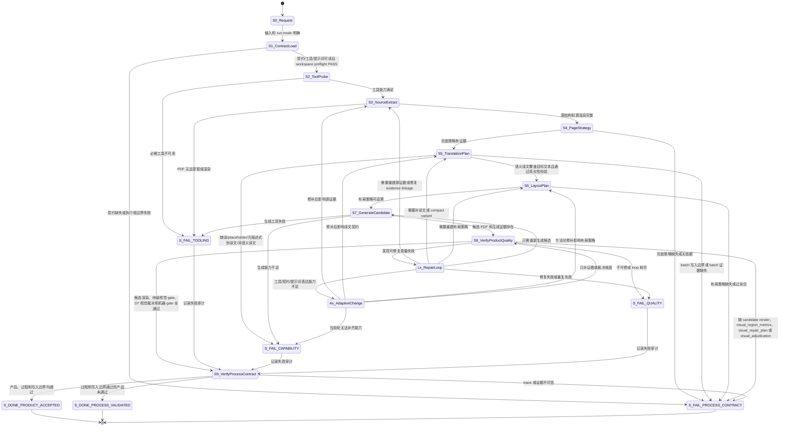
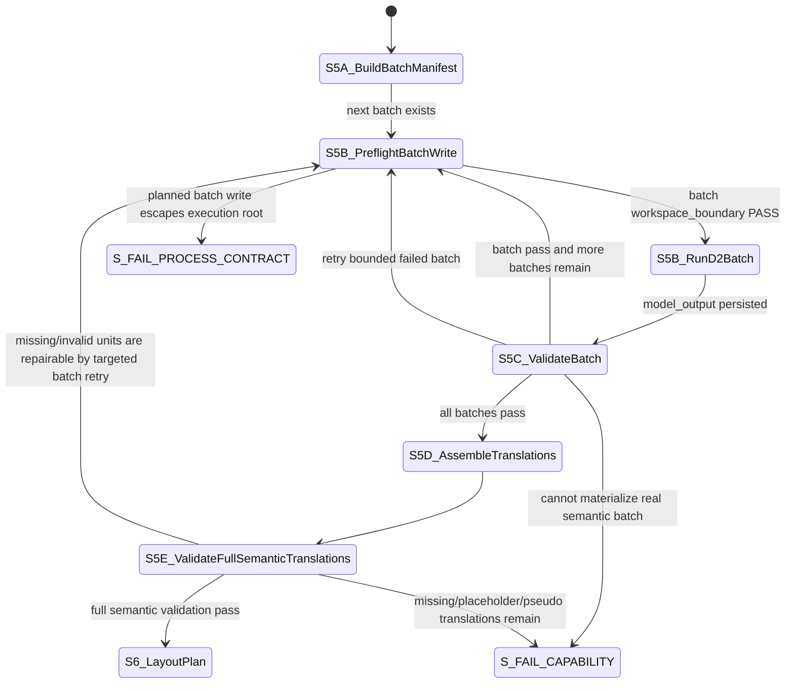
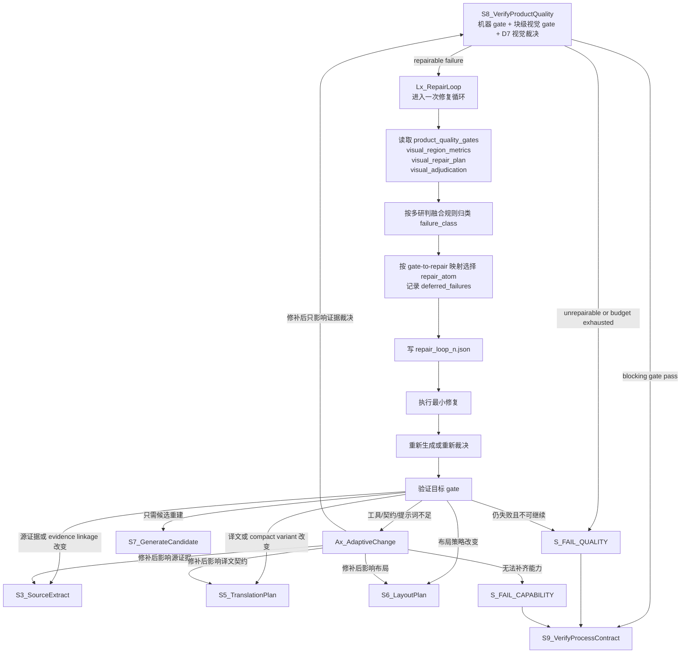
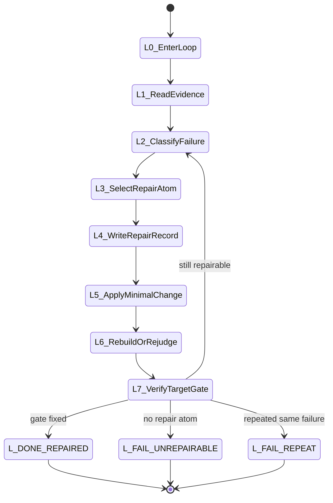
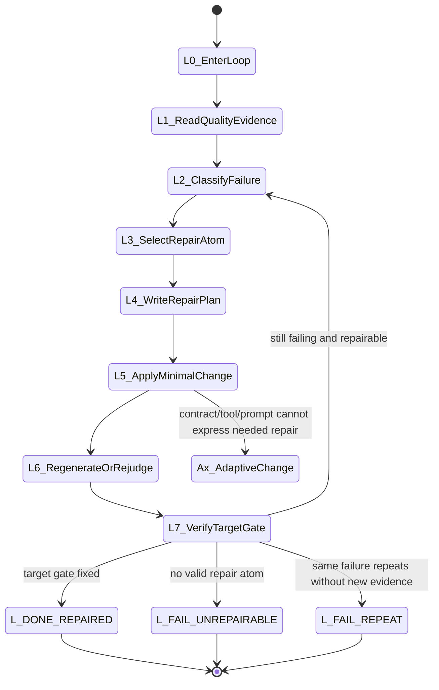
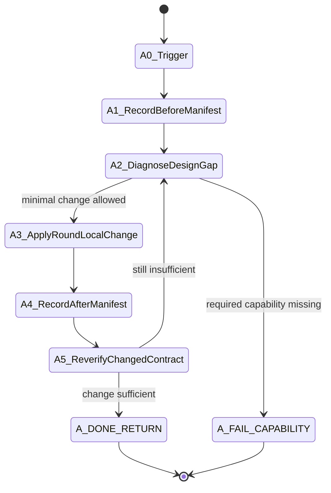
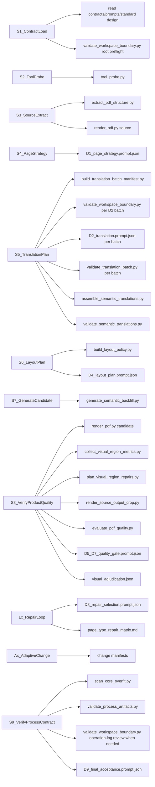

# PDF 语义翻译回填标准流程设计

> 当前生效说明：Round22 Phase 2/3 已经将 `layout_plan.json` 从 shadow/evidence-only 提升为 S6 生成器可消费计划；S7 必须通过 `--planned-layout` 消费它，并输出 `layout_execution.json` 与 `layout_plan_consumed_by_generator=true` 证据。本文后面的 Phase 1 shadow 段落仅作为历史背景，不代表当前执行契约。

## 1. 目的

本文件是 PDF 源语言内容翻译为目标语言并回填 PDF 的标准执行规范。历史默认方向是英译中；当输入包声明 `source_language`、`target_language` 和 `target_text_field` 时，执行器必须按声明方向运行，例如中译英。

它用于指导一个新的 Codex 会话按固定状态机执行：

```text
读取契约 -> 探测工具 -> 提取源 PDF -> 制定页面策略 -> 校验译文 -> 制定布局策略 -> 生成候选 PDF -> 验证质量 -> 修复循环 -> 最终审计
```

本文件不是历史记录。历史实验、截图反馈、失败过程和旧轮次证据只放在审计文档或报告中，不作为新执行器的主调度依据。

## 2. 核心原则

1. 状态先行：每一步必须属于一个明确状态。
2. 工具先证据：文件存在、JSON 可解析、PDF 可渲染、页数一致等事实由工具判断。
3. 大模型只裁决：大模型用于页面策略、翻译、布局策略、视觉质量和修复选择，不用于替代文件系统或工具检查。
4. 提示词不重造：执行轮次只能使用核心提示词模板填槽位，不能重新发明判断提示词。
5. 失败可接受：产品质量失败可以接受，但必须诚实进入修复循环或终态失败。
6. 反过拟合：生产工具和契约不能依赖样本文件名、固定页码、固定坐标、固定文本、固定颜色或已知文档身份。

### 2.1 翻译方向契约

每个产品质量运行必须在 `run_request.json` 或语义译文 JSON 中声明方向：

```json
{
  "source_language": "en|zh|...",
  "target_language": "zh|en|...",
  "target_text_field": "translation_zh|translation_en|translation_target_text"
}
```

默认兼容值：

```json
{
  "source_language": "en",
  "target_language": "zh",
  "target_text_field": "translation_zh"
}
```

方向首先影响“哪些源行需要翻译”和“目标文本字段/残留文本如何校验”。当实跑证据证明目标语长度、换行习惯、字形密度或阅读审美不同会改变排版结果时，方向也可以影响 `language layout profile`、D4 布局策略、D7 视觉裁决阈值和 D8 repair atom 优先级。方向分流只能基于通用语言方向与当前页几何证据，不能基于样本文档身份。

方向不会改变的共性规则：图片保真、背景残留、表格/图表结构、侧边导航方向、禁止关键正文/标题小字 fallback、状态机、反过拟合边界、工作目录边界。

方向可能改变的规则：正文是否先扩框再缩字、`body_flow` 合并条件、`target_composition` 是否适用、受限槽位 fallback 的字体曲线、段落间距/行距审美阈值、repair atom 的优先级。例如 `zh_to_en` 通常先修正文/标题重排和可读性；`en_to_zh` 通常优先保留源框与紧凑 CJK 排版。

每个方向必须绑定一个通用 language layout profile，profile 只能描述语言方向的开口策略，不能描述具体样本：

```text
pdf_translation_workflow_core\profiles\en_to_zh.layout_profile.json
pdf_translation_workflow_core\profiles\zh_to_en.layout_profile.json
```

profile 必须由 `S6_LayoutPlan` 作为 `build_layout_policy.py --language-profile` 输入进入 `layout_policy.json`，并在 `layout_policy.json` 中记录：

```text
language_pair_profile
language_profile_json
language_profile_sha256
layout_strategy
source_language
target_language
target_text_field
```

方向 profile 的允许内容：

```text
target_language_reflow：目标语扩框策略，例如 zh->en 先扩正文框再缩字号
target_composition：目标语视觉构图策略；对流式正文，源 bbox 是遮罩、锚点和阅读顺序证据，不是硬目标容器
flow_grouping.body：同栏正文流合并、段落 gap、短续行合并、密集页下方正文带规则
font_profiles：各 region kind 的字号上下限、source_scale、shrink_scales、min_insert_pt
fallback：无法 fit 时的显式失败/降级策略
prompt_overlay：D2/D4/D7 的方向性判断提醒
```

方向 profile 的禁止内容：

```text
样本文件名
官方对照页码
固定 bbox 坐标
固定年份或财务指标
固定专有文本或术语白名单
从人工对照样本抄来的布局坐标
```

### 2.2 受限槽位与流式正文

执行器在 `S6_LayoutPlan` 必须把区域分成两类：

```text
constrained_slot：表格单元格、图例、图表标签、侧边导航、页码、目录项、密集表格/矩阵内短标签。以源 bbox 为硬约束，优先使用 compact/table/legend/side-nav 译文变体。
expandable_text_slot：页首标题、章节短说明、红色提示行、正文带里的解释性 short_label。源 bbox 是遮罩和阅读顺序锚点，不是硬容器；当目标语变长且当前页几何证明右侧/下方有空白时，可以扩展目标框后再缩字。
event_card：时间线、里程碑、人物/图片旁的窄多行事件说明。属于受限槽位，但允许在本事件卡内部多行重排；不能跨年份、图片或相邻事件卡合并。
fluid_body：正文段落、下方正文带、连续正文栏。以源 bbox 为遮罩和阅读顺序锚点，但目标语可按当前页正文带、页边距、避让区和下边界重构文本框。
```

判断依据只能来自当前运行：

```text
page_type_guess
region_kind
同栏 x0/width/y-gap 统计
字体大小层级
绘图/表格密集度
当前页可用正文带和避让区
目标文本/源文本长度比
右侧同水平障碍物和下方同栏障碍物
目标语言方向 profile
```

禁止依据：

```text
文件名
官方对照页码
固定坐标
具体财务词汇或年份
历史 round 的候选 PDF
```

当 `target_composition.enabled=true` 且区域是 `fluid_body/body_flow` 时，`S7_GenerateCandidate` 的顺序是：

```text
1. 按源 bbox 内侧像素和周边像素做背景聚类采样，记录 fill_color provenance。
2. 按源 bbox 擦除可替换源文本；填充色必须来自局部背景，不得来自源字形颜色。
3. 合并同栏正文为 body_flow。
4. 用 target_composition 根据当前页正文带重算目标文本框。
5. 对 `expandable_text_slot` 运行 `expandable_text_slots`：按角色、页型、源框宽度、目标/源长度比、右侧障碍物和下方同栏障碍物扩展目标框。
6. 用 overlap_guard 防止侵入下一同栏区域。
7. 在临时页探测字号和换行。
8. 只把通过探测的最终文本画到真实候选页。
```

`expandable_text_slots` 的典型适用条件必须来自当前运行几何和语言 profile：

```text
region_kind in {heading, short_label}
page_type_guess 不属于 chart_or_dashboard / table_or_chart_dense / matrix_or_table_diagram 等硬结构页型
目标文本长度达到阈值，且目标/源长度比显示目标语明显变长
源 bbox 宽度不是极窄导航项，也不是已经接近整页宽度的正文框
扩展方向上不存在同水平文本、图片、表格或侧栏障碍物
扩展后的 y1 不穿过下方同栏区域
```

如果 `short_label_legibility` 失败且语义译文有效，D8 默认选择 `expandable_text_slot_reflow_repair` 回到 `S6_LayoutPlan`；只有密集表格、图例、矩阵或目录项等结构性硬槽位才选择 `constrained_slot_layout_fit_repair`。

当区域是 `constrained_slot` 时，不能使用正文构图扩张；只能用紧凑译文、字号曲线、旋转绘制或显式失败。

### 2.3 已是目标语的可见文本

双语 PDF 中可能有一部分源页面文本已经是目标语言，例如中文页里的英文专名或英文页里的中文专名。它们不属于语义翻译覆盖率，但如果正文重排会覆盖它们，必须进入回填流程：

```text
translation_mode = preserve_already_target_language_span
```

执行规则：

```text
该行不含源语言字符
该行含目标语言字符
不要求出现在 semantic_translations.json
生成器可擦除并原文重绘
计入 preserved_target_language_unit_count
不计入 semantic_translated_unit_count
```

如果这类文本未擦除且与新正文重叠，`S8_VerifyProductQuality` 必须判定 `failed_probe_residue`、`collision` 或 `visual_similarity` 失败。

### 2.4 擦除填充色与背景差异

擦除填充色是视觉质量的一等约束。生成器必须以当前页、当前 bbox 的内侧像素和周边像素为输入做开放式背景采样：

```text
input = page pixels + source bbox
sample = bbox inner grid points + bbox outside ring points, multi-distance
selection = quantized majority color cluster, with inner samples weighted above outside-ring samples
forbidden = filename/page/text/fixed color/known brand coordinate
output = fill_color + provenance in candidate_generation_evidence.json redactions and insertions.redaction_fill_provenance
output += background_covers[] when current-run geometry needs region_background_cover or residual_wide_line_background_cover
output += image_overlay_background_decision in redactions[] when extractable foreground text sits above a complex image/photo background
background_covers[].method = cover scope policy
background_covers[].draw_mode = solid_vector_fill for neutral/small covers, row_sampled_image_patch for large saturated/color covers
```

判断逻辑：

```text
“图片上的文字”只指照片/位图像素里拍到或烘焙进去的文字，例如照片中公司的英文招牌；这类文字没有独立 PDF text object，当前无 OCR 授权时作为图片自然保留，不进入翻译、擦除或 residue 判定。
浮在图片或半透明色块上的 PDF 前景文字，只要能被文本抽取器提取，就是可编辑源文本，必须按正常语义翻译回填；不能因为 bbox 与 image block 重叠就跳过翻译。
如果可抽取前景文字位于照片、复杂图像或高对比图片底色上，S7 仍要翻译回填，但 redaction 必须保护底图：优先使用 text_only_preserve_background，不能用白色/实心色块擦坏图片。
image_overlay_background_decision 只能来自当前页 image block bbox overlap、bbox 中排除文字颜色后的背景主色、背景色彩范围、饱和度、文字/背景对比和 fill/background 差值，不能来自页码、文件名、固定坐标或样本文字。
S7 必须在 `candidate_generation_evidence.json.redactions[].image_overlay_background_decision` 记录 protect_background、image_overlap_ratio、source_background_saturation、source_background_color_range、text_background_delta 和 reason。
如果源字形为红色/蓝色/灰色，但周边背景为白色或米色，则 fill_color 必须接近周边背景。
如果源文字位于红色/灰色底栏中，且周边背景也是该颜色，则 fill_color 可为该栏底色。
如果源文字位于彩色条、表头、蓝底页或图片附近，且 bbox 内侧主背景与外环主背景不同，fill_color 必须优先保护 bbox 内侧主背景，避免用页面底色擦掉彩色条。
如果候选页出现可见色块、遮罩块或与周边背景不一致的擦除痕迹，S8 归因为 background_delta。
如果候选页 bbox 内侧主背景偏离源页 bbox 内侧主背景，S8 归因为 inner_background_delta 或 background_residue_artifact。
如果 S7 为了适配约束槽位而使用文字图像绘制，文字图像不得使用白色透明底；必须使用当前 region 的 redaction fill_color 作为不透明底，并在 insertion 中记录 image_background_color。
如果文字图像底色与源 bbox 内侧背景存在可见偏差，S8 归因为 text_image_background_delta，并聚合到 background_residue_artifact。
如果彩色背景上的宽源行 redaction 没有被 `background_covers` 覆盖，即使该区域没有译文插入，S8 也必须归因为 redaction-only band / `wide_line_patch_risk`，并聚合到 background_residue_artifact。
S7 必须记录 `background_covers`：`region_background_cover` 用于语义区域 source-union bbox，`residual_wide_line_background_cover` 用于未进入重排区域但仍可能产生横向擦除带的宽源行组。该判断只能来自当前运行的 bbox、背景色饱和度、行宽和区域角色，不能来自页码、样本文字、固定颜色或文件名。
S7 对每个 `background_covers` 必须记录 `draw_mode`。中性/小面积覆盖可用 `solid_vector_fill`；彩色或高饱和背景上的大面积覆盖必须使用 `row_sampled_image_patch`：在页面修改前渲染当前源页，按 cover rect 同一高度从左右邻域采样，必要时从上下邻域补样，生成逐行背景 PNG 再覆盖。这样修横向擦除带时不能生成新的发白/发灰矩形块。
如果 `background_covers[*].draw_mode=solid_vector_fill` 且背景高饱和、面积较大，S8 必须归因为 background_residue_artifact；这类问题不能因平均色差小或整页相似而通过。
background_delta 的修复原子是 background_fill_resample；inner_background_delta/background_residue_artifact 的修复原子是 background_residue_fill_resample；二者都回到 S7 重新生成，不归因为翻译语义或字体缩放。

`background_delta` 不能被孤立使用为所有角色的阻断失败。对 `event_card`、`short_label`、`legend`、`sidebar` 这类紧凑标签/图示说明，源文和译文的字形、颜色和换行变化会改变 crop 边缘主色；只有当 `inner_background_delta`、`text_image_background_delta` 或 `background_residue_delta` 同时显示真实背景/擦除残留时，才升级为阻断失败。否则只能记录为 warn，并由 D7 结合 crop 和 `visual_similarity` 决定是否需要修复。
```

该规则只依赖当前渲染像素，不得写入任何样本专属颜色、页码、坐标或文本。

### 2.5 对照样本边界

如果存在同一报告的官方中文/英文对照版本，它只能作为离线评估集使用：

```text
允许：在 round 完成后，用对照样本观察结果偏差、总结通用规则缺陷、设计新的非过拟合质量指标。
禁止：把对照样本作为 D2 翻译输入、D4 布局输入、D7 视觉裁决输入、运行时 prompt 槽位、坐标来源、页码规则来源或术语强制映射来源。
```

执行报告必须区分：

```text
runtime_input: 当前 round 实际输入
offline_reference: 仅用于事后评估的对照样本
```

`offline_reference` 不得出现在 `prompt_instance.json`、`slot_values.json`、`semantic_translations.json`、`layout_policy.json` 的输入来源中。

对照样本相关脚本、回放工具、样本敏感词列表和人工结果差异报告也不得进入 `pdf_translation_workflow_core`。它们只能放在：

```text
docs\offline_reference_evaluation\
docs\reports\<round_id>\
```

当前可用的离线对照工具是 `docs\offline_reference_evaluation\reference_layout_compare.py`。它只能在候选 PDF 生成、S8/S9 运行完毕后执行，产物命名为 `posthoc_reference_layout_comparison*.json`；该 JSON 不是 runtime gate 输入，也不能作为 D2/D4/D7 的 prompt 槽位。

`pdf_translation_workflow_core` 只存放真实运行时会调用的通用抽取、布局、回填、验证工具，以及与这些工具一致的提示词和契约。

## 3. 目录约定

每个执行轮次必须有独立工作目录，或在根目录 `docs` 下用 round 编号隔离。根目录验证优先使用：

```text
docs\input\<round_id>\
docs\output\<round_id>\
docs\reports\<round_id>\
```

外部会话验证包可以使用独立 round 根目录：

```text
<round_root>\
  pdf_translation_workflow_core\
  docs\
    业务流程\
    input\
      semantic_translations\
    output\
    reports\
    测试提示词\
  state_trace.json
  operation_log.jsonl
  decision_log.jsonl
```

输入 PDF 可以放在 round 根目录或 `测试数据\` 下。

输出 PDF 只能放在：

```text
docs\output\
```

所有证据、报告、质量门禁、裁决记录必须放在：

```text
docs\reports\
```

### 3.1 执行根与写入边界契约

每个执行轮次只有一个执行根。独立 spike/round 包的执行根就是包含 `pdf_translation_workflow_core`、`docs`、`run_request.json`、`state_trace.json`、`operation_log.jsonl`、`decision_log.jsonl` 的目录。

执行器在任何运行时产物写入前，必须先把计划写入路径解析成绝对路径，并证明这些路径都位于执行根内。该检查不是人工口头约束，必须调用：

```powershell
python pdf_translation_workflow_core\tools\validators\validate_workspace_boundary.py `
  --workspace-root . `
  --path docs\reports `
  --path docs\output `
  --path docs\input\semantic_translations `
  --out docs\reports\workspace_boundary_preflight.json `
  --allow-missing
```

状态内的具体写入也必须有同类报告。例如 S5B 每个 D2 batch 写 `prompt_instance.json`、`model_output.json`、`decision_record.json`、`validation.json` 前，必须先输出：

```powershell
python pdf_translation_workflow_core\tools\validators\validate_workspace_boundary.py `
  --workspace-root . `
  --path docs\reports\<run_id>\translation_batches\<batch_id>.prompt_instance.json `
  --path docs\reports\<run_id>\translation_batches\<batch_id>.model_output.json `
  --path docs\reports\<run_id>\translation_batches\<batch_id>.decision_record.json `
  --path docs\reports\<run_id>\translation_batches\<batch_id>.validation.json `
  --out docs\reports\<run_id>\translation_batches\<batch_id>.workspace_boundary.json `
  --allow-missing
```

只有 `workspace_boundary_verdict=PASS` 才能继续写入。若任何计划路径解析到执行根外，必须停止当前状态并进入 `S_FAIL_PROCESS_CONTRACT`。

`apply_patch` 只能用于修改工具、契约、提示词或流程文档，不能作为运行时证据写入器。`prompt_instance.json`、`model_output.json`、`decision_record.json`、`state_trace.json`、`operation_log.jsonl`、`decision_log.jsonl`、报告、预览图和候选 PDF 必须由工具或锚定执行根的 shell/Python 写入，并在 `operation_log.jsonl` 中记录 `workspace_boundary_check_ref`。

## 4. 状态机

| 状态 | 目的 | 必须产物 | 失败终态 |
|---|---|---|---|
| `S0_Request` | 确认目标、输入、run mode、非目标 | `run_request.json` | 输入缺失则等待用户 |
| `S1_ContractLoad` | 读取流程文档、契约、工具说明、提示词绑定，并验证执行根写入边界 | `contract_load_record.json`、`workspace_boundary_preflight.json` | `S_FAIL_PROCESS_CONTRACT` |
| `S2_ToolProbe` | 探测 Python、PDF 库、字体、渲染能力 | `tool_probe.json` | `S_FAIL_TOOLING` |
| `S3_SourceExtract` | 提取源 PDF 页尺寸、文字、bbox、字体、图像、绘图对象，并渲染源图 | `source_extraction.json`、源 PNG | `S_FAIL_TOOLING` |
| `S4_PageStrategy` | 判断页面类型和区域角色 | `page_strategy.json` | `S_FAIL_PROCESS_CONTRACT` |
| `S5_TranslationPlan` | 生成翻译批次、逐批执行 D2、校验批次、汇总目标语语义译文并做全量校验 | `translation_batch_manifest.json`、`translation_batches/<batch_id>.workspace_boundary.json`、`translation_batches/<batch_id>.*.json`、`*.translations.json`、`semantic_translation_validation.json` | `S_FAIL_CAPABILITY`；路径越界则 `S_FAIL_PROCESS_CONTRACT` |
| `S6_LayoutPlan` | 生成或修订布局策略；必须区分 `constrained_slot` 与 `fluid_body`，并声明 `target_composition` 是否适用 | `layout_policy.json`、`layout_plan.json` | `S_FAIL_PROCESS_CONTRACT` |
| `S7_GenerateCandidate` | 擦除源语文本并回填目标语候选 PDF；流式正文可按目标语构图，受限槽位必须原位约束 | 候选 PDF、`candidate_generation_evidence.json` | `S_FAIL_TOOLING` 或 `S_FAIL_CAPABILITY` |
| `S8_VerifyProductQuality` | 执行候选渲染、块级视觉指标、视觉修复计划、视觉裁决和机器质量门禁；必须检查正文构图、字体层级、重叠残留、侧边栏方向和表格/图表完整性 | `candidate_render_manifest.json`、候选 PNG、`visual_region_metrics.json`、`visual_repair_plan.json`、`visual_adjudication.json`、`product_quality_gates.json` | 缺视觉闭环证据则 `S_FAIL_PROCESS_CONTRACT`；质量不可修则 `S_FAIL_QUALITY` |
| `Lx_RepairLoop` | 对一个阻塞失败执行一次修复循环 | `repair_loop_<n>.json` | `S_FAIL_QUALITY` |
| `Ax_AdaptiveChange` | 当工具/契约/提示词不足时做小幅方法论修补 | `adaptive_change_record.json`、前后 manifest | `S_FAIL_CAPABILITY` |
| `S9_VerifyProcessContract` | 验证状态 trace、操作日志、写入边界、反过拟合和最终审计 | `process_validation.json`、`anti_overfit_scan.json`、`final_acceptance.json` | `S_FAIL_PROCESS_CONTRACT` |

成功终态：

```text
S_DONE_PRODUCT_ACCEPTED
S_DONE_PROCESS_VALIDATED
```

失败终态：

```text
S_FAIL_PROCESS_CONTRACT
S_FAIL_TOOLING
S_FAIL_CAPABILITY
S_FAIL_QUALITY
```

### 4.1 主状态机图



### 4.1.1 S5 语义翻译物化子状态图

`S5_TranslationPlan` 是复合状态，不是一条“把所有文本一次性交给 D2 翻译”的线性步骤。它内部必须执行有边界的批次 loop：



子状态产物：

| 子状态 | 工具/裁决 | 产物 |
|---|---|---|
| `S5A_BuildBatchManifest` | `build_translation_batch_manifest.py` | `translation_batch_manifest.json`、`translation_batches/<batch_id>.slot_values.json` |
| `S5B_PreflightBatchWrite` | `validate_workspace_boundary.py` 或 `validate_translation_manifest_boundaries.py` | `translation_batches/<batch_id>.workspace_boundary.json`、可选 manifest 级 summary |
| `S5B_RunD2Batch` | `materialize_d2_translation_batches.py` + `D2_translation.prompt.json` | `prompt_instance.json`、`model_output.json`、`decision_record.json`、`d2_materialization.json`、`chunk_translation` 证据 |
| `S5C_ValidateBatch` | `validate_translation_batch.py` | `translation_batches/<batch_id>.validation.json` |
| `S5D_AssembleTranslations` | `assemble_semantic_translations.py` | `docs/input/semantic_translations/<case_id>.translations.json`、`translation_assembly_evidence.json` |
| `S5E_ValidateFullSemanticTranslations` | `validate_semantic_translations.py` | `semantic_translation_validation.json` |

约束：

```text
D2 每次只处理当前 batch 的 translation_units。
缺失 batch、batch validation FAIL、assembly coverage 不完整或最终 semantic validation FAIL，均不得进入 S6。
执行器可以缩小 batch_size，但不能丢弃 unit、不能写 placeholder、不能用官方对照样本补译文。
数值度量短语可以在 D2 物化工具内做通用目标语归一化，例如数字加 percentage/per cent/percent、basis points、percentage points、pps/bps、currency units、million/billion/trillion、month/year 等单位。触发依据只能是当前 unit 的文本形态、source_language、target_language 和 preserve_tokens；不得来自文件名、页码、固定坐标、样本文字或官方对照 PDF。
如果 provider 返回了未翻译的源语度量词，工具应先尝试通用归一化并记录在 prompt/model/decision 证据中；归一化后仍不满足目标语脚本或中性度量契约时，才进入 batch FAIL 或 S_FAIL_CAPABILITY。
如果没有可用的大模型/API/人工语义翻译能力，必须进入 S_FAIL_CAPABILITY，并记录缺口。
```

### 4.2 Loop 与主状态机调用关系图



Loop 不是单独替代状态机的串行状态，而是 `S8` 失败后的复合活动。每一次 loop 必须完成：

```text
repair_loop_<n>.json -> 最小修复 -> 候选重生成/重裁决 -> 回到 S8 重新计算 gate
```

当 `max_repair_loops > 1` 时，执行器不得只跑第一轮。它必须把已经尝试过的 `(gate_id, repair_atom)` 记入 prior loop summary，下一轮优先选择尚未执行的阻断 repair atom；如果所有可执行通用修复都已尝试仍失败，才进入 `S_FAIL_QUALITY`。

### 4.3 Loop 内部状态图



## 5. 状态调度表

| 状态 | 必须调用的工具 | 大模型裁决 | next_state |
|---|---|---|---|
| `S1_ContractLoad` | 文件读取、`validate_workspace_boundary.py` | 否 | 契约齐全且写入边界预检通过 -> `S2` |
| `S2_ToolProbe` | `tools\probes\tool_probe.py` | 否 | 工具可用 -> `S3` |
| `S3_SourceExtract` | `extract_pdf_structure.py`、`render_pdf.py` | 否 | 源证据完整 -> `S4` |
| `S4_PageStrategy` | 无必需工具，读取 S3 产物 | `D1_page_strategy.prompt.json` | 页面策略完整 -> `S5` |
| `S5_TranslationPlan` | `build_translation_batch_manifest.py`、逐批 `validate_workspace_boundary.py` 或 manifest 级 `validate_translation_manifest_boundaries.py`、`materialize_d2_translation_batches.py`、逐批 `validate_translation_batch.py`、`assemble_semantic_translations.py`、`validate_semantic_translations.py` | 逐批 `D2_translation.prompt.json` | 全量语义译文有效 -> `S6`；无法物化 -> `S_FAIL_CAPABILITY`；写入边界失败 -> `S_FAIL_PROCESS_CONTRACT` |
| `S6_LayoutPlan` | `build_layout_policy.py` | `D4_layout_plan.prompt.json` | 布局策略可追溯；必须声明 constrained_slot、expandable_text_slot、fluid_body 的分流 -> `S7` |
| `S7_GenerateCandidate` | `generate_semantic_backfill.py` | 否 | 候选生成 -> `S8` |
| `S8_VerifyProductQuality` | `render_pdf.py`、`collect_visual_region_metrics.py`、`plan_visual_region_repairs.py`、`render_source_output_crop.py`、`write_visual_adjudication.py`、`evaluate_pdf_quality.py` | `D5_D7_quality_gate.prompt.json` | 全 pass 或无阻断 `PASS_WITH_WARN` -> `S9`；可修阻断 -> `Lx`；不可修 -> fail；缺视觉闭环证据 -> `S_FAIL_PROCESS_CONTRACT` |
| `Lx_RepairLoop` | 按 failure_class 选择工具；读取 `visual_region_metrics.json`、`visual_repair_plan.json`、`product_quality_gates.json`、`visual_adjudication.json`；调用 `build_repair_patch.py` 生成 `repair_patch_<n>.json`，再用 `apply_repair_patch.py` 修改 run-local `layout_policy`；执行引擎必须写 `repair_loop_<n>.json` | `D8_repair_selection.prompt.json` | 按 repair_atom 回到 `S3`、`S5`、`S6` 或 `S7`；`--max-repair-loops` 大于 1 时必须逐轮再渲染、再采集、再裁决；若无通用执行器则写 `not_executed_unrepairable` 并 `S_FAIL_QUALITY`；若 repair atom 生成 `operation_count=0`，必须记录 `skipped_noop_repairs` 并选择下一个非 no-op atom |
| `S9_VerifyProcessContract` | `validate_process_artifacts.py`、`scan_core_overfit.py`；必要时用 `validate_workspace_boundary.py --operation-log` 复核日志路径 | `D9_final_acceptance.prompt.json` | 输出最终终态 |

## 6. 提示词边界

执行轮次只能使用：

```text
pdf_translation_workflow_core\prompts\templates\D1_page_strategy.prompt.json
pdf_translation_workflow_core\prompts\templates\D2_translation.prompt.json
pdf_translation_workflow_core\prompts\templates\D4_layout_plan.prompt.json
pdf_translation_workflow_core\prompts\templates\D5_D7_quality_gate.prompt.json
pdf_translation_workflow_core\prompts\templates\D8_repair_selection.prompt.json
pdf_translation_workflow_core\prompts\templates\D9_final_acceptance.prompt.json
```

允许调整：

```text
round 本地路径
run_id / case_id
当前页码和裁剪图引用
当前 metrics 和 gate summary
工具输出 JSON 的读取包装
```

禁止调整：

```text
新造 D4/D7/D8/D9 判断提示词
删除必填质量维度
把 blocking gate 改为非 blocking
用 placeholder 译文通过 product_quality
用“本行说明/This line reports”这类元描述式伪译文通过 product_quality
没有 backrotated crop 就判侧栏字形方向通过
把样本文件名、固定页码、固定坐标、固定文本写成规则
```

如果提示词模板确实不够用，进入 `Ax_AdaptiveChange`，记录原因、变更文件、兼容性和验证结果。

提示词 `next_state` 枚举必须和状态机保持一致：

| 提示词 | 允许的关键 next_state | 说明 |
|---|---|---|
| `D2_translation.prompt.json` | `S5_TranslationPlan`、`S6_LayoutPlan`、`S_FAIL_CAPABILITY`、`S_FAIL_PROCESS_CONTRACT` | batch 未完成时留在 `S5`；全部 batch 汇总并验证通过后才可进 `S6` |
| `D5_D7_quality_gate.prompt.json` | `S9_VerifyProcessContract`、`Lx_RepairLoop`、`S3_SourceExtract`、`S5_TranslationPlan`、失败终态 | `S3` 只用于源证据/基线缺失；语义前提失败可直接回 `S5` 或失败终态 |
| `D8_repair_selection.prompt.json` | `S3_SourceExtract`、`S5_TranslationPlan`、`S6_LayoutPlan`、`S7_GenerateCandidate`、失败终态 | 必须由 selected `repair_atom` 决定，不得为绕过 gate 任意跳转 |
| `D9_final_acceptance.prompt.json` | `S_DONE_PROCESS_VALIDATED`、`S_DONE_PRODUCT_ACCEPTED`、`S_FAIL_PROCESS_CONTRACT`、`S_FAIL_QUALITY`、`S_FAIL_TOOLING`、`S_FAIL_CAPABILITY` | 最终验收必须保留 process/product split verdict；产品未到达可写 `NOT_REACHED` |

### 6.1 Round14/15 后固化的通用运行补充

本节记录已进入生产 core 的通用规则，不是样本特例。

1. 语言方向可由执行器自动识别，但必须写入 `round_input_manifest.json` 或等价 run manifest。识别依据只能是当前输入 PDF 前若干页的 CJK 字符数、Latin 字符数、页数和样本文本摘要；不得使用文件名作为裁决依据。文件名只能作为人类可读 case_id 来源。
2. `S5_TranslationPlan` 的 D2 物化可以由 `materialize_d2_translation_batches.py` 执行。该工具只消费 `translation_batch_manifest.json` 和每个 batch 的 `slot_values.json`，必须在逐批 `workspace_boundary_verdict=PASS` 后写入 `prompt_instance.json`、`model_output.json`、`decision_record.json`。
3. 大文档可以先用 `validate_translation_manifest_boundaries.py` 从 `translation_batch_manifest.json` 一次性写出每个 batch 的 `workspace_boundary_ref`。这只是规模化执行方式，不降低边界契约：每个 batch 仍必须有独立 `workspace_boundary_verdict=PASS`，任何失败都进入 `S_FAIL_PROCESS_CONTRACT`。
4. `materialize_d2_translation_batches.py` 允许的当前 provider 为 `google_translate_web_gtx`。provider 必须写入 batch output、assembly output、`candidate_generation_evidence.json` 和质量门禁；不能写成 placeholder、manual_placeholder 或 deterministic_placeholder。
5. D2 请求文本必须先做 Unicode NFKC 归一化。缓存命中后仍必须校验目标脚本；缓存译文若不满足目标脚本，必须丢弃并重新请求，不得复用失败缓存。`target_language=en` 时，如果源文本是 Latin 占优的混合实体、地址或机构名，工具可在 D2 后处理阶段去除括号中残留的 CJK 注释片段，但必须保留 Latin 主体、数字、标点和法定实体后缀；该规则只能基于当前 unit 的字符比例和通用实体形态，不能使用文件名、页码或样本文字。
6. 大文档允许在一个 bounded batch 内使用 chunked provider calls。chunk 必须使用稳定中性 unit marker 包裹每个源单元，返回后必须按原 `unit_id` 拆回，并在 `model_output.chunk_translation` 中记录 `chunk_units_limit`、`chunk_chars_limit`、chunk 数、marker split 数和 fallback 单元数。marker 丢失或目标脚本失败的单元必须回退逐单元翻译；仍失败则 `S_FAIL_CAPABILITY`。chunk 不得改变 batch 输出 schema，也不得跳过 `validate_translation_batch.py`。
7. `build_translation_batch_manifest.py` 是可翻译源单元判定的唯一口径；`validate_semantic_translations.py`、`build_layout_policy.py`、`generate_semantic_backfill.py` 必须复用同一 `line_is_translatable` 语义，不得各自维护分叉规则：
   - 已是目标语占优的可见行不进入 D2 语义覆盖；如果它可能被相邻重排覆盖，生成器可以用 `preserve_already_target_language_span` 重画，并计入 `preserved_target_language_unit_count`，不得计入语义翻译覆盖。
   - URL、邮箱、域名、股票代码、评级字母、ISIN/CUSIP/SEDOL/RIC/LEI、百分比/bps/pps、罗马数字条目、纯数字或数字符号片段、短大写代码、法定实体/基金/地址型 Latin 名称等通用中性标识不进入 D2。该判断必须是开口函数：由字符类别、token 形态、词数、脚注/代码模式和当前语言方向决定，不能出现样本文字或固定页码。
   - 中性标识在候选 PDF 中不得被擦除；质量门禁必须允许它们作为目标语 PDF 中的 neutral token，但不能因此放过真正的源语言正文残留。
8. `generate_semantic_backfill.py` 在插入文字前必须检查 region rect 是否有限且非空。若布局策略产生空矩形，必须回退到 `source_anchor_bbox` 或当前 region items 的 union rect，并写入 `rect_repair.reason=empty_or_nonfinite_region_rect`。不得让 PyMuPDF 的 `text box must be finite and not empty` 直接中断产品质量运行。
9. 当抽取器把顶部大标题或正文导语与大型装饰数字/章节号合并成异常高 bbox 时，生成器必须基于当前页几何执行 `decorative_numeric_merge_repair`：识别“文本末尾单个装饰数字 + bbox 高度远超字体节奏”的异常，使用同列邻近正常文本行修复文字 bbox，并只从译文中剥离误并入的装饰数字；源页原有的大数字/章节号作为视觉元素保留。该规则不能绑定具体数字、页码或标题词。
10. `matrix_or_table_diagram` 或 dense page 对正文重排默认保守，但不能误杀页首大标题和上方导语。若当前区域满足“页首、字体大于页面中位、宽度足够、与表格/图形主体不重叠”的几何证据，`large_top_heading_region` 和 `top_lead_body_reflow` 可以绕过 dense/matrix hard-disable，进入目标语构图；该例外必须写入 `layout_plan.json` 或 `candidate_generation_evidence.json`。
11. `evaluate_pdf_quality.py` 的 `text_residue` 对 `target_language=zh` 的规则是：Latin token 只有在目标译文证据中出现、匹配通用 neutral identifier/code 模式，或是已在目标译文证据中出现的品牌/代码词被 PDF 文本抽取器拆开的片段时才允许；其他 Latin token 仍判定为 source residue。对 `target_language=en`，CJK 残留仍是阻断失败。

对应工具：

```text
pdf_translation_workflow_core\tools\generators\materialize_d2_translation_batches.py
pdf_translation_workflow_core\tools\planners\build_translation_batch_manifest.py
pdf_translation_workflow_core\tools\validators\validate_semantic_translations.py
pdf_translation_workflow_core\tools\planners\build_layout_policy.py
pdf_translation_workflow_core\tools\generators\generate_semantic_backfill.py
pdf_translation_workflow_core\tools\validators\evaluate_pdf_quality.py
```

## 7. 工具契约

### 7.0 运行写入边界预检

每个运行开始后，在 S1 必须生成一次根目录级预检：

```powershell
python pdf_translation_workflow_core\tools\validators\validate_workspace_boundary.py --workspace-root . --path docs\reports --path docs\output --path docs\input\semantic_translations --out docs\reports\workspace_boundary_preflight.json --allow-missing
```

每个会写运行时产物的状态，还必须对该状态计划写入的具体文件执行同类检查。检查报告必须在 `state_trace.json` 或 `operation_log.jsonl` 中通过 `workspace_boundary_check_ref` 引用。

失败处理：

| 失败 | 终态 |
|---|---|
| `workspace_boundary_verdict=FAIL` | `S_FAIL_PROCESS_CONTRACT` |
| `--out` 本身解析到执行根外 | `S_FAIL_PROCESS_CONTRACT` |
| 状态写了 `output_artifacts` 但没有 boundary report | `S_FAIL_PROCESS_CONTRACT` |

### 7.1 探测

```powershell
python pdf_translation_workflow_core\tools\probes\tool_probe.py --out docs\reports\tool_probe.json
```

### 7.2 源 PDF 提取

```powershell
python pdf_translation_workflow_core\tools\probes\extract_pdf_structure.py --input <source_pdf> --out docs\reports\<run_id>\source_extraction.json
```

### 7.3 PDF 渲染

```powershell
python pdf_translation_workflow_core\tools\renderers\render_pdf.py --input <pdf> --out-dir docs\reports\<run_id>\<preview_dir> --prefix <prefix> --manifest docs\reports\<run_id>\<manifest>.json
```

### 7.4 语义译文批次物化与校验

先生成 D2 batch manifest：

```powershell
python pdf_translation_workflow_core\tools\planners\build_translation_batch_manifest.py --source-extraction docs\reports\<run_id>\source_extraction.json --case-id <case_id> --source-language <source_language> --target-language <target_language> --target-text-field <target_text_field> --batch-dir docs\reports\<run_id>\translation_batches --out docs\reports\<run_id>\translation_batch_manifest.json
```

对 `translation_batch_manifest.json` 中每个 batch：

```powershell
python pdf_translation_workflow_core\tools\validators\validate_workspace_boundary.py --workspace-root . --path docs\reports\<run_id>\translation_batches\<batch_id>.prompt_instance.json --path docs\reports\<run_id>\translation_batches\<batch_id>.model_output.json --path docs\reports\<run_id>\translation_batches\<batch_id>.decision_record.json --path docs\reports\<run_id>\translation_batches\<batch_id>.validation.json --out docs\reports\<run_id>\translation_batches\<batch_id>.workspace_boundary.json --allow-missing
```

大文档可使用等价的 manifest 级边界生成：

```powershell
python pdf_translation_workflow_core\tools\validators\validate_translation_manifest_boundaries.py --manifest docs\reports\<run_id>\translation_batch_manifest.json --workspace-root . --out docs\reports\<run_id>\translation_manifest_boundaries.json
```

```text
1. 读取 translation_batches\<batch_id>.slot_values.json。
2. 对该 batch 的 prompt_instance/model_output/decision_record/validation 计划路径运行 validate_workspace_boundary.py。
3. 确认 translation_batches\<batch_id>.workspace_boundary.json 为 PASS。
4. 用 D2_translation.prompt.json 填槽位。
5. 写 translation_batches\<batch_id>.prompt_instance.json。
6. 写 translation_batches\<batch_id>.model_output.json。
7. 写 translation_batches\<batch_id>.decision_record.json。
```

然后校验每个 batch：

若本轮由工具直接物化 D2 batch，执行器必须在逐批 workspace boundary 通过后调用：

```powershell
python pdf_translation_workflow_core\tools\generators\materialize_d2_translation_batches.py --manifest docs\reports\<run_id>\translation_batch_manifest.json --prompt-template pdf_translation_workflow_core\prompts\templates\D2_translation.prompt.json --provider google_translate_web_gtx --require-workspace-boundary --chunk-units 25 --chunk-chars 4500 --cache docs\reports\<run_id>\translation_cache.json --out docs\reports\<run_id>\d2_materialization.json
```

该工具只是 D2 的 batch 物化器，不替代 batch validation、assembly 或 full semantic validation。provider 不可用、目标脚本校验失败、缓存译文无效且重试后仍失败时，必须停在 `S_FAIL_CAPABILITY`，不能生成 placeholder。`--chunk-units` 与 `--chunk-chars` 只能控制 provider 请求规模，不能改变 `translation_units -> units` 一一覆盖契约。

```powershell
python pdf_translation_workflow_core\tools\validators\validate_translation_batch.py --slot-values docs\reports\<run_id>\translation_batches\<batch_id>.slot_values.json --model-output docs\reports\<run_id>\translation_batches\<batch_id>.model_output.json --out docs\reports\<run_id>\translation_batches\<batch_id>.validation.json
```

全部 batch 通过后汇总：

```powershell
python pdf_translation_workflow_core\tools\generators\assemble_semantic_translations.py --manifest docs\reports\<run_id>\translation_batch_manifest.json --out docs\input\semantic_translations\<case_id>.translations.json --evidence-out docs\reports\<run_id>\translation_assembly_evidence.json
```

最后执行全量语义校验：

```powershell
python pdf_translation_workflow_core\tools\validators\validate_semantic_translations.py --source-extraction docs\reports\<run_id>\source_extraction.json --translations docs\input\semantic_translations\<case_id>.translations.json --out docs\reports\<run_id>\semantic_translation_validation.json
```

校验必须同时覆盖：

```text
unit_id/source_text 精确匹配
source_language/target_language/target_text_field 正确
目标语字段非空且符合目标语字符规则
数字、年份、百分比、货币、脚注标记保留
禁止 placeholder
禁止元描述式伪译文：本行说明、本行列示、This line reports、This line describes、当前页的财务报告/治理/业务信息、保留数值与标记/preserve figures markers
layout_variants 也必须满足同样的真实性规则
compact_label、short_label、table_cell、table_header、legend、chart_label、vertical_nav 等受限槽位必须提供对应目标语 layout_variants；缺失时 S7 不得自行发明缩写，只能用全文尝试排版并把溢出记录为 text_fit/D2-D4 修复输入
```

### 7.5 布局策略

```powershell
python pdf_translation_workflow_core\tools\planners\build_layout_policy.py --source-extraction docs\reports\<run_id>\source_extraction.json --semantic-translations docs\input\semantic_translations\<case_id>.translations.json --language-profile pdf_translation_workflow_core\profiles\<source_language>_to_<target_language>.layout_profile.json --out docs\reports\<run_id>\layout_policy.json
```

`layout_policy.json` 至少要表达：

```text
classification_rules.table_note
classification_rules.event_card
classification_rules.table_cell
classification_rules.legend
classification_rules.vertical_nav
classification_rules.heading.source_size_page_quantile / min_source_to_page_quantile_ratio
classification_rules.metric_value.source_size_page_quantile / value_token_regex
reflow.reflow_kinds / preserve_line_kinds
flow_grouping.body.enabled
flow_grouping.body.min_region_count
flow_grouping.body.max_x0_delta_pt
flow_grouping.body.max_width_delta_ratio
flow_grouping.body.max_vertical_gap_pt
flow_grouping.body.paragraph_gap_pt
flow_grouping.body.line_joiner_en / line_joiner_zh
flow_grouping.body.disable_page_type_guesses
flow_grouping.body.allow_short_continuation_lines
flow_grouping.body.min_continuation_width_page_ratio
flow_grouping.body.allow_dense_page_body_below_y_ratio
target_composition.enabled
target_composition.region_kinds
target_composition.min_width_page_ratio / max_width_page_ratio
target_composition.height_expand_ratio
target_composition.max_bottom_page_ratio
target_composition.overlap_guard
target_language_reflow.enabled
target_language_reflow.region_kinds
target_language_reflow.allow_dense_page_body_below_y_ratio
target_language_reflow.overlap_guard
target_language_reflow.large_top_heading_region
target_language_reflow.top_lead_body_reflow
layout_text_variants 中 compact_label、short_label、table_cell、legend 的目标语字段
font_profiles 中 event_card、table_cell、legend、table_note、footnote、body、body_flow、heading
source_separator_policy
draw_modes.vertical_nav
fallback policy
```

正文流规则：

```text
aligned body regions in the same column -> may merge into body_flow
mixed image/text timeline or milestone narrow descriptions -> event_card, local reflow only, never body_flow
same-paragraph wrapped lines -> join with target-language line_joiner
paragraph y-gap >= paragraph_gap_pt -> join with paragraph_separator
short continuation lines may join only when an active body_flow exists, x0 is aligned, y-gap is within max_vertical_gap_pt, and width exceeds min_continuation_width_page_ratio
dense table/chart page -> preserve table cells and legends, but allow body_flow below allow_dense_page_body_below_y_ratio when current-run geometry proves it is a body copy band
target_composition applies only to fluid body/body_flow; it uses source bbox as anchor evidence and recomputes target frame from current-page body band before font shrink
target_language_reflow may expand only declared region_kinds and must obey overlap_guard so expanded text does not invade the next same-column region
matrix_or_table_diagram page -> hard-disable normal body_flow, but allow page-top large heading and page-top lead body only when current geometry proves they are outside the diagram/table body
```

### 7.6 候选 PDF 生成

```powershell
python pdf_translation_workflow_core\tools\generators\generate_semantic_backfill.py --input <source_pdf> --source-extraction docs\reports\<run_id>\source_extraction.json --semantic-translations docs\input\semantic_translations\<case_id>.translations.json --layout-policy docs\reports\<run_id>\layout_policy.json --output docs\output\<run_id>_semantic_backfill_candidate.pdf --evidence docs\reports\<run_id>\candidate_generation_evidence.json --translations docs\reports\<run_id>\translations.used.json --layout-plan docs\reports\<run_id>\layout_plan.json
```

`product_quality` 模式禁止用 placeholder 生成器冒充产品候选。

生成器必须先在临时预检页执行 textbox fit 尝试；失败的字号尝试不得绘制到真实候选 PDF。真实页只允许绘制最终 fit 成功字号，或记录明确 fallback。`candidate_generation_evidence.json` 中每个 insertion 必须记录：

```text
attempts
status
font_size
region_kind
layout_mode
target_language_reflow_applied
target_language_reflow_profile
target_composition_applied
target_composition_profile
source_anchor_bbox
source_block_ids
source_line_indexes
semantic_translated_unit_count
preserved_target_language_unit_count
decorative_numeric_merge_repair_count
rect_repair
```

如果 `decorative_numeric_merge_repair_count > 0`，`candidate_generation_evidence.json` 必须记录每个修复的 `source_line_index`、原 bbox、修复后 bbox、邻近行证据和被剥离的尾部装饰 token。该证据用于 S8 判断“标题/导语是否因为抽取器合并装饰数字而误排”，不是样本页码或固定数字规则。

### 7.7 质量门禁

候选 PDF 生成后，必须先渲染候选页：

```powershell
python pdf_translation_workflow_core\tools\renderers\render_pdf.py --input docs\output\<run_id>_semantic_backfill_candidate.pdf --out-dir docs\reports\<run_id>\candidate_previews --prefix candidate --manifest docs\reports\<run_id>\candidate_render_manifest.json
```

再采集块级视觉指标：

```powershell
python pdf_translation_workflow_core\tools\validators\collect_visual_region_metrics.py --source <source_pdf> --output docs\output\<run_id>_semantic_backfill_candidate.pdf --generation-evidence docs\reports\<run_id>\candidate_generation_evidence.json --source-extraction docs\reports\<run_id>\source_extraction.json --out docs\reports\<run_id>\visual_region_metrics.json --crop-dir docs\reports\<run_id>\visual_region_crops
```

再生成修复计划：

```powershell
python pdf_translation_workflow_core\tools\repairs\plan_visual_region_repairs.py --visual-region-metrics docs\reports\<run_id>\visual_region_metrics.json --out docs\reports\<run_id>\visual_repair_plan.json
```

然后执行 D7 视觉裁决，输出 `visual_adjudication.json`。该裁决必须读取：

```text
candidate_render_manifest.json
visual_region_metrics.json
visual_repair_plan.json
必要的 source-vs-output crop evidence
```

当 deterministic 块级视觉 gate 已足够形成裁决，且本轮没有调用后端视觉大模型或人工视觉复核时，必须用工具把当前 gate 物化为 D7 artifact，不能复用旧裁决：

```powershell
python pdf_translation_workflow_core\tools\validators\write_visual_adjudication.py --visual-region-metrics docs\reports\<run_id>\visual_region_metrics.json --render-manifest docs\reports\<run_id>\candidate_render_manifest.json --repair-plan docs\reports\<run_id>\visual_repair_plan.json --case-id <run_id> --out docs\reports\<run_id>\visual_adjudication.json
```

`visual_adjudication.verdict=PASS_WITH_WARN` 表示没有阻断失败但存在非阻断 warning，可以进入 `S9_VerifyProcessContract`；`FAIL` 必须进入 `Lx_RepairLoop` 或 `S_FAIL_QUALITY`。

最后合并机器 gate、视觉裁决和块级门禁：

```powershell
python pdf_translation_workflow_core\tools\validators\evaluate_pdf_quality.py --source <source_pdf> --output docs\output\<run_id>_semantic_backfill_candidate.pdf --out docs\reports\<run_id>\product_quality_gates.json --generation-evidence docs\reports\<run_id>\candidate_generation_evidence.json --visual-adjudication docs\reports\<run_id>\visual_adjudication.json --visual-region-metrics docs\reports\<run_id>\visual_region_metrics.json
```

缺少 `candidate_render_manifest.json`、`visual_region_metrics.json`、`visual_repair_plan.json`、`visual_adjudication.json` 或 `product_quality_gates.json` 时，`product_quality` 不能进入 `S9`，也不能把问题降级为普通质量失败；必须进入 `S_FAIL_PROCESS_CONTRACT`。

如果 D7 发现阻塞失败，必须进入 D8。D8 不能 `skipped`：要么选择 repair atom 并进入 `Lx_RepairLoop`，要么记录明确 `unrepairable_reason` 后进入 `S_FAIL_QUALITY`。

### 7.8 局部裁剪对比

```powershell
python pdf_translation_workflow_core\tools\renderers\render_source_output_crop.py --source <source_pdf> --output docs\output\<run_id>_semantic_backfill_candidate.pdf --page-index <zero_based_page_index> --crop "<x0,y0,x1,y1>" --out docs\reports\<run_id>\compare\<crop_name>_source_vs_output.png --manifest docs\reports\<run_id>\compare\<crop_name>_source_vs_output.json
```

侧栏横排整体旋转检查必须额外输出：

```powershell
--backrotate-output-degrees -90 --backrotate-output-out docs\reports\<run_id>\compare\<crop_name>_backrotated_output.png
```

### 7.9 过程与反过拟合验证

```powershell
python pdf_translation_workflow_core\tools\validators\scan_core_overfit.py --root pdf_translation_workflow_core --token-file docs\reports\<round_id>\anti_overfit_tokens.json --out docs\reports\<round_id>\anti_overfit_scan.json
python pdf_translation_workflow_core\tools\validators\validate_process_artifacts.py --run-dir docs\reports\<round_id> --out docs\reports\<round_id>\process_validation.json
```

### 7.10 自检线束

自检线束如需使用，必须放在 `docs\offline_reference_evaluation\tools` 或具体 round 报告目录下。它可用于验证工具链和状态机证据结构是否能跑通，但它不是完整执行主体，不能替代新 Codex 写 `state_trace.json`、`operation_log.jsonl`、`decision_log.jsonl`、视觉裁决和最终审计报告。

```powershell
python docs\offline_reference_evaluation\tools\run_state_machine_selftest.py --modes product_quality --generator semantic_backfill --semantic-translations-dir docs\input\semantic_translations --process-doc docs\业务流程\PDF_语义翻译回填_标准流程设计.md --out-dir docs\reports\selftest
```

## 8. 质量 gate

产品质量通过必须至少满足：

```text
page_count pass
page_geometry pass
text_residue pass
translation_authenticity pass
semantic_translation_preflight pass
semantic_coverage pass
text_fit pass
source_relative_visual_baseline pass
source_anchor_order pass
visual_similarity pass 或无阻断 PASS_WITH_WARN
hero_banner_text_readability pass when hero/banner title exists
title_readability pass when title/heading exists
metric_value_hierarchy pass when KPI/metric value regions exist
body_paragraph_readability pass when body/body_flow exists
table_text_legibility pass when table cells or table headers exist
matrix_diagram_integrity pass 或无阻断 warn when matrix/table-diagram pages exist
background_residue_artifact pass 或无阻断 warn
image_color_integrity pass
```

`text_residue` 的目标语言规则：

```text
target_language=en: 候选中出现 CJK 字符就是 source residue fail。
target_language=zh: 候选中的 ASCII/Latin token 只有在 candidate_generation_evidence 的 validated target_text / translation_zh 中出现时才允许；否则是 source residue fail。
```

存在侧栏时还必须判断：

```text
sidebar_orientation_group_consistency
sidebar_glyph_orientation
```

### 8.1 块级视觉采集

`S8_VerifyProductQuality` 不能只看整页相似度。候选渲染后必须先采集块级视觉指标：

```powershell
python pdf_translation_workflow_core\tools\validators\collect_visual_region_metrics.py --source <source_pdf> --output docs\output\<run_id>_semantic_backfill_candidate.pdf --generation-evidence docs\reports\<run_id>\candidate_generation_evidence.json --source-extraction docs\reports\<run_id>\source_extraction.json --out docs\reports\<run_id>\visual_region_metrics.json --crop-dir docs\reports\<run_id>\visual_region_crops
```

该工具必须输出：

```text
page_metrics: 图片数量、页面平均颜色、主色差异
region_metrics: 每个插入区的 quality_role、font_size、source_median_font_size、output_to_source_font_ratio、generation_status、source_background_rgb、source_inner_background_rgb、output_background_rgb、output_inner_background_rgb、text_image_background_rgb、background_delta、inner_background_delta、background_residue_delta、text_image_background_delta、crop_evidence、reasons、repair_atoms
redaction_metrics: 每个 redaction 的 fill_color_rgb、source_ring_background_rgb、output_ring_background_rgb、redaction_fill_delta、patch_score、covered_by_background_cover、wide_line_patch_risk、reasons、repair_atoms
background_cover_metrics: 每个 background_cover 的 method、draw_mode、fill_color_rgb、fill_saturation、area_pt2、patch_size_px、sample_zoom、status、reasons、repair_atoms
role_gates: source_relative_visual_baseline、hero_banner_text_readability、title_readability、body_paragraph_readability、table_text_legibility、footnote_readability、legend_label_alignment、sidebar_navigation_legibility、event_card_readability、background_residue_artifact、matrix_diagram_integrity、image_color_integrity
```

阻塞规则：

```text
source_relative_visual_baseline = fail -> 产品质量 fail；不能用固定阈值替代源文-译文对比证据
hero/banner/title/body/table/sidebar/image 等 critical role 的 role gate = fail -> 产品质量 fail
非关键 footnote/short_label 可以 warn，但如果影响整体可读性，D7 仍可升级为 fail
整页 visual_similarity 不能覆盖块级 critical fail
```

典型例子：

```json
{
  "gate_id": "hero_banner_text_readability",
  "status": "fail",
  "sample": [
    {
      "quality_role": "hero_banner_title",
      "generation_status": "fallback_insert_text",
      "font_size": 3.4,
      "repair_atoms": ["heading_frame_fit_or_short_title_variant"]
    }
  ]
}
```

`evaluate_pdf_quality.py` 必须消费该文件：

```powershell
python pdf_translation_workflow_core\tools\validators\evaluate_pdf_quality.py --source <source_pdf> --output docs\output\<run_id>_semantic_backfill_candidate.pdf --out docs\reports\<run_id>\product_quality_gates.json --generation-evidence docs\reports\<run_id>\candidate_generation_evidence.json --visual-adjudication docs\reports\<run_id>\visual_adjudication.json --visual-region-metrics docs\reports\<run_id>\visual_region_metrics.json
```

修复规划：

```powershell
python pdf_translation_workflow_core\tools\repairs\plan_visual_region_repairs.py --visual-region-metrics docs\reports\<run_id>\visual_region_metrics.json --out docs\reports\<run_id>\visual_repair_plan.json
```

### 8.2 多研判融合算法

`S8_VerifyProductQuality` 是多研判融合状态，不是单一截图判断。
融合输入必须至少包含：

```text
machine_gates:
  product_quality_gates.json 中的 page_count、page_geometry、text_residue、backfill_generation、text_fit、source_anchor_order、translation_authenticity、semantic_translation_preflight、semantic_coverage

region_gates:
  visual_region_metrics.json 中的 source_relative_visual_baseline、role_gates、region_metrics、page_metrics、crop_evidence

visual_adjudication:
  D7/human/model 或 write_visual_adjudication.py 基于 source/candidate 渲染图、crop、visual_region_metrics 的视觉裁决，包括 visual_similarity、font_hierarchy_ratio、paragraph_density、matrix_diagram_integrity、table_integrity、chart_integrity、sidebar_glyph_orientation 等

repair_plans:
  visual_repair_plan.json 中的 gate_id、repair_atom、target_state、sample_regions
```

状态归一化：

| 原始状态 | 归一化状态 | 说明 |
|---|---|---|
| `PASS` / `pass` | `pass` | 可作为通过证据 |
| `PASS_WITH_WARN` / `warn` | `warn` | 不自动阻断，可进入 `S9`，但必须进入报告；critical role 可由 D7 升级为 fail |
| `FAIL` / `fail` | `fail` | 若 gate 是 blocking，则产品质量失败 |
| `NEEDS_EVIDENCE` / 缺必需文件 | `fail` | product_quality 模式下，缺证据不能视为通过 |
| `not_applicable` | `pass` | 只有在报告中说明页面无对应区域时才可使用 |

融合规则：

```text
1. 先检查 source_relative_visual_baseline。该 gate 失败时，不得继续用固定阈值或截图印象替代源文-译文对比证据。
2. 所有 blocking gate 采用并集规则：任一 blocking gate = fail，则 product_quality_verdict = FAIL。
3. visual_similarity 不能覆盖块级 critical role 失败；整页看起来相似但 table_text_legibility fail 或 matrix_diagram_integrity fail，仍然 fail。
4. 块级 gate 不能覆盖 D7 视觉裁决失败；局部指标 pass 但 D7 发现明显遮挡、破坏层级或表格断裂，仍然 fail。
5. 同一区域出现多个失败时，不做平均分、投票或抵消；每个失败都保留在 findings/deferred_failures 中。
6. 每次 Lx_RepairLoop 只选择一个主 failure_class。若一个 repair_atom 可顺带修复多个失败，可以执行，但必须记录哪些失败被顺带处理，哪些仍需回归。
7. `matrix_or_table_diagram` 页是硬约束页型：候选 evidence 中若出现 `region_kind=body_flow`，或 `target_composition_applied=true` / `target_language_reflow_applied=true` 侵入矩阵区域，必须 fail `matrix_diagram_integrity` 并回到 `S6_LayoutPlan`。
```

复合失败优先级：

| 优先级 | 失败类型 | 原因 | 典型去向 |
|---:|---|---|---|
| 0 | `semantic_translation_authenticity_fail`、`semantic_translation_preflight`、`semantic_coverage` | 能力/语义前提不成立，不能当版式修复 | `S5` 或 `S_FAIL_CAPABILITY` |
| 1 | `source_relative_visual_baseline_fail` | 没有源文相对基线，后续视觉门禁不可信 | 重跑 `S3` / `S7` 证据链；不能调低阈值 |
| 2 | `text_residue`、`backfill_generation`、`failed_probe_residue` | 候选生成物本身不可信 | `S7` |
| 3 | `source_anchor_order_mismatch`、`text_fit_overflow`、`collision`、`text_image_collision` | 结构性错误会污染后续美观判断 | `S6` 或 `S7` |
| 4 | `image_color_integrity_fail`、`background_delta_fail`、`background_residue_artifact` | 图片/底色保护错误会造成明显视觉破坏 | `S7` |
| 5 | `matrix_diagram_integrity_fail`、`hero_banner_text_readability_fail`、`title_readability_fail`、`body_paragraph_readability_fail`、`table_text_legibility_fail`、`footnote_readability_fail`、`legend_label_alignment_fail`、`sidebar_navigation_legibility_fail`、`event_card_readability_fail`、`short_label_legibility_fail` | 二维结构、角色可读性与局部布局失败 | 默认 `S6` / `S7`；只有语义真实性、覆盖率或 compact variant 证据缺失才回 `S5` |
| 6 | `line_fragmentation`、`paragraph_density_mismatch`、`font_hierarchy_ratio_mismatch`、`visual_similarity_fail`、`table_integrity_fail`、`chart_integrity_fail` | 审美和整体结构偏差 | `S6` / `S7` / `S_FAIL_QUALITY` |

文字过小且挤占图片的处理：

```text
同一区域或相邻区域同时出现 font/readability fail 与 image/collision fail 时：
1. 保留两个 failure_class，不合并成一个模糊的 visual_similarity_fail。
2. 先修结构性 image/collision/avoid-region 问题，再修字号/重排问题。
3. 如果图片本身未丢失也未变色，但文字覆盖图片，目前必须由 D7 visual_adjudication 或 crop 证据显式标记为 text_image_collision/collision；若执行器无法产生该证据，必须记录为 design_gaps_found。
4. 修复后必须重新运行 render、collect_visual_region_metrics、evaluate_pdf_quality。
```

### 8.3 Gate 到修复原子的映射

运行时存在两类映射：

```text
visual_region_metrics.role_gates -> plan_visual_region_repairs.py -> visual_repair_plan.json
product_quality_gates / visual_adjudication dimensions -> D8_repair_selection.prompt.json + page_type_repair_matrix.md -> repair_loop_<n>.json
```

`plan_visual_region_repairs.py` 只消费 `visual_region_metrics.json` 中的 `role_gates`。
非块级 gate，例如 `semantic_coverage`、`source_anchor_order`、`text_fit`、`font_hierarchy_ratio`，必须由 D8 结合 `product_quality_gates.json`、`visual_adjudication.json` 和 `page_type_repair_matrix.md` 分发。

#### 8.3.1 块级视觉 gate 自动分发

| role_gate / gate_id | failure_class | repair_atom | 回到状态 | 证据来源 |
|---|---|---|---|---|
| `source_relative_visual_baseline` | `source_relative_visual_baseline_fail` | `rerun_source_extraction_or_generation_evidence_linkage` | `S3` 或 `S7`；若状态机无法表达则 `Ax_AdaptiveChange` | `source_extraction.json`、`candidate_generation_evidence.json` |
| `hero_banner_text_readability` | `hero_banner_text_readability_fail` | `heading_frame_fit_or_short_title_variant` | `S6` | `visual_region_metrics.role_gates` |
| `title_readability` | `title_readability_fail` | `heading_font_fit_curve_repair` | `S6` | `visual_region_metrics.role_gates` |
| `metric_value_hierarchy` | `metric_value_hierarchy_fail` | `metric_value_font_hierarchy_repair` | `S6` | `visual_region_metrics.role_gates`?`candidate_generation_evidence.insertions` ?? `region_kind=metric_value`?`output_to_source_font_ratio` |
| `title_readability` 且存在异常高标题 bbox | `decorative_numeric_merge_bbox_fail` | `decorative_numeric_merge_repair` | `S7` | `source_extraction.json`、`candidate_generation_evidence.insertions` |
| `body_paragraph_readability` | `body_paragraph_readability_fail` | `target_composition_body_reflow_repair` | `S6` | `visual_region_metrics.role_gates` |
| dense/matrix 页首导语可读性 | `top_lead_body_reflow_fail` | `top_lead_body_reflow_policy_repair` | `S6` | `source_extraction.json`、`candidate_generation_evidence.insertions`、candidate crop |
| `table_text_legibility` | `table_text_legibility_fail` | `constrained_slot_layout_fit_repair`；只有语义校验证明缺 compact variant 时才用 `D2_constrained_slot_layout_variants` | 默认 `S7`；语义缺陷才 `S5` | `visual_region_metrics.role_gates`、`candidate_generation_evidence.insertions`、`semantic_translation_validation.json` |
| `footnote_readability` | `footnote_readability_fail` | `footnote_fit_curve_repair` | `S6` | `visual_region_metrics.role_gates` |
| `legend_label_alignment` | `legend_label_alignment_fail` | `constrained_slot_layout_fit_repair`；只有语义校验证明缺 compact variant 时才用 `D2_constrained_slot_layout_variants` | 默认 `S7`；语义缺陷才 `S5` | `visual_region_metrics.role_gates`、`candidate_generation_evidence.insertions`、`semantic_translation_validation.json` |
| `sidebar_navigation_legibility` | `sidebar_navigation_legibility_fail` | `side_navigation_rotated_image_repair` | `S6` | `visual_region_metrics.role_gates` |
| `event_card_readability` | `event_card_readability_fail` | `event_card_local_fit_repair` | `S6` | `visual_region_metrics.role_gates` |
| `short_label_legibility` | `short_label_legibility_fail` | `expandable_text_slot_reflow_repair`；若 D7 证明该短文本在表格/图例/矩阵/目录等硬结构槽位内，才用 `constrained_slot_layout_fit_repair`；只有语义校验证明缺 compact variant 时才用 `D2_constrained_slot_layout_variants` | 默认 `S6`；硬槽位才 `S7`；语义缺陷才 `S5` | `visual_region_metrics.role_gates`、`candidate_generation_evidence.insertions`、`semantic_translation_validation.json` |
| `image_color_integrity` | `image_color_integrity_fail` | `image_redaction_exclusion_repair` | `S7` | `visual_region_metrics.page_metrics` |
| `background_delta` / `background_color_delta` | `background_delta_fail` | `background_fill_resample` | `S7` | `region_metrics.reasons`、`repair_atoms`、crop |
| `background_residue_artifact` | `background_residue_artifact` | `background_residue_fill_resample` | `S7` | `region_metrics.inner_background_delta`、`region_metrics.background_residue_delta`、`region_metrics.text_image_background_delta`、`redaction_metrics.wide_line_patch_risk`、`background_cover_metrics.draw_mode/area/saturation`、`background_covers`、`repair_atoms`、crop |
| `matrix_diagram_integrity` | `matrix_diagram_integrity_fail` | `matrix_diagram_table_cell_preserve_repair` | `S6` | `candidate_generation_evidence.insertions`、`visual_region_metrics.role_gates` |

如果某个 `region_metrics[*].repair_atoms` 包含 `background_fill_resample`，但没有聚合成 `background_color_delta` gate，D7 必须根据 sample region 将其提升为 `background_delta_fail` 或明确写为 `warn`。
如果某个 `region_metrics[*].repair_atoms` 包含 `background_residue_fill_resample`，但没有聚合成 `background_residue_artifact` gate，D7 必须根据 inner/background residue 证据将其提升为 `background_residue_artifact` fail/warn，不能只看整页主色相似度。
如果某个 `generation_status` 是 `constrained_text_image_fit` 或 `rotated_horizontal_image_fit`，但 `image_background_color` 缺失或 `text_image_background_delta` 超阈值，D7 必须把它归入 `background_residue_artifact`，不能用 `visual_similarity` 整页通过掩盖该问题。
如果 `redaction_metrics[*].wide_line_patch_risk=true` 且 `covered_by_background_cover=false`，D7 必须把它归入 `background_residue_artifact`，不能因为插入区指标通过而忽略空白 redaction 区域的横向擦除带。
如果 `background_cover_metrics[*].status=fail`，D7 必须把它归入 `background_residue_artifact`；典型原因是彩色背景上的大面积 `solid_vector_fill` 覆盖块。D8 修复只能回到 S7 重新生成，并要求该 cover 改为 `row_sampled_image_patch` 或更小的当前几何 cover，不得写固定颜色、页码、坐标或文本。

#### 8.3.2 产品 gate 与视觉裁决分发

| gate / dimension | failure_class | repair_atom | 回到状态 | 说明 |
|---|---|---|---|---|
| `translation_authenticity` | `semantic_translation_authenticity_fail` | `regenerate_D2_translation_without_meta_description` | `S5` | 不是布局问题 |
| `semantic_translation_preflight` | `semantic_translation_authenticity_fail` | `regenerate_D2_translation_without_meta_description` | `S5` 或 `S_FAIL_CAPABILITY` | 验证失败不得生成产品候选 |
| `semantic_coverage` | `semantic_coverage_fail` | `regenerate_missing_D2_units` | `S5` 或 `S_FAIL_CAPABILITY` | 缺译不能进入布局修复 |
| `text_residue` | `source_text_residue_fail` | `retranslate_or_cover_residue` | `S7` | 必须用渲染和文本抽取验证 |
| `backfill_generation` | `candidate_generation_fail` | `regenerate_semantic_backfill` | `S7` 或 `S_FAIL_TOOLING` | 候选生成证据不完整 |
| `text_fit` | `text_fit_overflow` | `reduce_font_or_reflow`；受限槽位可用 `constrained_slot_text_image_fit` | `S6` 或 `S7` | 如果是策略问题回 S6，如果是生成器执行问题回 S7 |
| `source_anchor_order` | `source_anchor_order_mismatch` | `split_region_at_source_separator` | `S6` | 不能跨过未翻译但可见的源分隔行 |
| `failed_probe_residue` | `failed_probe_residue` | `textbox_probe_isolation_repair` | `S7` | 失败探测不能污染真实候选页 |
| `line_fragmentation` | `line_fragmentation` | `body_flow_region_reflow` | `S6` | 目标语言正文不能继承源文硬换行 |
| `paragraph_density` | `paragraph_density_mismatch` | `body_flow_grouping` 或 `font_size_and_region_density_rebalance` | `S6` | 由 D8 根据证据选择 |
| `internal_paragraph_gap` | `internal_paragraph_gap` | `body_flow_line_joining_or_line_height_adjust` | `S6` | 区分段内断行和段间空隙 |
| `single_dense_paragraph` | `single_dense_paragraph` | `body_flow_paragraph_gap_rebalance` | `S6` | 源段落间距不能被压成单段 |
| `body_flow_fallback_truncation` | `body_flow_fallback_truncation` | `short_continuation_and_reflow_frame_repair` | `S6` | body_flow 不能退回裁剪点插入 |
| `dense_page_body_band_fragmentation` | `dense_page_body_band_fragmentation` | `dense_page_body_band_flow_repair` | `S6` | 表格页下方正文带单独处理 |
| `font_hierarchy_ratio` | `font_hierarchy_ratio_mismatch` | `role_font_profile_or_region_classification` | `S6` | 保持源文标题/正文/注释比例 |
| `sidebar_orientation_group_consistency` | `side_nav_group_consistency_fail` | `side_nav_group_writing_mode_policy` | `S6` | 同一侧栏组方向必须一致 |
| `sidebar_glyph_orientation` | `sidebar_glyph_orientation_fail` | `rotated_horizontal_text_image_draw_mode` | `S6` | 侧栏整体旋转，不能逐字竖排 |
| `visual_similarity` | `visual_similarity_fail` | `visual_similarity_targeted_repair` | `S6`、`S7` 或 `S_FAIL_QUALITY` | 必须拆解为具体失败；不能只写相似度低 |
| `table_integrity` | `table_integrity_fail` | `table_cell_variant_or_grid_preserve_repair` | `S5`、`S6` 或 `S7` | 可能是译文变体、布局或绘图保护问题 |
| `chart_integrity` | `chart_integrity_fail` | `chart_region_preserve_or_label_reflow` | `S6` 或 `S7` | 当前缺少完整确定性图表 validator 时必须记录缺口 |
| `text_image_collision` / `collision` | `text_image_collision_fail` | `avoid_region_reflow` 或 `image_redaction_exclusion_repair` | `S6` 或 `S7` | 当前需要 crop/D7 明确证据；缺工具时记录 design gap |

#### 8.3.3 映射一致性要求

```text
1. product_quality_gates.json 中每个 blocking fail 必须在 quality_findings 或 repair_loop_<n>.json 中有 failure_class。
2. 每个 failure_class 必须能映射到 repair_atom；不能映射时进入 S_FAIL_QUALITY 或 Ax_AdaptiveChange。
3. repair_atom 必须声明 target_state、expected_effect、verification_to_run。
4. 如果 visual_repair_plan.json 和 D8 裁决冲突，以 D8 为最终选择，但必须记录冲突原因和被放弃的 repair_plan。
5. 如果执行器新增或修改映射，必须进入 Ax_AdaptiveChange，且后续应反向合并到本标准流程文档和对应契约/提示词。
```

`sidebar_glyph_orientation` 的通过条件：

```text
候选侧栏裁剪图反向旋转后，中文标签可以横向阅读。
```

`constrained_slot_text_image_fit` 的使用条件：

```text
1. 只允许用于 table_cell、compact_label、short_label、legend，或 chart/table dense 页面中的单行 body 标签；zh_to_en profile 可额外声明 body、body_flow、heading、event_card 的 wrapped text-image 兜底。
2. 必须先经过正常 insert_textbox probing；只有 textbox 无法 fit 时才能使用。
3. 必须保留完整目标语义文本，不能截断、替换为源文或伪造缩写。
4. 必须在 candidate_generation_evidence.insertions 中记录 status=constrained_text_image_fit、font_size、target box 和 horizontal_compression_ratio。
5. 若压缩导致人工/模型视觉裁决不可读，D7 仍可判 `table_text_legibility`、`short_label_legibility` 或 `visual_similarity` 失败。
6. 普通视觉失败、字体过小、bbox 不够、段落断裂、槽位溢出，默认是布局/生成修复，不是重新翻译。只有 `semantic_translation_validation.json` 证明语义真实性、覆盖率或目标语 compact variant 缺失时，才允许回 `S5_TranslationPlan`。
7. textbox 探测全部失败后，S7 可以对 policy 明确声明的受限角色使用 `constrained_text_image_fit`，但不能作为正常文本插入的首选路径。
8. `table_note`、`footnote` 和 `zh_to_en body/body_flow/heading/event_card` 的 text-image 必须按目标框宽度进行换行渲染，不能把整段目标文本压成单行图片。证据中必须保留 `image_width_px`、`image_height_px`、`target_width_pt`、`target_height_pt`、`horizontal_compression_ratio`、`wrapped_text_image`、`keep_proportion` 和 `image_background_color`。
9. 如果 text-image 的背景与源 bbox 内侧背景不一致，`collect_visual_region_metrics.py` 必须通过 `text_image_background_delta` 将其归入 `background_residue_artifact`，不能因为 `text_fit` 已消除就直接放行。
```

`source_anchor_order` 的通过条件：

```text
一个中文 reflow region 不能跨过同一源 block 内未被翻译但可见的源分隔行。
源分隔行包括年份、数字标题、项目符号、纯分隔标签等。
生成证据必须包含 source_block_ids 和 source_line_indexes。
如果同一 region 的同一 block 行号从 1 跳到 3，说明中间第 2 行被跨过，必须进入质量失败或修复循环。
```

## 9. 修复循环

`Lx_RepairLoop` 是组合状态。

每次只修一个主要 failure_class。主失败按 8.2 的优先级选择；其它阻塞失败写入 `deferred_failures`，不得丢弃：

```text
读取 product_quality_gates.json
读取 visual_region_metrics.json
读取 visual_adjudication.json
读取 visual_repair_plan.json
选取一个阻塞失败
映射到 repair_atom
写 repair_loop_<n>.json
做最小变更
重新生成候选或重新验证
回到 S8
```

`visual_repair_plan.json` 只是修复规划证据，不能证明修复循环已经执行。只有同时满足以下条件时，才能说一次 `Lx_RepairLoop` 真实循环过：

1. 写入 `repair_loop_<n>.json`，记录 selected failure、repair_atom、target_state、expected_effect、verification_to_run、deferred_failures。
2. 执行 repair_atom 对应的最小变更或明确写入 `unrepairable_reason`。
3. 若执行了变更，必须生成 `repair_patch_<n>.json`，其中 `operation_count>0`；若首选 repair atom 生成 `operation_count=0`，必须写入 `skipped_noop_repairs` 并选择下一个可执行、非 no-op 的 repair atom。
4. 若执行了变更，必须回到 `S5`、`S6` 或 `S7` 重新物化译文、布局或候选 PDF。
5. 必须重新进入 `S8_VerifyProductQuality`，用变更后的候选和质量证据验证目标 gate。

如果只生成 `visual_repair_plan.json`、只重新评估原候选、或 repair atom 产生 no-op patch 后仍把它当作已修复，不能把本轮记为“有效修复循环已执行”；最终报告必须写 `repair_loop_execution=NOT_RUN`、`PARTIAL_NOT_FULL_LOOP` 或在 `skipped_noop_repairs` 中记录跳过原因。`validate_process_artifacts.py` 必须把“进入 `Lx_RepairLoop` 但缺少 `repair_loop_<n>.json`”判为 `S_FAIL_PROCESS_CONTRACT`。

`run_semantic_product_quality_round.py` 是当前通用执行引擎。它负责把 S3-S9 原子工具串联起来，并在 `Lx_RepairLoop` 被进入时强制写 `repair_loop_<n>.json`。执行引擎不得绕过 `RepairPatch` 直接内联修改 policy；所有可执行 repair atom 必须经 `build_repair_patch.py -> apply_repair_patch.py` 生成 run-local policy 变更，兼容入口也只能委托 `repair_policy_patch.py`。如果当前失败类没有已实现的通用 repair atom 执行器，执行引擎必须：

```json
{
  "execution_status": "not_executed_unrepairable",
  "unrepairable_reason": "No generic repair atom executor is wired for this failure class",
  "next_state": "S_FAIL_QUALITY"
}
```

这类记录证明 loop 分支被真实处理过，但不证明产品质量修复成功。

执行引擎调用子工具时必须用容错编码捕获 stdout/stderr，例如 Python `subprocess.run(..., text=True, encoding="utf-8", errors="replace")`。Windows 中文路径或 PDF 库输出可能包含非 UTF-8 字节，日志捕获不能因为解码失败而中断状态机。

当 `run_semantic_product_quality_round.py` 复制输入 PDF 或语义译文进入当前 round 的 `docs/input` 时，必须使用幂等复制：若源路径与目标路径解析后相同，则不复制但记录 `copy_skipped_same_path=true`；若不同，复制前仍要做 workspace boundary 检查。不能因为 Windows 文件锁或同路径复制错误中断状态机，也不能把同路径复制失败误判为翻译/排版失败。

当输入目录中已有多份语义译文 JSON 时，执行引擎不得按文件名推断源 PDF 与译文的绑定关系。必须在当前 source PDF 完成 `source_extraction.json` 后，对候选语义译文逐个运行：

```powershell
python pdf_translation_workflow_core\tools\validators\validate_semantic_translations.py --source-extraction <current_source_extraction.json> --translations <candidate_translations.json> --out <match_candidate.validation.json>
```

只有 `translation_validation_verdict=PASS` 的译文才能复制为当前 case 的 `docs/input/<run_id>/semantic_translations/<case_id>.translations.json`。匹配记录必须写 `semantic_translation_match.json`，并声明 `filename_used_as_verdict=false`。

`validate_semantic_translations.py` 必须从当前 `source_extraction.json` 统计 CJK/Latin 主导语言，并校验该推断值和译文 JSON 的 `source_language` 一致。若声明语言选出的必翻单位数为 0，不能判 PASS；必须写 `no_required_source_units_for_declared_source_language`，防止错误语言方向的译文在空集合上通过。

执行映射表：

| failure_class | repair_atom | 回到状态 |
|---|---|---|
| `semantic_translation_authenticity_fail` | `regenerate_D2_translation_without_meta_description` | `S5` |
| `semantic_coverage_fail` | `regenerate_missing_D2_units` | `S5` |
| `source_relative_visual_baseline_fail` | `rerun_source_extraction_or_generation_evidence_linkage` | `S3` 或 `S7` |
| `source_text_residue_fail` | `retranslate_or_cover_residue` | `S7` |
| `candidate_generation_fail` | `regenerate_semantic_backfill` | `S7` 或 `S_FAIL_TOOLING` |
| `line_fragmentation` | `body_flow_region_reflow` | `S6` |
| `source_anchor_order_mismatch` | `split_region_at_source_separator` | `S6` |
| `paragraph_density_mismatch` | `body_flow_grouping` 或 `font_size_and_region_density_rebalance` | `S6` |
| `internal_paragraph_gap` | `body_flow_line_joining_or_line_height_adjust` | `S6` |
| `single_dense_paragraph` | `body_flow_paragraph_gap_rebalance` | `S6` |
| `body_flow_fallback_truncation` | `short_continuation_and_reflow_frame_repair` | `S6` |
| `dense_page_body_band_fragmentation` | `dense_page_body_band_flow_repair` | `S6` |
| `failed_probe_residue` | `textbox_probe_isolation_repair` | `S7` |
| `font_hierarchy_ratio_mismatch` | `role_font_profile_or_region_classification` | `S6` |
| `sidebar_glyph_orientation_fail` | `rotated_horizontal_text_image_draw_mode` | `S6` |
| `side_nav_group_consistency_fail` | `side_nav_group_writing_mode_policy` | `S6` |
| `text_fit_overflow` | `reduce_font_or_reflow`；受限槽位可用 `constrained_slot_text_image_fit` | `S6` 或 `S7` |
| `visual_similarity_fail` | `visual_similarity_targeted_repair` | `S6` |
| `table_integrity_fail` | `table_cell_variant_or_grid_preserve_repair` | `S6` |
| `chart_integrity_fail` | `chart_region_preserve_or_label_reflow` | `S6` 或 `S7` |
| `hero_banner_text_readability_fail` | `heading_frame_fit_or_short_title_variant` | `S6` |
| `title_readability_fail` | `heading_font_fit_curve_repair` | `S6` |
| `decorative_numeric_merge_bbox_fail` | `decorative_numeric_merge_repair` | `S7` |
| `body_paragraph_readability_fail` | `target_composition_body_reflow_repair` | `S6` |
| `top_lead_body_reflow_fail` | `top_lead_body_reflow_policy_repair` | `S6` |
| `table_text_legibility_fail` | `constrained_slot_layout_fit_repair`；只有 compact variant 证据缺失才用 `D2_constrained_slot_layout_variants` | 默认 `S7`；语义缺陷才 `S5` |
| `footnote_readability_fail` | `footnote_fit_curve_repair` | `S6` |
| `legend_label_alignment_fail` | `constrained_slot_layout_fit_repair`；只有 compact variant 证据缺失才用 `D2_constrained_slot_layout_variants` | 默认 `S7`；语义缺陷才 `S5` |
| `sidebar_navigation_legibility_fail` | `side_navigation_rotated_image_repair` | `S6` |
| `event_card_readability_fail` | `event_card_local_fit_repair` | `S6` |
| `short_label_legibility_fail` | `expandable_text_slot_reflow_repair`；硬结构槽位才用 `constrained_slot_layout_fit_repair`；只有 compact variant 证据缺失才用 `D2_constrained_slot_layout_variants` | 默认 `S6`；硬槽位才 `S7`；语义缺陷才 `S5` |
| `image_color_integrity_fail` | `image_redaction_exclusion_repair` | `S7` |
| `background_delta_fail` | `background_fill_resample` | `S7` |
| `text_image_collision_fail` | `avoid_region_reflow` 或 `image_redaction_exclusion_repair` | `S6` 或 `S7` |

## 10. 小幅方法论变更

允许新执行器为了跑通流程做小幅变更，但必须满足：

```text
不改变既有状态语义
不删除必填 gate
不降低 product_quality 标准
不引入样本硬编码
不静默修改提示词框架
```

必须记录：

```text
docs\reports\adaptive_change_record.json
docs\reports\change_manifest_before.json
docs\reports\change_manifest_after.json
```

最终报告必须说明：

```text
改了什么
为什么改
是否应该反向合并到核心流程
是否影响本轮结论可信度
```

## 11. 反过拟合

生产工具、契约、提示词不能出现样本分支。

必须运行：

```powershell
python pdf_translation_workflow_core\tools\validators\scan_core_overfit.py --root pdf_translation_workflow_core --token-file docs\reports\<round_id>\anti_overfit_tokens.json --out docs\reports\<round_id>\anti_overfit_scan.json
```

通过条件：

```text
blocking_hit_count == 0
```

`anti_overfit_tokens.json` 是本轮外部扫描输入，不属于 core。它可以包含本轮 PDF 文件名片段、已知页码组合、人工反馈中出现的专有名词、年份、财务指标缩写、标题词等敏感 token，用来证明这些 token 没有进入 core 的工具、契约或提示词。

`pdf_translation_workflow_core` 内部不允许保留样本事实目录。历史回归证据、官方中英对照、人工参考结果、样本 token 文件和回放脚本必须位于 `docs\offline_reference_evaluation` 或本轮 `docs\reports\<round_id>`。

## 12. 最终报告

每轮必须输出最终审计报告。根目录验证使用：

```text
docs\reports\<round_id>\execution_audit.md
```

报告必须包含：

```text
executed_state_sequence
tool_invocation_summary
prompt_templates_used
prompt_slot_values_summary
model_decision_records
candidate_pdf_paths
quality_gate_summary
repair_loop_summary
adaptive_changes
anti_overfit_scan_summary
process_contract_verdict
product_quality_verdict
terminal_state
requires_core_revision
```

最终 JSON：

```json
{
  "round": "<round_id>",
  "run_mode": "product_quality",
  "state_machine_followed": "PASS|FAIL",
  "tool_orchestration_followed": "PASS|FAIL",
  "prompt_template_boundary_followed": "PASS|FAIL",
  "semantic_translation_validation": "PASS|FAIL",
  "semantic_candidate_generation": "PASS|FAIL",
  "anti_overfit_scan": "PASS|FAIL",
  "process_contract_verdict": "PASS|FAIL",
  "product_quality_verdict": "PASS|FAIL|NOT_ATTEMPTED",
  "terminal_state": "S_DONE_PRODUCT_ACCEPTED|S_DONE_PROCESS_VALIDATED|S_FAIL_QUALITY|S_FAIL_CAPABILITY|S_FAIL_PROCESS_CONTRACT|S_FAIL_TOOLING",
  "adaptive_changes_made": true,
  "adaptive_change_summary": [],
  "design_gaps_found": [],
  "requires_core_revision": true
}
```

## 13. 最低诚实标准

不能因为流程跑完就说产品质量通过。

不能因为候选 PDF 生成就说视觉质量通过。

不能因为用了中文就说语义翻译通过。

不能因为侧栏旋转了就说字形方向通过，必须看反向旋转裁剪图。

不能因为没有发现问题就省略 `state_trace.json`、`operation_log.jsonl` 或最终审计报告。

## 14. 关键设计视图

本节补足面向执行器的系统设计视图。它不记录历史轮次，只描述当前标准流程应该如何被一个新的 Codex 会话执行。

### 14.1 系统上下文（对应 10.1 System Context）

系统边界：

```text
PDF 中文回填执行系统 = 新 Codex 会话 + pdf_translation_workflow_core + round 工作目录内的输入/输出/报告
```

外部参与者：

| 参与者 | 职责 | 与系统交互 |
|---|---|---|
| 用户 | 指定输入 PDF、目标、输出目录、验收关注点 | 提供任务；查看最终 PDF 和审计报告 |
| 新 Codex 执行器 | 按本文件调度状态机、工具和裁决 | 读取流程文档；运行工具；写 trace、report、candidate PDF |
| 大模型裁决器 | 对 D1/D2/D4/D5-D9 做结构化判断 | 只接收工具证据和模板槽位；输出 JSON 裁决 |
| 本地文件系统 | 保存输入、候选 PDF、证据和报告 | 所有状态产物都必须落盘 |
| PDF 工具链 | 提取、渲染、擦除、回填、裁剪、质量检测 | 由状态机显式调用 |

系统输入：

```text
source_pdf
semantic_translations_json
workflow_core
standard_process_design
round_execution_prompt
```

系统输出：

```text
candidate_pdf
state_trace.json
operation_log.jsonl
product_quality_gates.json
visual_adjudication.json
anti_overfit_scan.json
round_execution_audit.md
```

上下文约束：

```text
不读取旧轮次输出作为产品质量证据
不把样本事实写进生产工具逻辑
不跳过状态 trace
不跳过最终审计
不把过程通过等同于产品通过
```

### 14.2 Block Definition Diagram（对应 10.2 BDD）

以下是文本化 BDD。每个 block 都是执行器必须理解的职责边界。

| Block | 类型 | 职责 | 输入 | 输出 |
|---|---|---|---|---|
| `WorkflowRun` | system | 管理一次 round 的状态、输入、输出、终态 | 用户目标、round root | state trace、final report |
| `ContractLoader` | service block | 读取流程设计、契约、提示词绑定 | Markdown、JSON contracts | contract load record |
| `ToolProbe` | service block | 探测 Python/PDF/font/render 能力 | round environment | tool_probe.json |
| `SourceExtractor` | service block | 提取 PDF 页面、文字、bbox、字体、图像、绘图对象 | source_pdf | source_extraction.json |
| `SourceRenderer` | service block | 将源 PDF 和候选 PDF 渲染成 PNG | PDF | render manifest、PNG |
| `PageStrategyJudge` | model-judge block | 判断页面类型和区域角色 | source extraction、render refs | page_strategy.json |
| `SemanticTranslationPackage` | data block | 保存语义译文和术语决策 | source units | translations.json |
| `TranslationValidator` | service block | 校验译文覆盖、真实性和 token 保留 | source extraction、translations | semantic_translation_validation.json |
| `LayoutPolicyPlanner` | service/model block | 生成并裁决布局策略 | extraction stats、translations、font capabilities | layout_policy.json |
| `CandidateGenerator` | service block | 擦除英文并回填中文 | source_pdf、translations、layout_policy | candidate_pdf、generation evidence |
| `CropEvidenceRenderer` | service block | 生成局部源/候选裁剪和反向旋转证据 | source_pdf、candidate_pdf、crop bbox | crop PNG、crop manifest |
| `VisualRegionMetricCollector` | service block | 采集源文-候选译文块级视觉指标和 role_gates | source_pdf、candidate_pdf、source_extraction、generation evidence | visual_region_metrics.json、crop evidence |
| `VisualRepairPlanner` | service block | 将块级视觉失败映射到 repair_atom 初稿 | visual_region_metrics.json | visual_repair_plan.json |
| `ProductQualityEvaluator` | service/model block | 计算机器 gate 并合并视觉裁决、块级门禁和修复计划 | source/candidate/evidence/visual metrics | product_quality_gates.json |
| `RepairLoopController` | control block | 将阻塞失败映射到 repair atom | failed gates、repair matrix | repair_loop_<n>.json |
| `AdaptiveChangeController` | control block | 管理小幅方法论变更 | design/tool gap | adaptive change records |
| `AntiOverfitScanner` | validation block | 扫描生产 core 是否含样本规则 | workflow core | anti_overfit_scan.json |
| `ProcessValidator` | validation block | 验证状态 trace 和产物完整性 | run directory | process_validation.json |
| `FinalAcceptanceJudge` | model-judge block | 输出过程/产品双 verdict 和终态 | all summaries | final_acceptance.json |

BDD 关系：

```text
WorkflowRun
  contains ContractLoader
  contains ToolProbe
  contains SourceExtractor
  contains SourceRenderer
  contains PageStrategyJudge
  contains SemanticTranslationPackage
  contains TranslationValidator
  contains LayoutPolicyPlanner
  contains CandidateGenerator
  contains CropEvidenceRenderer
  contains VisualRegionMetricCollector
  contains VisualRepairPlanner
  contains ProductQualityEvaluator
  contains RepairLoopController
  contains AdaptiveChangeController
  contains AntiOverfitScanner
  contains ProcessValidator
  contains FinalAcceptanceJudge

CandidateGenerator depends on LayoutPolicyPlanner and SemanticTranslationPackage
VisualRegionMetricCollector depends on SourceExtractor, CandidateGenerator, SourceRenderer
VisualRepairPlanner depends on VisualRegionMetricCollector
ProductQualityEvaluator depends on CandidateGenerator, SourceRenderer, CropEvidenceRenderer, VisualRegionMetricCollector, VisualRepairPlanner
RepairLoopController depends on ProductQualityEvaluator, VisualRepairPlanner, D8_repair_selection and page_type_repair_matrix
FinalAcceptanceJudge depends on ProcessValidator, AntiOverfitScanner, ProductQualityEvaluator
```

### 14.3 Internal Block Flow

核心 artifact 流：

```text
source_pdf
  -> SourceExtractor
  -> source_extraction.json
  -> PageStrategyJudge
  -> page_strategy.json
  -> LayoutPolicyPlanner
  -> layout_policy.json
  -> CandidateGenerator
  -> candidate_pdf
  -> SourceRenderer
  -> source/candidate PNG
  -> VisualRegionMetricCollector
  -> visual_region_metrics.json
  -> VisualRepairPlanner
  -> visual_repair_plan.json
  -> ProductQualityEvaluator
  -> product_quality_gates.json
```

语义译文流：

```text
source_extraction.json
  -> SemanticTranslationPackage
  -> translations.json
  -> TranslationValidator
  -> semantic_translation_validation.json
  -> CandidateGenerator
```

视觉证据流：

```text
source_pdf + candidate_pdf
  -> SourceRenderer
  -> full page PNGs
  -> CropEvidenceRenderer
  -> source-vs-output crop PNG
  -> optional backrotated output crop
  -> visual_adjudication.json
  -> ProductQualityEvaluator
```

审计流：

```text
state transitions + tool invocations + model decisions + gate results
  -> state_trace.json
  -> operation_log.jsonl
  -> process_validation.json
  -> final_acceptance.json
  -> round_execution_audit.md
```

## 15. 状态机详细设计

本节是执行状态机的规范视图。第 4 节是简表；本节定义每个状态的准入、动作、不变量和迁移条件。

### 15.1 通用主状态机图

```mermaid
stateDiagram-v2
  [*] --> S0_Request

  S0_Request --> S1_ContractLoad: inputs declared
  S1_ContractLoad --> S2_ToolProbe: contracts loaded
  S1_ContractLoad --> S_FAIL_PROCESS_CONTRACT: required contract missing

  S2_ToolProbe --> S3_SourceExtract: required tools available
  S2_ToolProbe --> S_FAIL_TOOLING: required tool unavailable

  S3_SourceExtract --> S4_PageStrategy: source structure and renders exist
  S3_SourceExtract --> S_FAIL_TOOLING: PDF unreadable or extraction failed

  S4_PageStrategy --> S5_TranslationPlan: D1 page strategy recorded
  S4_PageStrategy --> S_FAIL_PROCESS_CONTRACT: page strategy incomplete

  S5_TranslationPlan --> S6_LayoutPlan: semantic translations validated
  S5_TranslationPlan --> S_FAIL_CAPABILITY: missing/placeholder/meta-description/incomplete translation

  S6_LayoutPlan --> S7_GenerateCandidate: traceable layout_policy exists
  S6_LayoutPlan --> S_FAIL_PROCESS_CONTRACT: policy missing or overfit

  S7_GenerateCandidate --> S8_VerifyProductQuality: candidate PDF and evidence exist
  S7_GenerateCandidate --> S_FAIL_TOOLING: generator failed
  S7_GenerateCandidate --> S_FAIL_CAPABILITY: required generation capability missing

  S8_VerifyProductQuality --> S9_VerifyProcessContract: candidate render, region metrics, visual adjudication and machine gates pass
  S8_VerifyProductQuality --> Lx_RepairLoop: repairable blocking quality failure
  S8_VerifyProductQuality --> S_FAIL_QUALITY: no valid repair
  S8_VerifyProductQuality --> S_FAIL_PROCESS_CONTRACT: mandatory visual closure artifact missing

  Lx_RepairLoop --> S3_SourceExtract: repair requires source evidence or baseline rebuild
  Lx_RepairLoop --> S5_TranslationPlan: repair requires translation or compact variant change
  Lx_RepairLoop --> S6_LayoutPlan: repair requires policy/layout change
  Lx_RepairLoop --> S7_GenerateCandidate: repair only requires regeneration
  Lx_RepairLoop --> Ax_AdaptiveChange: workflow/tool/prompt gap blocks repair
  Lx_RepairLoop --> S_FAIL_QUALITY: repeated or unrepairable failure

  Ax_AdaptiveChange --> S6_LayoutPlan: method change verified; rerun from policy
  Ax_AdaptiveChange --> S8_VerifyProductQuality: evidence-only change verified
  Ax_AdaptiveChange --> S_FAIL_CAPABILITY: gap cannot be resolved in round

  S_FAIL_TOOLING --> S9_VerifyProcessContract: write failure audit
  S_FAIL_CAPABILITY --> S9_VerifyProcessContract: write failure audit
  S_FAIL_QUALITY --> S9_VerifyProcessContract: write failure audit
  S_FAIL_PROCESS_CONTRACT --> [*]

  S9_VerifyProcessContract --> S_DONE_PRODUCT_ACCEPTED: process and product pass
  S9_VerifyProcessContract --> S_DONE_PROCESS_VALIDATED: process pass only
  S9_VerifyProcessContract --> S_FAIL_PROCESS_CONTRACT: trace/evidence invalid

  S_DONE_PRODUCT_ACCEPTED --> [*]
  S_DONE_PROCESS_VALIDATED --> [*]
```



图上约束：

```text
S8 是唯一能进入产品质量修复 loop 的入口。
Lx_RepairLoop 不是线性状态清单，而是可重复执行的复合状态。
Lx 可以回到 S3/S5/S6/S7，但必须由 repair_atom 指定原因；不得随意回跳。
Ax_AdaptiveChange 只处理方法论/工具/契约不足，不直接宣称产品质量修复成功。
任何失败终态仍必须进入 S9 写最终审计，除非 S9 自身的过程证据缺失。
```

### 15.2 RepairLoop 复合状态图



RepairLoop 和主状态机的连接规则：

```text
L_DONE_REPAIRED -> S3/S5/S6/S7，根据 repair_atom 是否改变 source evidence、translation、layout policy 或 candidate generation。
L_FAIL_UNREPAIRABLE -> S_FAIL_QUALITY。
L_FAIL_REPEAT -> S_FAIL_QUALITY，最终报告必须说明重复失败证据。
```

一次 RepairLoop 必须写：

```json
{
  "loop_iteration": 1,
  "entered_from_state": "S8_VerifyProductQuality",
  "failure_class": "sidebar_glyph_orientation_fail",
  "failed_gate_ids": ["sidebar_glyph_orientation"],
  "repair_atom": "rotated_horizontal_text_image_draw_mode",
  "changed_files": ["..."],
  "verification_to_run": ["render crop", "backrotate output crop", "rerun quality gate"],
  "exit_decision": "retry|done|fail_quality"
}
```

### 15.3 AdaptiveChange 复合状态图



AdaptiveChange 不能静默发生。每次必须写：

```text
adaptive_change_record.json
change_manifest_before.json
change_manifest_after.json
```

并在最终审计报告中写明：

```text
为什么原设计不足
改了哪些文件
是否改变裁决维度
是否需要回灌核心流程
```

### 15.4 状态到工具调用关系图



这个图定义“状态触发工具”，不是“工具自己驱动状态”。如果执行中工具直接跳状态，必须在 `operation_log.jsonl` 中标记为 process-contract 风险。

### 15.5 状态不变量

| 状态 | 不变量 |
|---|---|
| `S0_Request` | run mode、输入 PDF、输出目录、非目标必须明确 |
| `S1_ContractLoad` | 核心流程文档、contracts、prompts、tools README 必须可读；`workspace_boundary_preflight.json` 必须 PASS |
| `S2_ToolProbe` | 不能在工具能力未知时进入 PDF 提取 |
| `S3_SourceExtract` | 每个目标页必须有 page geometry；可提取文字必须有 bbox/font/text |
| `S4_PageStrategy` | 页面类型和区域角色必须来自当前 source evidence |
| `S5_TranslationPlan` | product_quality 必须有 batch manifest、逐批 workspace boundary、逐批 D2 输出、batch validation、assembly evidence 和全量 semantic validation；禁止 placeholder、元描述式伪译文或缺覆盖译文 |
| `S6_LayoutPlan` | generator 使用的布局参数必须来自 `layout_policy.json`，不能隐藏在代码常量里 |
| `S7_GenerateCandidate` | product_quality 候选必须由 `generate_semantic_backfill.py` 生成 |
| `S8_VerifyProductQuality` | 候选生成后必须有 candidate_render_manifest、visual_region_metrics、visual_repair_plan、visual_adjudication、product_quality_gates；产品 gate 失败不能进入产品成功终态 |
| `Lx_RepairLoop` | 每次 loop 只修一个主要 failure_class |
| `Ax_AdaptiveChange` | 方法论变更必须记录 before/after 和原因 |
| `S9_VerifyProcessContract` | 必须同时输出 process verdict、product verdict、terminal state；写了 output_artifacts 的 trace/operation 必须引用 PASS 的 workspace boundary report |

### 15.6 迁移规则

| From | 条件 | To |
|---|---|---|
| `S0_Request` | 输入齐全 | `S1_ContractLoad` |
| `S1_ContractLoad` | 契约齐全且 workspace preflight PASS | `S2_ToolProbe` |
| `S1_ContractLoad` | 契约缺失或 workspace preflight FAIL | `S_FAIL_PROCESS_CONTRACT` |
| `S2_ToolProbe` | 必需工具可用 | `S3_SourceExtract` |
| `S2_ToolProbe` | 必需工具缺失且无替代 | `S_FAIL_TOOLING` |
| `S3_SourceExtract` | 源结构和渲染完成 | `S4_PageStrategy` |
| `S4_PageStrategy` | D1 裁决完整 | `S5_TranslationPlan` |
| `S5_TranslationPlan` | 每个 D2 batch 校验通过、汇总完整、全量语义译文校验通过 | `S6_LayoutPlan` |
| `S5_TranslationPlan` | batch 缺失、无法物化真实语义译文、placeholder、元描述式伪译文、覆盖不足 | `S_FAIL_CAPABILITY` |
| `S5_TranslationPlan` | batch 计划写入路径越界、缺 workspace boundary report、或 batch runtime artifact 写入根不可证明 | `S_FAIL_PROCESS_CONTRACT` |
| `S6_LayoutPlan` | policy 可追溯、无过拟合 | `S7_GenerateCandidate` |
| `S7_GenerateCandidate` | 候选 PDF 和生成证据存在 | `S8_VerifyProductQuality` |
| `S8_VerifyProductQuality` | 全部机器 gate、块级视觉 gate、D7 视觉裁决阻塞项通过 | `S9_VerifyProcessContract` |
| `S8_VerifyProductQuality` | 存在可修复阻塞失败 | `Lx_RepairLoop` |
| `S8_VerifyProductQuality` | 缺 candidate render、visual_region_metrics、visual_repair_plan、visual_adjudication 或 product_quality_gates | `S_FAIL_PROCESS_CONTRACT` |
| `S8_VerifyProductQuality` | 阻塞失败不可修复 | `S_FAIL_QUALITY` |
| `Lx_RepairLoop` | repair atom 需要重建源抽取或修复 generation evidence unit_id 链接 | `S3_SourceExtract` 或 `S7_GenerateCandidate` |
| `Lx_RepairLoop` | repair atom 需要补译文或 compact variant | `S5_TranslationPlan` |
| `Lx_RepairLoop` | repair atom 需要重新规划布局 | `S6_LayoutPlan` |
| `Lx_RepairLoop` | repair atom 只需重新生成 | `S7_GenerateCandidate` |
| `Lx_RepairLoop` | 无有效 repair atom | `S_FAIL_QUALITY` |
| `Ax_AdaptiveChange` | 小幅变更验证通过 | 返回触发状态 |
| `S9_VerifyProcessContract` | 过程和产品均通过 | `S_DONE_PRODUCT_ACCEPTED` |
| `S9_VerifyProcessContract` | 仅过程验证目标通过 | `S_DONE_PROCESS_VALIDATED` |

### 15.7 状态 trace 最小记录

每次迁移必须追加：

```json
{
  "transition_id": "T01",
  "from": "S6_LayoutPlan",
  "to": "S7_GenerateCandidate",
  "entry_condition": "layout_policy.json exists and D4 decision recorded",
  "tools": ["tools/planners/build_layout_policy.py"],
  "input_artifacts": ["docs/reports/<run_id>/source_extraction.json"],
  "output_artifacts": ["docs/reports/<run_id>/layout_policy.json"],
  "workspace_boundary_check_ref": "docs/reports/<run_id>/layout_policy.workspace_boundary.json",
  "decision_record_ids": ["D4_layout_plan"],
  "gates": [{"gate_id": "layout_policy_traceable", "status": "pass"}],
  "next_state_rule": "candidate generation may start"
}
```

如果某次迁移写 `output_artifacts`，则 `workspace_boundary_check_ref` 或等价内联对象为必填。引用文件必须由 `validate_workspace_boundary.py` 生成且 `workspace_boundary_verdict=PASS`。

### 15.8 终态语义

| 终态 | 含义 |
|---|---|
| `S_DONE_PRODUCT_ACCEPTED` | 产品 PDF 质量和过程契约都通过 |
| `S_DONE_PROCESS_VALIDATED` | 过程验证通过，但不声明产品质量成功 |
| `S_FAIL_PROCESS_CONTRACT` | 缺状态 trace、操作日志、契约产物或审计报告 |
| `S_FAIL_TOOLING` | 工具、字体、PDF 读写或渲染能力不足 |
| `S_FAIL_CAPABILITY` | 语义翻译、OCR 或必须能力缺失 |
| `S_FAIL_QUALITY` | 产品质量 gate 阻塞且无法继续修复 |

## 16. 活动流详细设计

### 16.1 主活动流

```text
Start
  -> A1 初始化 round
  -> A2 读取契约与标准流程
  -> A3 探测工具
  -> A4 对每个输入 PDF 执行源提取
  -> A5 对每个输入 PDF 执行页面策略裁决
  -> A6 校验或生成语义译文
  -> A7 生成布局策略
  -> A8 生成候选 PDF
  -> A9 渲染候选、采集块级视觉指标、生成修复计划并执行质量 gate
  -> A10 如失败则进入修复循环
  -> A11 执行反过拟合扫描
  -> A12 验证过程契约
  -> A13 生成最终审计报告
End
```

### 16.2 每个输入 PDF 的活动流

```text
For each case/input item:
  create docs/reports/<run_id>/
  extract source structure
  render source preview
  bind D1 page strategy prompt slots
  record D1 decision
  build translation_batch_manifest.json
  for each translation batch:
    bind D2 prompt slots from batch slot_values
    persist prompt_instance/model_output/decision_record
    validate batch output
    retry only failed batch if bounded and documented
  assemble semantic translation JSON from validated batches
  validate semantic translation JSON
  stop at S_FAIL_CAPABILITY if validator finds placeholder or meta-description pseudo translation
  build baseline layout policy
  bind language layout profile based on source_language/target_language
  bind D4 layout prompt slots
  record final layout policy
  verify layout_policy records language_pair_profile/table_cell/legend/body_flow/source_separator/font profiles/target_language_reflow when those roles exist
  generate semantic backfill candidate
  render candidate preview
  collect visual_region_metrics with source_extraction and candidate_generation_evidence
  generate visual_repair_plan from visual_region_metrics
  evaluate product_quality_gates.initial with visual_region_metrics
  if visual evidence needed:
    render focused crop
    render backrotated crop for side nav when applicable
    write visual_adjudication.json
    rerun quality evaluator with visual_adjudication and visual_region_metrics
  write quality_findings or equivalent D7 decision records
```

### 16.3 修复 loop 活动流

```text
While product_quality_gates has blocking failures:
  read visual_region_metrics.json
  read visual_repair_plan.json
  read visual_adjudication.json when present
  classify failure_class
  map failure_class to repair_atom
  record deferred_failures for other blocking failures
  write repair_loop_<n>.json
  decide whether repair starts at S3, S5, S6, or S7
  apply minimal change to source evidence, translations, layout policy, or candidate generation artifact as allowed by repair_atom
  if no generic repair atom executor exists:
    set execution_status=not_executed_unrepairable
    record unrepairable_reason
    exit to S_FAIL_QUALITY
  if method changed:
    enter Ax_AdaptiveChange
    write adaptive_change_record.json
  regenerate candidate or rerun quality gate
  stop when:
    blocking gate passes
    no repair atom remains
    failure repeats without new evidence
```

### 16.4 AdaptiveChange 活动流

```text
Trigger:
  existing tool/contract/prompt cannot express required evidence or repair

Actions:
  record why existing design is insufficient
  capture before manifest
  make smallest change
  capture after manifest
  rerun affected validation
  record whether core workflow should be revised

Exit:
  return to triggering state, or fail with S_FAIL_CAPABILITY
```

## 17. 数据与接口契约

### 17.1 核心 artifact

| Artifact | Producer | Consumer | 必填要点 |
|---|---|---|---|
| `source_extraction.json` | `extract_pdf_structure.py` | D1、D2、D4、generator、validator | page_index、bbox、text、font_size、page_rect |
| `translation_batch_manifest.json` | `build_translation_batch_manifest.py` | D2、batch validator、assembler、audit | case_id、source/target language、target_text_field、source_unit_count、batch refs、unit_ids |
| `translation_batches/<batch_id>.slot_values.json` | `build_translation_batch_manifest.py` | D2 | 当前 batch 的 unit_id、source_text、bbox、layout_hint、preserve_tokens |
| `translation_batches/<batch_id>.model_output.json` | D2 | `validate_translation_batch.py`、assembler、audit | provider、translation_quality、semantic_coverage、当前 batch units |
| `translation_batches/<batch_id>.validation.json` | `validate_translation_batch.py` | assembler、S5 gate、audit | batch verdict、missing units、invalid units、forbidden pattern evidence |
| `translation_assembly_evidence.json` | `assemble_semantic_translations.py` | S5 gate、final report | assembly verdict、batch evidence refs、coverage |
| `semantic_translations.json` | `assemble_semantic_translations.py` 或输入包 | translation validator、generator | unit_id、source_text、source_language、target_language、target_text_field、translation_target_text 或目标字段、coverage、prompt_artifacts |
| `semantic_translation_validation.json` | `validate_semantic_translations.py` | S5 gate、final report | verdict、missing units、invalid units |
| `layout_policy.json` | `build_layout_policy.py` + D4 | generator | language_pair_profile、language_profile_json、classification_rules、draw_modes、source_separator_policy、flow_grouping、target_composition、target_language_reflow、font_profiles、fallback |
| `layout_plan.json` | generator | audit、quality review | inserted regions、region kinds、layout mode |
| `candidate_generation_evidence.json` | generator | quality evaluator、audit | `tool`、`strategy`、`real_backfill_pdf`、`translation_quality`、`semantic_coverage`、`layout_policy_json`、`layout_policy_sha256`、`inserted_unit_count`、`inserted_region_count`、`semantic_translated_unit_count`、`preserved_target_language_unit_count`、`fit_warning_count`、`source_block_ids`、`source_line_indexes`、`target_composition_applied`、redaction `fill_color` and background-sampling provenance |
| `visual_region_metrics.json` | `collect_visual_region_metrics.py` | quality evaluator、repair planner、D7、final report | source_relative_visual_baseline、region_metrics、role_gates、page_metrics、crop_evidence、repair_atoms |
| `visual_repair_plan.json` | `plan_visual_region_repairs.py` | D8、repair loop、final report | gate_id、gate_status、repair_atom、target_state、sample_regions、blocking_repair_count |
| `repair_loop_<n>.json` | execution engine / `run_semantic_product_quality_round.py` | process validator、D8、final report | loop_iteration、failure_class、repair_atom、target_state、target_scope、expected_effect、verification_to_run、deferred_failures、execution_status、unrepairable_reason 或 applied evidence |
| `product_quality_gates.json` | quality evaluator | D7、repair loop、final report | gates、blocking failures、page metrics、visual_region_metrics ref、visual_adjudication ref |
| `visual_adjudication.json` | D7/human/model visual review 或 `write_visual_adjudication.py` | quality evaluator、final report | verdict、dimensions、blocking_failure_count、warning_dimension_count、status、evidence refs、next_state |
| `anti_overfit_scan.json` | anti-overfit scanner | D9、final report | verdict、blocking_hit_count |
| `state_trace.json` | execution engine | process validator、final report | all transitions |
| `operation_log.jsonl` | execution engine | process validator、final report | all tool calls |
| `decision_log.jsonl` | execution engine | process validator、final report | all D1-D9 decision records |

### 17.2 模型裁决输出契约

| Decision | 状态 | 输出必须包含 |
|---|---|---|
| `D1_role_classification` | `S4` | page_type、region_roles、evidence_refs、risk_flags |
| `D2_translation` | `S5` | batch_id、batch_index/count、batch-level translations、coverage、term_decisions、provider、target_text_field、forbidden_pattern_check、layout_variants、next_state |
| `D4_layout_plan` | `S6` | layout_policy or policy_overrides、language_pair_profile、constrained_slot/event_card/fluid_body 分流、target_composition、target_language_reflow、body_flow_gap_policy、short_continuation_policy、dense_page_body_band_policy、matrix_or_table_diagram hard-disable policy、event_card_policy、table_cell_policy、font_profiles、probe_isolation_requirement、evidence、fit_risks |
| `D5_D7_quality_gate` | `S8` | dimension statuses、blocking status、source_relative_visual_baseline verdict、region gate findings、visual adjudication findings、repair hints、repair_atom candidates、next_state |
| `D8_repair_selection` | `Lx` | selected primary failure_class、repair_atom、target_state、target_scope、expected_effect、verification_to_run、deferred_failures、rejected_repair_plans |
| `D9_final_acceptance` | `S9` | process verdict、product verdict、anti-overfit verdict、terminal_state |

### 17.3 状态 trace 必填 schema

`state_trace.json` 每条迁移必须包含以下字段，缺一项就是 `S_FAIL_PROCESS_CONTRACT`：

```json
{
  "transition_id": "T001",
  "from": "S0_Request",
  "to": "S1_ContractLoad",
  "entry_condition": "why this transition can start",
  "run_mode": "product_quality",
  "tools": ["tool names used in this transition"],
  "input_artifacts": ["paths read"],
  "output_artifacts": ["paths written"],
  "decision_record_ids": ["D1_role_classification"],
  "gates": [{"gate_id": "name", "status": "pass|fail|warn|skipped"}],
  "next_state_rule": "explicit rule that selected the next state",
  "timestamp_local": "local ISO timestamp"
}
```

### 17.4 决策日志必填 schema

`decision_log.jsonl` 必须至少包含这些 `decision_id`，ID 不得改名：

```text
D1_role_classification
D2_translation
D3_visual_only_text
D4_layout_plan
D5_initial_verification
D6_user_feedback_adjudication
D7_similarity_gate
D8_minimal_repair_selection
D9_final_acceptance
```

每条决策必须包含：

```json
{
  "decision_id": "D7_similarity_gate",
  "state": "S8_VerifyProductQuality",
  "purpose": "what this judgement decides",
  "input_artifacts": ["tool evidence paths"],
  "prompt_contract": "prompt or contract path used",
  "required_output_dimensions": ["dimensions judged"],
  "model_output": {
    "verdict": "pass|fail|warn|skipped",
    "backend_model_call_made": false,
    "reason": "honest result"
  },
  "next_state": "S_FAIL_QUALITY"
}
```

如果没有调用外部后端大模型，必须写 `backend_model_call_made=false`，并说明裁决由 Codex 执行器基于哪些工具证据完成。不能伪造模型交互。

## 18. 关键裁决逻辑

### 18.1 工具事实不交给大模型

以下事实只能由工具或文件系统判定：

```text
文件是否存在
JSON 是否可解析
PDF 是否可打开
页数是否一致
是否有候选 PDF
是否有源语言残留
是否有 fit_warning
anti_overfit blocking_hit_count
```

### 18.2 大模型裁决范围

大模型只裁决：

```text
页面类型和区域角色
译文语义是否符合源文本
译文是否是元描述式伪译文
布局策略是否符合当前源 PDF 证据
body_flow 中哪些行是同段续行、哪些是新段落
表格/图例/侧栏的 preserve-line 与 variants 是否合理
视觉相似度、段落节奏、字号比例、空白密度
repair atom 选择
最终 split verdict 的解释
```

### 18.3 侧栏字形方向裁决

侧栏不是“有旋转就通过”。

通过条件：

```text
源文侧栏是横排标签整体旋转
候选中文先横排成一行，再整体旋转贴回
候选侧栏裁剪图反向旋转后能横向阅读
同一侧栏组 writing mode 一致
```

必须证据：

```text
source-vs-output sidebar crop
backrotated output crop
visual_adjudication.json 中的 sidebar_glyph_orientation
product_quality_gates.json 中对应 gate
```

## 19. 执行核对表

新 Codex 在开始执行前必须确认：

```text
[ ] 已读取标准流程设计
[ ] 已读取 state_machine/tool_contracts/product_quality/decision contracts
[ ] 已读取 prompt_tool_bindings.json
[ ] 已确认不会新造提示词
[ ] 已确认 docs/output 无旧 PDF 作为本轮结果
[ ] 已确认 docs/reports 将由本轮重新生成
```

生成候选前必须确认：

```text
[ ] source_extraction.json 存在
[ ] semantic translations 校验通过
[ ] layout_policy.json 存在
[ ] generator 使用 generate_semantic_backfill.py
```

最终报告前必须确认：

```text
[ ] candidate PDF 路径存在
[ ] product_quality_gates.json 存在
[ ] visual_adjudication.json 如需要则存在
[ ] anti_overfit_scan.json 存在且 blocking_hit_count=0
[ ] process_validation.json 存在
[ ] state_trace.json、operation_log.jsonl 和 decision_log.jsonl 存在
[ ] final report 写明 process/product 双 verdict
```
## 21. Round20 校准后的现行规则

本节是当前有效补充规则。若前文出现更早的粗粒度表述，以本节为准。

### 21.1 角色字号契约

1. 生产级 `font_profiles` 必须优先使用 `sizing_mode=source_relative`、`source_scale`、`min_source_ratio`、`max_source_ratio`、`page_quantile_floor`、`page_quantile_ceiling` 等开口字段。
2. 可复用语言 profile 不得写入样本推导的 `min_pt`、`max_pt`、`min_insert_pt` 作为角色字体规则。
3. `collect_visual_region_metrics.py` 可以记录 `fail_font_pt`、`warn_font_pt` 作为报告维度，但默认阻断失败必须以 `generation_status`、`output_to_source_font_ratio`、背景残留、结构完整性为主。只有角色显式声明 `absolute_font_floor_blocks=true` 时，绝对字号才可成为阻断失败。
4. constrained text image 的字号也应支持 `min_font_source_ratio`、`max_font_source_ratio`、`min_font_page_quantile`、`max_font_page_quantile`，不能只依赖固定 `min_font_pt/max_font_pt`。

### 21.2 Metric/KPI 判定

`metric_value` 不能只因出现币种或单位词而成立。必须同时满足：

1. 当前页源字号高于 `classification_rules.metric_value.source_size_page_quantile * min_source_to_page_quantile_ratio`。
2. 源文本命中通用 `value_token_regex`。
3. 源文本命中通用 `value_amount_regex`，即存在数值金额、百分比、bps/pps 或数值+单位结构。

单位标签如 `US dollars`、`美元`、`港元` 只有单位无数值时，不得被提升为 KPI 大指标角色；它应回落到普通 `table_cell`、`short_label` 或 `compact_label` 等当前页角色。

### 21.3 Compact/Short Label 布局

`short_label_legibility` 的质量角色可以来自 `short_label` 或 `compact_label`。D8 选择 `expandable_text_slot_reflow_repair` 时，S6 必须同时允许：

1. `expandable_text_slots.region_kinds` 包含 `short_label`、`compact_label` 和必要的 `heading`。
2. `compact_label` 使用独立的 `compact_label_min_width_page_ratio`、`compact_label_max_width_page_ratio`、`compact_label_height_expand_ratio`、`compact_label_min_text_expansion_ratio` 等开口参数。
3. 扩展只能由当前页几何、空白、障碍物和角色决定；不得依赖固定标签文本、页码、坐标或已知样本。

### 21.4 背景采样

`sample_fill_detail` 必须是当前 bbox 和当前页像素的开放函数：

1. 默认使用外环/近环像素聚类，避免把字形颜色误当背景。
2. 若 bbox 内部存在足够一致的非浅色主背景聚类，则允许使用 `inner_bbox_pixel_cluster`，用于彩色表头、小色块标签、蓝底/灰底单元等场景。
3. `constrained_text_image_fit` 和 redaction fill 必须使用同一个局部背景来源，并在 evidence 中记录 `fill_color_provenance` 与 `image_background_color`。
4. S8 必须用 `inner_background_delta`、`text_image_background_delta`、`background_residue_delta` 判断是否出现可见补丁；不能因整页平均色差小而放行。

### 21.5 D8 与直通成功路径

D8 不是每次运行都必须出现。规则如下：

1. 若 S8 产品质量 PASS，`blocking_repair_count=0`，则允许直接进入 `S9_VerifyProcessContract`，由 `D9_final_acceptance.next_state=S_DONE_PRODUCT_ACCEPTED` 完成终态。
2. 若 D7/S8 存在阻断失败，或状态机进入 `Lx_RepairLoop`，必须记录 `D8_minimal_repair_selection` 和 `repair_loop_<n>.json`。
3. `validate_process_artifacts.py` 必须接受无修复直通 PASS 路径；不能因为没有 D8 而误判 `S_FAIL_PROCESS_CONTRACT`。

### 21.6 Windows 路径长度

执行器生成临时候选验证文件时，不得把完整 PDF/JSON stem 拼入深层临时文件名。匹配语义译文时，`translation_match_candidates` 内文件名应使用短编号，例如 `candidate_001.validation.json`。完整候选文件名应保存在 JSON 字段里，而不是路径里。
### 21.7 面板/矩阵内标题的降级规则

`heading` 只能代表页级标题、章节标题或几何证明确实脱离表格/矩阵主体的大标题。若当前页是 `matrix_or_table_diagram`、`table_or_chart_dense` 或其他同背景多列面板，并且一个候选标题在同一水平行存在横向分隔的相邻文本块，则该候选不得按页级 `heading` 扩框；应降级为 `table_cell`、`compact_label` 或其他受限槽位角色，并保持本单元格局部几何。

通用判断输入只能来自当前运行：

1. 当前页 `page_type_guess`。
2. 当前 region 的 bbox、source font size、source width ratio。
3. 同页 `line_geometries` 中与该 region 垂直重叠且横向分隔的相邻行。
4. `target_language_reflow.min_source_width_page_ratio_for_reflow`。

`target_language_reflow.min_source_width_page_ratio_for_reflow` 必须约束所有可横向扩框的 region kind，不得只约束 `body/body_flow`。这用于防止窄列标题、表格单元格标题或灰底面板标签被扩成正文宽框。页首大标题和页首导语仍可通过 `large_top_heading_region` / `top_lead_body_reflow` 例外进入重排，但必须由当前页几何证明其不在表格/矩阵主体内。

### 21.8 Insertion Collision 门禁

S8 必须在 `collect_visual_region_metrics.py` 中输出 `insertion_collision` role gate。该 gate 比较同页所有生成插入 bbox，若两个不同 semantic region 的重叠面积超过较小 bbox 面积的阈值，则说明存在布局碰撞。

当前通用阈值：

```text
overlap_ratio_of_smaller >= 0.55 -> fail, blocking=true
overlap_ratio_of_smaller >= 0.25 -> warn
```

阈值是结构门禁，不绑定页面、文本或坐标；它用于捕获完全同框、标题压表格、面板标签互相覆盖等错误，同时避免把普通相邻行的字体 bbox 轻微交叠误判为阻断。

`visual_region_metrics.role_gates[*].gate_id=insertion_collision` 失败时：

```text
failure_class = insertion_collision_fail
repair_atom = region_collision_layout_repair
target_state = S6_LayoutPlan
```

D8/repair planner 必须记录左右 region id、page_number、left/right role、left/right kind、两个 bbox 和 `overlap_ratio_of_smaller`。修复优先级是：先回到 S6 重新分类面板/表格标签、收紧不安全的 target_language_reflow/target_composition，再回 S7 重生成；不能用重翻译掩盖布局碰撞。
## Round22 合入 Phase 1：S6 角色/布局计划影子接口

本节描述 `Round22_合入_Core_计划.md` 的第一阶段已落地逻辑。它不是最终启用 round22 布局生成能力，而是先把 core 缺失的接口补齐，保证后续合入有可验证的中间证据。

### S6 子步骤

`S6_LayoutPlan` 当前必须按以下顺序执行：

1. `build_layout_policy.py` 读取 `source_extraction.json`、语义译文和语言 profile，生成 `layout_policy.json`。
2. `build_role_plan.py` 读取 `source_extraction.json`、语义译文和 `layout_policy.json`，生成 `role_plan.json`。
3. `build_layout_plan.py` 读取 `role_plan.json` 和 `layout_policy.json`，生成 `layout_plan.shadow.json`。
4. `generate_semantic_backfill.py` 仍按 legacy 主路径消费 `layout_policy.json` 并在 S7 输出正式 `layout_plan.json`。

### Artifact 语义

| Artifact | 语义 | 是否影响当前候选 PDF |
|---|---|---|
| `layout_policy.json` | 当前生成器实际消费的布局策略 | 是 |
| `role_plan.json` | 当前页证据驱动的角色分组、source rect、target text 和判定依据 | 否，Phase 1 只作为证据 |
| `layout_plan.shadow.json` | 由 role plan 投影出的目标 rect、erase rect、draw mode、font profile 和重叠提示 | 否，Phase 1 只作为证据 |
| `layout_plan.json` | `generate_semantic_backfill.py` 实际生成时写出的正式布局记录 | 是 |

### 反过拟合约束

`build_role_plan.py` 和 `build_layout_plan.py` 只能使用当前运行的 `source_extraction`、语义译文、页面 bbox、字体分位数、颜色、page type、通用数值/注释正则和当前页几何关系。禁止使用文件名、固定页码组合、样本文字、固定坐标、人工对照 PDF 或 round22 输出路径作为判断条件。

### 后续启用条件

只有当回归矩阵证明 `layout_plan.shadow.json` 相比 legacy `layout_plan.json` 在表格/面板/中译英扩展文本上更稳定，且不导致 AIA、01_source、AIA slice 退化时，才允许进入 Phase 3，让 generator 通过显式开关消费 v2 `layout_plan`。在此之前，`layout_plan.shadow.json` 不能作为产品质量通过依据。
# 当前生效修订：Round22 Phase 2/3 布局计划正式消费

日期：2026-07-08

本节覆盖本文前文或后文历史段落中关于 `layout_plan.shadow.json`、Phase 1、evidence only 的旧描述。当前 core 已进入 Phase 2/3：S6 生成器可消费布局计划，S7 必须证明消费。

## A. S6 子状态与产物

`S6_LayoutPlan` 当前按以下顺序执行：

1. `build_layout_policy.py` 读取 `source_extraction.json`、语义译文和语言 profile，生成 `layout_policy.json`。
2. `build_role_plan.py` 读取 `source_extraction.json`、语义译文和 `layout_policy.json`，生成 `role_plan.json`。
3. `build_layout_plan.py` 读取 `role_plan.json` 和 `layout_policy.json`，生成 `layout_plan.json`。

`layout_plan.json` 是 S6 规划产物，必须包含：

```json
{
  "policy_version": "layout_plan_v2.generator_consumable",
  "behavior_mode": "generator_consumable",
  "layout_plan_consumable_by_generator": true
}
```

## B. S7 生成器调用契约

`S7_GenerateCandidate` 在 product-quality v2 路径必须调用：

```powershell
python pdf_translation_workflow_core/tools/generators/generate_semantic_backfill.py `
  --input <source.pdf> `
  --source-extraction <source_extraction.json> `
  --semantic-translations <semantic_translations.json> `
  --layout-policy <layout_policy.json> `
  --planned-layout <layout_plan.json> `
  --layout-plan <layout_execution.json> `
  --output <candidate.pdf> `
  --evidence <candidate_generation_evidence.json> `
  --translations <translations.used.json>
```

命名边界：

- `layout_plan.json`：S6 生成器输入计划。
- `layout_execution.json`：S7 实际插入运行证据。
- 两者不得混用；S7 不得覆盖 S6 的 `layout_plan.json`。

## C. 消费证据门禁

`candidate_generation_evidence.json` 与 `layout_execution.json` 必须记录：

```json
{
  "layout_provider": "planned_role_layout_v2_semantic_layout",
  "layout_plan_input_json": "docs/reports/<case>/layout_plan.json",
  "layout_plan_consumed_by_generator": true,
  "layout_plan_consumed_page_indexes": [1]
}
```

每个插入区域还必须记录：

```json
{
  "planned_layout_consumed": true,
  "planned_layout_group_id": "string",
  "planned_layout_role": "body|body_flow|heading|table_cell|legend|footnote|vertical_nav|..."
}
```

若 product-quality v2 运行中缺失这些字段，或者 `layout_plan_consumed_by_generator=false`，则该运行不能证明阶段 3 成立；应判为 `S_FAIL_PROCESS_CONTRACT` 或阶段 3 未验证，而不是把候选 PDF 当作产品质量结果。

## D. 已验证最小回归

本次只对用户指定的 round22 单文件验证阶段 2/3：

```text
pdf_translation_workflow_lab/rounds/round22_table_layout/input/source_pdfs/00005_2025_annual_report_zh_pages_001_020.pdf
```

正式验证目录：

```text
pdf_translation_workflow_regression/runs/09_phase23_round22_single
```

验证结论：

```json
{
  "process_contract_verdict": "PASS",
  "semantic_translation_verdict": "PASS",
  "generation_verdict": "PASS",
  "product_quality_verdict": "FAIL",
  "terminal_state": "S_FAIL_QUALITY"
}
```

解释：

- 阶段 2/3 的核心证据链已跑通。
- 当前失败边界属于 S8 产品质量门禁，不属于 S6/S7 计划消费链路。
- 后续若要产品接受，需要继续阶段 4 的 gate/repair loop；不得把本候选 PDF 标记为最终质量通过。
