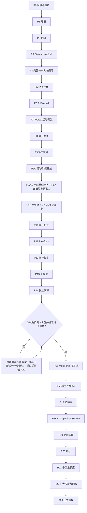

# Transflow PDF 翻译排版引擎详细开发计划 v0.1

> 文档状态：Draft；经 P9C 实测与 V1 最小落地复核后由项目负责人授权原文件修订，作为 P9A.0/P9A/P9B 后续施工基线
> 编制日期：2026-07-20
> 计划范围：Transflow 独立闭环 + MerqFin 联调替换
> 主依据：`docs/设计/Transflow_PDF翻译排版引擎_总体设计_v0.1.md`（下称“【总体设计】”）

本文是后续开发和验收的施工记录，不是第二份总体设计。它冻结阶段顺序、依赖、任务边界、产出物、测试范围和 Gate；类内部算法、函数拆分和少量文件名允许实施时按仓库现状做小幅修正，但不得改变当前批准版本【总体设计】已经确认的系统边界和主流程不变量。每一施工部分都必须绑定明确的设计版本与 SHA-256；通常设计修订必须由阶段 Gate 的实测证据触发、经项目负责人批准后形成新版本，禁止实施者静默覆盖当前基线。本次项目负责人已明确要求直接修订两份 v0.1 原文件且不新增文件，因此属于一次显式例外：P9C 的历史输入 hash、报告和 Gate 保持原样，P9A.0 必须登记修订前后 hash 并发布当前 baseline/traceability overlay，不得把新 hash 伪装成 P9C 当时输入。

---

## 0. 文档元信息

| 项 | 内容 |
|---|---|
| 文档名称 | Transflow PDF 翻译排版引擎详细开发计划 |
| 版本 | v0.1 Draft |
| 执行仓库 | 第一部分：`transflow`；第二部分：`transflow` + `MerqFin`（独立仓库） |
| 计划落盘 | `transflow/docs/计划/` |
| 第一部分完成点 | P14 / Gate G14：Transflow 独立闭环验收与阶段间复盘 |
| 第二部分完成点 | P23 / Gate G23：MerqFin PDF 执行链正式由 Transflow 替换 |
| 追溯规则 | 每个阶段必须追溯到【总体设计】具体章节；文档未展开的工程任务标记 `[补述]` |
| 工期口径 | 本版不虚构日历工期；阶段顺序和 Gate 是硬约束，实际工期在 P0 根据执行资源和样本规模形成排期表 |

P9C 已按历史 baseline 执行完成；当前必须先完成 P9A.0/G9A-0，不能直接进入 P9A.1。当前没有阻塞 P9A.0 施工的 `[待决策]`。凡【总体设计】§27 已明确要求“实施阶段冻结”的细项，已被安排到对应阶段，不在本计划中静默假定答案；ProductAcceptance 的分层人工质量阈值由 P14.1 基于 G9A-0–G13 真实证据冻结，在此之前只能记 `NOT_EVALUATED`，不得静默记 PASS。

---

## 1. 计划结论与两段式边界

### 1.1 总施工路线

本计划严格分成两个不可混施工的大部分：

1. **第一部分 P0–P14：Transflow 独立闭环。** 从生产目录和环境开始，依次完成合同、Standalone Adapter、完整 PDF 纵向切片、分类迁移、PdfKernel、逐叶工具箱、P9C 迁移纠偏、P9A/P9B Repair Memory、Freeform、暂停恢复、并发与故障注入，最后在固定翻译 Provider 下完成整本 PDF 闭环。P9C/P9A/P9B 是插入 P9 与 P10 之间的补充阶段，不重编号既有下游阶段；当前硬顺序为 `P9 -> P9C（已完成） -> P9A.0 -> P9A.1～P9A.4 -> G9A -> P9B -> P10`。
2. **阶段间强制停点：G14。** Transflow 独立闭环完成后，必须由项目负责人复核真实结果。若结论要求调整边界、合同或迁移顺序，应保留 P0–P14 所绑定的设计历史版本，另行形成并批准新设计/计划版本，重验受影响 Gate；未形成明确复核结论，不得进入 P15。
3. **第二部分 P15–P23：MerqFin 联调替换。** 重新冻结 MerqFin 兼容基线，再实施共享 PostgreSQL 增量、互斥领取、防腐层、AI Capability Service、受控联调、影子、灰度和正式切换。

这条路线追溯【总体设计】§1、§3、§22、§23、§26。

### 1.2 本计划内的工作

- 从零建立 `src/transflow/` 生产包、`resources/`、`tests/`、`scripts/` 和合同/迁移文档。
- 建立独立 Python 环境、锁文件、服务健康检查、测试和 Gate 基建。
- 迁移两个 spike 的核心逻辑，同时保留来源哈希、行为变化和 Gate 证据。
- 建设完整 PDF 文档级协调、页面流水线、最终 Patch 回放和 Artifact 发布。
- 建设 Freeform 有界恢复，但不改变现有 Classification taxonomy 和已知叶 Toolbox 模式。
- 建设暂停、恢复、取消、重试、并发、日志、保留策略和故障注入。
- 第一部分使用文件 Checkpoint 和固定/确定性翻译 Provider 验证可复现工程闭环，并以只存在于 `tests/migration` 的真实 Qwen Adapter 补充翻译完整性和产品质量证据；Qwen Adapter 不进入 production wheel/wiring。
- 第二部分通过 MerqFin 唯一 Alembic 链扩展共享数据库，建立 Transflow 防腐层和独立 AI Capability Service。
- 完成影子、灰度、回滚演练和 PDF 执行权正式切换。

### 1.3 本计划明确不做

- 不重写 MerqFin 前端、产品任务、审校和交付流程。
- 不在第一部分连接或修改 MerqFin 生产数据库。
- 不建设 CLI、通用 Agent 框架、插件自动发现系统或第二套业务库。
- 不把 HTML、DOM/CSS、Chrome/Chromium、`insert_htmlbox` 引回 PDF 主链。
- 不把单页 PDF 列表作为生产输入，不用页级 PDF 拼接最终文档。
- 不 OCR、翻译或覆盖图片内部文字。
- 不为公共 DTO 提前建立第三个仓库、全局 `site-packages` 或无版本共享源码目录。
- 不在 P23 内删除旧 PDF JobRunner；旧代码删除必须在稳定观察期后单独设计、单独授权。

追溯【总体设计】§3.4、§16.5、§19.3、§21、§23.5、§26。

---

## 2. 施工纪律

### 2.1 依赖纪律

1. 每个阶段只能消费已经通过上游 Gate 的产物。
2. 阶段内可以先写测试再实现，也可以按模块小步提交；不得提前实现下游阶段的生产 wiring。
3. P0–P14 不依赖 MerqFin 表、MerqFin Python 源码或真实 AI 服务。
4. P15 之前不得创建共享数据库 migration，不得修改 MerqFin Worker 的领取谓词。
5. P16 只建立 Schema 与互斥路由；P17 才让 Transflow Adapter 读写共享库。
6. P18 完成两个 AI HTTP 合同后，P19 才允许真实语义联调。
7. P20 影子 Gate 未通过不得进入灰度；P21 小流量 Gate 未通过不得扩大；P22 未完成回滚演练不得全量切换。

### 2.2 变更克制

- 新生产代码不得运行时 import `spikes/`。
- Lift-and-Wrap 迁移时只做日志、依赖注入、超时、有限重试、进程安全和 Port 适配等已批准改造。
- 分类阈值、Prompt、布局、字体、Repair、Quality Gate、所有权和 Freeform 分解规则的行为变化必须留下独立评审记录。
- 没有至少两个稳定消费者、合同一致和等价回归证据，不抽公共层。
- 尚未完成阶段暴露的上游缺陷必须回到上游修复并重过 Gate，不在下游加旁路补丁。对已经归档的 P5–P9，后续发现的横切合同遗漏由经批准的 P9C 纠偏阶段前向承接：历史代码、报告和 Gate 不回写、不伪造重验；P9C 必须登记历史基线、问题证据、合同优先级、受影响回归和新 Gate，从 G9C 起约束后续阶段。P9C 完成后又确认的当前文档/治理差异由 P9A.0 承接，只补当前 baseline 与前向合同，不改写 P9C 已完成证据。

追溯【总体设计】§9.4、§20、§24.8。

### 2.3 `[补述]` 与 `[待决策]`

| 标记 | 使用方式 |
|---|---|
| `[补述]` | 【总体设计】没有展开，但为可重复安装、测试、数据库演练、安全或发布所必需的工程任务；不得改变总体设计边界 |
| `[待决策][D-阶段-序号]` | 新发现的问题会改变合同、Schema、所有权、用户行为、质量门槛或替换策略，且无法从现有设计和事实中确定 |

发现 `[待决策]` 时必须执行：

1. 在当前阶段验收记录中写明问题、证据、受影响范围和可选方案。
2. 将当前阶段状态标记为 `BLOCKED_BY_DECISION`，停止会受其影响的实现和 Gate。
3. 向项目负责人提问，不静默选择。
4. 收到回复后，若只影响施工细节则更新本计划的决策记录和追溯矩阵；若改变设计目标、边界或主流程，默认保留原设计版本并形成经负责人批准的新版本。只有负责人像本次一样明确授权“原文件修订且不新增文件”时才可原地修改，但必须记录 old/new hash、保留历史 Gate 输入并建立当前 overlay，仍禁止静默改写验收基线。
5. 重新执行受影响测试，当前 Gate 通过后才能继续。

不影响边界的普通实现选择，例如相邻小文件是否合并、局部函数命名和测试夹具组织，由执行者按仓库风格自行修正，不升级为 `[待决策]`。

### 2.4 Gate 纪律

- 每个 P 阶段只有一个主 Gate `Gx`；复杂阶段可以有叶级子 Gate，但主 Gate 仍是进入下一阶段的唯一条件。
- Gate 必须有：验收目标、量化清单、复现方法、证据位置和通过结论。
- Gate 结论只允许 `PASS | FAIL | BLOCKED_BY_DECISION`，不得使用含糊的“基本通过”。
- 代码存在、测试证据和生产启用是三件事；Toolbox 只有叶级 Gate 通过才可在 Catalog 中 `enabled=true`。
- 所有 Gate 先本地可复现；CI 是否自动触发不影响本地 Gate 的权威性。

### 2.5 子任务七段式与双线锁定

从 P0.1 到 P23.4，每个小节必须同时具备以下七段，缺少任一段即表示计划不完备：

1. **实现功能**：本小节交付的工程能力；纯调研/审计任务必须明确写“无运行时功能”。
2. **任务描述**：说明本小节解决什么问题、交给下游什么结果。
3. **设计追溯**：精确到【总体设计】具体章节；设计未覆盖处标记 `[补述]` 并说明目的。
4. **前置依赖与交付接口**：列明消费哪个已过 Gate 的合同/模块，向哪个下游交付什么输入输出；禁止隐式反向依赖。
5. **实施步骤**：只写施工动作和产物，不预写具体函数实现。
6. **测试用例**：使用唯一 ID，写清输入/前置、动作和预期结果。
7. **验收标准**：小节自己的完成条件，不等同于阶段 Gate。

双线锁定规则：

- **实现线**：`设计章节 -> Px.y -> 前置/接口 -> 实施步骤 -> Px.y-Tnn -> 小节验收`。
- **阶段验收线**：`Gate Gx-y -> Px.y -> Px.y-Tnn/E2E-ID -> 量化标准 -> Gate 结论`。
- Gate 不得引用未在本计划定义的测试 ID；测试不得缺少设计追溯；实现不得只有 Gate 要求而没有施工小节。
- 测试 ID 格式固定为 `P<阶段>.<子任务>-T<两位序号>`，例如 `P3.1-T01`；字母补充阶段使用 `P9C.1-T01`、`P9A.0-T01`、`P9A.1-T01`、`P9B.1-T01`。端到端用例继续使用附录 C 的 `TF-E2E-*`、`MF-E2E-*`。
- 后续实现可以增加测试用例，但必须先把新增 ID、场景和预期补入本计划或当前 Gate 验收记录。

---

## 3. 目标目录与仓库边界

### 3.1 Transflow 目标目录

P0 先创建生产骨架；后续阶段只按职责填充，不为了对齐目录图制造空壳类。

```text
transflow/
├─ .github/workflows/ci.yml            # [补述] 快速静态/单元/合同 Gate；重型 PDF E2E 手动或定时
├─ pyproject.toml
├─ README.md
├─ lock/或项目选定的唯一锁文件
├─ docs/
│  ├─ 设计/
│  ├─ 计划/
│  ├─ 合同/
│  ├─ 迁移/
│  └─ reports/gates/                 # 只保存精简 Gate 结论；大运行证据不进生产包
├─ resources/
│  ├─ prompts/{classification,toolboxes}/
│  ├─ manifests/{classification_taxonomy.json,toolbox_catalog.json,repair_rule_registry.json}/
│  ├─ schemas/{model_decision.v1.schema.json,page_translation.v1.schema.json,semantic_unit_map.v1.schema.json,translation_completeness.v1.schema.json,translated_diagnostic.v1.schema.json,document_layout_memory.v1.schema.json,page_repair_memory.v1.schema.json}/
│  ├─ fonts/font_manifest.json
│  └─ exemplars/classification/
├─ src/transflow/
│  ├─ domain/
│  ├─ application/
│  ├─ ports/
│  ├─ classification/
│  ├─ pdf_kernel/
│  ├─ toolboxes/
│  ├─ freeform/
│  ├─ adapters/
│  │  ├─ standalone/
│  │  ├─ checkpoint/
│  │  ├─ filesystem/
│  │  ├─ translation/
│  │  ├─ ai_service/
│  │  ├─ postgres/                    # P17 才启用生产实现
│  │  └─ merqfin/                     # P17 才启用生产实现
│  └─ runtime/
├─ scripts/                           # 开发/Gate/迁移工具，不是用户 CLI
└─ tests/
   ├─ unit/
   ├─ contract/
   ├─ integration/
   ├─ migration/
   ├─ workflow/
   ├─ regression/
   ├─ fault_injection/
   └─ fixtures/
```

目录职责和依赖方向以【总体设计】§19 为权威。P0 可以合并低内聚价值的小文件，但必须保留 `domain -> 无外层依赖`、`application -> ports/domain/核心算法`、`adapters -> ports` 的方向。

### 3.2 MerqFin 第二部分落点

P15 重新核对 MerqFin 当前目录后再冻结精确文件路径，计划只固定职责落点：

```text
MerqFin/
├─ backend/alembic/                   # 唯一共享 Schema 迁移历史
├─ backend/runtime/                   # 旧 Worker PDF 领取谓词收紧；非 PDF 职责保留
├─ backend/repositories/              # 互补 claim SQL
├─ backend/<ai-capability-service>/   # 独立进程：ModelGateway + Translation Capability
├─ backend/prompt/、llm/、术语/TM      # 由 AI Service 复用，不复制到 Transflow
└─ 现有 API/preview/review/download    # 保持合同，必要变更只做兼容扩展
```

AI Capability Service 的精确包名由 P15 基于 MerqFin 当时目录风格确定；这是局部命名，不改变“代码留在 MerqFin、独立进程、无 PDF 调度权”的边界。

### 3.3 环境分层

| 环境 | 建立阶段 | 用途 | 禁止事项 |
|---|---|---|---|
| Transflow 开发/测试 venv | P1 | 固定/确定性 Provider、fake AI、文件 Checkpoint、PDF 测试 | 不安装生产 LiteLLM/Provider SDK，不读取 MerqFin 源码 |
| Transflow 集成 venv | P17 | PostgreSQL、共享文件和真实 AI HTTP Adapter | 不与 MerqFin 共用 venv |
| MerqFin 现有环境 | P15/P16 | 现有 API、Worker、Alembic、产品功能 | 不把 Transflow 源码加入 `PYTHONPATH` |
| AI Capability Service venv | P18 | LiteLLM、Provider、Prompt/术语/TM、两个 HTTP 能力 | 不 claim Job，不处理 PDF |
| 隔离测试 PostgreSQL | P16 | migration、claim、CAS、故障注入 | 不直接在生产库试验 downgrade/破坏性用例 |

追溯【总体设计】§5.3–§5.5、§16.5、§19.3、§21.1。

---

## 4. 阶段总览（依赖顺序即施工顺序）

| 阶段 | 名称 | 关键产出 | 直接依赖 | Gate | 设计映射 |
|---|---|---|---|---|---|
| P0 | 施工基线、目录与 Gate 骨架 | 新生产目录、迁移台账、追溯矩阵、测试入口 | 无 | G0 | T0 |
| P1 | 独立环境、依赖与服务基线 | venv、锁文件、字体/许可、健康检查、环境探针 | G0 | G1 | T0 |
| P2 | 领域合同、Schema 与架构边界 | Domain/Port、状态、Catalog、JSON Schema、错误目录 | G1 | G2 | T0 |
| P3 | Standalone、Checkpoint、Artifact 与测试 AI | 文件账本、原子 Artifact、固定翻译、fake HTTP 合同 | G2 | G3 | T0/T1 基础 |
| P4 | 首条完整 PDF 纵向闭环 | 完整 PDF 枚举、固定路由、页面终态、源副本 Patch 回放 | G3 | G4 | T1 |
| P5 | 页面分类引擎迁移 | 匿名分类基线、规则/模型/复核/Resolver、路由接线 | G4 | G5 | T2 |
| P6 | SharedPdfKernel 与 Preservation | 全内核迁移、字体、约束、文档特性预检和校验 | G5 | G6 | T3 |
| P7 | Toolbox 生产合同与迁移骨架 | Legacy Adapter、Catalog、Margin、叶级 Gate 模板 | G6 | G7 | T4 基础 |
| P8 | 工具箱第一批 | visual_only、single、chart、diagram | G7 | G8 | T4 wave A |
| P9 | 工具箱第二批 | cover、contents、end、multi、table、anchored_blocks | G8 | G9 | T4 wave B |
| P9C | 已完成阶段问题回顾与横切合同补齐 | 历史问题账本、SemanticUnitMap、翻译完整性、诊断候选、路由错配、三类结论 | G9 | G9C | T4 corrective baseline |
| P9A | 当前基线补齐与文档级布局记忆 | P9A.0 字母阶段/当前 baseline/PageTextInventory 前置闭合；全页屏障、窄化源布局基线、翻译前目标策略、并发只读快照、失效与恢复 | G9C | G9A | T4 Repair Memory A |
| P9B | 页级修复记忆与多轮重排 | 页级有效布局、同 run 失败账本、RepairAtomCatalog/叶 comparator、候选或物化失败终态、接受/回滚与停止 | G9A | G9B | T4 Repair Memory B |
| P10 | 工具箱第三批 | visual_anchored、五类 composite、全路由收口 | G9B | G10 | T4 wave C |
| P11 | Freeform 有界恢复 | region_composed、私有 Adapter、合并、回退 | G10 | G11 | T5 |
| P12 | 状态机、暂停恢复与幂等 | 安全点、恢复、取消、attempt、故障窗口 | G11 | G12 | T6-A |
| P13 | 并发、重试、观测与服务化 | 有界队列、ProcessPool、三层重试、日志、容量基线 | G12 | G13 | T6-B |
| P14 | Transflow 独立闭环验收 | 全回归、整本年报 E2E、独立交付报告、阶段间复盘 | G13 | G14 | T7 |
| P15 | MerqFin 兼容基线再冻结 | 当前 main/Schema/API/Worker/文件/Prompt 基线与修订版计划 | G14 + 负责人允许进入第二部分 | G15 | M0 |
| P16 | PostgreSQL 增量与互斥路由 | Alembic、execution_engine、run 表、索引、claim 矩阵 | G15 | G16 | M1 |
| P17 | MerqFin 防腐层与产品投影 | Job/Checkpoint/Control/Product/FS Adapter、fencing | G16 | G17 | M2 |
| P18 | AI Capability Service | 两个 HTTP 能力、JSON Prompt Profile、治理和合同测试 | G17 | G18 | M3 |
| P19 | 受控全链路联调 | 同机共享 DB/FS、真实 AI、预览/审校/下载合同 | G18 | G19 | M2+M3 集成 |
| P20 | 影子对照 | shadow run、零产品写入、差异与质量报告 | G19 | G20 | M4 |
| P21 | 小流量灰度 | 白名单新 PDF 由 Transflow 唯一执行 | G20 | G21 | M5-A |
| P22 | 扩大灰度与回滚演练 | 默认 Transflow、例外 legacy、容量与回滚证据 | G21 | G22 | M5-B |
| P23 | 正式替换与稳定观察 | 新 PDF 全量 Transflow、旧 Worker 永久排除 PDF | G22 | G23 | M6 |

阶段可以拆成多个小提交，但不得合并 Gate 或跳阶段。没有团队人数、目标发布日期和硬性能 SLO 前，本计划只给出依赖排期；P0.5 根据实际资源形成日历版排期，不反向改变上述顺序。

### 4.1 依赖图



---

## 5. 全局测试与 Gate 规范

### 5.1 测试分层

| 层级 | 目录 | 主要证明 |
|---|---|---|
| 单元测试 | `tests/unit/` | 纯合同、状态转换、规则、Patch 原语、所有权、预算和错误映射 |
| 合同测试 | `tests/contract/` | JSON Schema、Port、Catalog、Toolbox、MerqFin 字段/API、Preview 合同 |
| 集成测试 | `tests/integration/` | 文件原子性、进程池、fake/真实 HTTP、PostgreSQL、共享文件系统 |
| 迁移测试 | `tests/migration/` | spike 与生产模块的 Route/Unit/Patch/Finding/verdict 等价；直连 Qwen 仅在此层 |
| 工作流测试 | `tests/workflow/` | Document/Page 状态机、暂停恢复、最终化和 Artifact 发布 |
| 回归测试 | `tests/regression/` | 匿名分类、逐叶工具箱、文档级 PDF 和反过拟合 |
| 故障注入 | `tests/fault_injection/` | 进程崩溃、租约、磁盘、HTTP、rename/commit 窗口和应急透传 |
| 端到端测试 | 独立测试编排 | 一份完整 PDF 从提交到完整目标 PDF；第二部分再覆盖 MerqFin 产品链 |

### 5.2 通用量化标准 `[补述·工程质量基线]`

每个 Gate 除阶段专项标准外，必须满足：

1. 本阶段计划内测试执行通过率 `100%`，无跳过的阻断级用例。
2. 格式、lint、类型/静态分析和架构边界检查 `0 error`。
3. 新增或修改的核心代码行覆盖率不低于 `85%`、分支覆盖率不低于 `75%`；状态机、CAS/fencing、Patch owner、Checkpoint、Schema 校验等关键模块分支覆盖率不低于 `90%`。
4. 迁移叶的质量不以覆盖率替代：原有回归、迁移合同、硬约束和叶级 Gate 必须全部执行。
5. 本阶段任务、产物和测试对【总体设计】追溯覆盖率 `100%`。
6. 禁止项扫描命中数 `0`；若是测试目录允许的迁移 Adapter，必须在 allow-list 中且不进入 production wheel。
7. Gate 记录包含代码提交、配置/Schema/字体/样本哈希、测试命令、结果摘要和已知限制。

覆盖率如因生成代码或仅声明 Schema 失真，可以在 Gate 记录中排除明确文件；不得整体降低关键模块阈值。若实际仓库工具不支持某一指标，P0 必须建立等价可复现检查，而不是删除标准。

### 5.3 统一 Gate 入口 `[补述]`

P0 建立一个轻量开发入口，推荐形态：

```text
python scripts/run_gate.py Gx
```

入口只编排现有格式化、静态检查、pytest、依赖/包内容扫描和报告汇总，不建设通用工作流框架。每个阶段同时在文档中列出可直接运行的底层测试集合，防止 Gate 脚本掩盖失败。

### 5.4 测试材料分层

| 材料层 | 用途 | 管理规则 |
|---|---|---|
| F0 小型合成 fixture | 合同、状态机、失败窗口 | 可提交、无敏感数据、运行快 |
| F1 匿名 spike fixture | 分类与逐叶迁移等价 | 删除文件名/sample_id/gold 泄漏；记录来源哈希 |
| F2 完整真实 PDF | 文档级 E2E | 从 `样本/年报` 登记内容哈希；生产逻辑不得按身份分支 |
| F3 Preservation fixture | 旋转、CropBox、书签、链接、批注、表单、签名等 | 每种承诺特性至少一份正/降级样本 |
| F4 Freeform 组合 fixture | 测试注入 `body.freeform` | 注入只存在 tests wiring，不改分类 gold |
| F5 MerqFin 集成 fixture | DB/API/preview/review/download | P15 基于当前 main 重新录制并匿名化 |

大样本、run、录制响应和渲染证据不进入 production wheel；是否提交 Git 由数据许可和仓库规则决定，Gate 至少保存哈希和可定位说明。

### 5.5 Gate 失败处理

- 本阶段缺陷：停在本阶段修复，重跑本阶段全部 Gate。
- 上游合同缺陷：回退上游，修复后依次重跑受影响 Gate。
- `[待决策]`：按 §2.3 暂停并向项目负责人提问。
- 外部服务临时不可用：若 Gate 验证的正是降级行为，可按预期结果通过；否则是环境失败，不得伪装为产品 PASS。
- 缺少真实 freeform 样本：只能通过收敛、所有权和安全 Gate，不能写“布局质量已验证”。

### 5.6 测试用例写法

每个 `Px.y-Tnn` 至少包含“输入/前置、动作、预期”三个部分。示例：

```text
P3.1-T01
  输入：允许根内一份可读取、3 页、未经拆分的完整 PDF 绝对路径
  动作：StandaloneRunAdapter 构造 DocumentRunRequest
  预期：接受；source hash、语言、配置和稳定 run identity 完整；不产生单页输入列表
```

“通过率 100%”只有在对应测试用例已定义、已实现并实际运行后才有效。Gate 报告必须列出执行的测试 ID 和证据位置，不能只写一句“完整 PDF 用例通过”。

---

# 第一部分：Transflow 独立闭环（P0–P14）

> 第一部分不连接 MerqFin 生产数据库、不修改 MerqFin 代码、不调用真实生产语义服务。跨仓库接缝通过 Port、JSON Schema、fake HTTP 和测试 Adapter 提前验证。

---

## P0 · 施工基线、目录与 Gate 骨架

| 项 | 内容 |
|---|---|
| 阶段目标 | 从当前 spike/文档仓库中建立全新的生产代码施工面，冻结迁移来源、追溯、目录和 Gate 入口 |
| 设计追溯 | §1–§4、§19、§20.1、§21、§22 T0、§26–§28 |
| 依赖 | 无 |
| 关键产物 | `pyproject.toml` 初始配置、`src/transflow/`、`resources/`、`tests/`、`scripts/`、迁移台账、追溯矩阵、Gate 记录模板 |

### P0.1 冻结施工输入

**实现功能：** 无运行时功能；建立所有后续迁移可复核的输入基线。

**任务描述：** 将当前总体设计版本冻结为 P0–P14 的不可变验收输入，同时冻结两个 spike 和 MerqFin 参考基线，形成逐迁移单元的来源与成熟度台账，防止后续凭目录名或记忆迁移。G14 后若负责人批准修订，必须形成新版本和新 hash，不覆盖本阶段历史基线。

**设计追溯：** 【总体设计】§2.2–§2.3（既有资产及真实成熟度）、§20.1（迁移记录字段）、§20.5–§20.7（来源到生产落点）、§28（参考资产）。

**前置依赖与交付接口：** 输入为已确认的设计与两个 spike；输出为 P0.2/P2/P5–P10 使用的只读迁移台账和哈希，不产生运行时依赖。

**实施步骤：**

1. 记录【总体设计】版本和 SHA-256、两个 spike 的 Git 提交/目录哈希、MerqFin 仅作参考的基线提交。
2. 清点分类源码、Prompt、exemplar、taxonomy、结果语义；清点 SharedPdfKernel、合同和全部 Toolbox 叶。
3. 为每个迁移单元记录 `source_path/source_hash/target_path/change_policy/evidence_status/evidence_ref`；没有根级 manifest 或 Gate 的单元明确登记为 `NO_ROOT_GATE`。
4. 将现有 `FAIL/NOT_EVALUATED/EVIDENCE_INSUFFICIENT/PASS_NON_BLIND/NO_ROOT_GATE` 原样登记，不做乐观修正；目录、prompt、tools 或历史 run 的存在不能替代根级结论。

**测试用例：**

- `P0.1-T01`：以两个 spike 当前目录为输入生成迁移台账；预期分类、Kernel、合同和全部 Toolbox 叶均有且仅有一条记录。
- `P0.1-T02`：在未改文件的前提下重复计算版本/目录/文件哈希；预期两次结果完全相同。
- `P0.1-T03`：抽查已知 FAIL、NOT_EVALUATED、PASS_NON_BLIND 以及无根级 Gate 的叶；预期前者与原始 manifest/gate 一致，后者登记为 `NO_ROOT_GATE`，均不被提升。

**验收标准：**

- [ ] 三类输入均有可重算版本/哈希，迁移单元缺失或重复为 `0`。
- [ ] 全部已知成熟度状态有原始证据引用；无根级 Gate 的资产不冒充旧 verdict；未经证据升级数量为 `0`。

### P0.2 创建生产目录

**实现功能：** 建立可导入但不含业务空壳的 Transflow 生产包骨架。

**任务描述：** 把生产代码、资源、测试、脚本和文档施工面与 spikes/样本/legacy workflows 分开，为后续模块提供唯一落点。

**设计追溯：** 【总体设计】§19.1（目标目录）、§19.2（层职责）、§19.3（仓库边界）；本计划 §3.1。

**前置依赖与交付接口：** 依赖 P0.1 的来源边界；向 P0.3/P1 交付可导入 production 包和确定目录，不允许从下游模块反向 import spikes。

**实施步骤：**

1. 按本计划 §3.1 创建首批必要目录和包入口；只创建近期会填充的文件。
2. 配置 production 包发现范围，排除 `spikes/`、样本、runs、reports、tmp 和 legacy workflows。
3. 更新根 README，说明 production、spikes、样本和 legacy workflows 的边界。

**测试用例：**

- `P0.2-T01`：从仓库根 import `transflow`；预期只从 `src/transflow` 解析成功。
- `P0.2-T02`：扫描 production import graph；预期不存在指向 `spikes` 或 MerqFin 源码的边。
- `P0.2-T03`：构建初始 wheel 并列出内容；预期不含样本、运行证据、临时目录和 legacy workflows。

**验收标准：**

- [ ] 目标一级目录齐全，production package 可导入。
- [ ] 为目录图批量创建的空业务类数量为 `0`，包边界扫描违规为 `0`。

### P0.3 建立测试和 Gate 骨架 `[补述]`

**实现功能：** 建立后续所有阶段共用的本地测试、Gate、覆盖率、架构扫描和快速 CI 入口。

**任务描述：** 用最小脚本把检查命令统一为可复现退出码和报告；不建立第二套工作流引擎。

**设计追溯：** 【总体设计】§19.1（tests/scripts）、§21.1（pytest 测试选型）、§24（测试与 Gate）；`[补述]` CI/覆盖率/统一 Gate 入口是可重复工程验收所需。

**前置依赖与交付接口：** 依赖 P0.2 的包/目录；向所有后续阶段提供 pytest 标记、Gate 入口、覆盖率和包审计接口。

**实施步骤：**

1. 建立 pytest 配置、测试标记、覆盖率配置、最小 smoke test 和架构扫描入口。
2. 建立 `scripts/run_gate.py` 或等价轻量入口、Gate 结果模板和失败退出码。
3. 建立最小 CI：提交/合并请求运行安装、静态、快速单元和合同测试；重型 PDF/E2E 只手动或定时运行。
4. 建立 production wheel 内容检查，排除非生产材料。

**测试用例：**

- `P0.3-T01`：运行最小 smoke/coverage/architecture 测试；预期全部可执行并生成报告。
- `P0.3-T02`：注入一个失败测试；预期 Gate 返回非零退出码并指出失败用例。
- `P0.3-T03`：校验 CI 配置；预期快速 Gate 被包含，重型 PDF E2E 不在每次提交触发。
- `P0.3-T04`：向临时构建目录放入禁止材料；预期 wheel 内容检查失败。

**验收标准：**

- [ ] 本地 Gate 成功/失败退出码准确率 `100%`。
- [ ] CI 与本地快速 Gate 命令一致，禁止包内容检测可阻断构建。

### P0.4 建立计划追溯与决策台账

**实现功能：** 无运行时功能；建立设计、任务、测试和 Gate 的双向追溯机制。

**任务描述：** 让任一实现或验收项都能定位设计依据，并让设计遗漏按 `[待决策]` 流程显式阻断。

**设计追溯：** 【总体设计】§20.1（迁移可追溯）、§24（测试/Gate）、§26–§27（已确认和待冻结决策）；本计划 §2.3、§2.5。

**前置依赖与交付接口：** 输入为本计划和 P0.1 台账；向所有阶段交付追溯矩阵、决策登记和阶段状态规则，不进入 production runtime。

**实施步骤：**

1. 建立“阶段 -> 设计章节 -> 产物 -> 测试 -> Gate”矩阵。
2. 建立阶段冻结项、`[待决策]`、行为变化和风险记录模板。
3. 为每个阶段定义独立提交边界，不混入下游半成品。

**测试用例：**

- `P0.4-T01`：抽取全部 Px.y、测试 ID 和 Gate 行做引用解析；预期不存在悬空引用。
- `P0.4-T02`：创建一条模拟 `[待决策]`；预期阶段状态变为 BLOCKED，且在决策关闭前 Gate 不能 PASS。
- `P0.4-T03`：从设计章节和测试 ID 双向查询；预期均能定位对应任务和 Gate。

**验收标准：**

- [ ] 追溯矩阵悬空引用为 `0`，施工性设计章节覆盖率 `100%`。
- [ ] `[待决策]` 阻断流程可复现，未关闭决策不能越 Gate。

### P0.5 形成实际排期 `[补述]`

**实现功能：** 无运行时功能；形成第一部分可执行的日历/迭代排期。

**任务描述：** 基于真实执行资源和测试成本安排 P1–P14，不用虚假工期压缩 Gate；P15–P23 只保留依赖顺序。

**设计追溯：** 【总体设计】§22–§23（两阶段实施顺序）；`[补述]` 日历排期属于项目执行治理。

**前置依赖与交付接口：** 依赖 P0.1–P0.4 已知工作量和 Gate；向执行者交付 P1–P14 日历，不能成为跳过 Gate 的授权。

**实施步骤：**

1. 统计执行资源、目标服务器、fixture 数量、重型 E2E 和人工评审时长。
2. 为 P1–P14 分配迭代窗口、评审人和缓冲，标出 G14 强制复盘。
3. 第二部分只记录相对顺序，待 G14 后重新估算。

**测试用例：**

- `P0.5-T01`：对排期执行依赖拓扑校验；预期任何阶段开始时间不早于全部前置 Gate。
- `P0.5-T02`：模拟某 Gate 延迟；预期下游日期顺延而非跳过 Gate。

**验收标准：**

- [ ] P1–P14 每阶段有负责人/执行窗口/Gate 窗口，逆向依赖数量为 `0`。
- [ ] P15–P23 未在 G14 前承诺不可验证的固定发布日期。

### Gate G0

**验收目标：** 新生产施工面可被独立识别、测试和追溯，且没有修改 spike 行为。

**量化清单：**

| # | 验收项 | 量化标准 | 设计/任务追溯 | 测试证据 |
|---|---|---|---|---|
| G0-1 | 输入基线 | 三类输入版本/哈希和全部迁移单元覆盖率 `100%` | §2.2–§2.3、§20；P0.1 | P0.1-T01~T03 |
| G0-2 | 目录与包边界 | 包可 import；空壳业务类、spike/MerqFin import 均为 `0` | §19；P0.2 | P0.2-T01~T03 |
| G0-3 | 测试/Gate/CI | 成功和失败退出码准确；快速 CI 可解析；重型 E2E 不误触发 | §21.1、§24；P0.3 | P0.3-T01~T04 |
| G0-4 | 追溯与决策 | 施工性章节覆盖率 `100%`；悬空引用 `0` | §20.1、§26–§27；P0.4 | P0.4-T01~T03 |
| G0-5 | 排期依赖 | P1–P14 逆向依赖 `0`；G14 停点已排入 | §22–§23；P0.5 | P0.5-T01~T02 |
| G0-6 | 待决策 | 阻塞 P1 的 `[待决策]` 为 `0` | 本计划 §2.3 | 决策台账 |

**验收方法：** 运行 G0 入口、包内容扫描、目录/追溯/迁移台账校验；对 `spikes/` 做 Git diff，确认无本阶段行为修改。

**通过标准：** 清单全部满足并归档 G0 记录；否则不得安装生产环境或开始合同实现。

---

## P1 · 独立环境、依赖与服务基线

| 项 | 内容 |
|---|---|
| 阶段目标 | 建立可从干净机器复现的 Transflow 独立 Python 环境，并验证 PDF、字体、文件系统、进程和内部服务基础条件 |
| 设计追溯 | §5.3–§5.5、§9.3、§16.5、§19.3、§21.1、§22 T0、§27 |
| 依赖 | G0 |
| 关键产物 | 精确 Python/PyMuPDF 版本、锁文件、环境说明、字体清单、配置模板、health smoke、许可记录 |

### P1.1 冻结运行基线

**实现功能：** 无业务运行功能；冻结 Transflow 可发布的解释器、PDF 引擎和字体资产基线。

**任务描述：** 用开发机和目标服务器事实确定准确版本与许可，避免后续因环境漂移重录全部布局基线。

**设计追溯：** 【总体设计】§9.3（受控字体）、§21.1（Python/PyMuPDF）、§27（精确版本和字体待冻结）。

**前置依赖与交付接口：** 依赖 G0 环境施工面；向 P1.2–P1.4、P6、P13 交付精确版本/许可/字体 manifest。

**实施步骤：**

1. 探测开发机和目标服务器 OS、Python、CPU、内存、文件系统和服务管理方式。
2. 以兼容测试冻结 Python minor/patch、PyMuPDF 和直接依赖版本。
3. 审查 PyMuPDF 许可，选择 CJK/Latin/fallback 字体并记录许可、版本和 SHA-256。

**测试用例：**

- `P1.1-T01`：在开发机和目标服务器运行环境探针；预期产生字段完整、可比较的环境清单。
- `P1.1-T02`：用冻结 Python/PyMuPDF 打开并保存最小 PDF；预期无版本/二进制错误。
- `P1.1-T03`：校验字体 manifest 与实际文件；预期路径、许可、版本、SHA 全部一致。

**验收标准：**

- [ ] Python/PyMuPDF/字体均有唯一精确版本和哈希，未决许可项为 `0`。
- [ ] 两类目标环境均完成兼容探针；不支持环境已显式阻断而非静默忽略。

### P1.2 建立独立 venv 与锁文件

**实现功能：** 提供可从干净环境重复安装的独立 Transflow 运行与测试依赖。

**任务描述：** 建立最小 production/test 依赖分组和唯一锁文件，切断 spike、MerqFin 和全局 Python 环境的隐式耦合。

**设计追溯：** 【总体设计】§16.5（独立 venv/lock）、§19.3（禁止跨仓库 import）、§21.1（基础选型）。

**前置依赖与交付接口：** 输入为 P1.1 版本基线；向所有 Transflow 阶段交付 production/test 安装集合和锁文件。

**实施步骤：**

1. 创建 Transflow 独立 venv，不复用 spike、MerqFin 或全局环境。
2. 配置最小 production/test 依赖组并生成唯一锁文件。
3. 扫描并禁止 LiteLLM、Provider SDK、模型密钥包、通用 Agent 和 HTML PDF Renderer。

**测试用例：**

- `P1.2-T01`：连续两次从空 venv 按锁文件安装；预期依赖版本清单完全一致。
- `P1.2-T02`：运行依赖一致性检查；预期冲突和缺失为 `0`。
- `P1.2-T03`：向 production 依赖临时加入禁止包；预期依赖 Gate 阻断。
- `P1.2-T04`：清除工作区 PYTHONPATH 后 import；预期 production 包仍正常，MerqFin/spike 不可隐式导入。

**验收标准：**

- [ ] 干净安装可复现，`pip check` 或等价检查错误为 `0`。
- [ ] production 依赖禁止项和跨环境路径依赖命中为 `0`。

### P1.3 建立配置和健康探针

**实现功能：** 提供无秘密配置模板及 liveness/readiness 基础能力。

**任务描述：** 让服务在启动前识别配置、字体、工作目录和外部 AI capability 依赖的可用性，不把“进程存在”误报为 ready。P1 只交付健康探针合同并用测试内 disposable HTTP stub 验证算法，不反向依赖 P3 才建设的 fake AI Service。

**设计追溯：** 【总体设计】§5.3（部署）、§5.5（文件形态）、§16.3（受控服务接口）、§19.1 runtime、§21.1 FastAPI/Uvicorn。

**前置依赖与交付接口：** 依赖 P1.1/P1.2 的版本与环境；向 P3 fake AI、P13 runtime 和 P19 集成部署交付配置/health 合同。

**实施步骤：**

1. 定义 workspace、字体、并发占位、内部 HTTP、日志等配置模板并排除秘密。
2. 建立 liveness 与 readiness；P1 用 disposable HTTP stub 检查外部 capability 可达/不可达判定，P3.4 再接入真实 fake AI Service 做运行合同复验。
3. 记录非 Docker 和可选容器场景的同路径约束。

**测试用例：**

- `P1.3-T01`：配置完整且 disposable HTTP stub 可达；预期 live/ready 均成功。
- `P1.3-T02`：缺少字体或 workspace 不可写；预期 live 可成功、ready 明确失败并给出错误码。
- `P1.3-T03`：disposable HTTP stub 不可达；预期 ready 失败，不泄漏 token/配置秘密，且测试不 import/启动 P3 fake AI 实现。
- `P1.3-T04`：扫描配置和日志样本；预期 API key/secret 明文命中为 `0`。

**验收标准：**

- [ ] live/ready 语义分离，四类配置/依赖故障均能准确识别。
- [ ] 配置模板可提交且不含秘密，容器不是启动前置条件。

### P1.4 验证主机能力 `[补述]`

**实现功能：** 提供目标主机 PDF/文件/进程/字体能力探针。

**任务描述：** 在写业务代码前验证原子 rename、PDF 进程隔离和字体覆盖这些硬前提，失败时阻断而不是在运行中碰运气。

**设计追溯：** 【总体设计】§9.3（字体）、§14.2（PDF 进程安全）、§18.1–§18.3（工作区和原子协议）；`[补述]` 主机能力预检。

**前置依赖与交付接口：** 输入为 P1.1 字体/版本与 P1.3 workspace 配置；向 P3 Artifact、P6 Kernel、P13 ProcessPool 交付主机能力结论。

**实施步骤：**

1. 验证源只读打开、同文件系统 partial/rename、PNG 写入/解码和允许根。
2. 验证 ProcessPool 子进程独立 import、打开/关闭 PDF；拒绝跨进程 fitz 对象。
3. 验证字体加载、CJK/Latin 覆盖和缺字错误。

**测试用例：**

- `P1.4-T01`：在允许根执行 partial 写、fsync/关闭、rename、再读；预期内容哈希一致且无半文件。
- `P1.4-T02`：把 partial 和 final 放到不同文件系统；预期探针拒绝原子发布声明。
- `P1.4-T03`：向 ProcessPool 传路径/页码；预期子进程成功独立打开。传 fitz.Document；预期拒绝/序列化失败被明确捕获。
- `P1.4-T04`：渲染 CJK/Latin 和缺字 fixture；预期已登记字形成功、缺字产生明确 Finding。

**验收标准：**

- [ ] 原子文件、PDF 进程和字体探针通过率 `100%`。
- [ ] 不满足原子 rename/字体/进程条件的环境不能进入 G1 PASS。

### Gate G1

**验收目标：** 干净环境能重复安装并具备后续 PDF 开发所需的真实主机能力。

**量化清单：**

| # | 验收项 | 量化标准 | 设计/任务追溯 | 测试证据 |
|---|---|---|---|---|
| G1-1 | 运行基线 | Python/PyMuPDF/字体版本、哈希、许可缺项 `0` | §9.3、§21.1、§27；P1.1 | P1.1-T01~T03 |
| G1-2 | 独立安装 | 两次空 venv 安装差异 `0`；依赖检查错误 `0` | §16.5；P1.2 | P1.2-T01~T04 |
| G1-3 | 禁止依赖 | production 禁止包/跨仓库路径命中 `0` | §19.3、§21；P1.2 | P1.2-T03~T04 |
| G1-4 | Health | 正常与三类故障的 live/ready 判定准确率 `100%` | §5.3、§19.1；P1.3 | P1.3-T01~T04 |
| G1-5 | 主机能力 | 原子 rename、PNG、ProcessPool、字体探针全部通过 | §14.2、§18；P1.4 | P1.4-T01~T04 |
| G1-6 | 可复现说明 | 干净环境按文档安装和运行 smoke 一次成功 | §16.5、§21.1 | 环境验收记录 |

**验收方法：** 清理并重建测试 venv，执行依赖、许可、字体、文件系统、进程池和 health smoke；保存版本清单。

**通过标准：** 全部探针通过，或明确不可支持的目标环境已标记 `[待决策]` 并获得处理结论。

---

## P2 · 领域合同、Schema 与架构边界

| 项 | 内容 |
|---|---|
| 阶段目标 | 在不依赖数据库、HTTP 实现和 PyMuPDF 对象的前提下，冻结文档、页面、分类、翻译、Toolbox、Artifact 和状态合同 |
| 设计追溯 | §4、§6、§7.1、§8–§9、§11–§13、§16–§18、§21.3、§22 T0、§24.1、§24.8 |
| 依赖 | G1 |
| 关键产物 | Domain models、Ports、状态/错误目录、taxonomy、Catalog、两个 JSON Schema、配置/实现指纹规则 |

### P2.1 建立核心领域合同

**实现功能：** 提供与数据库、HTTP 和 PyMuPDF 实现无关的 Job/Page/Classification/Translation/Toolbox/Artifact 领域模型。

**任务描述：** 把总体设计中的核心名词和不变量固化为可序列化、可校验的唯一合同，供后续所有模块共同消费。

**设计追溯：** 【总体设计】§4（术语）、§7.1（DocumentRunRequest）、§9（PageToolbox）、§11.2（Region）、§12（结果）、§16.1（Translation/Model ports）、§17–§18（Artifact）。

**前置依赖与交付接口：** 依赖 G1 的稳定 Python 环境；向 P2.2–P14 交付纯领域类型，禁止 import 外层实现。

**实施步骤：**

1. 定义 DocumentRunRequest、JobSnapshot/ControlState/DocumentOutcome 和完整 PDF 单输入合同。
2. 定义 PageFacts/PageExecutionContext/PagePlan/PageOutcome、稳定 page identity 和终态。
3. 定义 ClassificationRoute、Translation Unit/Batch/Bundle、Toolbox/Patch/Finding/Decision。
4. 定义 Region、Artifact、配置快照、指纹、错误码和结果维度。

**测试用例：**

- `P2.1-T01`：合法 Job/Page/Route/Translation/Patch/Artifact 模型序列化再反序列化；预期语义和顺序不变。
- `P2.1-T02`：DocumentRunRequest 传单个完整 PDF path；预期模型有效。传 list/目录；预期模型拒绝。
- `P2.1-T03`：Translation Bundle 缺失、重复、新增、改写 unit ID；预期四类均拒绝。
- `P2.1-T04`：PagePatch source/page/geometry/owner 不匹配；预期合同拒绝。

**验收标准：**

- [ ] 核心合同全部可序列化且 round-trip 无差异。
- [ ] 非法身份、顺序、owner 和单页列表输入拒绝率 `100%`。

### P2.2 建立状态与不变量

**实现功能：** 提供 JobControlState、PagePipelineState、终态和 Checkpoint 版本不变量。

**任务描述：** 在存储和调度实现之前固定允许转换、拒绝转换和最终化前置条件，避免后续各 Adapter 自行解释状态。

**设计追溯：** 【总体设计】§7.2（活动不变量）、§12.2（完成规则）、§13.1–§13.4（状态与恢复）、§18.3（Checkpoint）。

**前置依赖与交付接口：** 依赖 P2.1 的 Job/PageOutcome；向 P3 Checkpoint、P4 Coordinator、P12 控制面和 P17 Postgres Adapter 交付转换规则。

**实施步骤：**

1. 列出控制状态和页面状态的合法边、终态和重复命令语义。
2. 固化每页必有 FINALIZED、Repair/重试有界、全页终态后才 Finalizer。
3. 定义 checkpoint version 单调条件和 source/config/font/toolbox/schema 兼容字段。

**测试用例：**

- `P2.2-T01`：遍历状态图合法边；预期全部可转换且产出目标状态。
- `P2.2-T02`：遍历非法边和终态回退；预期全部拒绝且原状态不变。
- `P2.2-T03`：任一页面未 FINALIZED 时请求 document final；预期拒绝。
- `P2.2-T04`：提交相同/更小 checkpoint version；预期不覆盖更高版本。

**验收标准：**

- [ ] 合法/非法状态边测试覆盖率 `100%`，关键分支覆盖率 `>=90%`。
- [ ] 三个主流程不变量无法被普通状态调用绕过。

### P2.3 建立 Port

**实现功能：** 提供 JobQueue、Checkpoint、Artifact、Translation、ModelDecision 五个外部能力 Port。

**任务描述：** 把核心流程与第一/第二阶段存储和服务实现隔离，使 Standalone、PostgreSQL、fake/real AI 可以替换而不改 Application。本阶段冻结的跨边界 Port 只有 `JobQueuePort/CheckpointPort/ArtifactPort/TranslationPort/ModelDecisionPort`；后续内部值对象、核心协作者和单一 Adapter 不得随意追加 `Port` 后缀。

**设计追溯：** 【总体设计】§5.6（协调通道）、§9.1（类图 Ports）、§16.1（两个逻辑接口）、§19.2（ports 层）。

**前置依赖与交付接口：** 输入为 P2.1/P2.2 类型；向 P3/P17/P18 Adapter 交付最小接口，Application 只依赖 Port。

**实施步骤：**

1. 按职责定义五个 Port 的输入、输出、错误和幂等语义。
2. 删除表名、HTTP client、Provider SDK、fitz.Document 等实现泄漏。
3. 分离 ModelDecision 和 Translation 合同，即使由同一 Adapter 实现。
4. 冻结命名映射：`StandaloneRunAdapter` 和 `MerqFinJobQueueAdapter` 实现 `JobQueuePort`；控制读取使用 `JobQueuePort.read_control()` 返回 `ControlSignal`；FreeformRecovery 和 ProductProjection 保持核心模块/Adapter 身份，不新增公共 Port。

**测试用例：**

- `P2.3-T01`：用内存 fake 分别实现五个 Port；预期 Application 类型检查/合同测试无需外部库。
- `P2.3-T02`：静态扫描 Port 签名；预期 MerqFin 表、httpx、数据库驱动、fitz 类型命中 `0`。
- `P2.3-T03`：交换 Fixed/HTTP Translation 实现；预期调用方合同不变。
- `P2.3-T04`：扫描 production 接口及后续计划映射；预期未登记的公共 `*Port`、重复 JobQueue/Control/ProductProjection Port 数量为 `0`。

**验收标准：**

- [ ] 五个 Port 均有成功/错误合同测试，未登记公共 Port 数量为 `0`。
- [ ] Port 实现细节泄漏命中 `0`，两个 AI 逻辑合同未合并。

### P2.4 建立资源合同

**实现功能：** 提供版本化 taxonomy、Toolbox Catalog、两个 JSON Schema 和资源指纹规则。

**任务描述：** 让路由、跨服务合同和运行资源都能按版本/哈希恢复和审计，防止目录存在即启用。

**设计追溯：** 【总体设计】§8.3（Catalog）、§16.4–§16.5（JSON/Schema）、§19.1 resources、§22 T0。

**前置依赖与交付接口：** 依赖 P0.1 迁移台账和 P2.1 合同；向 P3 fake AI、P5 Classification、P7 Catalog、P18 AI Service 交付资源合同。

**实施步骤：**

1. 迁移并版本化 taxonomy，建立全部叶的初始 Catalog 与 evidence/disabled 信息。
2. 建立两个 JSON Schema、版本和内容哈希。
3. 定义 Prompt/Schema/font/Catalog 进入 config/implementation fingerprint 的规则。

**测试用例：**

- `P2.4-T01`：对照设计路由枚举 Catalog；预期每条 Route 恰好一条记录。
- `P2.4-T02`：修改 Schema/Prompt/Catalog 任一字节；预期对应 fingerprint 变化。
- `P2.4-T03`：重复生成 Schema；预期无 diff，版本和哈希稳定。
- `P2.4-T04`：尝试启用无 PASS 证据叶；预期 Catalog 校验失败。

**验收标准：**

- [ ] 路由缺失/重复为 `0`，未验证叶误启用为 `0`。
- [ ] 资源重复生成漂移为 `0`，任何受控资源变化可由指纹检出。

### P2.5 建立架构边界测试

**实现功能：** 提供自动化架构边界与禁止依赖检查。

**任务描述：** 把总体设计中的分层和禁用技术变成可执行测试，后续每个 Gate 自动复用。

**设计追溯：** 【总体设计】§3.4（非目标）、§19.2–§19.3（依赖方向）、§21（选型）、§24.8（架构边界测试）。

**前置依赖与交付接口：** 依赖 P0.3 Gate 框架和 P2.1–P2.4 包结构；向所有后续 Gate 交付 architecture test 集合。

**实施步骤：**

1. 建立 domain/ports/application/adapters 的 import 规则。
2. 扫描 spikes/MerqFin/LiteLLM/Provider/模型 endpoint/Agent 框架禁止依赖。
3. 扫描 HTML/Chrome/insert_htmlbox/页级 PDF 拼接主链入口。

**测试用例：**

- `P2.5-T01`：在测试分支注入 domain->PyMuPDF import；预期架构测试失败。
- `P2.5-T02`：注入 production->spikes/MerqFin import；预期失败。
- `P2.5-T03`：注入 LiteLLM/模型 endpoint/Chrome/insert_htmlbox；预期分别失败。
- `P2.5-T04`：合法 runtime->adapter->port 和 application->port 依赖；预期通过。

**验收标准：**

- [ ] 所有非法依赖 mutation 均被检出，漏检为 `0`。
- [ ] 合法依赖方向不被误报，架构测试可在后续 Gate 重复运行。

### Gate G2

**验收目标：** 所有后续模块都能只依赖稳定合同施工，且合同不预埋第二阶段实现细节。

**量化清单：**

| # | 验收项 | 量化标准 | 设计/任务追溯 | 测试证据 |
|---|---|---|---|---|
| G2-1 | 核心合同 | round-trip 全绿；非法 list/ID/owner 拒绝率 `100%` | §4、§7、§9、§11–§12；P2.1 | P2.1-T01~T04 |
| G2-2 | 状态不变量 | 合法/非法边覆盖 `100%`；关键分支 `>=90%` | §13、§18.3；P2.2 | P2.2-T01~T04 |
| G2-3 | Port 边界 | 五 Port 合同全绿；实现类型泄漏和未登记公共 Port 均为 `0` | §5.6、§9.1、§16.1；P2.3 | P2.3-T01~T04 |
| G2-4 | Taxonomy/Catalog | 每 Route 恰好一次；无证据启用数 `0` | §8.3；P2.4 | P2.4-T01、P2.4-T04 |
| G2-5 | Schema/指纹 | 两 Schema 版本/哈希固定；重复生成漂移 `0` | §16.4、§22 T0；P2.4 | P2.4-T02~T03 |
| G2-6 | 架构红线 | mutation 检出率 `100%`；实际禁止项命中 `0` | §19.2–§19.3、§24.8；P2.5 | P2.5-T01~T04 |
| G2-7 | 评审 | 合同/架构评审问题关闭率 `100%` | §26–§27 | 评审记录 |

**验收方法：** 运行 unit/contract/architecture 测试、Schema 重生成 diff、Catalog 完整性检查和设计评审清单。

**通过标准：** 合同和架构评审均 PASS；任何会改变系统边界的问题必须升级为 `[待决策]`。

---

## P3 · Standalone、Checkpoint、Artifact 与测试 AI

| 项 | 内容 |
|---|---|
| 阶段目标 | 用文件系统和测试 Provider 建立可持久化、可审计、可故障注入的第一阶段外部边界 |
| 设计追溯 | §3.2、§9.1、§13、§16.2、§17–§18、§22 T0/T1、§24.1/§24.4 |
| 依赖 | G2 |
| 关键产物 | StandaloneRunAdapter、FilesystemCheckpointAdapter、ArtifactStore、Fixed/Deterministic Provider、fake AI HTTP、结构化日志 |

### P3.1 Standalone 运行来源

**实现功能：** 提供第一阶段唯一的完整 PDF 运行提交入口 `StandaloneRunAdapter`。

**任务描述：** 把测试代码或仅开发环境内部 HTTP 请求转换为 DocumentRunRequest；只接受“一份完整 PDF 文件”，不接受调用者预拆后的页面列表，也不创建产品任务。

**设计追溯：** 【总体设计】§3.2（第一阶段入口）、§7.1（DocumentRunRequest 和完整 PDF）、§9.1（StandaloneRunAdapter）、§19.1（standalone adapter）、§22 T1、§24.1（完整 PDF 合同）。

**前置依赖与交付接口：** 依赖 G2 的 DocumentRunRequest/错误合同和 G1 的允许根配置；向 P3.2 交付 `run_id + validated source path/hash + languages + config snapshot`，向 P4 DocumentCoordinator 交付单一完整 PDF 请求。

**实施步骤：**

1. 定义测试调用和仅开发环境内部 HTTP 两种 wiring，但共用同一输入校验与请求构造逻辑。
2. 校验路径为允许根内的现有普通文件、扩展/文件签名可识别、PyMuPDF 可读取并至少包含一页。
3. 计算 source hash，冻结语言和配置快照，创建 run identity；不预枚举/预拆成单页输入列表。
4. 拒绝目录、文件列表、路径逃逸、越允许根的符号链接/重解析点和损坏输入，返回结构化错误。
5. 只创建 Transflow run workspace/manifest，不写 MerqFin Job 或第二套产品任务。

**测试用例：**

- `P3.1-T01`：输入允许根内一份可读、3 页、未经拆分的完整 PDF 绝对路径 + 合法语言/配置；预期接受并构造唯一 DocumentRunRequest，source hash 正确。
- `P3.1-T02`：输入允许根内一份可读、1 页的完整 PDF 文件；预期接受。这里证明“一页完整文档”合法，禁止的是“预拆页面列表”。
- `P3.1-T03`：输入 `[page-1.pdf, page-2.pdf]` 或包含一个单页 PDF 的 list；预期在合同层拒绝，错误码为输入形态错误，不创建 run。
- `P3.1-T04`：输入允许根目录本身；预期拒绝“必须是普通文件”，不递归寻找 PDF。
- `P3.1-T05`：输入相对路径 `../outside.pdf`、规范化后越出允许根的绝对路径；预期拒绝路径逃逸。
- `P3.1-T06`：输入允许根内符号链接/Windows 重解析点，但最终目标在允许根外；预期按解析后路径拒绝。
- `P3.1-T07`：输入 `.txt`、零字节文件、损坏 PDF、加密且不可打开 PDF；预期分别返回明确不可读/不支持错误，不创建可执行 run。
- `P3.1-T08`：缺少 source/target language 或配置字段类型错误；预期 Schema 拒绝并列出字段，不创建 workspace。
- `P3.1-T09`：同一合法请求重复提交；预期每次创建独立 run identity，但 source/config hash 一致且不产生产品 Job。

**验收标准：**

- [ ] P3.1-T01~T09 全部实现并通过。
- [ ] 合法完整 PDF 接受率 `100%`；目录/list/逃逸/重解析点越界/损坏输入拒绝率 `100%`。
- [ ] 拒绝输入产生的 run/workspace/产品任务数量均为 `0`。

### P3.2 文件 Checkpoint 与工作区

**实现功能：** 提供第一阶段文件工作区和原子 JSON Checkpoint 存储。

**任务描述：** 为每个 run/page 隔离私有文件，按“写 partial—关闭/校验—同文件系统 rename—原子替换 manifest”提交安全点，支持版本单调和恢复。

**设计追溯：** 【总体设计】§3.2（FilesystemCheckpointAdapter）、§13.4（恢复）、§18.1（工作目录）、§18.3（Checkpoint 提交协议和崩溃窗口）、§22 T1/T6。

**前置依赖与交付接口：** 输入为 P3.1 已验证 run/source 和 P2.2 checkpoint 合同；向 P4/P12 提供 `load_run/commit_page/complete_run`，向 P3.3 提供已解析的 run/page 允许路径。

**实施步骤：**

1. 按 standalone-job/run/page 建立私有目录、允许根校验和 run manifest。
2. 为每类 Checkpoint 定义 payload、hash、version 和引用 Artifact 清单。
3. 实现 partial 写入、关闭/校验、原子 rename、原子 manifest 替换顺序。
4. 接受更高 version；相同 version+内容幂等；拒绝较小 version 或同 version 不同内容。
5. 扫描 manifest 未引用文件为孤儿，但不删除未知/其他 run 文件。

**测试用例：**

- `P3.2-T01`：首次提交 page checkpoint v1；预期文件和 manifest 同时可读，hash 一致。
- `P3.2-T02`：提交 v2；预期替换权威版本。再提交 v1；预期拒绝且 v2 不变。
- `P3.2-T03`：重复提交 v2 相同内容；预期幂等成功且权威文件不重复。提交 v2 不同内容；预期冲突。
- `P3.2-T04`：在 partial rename 前崩溃；预期恢复忽略/清理 partial 并重放。
- `P3.2-T05`：rename 后 manifest 前崩溃；预期识别未引用孤儿，可按同 hash 复用或登记清理。
- `P3.2-T06`：manifest 提交后重启；预期校验 hash 后加载 v2，不重放已提交步骤。
- `P3.2-T07`：page path 使用 `../` 或重解析点指向其他 run；预期拒绝。
- `P3.2-T08`：清理扫描遇到未登记文件/其他 run；预期保留，不递归删除。

**验收标准：**

- [ ] P3.2-T01~T08 全部通过，Checkpoint 版本倒退和同版本分叉成功数 `0`。
- [ ] 任一已提交 manifest 引用不存在/未校验文件的数量为 `0`。

### P3.3 Artifact 与日志

**实现功能：** 提供不可变 Artifact put/verify 和结构化审计日志。

**任务描述：** 统一页面、预览、Patch、报告和最终文件的内容哈希/路径/标签，并保证状态只能引用已经校验的 Artifact。

**设计追溯：** 【总体设计】§12.1（结果维度）、§17（日志/证据）、§18.1–§18.3（Artifact/发布/Checkpoint）。

**前置依赖与交付接口：** 依赖 P3.2 安全路径和 P2.1 Artifact/错误合同；向 P4/P12/P13 提供 `put_atomic/verify/artifact_ref` 和结构化 logger。

**实施步骤：**

1. 实现 run-specific 不可变路径、partial 写入、内容哈希、原子 rename 和 verify。
2. 标记 final/audit/rebuildable-temp 三类文件并登记 manifest。
3. 建立 JSON 日志必填字段、error/fallback/artifact ref 和敏感数据过滤。
4. 在 Checkpoint 入口验证所有引用 Artifact 已存在、可读且 hash 正确。

**测试用例：**

- `P3.3-T01`：put 一个 Artifact 后 verify；预期内容、hash、路径和标签一致。
- `P3.3-T02`：相同内容重复 put；预期复用不可变对象或得到同一权威引用。相同路径不同内容；预期拒绝覆盖。
- `P3.3-T03`：Checkpoint 引用不存在、损坏或 hash 不匹配 Artifact；预期提交拒绝。
- `P3.3-T04`：记录含完整必填上下文的成功/降级/错误日志；预期字段完整率 `100%`。
- `P3.3-T05`：输入 API key、token、超长原文/Provider 响应；预期日志脱敏/截断，不出现秘密或无界载荷。

**验收标准：**

- [ ] P3.3-T01~T05 全部通过，不可变 Artifact 被覆盖次数 `0`。
- [ ] 状态引用半写/损坏 Artifact 数 `0`，日志秘密扫描命中 `0`。

### P3.4 测试翻译与 fake AI

**实现功能：** 提供 Fixed/Deterministic Translation Provider、fake AI Capability Service 和 Transflow HTTP Adapter。

**任务描述：** 在不接真实 Provider 的情况下验证 ModelDecision 与 Translation 两个跨服务合同、错误和降级 wiring。

**设计追溯：** 【总体设计】§16.1–§16.2（两个 Port 与第一阶段 Provider）、§16.4–§16.5（JSON/跨仓合同）、§22 T1、§24.1/§24.4。

**前置依赖与交付接口：** 输入为 P2.3 Ports、P2.4 Schemas 和 P1.3 HTTP 配置；向 P4/P5/P13 交付 Fixed/Deterministic/HttpAiCapabilityAdapter 和可编程 fake server。

**实施步骤：**

1. 实现按 unit ID 固定返回和基于输入 hash 确定性返回的测试 Provider。
2. fake service 暴露 ModelDecision、Translation、live/ready，并可配置超时/5xx/非法 JSON/Schema 错误。
3. HTTP Adapter 实现服务 token 占位、请求 ID、超时、错误映射、Schema 校验和审计摘要。
4. 确认 production/test wiring 分离，真实 Qwen/Provider 不进入 production wheel。

**测试用例：**

- `P3.4-T01`：同一 TranslationBatch 两次调用 Fixed/Deterministic；预期 unit 顺序、译文和响应 hash 完全一致。
- `P3.4-T02`：合法 ModelDecision 请求；预期 Schema-valid decision。合法 Translation 请求；预期每个 unit 恰好返回一次。
- `P3.4-T03`：fake 超时、5xx、429；预期映射为各自 retriable/timeout 错误，不伪装业务成功。
- `P3.4-T04`：fake 返回非法 JSON、缺失/重复/新增 unit ID；预期 Adapter 拒绝响应并给出合同错误。
- `P3.4-T05`：token 错误、请求过大；预期 fake service 拒绝且日志不泄漏 token。
- `P3.4-T06`：构建 production wheel；预期真实 Provider/Qwen test adapter 不在包内。
- `P3.4-T07`：启动本阶段真实 fake AI Service 并复用 P1 readiness probe；预期 live/ready 与两个合同依赖状态一致，停服后 readiness=false 且不误报。

**验收标准：**

- [ ] P3.4-T01~T07 全部通过，两个 HTTP 合同均有正/负用例，实际 fake AI readiness 行为与 P1 探针合同一致。
- [ ] 固定 Provider 可复现差异 `0`，production 真实 Provider 依赖命中 `0`。

### P3.5 崩溃窗口测试

**实现功能：** 提供文件 Checkpoint/Artifact 协议的系统性崩溃与安全回归集。

**任务描述：** 把【总体设计】§18.3 的每个崩溃窗口变成可重复注入的测试，证明恢复结论不是依靠正常关停。

**设计追溯：** 【总体设计】§18.2–§18.3（发布和崩溃窗口）、§24.4（工程故障注入）、§25（原子性/清理风险）。

**前置依赖与交付接口：** 依赖 P3.2/P3.3 的故障注入点；向 P4/P12 提供恢复矩阵和已验证的文件副作用语义。

**实施步骤：**

1. 为 rename/manifest/final publish 各关键边界建立可控崩溃点。
2. 每次重启后检查权威 manifest、孤儿、partial、hash 和可重放步骤。
3. 加入路径逃逸、重解析点和跨 run 清理攻击用例。

**测试用例：**

- `P3.5-T01`：Artifact rename 前崩溃；预期无权威引用，partial 可清理，步骤重放。
- `P3.5-T02`：Artifact rename 后 manifest 前崩溃；预期文件作为孤儿识别，不被当成已提交状态。
- `P3.5-T03`：manifest 后崩溃；预期按 hash 读取并跳过已提交步骤。
- `P3.5-T04`：final rename 后发布 manifest 前崩溃；预期恢复按 final hash 复用或安全清理，不改变旧权威指针。
- `P3.5-T05`：清理目录含跨 run 文件、符号链接/重解析点；预期只处理本 manifest 登记文件。

**验收标准：**

- [ ] P3.5-T01~T05 全部通过，任一崩溃后权威状态歧义数 `0`。
- [ ] 未登记/跨 run 文件被删除数量为 `0`。

### Gate G3

**验收目标：** 第一阶段所有外部副作用都通过可替换 Adapter，并能在崩溃后确定性恢复。

**量化清单：**

| # | 验收项 | 量化标准 | 设计/任务追溯 | 测试证据 |
|---|---|---|---|---|
| G3-1 | 完整 PDF 合法输入 | 3 页与 1 页完整 PDF 接受率 `100%`，请求字段/hash 完整 | §3.2、§7.1、§24.1；P3.1 | P3.1-T01～T02、P3.1-T09 |
| G3-2 | 非法输入 | 单页列表、目录、逃逸、重解析点越界、损坏/缺字段拒绝率 `100%`；副作用 `0` | §7.1、§18.1；P3.1 | P3.1-T03~T08 |
| G3-3 | Checkpoint | version 单调/幂等/冲突/路径隔离全部正确 | §13.4、§18.3；P3.2 | P3.2-T01~T08 |
| G3-4 | Artifact/日志 | 半写引用 `0`；不可变覆盖 `0`；日志字段 `100%`、秘密 `0` | §17–§18；P3.3 | P3.3-T01~T05 |
| G3-5 | 测试翻译 | 相同请求结果差异 `0`；真实 Provider production 依赖 `0` | §16.2；P3.4 | P3.4-T01、P3.4-T06 |
| G3-6 | fake AI 合同 | 两接口成功/超时/HTTP/JSON/ID/鉴权及真实 readiness 用例通过率 `100%` | §16.1、§24.1/§24.4；P3.4 | P3.4-T02~T05、P3.4-T07 |
| G3-7 | 崩溃窗口 | 五类崩溃后权威状态歧义 `0`，跨 run 删除 `0` | §18.3、§24.4；P3.5 | P3.5-T01~T05 |

**验收方法：** 运行 standalone contract、filesystem integration、fake AI contract、fault injection 和包内容扫描。

**通过标准：** 所有副作用路径均可重放、可审计且无半写权威状态。

---

## P4 · 首条完整 PDF 纵向闭环

| 项 | 内容 |
|---|---|
| 阶段目标 | 在不接真实分类模型的前提下，用一份完整多页 PDF 打通从枚举到完整目标 PDF 的最小纵向链路 |
| 设计追溯 | §7、§9、§12、§18、§22 T1、§24.1/§24.3/§24.8 |
| 依赖 | G3 |
| 关键产物 | 最小正式 SharedPdfKernel、最小 Document/Page Coordinator、固定测试路由、页面终态、预览 PNG、Document Finalizer、首份整本 E2E |

### P4.0 最小 SharedPdfKernel 先行实现

**实现功能：** 在最终 `pdf_kernel/` 模块和正式合同上提供 P4 纵向闭环所需的最小 PDF 机械能力。

**任务描述：** 从 spike Lift-and-Wrap 最小 facts、受控字体装载、唯一 Patch 解释器、PyMuPDF 候选/PNG 渲染、owner/protected guard、passthrough 和文档串行回放。该实现是 P6 的演进起点，不是临时第二套内核；候选页和最终文档从 P4 起就必须使用同一解释器。P4 只承诺页数、页序、page geometry/rotation/CropBox 和未授权对象不变的最小 Preservation 子集，完整文档特性矩阵由 P6.4 补全。

**设计追溯：** 【总体设计】§9.1、§9.3、§12.3、§18.2、§20.6、§22 T1/T3、§24.1、§24.3、§24.8。

**前置依赖与交付接口：** 输入为 G3 的领域合同、Artifact/Checkpoint、P1 字体 manifest 与主机能力、P0 迁移台账；输出为最终模块路径中的 `PageFactsExtractor` 最小子集、`PagePatchInterpreter`、PyMuPDF renderer、passthrough/final replay 和最小 Preservation validator，供 P4.1–P4.5 使用并由 P6 原位补全。

**实施步骤：**

1. 在最终 `pdf_kernel/` 路径迁入 P4 必需的最小 facts/font/patch/render/passthrough 能力，不建立 `temporary_kernel` 或测试专用 Patch 实现。
2. 将 `source_hash + page_no + geometry + owner/protected IDs` 作为 Patch 应用前置条件，禁止修改非 owner/保护对象。
3. 让 candidate render 与 document final replay 调用同一个解释器和同一 operation manifest。
4. 实现源副本回放、144 DPI PNG 与最小 Preservation 校验；P4 未承诺的文档级特性不得被误标为已支持。

**测试用例：**

- `P4.0-T01`：同一 source/page/Patch 分别走 candidate 与 final replay；预期解释器实现、操作序列、owner 校验和结构化结果一致。
- `P4.0-T02`：伪造跨 owner、protected object、错误 source hash/page geometry 的 Patch；预期应用前拒绝，部分写入数 `0`。
- `P4.0-T03`：使用 manifest 内/外字体渲染中英文本；预期只允许已登记字体，系统字体隐式探测数 `0`。
- `P4.0-T04`：对混合 Patch/透传的多页 PDF 串行回放；预期页数、页序、geometry/rotation/CropBox 保持率 `100%`。
- `P4.0-T05`：扫描模块、import graph 和 runtime trace；预期临时第二内核、第二 Patch 解释器、HTML/Chrome/页级 PDF 拼接调用均为 `0`。

**验收标准：** P4 所用 PDF 原语均位于最终模块；candidate/final 解释器分叉、越权写、系统字体隐式调用和临时第二内核数量均为 `0`；最小 Preservation 子集通过率 `100%`。

### P4.1 文档预检与稳定页枚举

**实现功能：** 完成完整 PDF 只读预检、稳定页枚举和 PageExecutionContext 构造。

**任务描述：** 由引擎而非调用方打开整本 PDF 并建立全部原始页清单，先以顺序执行证明页身份和文档边界。

**设计追溯：** 【总体设计】§7.1–§7.3、§9.1、§22 T1、§24.1/§24.3。

**前置依赖与交付接口：** 输入为 P3.1 DocumentRunRequest 和 P4.0 最小正式 PageFacts 实现；向 P4.2/P4.3 交付有序 page plan 列表。

**实施步骤：** 1. 只读打开并核对 source hash；2. 枚举页数、页序、geometry、rotation；3. 建立 1-based identity/context；4. 先用有界顺序调度。

**测试用例：**

- `P4.1-T01`：输入 3 页 PDF；预期 page_no 为 1/2/3 且 geometry 与源一致。
- `P4.1-T02`：输入含旋转/CropBox 页面；预期 context 完整保留。
- `P4.1-T03`：枚举期间源 hash 变化；预期中止当前 run 并记录输入不一致。

**验收标准：** 页遗漏/重复/乱序为 `0`；源文件保持只读。

### P4.2 测试固定路由

**实现功能：** 提供仅测试 wiring 使用的 visual_only/single 固定路由和默认透传。

**任务描述：** 在分类迁移前打通纵向切片，同时保证固定 Route 不进入 production wiring 或形成样本身份分支。

**设计追溯：** 【总体设计】§22 T1、§3.4（反特例）、§24.5/§24.8。

**前置依赖与交付接口：** 输入为 P4.1 page plan 与测试 fixture；向 P4.3 交付 Route；P5 必须替换该 wiring。

**实施步骤：** 1. fixture 按稳定 page identity 声明 Route；2. 未声明页透传；3. 隔离 test/production wiring；4. 只引入最小叶能力。

**测试用例：**

- `P4.2-T01`：fixture 声明 visual_only/single；预期只对应页命中。
- `P4.2-T02`：未声明页；预期透传。
- `P4.2-T03`：改文件名/公司名/sample ID；预期 Route 不变。
- `P4.2-T04`：production wiring 扫描；预期固定路由入口为 `0`。

**验收标准：** 固定 Route 仅测试可达；身份特例和 production 泄漏为 `0`。

### P4.3 页面流水线

**实现功能：** 打通最小页面 facts/template/unit/translation/patch/render/judge/finalize 流水线。

**任务描述：** 让每个 page plan 必然收敛为批准 Patch、降级 Patch 或原页透传，并发布页级 PNG。

**设计追溯：** 【总体设计】§7.2–§7.4、§9、§12、§18.3、§22 T1。

**前置依赖与交付接口：** 消费 P4.0–P4.2、P3 Fixed Provider/Artifact；向 P4.4 交付 PageOutcome+approved patch，向未来 P17 证明 PNG 合同。

**实施步骤：** 1. 构建最小模板/units；2. 调 Fixed Translation；3. 生成/应用/裁决 Patch；4. 失败转降级/透传；5. 原子发布 144 DPI PNG 和 page checkpoint。

**测试用例：**

- `P4.3-T01`：single 正常页；预期 Unit/Bundle/Patch/Judge/FINALIZED 完整。
- `P4.3-T02`：visual_only；预期无 TranslationUnit、原页透传。
- `P4.3-T03`：翻译缺失或 Judge 失败；预期区域/页面降级且仍 FINALIZED。
- `P4.3-T04`：PNG partial/解码失败；预期不提交 preview 指针。

**验收标准：** 每个输入页恰好一个 FINALIZED outcome；PNG 可解码率 `100%`。

### P4.4 文档最终化

**实现功能：** 提供源 PDF 副本上的串行 PagePatch 回放、校验和应急整本透传。

**任务描述：** 生成唯一完整目标 PDF，不使用页级 PDF 拼接或 HTML/Chrome，并在最终化失败时仍尽力交付源副本。

**设计追溯：** 【总体设计】§7.1/§7.4、§12.2–§12.3、§18.2、§22 T1、§24.3/§24.8。

**前置依赖与交付接口：** 输入为 P4.0 唯一解释器、P4.3 全部 PageOutcome 和 P3 Artifact；向 P4.5/P14 交付 immutable final PDF 与最小 preservation 摘要。

**实施步骤：** 1. 等待全页终态；2. 复制源 PDF；3. 按 page_no 串行回放；4. 校验结构/可打开性；5. 失败则重复制源文件；6. 原子发布。

**测试用例：**

- `P4.4-T01`：正常混合 Patch/透传；预期完整 PDF 页数/页序/geometry 不变。
- `P4.4-T02`：故意打乱 PageOutcome 输入；预期 Finalizer 仍按 page_no 或拒绝不完整清单。
- `P4.4-T03`：Patch 回放/校验失败；预期发布经校验源副本并标记整本降级。
- `P4.4-T04`：扫描最终化调用；预期页级 PDF 拼接、HTML/Chrome 调用 `0`。

**验收标准：** 正常/应急最终文件可打开率 `100%`；源页遗漏为 `0`。

### P4.5 恢复与 E2E

**实现功能：** 提供首条完整 PDF 恢复和端到端验收集。

**任务描述：** 用真实整本年报和小型故障 fixture 证明纵向链既能完成又能从文件 Checkpoint 恢复。

**设计追溯：** 【总体设计】§13.4、§18.3、§22 T1、§24.3–§24.4。

**前置依赖与交付接口：** 依赖 P4.1–P4.4；向 P5 提供稳定纵向基线，向附录 C 定义 TF-E2E-01/06/13 证据。

**实施步骤：** 1. 登记完整年报 hash；2. 执行正常 E2E；3. 在 page/preview/final 前注入中断；4. 覆盖最后页失败、全透传和暂时写失败。

**测试用例：**

- `P4.5-T01`：完整年报全页执行；预期单一完整目标 PDF（对应 `TF-E2E-13`）。
- `P4.5-T02`：页面完成后重启；预期已提交页不重跑。
- `P4.5-T03`：最后页失败；预期最后页透传且整本完成（对应 `TF-E2E-06`）。
- `P4.5-T04`：全部页透传；预期结构完整、outcome 降级。
- `P4.5-T05`：目标目录暂时失败后重试；预期无半写权威文件。

**验收标准：** P4.5 全用例通过；完整年报页数/页序保持率 `100%`。

### Gate G4

**验收目标：** 首条真实完整 PDF 链闭环，任何页面失败不导致漏页或无产物。

**量化清单：**

| # | 验收项 | 量化标准 | 设计/任务追溯 | 测试证据 |
|---|---|---|---|---|
| G4-1 | 页枚举 | 每源页恰好一个 context/outcome；遗漏/重复/乱序 `0` | §7.1；P4.1 | P4.1-T01~T03 |
| G4-2 | 固定路由隔离 | 未声明页透传 `100%`；production 固定 Route `0` | §22 T1；P4.2 | P4.2-T01~T04 |
| G4-3 | 页面流水线 | 正常/visual/翻译失败/Judge 失败均 FINALIZED；PNG 可解码 `100%` | §7.2–§7.4、§12；P4.3 | P4.3-T01~T04 |
| G4-4 | 最终化 | 页结构保持 `100%`；拼接/HTML/Chrome 调用 `0` | §12.3、§18.2；P4.4 | P4.4-T01~T04 |
| G4-5 | 完整年报 | 至少一份 F2 全页 E2E 产生单一完整 PDF | §22 T1；P4.5 | P4.5-T01、TF-E2E-13 |
| G4-6 | 故障与恢复 | 最后页/全透传/写失败仍收敛；已提交页重跑 `0` | §13.4、§24.4；P4.5 | P4.5-T02~T05、TF-E2E-06 |
| G4-7 | 最小正式 Kernel | 最终模块复用率 `100%`；candidate/final 解释器分叉、越权 Patch、临时第二内核 `0`；最小 Preservation `100%` | §9.1、§18.2、§22 T1/T3；P4.0 | P4.0-T01~T05 |
| G4-8 | fake AI | 两个 HTTP 合同随链路执行全绿 | §16.2 | P3.4-T02~T04 |

**验收方法：** 运行纵向 workflow/E2E、故障注入、PDF 结构比较、Artifact manifest 检查和禁止调用扫描。

**通过标准：** 完整 PDF 纵向链路全部满足；视觉质量只评价已声明的 single 页面，不把其他透传页计为工具箱成功。

---

## P5 · 页面分类引擎迁移

| 项 | 内容 |
|---|---|
| 阶段目标 | 按 Lift-and-Wrap 迁移分类 spike，在匿名输入下恢复规则、模型主判、最多一次复核、Resolver 和确定性 fallback |
| 设计追溯 | §2.2–§2.3、§8、§20.2/§20.5、§21.3、§22 T2、§24.1/§24.2/§24.5 |
| 依赖 | G4 |
| 关键产物 | ClassificationEngine、Evidence/Rules/Resolver、BoundedDecisionRunner、匿名基线、分类并发/审计、DocumentCoordinator 接线 |

### P5.1 建立匿名分类基线

**实现功能：** 无 production 路由功能；建立匿名分类评测集和事前阈值。

**任务描述：** 去除样本身份泄漏并冻结逐叶质量/风险门槛，为迁移分类提供可信基线。

**设计追溯：** 【总体设计】§8.1、§20.3–§20.5、§22 T2、§24.2/§24.5。

**前置依赖与交付接口：** 依赖 P0.1 来源台账、P4 PageFacts；向 P5.2–P5.5/G5 交付匿名 fixture、样本分层和阈值注册表。

**实施步骤：** 1. 授权选样并去身份；2. 统计叶/失败分布；3. 事前冻结 precision/recall/freeform/高代价误路由/最小样本阈值；4. 证据不足叶标记不可启用。

**测试用例：**
- `P5.1-T01`：扫描模型载荷/fixture；预期文件名、路径、sample ID、gold 泄漏 `0`。
- `P5.1-T02`：重复生成匿名集；预期样本 hash/分层稳定。
- `P5.1-T03`：阈值冻结后尝试按结果修改；预期 Gate 阻断并要求决策记录。

**验收标准：** 匿名基线可重放；阈值全部为数值且查看迁移结果后修改数 `0`。

### P5.2 迁移规则与证据

**实现功能：** 提供分类直接事实、工程规则和 typed evidence 生产实现。

**任务描述：** Lift-and-Wrap 迁移规则与证据，不改变阈值/分支/复核语义。

**设计追溯：** 【总体设计】§2.2、§8.1、§20.2/§20.5。

**前置依赖与交付接口：** 消费 P4 PageFacts、P5.1 匿名集；向 P5.3 Resolver 提供 rule result/evidence。

**实施步骤：** 1. 映射原证据到统一 PageFacts；2. 迁移规则和阈值；3. 登记行为差异；4. 锁定图片不进入翻译。

**测试用例：**
- `P5.2-T01`：匿名 fixture 对比规则/evidence；预期允许差异外等价。
- `P5.2-T02`：阈值边界上下扰动；预期分支随证据而非样本身份变化。
- `P5.2-T03`：图片化文字；预期只作分类证据，不生成翻译输入。

**验收标准：** 未声明规则差异 `0`；证据 schema 和来源引用完整率 `100%`。

### P5.3 迁移模型判断与 Resolver

**实现功能：** 提供有界模型主判/一次复核/确定性 Resolver。

**任务描述：** 保留分类 spike 控制流，同时把模型执行收口到 ModelDecisionPort。

**设计追溯：** 【总体设计】§20.5、§21.2–§21.3、§22 T2、§24.1。

**前置依赖与交付接口：** 输入 P5.2 evidence、P3 Http Adapter、P2 Schema；向 P5.4 输出 ClassificationRoute/failed_node。

**实施步骤：** 1. 包装 BoundedDecisionRunner；2. 迁移 primary/review/Resolver；3. 限制 schema/allow-list/次数；4. 隔离 Qwen migration adapter。

**测试用例：**
- `P5.3-T01`：规则明确；预期不调用模型或按原合同处理。
- `P5.3-T02`：主判与规则冲突；预期最多一次 review 后 Resolver。
- `P5.3-T03`：primary/review 超时或非法输出；预期确定性 failed_node/freeform。
- `P5.3-T04`：production wheel 扫描；预期 Qwen 直连为 `0`。

**验收标准：** primary/review 次数分别 `<=1`；无 schema/allow-list 外 action。

### P5.4 接入文档协调器

**实现功能：** 将真实 ClassificationEngine 接入完整 PDF 文档级调度。

**任务描述：** 替换测试固定路由，形成全页分类清单且不改变页 identity/终态规则。本子任务的接线、乱序归并和出口全集测试使用 fake ModelDecision；fake 罐装结果不得计入分类质量指标。

**设计追溯：** 【总体设计】§7.1–§7.4、§8.2、§22 T2。

**前置依赖与交付接口：** 依赖 P5.3 Route、P4 Coordinator；向 PageRouter 交付全页 Route 清单。

**实施步骤：** 1. 删除 production 固定 wiring；2. 接 ClassificationEngine；3. 受控并发；4. 验证 Route 出口全集。

**测试用例：**
- `P5.4-T01`：混合完整 PDF；预期每页一个 Route 且 page identity 不变。
- `P5.4-T02`：模型并发返回乱序；预期按 page_no 正确归并。
- `P5.4-T03`：未知/failed page.role；预期 Unclassified，不伪造 freeform。

**验收标准：** 全页 Route 覆盖 `100%`；固定 production Route 和结果串页为 `0`。

### P5.5 反过拟合与失败测试

**实现功能：** 提供分类反过拟合和模型失败回归套件。

**任务描述：** 证明 Route 由结构证据驱动，并验证每种模型失败都有确定出口。逐叶 precision/recall、freeform 率和高代价误路由只使用 `tests/migration` 中隔离的真实 Qwen 迁移 Adapter；fake ModelDecision 只验证 wiring，不能作为质量证据。

**设计追溯：** 【总体设计】§8、§21.3、§24.4–§24.5。

**前置依赖与交付接口：** 消费 P5.1–P5.4；向 G5/P14 提供分类质量与失败证据。

**实施步骤：** 1. 身份扫描；2. 顺序/尺寸/文本/未知文档 probes；3. HTTP/Schema/冲突失败；4. 输出指标和差异。

**测试用例：**
- `P5.5-T01`：改文件名/顺序；预期同页结构 Route 不因身份变化。
- `P5.5-T02`：缩放/文本替换保持结构；预期证据合理变化且无固定坐标特例。
- `P5.5-T03`：未知盲文档；预期指标计入阈值，不人工修 gold。
- `P5.5-T04`：各模型失败；预期全部收敛到已定义 Route/fallback。

**验收标准：** 反过拟合/失败用例通过率 `100%`；无无路由状态。

### Gate G5

**验收目标：** 分类控制流和失败语义迁入生产模块，且匿名基线达到事前冻结的质量标准。

**量化清单：**

| # | 验收项 | 量化标准 | 设计/任务追溯 | 测试证据 |
|---|---|---|---|---|
| G5-1 | 匿名基线 | 身份泄漏 `0`；阈值事前冻结 | §8.1、§24.5；P5.1 | P5.1-T01~T03 |
| G5-2 | 规则等价 | 未声明差异 `0`；图片翻译单元 `0` | §20.5；P5.2 | P5.2-T01~T03 |
| G5-3 | 有界模型 | primary/review 各 `<=1`；Qwen production 入口 `0` | §21.3；P5.3 | P5.3-T01~T04 |
| G5-4 | 文档接线 | fake ModelDecision 下每页一个 Route；串页/固定 wiring `0`；fake 质量计数 `0` | §7、§8.2；P5.4 | P5.4-T01~T03 |
| G5-5 | 质量阈值 | migration Qwen Adapter 上各匿名指标和高代价误路由达到冻结值；fake 结果计入数 `0` | §22 T2；P5.1/P5.5 | 分类指标报告、P5.5-T03 |
| G5-6 | 失败/反过拟合 | 全部失败有出口；身份/扰动用例全绿 | §24.4–§24.5；P5.5 | P5.5-T01~T04 |
| G5-7 | 上游回归 | G4 关键 E2E 全绿 | §22 T2 | P4.5-T01~T05 |

**验收方法：** 执行匿名分类回归、混淆矩阵与阈值检查、反过拟合 probes、ModelDecision 故障合同、production wheel 扫描和 P4 E2E。

**通过标准：** 阈值注册表全部达标；证据不足叶可保持能力不足，但不得造成无路由或停止整本任务。

---

## P6 · SharedPdfKernel 与 PDF Preservation

| 项 | 内容 |
|---|---|
| 阶段目标 | 在 P4 最小正式实现上完整迁移不含页面语义的 PDF 机械内核，并把文档特性预检、Patch 回放和 Preservation Contract 做成可验证能力 |
| 设计追溯 | §9.3、§12.3、§14.2、§18、§20.2/§20.6、§22 T3、§24.1/§24.3/§24.4 |
| 依赖 | G5 |
| 关键产物 | facts/fonts/patch/render/constraints/repair/passthrough/workspace、Preservation preflight/finalizer、受控字体回归 |

### P6.1 迁移 PDF 事实与工作区原语

**实现功能：** 提供统一、只读、可序列化的 `PageFacts`、稳定对象身份、保护对象清单和 run/page 私有工作区原语。

**任务描述：** 在 P4.0 最小正式实现的相同模块与合同上，从 Toolbox spike 补全 geometry、text、image、drawing、table 等不含页面语义的直接事实；对象 ID 必须由 source/page/对象事实稳定派生，不能依赖进程内地址。每个 PDF worker 独立打开文档，工作文件只进入 `job/run/page` 私有目录，读取事实不得修改 source。不得用第二套实现替换 P4 已验证的 Patch/渲染语义。

**设计追溯：** 【总体设计】§7.3、§9.3、§14.2、§18.1、§20.2、§20.6、§22 T3、§24.1、§24.4。

**前置依赖与交付接口：** 输入为 G5 的完整 PDF/PageContext、P2 `PageFacts` schema、P1 主机/PyMuPDF 能力和 P0 迁移台账；输出为 `PageFactsExtractor`、stable object IDs、`protected_object_ids`、workspace allocator 和来源/差异记录，供 Classification、P6.2–P6.4、P7 Toolbox 与 P11 Freeform。

**实施步骤：**

1. 对照 spike 逐字段登记 source path/hash、变换规则和允许差异，迁移直接事实提取。
2. 统一坐标系、page identity、clip/rotation/crop 和 text/image/drawing/table object identity。
3. 将图片、矢量、锁定对象及无法安全编辑对象登记为 protected，只输出可序列化 DTO。
4. 每个 worker 用规范 source path/page_no 独立 open/close；所有临时文件由 workspace allocator 分配。
5. 对 source hash、对象唯一性、跨进程序列化和 workspace 归属增加 invariant 检查。

**测试用例：**

- `P6.1-T01`：对迁移台账中的代表页分别运行 spike 与生产 extractor；预期所有已声明字段等价，差异只出现在批准的字段/容差并有解释。
- `P6.1-T02`：同一 source/page 在不同进程、不同 run 重复提取；预期 page/object IDs 和序列化 facts 一致。
- `P6.1-T03`：并发处理两个同名 PDF 和多个页面；预期 workspace、对象、日志、临时文件串扰 `0`。
- `P6.1-T04`：提取 facts 前后重算 source hash/mtime/对象结构；预期 source 内容修改数 `0`。
- `P6.1-T05`：输入旋转/CropBox、图片、矢量、表格和锁定对象 fixture；预期坐标/类型/protected IDs 与 gold 一致率 `100%`。
- `P6.1-T06`：尝试把 PyMuPDF Document/Page 或进程内对象放入 DTO；执行序列化；预期合同校验拒绝。

**验收标准：** 迁移字段来源和允许差异记录完整率 `100%`；对象身份跨进程稳定率 `100%`；source 修改、跨 run 串扰、不可序列化对象进入合同均为 `0`。

### P6.2 迁移字体、Patch 与渲染

**实现功能：** 提供受控字体注册/字形探测、唯一 `PagePatchInterpreter` 和基于 PyMuPDF 的候选页/PNG 渲染。

**任务描述：** 原位补全 P4.0 的唯一 Patch 解释器、字体和渲染能力；所有布局候选和最终 PDF 回放必须继续使用同一 Patch 语义与坐标变换。字体只能来自 P1 冻结 manifest，不搜索系统字体或静默替换。文本修改采用受控 redact/insert_textbox 等已验证 PyMuPDF 原语，禁止 HTML/Chrome、insert_htmlbox 和未批准渲染路径。

**设计追溯：** 【总体设计】§1、§9.1、§9.3、§12.3、§18.2、§21.1、§24.1、§24.8、§26。

**前置依赖与交付接口：** 输入为 P1 font manifest/capability、P2 `PagePatch` contract、P6.1 facts/protected IDs；输出为 FontRegistry、glyph probe、PagePatchInterpreter、candidate renderer 和禁止调用规则，供 P6.3、P7–P11、PageFinalizer/DocumentFinalizer。

**实施步骤：**

1. 迁移并收敛字体加载、字体 hash、字形覆盖和 fallback 决策，启动时校验 manifest。
2. 为每类 Patch operation 定义输入、坐标、owner/protected guard、执行顺序和错误/Finding。
3. 候选验证和最终回放共用同一 interpreter；PNG 预览仅由 PyMuPDF pixmap 生成。
4. 增加源码、依赖与 runtime trace 扫描，禁止 HTML/Chrome/insert_htmlbox/系统字体探测。
5. 记录 Patch operation manifest 与渲染配置 hash，支持恢复和等价测试。

**测试用例：**

- `P6.2-T01`：对同一 source/page/Patch 分别执行 candidate 与 final replay；预期操作序列、修改对象、文本和几何结果一致。
- `P6.2-T02`：输入覆盖中英、数字/金融符号和冻结字体的文本；预期选中 manifest 内字体且 glyph probe 结果与 gold 一致。
- `P6.2-T03`：输入缺字、字体 hash 不符或字体文件缺失；预期返回明确 Finding/降级，未登记系统字体调用数 `0`。
- `P6.2-T04`：尝试修改 protected/non-owner 对象或越出 page/clip；执行 interpreter；预期 Patch 拒绝且 source/candidate 不被部分提交。
- `P6.2-T05`：注入 HTML/Chrome/insert_htmlbox/外部系统字体路径；执行静态/runtime 审计；预期 Gate 失败且 production 调用数 `0`。
- `P6.2-T06`：相同输入重复渲染 PNG/PDF；预期结构化 Patch manifest 一致，允许的 PDF 元数据差异有合同解释。

**验收标准：** candidate/final Patch 语义差异 `0`；字体 manifest 外调用、禁止渲染 API 和越权 Patch 接受数均为 `0`；缺字场景安全降级率 `100%`。

### P6.3 迁移硬约束与 Repair 原语

**实现功能：** 提供与页面类别无关的机械硬约束、结构化 `Finding` 和预算受限 Repair 原语。

**任务描述：** 迁移并统一 page/clip 越界、文本溢出、对象遮挡/重叠、残留源文、锁定对象变化、非法字体和不可解码候选检查；Kernel 只判断几何/对象/文件事实，不判断“封面/目录/表格”等语义。Repair 只能执行显式允许的机械动作并受次数/时间/操作预算约束。

**设计追溯：** 【总体设计】§9.3、§11.5–§11.7、§12.1–§12.3、§15、§20.2、§20.6、§24.1、§24.4。

**前置依赖与交付接口：** 输入为 P6.1 facts/owner/protected IDs 和 P6.2 candidate/Patch；输出为 ConstraintChecker、Finding schema、RepairPrimitive/RepairBudget 和 verdict，供各 Toolbox、Freeform merge 与 Finalizer。

**实施步骤：**

1. 为每项硬约束定义检测输入、容差、Finding code/severity/evidence 和阻断条件。
2. 将 owner/protected/page/clip/source hash 校验置于任何 Patch 应用之前。
3. 迁移字体缩放、换行、局部撤销等允许 Repair，并显式登记最大次数/时长/操作。
4. 每次 Repair 后重新运行完整硬约束，不允许 Repair 绕过 Judge/Preservation。
5. 扫描 Kernel 中 classification path、Toolbox key 和页面语义分支，保持机械边界。

**测试用例：**

- `P6.3-T01`：分别构造越界、溢出、遮挡、残留、锁定对象变化、非法字体和损坏候选；预期逐类产生正确 Finding 并阻断不安全提交。
- `P6.3-T02`：构造多个 Finding 同时出现；执行 checker；预期全部证据保留、排序稳定，不因首错遗漏后续硬约束。
- `P6.3-T03`：Patch 修改 protected/non-owner/错误 page/source hash；预期应用前拒绝，接受数 `0`。
- `P6.3-T04`：用可修复溢出触发多轮 Repair；预期不超过冻结预算，成功后所有硬约束重验通过。
- `P6.3-T05`：构造无法修复或 Repair 循环；预期预算耗尽后 STOP/回退，调用次数和时长不越上限。
- `P6.3-T06`：扫描/注入 classification route 或 Toolbox-specific branch 到 Kernel；预期架构测试失败，production 语义分支 `0`。

**验收标准：** 已定义硬约束检出率 `100%`；越权 Patch、Repair 绕过重验、无界 Repair 和 Kernel 页面语义分支均为 `0`。

### P6.4 完成 Preservation 预检与校验

**实现功能：** 提供完整 PDF 的 Preservation preflight、版本化支持矩阵、预先透传决策和最终结构校验。

**任务描述：** 在页面执行前枚举 page count/order/size/rotation/CropBox、metadata、书签、链接、批注、表单、附件、签名/加密及设计列明的文档特性；每项只能是“已验证保留/明确允许变化/整本透传”。不能证明安全时在开工前选择源 PDF 整本透传；最终发布前再次比较，禁止静默丢失或把已签名 PDF 发布为修改版。

**设计追溯：** 【总体设计】§7.3、§12.2–§12.3、§18.2、§20.4、§22 T3、§24.3、§24.4、§25、§26。

**前置依赖与交付接口：** 输入为完整 source PDF、P6.1 facts、P6.2/P6.3 Kernel 和 P0/P1 fixture/能力基线；输出为 `PreservationFeatureManifest`、support matrix/version、preflight decision、final validation report，供 DocumentCoordinator、Page/Document Finalizer 与 G14。

**实施步骤：**

1. 冻结特性枚举器与支持矩阵，登记检测方式、承诺、fixture 和验证函数。
2. source preflight 生成 feature manifest/hash；签名、不可安全处理或未知关键特性直接选择整本透传。
3. 对可处理文档执行页面链，finalizer 发布前对 source/target 做结构/特性 diff。
4. 任何强约束失败撤销 target，使用源 PDF 应急透传并记录降级。
5. 新增保留承诺前必须先添加 fixture、检测和 final validator，不允许只改文档声明。

**测试用例：**

- `P6.4-T01`：输入覆盖 rotation/CropBox/metadata/bookmark/link/annotation/form/attachment 的 F3 fixture；执行 preflight/final；预期每项按支持矩阵保留或明确透传，决策与 gold 一致。
- `P6.4-T02`：输入已签名或检测到不可安全修改特性的 PDF；预期开工前整本 source 透传，修改版发布数 `0`。
- `P6.4-T03`：输入加密可读/不可读及未知关键特性；预期可读但无法证明安全修改时拒绝修改并发布完整 source passthrough；源不可读或应急源副本也无法发布/校验时才进入 PROCESS_FAILED，任何场景不静默丢失文档结构。
- `P6.4-T04`：在 target 中故意删除书签/链接、改变页序/rotation/CropBox；执行 final validator；预期全部检出并阻止 target 发布。
- `P6.4-T05`：让最终校验失败但 source 可复制；预期发布完整 source passthrough 和降级摘要；source 也不可发布时才 PROCESS_FAILED。
- `P6.4-T06`：只在 support matrix 增加新承诺但不提供 fixture/validator；预期 Gate/Schema 校验拒绝。

**验收标准：** F3 决策准确率和已声明强约束验证率均 `100%`；已签名修改版、静默特性丢失、无 fixture 扩大承诺和误发布不安全 target 均为 `0`。

### P6.5 并发与跨平台回归

**实现功能：** 验证 PdfKernel 在多进程、多文档和批准目标环境中的确定性、隔离性及上游回归兼容。

**任务描述：** 使用固定 ProcessPool 并发处理不同 run/page，验证每进程独立打开 PDF、字体和 workspace 不串扰；在 P1 批准环境/字体组合上比较 PageFacts、Patch、PNG/PDF 结构指标和 Preservation。重跑 G4 文档闭环与 G5 分类基线，Kernel 迁移不得改变 page identity 或 Route 事实。

**设计追溯：** 【总体设计】§9.3、§12.3、§14.1–§14.3、§20.4、§22 T3、§24.2–§24.4。

**前置依赖与交付接口：** 输入为 P6.1–P6.4 完整 Kernel、P1 环境/字体 manifest、G4/G5 baseline；输出为 process-isolation report、cross-environment diff、G4/G5 regression evidence 和冻结 Kernel version，供 P7–P14。

**实施步骤：**

1. 在不同 run、同名 source、多页面条件下用固定 ProcessPool 重放 facts/Patch/render/final。
2. 在批准环境组合中使用同一 source/config/font hash 运行，比较结构化事实与冻结视觉/结构容差。
3. 注入 worker crash 和重建，验证主进程状态、workspace 和 Artifact 不串扰。
4. 重跑 G4 完整 PDF E2E 与 G5 匿名分类关键集合，按允许差异表审计。
5. 固化 Kernel/font/config/facts schema hash，作为后续 checkpoint fingerprint。

**测试用例：**

- `P6.5-T01`：并发多 run/page、同名 source；预期 source/document handle/workspace/PageOutcome/Artifact 串扰 `0`。
- `P6.5-T02`：在批准的两套环境/字体安装上运行同一 fixture；预期 PageFacts/owner/Route 一致，PNG/PDF 结构指标处于冻结容差。
- `P6.5-T03`：处理中杀死一个 PDF worker 并重建；预期其他 run 不受污染，失败页可重放/降级，权威状态由主进程提交。
- `P6.5-T04`：重跑 G4 完整年报/故障 E2E；预期页数/页序/PageOutcome/完整 Artifact 不退化。
- `P6.5-T05`：重跑 G5 匿名分类集合；预期 page identity、输入 facts hash 和 Route 解释性差异 `0`。
- `P6.5-T06`：改变 Kernel/font/facts schema 版本后加载旧 checkpoint；预期 fingerprint 不匹配并拒绝续跑。

**验收标准：** 并发/worker crash 串扰 `0`；跨环境结构指标满足冻结容差；G4/G5 无解释退化 `0`；Kernel fingerprint 变更识别率 `100%`。

### Gate G6

**验收目标：** PdfKernel 可独立复用、不会修改未授权对象，并能诚实处理 PDF 文档级特性。

**量化清单：**

| # | 验收项 | 量化标准 | 设计/任务追溯 | 测试证据 |
|---|---|---|---|---|
| G6-1 | Facts/工作区 | 来源/字段覆盖 `100%`；对象身份稳定；源修改/串扰/非序列化对象 `0` | §7.3、§14.2；P6.1 | P6.1-T01～T06 |
| G6-2 | 字体/Patch/渲染 | 候选/最终语义差异、禁止 API、未登记字体、越权接受均 `0` | §9、§12.3；P6.2 | P6.2-T01～T06 |
| G6-3 | 硬约束/Repair | 约束检出 `100%`；越权/绕重验/语义分支 `0`；Repair 有界 | §9.3、§15；P6.3 | P6.3-T01～T06 |
| G6-4 | Preservation | F3/强约束准确 `100%`；签名修改版/静默丢失/无证据扩承诺 `0` | §12.3；P6.4 | P6.4-T01～T06、TF-E2E-11 |
| G6-5 | 并发/跨平台 | 串扰 `0`；worker 故障收敛；跨环境结构指标达冻结容差 | §14；P6.5 | P6.5-T01～T03 |
| G6-6 | 上游回归/指纹 | G4/G5 Route/page identity 无解释差异 `0`；版本漂移识别 `100%` | §22 T3；P6.5 | P6.5-T04～T06 |

**验收方法：** 运行 Kernel unit/integration、PDF 结构差异、进程隔离、字体、Preservation 和禁止调用测试，并重跑 G4/G5 关键集合。

**通过标准：** 所有硬约束和 Preservation 用例符合合同；不能证明安全的特性必须透传而非静默丢失。

---

## P7 · Toolbox 生产合同与迁移骨架

| 项 | 内容 |
|---|---|
| 阶段目标 | 建立逐叶 Lift-and-Wrap 的统一生产外形、显式 Catalog、公共边缘合同和独立叶级 Gate，不批量重写已验证算法 |
| 设计追溯 | §8.3、§9–§10、§20.2/§20.4/§20.6、§22 T4、§24.1/§24.2/§24.8 |
| 依赖 | G6 |
| 关键产物 | PageToolbox contract、LegacyToolboxAdapter、ToolboxCatalog、MarginRegionProcessor、叶迁移模板与测试 Harness |

### P7.1 冻结统一 PageToolbox 外形

**实现功能：** 提供统一 `PageToolbox` 六阶段合同、`LegacyToolboxAdapter` 和标准 PagePatch/PageOutcome 归一化。

**任务描述：** 以 Lift-and-Wrap 方式让既有叶算法消费 `PageExecutionContext`，按 prepare→translate request→consume bundle→layout/patch→judge/repair→outcome 的冻结外形运行；本阶段不重写已验证算法。临时单页 PDF 只允许作为 legacy Adapter 内部、run/page 私有且可重建的兼容物，不能成为业务输入、Checkpoint 权威或最终拼接来源。

**设计追溯：** 【总体设计】§9、§9.1–§9.4、§19.1–§19.2、§20.1–§20.2、§20.6、§22 T4、§24.1、§24.8。

**前置依赖与交付接口：** 输入为 G6 PdfKernel、P2 Domain/Port/Schema 和 P0 Toolbox 迁移台账；输出为 PageToolbox protocol、LegacyToolboxAdapter、standard execution trace/result mapper 和临时文件政策，供 P7.2–P7.5、P8–P11。

**实施步骤：**

1. 冻结六阶段方法、输入输出类型、状态/错误、owner/Artifact 和 side-effect 边界。
2. 用 Adapter 包装旧叶入口，只做参数/结果转换和来源记录，不修改叶决策顺序。
3. 将必要单页兼容副本限制在 run/page workspace，manifest 登记且恢复时可重建。
4. 将旧结果归一为 TranslationUnit/PagePatch/Finding/verdict/PageOutcome，拒绝无法解释的自由字典。
5. 增加核心/Toolbox 不得访问 DB/API/lease 和 finalizer 不得接收临时单页的架构检查。

**测试用例：**

- `P7.1-T01`：用 fake 叶逐阶段执行统一合同；预期每阶段输入输出 schema 闭合、顺序固定并形成 PageOutcome。
- `P7.1-T02`：用一个需单页兼容的 legacy 叶执行；预期临时文件只在当前 run/page 目录、manifest 可追踪且删除后可重建。
- `P7.1-T03`：将 legacy 自由 dict、未知状态或未绑定 source/page 的结果返回；预期 mapper 拒绝而非猜测成功。
- `P7.1-T04`：尝试把临时单页交 DocumentFinalizer 或写入最终 Artifact/Checkpoint；预期合同拒绝，权威引用数 `0`。
- `P7.1-T05`：扫描 PageToolbox/legacy Adapter 依赖；预期 DB/API/lease/MerqFin/Provider 直接依赖 `0`。
- `P7.1-T06`：对同一旧叶比较 wrapper 前后执行顺序/结果；预期只有登记的合同适配差异，无算法重写差异。

**验收标准：** 六阶段合同和结果 schema 覆盖率 `100%`；无法解释结果、越层依赖和临时单页权威引用均为 `0`；迁移差异全部登记。

### P7.2 建立 Translation 兼容拆分

**实现功能：** 将旧叶内嵌 Provider 调用分两步迁移为 `build_translation_request` 与 `consume_translation_bundle`，把真实翻译调度收归 PageCoordinator。

**任务描述：** 第一小步可用兼容 Provider 记录旧请求/顺序以保障迁移等价；叶通过兼容 Gate 后再拆出 TranslationUnit/Batch，由 PageCoordinator 统一调用 TranslationPort，再把 Bundle 交回叶继续布局。Toolbox 最终不得掌握 Provider 地址、密钥、重试、并发或下一页调度。

**设计追溯：** 【总体设计】§7.3、§9.1、§16.1–§16.2、§20.2、§20.6、§22 T4、§24.1、§24.8。

**前置依赖与交付接口：** 输入为 P7.1 Adapter、P3 TranslationPort/fake Provider 和旧叶调用 trace；输出为 request/bundle split contract、compatibility recorder 和 PageCoordinator 接缝，供 P8–P10 逐叶迁移。

**实施步骤：**

1. 在兼容层记录旧叶的 unit 构造、请求顺序、上下文和返回消费顺序，不泄漏密钥。
2. 定义稳定 TranslationUnit/Batch/Bundle ID、顺序、required literals 和错误处理。
3. 将 Provider 调用移到 PageCoordinator，叶只构造 request 和消费已校验 bundle。
4. 对相同 Fixed Bundle 比较拆分前后 Patch/Finding/verdict/PageOutcome。
5. 扫描 Toolbox 直接 HTTP/Provider/retry/concurrency 依赖并设架构 Gate。

**测试用例：**

- `P7.2-T01`：用兼容 Provider 运行代表旧叶；预期 unit/request/consume 顺序与迁移前 trace 等价。
- `P7.2-T02`：对同一输入和 Fixed Bundle 分别运行内嵌与拆分路径；预期 TranslationUnit、Patch、Finding、verdict、PageOutcome 结构差异 `0`。
- `P7.2-T03`：返回缺失/重复/新增 unit ID 的 Bundle；预期 PageCoordinator 在交叶前拒绝并按合同降级。
- `P7.2-T04`：在 Toolbox 中直接调用真实 Provider/HTTP 或自行重试；执行依赖/runtime 扫描；预期 Gate 失败，production 调用数 `0`。
- `P7.2-T05`：并发多个页面翻译但打乱响应到达顺序；预期按 page/unit ID 归位，不串页。
- `P7.2-T06`：TranslationPort 超时/错误；预期叶收到结构化错误/空 Bundle 合同并安全回退，不自行再次调 Provider。

**验收标准：** 拆分前后结构化等价率 `100%`；Toolbox 直连 Provider/HTTP/retry/并发数 `0`；unit/page 串扰 `0`；翻译调度唯一归 PageCoordinator。

### P7.3 建立显式 Catalog

**实现功能：** 提供版本化、启动时校验的显式 `ToolboxCatalog` 和四类确定性 fallback。

**任务描述：** 将 §8.2 每个 ClassificationRoute 显式映射到 toolbox key/version/fingerprint/contract/evidence/enabled/fallback；禁止扫描目录、entry point、运行时注册或模型选择工具。未注册、disabled、版本/fingerprint 不匹配、初始化失败都必须有确定 PageOutcome 路径，不让整本停止。

**设计追溯：** 【总体设计】§8.2–§8.3、§9.1、§11.3、§20.4、§24.1、§24.4、§24.8。

**前置依赖与交付接口：** 输入为 P2.4 Catalog schema、P7.1 PageToolbox 和 §8.2 route table；输出为 immutable Catalog resource、`resolve_enabled(route)`、startup report 和 fallback matrix，供 PageRouter、P8–P11、P14。

**实施步骤：**

1. 从设计 route table 建立静态资源，逐项登记 key/version/fingerprint/schema/evidence/enabled/fallback。
2. 启动时校验 Route 唯一、Toolbox 构造成功、fingerprint/contract 兼容和证据状态。
3. 实现 unregistered/disabled/version mismatch/init failure 的显式 fallback 与 Finding。
4. 禁止 runtime mutation、目录扫描、模型/Agent 工具选择；Catalog hash 进入 run/checkpoint。

**测试用例：**

- `P7.3-T01`：遍历 §8.2 全部 Route；执行 resolve；预期每条返回唯一 enabled Toolbox 或唯一确定 fallback。
- `P7.3-T02`：分别构造 unregistered、disabled、version mismatch、fingerprint mismatch、init failure；预期均产生定义 Finding/PageOutcome，不抛出无出口错误。
- `P7.3-T03`：为同一 Route 配置两个 enabled Toolbox 或无 fallback；执行 startup validation；预期 readiness=false，claim/运行数 `0`。
- `P7.3-T04`：运行中尝试注册/替换 Toolbox 或修改 Catalog 文件；预期 immutable/hash 校验拒绝，旧 run 不受影响。
- `P7.3-T05`：加入目录扫描、entry point 或模型选择工具实现；执行架构/runtime 扫描；预期 Gate 失败，生产调用 `0`。
- `P7.3-T06`：改变 Catalog version/fingerprint 后恢复旧 checkpoint；预期不兼容识别并创建新 attempt/降级。

**验收标准：** 全 Route 唯一行为覆盖率 `100%`；悬空、多绑定、无 fallback、动态发现/选择和旧 checkpoint 错续跑均为 `0`。

### P7.4 公共边缘处理

**实现功能：** 提供窄职责 `MarginRegionProcessor`，识别跨页重复页眉/页脚并保护页码、Logo 等边缘对象。

**任务描述：** 只使用全书重复、几何和对象类型等确定性证据处理公共边缘；重复的可翻译语义文本可形成共享 region owner，纯页码/Logo/装饰保持 protected。靠近边缘但属于正文、表注、图标签或证据不确定的对象必须交回具体 Toolbox，不能以“位置靠边”吞并语义。

**设计追溯：** 【总体设计】§9.3–§9.4、§10.1–§10.2、§11.5、§20.2、§24.1、§24.5。

**前置依赖与交付接口：** 输入为 P6 PageFacts/protected IDs、完整文档跨页重复事实和 P7.1 owner 合同；输出为 SharedRegions、margin owner/protected IDs、uncertain handback 和 evidence，供 P8–P11 各 Toolbox。

**实施步骤：**

1. 在整本范围计算候选文本/对象的归一化几何、内容模式和重复频次。
2. 按冻结阈值区分 semantic header/footer、纯页码、Logo/装饰和 uncertain，不用模型判断。
3. 给可编辑边缘文本唯一 owner；页码/Logo/装饰加入 protected；uncertain 明确 handback。
4. 对正文/表注/图标签建立高风险负样本，只有至少两个叶的重复证据才考虑公共下沉。
5. 保存跨页 evidence/hash，供恢复和反过拟合回归。

**测试用例：**

- `P7.4-T01`：输入跨多数页重复的语义页眉/页脚；执行 processor；预期形成唯一 shared owner，阅读顺序和页内位置证据完整。
- `P7.4-T02`：输入纯页码、Logo 和装饰线；预期全部 protected，TranslationUnit/Patch 数 `0`。
- `P7.4-T03`：输入靠边的正文、表注、图标签；预期不被 margin owner 领取，交给具体 Toolbox。
- `P7.4-T04`：输入只出现一次或重复证据不足的边缘文本；预期 uncertain/handback，不强行公共处理。
- `P7.4-T05`：改变页尺寸、边距、页码样式和文件名；预期判断随结构证据变化，不按样本身份。
- `P7.4-T06`：构造 margin 与 body owner 冲突；预期启动/计划校验拒绝重复 owner并安全回退。

**验收标准：** 可编辑对象唯一 owner/handback 覆盖率 `100%`；正文/表注/图标签误领取、纯页码/Logo 修改和样本身份分支均为 `0`。

### P7.5 建立叶级迁移模板

**实现功能：** 提供逐叶迁移记录、独立测试矩阵、启用判定和 Catalog 发布模板。

**任务描述：** 每个叶必须单独记录 spike 来源/hash、原成熟度、允许改造、迁移差异、fixture/gold、合同/等价/盲测/反过拟合/故障/文档 E2E 证据和 fallback；结论只能为 `PASS_ENABLE`、`PASS_DISABLED_WITH_FALLBACK` 或 `FAIL`。阶段 Gate 不能用其他叶成功掩盖单叶失败，Catalog enabled 必须由叶 Gate 证据驱动。

**设计追溯：** 【总体设计】§2.3、§8.3、§20.1、§20.3–§20.4、§22 T4、§24.1–§24.5、§24.6。

**前置依赖与交付接口：** 输入为 P0.1 原状态/来源、P7.1–P7.4 合同骨架和 G5 盲测纪律；输出为 leaf migration template、evidence schema、three-state evaluator 和 Catalog publication rule，供 P8–P10 每个叶。

**实施步骤：**

1. 定义来源、原状态、目标、差异、fixture、阈值、测试、fallback、限制、owner 和证据 hash 必填字段。
2. 定义三态判定：全部硬 Gate/阈值通过才 enable；能力不足但 fallback 可靠则 disabled；fallback/收敛失败则 FAIL。
3. Catalog 只能读取签名叶结论/version/hash，禁止手工把目录存在映射为 enabled。
4. 导入每个现有叶的真实状态，不把 PASS_NON_BLIND/NOT_EVALUATED/FAIL 自动升级。
5. 建立证据过期规则：代码/Schema/Catalog/font/threshold 变化使相关叶 Gate 失效。

**测试用例：**

- `P7.5-T01`：用证据齐全且全部阈值达标的 dummy 叶评估；预期 `PASS_ENABLE` 并生成匹配 Catalog entry。
- `P7.5-T02`：缺少独立盲测/硬约束/迁移等价之一但 fallback 可靠；预期 `PASS_DISABLED_WITH_FALLBACK`，enabled=false。
- `P7.5-T03`：让 fallback 无 PageOutcome 或完整 PDF；预期 `FAIL` 并阻断阶段 Gate。
- `P7.5-T04`：导入 PASS_NON_BLIND/NOT_EVALUATED/FAIL 原状态；预期不经新证据不会升级。
- `P7.5-T05`：篡改 Catalog enabled 与叶结论或 evidence hash；预期发布/startup validation 拒绝。
- `P7.5-T06`：改变叶代码/Schema/font/threshold 后复用旧 evidence；预期证据过期并要求重验。

**验收标准：** 叶模板必填字段完整率和三态判定正确率均 `100%`；无证据启用、总 Gate 掩盖 FAIL 和过期证据复用均为 `0`。

### Gate G7

**验收目标：** 后续每个叶可以独立迁移、独立验证、独立启用或禁用，不影响文档主链收敛。

**量化清单：**

| # | 验收项 | 量化标准 | 设计/任务追溯 | 测试证据 |
|---|---|---|---|---|
| G7-1 | Toolbox 外形 | 六阶段合同闭合；无法解释结果/临时单页权威引用 `0`；迁移差异已登记 | §9、§20.6；P7.1 | P7.1-T01～T04、P7.1-T06 |
| G7-2 | Translation 拆分 | Fixed Bundle 结果等价 `100%`；串页/Toolbox 自调度 `0` | §16、§20.6；P7.2 | P7.2-T01～T06 |
| G7-3 | Catalog | 全 Route 唯一；四类 fallback `100%`；动态发现/运行时修改 `0` | §8.3；P7.3 | P7.3-T01～T06 |
| G7-4 | Margin | owner/handback `100%`；正文/表注/图标签误领取和页码/Logo 修改 `0` | §10；P7.4 | P7.4-T01～T06 |
| G7-5 | 叶级 Gate | 模板/三态判定 `100%`；无证据启用/过期证据复用 `0` | §20.1、§22 T4；P7.5 | P7.5-T01～T06 |
| G7-6 | 架构边界 | Toolbox 访问 DB/API/lease/Provider 及动态工具调用 `0` | §9.1、§24.8 | P7.1-T05、P7.2-T04、P7.3-T05、P2.5-T01～T04 |
| G7-7 | 评审 | Toolbox 架构评审问题关闭率 `100%` | §9–§10 | 评审记录 |

**验收方法：** 运行 Toolbox contract、Catalog、Legacy Adapter、Margin、架构边界测试和评审清单。

**通过标准：** 迁移骨架不改变分类路由和原叶算法；未验证能力可以 disabled，但必须有确定性结果。

---

## P8 · 工具箱第一批：稳定叶与非盲叶复核

| 项 | 内容 |
|---|---|
| 阶段目标 | 先启用证据最强的 visual_only/single，再对 chart/diagram 完成独立盲测后决定是否启用 |
| 设计追溯 | §2.3、§8.2、§9、§20.4/§20.6、§22 T4、§24.2/§24.3/§24.5 |
| 依赖 | G7 |
| 关键产物 | 四个叶迁移记录、四套独立测试证据、Catalog 状态、文档级混合页回归 |

### P8.1 `visual_only`

**实现功能：** 提供 `visual_only` 叶的原页透传 PageToolbox，并生成可审计的零翻译 PageOutcome。

**任务描述：** 对分类为 visual_only 的页面不做 OCR、不提取 TranslationUnit、不调用 TranslationPort，也不修改 image/drawing/text；只复制原页面语义到候选/最终文档并记录 route、toolbox、passthrough 和 Preservation 证据。该叶应成为首个确定 `PASS_ENABLE` 的简单生产叶。

**设计追溯：** 【总体设计】§8.2、§9.1–§9.3、§12.1–§12.3、§20.4、§22 T4、§24.1–§24.3。

**前置依赖与交付接口：** 输入为 G7 PageToolbox/Catalog、G6 passthrough/Preservation 和 G5 visual_only Route；输出为 visual_only leaf record、Toolbox implementation、PageOutcome/Finding 和 signed `PASS_ENABLE` evidence，供 Catalog/P8.5。

**实施步骤：**

1. 以统一 PageToolbox 包装原页透传，不生成翻译请求和编辑 Patch。
2. 校验 source/page identity、protected objects 和 Preservation，生成显式 passthrough outcome。
3. 对图片含字、纯矢量、扫描页和混合无可编辑文本 fixture 运行迁移/盲测。
4. 叶 Gate 通过后发布 Catalog enabled entry/version/hash。

**测试用例：**

- `P8.1-T01`：输入纯图片或纯矢量 visual_only 页；执行 Toolbox；预期 TranslationUnit/TranslationPort/Patch 数均为 `0`，PageOutcome=FINALIZED/PASSTHROUGH。
- `P8.1-T02`：输入图片内部包含可见文字的扫描页；执行；预期不 OCR、不生成 unit、不修改图片。
- `P8.1-T03`：对 source/candidate/final 的 image/drawing/text/object hash 做比较；预期除允许容器元数据外语义对象差异 `0`。
- `P8.1-T04`：TranslationPort 配置为会报错的 spy；执行 visual_only；预期 spy 调用数 `0`，页面仍完成。
- `P8.1-T05`：在完整 PDF 中夹入 visual_only 页；执行并 final；预期页 identity/order 保持且完整 PDF 可读。

**验收标准：** `P8.1-T01`～`T05` 全通过；翻译/OCR/Patch/视觉对象修改数均为 `0`；叶结论必须为 `PASS_ENABLE` 且 Catalog evidence hash 一致。

### P8.2 `body.flow_text.single`

**实现功能：** 提供单栏连续正文的正式 PageToolbox，完整实现 unit 构造、翻译消费、布局、Patch、Judge、Repair 和回退。

**任务描述：** 按 Lift-and-Wrap 迁移 spike 中 `body.flow_text.single` 的 Template/Layout/Judge/Repair，先证明迁移等价，再替换 P4 最小单页适配；TranslationPort 由 PageCoordinator 调度。页眉页脚、图片/矢量和 protected objects 不得被正文 owner 领取。长译文无法安全排入时按有界 Repair→原子/页面回退，不阻断整本。

**设计追溯：** 【总体设计】§2.2–§2.3、§8.2、§9、§10、§12、§15、§20.4、§20.6、§22 T4、§24.1–§24.5。

**前置依赖与交付接口：** 输入为 G7 contracts/Translation split、G6 facts/font/constraints、G5 single Route 和 P4 E2E baseline；输出为 single Toolbox、leaf migration/equality/blind evidence、Catalog `PASS_ENABLE` entry，供 DocumentCoordinator/P8.5/P9/P11。

**实施步骤：**

1. 逐文件迁移 text containers、reading order、TranslationUnit 和 source mapping，记录允许改造。
2. 迁移布局/Patch/Judge/Repair，使用 G6 FontRegistry/constraints 和 P7 margin owner。
3. 用 Fixed Bundle 对比 spike 与生产的 Unit/Patch/Finding/verdict/PageOutcome。
4. 运行长短译文、几何/字体/文本扰动和故障 fallback，再替换 P4 adapter。
5. 叶 Gate 通过后冻结 version/fingerprint/evidence 并启用 Catalog。

**测试用例：**

- `P8.2-T01`：输入基线单栏页和 Fixed Bundle；分别运行 spike/生产；预期 Unit 顺序/source mapping/Patch/Finding/verdict 等价或差异有批准记录。
- `P8.2-T02`：输入短译文、换行、段落和 required literals；预期阅读顺序、段落 owner 和文本替换正确。
- `P8.2-T03`：输入超长译文造成溢出；预期 Repair 不越预算，成功则硬约束全过，否则原子/页面回退。
- `P8.2-T04`：输入页眉页脚、页码、图片/矢量/锁定对象；预期正文 Patch 不越 owner/protected 边界。
- `P8.2-T05`：扰动页尺寸、正文宽度、字体和文本长度；预期行为由结构驱动，不按样本名/固定坐标分支。
- `P8.2-T06`：用正式 single 叶重跑 P4 完整 PDF 正常/失败 E2E；预期全页终态、页序和完整 target PDF 不退化。

**验收标准：** 迁移等价和盲测达到冻结阈值；硬约束/回退/P4 回归通过率 `100%`；越权和样本身份分支 `0`；叶结论为 `PASS_ENABLE`。

### P8.3 `body.chart`

**实现功能：** 提供处理 PDF 原生 chart 文本标签的 PageToolbox，或基于新盲测证据显式 disabled 并整页 fallback。

**任务描述：** 迁移 chart 标题、图例、轴标签等原生文本 owner/layout/Judge/Repair；图片/栅格图中的文字保持 protected，V1 不做 OCR。原 spike 的 PASS_NON_BLIND 只能作为迁移线索，必须使用匿名未知样本重新评测后才能启用；未达阈值时 Catalog disabled，但文档仍完整完成。

**设计追溯：** 【总体设计】§2.3、§8.2、§9、§12、§20.3–§20.4、§22 T4、§24.1–§24.5。

**前置依赖与交付接口：** 输入为 G7 leaf template/Catalog、G6 text/image/drawing/protected facts 和 G5 chart Route；输出为 chart Toolbox、blind report、three-state conclusion 和 fallback evidence，供 Catalog/P8.5/P10/P11。

**实施步骤：**

1. 迁移原生 chart text owner、reading order、unit/layout/Judge/Repair，登记来源差异。
2. 明确 image/drawing/plot geometry protected 范围，禁止 OCR 和像素编辑。
3. 在去身份数据上运行迁移等价、盲测、几何/标签扰动和故障测试。
4. 按事前阈值产生 PASS_ENABLE 或 PASS_DISABLED_WITH_FALLBACK，写入 Catalog。

**测试用例：**

- `P8.3-T01`：输入含原生标题/图例/轴标签的 chart；执行；预期只为明确文本 owner 生成 units/Patch，plot/image/drawing 不变。
- `P8.3-T02`：输入栅格图片图表且图内有文字；预期 OCR/TranslationUnit/Patch 数 `0` 或页面按合同透传。
- `P8.3-T03`：输入匿名未知 chart 集；执行完整叶 Gate；预期 precision/coverage/严重越权等指标按 P5.1/P7.5 已冻结口径计算，不泄漏身份或依赖未来阶段。
- `P8.3-T04`：扰动 chart 尺寸、轴/图例位置和标签长度；预期 owner/布局随事实变化，不使用固定样本坐标。
- `P8.3-T05`：令 Judge/Repair/字体能力失败；预期有界回退并形成 PageOutcome，图片/绘图修改 `0`。
- `P8.3-T06`：在未达盲测阈值时尝试 enabled；预期发布拒绝；Catalog disabled 路径仍生成完整页面/文档。

**验收标准：** 新盲测达标才 `PASS_ENABLE`，否则 `PASS_DISABLED_WITH_FALLBACK`；图片内/OCR/视觉对象修改和无证据启用均为 `0`；fallback 完成率 `100%`。

### P8.4 `body.diagram`

**实现功能：** 提供处理 PDF 原生 diagram 节点标签的 PageToolbox，保护节点图形/连接线，并按独立盲测决定 enable/disable。

**任务描述：** 迁移节点、connector、label 的事实与 owner 关系，只允许编辑明确原生文本标签；node shape、connector、arrow、图片等视觉结构 protected。既有非盲证据不能直接生产启用，必须重新做匿名未知样本、结构扰动和 fallback 评测。

**设计追溯：** 【总体设计】§2.3、§8.2、§9、§12、§20.3–§20.4、§22 T4、§24.1–§24.5。

**前置依赖与交付接口：** 输入为 G7 leaf template/Catalog、G6 drawing/text/protected facts 和 G5 diagram Route；输出为 diagram Toolbox、blind/anti-overfit evidence、three-state conclusion，供 Catalog/P8.5/P10/P11。

**实施步骤：**

1. 迁移 node/connector/label 识别、label owner、units、layout/Judge/Repair，记录允许差异。
2. 将 node geometry、connector/arrow 和图像标为 protected，只读用于 label anchor。
3. 在匿名未知 diagram 上运行迁移、盲测、位置/尺寸/连接结构扰动和故障回退。
4. 依据冻结阈值发布 enabled 或 disabled+fallback，不批量继承 chart 结论。

**测试用例：**

- `P8.4-T01`：输入含原生节点标签的 diagram；预期只编辑 label owner，node/connector/arrow 保持不变。
- `P8.4-T02`：尝试 Patch node shape、connector、arrow 或跨 label owner；预期 G6/Patch guard 全部拒绝。
- `P8.4-T03`：输入匿名未知 diagram 集；预期按冻结指标完成独立盲测，结果不由文件名/样本 ID 决定。
- `P8.4-T04`：扰动节点位置/大小、connector 数量和标签长度；预期 owner/布局随结构证据适配，不使用固定坐标。
- `P8.4-T05`：让布局/Judge/Repair 失败；预期 label/区域或整页安全回退并形成 PageOutcome。
- `P8.4-T06`：未达阈值时尝试 Catalog enabled；预期拒绝；disabled fallback 仍完整合并文档。

**验收标准：** connector/node/arrow 非法修改和无证据启用均为 `0`；盲测达标才 PASS_ENABLE；否则 disabled fallback 完成率 `100%`。

### P8.5 第一批混合文档测试

**实现功能：** 在未经拆页的完整 PDF 中验证第一批四叶的分类、Catalog、翻译、Toolbox/fallback、页面终态与文档最终化。

**任务描述：** 构造/选取含 visual_only、single、chart、diagram 的完整多页文档，并分别覆盖 chart/diagram enabled 与 disabled 结论；运行 production wiring，证明叶结论、Catalog version、实际执行、日志/Finding/PageOutcome 和最终 Artifact 一致。单叶失败不得影响其他页，所有源页都必须进入完整 PDF。

**设计追溯：** 【总体设计】§7.1–§7.4、§8.2–§8.3、§12、§18.2、§20.4、§22 T4、§24.2–§24.4。

**前置依赖与交付接口：** 输入为 P8.1–P8.4 signed leaf evidence/Catalog、G6/G7 production wiring；输出为 first-batch mixed-PDF baseline、per-page route/toolbox/outcome matrix、final Artifact 和 regression evidence，供 P9/G8。

**实施步骤：**

1. 冻结完整 PDF fixture、source hash、预期页数/页序和逐页 Route。
2. 分别装配允许的 enabled/disabled Catalog 组合，执行自动全页流程。
3. 注入一个 chart/diagram 叶失败，验证只影响本页并按 fallback 收敛。
4. 核对 run log、Catalog/evidence/version、PageOutcome、manifest 和完整 target PDF。
5. 重跑 G5/G6 关键回归，确认分类与 Kernel 无解释退化。

**测试用例：**

- `P8.5-T01`：输入四叶均 enabled（仅在各自 Gate 允许时）的混合完整 PDF；预期逐页命中唯一 Toolbox、全页终态、单一完整 target PDF。
- `P8.5-T02`：将 chart/diagram 设为 disabled；执行同文档；预期两页走显式 fallback，visual_only/single 行为不变且文档完成。
- `P8.5-T03`：让 chart/diagram 初始化或执行失败；预期本页降级，其他页不重路由/不串扰，最后页也能 final。
- `P8.5-T04`：比较 Catalog/evidence/version、runtime log、PageOutcome 和 manifest；预期一致率 `100%`，版本漂移 `0`。
- `P8.5-T05`：比较 source/target page count/order/Preservation；预期保持率 `100%`，漏页/重复页 `0`。
- `P8.5-T06`：重跑 G5/G6 关键集合；预期分类 Route、facts、protected objects 和 Kernel 结构无解释差异。

**验收标准：** enabled/disabled/failure 三种组合的全页终态和完整产物率均 `100%`；页遗漏、跨叶串扰、证据/version 漂移和上游退化均为 `0`。

### Gate G8

**验收目标：** visual_only 和 single 成为首批稳定生产叶；chart/diagram 的启用状态由独立证据决定。

**量化清单：**

| # | 验收项 | 量化标准 | 设计/任务追溯 | 测试证据 |
|---|---|---|---|---|
| G8-1 | visual_only | PASS_ENABLE；翻译/OCR/Patch/视觉修改 `0`；完整文档透传 | §8.2；P8.1 | P8.1-T01～T05 |
| G8-2 | single | PASS_ENABLE；等价/溢出/保护/反过拟合/P4 回归全绿 | §20.6；P8.2 | P8.2-T01～T06 |
| G8-3 | chart | 独立盲测；只按阈值启用；图片/OCR/视觉修改和无证据启用 `0` | §2.3、§24.5；P8.3 | P8.3-T01～T06 |
| G8-4 | diagram | 独立盲测；connector/node/arrow 修改和无证据启用 `0` | §2.3、§24.5；P8.4 | P8.4-T01～T06 |
| G8-5 | 混合文档 | 页遗漏/串扰/版本漂移 `0`；fallback/完整产物 `100%` | §7、§24.3；P8.5 | P8.5-T01～T05 |
| G8-6 | 上游回归 | Classification/Kernel 无解释退化 `0` | §22 T4；P8.5 | P8.5-T06、G5/G6 回归集 |

**验收方法：** 分别运行四个叶级 Gate、盲测报告、混合文档 workflow、反过拟合和 G5/G6 回归子集。

**通过标准：** visual_only/single 必须可启用；chart/diagram 可以诚实 disabled，但不得沿用非盲结论冒充生产 PASS。

---

## P9 · 工具箱第二批：证据不足的普通叶

| 项 | 内容 |
|---|---|
| 阶段目标 | 逐个迁移 cover、contents、end、multi、table、anchored_blocks，为每叶补齐真实 Gate，不批量宣布可用 |
| 设计追溯 | §2.3、§8.2、§9–§10、§20.4/§20.6、§22 T4、§24.2–§24.5 |
| 依赖 | G8 |
| 关键产物 | 六个叶的迁移记录、单测/迁移/盲测/文档集成证据和 Catalog 决定 |

### P9.1 `cover`

**实现功能：** 提供 `cover` 页的标题/副标题等原生文本翻译排版 Toolbox，或显式 disabled fallback。

**任务描述：** 迁移 cover 的 Template/Layout/Judge/Repair，按封面容器和视觉 anchor 处理少量大字号文本；Logo、图片、装饰、背景和纯视觉元素 protected，不套用 single 正文流。该叶原证据不足，必须独立完成迁移等价、盲测、结构扰动和失败回退后决定启用。

**设计追溯：** 【总体设计】§2.3、§8.2、§9、§12、§20.3–§20.4、§20.6、§22 T4、§24.1–§24.5。

**前置依赖与交付接口：** 输入为 G8 稳定骨架、G6 visual/protected facts、G7 leaf template 和 G5 cover Route；输出为 cover Toolbox、leaf evidence、three-state conclusion 和 Catalog entry，供 P9.7/G9。

**实施步骤：**

1. 迁移 cover container/owner、title/subtitle units、字体/布局/Judge/Repair，登记来源差异。
2. 识别 Logo/image/background/decorative drawing 为 protected，仅作 layout anchor。
3. 运行匿名盲测及标题长度、字号、位置、页面比例扰动，不复用正文流临时兜底。
4. 验证失败时整页/原子透传，依据阈值发布 enable 或 disabled。

**测试用例：**

- `P9.1-T01`：输入标题/副标题/日期等原生文本封面；执行；预期 owner 唯一、阅读顺序和版面层级正确。
- `P9.1-T02`：输入 Logo、背景图、装饰线和图片；预期这些对象 hash/几何不变，Patch 修改数 `0`。
- `P9.1-T03`：输入匿名未知 cover 集；预期独立盲测指标按冻结口径计算，未达阈值不启用。
- `P9.1-T04`：扰动标题长度/字号/位置/页面比例；预期布局依据事实适配，不按样本名/固定坐标。
- `P9.1-T05`：字体缺失、Judge/Repair 失败；预期有界 fallback、完整 PageOutcome/PDF，视觉对象不变。
- `P9.1-T06`：尝试调用 single 正文流作为隐式 fallback；预期架构/调用 trace 拒绝，只有叶内合同或页面透传。

**验收标准：** 视觉对象非法修改和隐式跨叶 fallback 均为 `0`；盲测达标才 PASS_ENABLE，否则 disabled fallback 完成率 `100%`。

### P9.2 `contents`

**实现功能：** 提供目录页层级、条目、点线/页码和链接保真的 `contents` Toolbox，或显式 fallback。

**任务描述：** 迁移目录条目分组、层级、阅读顺序、标题文本 owner 和布局；纯数字页码、点线、link annotation/target 不翻译但必须保留并与条目关联。长译文不能挤坏页码/链接，可有限 Repair，仍不安全时整条或整页回退，不生成半条目。

**设计追溯：** 【总体设计】§8.2、§9、§10、§12.3、§15、§20.4、§20.6、§22 T4、§24.1–§24.5。

**前置依赖与交付接口：** 输入为 G8/G7 Toolbox、P7 Margin、G6 text/link/protected facts 和 G5 contents Route；输出为 contents Toolbox、entry/page-link mapping evidence、leaf conclusion，供 Catalog/P9.7/G9。

**实施步骤：**

1. 迁移目录行/多行条目、层级、标题文本 owner、页码/点线/链接 anchor 和 reading order。
2. 为 entry/unit/link 建立稳定 mapping，页码/链接 protected 但可作为布局约束。
3. 迁移 layout/Judge/Repair，整条作为最小回退单位，禁止只翻译半条。
4. 运行多级、多栏、长译文、链接/页码和匿名扰动测试后决定 Catalog 状态。

**测试用例：**

- `P9.2-T01`：输入多级目录与跨行条目；执行；预期条目顺序/层级/unit mapping 稳定且可追溯。
- `P9.2-T02`：输入纯数字页码、点线和内部/外部链接；预期文本目标/annotation/位置按 Preservation 合同保留，翻译调用数 `0`。
- `P9.2-T03`：输入长译文挤压页码；预期 Repair 不越预算，仍不安全时整条回退，半条结果 `0`。
- `P9.2-T04`：扰动页码位数、缩进、层级数、栏数和链接位置；预期规则随结构变化，不使用固定坐标。
- `P9.2-T05`：构造条目/link mapping 缺失或重复；预期 Judge 拒绝并回退，不发布损坏链接。
- `P9.2-T06`：在完整 PDF 中点击/解析保留链接并核对 page count/order；预期链接目标和文档结构满足冻结合同。

**验收标准：** 条目 owner/mapping 唯一率 `100%`；页码/链接损坏、半条翻译和固定样本分支为 `0`；失败路径完整产出。

### P9.3 `end`

**实现功能：** 提供结束页空白/纯视觉透传和联系方式/声明原生文本处理的 `end` Toolbox，或显式 fallback。

**任务描述：** 区分空白、纯视觉、少量联系方式/版权/免责声明和混合结束页；仅对明确原生文本 owner 生成 unit，视觉背景、Logo、二维码、图片/装饰 protected。布局不安全或无文本能力时透传，不因页面位于文档末尾而硬编码行为。

**设计追溯：** 【总体设计】§8.2、§9、§12、§20.3–§20.4、§20.6、§22 T4、§24.1–§24.5。

**前置依赖与交付接口：** 输入为 G8/G7 Toolbox、G6 visual/text/protected facts 和 G5 end Route；输出为 end Toolbox、combination fixtures、leaf conclusion 和 Catalog entry，供 P9.7/G9。

**实施步骤：**

1. 迁移 blank/visual/text/mixed 模板、owner、unit、layout/Judge/Repair。
2. 将 Logo/QR/image/background/decorative drawing protected，空白/纯视觉走明确 passthrough。
3. 建立联系方式、声明、末页不在最后位置和多语言长文本 fixture。
4. 完成迁移/盲测/扰动/fallback 后依据阈值发布叶状态。

**测试用例：**

- `P9.3-T01`：输入纯空白和纯视觉 end；预期零 TranslationUnit/Patch，原页透传并 FINALIZED。
- `P9.3-T02`：输入原生联系方式、版权和声明；预期只编辑明确文本 owner，顺序和版面可读。
- `P9.3-T03`：输入 Logo、二维码、背景和装饰；预期 protected 对象不变。
- `P9.3-T04`：将 end 样式页放到文档中间或改变文件名；预期行为只由 Route/facts 决定，不由最后页索引/样本身份硬编码。
- `P9.3-T05`：输入超长声明或布局/Judge 失败；预期有限 Repair 或整页/原子回退并完成文档。
- `P9.3-T06`：输入匿名未知 end 组合；预期独立叶指标达标才启用，否则 disabled fallback。

**验收标准：** blank/visual/text/mixed 全部有明确终态；视觉对象修改、末页索引硬编码和无证据启用均为 `0`。

### P9.4 `body.flow_text.multi`

**实现功能：** 提供双栏/多栏正文的列识别、阅读顺序、翻译布局和栏级安全回退 Toolbox。

**任务描述：** 迁移 column bands、gutter、跨栏标题/对象、列内与列间 reading order、unit/layout/Judge/Repair；任何 Patch 必须绑定列/owner，不得跨 gutter 或覆盖相邻栏。使用栏宽、gutter、页尺寸、文本长度和列数扰动证明结构驱动，不以固定阈值绑定某个样本；失败按原子/栏/页回退。

**设计追溯：** 【总体设计】§2.3、§8.2、§9、§11.3、§12、§15、§20.3–§20.4、§22 T4、§24.1–§24.5。

**前置依赖与交付接口：** 输入为 G8 single baseline、G6 geometry/text/protected facts、G7 Toolbox/leaf template 和 G5 multi Route；输出为 multi Toolbox、column/owner manifest、anti-overfit evidence、leaf conclusion，供 Catalog/P9.7/P11。

**实施步骤：**

1. 迁移列候选、gutter/跨栏对象、reading order、TranslationUnit 和 owner mapping。
2. 迁移列内布局/Patch/Judge/Repair，加入跨栏/跨 owner 硬 guard。
3. 构造双/三/不等宽栏、跨栏标题、图像 anchor 和长译文 fixture。
4. 执行几何/文本/文件身份扰动、迁移等价和盲测，依据阈值决定 Catalog。

**测试用例：**

- `P9.4-T01`：输入双栏/三栏正文；预期列内顺序、列间顺序、unit/owner mapping 与 gold 一致。
- `P9.4-T02`：改变栏宽、gutter、页尺寸、列数和文本长度；预期分栏/布局随事实变化且仍满足约束。
- `P9.4-T03`：输入跨栏标题/图片 anchor；预期其 owner/保护边界明确，不被任一普通栏重复领取。
- `P9.4-T04`：伪造跨 gutter/跨栏/跨 owner Patch；预期全部拒绝并只回退相关栏/页面。
- `P9.4-T05`：打乱文件名/sample ID、等比例缩放和轻微几何扰动；预期无身份分支，结果可解释。
- `P9.4-T06`：让一个栏翻译/Judge/Repair 失败；预期该栏或页面按合同回退，其他安全栏不串扰且文档完成。

**验收标准：** column/owner 覆盖率 `100%`；跨栏/跨 owner Patch 和样本身份分支 `0`；反过拟合、回退和完整文档用例全通过。

### P9.5 `body.table`

**实现功能：** 提供原生有框/无边框表格的结构、cell owner、翻译排版和整表原子回退 Toolbox。

**任务描述：** 迁移 table facts/探针、row/column/cell 结构、merged cell、reading order、unit/layout/Judge/Repair；每个可编辑文本原子唯一属于一个 cell，表格线/背景/锁定对象 protected。图片表格不 OCR。任何结构/owner/布局无法安全证明时整表回退，禁止一半翻译一半源文的半表权威结果。

**设计追溯：** 【总体设计】§8.2、§9、§11.3、§11.5–§11.7、§12、§15、§20.4、§20.6、§22 T4、§24.1–§24.5。

**前置依赖与交付接口：** 输入为 G8/G7 Toolbox、G6 table/text/drawing facts 和 G5 table Route；输出为 table Toolbox、cell ownership manifest、atomic fallback evidence、leaf conclusion，供 Catalog/P9.7/P10/P11。

**实施步骤：**

1. 迁移有框/无边框/合并 cell 结构探针和 stable row/column/cell IDs。
2. 将文本原子映射唯一 cell owner，构造 ordered units，保护线条/背景/图片。
3. 迁移 cell layout/Judge/Repair 与全表结构校验，定义整表 rollback boundary。
4. 运行结构/内容扰动、图片表、长译文、缺失/冲突 owner 和文档级回归。

**测试用例：**

- `P9.5-T01`：输入有框表和合并单元格；预期 row/column/cell IDs 稳定，每个文本原子唯一 owner。
- `P9.5-T02`：输入无边框表；预期只有结构证据达到阈值才按 table 处理，否则整表/页面 fallback。
- `P9.5-T03`：输入图片/扫描表格；预期 OCR/TranslationUnit/Patch 数 `0`，图片 protected。
- `P9.5-T04`：构造 cell 重复/悬空/跨 cell Patch；预期 Judge 拒绝，非法接受数 `0`。
- `P9.5-T05`：让一个 cell 长译文无法修复或结构校验失败；预期整表回退，半表结果 `0`，其他页面继续。
- `P9.5-T06`：扰动行列尺寸、边线显隐、页尺寸和文件身份；预期判断随结构证据变化，无样本特判。

**验收标准：** 可编辑原子唯一 cell/KEEP_SOURCE 覆盖率 `100%`；重复/悬空/OCR/跨 cell/半表结果均为 `0`；失败整表回退率 `100%`。

### P9.6 `body.anchored_blocks`

**实现功能：** 提供多个独立文本容器与视觉/几何 anchor/slot 绑定的 anchored_blocks Toolbox 和 owner 级原子回退。

**任务描述：** 迁移 block/anchor/slot 候选、稳定 owner、阅读顺序、TranslationUnit、layout/Judge/Repair；每个 block 只修改自己的文本和 clip，anchor 只读。不能把独立块强塞 single/multi 流，也不能跨 owner 借空间。绑定/布局冲突时撤销整个 owner block，仍不安全才页面透传。

**设计追溯：** 【总体设计】§8.2、§9、§11.3、§11.5、§11.7、§12、§20.3–§20.4、§20.6、§22 T4、§24.1–§24.5。

**前置依赖与交付接口：** 输入为 G8/G7 Toolbox、G6 spatial/text/visual facts 和 G5 anchored_blocks Route；输出为 anchored_blocks Toolbox、owner/anchor manifest、atomic rollback evidence、leaf conclusion，供 Catalog/P9.7/P10/P11。

**实施步骤：**

1. 迁移 block、anchor、slot、clip 和 owner 生成，固定稳定排序/reading order。
2. 迁移 unit/layout/Judge/Repair，只向工具暴露 owned text 和只读 anchor。
3. 增加跨 owner/clip/source guard 与 owner 级 rollback。
4. 对 anchor 位移、block 数量/尺寸、长译文、冲突和 flow_text 误用进行盲测/扰动。

**测试用例：**

- `P9.6-T01`：输入多个独立文本块与 anchor；预期每个文本原子唯一 owner，anchor/slot/reading order 可追溯。
- `P9.6-T02`：移动/缩放 anchor 或改变 block 数；预期绑定随几何事实稳定变化，不按固定坐标。
- `P9.6-T03`：伪造跨 owner/clip/source Patch；预期全部拒绝并只撤销相关 owner。
- `P9.6-T04`：构造两个 block 竞争同一对象/slot；预期计划/Judge 拒绝，冲突 owner 完整回退。
- `P9.6-T05`：试图将 blocks 送入 single/multi flow 或借相邻空白；预期架构/owner guard 拒绝。
- `P9.6-T06`：某 block 长译文/Repair 失败；预期 owner 级原子回退，其他 block 保留，页面/文档终态。

**验收标准：** 唯一 owner 覆盖率 `100%`；跨 owner/clip、冲突接受、flow_text 误用均为 `0`；owner 原子回退和页面完成率 `100%`。

### P9.7 第二批集成

**实现功能：** 在完整 PDF 中集成验证第二批六叶的独立 enable/disable/fallback 结论，并回归第一批叶。

**任务描述：** 只有 P9.1–P9.6 各叶 Gate 先得出三态结论后才能混合；以完整多页 PDF 执行 production classification/Catalog/Toolbox/Translation/fallback/finalization。多个 disabled/失败叶可以同时出现，最后一页失败也必须完整合并；第一批 visual_only/single/chart/diagram 行为不得被第二批迁移污染。

**设计追溯：** 【总体设计】§7.1–§7.4、§8.2–§8.3、§12、§18.2、§20.4、§22 T4、§24.2–§24.4。

**前置依赖与交付接口：** 输入为 P9.1–P9.6 signed leaf records、G8 mixed baseline 和当前 Catalog；输出为 second-batch mixed E2E、Catalog/outcome matrix、G8 regression diff 和 stable baseline，供 G9/P9C。

**实施步骤：**

1. 汇总六叶结论/version/evidence，拒绝无结论/FAIL 被误启用。
2. 冻结含六叶及第一批叶的完整混合 PDF、逐页 Route 和 page count/order。
3. 分别执行可启用组合、多个 disabled、执行失败和最后页失败场景。
4. 核对 Catalog/log/PageOutcome/degradation/manifest/final PDF，并重跑 G8 回归。

**测试用例：**

- `P9.7-T01`：输入六叶中所有已获 PASS_ENABLE 的混合完整 PDF；预期逐页唯一行为、全页终态和完整 target PDF。
- `P9.7-T02`：将多个叶按证据设为 disabled；预期每页走各自 fallback，不阻断或误调用其他叶。
- `P9.7-T03`：让最后一页 Toolbox 初始化/执行/Judge 失败；预期该页透传/降级后仍完成 final，无永久 FINALIZING。
- `P9.7-T04`：核对叶 evidence/Catalog/runtime/outcome；预期 enabled/disabled/实际执行一致率 `100%`。
- `P9.7-T05`：比较 source/target 页数/页序/Preservation；预期保持率 `100%`，漏页/重复 `0`。
- `P9.7-T06`：重跑 G8 第一批混合文档；预期 Route/Toolbox/Patch/PageOutcome 无解释差异。

**验收标准：** enabled/disabled/failure 组合全页终态和完整产物率 `100%`；跨叶误调用/串扰、证据与运行不一致、第一批退化均为 `0`。

### Gate G9

**验收目标：** 六个证据不足叶均完成独立工程结论，Catalog 不再因“目录存在”误启用。

**量化清单：**

| # | 验收项 | 量化标准 | 设计/任务追溯 | 测试证据 |
|---|---|---|---|---|
| G9-1 | cover | 视觉修改/跨叶隐式 fallback `0`；enable/disable 明确 | §8.2；P9.1 | P9.1-T01～T06 |
| G9-2 | contents | owner/mapping `100%`；页码/链接损坏、半条结果 `0` | §9–§10；P9.2 | P9.2-T01～T06 |
| G9-3 | end | blank/visual/text/mixed 均终态；视觉修改/索引特判 `0` | §8.2；P9.3 | P9.3-T01～T06 |
| G9-4 | multi | column owner `100%`；跨栏越权/身份分支 `0`；扰动全绿 | §24.5；P9.4 | P9.4-T01～T06 |
| G9-5 | table | cell/KEEP_SOURCE `100%`；重复/悬空/OCR/跨 cell/半表 `0` | §9、§11.3；P9.5 | P9.5-T01～T06 |
| G9-6 | anchored | owner `100%`；跨 owner/冲突/flow 误用 `0`；原子回退 `100%` | §11.7；P9.6 | P9.6-T01～T06 |
| G9-7 | 启用纪律 | PASS_ENABLE 均达阈值；未达叶 disabled | §8.3、§22 T4 | 六叶 Gate 记录 |
| G9-8 | 集成/回归 | 混合 PDF 全终态/完整产物 `100%`；证据漂移/第一批退化 `0` | §24.3；P9.7 | P9.7-T01～T06、G8 回归 |

**验收方法：** 逐叶运行 unit/migration/blind/document Gate，再运行第一、二批混合文档回归和 Catalog 检查。

**通过标准：** 六叶都有“启用或明确禁用”的可审计结论；任何 FAIL 不能被主 Gate 掩盖。

---

## P9C · 已完成阶段问题回顾与横切合同补齐

| 项 | 内容 |
|---|---|
| 阶段目标 | 不回写、不重跑已归档 P5–P9 的历史 Gate，在 P9 后建立迁移纠偏基线，补齐翻译完整性、诊断候选、路由能力错配和工程/产品/晋级三类结论 |
| 设计追溯 | §4、§9.5–§9.6、§12、§13.4、§16.1.1、§17–§18、§20.4/§20.6、§22 T4、§24–§27 |
| 依赖 | G9 |
| 关键产物 | corrective evidence ledger、SemanticUnitMap/TranslationCompletenessDecision、TranslatedDiagnosticCandidate 双轨合同、RouteCapabilityMismatchFinding、三类结论投影、G9C 证据 |

`C` 表示 Corrective，不表示它在 P9B 之后执行。硬顺序是 `P9 -> P9C -> P9A -> P9B -> P10`。P9C 只以前向合同和新 Gate 承接已完成阶段暴露的问题：P5/P6/P7/P8/P9 的代码基线、报告、时间戳和 Gate 结论保持历史原样；旧 PASS 只说明旧基线当时闭合，不自动满足 G9C。P9C 实施完成时只生成一份合并报告 `docs/reports/P9C阶段_已完成阶段问题回顾与横切合同补齐_<YYYYMMDD_HHMMSS>.md`，P9C.1–P9C.4 的逐项命令输出、Artifact hash 和三类结论都进入该报告，不拆分报告。供人工查看的测试 PDF 统一投影到 git-ignored 的 `output/pdf/P9C_real_samples/{production_safe,diagnostic_candidates}/`；该目录不是 Artifact/发布事实源，测试和报告必须回指 run 私有内容哈希。

### P9C.1 历史问题与合同优先级账本

**实现功能：** 无运行时功能；建立可机读的 corrective baseline/evidence ledger 和“历史结论—新合同—前向 owner—回归范围”影响矩阵。

**任务描述：** 完整读取 P5–P9 阶段报告、分类 spike 当前深度审计、toolbox spike 十份 `docs/经验`、相关 stage gate/toolbox manifest，以及 P9 本地真实样本 runner/verifier/summary/diagnostic_candidates。不得只摘成功摘要；必须登记 P5 的 22 页迁移基线与当前 457 页审计口径差异、P9 实际 Qwen 结果及源文透传、后补 diagnostic_candidates 的证据边界、旧经验中“硬失败不产候选”与后续“完整译文必须产诊断候选”的合同冲突。每项问题分类为 `CONTRACT_GAP | QUALITY_GAP | CLASSIFICATION_GAP | EVIDENCE_GAP | IMPLEMENTATION_DEFECT`，指定前向 owner 和回归测试；较晚且更严格的合同只对 G9C 之后生效，不伪造旧 Gate 重验。

**设计追溯：** 【总体设计】§9.6、§20.1–§20.6、§24.2/§24.5、§25–§28；[补述] 已完成阶段的纠偏账本和合同优先级。

**前置依赖与交付接口：** 输入为 G5–G9 GateEvidence、`docs/reports/P5阶段_*` 至 `P9阶段_*`、classification 深度审计、toolbox 十份经验文档及 stage gate/manifest、`scripts/run_p9_real_samples.py`、`scripts/verify_p9_real_samples.py`、`tests/migration/test_p9_real_samples.py` 和 `output/pdf/P9_real_samples/P9_real_samples_summary.json`；输出为 content-addressed `p9c_corrective_ledger.v1`、source inventory、contradiction register 和 impact matrix，供 P9C.2–P9C.4、P9A/P9B/P10/P14。

**实施步骤：**

1. 枚举并计算全部指定来源的相对路径、大小、SHA-256、版本/时间和证据类型；不得把 `runs/` 大文件复制进生产包。
2. 从真实报告重算关键统计和叶级结论，分别标记“历史验收事实”和“后续补充事实”。
3. 建立合同冲突表，至少覆盖候选语义、翻译完整性、分类误路由、实际字形/数据绑定和技术 PASS 与产品 PASS 混用。
4. 为每项问题指定 forward owner、禁止的旁路、最低真实回归和开始生效的 Gate；记录 P5–P9 历史文件只读 hash。

**测试用例：**

- `P9C.1-T01`：枚举 5 份 P5–P9 阶段报告、toolbox `docs/经验` 10 份 Markdown、classification 当前深度审计、所引用 stage gate/manifest 及 P9 真实样本 runner/verifier/test/summary；预期 inventory 缺失数 `0`、重复路径 `0`、SHA-256 可重算率 `100%`。
- `P9C.1-T02`：从 classification 深度审计实际解析统计；预期当前 457 页、424 正确、30 错误、3 歧义及误路由类别与原报告一致，且明确该口径不等于原始 709 页全集。
- `P9C.1-T03`：从 P5/P9 报告实际解析 22 页迁移基线和 P9 的 12 个真实 Qwen 样本；预期 1 个 accepted、11 个 fallback、六叶源文透传等历史事实与报告一致，不把本测试记成旧 Gate 重验。
- `P9C.1-T04`：扫描十份经验文档与当前总体设计；预期“硬失败无候选”与“完整译文失败仍产诊断候选”等语义冲突全部进入 contradiction register，每条都有采用合同、理由和生效 Gate。
- `P9C.1-T05`：校验 impact matrix；预期每条问题都有五类之一、forward owner、受影响阶段、最低测试和禁止旁路，未归属项为 `0`。
- `P9C.1-T06`：P9C.1 完成后重算 P5–P9 报告、Gate 和已登记历史证据 hash；预期变化数 `0`，P5–P9 被重写/伪造重验数 `0`。

**验收标准：** 指定来源登记、hash 可重算、合同冲突归属和 forward owner 覆盖率均 `100%`；历史证据修改、无 owner 问题、成功摘要代替原始证据和旧 Gate 伪重验均为 `0`。

### P9C.2 SemanticUnitMap 与翻译完整性门禁

**实现功能：** 定义并实现 `SemanticUnitMap`、`SemanticUnitDisposition`、`TranslationCompletenessDecision`、完整性错误目录、定向 unit 重译和进入布局前的统一门禁。

**任务描述：** 每页先冻结全部可翻译原生文字的分母，再调用 TranslationPort。所有叶可以保留私有段落/cell/block 分组，但必须投影稳定 unit/container/owner/reading-order/required-literal。完整响应要求每个预期 unit 恰好处置一次：有效译文，或带枚举原因的显式 KEEP_SOURCE；缺失/重复/新增 ID、空串、占位、异常回显、无理由原文照抄、必保留字面量破坏或残留均不得进入布局。失败只定向重译失败 unit，已通过 unit 不重复；最终仍不完整则安全降级并记录 `NO_TRANSLATED_CANDIDATE`。

**设计追溯：** 【总体设计】§4、§9.1/§9.6.1、§12.1–§12.2、§16.1/§16.1.1、§17、§24.1–§24.3、§25–§27。

**前置依赖与交付接口：** 输入为 G2 TranslationUnit/Bundle、G3 TranslationPort/Checkpoint/Artifact、G7 PageToolbox 合同、G9 六叶实现和 P9C.1 corrective ledger；输出为 `semantic_unit_map.v1`、`translation_completeness.v1` Schema/Domain/validator/error catalog 和 gated TranslationBundle，供 P9C.3/P9A/P9B/P10–P14。

**实施步骤：**

1. 冻结 SemanticUnitMap 字段、canonical serializer/hash、owner/顺序/required-literal 和合法 disposition 枚举。
2. 将各已迁移叶的私有 TranslationUnit 规划适配到统一 map，保持叶算法私有，不新建万能分组器。
3. 实现 ID/内容/required-literal/残留/KEEP_SOURCE 校验、完整性状态机和失败 unit 定向重译；每次重试后对全 map 复判。
4. 在布局/候选/Repair 入口增加 PASS guard，并把 map、bundle、decision 一起内容寻址提交 Checkpoint。

**测试用例：**

- `P9C.2-T01`：构造覆盖正文、列表、表格 cell、anchored block、图表/图标标签和显式 KEEP_SOURCE 的完整 map/decision；round-trip；预期字段/hash/顺序/owner 一致率 `100%`。
- `P9C.2-T02`：从分类结果中选择至少包含 single、multi、table、anchored_blocks 的真实 PDF 页实际提取；预期每个可翻译原生文字唯一归属一个 unit/owner，漏项/重复 owner 为 `0`，图片内部文字不进入 map。
- `P9C.2-T03`：逐项输入缺失/重复/新增 ID、空串、占位、异常回显、无理由原文照抄、必保留字面量破坏和源语言残留 Bundle；预期 Decision 全部 FAIL、正常布局调用数 `0`、误报 FULL 数 `0`。
- `P9C.2-T04`：输入数字、代码、缩写、专名和 required literal；分别提供有/无合法 KEEP_SOURCE 原因；预期前者通过且原因可审计，后者失败，不用简单字符串不同判断语义完整性。
- `P9C.2-T05`：让真实 TranslationPort 首次仅部分 unit 失败、第二次修复；预期只发送失败 unit，已通过 unit 重译数 `0`，最终对完整 map 复判并生成唯一 Bundle hash。
- `P9C.2-T06`：在 Checkpoint 前后中断并恢复 map/bundle/decision；预期已通过翻译不重复、三者 hash 闭合；Decision 未 PASS 时进入 Layout/TranslatedDiagnostic 的调用数均为 `0`。

**验收标准：** 真实页语义单元/owner 覆盖率、合法 Bundle 唯一处置率、Checkpoint hash 验证率均 `100%`；漏/重 unit、占位/无理由原文回填、已通过 unit 重译、未 PASS 进入布局或伪报 FULL 均为 `0`。

### P9C.3 FinalDeliveryArtifact 与 TranslatedDiagnosticCandidate 双轨

**实现功能：** 实现安全最终交付与翻译诊断候选的独立类型、状态、目录、materializer、完整性校验和发布隔离。

**任务描述：** FinalDeliveryArtifact 继续按既有 fallback/Preservation 合同尽量产出完整 PDF；它可以是源 PDF 透传，但只证明 EngineeringClosure。完整有效 TranslationBundle 已形成而布局、能力或质量失败时，必须用真实译文生成可打开的 TranslatedDiagnosticCandidate，让溢出、碰撞、错位等错误可见；它可以不通过布局 Quality，但必须保持页框/旋转、owner/protected/未授权对象和写入安全，且每个 SemanticUnitMap unit 实际物化为可提取文字。完整译文存在但受字体/owner/protected/PDF 写入约束仍无法安全物化时记录 `DIAGNOSTIC_MATERIALIZATION_FAILED` 和实际证据；Provider 或完整性失败时记录 `NO_TRANSLATED_CANDIDATE`。诊断候选绝不进入 final Patch、preview/download/target pointer。

**设计追溯：** 【总体设计】§4、§9.6.2、§12、§17–§18、§24.1/§24.3/§24.6/§24.8、§25–§27。

**前置依赖与交付接口：** 输入为 P9C.2 完整 map/bundle/decision、G6 SharedPdfKernel/Preservation、G3 Artifact/Checkpoint 和 G4 Finalizer；输出为 `translated_diagnostic.v1` Schema、page/document diagnostic materializer、artifact manifest/status 和 final/diagnostic isolation guard，供 P9C.4/P9B/P10/P14。

**实施步骤：**

1. 冻结 FinalDeliveryArtifact、TranslatedDiagnosticCandidate、`TRANSLATED_DIAGNOSTIC_READY | DIAGNOSTIC_MATERIALIZATION_FAILED | NO_TRANSLATED_CANDIDATE` 的类型和目录/指针规则。
2. 实现只消费 PASS completeness decision 的诊断 materializer；允许布局质量失败，禁止绕过 PDF 可打开性、owner/protected/page geometry 和 unit 物化校验。
3. 对每个诊断 PDF 实际提取文字并按 unit/normalized content 核对，保存漏项、glyph/font、bbox 和关系证据。
4. 在 ArtifactStore、Checkpoint、Finalizer 和产品投影边界增加 type guard；只有全书每页均有完整 Bundle 时才允许组装整本 translated diagnostic。
5. 将已校验的人工查看副本按 production_safe/diagnostic_candidates 分目录投影到 `output/pdf/P9C_real_samples/`，manifest 保存源 run Artifact/hash；不得把 pytest 临时目录或该 showcase 反向设为权威输入。

**测试用例：**

- `P9C.3-T01`：使用迁移测试 Qwen Adapter 对至少一张真实 P9 页获得完整译文，再制造可重复的布局 Quality FAIL；预期同时产生安全 FinalDeliveryArtifact 和 `TRANSLATED_DIAGNOSTIC_READY`，诊断 PDF 可打开、译文可见且不是 source hash 副本；模型密钥只来自环境变量。
- `P9C.3-T02`：让 TranslationPort 超时、返回非法合同或最终仍缺 unit；预期安全 final 仍按降级产出，状态为 `NO_TRANSLATED_CANDIDATE`，诊断 PDF 文件数 `0`。
- `P9C.3-T03`：尝试把源 PDF 副本、仅替换一个 unit 的局部样例和含占位符 PDF 登记为诊断候选；预期全部拒绝，伪诊断登记数 `0`。
- `P9C.3-T04`：对真实诊断 PDF 执行逐 unit 文本提取、glyph/font/bbox 和 page geometry 校验；预期应物化/可提取 unit 比例 `100%`、漏项 `0`、页框/旋转保持率 `100%`、owner/protected 越权 `0`。
- `P9C.3-T05`：尝试将诊断 Artifact 放入最终 Patch、preview、download、standalone final manifest 或 target pointer；预期 type guard 全部拒绝，发布/投影数 `0`。
- `P9C.3-T06`：构造一份每页 Bundle 均完整和一份含单页不完整的多页真实 fixture；预期前者可生成隔离的整本文档诊断候选，后者只保留已有页级诊断并记录文档 `NO_TRANSLATED_CANDIDATE`，两者 final 均完整。
- `P9C.3-T07`：提供完整有效 Bundle，但分别注入不可用字形/字体、owner/protected 冲突和诊断文件写失败；预期不发布伪候选，状态为 `DIAGNOSTIC_MATERIALIZATION_FAILED`，失败约束/命令/Artifact 证据齐全，安全 final 不受影响。

**验收标准：** 可安全物化的完整 Bundle 下诊断候选产出率、unit 物化/可提取率、页框/旋转保持率均 `100%`；受硬约束无法物化时状态/证据准确率 `100%`；无完整 Bundle 伪候选、源副本/局部样例冒充、owner/protected 越权和诊断 Artifact 发布/投影均为 `0`。

### P9C.4 路由错配、三类结论与真实回归

**实现功能：** 实现 `RouteCapabilityMismatchFinding` 和 EngineeringClosure/ProductAcceptance/PromotionEligibility 三类独立结果投影，并用分类全集审计、P9 六叶和高风险 PDF 字形/数据关系做真实回归。

**任务描述：** 已选 Route 无法建立真实结构的 owner/SemanticUnitMap 时，记录 `ROUTE_CAPABILITY_MISMATCH` 并安全 fallback，不能由 Toolbox 运行时改 Route、热改 Catalog 或偷用其他叶私有工具。每个 page/document/stage 分别报告工程闭环、产品验收和晋级资格：源 PDF final 可令 EngineeringClosure PASS，但 TranslationCoverage 非 FULL、Quality FAIL 或存在源文透传时 ProductAcceptance 不能 PASS；P9C 合同 Gate 可以 PASS 而产品结论保持 FAIL/NOT_EVALUATED。真实回归必须同时覆盖当前 457 页分类审计、P9 六叶、实际 CJK/Latin/旋转/CID/Wingdings 字形以及图标/图例/数字/单位绑定；低对比度默认保持源设计并诚实降级，不静默增强颜色。

**设计追溯：** 【总体设计】§8、§9.6.3、§12、§17、§20.4–§20.6、§24.2–§24.6、§25–§27。

**前置依赖与交付接口：** 输入为 P9C.1 ledger、P9C.2/P9C.3 合同、G5 ClassificationRoute、G6 Kernel/font probes、G9 六叶和真实 Qwen migration Adapter；输出为 route mismatch finding/error、three-axis result schema/projector、real regression manifest 和 G9C evidence，供 P9A/P9B/P10/P14。

**实施步骤：**

1. 定义 route capability 前提、mismatch finding、owner/证据/安全 fallback 和离线反馈字段，不增加运行时自动重分类旁路。
2. 定义 page/document/stage 三类结论的聚合真值表，明确 source passthrough、diagnostic candidate、FULL coverage、Quality 和 Gate 的互不推导关系。
3. 从当前分类深度审计登记全部 457 条记录；选取真实误路由/歧义页和 P9 六叶样本执行 owner/map/mismatch/fallback 回归。
4. 使用实际 PDF 渲染与文本/字形探针验证 CJK 标点、Latin 词断裂、旋转文字、CID/Wingdings/字体回退及图标/图例/数字/单位绑定；汇总一份 G9C 报告。

**测试用例：**

- `P9C.4-T01`：导入 classification 当前深度审计全部 457 条记录；预期 ingestion 覆盖率 `100%`，424/30/3 统计可重算，并与 P5 的 22 页历史基线并列而非互相覆盖。
- `P9C.4-T02`：选择 borderless table、flow_text_table、旧 composite 和三结构歧义真实页执行当前 Route/Toolbox；预期不满足 owner/map 前提时产生 ROUTE_CAPABILITY_MISMATCH 和安全 fallback，运行时 Route/Catalog 写入及跨叶私有工具调用均为 `0`。
- `P9C.4-T03`：P9 六叶各取至少一张真实页，以实际 Qwen migration Adapter 运行翻译、完整性、诊断和 final；预期每页均有三类结论、真实 TranslationBundle/Decision 和 final，mock result 数 `0`；仅满足工程闭环的页 ProductAcceptance 不得 PASS。
- `P9C.4-T04`：对含 CJK 标点、Latin 单词、旋转字、CID/Wingdings 或受控字体回退的真实页执行实际 insert/render/extract；预期每类都有 glyph/font/bbox 证据，配置名代替实际字形验证数 `0`，乱码/缺字被明确判 FAIL 而非静默通过。
- `P9C.4-T05`：对含图标/图例/数字/单位绑定及低对比度文本的真实页执行；预期绑定关系由实际 PDF 对象/几何/文本证据验证，错绑被硬 Gate 拒绝；默认运行不静默改色，低可见性进入 Quality/降级结果。
- `P9C.4-T06`：重跑 G8/G9 mixed、P9C.2/P9C.3 合同和历史 hash 审计；预期既有 Route/Toolbox/final 无非预期退化，P5–P9 历史文件变化 `0`，后续消费 G9C 合同的接口覆盖率 `100%`。

**验收标准：** 457 条审计导入、P9 六叶真实执行、三类结论和实际 glyph/data-relation 证据覆盖率均 `100%`；运行时改 Route/Catalog、跨叶偷用、技术 PASS 冒充产品 PASS、mock result、静默乱码/错绑/改色和历史文件变化均为 `0`。

### Gate G9C

**验收目标：** 在不篡改已完成阶段历史的前提下，形成后续 P9A/P9B/P10/P14 可执行、可验证的横切纠偏合同。

| # | 验收项 | 量化标准 | 设计/任务追溯 | 测试证据 |
|---|---|---|---|---|
| G9C-1 | 历史基线 | 指定来源登记/hash 重算 `100%`；P5–P9 历史文件变化/伪重验 `0` | §9.6、§20.4；P9C.1 | P9C.1-T01～T06 |
| G9C-2 | 问题归属 | 合同冲突、五类问题、forward owner、回归和生效 Gate 覆盖 `100%` | §20、§25；P9C.1 | P9C.1-T04～T05 |
| G9C-3 | SemanticUnitMap | 真实页可翻译文字/owner 唯一覆盖 `100%`；漏/重 unit `0` | §9.6.1、§24.1；P9C.2 | P9C.2-T01～T02 |
| G9C-4 | 翻译完整性 | 合法 unit 唯一处置 `100%`；占位/无理由原文/未 PASS 进布局 `0`；仅失败 unit 重译 | §16.1.1；P9C.2 | P9C.2-T03～T06 |
| G9C-5 | 诊断候选 | 可物化完整 Bundle 的实际候选/unit 提取及不可物化状态证据准确率 `100%`；无完整 Bundle 伪候选、源副本冒充 `0` | §9.6.2、§18；P9C.3 | P9C.3-T01～T04、T06～T07 |
| G9C-6 | 发布隔离 | 诊断 Artifact 进入 final/preview/download/target pointer 数 `0` | §12、§18；P9C.3 | P9C.3-T05 |
| G9C-7 | 路由错配 | 457 条审计导入 `100%`；错配有证据/fallback；运行时改路由/跨叶调用 `0` | §9.6.3；P9C.4 | P9C.4-T01～T02 |
| G9C-8 | 真实 PDF 风险 | P9 六叶真实 Qwen、实际 glyph/font/bbox 和数据绑定证据 `100%`；mock/静默乱码错绑 `0` | §24.2–§24.5；P9C.4 | P9C.4-T03～T05 |
| G9C-9 | 结论与回归 | 三类结论覆盖 `100%`；工程 PASS 冒充产品 PASS、G8/G9 非预期退化和历史 hash 漂移 `0` | §12、§24.6；P9C.4 | P9C.4-T03、T06 |

**验收方法：** 运行 evidence ledger 重算、Schema/合同测试、真实 PDF 语义单元与 Qwen 翻译、诊断 materializer、文本/字形/数据关系探针、分类错配、发布隔离和 G8/G9 回归；报告逐项引用实际命令输出、输入/代码/Artifact hash 和三类结论。

**通过标准：** G9C-1～G9C-9 全部 PASS；修改历史 Gate、只产源副本却声称翻译候选、翻译单元漏失、无完整译文伪造诊断 PDF、诊断进入 final、分类错配无限 Repair、技术 PASS 冒充产品 PASS 或用配置名代替实际 PDF 字形证据，任一出现即 G9C FAIL。G9C PASS 只表示纠偏合同可供后续施工，不表示已有 PDF 已达到 ProductAcceptance PASS。

---

## P9A · 文档级布局记忆

| 项 | 内容 |
|---|---|
| 阶段目标 | 在全页源事实/路由屏障后、页面翻译前，从完整不可变源 PDF 构建一次可追溯、可恢复、冻结后只读的 `DocumentLayoutMemory`；所有线程/进程页固定共享同一 hash，但允许页级有效布局不同 |
| 设计追溯 | §4、§7.1–§7.4、§9.1/§9.5/§9.6.3、§13.4、§17–§19、§22 T4、§24.1/§24.3–§24.5、§25–§27 |
| 依赖 | G9C |
| 关键产物 | memory Schema/Domain、DocumentLayoutMemoryBuilder、内容寻址 Artifact、Checkpoint 引用、G9C 路由来源绑定、真实完整 PDF 基线、G9A 证据 |

P9A 建立“当前源 PDF 的布局事实 + 目标语言布局政策”快照，不实现页级修复循环，不自动产生跨文档规则。`source_layout_baseline` 从完整源事实生成；`target_layout_policy` 在源基线的角色层级和几何边界上，根据语言对、受控字体和配置派生，因此不需要等待译后页面。源 PDF 中当前页面的 bbox/geometry 可以作为本 run 的事实保存；禁止的是从第一张页面提前冻结、把这些坐标写成适用于其他 PDF 的固定规则，或在并发运行中原地修改全局记忆。P9A 必须绑定 G9C 的 Route/owner provenance 和纠偏合同版本，但不把 SemanticUnitMap、译文、诊断候选或三类结果反写进源布局记忆。

### P9A.0 当前基线、字母阶段治理与 V1 前置合同冻结 `[补述·硬停点]`

**实现功能：** 在不改写 P5–P9/P9C 历史证据的前提下，登记本次原文件修订的 old/new hash，修复 P0 资产生成器对 `P9C/P9A/P9B` 字母阶段的识别，发布当前 baseline/traceability overlay，并补齐独立 Kernel PageTextInventory 前置门禁。

**任务描述：** 现有 P0 parser 只识别纯数字阶段，而实际 schedule 已包含 P9C/P9A/P9B，导致依赖顺序验证出现 reverse/missing；同时 P9C 运行时虽已建立翻译完整性门禁，但本次复核确认仍需由 Kernel 在 Toolbox/Provider 前冻结独立文字分母。复核还发现 P9C.1 原计划把 toolbox 经验概括为“硬失败不产候选”属于错误归因：十份经验实际要求完整翻译已形成但布局失败时产出诊断 PDF，无法形成完整翻译时记录 NO_TRANSLATED_CANDIDATE；真实缺口是 P5–P9 生产合同未把诊断候选类型、状态、完整性和发布隔离固化为一等合同。P9A.0 只在 current overlay 中勘误并补齐前向实现，不重跑、改判或改写旧 P9C。历史 baseline 保存修订前设计/计划 hash 和既有 Gate 引用；current overlay 保存修订后 hash、批准依据、受影响测试和生效点。Gate Catalog 只做索引，每个 Gate 只有一个权威 stage manifest，`G9C/G9A-0/G9A/G9B` 路径不得重名或形成第二事实源。

**设计追溯：** 【总体设计】文首 P9C 后置修订说明、§4、§9.5、§9.6.1、§20.4、§22 T4、§24.1/§24.8、§26；本计划 §2、§4、P0.1/P0.4、P9C.2。

**前置依赖与交付接口：** 输入为历史 G0/G9/G9C baseline/traceability/Gate manifest、本次负责人授权、修订前后两份文档 hash、G6 PageFacts/SharedPdfKernel 和 P9C SemanticUnitMap/Completeness 实现；输出为支持字母阶段的 P0 asset builder/verifier、historical + current baseline overlay、更新后的 traceability/schedule/Gate index、`PageTextInventory`/预授权处置门禁及 G9A-0 证据，供 P9A.1–P9A.4/P9B/P10/P14。

**实施步骤：**

1. 记录两份 v0.1 文档修订前 hash、修订后 hash、负责人明确授权、修订原因和时间；以十份经验的实际引用登记 P9C.1 错误归因及正确事实；旧 P5–P9/P9C 报告/manifest/hash 只读，current overlay 不覆盖 historical entry。
2. 让 P0 asset builder、schedule verifier 和测试 ID/追溯解析器统一识别阶段 `P<数字><可选单字母>`、子任务 `P<阶段>.<数字>`、Gate `G<数字><可选单字母><可选“-数字”>` 及其验收项；冻结阶段顺序 `P9 -> P9C -> P9A -> P9B -> P10`，并冻结 P9A 内部顺序 `P9A.0 -> P9A.1 -> ... -> P9A.4 -> G9A`，禁止以字典序推导依赖。
3. 刷新当前 baseline manifest、traceability matrix、schedule 和 Gate Catalog 索引；每个 Gate 仅引用一个权威 stage manifest，历史 manifest 不原地重写。
4. 在 SharedPdfKernel/PageFacts 边界实现内容寻址 `PageTextInventory` 与预授权 disposition；在 TranslationPort 前对 Inventory 与 SemanticUnitMap 做双向覆盖核对，Toolbox/Provider 无权事后新增 KEEP_SOURCE。
5. 只执行 P9A.0 自身测试、P0 机械校验和 G8/G9 接口回归；把冻结的 G9C Artifact/合同当作只读输入做兼容比较，不启动 P9C stage verifier、不生成新 G9C 结论，也不把执行时间或结果写回 P9C 历史报告。

**测试用例：**

- `P9A.0-T01`：重算两份文档修订前历史记录与当前工作树 hash，核对负责人授权，并扫描十份经验对候选语义的实际表述；预期 old/new hash、批准时间、生效点和 current overlay 勘误 evidence ref 可追溯，当前事实账本继续采用错误归因数及 P5–P9/P9C 历史报告、Gate、manifest 内容变化数均为 `0`。
- `P9A.0-T02`：运行 P0 asset build/check 与 schedule verifier；预期解析到 P9C/P9A/P9B 和 P9A.0 子任务，阶段/子任务硬顺序及直接依赖准确率 `100%`，`P1_P14_STAGE_SEQUENCE_INVALID`、reverse/missing dependency 和字母阶段/子任务漏识别数均为 `0`。
- `P9A.0-T03`：校验 baseline/traceability/schedule/Gate Catalog；预期当前两份文档 hash 一致、测试定义/引用双向闭合，`G9C/G9A-0/G9A/G9B` 各有唯一权威 manifest 路径，重复事实源和悬空引用均为 `0`。
- `P9A.0-T04`：从真实 single/multi/table/anchored 页冻结 PageTextInventory，再故意从 SemanticUnitMap 删除一个 `TRANSLATE` 对象；预期真实页预授权处置/双向覆盖率 `100%`，故障输入请求前 FAIL，TranslationPort/Layout 调用数均为 `0`。
- `P9A.0-T05`：让 Provider 对未预授权对象返回 KEEP_SOURCE，并以冻结 G9C Artifact/合同为只读比较基线运行受影响 G8/G9 接口回归；预期事后授权接受数、P9C verifier 调用数、历史 Artifact 改写、Route/Toolbox/诊断隔离非预期差异均为 `0`。

**验收标准：** old/new baseline 与负责人授权登记完整率、字母阶段解析/顺序/追溯闭合率、真实页 Inventory 预授权处置和 Map 双向覆盖率均为 `100%`；历史证据修改、重复 Gate 事实源、悬空引用、事后 KEEP_SOURCE、缺失 Inventory 对象进入 Translation/Layout 和受影响回归退化均为 `0`。

#### 子 Gate G9A-0

| # | 验收项 | 量化标准 | 测试证据 |
|---|---|---|---|
| G9A-0-1 | 历史/当前基线 | old/new hash、授权和 overlay 可追溯 `100%`；历史证据变化 `0` | P9A.0-T01 |
| G9A-0-2 | 字母阶段治理 | P9C/P9A/P9B 解析、顺序、依赖和双向追溯 `100%`；reverse/missing、重复 Gate 事实源 `0` | P9A.0-T02～T03 |
| G9A-0-3 | 独立文字分母 | 真实页 Inventory/Map 覆盖 `100%`；漏对象、事后 KEEP_SOURCE、未通过门禁的 Translation/Layout 调用和相关退化 `0` | P9A.0-T04～T05 |

**硬停止规则：** G9A-0-1～G9A-0-3 任一未通过，不得开始 P9A.1；不得用“历史 G9C 已 PASS”跳过本次 current overlay。

### P9A.1 文档记忆合同、身份与失效

**实现功能：** 定义 `DocumentLayoutMemory`、`SourceLayoutBaseline`、`TargetLayoutPolicy`、`PageFactsRef`、`LayoutRoleProfile`、`LayoutFactProvenance` 和内容寻址引用的领域/JSON Schema 合同。

**任务描述：** 冻结文档级记忆的最小字段、类型、来源标记、哈希算法和兼容规则。identity 必须绑定 source、源/目标语言、页几何、配置、DocumentLayoutMemory Builder、Classification、Catalog、Kernel/Patch interpreter、字体和 memory schema 指纹；任一指纹变化都不得静默复用。`TargetLayoutPolicy` 只声明字体回退、字形覆盖和字号/行距/段距/换行等受控调整范围，不保存尚不存在的译后页面事实，也不要求各页参数完全相同。DocumentLayoutMemory 只保存权威 PageFacts/Route 的内容寻址引用、公共跨页边缘事实和有真实消费者的角色分布；表/行/列/cell、页内 owner、anchor/slot、reading order、视觉对象 identity/geometry 等完整明细仍以 PageFacts/叶合同为唯一事实源，不复制第二份。V1 静态 RepairRuleRegistry 不改变源布局事实，也不进入 document memory hash；正文/表格文字只保存稳定引用和内容哈希，不复制无界原文或 Provider 响应。

**设计追溯：** 【总体设计】§4、§9.5.1、§9.5.5、§9.6.3、§13.4、§17、§18.3、§24.1、§25–§27。

**前置依赖与交付接口：** 输入为 G9A-0 current baseline/PageTextInventory、G2 Domain/Schema 规范、G5 ClassificationRoute、G6 PageFacts/Preservation、G7 Catalog 和 G9C Route/owner/corrective contract；输出为窄化的 `document_layout_memory.v1` Schema、领域对象、canonical serializer/hash 和失效判定，供 P9A.2–P9A.4/P9B/P10。

**实施步骤：**

1. 冻结文档/源布局基线/目标布局政策/PageFacts 引用/角色聚合/事实来源模型，明确 `observed | inferred`、confidence、provenance 和软/硬约束语义；逐字段登记真实消费者，未证明跨页消费的页内明细不进入 Schema。
2. 定义 canonical 序列化、`memory_hash`、`source_fingerprint` 与所有依赖版本字段。
3. 定义严格加载、Schema 版本兼容和任一输入指纹变化时的新 run/拒绝复用行为。
4. 增加敏感/无界内容边界：允许当前源页派生 geometry，禁止密钥、完整响应、无界原文、历史候选和宿主机绝对路径。

**测试用例：**

- `P9A.1-T01`：构造覆盖 `source_layout_baseline`、`target_layout_policy`、PageFacts/Route 引用、公共边缘事实和角色分布的最小合同；序列化再加载；预期字段、类型、provenance 和 hash 一致率 `100%`，并证明表/cell/owner/anchor/reading-order/视觉对象明细重复存储数为 `0`。
- `P9A.1-T02`：对相同输入以不同 map/事实枚举顺序构建两次；预期 canonical JSON 和 `memory_hash` 完全一致。
- `P9A.1-T03`：逐项改变 source、源/目标语言对、page geometry、config、Builder、classifier、Catalog、Kernel/interpreter、font 或 Schema 指纹；预期旧记忆复用全部被拒绝并指出变化字段；只改变 V1 静态 Registry 时 document memory hash 保持不变且不产生运行时规则命中。
- `P9A.1-T04`：保存当前源页派生 bbox 后扫描合同；预期 geometry 带 page/source/provenance，可用于本 run；跨文档固定坐标、sample_id、文件名和公司名字段命中 `0`。
- `P9A.1-T05`：注入 API Key、完整 Provider 响应、超限原文和宿主机绝对路径；预期 Schema/安全校验拒绝，落盘命中 `0`。
- `P9A.1-T06`：加载未知 major Schema、缺失 provenance 或 hash 不匹配记忆；预期 fail closed，不向 PageContext 暴露半有效对象。

**验收标准：** 合同 round-trip、确定性 hash 和变化字段失效覆盖率均 `100%`；敏感/无界内容、跨文档身份/固定坐标字段和半有效加载均为 `0`。

### P9A.2 完整源 PDF 布局事实构建

**实现功能：** 在全页事实/路由屏障后，从一次完整 PDF 预检生成源文档/页面/角色布局画像，并在任何翻译调用前派生目标语言布局政策。

**任务描述：** Builder 必须等待全部原始页 `PageFacts`、完整 Route 和公共边缘索引就绪；部分输入只能返回 `NOT_READY`，不得由第一张或首批页面发布文档记忆。Builder 只消费 SharedPdfKernel PageFacts、完整 Route 和公共边缘事实，不调用依赖 DocumentLayoutMemory 的任何 `PageToolbox.prepare/render/judge/repair`。源基线保存页框/旋转、PageFacts/Route ref、公共页眉页脚/页码/保护区，以及正文/标题/列表/表格文字/图表标签等角色的字体、baseline、行间距、段落距离、缩进和对齐跨页分布；表/cell/owner/anchor/slot/reading order/视觉对象等页内明细仍从 PageFacts/叶合同读取，不复制进 memory。PDF 可直接读出的事实标记 `observed`；聚合/推断值标记 `inferred + confidence`，低置信结果不得升级为硬约束。目标策略在源基线之上从语言对、字体 manifest 和配置派生，构建阶段不得调用 TranslationPort；视觉对象内部文字不 OCR、不翻译。只有以后有真实跨页消费者时，才可另行评审窄 `collect_layout_facts(route, raw_facts)` seam，且不得依赖 DocumentLayoutMemory 或调用 Translation/render/judge/repair。

**设计追溯：** 【总体设计】§7.1–§7.3、§9.3、§9.5.1、§10、§12、§20.6、§24.3/§24.5。

**前置依赖与交付接口：** 输入为 P9A.1 合同、G6 PageFacts/Kernel、G5 全页 Route、P7 Margin 和 G9C 路由错配/owner 规则；输出为 `DocumentLayoutMemoryBuilder`、PageFacts/Route ref 清单、跨页 role profile/shared region map 与 target layout policy，供 P9A.3/P9B Repair 和所有后续 Toolbox。

**实施步骤：**

1. 建立全页事实/Route/公共边缘屏障；在页数或任一必需输入未齐时返回可追溯 `NOT_READY`，不创建可消费 Artifact。
2. 登记完整 PDF 的 page boxes、rotation、PageFacts/Route 内容寻址引用和重复边缘事实，聚合有真实消费者的跨页角色分布，形成 `source_layout_baseline`；不复制页内 table/cell/owner/anchor 明细。
3. 按语义角色计算字体、字号、颜色、对齐、缩进、行距和段落距分布；保存样本数、统计量、observed/inferred、confidence 和允许区间。
4. 对列/gutter/reading order、表格 cell、视觉 anchor/slot/protected region 和回退边界只保存原 PageFacts ID/hash；根据语言对、字体与配置派生 `target_layout_policy`。
5. 执行完整性、所有权、protected 和低置信软约束校验后冻结快照；TranslationPort、候选页和译后布局均不得成为 Builder 输入。

**测试用例：**

- `P9A.2-T01`：输入 `样本/年报` 中一份未经拆页的完整真实 PDF；先仅提交首张/部分页事实，再提交完整 PageFacts/Route/公共边缘索引；预期前者返回 `NOT_READY` 且可消费 Artifact 数为 `0`，后者只构建一次，PageFacts/Route ref 数等于源页数且漏页/重复页为 `0`。
- `P9A.2-T02`：选择含正文、标题、多栏和明显段落间隔的真实 PDF，在 TranslationPort 计数器为真实实现的测试环境中构建；预期源角色画像包含 font/baseline/line gap/paragraph gap，`target_layout_policy` 包含目标语言字体/调整范围，所有推断值均有 confidence/provenance，冻结前翻译调用数为 `0`。
- `P9A.2-T03`：选择 `spikes/page_classification_engine_puncture_v1/分类结果` 中 table 对应真实页；实际提取；预期表/行/列/cell、owner、边框/padding 和整表回退边界均可经 PageFacts ref 追溯，DocumentLayoutMemory 中第二份明细记录数为 `0`。
- `P9A.2-T04`：选择含图表、示意图、Logo/图标或图片的真实页；预期视觉对象 geometry/hash/anchor/protected 可经 PageFacts ref 读取，memory 仅保存公共保护区/角色聚合；图片 OCR/TranslationUnit/Patch 和 Builder 对 Toolbox prepare/render/judge/repair 的调用数均为 `0`。
- `P9A.2-T05`：改变页面顺序、等比例缩放一份测试输入并重新构建；预期画像依据当前事实合理变化，不命中原文件名、页码或固定坐标分支。
- `P9A.2-T06`：把一次失败候选和译后页面放入工作目录后重建；预期 Builder 仍只消费登记的 source/PageFacts，候选内容对 `memory_hash` 影响为 `0`。

**验收标准：** 部分输入发布数为 `0`；完整 PDF PageFacts/Route ref、公共边缘事实、跨页角色分布和 provenance 覆盖率均 `100%`；每 run 构建次数为 `1`，页内结构重复存储、Builder 调用 Toolbox/Translation、候选污染、图片 OCR/翻译和身份特判均为 `0`。

### P9A.3 冻结、Checkpoint 与并发接线

**实现功能：** 在页面 ready queue 前原子发布文档记忆 Artifact，将只读引用接入 Document/Page Context、Checkpoint 和恢复流程。

**任务描述：** Document Coordinator 在全页屏障后以 single-flight 对同一 run 只构建一次文档记忆，校验后内容寻址发布、提交 Checkpoint 并冻结，随后才放行页面。线程任务持有不可变只读视图；进程 Worker 按同一 hash 反序列化本进程只读副本，不共享可变 Python/PyMuPDF 对象。崩溃后指纹一致则复用；页面尚未放行时可丢弃错误草稿并发布新 hash，任一页面已放行后不得热更新或混用版本。页面、Toolbox、Repair 或迟到 Worker 不能修改文档快照；软性页面差异只写页级数据，硬事实/配置错误使旧 run 失效并新开 run。文档修复汇总只能在页终态后生成审计报告，不影响尚未运行页面。

**设计追溯：** 【总体设计】§7.1–§7.4、§9.1/§9.5.5、§13.4–§13.5、§14、§18.1/§18.3、§19。

**前置依赖与交付接口：** 输入为 P9A.2 Builder、G3 FilesystemCheckpoint/Artifact、G4 DocumentCoordinator 和 ready queue；输出为 immutable memory Artifact/ref、Context wiring、恢复/失效实现和并发审计，供 P9A.4/P9B/P10/P12。

**实施步骤：**

1. 在完整路由和公共事实形成后构建、校验、hash、原子 rename 文档记忆，再提交 run Checkpoint 引用。
2. 为 PageExecutionPlan/Context 只传 memory ref/read-only view，增加任何 mutation 或 hash 漂移的拒绝路径。
3. 实现“Artifact 已写未引用”“Checkpoint 已引用”“指纹改变”的恢复分支和孤儿清理登记。
4. 分别用线程池和进程池多页并发读取，并用旧 Worker 迟到提交验证同一快照、single-flight、CAS 和无跨页可变状态。

**测试用例：**

- `P9A.3-T01`：分别运行线程池和进程池多页有界并发；预期所有 PageContext 的 document memory hash 唯一且相同、每个进程只加载本地不可变副本，构建调用数为 `1`，跨 Worker 可变对象共享数为 `0`。
- `P9A.3-T02`：让一个 Toolbox/页面尝试修改角色画像或 shared region，并让另一页提交合法页级调整；预期全局 mutation 被拒绝、页级调整只进入本页数据，其他页读值和 Artifact hash 不变。
- `P9A.3-T03`：在 memory Artifact rename 后、Checkpoint 引用前终止进程并恢复；预期校验同 hash 后复用或重建同内容，页面不读取未校验对象。
- `P9A.3-T04`：在 Checkpoint 提交后重启；预期跳过 Builder，复用计数 `1`、重建计数 `0`。
- `P9A.3-T05`：恢复前改变 source、源/目标语言对、config、font、Builder、classifier、Catalog 或 Kernel 任一指纹；预期拒绝旧 document memory；只改变 V1 静态 Registry 时 document memory hash 保持不变且仅更新 run 审计配置，不在 P9A 预判尚未实现的 PageRepairMemory 复用语义。
- `P9A.3-T06`：旧 Worker 在新 Worker 恢复后提交不同 memory ref；预期 CAS 拒绝，权威 hash 和 page contexts 不变。

**验收标准：** 单 run 构建一次、线程/进程并发页同 hash、有效恢复和 mutation/CAS 拒绝均 `100%`；跨进程可变对象共享、跨页串扰、运行中版本混用、陈旧复用和未校验记忆消费均为 `0`。

### P9A.4 真实文档回归与基线

**实现功能：** 用真实完整 PDF 和分类结果样本建立文档布局记忆覆盖、确定性、反过拟合与上游无退化证据。

**任务描述：** 至少选择两份来源和结构不同、未经拆页的 `样本/年报` PDF，并用分类结果目录中的真实单页补齐正文、多栏、表格、图表/示意图、anchored 和视觉对象覆盖。结果必须来自实际 PageFacts/Builder/Schema/Artifact 执行，不得伪造 memory 输出；测试输入可以做重命名、顺序、缩放和文字长度扰动。

**设计追溯：** 【总体设计】§9.5.1/§9.5.5、§17–§18、§24.1/§24.3–§24.5、§25。

**前置依赖与交付接口：** 输入为 P9A.1–P9A.3、G8/G9/G9C/G9A-0 真实叶/纠偏样本和现有 regression harness；输出为 real-document memory manifests、覆盖矩阵、determinism/anti-overfit diff 和 G9A evidence，供 P9B/P10/P14。

**实施步骤：**

1. 登记至少两份完整真实 PDF 的相对路径、source hash、页数、结构覆盖和选择理由。
2. 实际构建并校验 document memory、逐页 PageFacts/Route refs、角色分布、shared/protected 跨页事实和 Artifact/Checkpoint。
3. 对同一输入重复运行，并执行重命名、顺序/缩放和结构扰动，输出字段级 diff 与反过拟合扫描。
4. 重跑 G8/G9/G9C mixed/semantic/diagnostic，确认只增加只读 Context，不改变 Route/Toolbox/SemanticUnitMap/diagnostic isolation/Patch/PageOutcome。

**测试用例：**

- `P9A.4-T01`：对两份完整真实 PDF 运行 Builder；预期两份均产生可校验 memory Artifact，页覆盖率和 hash 验证率 `100%`。
- `P9A.4-T02`：用分类结果真实页补齐 role/leaf 覆盖；预期覆盖矩阵中正文、表格、视觉 anchor、multi、anchored 和公共边缘均有真实 PageFacts evidence ref，页内明细通过引用读取而非在 memory 复制。
- `P9A.4-T03`：同一 source/config 连续构建两次；预期 canonical memory diff 为 `0`。
- `P9A.4-T04`：重命名输入并扰动顺序/缩放；预期行为只随事实变化，文件名/sample_id/公司名分支命中 `0`。
- `P9A.4-T05`：检查 memory Artifact 内容和增长；预期 page ref 数等于页数，不重复保存完整页内结构、原文、候选或 Provider 响应，未登记路径命中 `0`。
- `P9A.4-T06`：重跑 G8/G9/G9C/G9A-0 回归；预期 Route/Toolbox/Patch/PageOutcome、PageTextInventory/SemanticUnitMap/诊断隔离解释差异和第一/二批退化均为 `0`。

**验收标准：** 两份完整真实 PDF 与补充真实页全部实际执行；页/角色/结构覆盖、hash 校验和重复运行确定性均 `100%`；身份特判、无界内容、候选污染和 G8/G9/G9C 退化均为 `0`。

### Gate G9A

**验收目标：** 全页屏障后的源布局基线与翻译前目标策略已经成为可追溯、冻结、并发安全和可恢复的单一只读文档记忆。

| # | 验收项 | 量化标准 | 设计/任务追溯 | 测试证据 |
|---|---|---|---|---|
| G9A-1 | 合同/身份 | round-trip、hash、变化字段失效覆盖率 `100%`；半有效加载 `0` | §9.5.1/§9.5.5；P9A.1 | P9A.1-T01～T06 |
| G9A-2 | 构建时机/窄化布局事实 | 部分输入发布 `0`；PageFacts/Route ref、公共边缘、角色分布/provenance 覆盖率 `100%`；页内明细重复、Builder 调用 Toolbox/Translation、图片 OCR/翻译 `0` | §9.5.1；P9A.2 | P9A.2-T01～T04 |
| G9A-3 | 结构驱动 | 顺序/缩放后按事实重建；身份/固定跨文档坐标分支 `0` | §24.5；P9A.2/P9A.4 | P9A.2-T05～T06、P9A.4-T03～T04 |
| G9A-4 | 冻结/并发 | 每 run 构建 `1` 次；线程/进程并发页同 hash `100%`；可变对象共享、mutation、串扰和版本混用 `0` | §7、§9.5.5；P9A.3 | P9A.3-T01～T02、T06 |
| G9A-5 | 恢复/失效 | 有效恢复 `100%`；陈旧/未校验复用 `0` | §13.4、§18.3；P9A.3 | P9A.3-T03～T05 |
| G9A-6 | 真实证据/回归 | 至少两份完整真实 PDF；Artifact/hash `100%`；G8/G9/G9C/G9A-0 退化 `0` | §24.3–§24.5；P9A.4 | P9A.4-T01～T06 |

**验收方法：** 运行 Schema/identity 单测、完整 PDF Builder、并发/崩溃恢复、真实样本覆盖、扰动和 G8/G9/G9C 回归；逐项保留命令原始输出与 Artifact hash。

**通过标准：** G9A-0 和 G9A-1～G9A-6 全部 PASS；只要存在首张/部分页面提前冻结、Builder 调用 Toolbox/Translation、页内事实重复存储、可变文档记忆、运行中版本混用、陈旧复用、候选污染或无真实完整 PDF 证据，G9A 即 FAIL。

---

## P9B · 页级修复记忆、确定性修复目录与多轮重排

| 项 | 内容 |
|---|---|
| 阶段目标 | 让每页在同一只读文档记忆下形成可不同的 `PageEffectiveLayout`，以同 run 可恢复的失败账本、叶 `RepairAtomCatalog` 和版本化 comparator 执行有限多轮重排；每个已执行动作形成候选或 `MATERIALIZATION_FAILED` 唯一终态，最终接受安全 Patch 或明确降级，不做全书二次样式归一 |
| 设计追溯 | §7.1–§7.4、§9.1/§9.5–§9.6、§12–§15、§17–§19、§22 T4、§24–§27 |
| 依赖 | G9A |
| 关键产物 | PageRepairMemory/RepairAttempt/RepairAtomCatalog/RepairComparison Schema、静态 RepairRuleRegistry/PriorRepairEvidenceRef 审计边界、RepairCoordinator、每轮 Artifact/Checkpoint、真实样本多轮证据、G9B 结论 |

P9B 不重新设计叶级布局算法。它统一“记住当前 run 失败、选择未试确定性动作、尝试重排、记录候选或物化失败、按叶合同比较、接受/回滚、停止”的协调闭环；具体 Finding、Repair 原子和比较语义仍归各 PageToolbox。P9C/P9A.0 已冻结 SemanticUnitMap/PageTextInventory、完整性、诊断候选和路由错配合同，P9B 只能消费，不能用 Repair 绕过它们。V1 Repair 模型调用数固定为 `0`，RepairRuleRegistry 只绑定静态空/固定快照，PriorRepairEvidenceRef 只供审计；跨文档规则晋级和新 run 历史动作排除留待新设计。

### P9B.1 页级记忆、RepairAtomCatalog 与静态扩展边界

**实现功能：** 定义 `PageEffectiveLayout`、`PageRepairMemory`、`RepairAttempt`、`RepairProposal`、`RepairBudget`、`RepairAtomCatalog`、`RepairComparison` 以及审计只读 `PriorRepairEvidenceRef`/静态 `RepairRuleRegistry` 的领域/Schema/版本合同。

**任务描述：** 页级记忆绑定 source/page/Route/Toolbox/config/document-memory/RepairAtomCatalog/comparator/TranslationBundle/Schema/实现指纹，保存初始 `PageEffectiveLayout`、当前 run 已尝试 action、已见 state、页级有效布局差异、前后质量、成功候选或物化失败证据、接受/回滚和终止原因。每个 Toolbox 显式登记有界、确定性的修复原子及 stable action identity；已有黑盒 repair 只通过窄 Legacy Repair Adapter 暴露手工登记原子，不反射发现工具、不跨叶调用。每个叶冻结 comparator 的指标方向、硬拒绝、数值精度、epsilon、tie 语义和版本/hash，不引入跨叶万能总分。新 run 不续写旧页记忆；PriorRepairEvidenceRef 只定位旧终态审计 Artifact，不导入 action/state 排除集。RepairRuleRegistry 固定为空或静态只读快照，不参与动作选择、规则晋级或模型调用。

**设计追溯：** 【总体设计】§4、§9.5.2–§9.5.5、§9.6、§13.2/§13.4、§15、§17–§18、§24.1/§24.5。

**前置依赖与交付接口：** 输入为 G9A immutable document memory、G9A-0/G9C completeness/diagnostic/route contract、G2 Domain/Schema、G7 Toolbox Repair 合同和 G3 Checkpoint；输出为 effective-layout/page-memory/attempt/proposal/budget/atom-catalog/comparison/prior-ref/static-registry Schema、canonical effective-layout/action/state hash 和状态转换校验，供 P9B.2–P9B.4/P10/P12。

**实施步骤：**

1. 冻结 page memory identity、初始/每轮 `PageEffectiveLayout` 与差异、append-only attempt、候选/物化失败/质量引用和终止枚举；实际执行动作的状态至少覆盖 `ACCEPTED | ROLLED_BACK | REJECTED | MATERIALIZATION_FAILED`。
2. 定义 deterministic `action_key`、`state_hash`、重复动作/状态循环和非法状态转换规则。
3. 为每个已迁移叶登记 RepairAtomCatalog 的 required facts、有界参数、owner scope、hard guards、apply adapter 和 stable atom/action identity；冻结叶 comparator 的比较字段与 epsilon/tie 语义。
4. 建立 PriorRepairEvidenceRef 审计字段和静态 Registry 版本/hash；二者不进入动作过滤，Repair 模型、Rule IR 执行和 Registry promotion 路径均不实现。
5. 增加边界扫描：Catalog/Registry/PriorRef 不含身份特判、历史原文/候选/绝对坐标；运行时 Registry 写入/命中、PriorRef 对动作选择影响和 Repair 模型调用均拒绝。

**测试用例：**

- `P9B.1-T01`：构造含初始/每轮 `PageEffectiveLayout` 与页级差异、成功候选、`MATERIALIZATION_FAILED`、接受/回滚和终止的完整 page memory；round-trip；预期顺序、引用和 hash 一致率 `100%`。
- `P9B.1-T02`：以相同 failure/owner/repair atom/参数生成 action key，以同 Patch/geometry/content 生成 state hash；预期相同输入稳定相同、不同关键输入稳定不同。
- `P9B.1-T03`：注入重复 attempt、已 FINALIZED 后追加、先接受后篡改和非法预算；预期全部拒绝，非法状态持久化数 `0`。
- `P9B.1-T04`：扫描 RepairAtomCatalog、静态 Registry 和 PriorRef；预期 sample_id、文件名、公司名、固定页码、历史原文/候选和跨文档绝对坐标命中 `0`。
- `P9B.1-T05`：生产运行尝试新增/修改 Registry 规则或 registry hash；预期只读边界/CAS 拒绝，运行时写入数 `0`。
- `P9B.1-T06`：加载 source/page/Toolbox/document-memory/atom-catalog/comparator/TranslationBundle 任一 identity 不匹配的 page memory；预期陈旧记忆拒绝率 `100%`。
- `P9B.1-T07`：对每个已迁移叶加载 RepairAtomCatalog 和 comparator，重复枚举/比较并扰动输入顺序、epsilon 边界和 tie；预期 atom/action 顺序、硬拒绝和比较结果确定率 `100%`，Repair 模型调用数、跨叶万能总分和 `ACCEPTED_NEW_FAILURE` 直接产品接受数均为 `0`。
- `P9B.1-T08`：以旧终态 page memory 创建新 run，并分别保持/改变全部指纹；预期两种情况都只生成可审计 PriorRepairEvidenceRef，导入失败 action/state 和对当前动作选择影响数均为 `0`，同一 run Checkpoint 恢复仍可读取本 run 已提交集合。

**验收标准：** 合同 round-trip、action/state、Catalog 枚举、叶 comparator 和陈旧拒绝确定率均 `100%`；非法转换、跨叶万能总分、Repair 模型调用、PriorRef 动作影响、Rule IR 执行、Registry 命中/写入/晋级、指纹不匹配复用、身份/历史内容和跨文档固定坐标均为 `0`。

### P9B.2 RepairCoordinator 多轮重排

**实现功能：** 实现页级有效布局解析、首轮候选登记、未尝试确定性动作选择、源页重排、候选或物化失败终态、叶 comparator 裁决、接受/回滚和确定性 fallback。

**任务描述：** 每页固定读取同一 `document_memory_hash`，先以当前页硬事实/Route 为直接依据，以文档角色画像和 `target_layout_policy` 为软先验，再结合通过 G9A-0/G9C 完整性门禁的 TranslationBundle 和当前 run PageRepairMemory 解析 `PageEffectiveLayout`；PriorRepairEvidenceRef 不参与解析或动作选择。不同结构页面允许选择不同字号、行距、段距、换行和修复参数；这些决策及变化只记入本页 attempt，不回写文档记忆。默认 `max_repair_rounds=3`、`max_no_improvement=2` 并进入 config snapshot。每个实际轮次只从叶 RepairAtomCatalog 选择一个未尝试动作，再从不可变源页和当前最佳完整计划重新生成；布局修复必须复用同一有效 TranslationBundle。当前页内部段落、表格组或 FlowBand 的最终回流允许作为该轮候选生成步骤，但必须在本页 Judge/FINALIZED 前完成。物化成功必须保存可打开候选并用叶 comparator 裁决；字体、PDF 写入、进程或磁盘故障导致无法安全物化时记录 `MATERIALIZATION_FAILED`、结构化错误和已有安全证据，消耗该轮预算但不得伪造候选。目标 Finding 按冻结方向/epsilon 改善且无硬回归才接受，tie 按叶合同回滚或保持当前最佳。重复 action/state、连续无改善、无适用动作、预算耗尽或硬失败必须停止并降级；完整译文下的失败按 G9C 保留诊断候选。页面终态后不执行全书二次样式归一、布局重排或质量重判；Document Finalizer 仍执行全部发布硬校验。

**设计追溯：** 【总体设计】§7.2–§7.4、§9.5.2–§9.6.3、§12、§13.2、§15.1–§15.2、§18.2。

**前置依赖与交付接口：** 输入为 P9B.1 合同、G9A 文档记忆、G9A-0/G9C 完整性/诊断/路由错配合同、G7 Toolbox/Judge/Repair、G6 Kernel render/constraints 和 G3 Translation/Artifact；输出为 `RepairCoordinator`、候选比较/接受/回滚、终止/fallback 和结构化日志，供 P9B.3/P9B.4/P10。

**实施步骤：**

1. 按“文档软先验 + 当前页硬事实 + PASS TranslationBundle”解析并登记 candidate-0 的 `PageEffectiveLayout`、Finding、质量向量和初始 state，加载当前叶 RepairAtomCatalog/comparator；Route 能力错配直接交回 G9C fallback，不进入布局死循环。
2. 只读取当前 run attempted/seen 集，先校验 required facts 和 hard guards，再按稳定 atom/action identity 过滤，只选一个动作并生成 RepairProposal；PriorRef/静态 Registry 对选择影响数为 `0`。
3. 从源页、同一 TranslationBundle 和更新后的完整 layout plan 尝试生成 candidate/preview/Patch；需要的页内 group/FlowBand 回流在本轮完成。成功时用同一 Judge 和叶 comparator 比较；失败时提交 `MATERIALIZATION_FAILED`，不伪造 candidate ref。
4. 接受无硬回归且超过 epsilon 的改善候选，否则按 tie/退化语义回滚；把有效布局变化只追加到当前页记忆，登记唯一 attempt 终态后决定下一轮、定向重译例外或 fallback。
5. 页面终态只交付批准 Patch/fallback；文档最终化仅回放结果并执行硬校验，不启动全书样式再规划。

**测试用例：**

- `P9B.2-T01`：用真实 PDF 页面和可控制长译文使 candidate-0 溢出、第一动作改善；预期产出 candidate-0/1，attempt-1 ACCEPTED，安全 Patch 进入 PageOutcome。
- `P9B.2-T02`：让三个不同动作均无法解决实际布局问题，其中至少一个触发真实物化失败；预期 candidate-0 与成功物化候选可打开，失败动作记录 `MATERIALIZATION_FAILED` 且无伪 candidate ref，三个动作均有唯一终态，预算耗尽后区域/页面 fallback 并形成最终 PDF。
- `P9B.2-T03`：RepairAtomCatalog 枚举到当前 run 已尝试 action；预期跳过并选择下一个，PriorRef/静态 Registry 不改变枚举，已提交 action 实际执行重复数 `0`。
- `P9B.2-T04`：两个不同动作生成相同 state hash；预期第二状态被 `STATE_CYCLE` 拦截，不再循环渲染。
- `P9B.2-T05`：连续两轮比较结果落在无改善或 epsilon/tie 区间；预期按叶 comparator 和默认阈值 `NO_IMPROVEMENT` 停止，不执行第三个无意义动作，浮点微差导致误接受数为 `0`。
- `P9B.2-T06`：目标溢出改善但 protected/owner/残留硬约束退化；预期本轮 ROLLED_BACK，退化 Patch 不进入最终结果。
- `P9B.2-T07`：布局修复连续两轮并统计 TranslationPort；预期使用同一 bundle hash，新增翻译请求数 `0`。
- `P9B.2-T08`：构造真实 TranslationBundle 缺 unit/ID 错配；预期仅受影响 unit 进入定向 TranslationBatch；未受影响 unit 和纯布局失败重译数 `0`。
- `P9B.2-T09`：在同一 `document_memory_hash` 下并发执行两个结构明显不同的真实页面，使其中一页需要页级字号/行距优化、另一页保持源页角色参数；预期两页 `PageEffectiveLayout` 可以不同且各自通过页级硬 Gate，文档记忆 hash 不变、全局写入数为 `0`，Document Finalizer 的全书样式归一/二次布局/二次 Judge 调用数均为 `0`，Preservation 硬校验完整执行。
- `P9B.2-T10`：让叶 RepairAtomCatalog 分别遇到事实齐全、事实不足、hard guard 冲突和相同优先级 atom；预期按 required facts/hard guard/stable identity 确定选择，事实不足动作不执行；Repair 模型、Rule IR、跨叶工具和 Registry 命中调用数均为 `0`。
- `P9B.2-T11`：在真实长段落、表格组或 FlowBand 页内触发最终回流；预期回流发生在同一 RepairAttempt 候选与本页 Judge 前，候选实际可打开并有前后证据；页面 FINALIZED 后全书二次重排/Judge 调用仍为 `0`。

**验收标准：** 每个已执行动作唯一 attempt 终态、成功物化候选/证据、物化失败证据、接受/回滚/comparator 可追溯和最终 PageOutcome/PDF 完成率均为 `100%`；同一文档 hash 下页级差异和页内最终回流可追溯且不回写全局；伪候选、重复当前 run 已提交动作、状态死循环、事实不足动作、Repair 模型/Rule IR/Registry 命中、PriorRef 动作影响、布局失败重复翻译、硬回归发布和 FINALIZED 后全书二次样式/布局/Judge 调用均为 `0`，发布硬校验跳过数为 `0`。

### P9B.3 Repair Checkpoint、崩溃恢复与 Artifact

**实现功能：** 将每轮 proposal、唯一终态、可用时的 candidate/Patch/Finding/Decision、物化失败证据和 page memory 作为确定性、内容寻址、可恢复安全点提交。

**任务描述：** Proposal 预检失败不建立已执行 attempt，也不消耗实际轮次预算；动作一旦提交执行，就必须形成唯一终态。成功物化时，本轮 candidate/Patch/Finding/Decision 等 Artifact 与 `PageEffectiveLayout`/页级差异、TranslationBundle/完整性 hash、诊断状态全部校验并原子 rename 后，Checkpoint 才引用新版 PageRepairMemory；物化失败时，以结构化异常、action/input-state、进程/字体/文件证据和 `MATERIALIZATION_FAILED` 终态替代不存在的 candidate/Patch，不得伪造引用。Artifact 已写但 Checkpoint 未提交时，恢复器按 action key/hash 复用同一轮并补交，不增加预算、不重复翻译；Checkpoint 已提交后跳过该 action/state。新 run 的 PriorRepairEvidenceRef 作为独立审计引用提交，不与当前 append-only 记忆合并、不影响动作选择。旧 Worker 迟到提交、损坏/陈旧证据、“失败候选直接成为 final”或诊断候选进入 final 必须被拒绝。

**设计追溯：** 【总体设计】§9.5.2/§9.5.5、§9.6.2、§13.4–§13.5、§17、§18.1/§18.3、§24.4。

**前置依赖与交付接口：** 输入为 P9B.2 RepairCoordinator、G3 Checkpoint/Artifact、G4 PageOutcome/finalization 和 G9A memory ref；输出为 per-attempt workspace、atomic checkpoint/resume、CAS fencing 和 accepted-only finalization，供 P9B.4/P10/P12/P14。

**实施步骤：**

1. 固定 attempt 目录、文件清单、action/state hash、manifest 和页级记忆版本。
2. 分别实现“成功物化候选”和“`MATERIALIZATION_FAILED` 无候选”两类证据校验、原子 rename、Checkpoint 引用以及 orphan reuse/cleanup 分支。
3. 实现 committed attempt 跳过、预算恢复、旧 Worker fencing 和损坏/陈旧 memory 拒绝。
4. 让 Page Finalizer 只消费 ACCEPTED/批准 reduced Patch；REJECTED/ROLLED_BACK 候选和 TranslatedDiagnosticCandidate 只能按类型隔离留存。
5. 提交/恢复 PriorRepairEvidenceRef 的来源 run、完整指纹和审计 Artifact 引用；证明新 run 导入 action/state 和动作选择影响均为 `0`，不复制旧候选/译文。

**测试用例：**

- `P9B.3-T01`：attempt-1 已提交后终止并恢复；预期 action-1/TranslationBundle 不重跑，从下一未尝试动作或终止点继续。
- `P9B.3-T02`：候选 Artifact rename 后、Checkpoint 前终止；预期按 action/hash 复用并补交同一 attempt，预算增加 `0`、新增翻译请求 `0`。
- `P9B.3-T03`：Checkpoint 已提交后删除临时文件并恢复；预期仅依赖不可变 Artifact/hash 成功恢复，不需要临时单页副本。
- `P9B.3-T04`：旧 Worker 在新 Worker 恢复后提交 page memory；预期 `run_token + checkpoint_version` CAS 拒绝，权威 attempt 序列唯一。
- `P9B.3-T05`：损坏 candidate、decision、page memory、atom catalog/comparator 或静态 registry hash，并注入真实 candidate 写入失败；预期 fail closed 并按已提交边界安全重建/降级；写入失败形成 `MATERIALIZATION_FAILED` 且无 candidate ref，损坏证据被接受数 `0`。
- `P9B.3-T06`：让最后一轮 REJECTED/ROLLED_BACK 后 finalization；预期最终 PDF 只回放最后批准 Patch 或 fallback，失败候选发布数 `0`。
- `P9B.3-T07`：完成一个终态失败 run 后，以相同 source/page/Route/Toolbox/config/document-memory/TranslationBundle 新建 run，再逐项改变指纹；预期两类新 run 都可引用旧终态作审计，但跳过旧 action/state 和选择受影响数均为 `0`，旧候选/译文导入数为 `0`；同一 run Checkpoint 恢复仍跳过本 run 已提交动作。

**验收标准：** 同一 run 已提交 action/翻译不重跑率、合法恢复率、成功候选或物化失败唯一终态率和 attempt 证据 hash 验证率均为 `100%`；新 run PriorRef 动作影响、伪 candidate ref、预算重复计算、指纹不匹配 page memory 复用、迟到提交、损坏证据接受、旧候选/译文导入和失败/诊断候选发布均为 `0`。

### P9B.4 真实样本修复、静态边界与上游回归

**实现功能：** 用真实分类页面和完整 PDF 证明同 run 失败记忆、候选/物化失败终态、有限多轮收敛、静态扩展边界和既有叶无退化。

**任务描述：** 从 `spikes/page_classification_engine_puncture_v1/分类结果` 为 P9 六叶各选至少一页真实 PDF，并从 `样本/年报` 选择至少两份来源/结构不同的完整 PDF；使用实际 Toolbox/Kernel/render/Judge/Repair 运行，输出不能 mock，至少一组用迁移测试 Qwen Adapter 的真实译文，其余可用可控制长译文制造布局压力。完整译文下失败必须沿用 G9C 诊断候选，Route 错配不得进入无效 Repair。V1 不执行跨文档规则晋级、holdout 发布流程或 Repair 模型调用；Registry 固定为空或已批准静态快照，真实失败经验只进入当前 run PageRepairMemory 与审计汇总，不影响其他文档或新 run 的动作选择。

**设计追溯：** 【总体设计】§9.5.3–§9.6.3、§17–§18、§20.4/§20.6、§22 T4、§24.2–§24.6、§25。

**前置依赖与交付接口：** 输入为 P9B.1–P9B.3、G8/G9 实际叶实现和真实样本、G9A-0/G9C semantic/diagnostic/route baseline、G9A 两份完整文档基线；输出为 real repair runs、成功轮次 PDF/PNG/JSON、物化失败证据、静态 Registry/PriorRef 边界审计、G8/G9/G9C regression diff 和 G9B conclusion，供 P10/P12/P14。

**实施步骤：**

1. 登记 P9 六叶真实页和至少两份完整 PDF 的相对路径、hash、Route、结构覆盖与选择规则。
2. 对自然失败或输入压力页实际运行 candidate-0、有限修复、Judge、Checkpoint 和 finalization；成功物化轮次保存可打开 PDF/PNG/JSON，失败轮次保存 `MATERIALIZATION_FAILED` 结构化证据。
3. 固定静态 Registry 版本/hash 并统计运行时命中/写入/晋级、Repair 模型调用和 PriorRef 动作影响；预期全部为 `0`。
4. 运行完整 PDF、重启恢复、G8/G9/G9C mixed/semantic/diagnostic regression 和反过拟合扫描，确认失败仍有最终 PDF，P10 可消费统一 RepairCoordinator。

**测试用例：**

- `P9B.4-T01`：P9 六叶各输入至少一页真实分类 PDF 并执行实际候选/Judge；预期每页 candidate-0 和 PageRepairMemory 均可校验，mock result 数 `0`。
- `P9B.4-T02`：对至少六个真实页施加可控制布局压力并运行多轮，至少注入一次真实物化故障；预期每个实际 attempt 都有唯一终态和 JSON 证据，成功物化候选可打开，失败物化无伪 candidate ref，失败页仍有 fallback final。
- `P9B.4-T03`：对两份完整真实 PDF 执行含修复页的文档流水线；预期 document/page memory 引用闭合、全页终态、单一完整 PDF 产物率 `100%`。
- `P9B.4-T04`：在 attempt 提交前后各中断一次完整文档并恢复；预期已提交失败经验不丢、动作/翻译不重复、最终结构化结果等价。
- `P9B.4-T05`：对两份完整文档和六叶运行跟踪 Registry/模型调用；预期 Registry 固定版本/hash 不变，运行时命中/写入/晋级、Rule IR 执行和 Repair 模型调用数均为 `0`。
- `P9B.4-T06`：重跑 G8/G9/G9C mixed PDF 与 identity/geometry/text 扰动；预期 Route/Toolbox/SemanticUnitMap/diagnostic isolation/Patch/PageOutcome 无非预期差异，样本身份/历史内容分支命中 `0`。
- `P9B.4-T07`：对至少一个完整译文但布局最终失败的真实页和一个 Route capability mismatch 页运行；预期前者有隔离诊断候选、后者直接安全 fallback，二者均有三类结论，诊断进入 final 和错路由重复 Repair 数均为 `0`。
- `P9B.4-T08`：选一个失败页完成 run 后用同一 bundle 重开，再用改变后的 bundle 重开；预期两个新 run 均按当前 Catalog/comparator 独立裁决，PriorRef 仅产生审计引用，对动作选择影响和旧候选/译文导入均为 `0`，两个 run 均产出可审计终态。

**验收标准：** P9 六叶真实页和两份完整真实 PDF 均有实际执行证据；每个已执行动作唯一终态、成功候选或物化失败证据、页级记忆、最终 PDF 和三类结论完成率均为 `100%`；Registry 命中/写入/晋级、Rule IR/Repair 模型调用、PriorRef 动作影响、mock result、重复当前 run 动作/翻译、错路由重复 Repair、诊断发布、身份特判和 G8/G9/G9C 退化均为 `0`。

### Gate G9B

**验收目标：** 当前 run 的页级失败经验可跨轮次/重启保留，有限多轮重排以确定性 Catalog/comparator 收敛，每个已执行动作诚实记录候选或物化失败；跨文档扩展和历史引用在 V1 保持静态/审计边界。

| # | 验收项 | 量化标准 | 设计/任务追溯 | 测试证据 |
|---|---|---|---|---|
| G9B-1 | 页级合同 | effective-layout/round-trip/action/state/identity 验证 `100%`；非法状态 `0` | §9.5.2；P9B.1 | P9B.1-T01～T03、T06 |
| G9B-2 | Catalog/comparator/静态边界 | Catalog 枚举和叶 comparator 确定率 `100%`；Repair 模型、Rule IR、Registry 命中/写入/晋级、身份/历史内容/跨文档固定坐标 `0` | §9.5.3；P9B.1 | P9B.1-T04～T05、T07 |
| G9B-3 | 多轮终态 | 每个已执行动作唯一终态和证据 `100%`；成功物化候选可打开、物化失败无伪引用；重复 action/state 循环、错路由 Repair `0` | §9.5.4、§15；P9B.2/P9B.3 | P9B.2-T01～T05、T10，P9B.3-T05 |
| G9B-4 | 接受/回滚 | 硬回归发布 `0`；改善接受、退化回滚可追溯率 `100%` | §9.5.4；P9B.2 | P9B.2-T01、T06 |
| G9B-5 | 翻译边界 | 布局轮次新增翻译 `0`；仅翻译合同失败 unit 可定向重译 | §9.5.4、§16；P9B.2 | P9B.2-T07～T08 |
| G9B-6 | Checkpoint/恢复 | 已提交 action/翻译不重跑、合法恢复/hash 验证 `100%`；迟到提交/失败或诊断候选发布 `0` | §13、§18.3；P9B.3 | P9B.3-T01～T07 |
| G9B-7 | 真实样本 | P9 六叶真实页、两份完整 PDF 均实际执行；候选或物化失败终态和最终 PDF `100%`；mock result `0` | §24.3–§24.4；P9B.4 | P9B.4-T01～T04 |
| G9B-8 | 静态边界/回归 | Registry 命中/写入/晋级、Rule IR/Repair 模型调用 `0`；身份分支、G8/G9/G9C 退化 `0` | §24.5；P9B.4 | P9B.4-T05～T07 |
| G9B-9 | 页级差异/页内回流/无二次重排 | 同一 memory hash 下不同页可采用不同有效布局、页内回流在 Judge 前且全局写入 `0`；FINALIZED 后全书二次样式/布局/Judge 调用 `0`；发布硬校验 `100%` | §9.5.1/§9.5.4、§12.2–§12.3；P9B.2 | P9B.2-T09、T11 |
| G9B-10 | 新 run 历史审计隔离 | PriorRef 审计引用可追溯 `100%`；新 run 导入/排除旧 action/state、动作选择影响、旧候选/译文导入 `0`；同一 run Checkpoint 去重 `100%` | §9.5.5、§13.4；P9B.1/P9B.3/P9B.4 | P9B.1-T08、P9B.3-T07、P9B.4-T08 |
| G9B-11 | G9C 结果边界 | 完整译文失败有隔离诊断、错路由安全 fallback、三类结论 `100%`；诊断发布/产品 PASS 冒充 `0` | §9.6、§12、§18；P9B.4 | P9B.4-T07 |

**验收方法：** 运行 Schema/状态单测、真实候选/物化失败多轮、循环/无改善/硬回归、同一文档 hash 下的差异页面、Catalog/comparator/静态 Registry/PriorRef 审计边界、TranslationPort/Repair 模型/Finalizer 调用计数、崩溃窗口、真实六叶/两份完整 PDF 和 G8/G9/G9C 回归；所有结论引用实际命令输出和 Artifact hash。

**通过标准：** G9B-1～G9B-11 全部 PASS；已执行动作既无成功候选也无 `MATERIALIZATION_FAILED` 证据、伪造 candidate ref、重复当前 run 同一失败动作、复用陈旧 page memory、PriorRef 影响新 run 动作、Repair 模型/Rule IR/Registry 运行时命中或学习、页级优化回写全局、FINALIZED 后全书二次样式重排、跳过发布硬校验、mock 输出或失败/诊断候选进入 final 任一出现，G9B 即 FAIL。

---

## P10 · 工具箱第三批：visual_anchored 与 Composite

| 项 | 内容 |
|---|---|
| 阶段目标 | 最后处理已知失败叶和五类 composite，完成已知分类叶的生产行为闭合 |
| 设计追溯 | §2.2–§2.3、§8.2、§9、§20.4/§20.6、§22 T4、§24.2/§24.3/§24.5 |
| 依赖 | G9B |
| 关键产物 | visual_anchored、五类 composite 的独立证据、全叶 Catalog、全路由 fallback、SemanticUnitMap/诊断候选回归 |

P10 所有新叶除消费 G9B Repair 闭环外，还必须通过 G9C 的 SemanticUnitMap、TranslationCompletenessDecision、TranslatedDiagnosticCandidate、ROUTE_CAPABILITY_MISMATCH 和三类结论合同；不得为 composite 另造较弱的翻译成功或候选语义。

### P10.1 `body.flow_text.visual_anchored`

**实现功能：** 提供正文绕一个或多个视觉 anchor 的 `visual_anchored` Toolbox，或保留现有 FAIL 为显式 disabled fallback。

**任务描述：** 以现有 FAIL 为起点迁移 visual anchor、flow bands、text owner、reading order、layout/Judge/Repair；视觉对象只读 protected，正文 Patch 只能在其 owner/flow 区域。修复必须局限于该叶，禁止反向修改已过 Gate 的 single/multi/PdfKernel 来迎合样本。只有新增独立证据达到阈值才启用。

**设计追溯：** 【总体设计】§2.3、§8.2、§9、§12、§20.3–§20.4、§20.6、§22 T4、§24.1–§24.5。

**前置依赖与交付接口：** 输入为 G9B Repair Memory/多轮重排闭环、G9 single/multi/anchored 稳定基线、G6 visual/protected facts、G7 leaf template 和 G5 Route；输出为 visual_anchored Toolbox、FAIL→修复/未修复 ledger、blind/anti-overfit evidence 和 Catalog conclusion，供 P10.7/P11。

**实施步骤：**

1. 对现有 FAIL 逐项记录 root cause、expected behavior 和不得修改的上游边界。
2. 迁移 anchor/flow/owner/units/layout/Judge/Repair，只在本叶 Adapter/私有工具内做必要修复。
3. 构造单/多 anchor、正文绕排、anchor 位移/缩放、长译文和冲突 fixture。
4. 运行匿名盲测、结构扰动和 single/multi/Kernel 回归，依据阈值决定 enabled/disabled。

**测试用例：**

- `P10.1-T01`：输入正文绕单个/多个视觉 anchor；预期 flow/owner/reading order 正确，视觉对象不变。
- `P10.1-T02`：移动/缩放/增减 anchor 和改变正文长度；预期布局随结构证据变化，不按固定坐标/样本名。
- `P10.1-T03`：伪造正文 Patch 覆盖 anchor、跨 owner/clip；预期全部拒绝并回退相关 owner/页面。
- `P10.1-T04`：让 owner 解析、布局、Judge 或 Repair 失败；预期安全 fallback、完整 PageOutcome/PDF，不伪装成功。
- `P10.1-T05`：重跑现有 FAIL 集与匿名未知集；预期每个失败有关闭/保留结论，达阈值才可 enable。
- `P10.1-T06`：重跑 single/multi/PdfKernel 全关键回归并扫描改动；预期行为差异和为迁移本叶而改上游的代码行均为 `0`。

**验收标准：** visual/protected/owner 越权 `0`；现有 FAIL 均有诚实结论；盲测达标才 PASS_ENABLE，否则 disabled fallback；single/multi/Kernel 无解释差异 `0`。

### P10.2 `body.composite.flow_text_table`

**实现功能：** 提供正文与表格共页的独立整页 `flow_text_table` Composite Toolbox，或显式 fallback。

**任务描述：** 该目录已有 prompts/tools/runs 等可复用资产，但没有可作为等价基线的根级 manifest/stage gate。先以 `NO_ROOT_GATE` 登记资产事实，复用既有组合的区域 owner、执行顺序、unit/layout/Judge/Repair，再建立首次正式根级三态 Gate；不能因 single/table 子能力或目录存在就假定组合可用。组合只在显式 Catalog 叶内发生，禁止运行时由全局 Agent/目录扫描临时拼 Toolbox。

**设计追溯：** 【总体设计】§2.2–§2.3、§8.2–§8.3、§9、§11.5、§20.1、§20.4、§20.6、§22 T4、§24.1–§24.5、§24.8。

**前置依赖与交付接口：** 输入为 G9B Repair Memory/多轮重排闭环、G8 single、G9 table、G7 composite contract/Catalog 和原 spike 组合资产；输出为 `NO_ROOT_GATE` 资产迁移记录、flow_text_table Toolbox、ownership/execution manifest 和首次正式 leaf conclusion，供 P10.7/P11。

**实施步骤：**

1. 建立 composite 根级来源/hash/`NO_ROOT_GATE` 原状态/资产差异和独立 Gate；首次结论形成前 Catalog 保持 disabled，不借用子叶 PASS 代替。
2. 迁移 text/table region owner、reading/execution order、translation request 与 Patch merge。
3. 迁移组合 Judge/Repair，定义正文原子和整表回退边界及整页 Preservation。
4. 执行既有资产行为回归、盲测、区域冲突/失败和动态组合扫描，形成首次正式 `PASS_ENABLE/PASS_DISABLED_WITH_FALLBACK/FAIL` 结论；不得声称与不存在的旧 verdict 等价。

**测试用例：**

- `P10.2-T01`：输入正文+表格共页；预期每个文本原子唯一归正文或 cell owner，执行/阅读顺序稳定。
- `P10.2-T02`：伪造正文 Patch 进入表格或 cell Patch 进入正文；预期跨区越权全部拒绝。
- `P10.2-T03`：让正文翻译失败；预期正文原子/区域回退，安全表格结果按合同保留或整页回退。
- `P10.2-T04`：让表格结构/Judge 失败；预期整表原子回退，无半表，正文/页面最终收敛。
- `P10.2-T05`：扫描运行时目录发现、模型选工具和全局临时组合；预期调用/依赖数 `0`，只命中独立 Catalog Toolbox。
- `P10.2-T06`：审计 root manifest/gate 与 Catalog；预期旧 evidence_status=`NO_ROOT_GATE`、首次正式结论和 enabled 状态一致，子叶 PASS/历史 run 不自动提升 composite。

**验收标准：** 根级证据完整率和 owner/KEEP_SOURCE 覆盖率 `100%`；跨区越权、半表、动态组合和子叶证据冒充 composite PASS 均为 `0`。

### P10.3 `body.composite.anchored_blocks_chart`

**实现功能：** 提供 anchored text blocks 与 chart 共页的独立 Composite Toolbox，或将现有 FAIL 保持为 disabled fallback。

**任务描述：** 迁移 anchored blocks、chart 原生标签、anchor/visual protected objects 的所有权与执行顺序；两个子域可能共享几何 anchor 但不能共享可写文本 owner。现有失败必须逐项重现、修复或保留，不允许阶段总 Gate/子叶 PASS 掩盖。chart 图片内文字仍不 OCR。

**设计追溯：** 【总体设计】§2.3、§8.2–§8.3、§9、§11.5–§11.7、§20.3–§20.4、§20.6、§22 T4、§24.1–§24.5。

**前置依赖与交付接口：** 输入为 G9B Repair Memory/多轮重排闭环、G9 anchored_blocks、G8 chart、G7 composite/leaf template 和原 FAIL evidence；输出为 anchored_blocks_chart Toolbox、ownership/conflict rules、FAIL ledger、three-state Catalog conclusion，供 P10.7/P11。

**实施步骤：**

1. 重现原 FAIL 并登记 block/chart/label/anchor owner 与冲突原因。
2. 迁移独立 region/owner、reading/execution order、translation、Patch/Judge/Repair。
3. 对共享 anchor 只读引用，拒绝 label/block 双 owner 与跨 region Patch。
4. 运行匿名/扰动/失败/回退测试，只有全部硬项和阈值通过才启用。

**测试用例：**

- `P10.3-T01`：输入多个 anchored blocks + 原生 chart 标签；预期每个可编辑文本唯一 owner，视觉/chart plot 不变。
- `P10.3-T02`：构造 label 与 block 竞争同一文本/clip；预期冲突在计划/Judge 阶段拒绝并回退相关 region。
- `P10.3-T03`：伪造跨 owner/clip Patch 或修改 anchor/chart image；预期接受数 `0`。
- `P10.3-T04`：重跑全部已知 FAIL；预期每项有“已修复且证据通过/仍失败并 disabled”结论，不伪装 PASS。
- `P10.3-T05`：让 chart 或 block 一侧失败；预期按组合合同局部/整页回退并形成完整 PageOutcome/PDF。
- `P10.3-T06`：扰动 anchor/blocks/chart 位置、数量和文件身份；预期行为结构驱动，无样本特判。

**验收标准：** owner 冲突和视觉越权接受数 `0`；已知 FAIL 结论覆盖率 `100%`；达阈值才 PASS_ENABLE，否则 disabled fallback 完成率 `100%`。

### P10.4 `body.composite.chart_table`

**实现功能：** 提供 chart 与 table 共页的独立 `chart_table` Composite Toolbox，或确定性 fallback。

**任务描述：** 迁移 chart 标签域与 table cell 域的独立 owner、执行顺序、布局、Judge/Repair 和组合回退；chart plot/image/drawing 与表格结构线 protected。某一子域失败时按冻结组合合同局部/整页回退，不允许从全局运行时换到另一个 Toolbox 链，也不能因 chart/table 子叶 enabled 自动启用 composite。

**设计追溯：** 【总体设计】§8.2–§8.3、§9、§11.5–§11.7、§20.4、§20.6、§22 T4、§24.1–§24.5、§24.8。

**前置依赖与交付接口：** 输入为 G9B Repair Memory/多轮重排闭环、G8 chart、G9 table、G7 composite contract/Catalog；输出为 chart_table Toolbox、ownership/rollback manifest、leaf evidence/conclusion，供 P10.7/P11。

**实施步骤：**

1. 建立 composite 根级来源/状态和 chart/table region owner、reading/execution order。
2. 迁移各自 units/layout/Patch/Judge/Repair，再执行全页冲突/Preservation 检查。
3. 冻结 chart-only fail、table-only fail、双 fail 的降级层级和 PageOutcome。
4. 执行匿名/扰动/跨 owner/动态换链测试后发布 Catalog 状态。

**测试用例：**

- `P10.4-T01`：输入原生 chart + 有框/无边框 table；预期标签/cell owner 唯一、执行顺序和阅读顺序正确。
- `P10.4-T02`：让 table 结构/Judge 失败；预期整表回退，chart 安全结果按合同保留或整页回退，无半表。
- `P10.4-T03`：让 chart label/布局失败；预期 chart 区域/页面回退，table 不被跨域修改。
- `P10.4-T04`：伪造 chart↔table 跨 owner/clip Patch；预期全部拒绝。
- `P10.4-T05`：尝试在运行时切换到 chart-only/table-only/动态组合链；预期架构/runtime Gate 拒绝。
- `P10.4-T06`：扰动两区域位置/尺寸/数量和文件身份；预期行为由事实驱动，页面始终形成终态。

**验收标准：** owner/KEEP_SOURCE 覆盖率 `100%`；跨 owner、半表、动态换链和视觉结构修改均为 `0`；所有失败组合页面终态率 `100%`。

### P10.5 `body.composite.flow_text_chart`

**实现功能：** 提供连续正文与 chart 共页的独立 `flow_text_chart` Composite Toolbox，保护视觉主体并保持全页阅读顺序。

**任务描述：** 迁移正文 flow、chart 区、原生 chart label 的 owner 与 reading/execution order；正文/标签可分别翻译，chart 图片/plot/drawing protected且不 OCR。组合必须独立 Judge/Repair 和 fallback；chart 区失败不能破坏正文 owner，正文失败不能把内容写入 chart 区。

**设计追溯：** 【总体设计】§8.2–§8.3、§9、§11.5–§11.7、§12、§20.4、§20.6、§22 T4、§24.1–§24.5。

**前置依赖与交付接口：** 输入为 G9B Repair Memory/多轮重排闭环、G8 single/chart、G7 composite contract 和 G6 visual protection；输出为 flow_text_chart Toolbox、reading/owner manifest、leaf evidence/conclusion，供 P10.7/P11。

**实施步骤：**

1. 建立正文和 chart/label regions、owner、reading order 及只读 visual anchor。
2. 迁移 units/layout/Patch/Judge/Repair，执行区域与全页硬约束。
3. 定义正文失败、chart 失败、双失败的局部/页面回退，不动态换链。
4. 执行盲测、几何/文本扰动、图片内文字和跨 owner 回归后发布状态。

**测试用例：**

- `P10.5-T01`：输入正文+原生 chart 标签；预期全文 reading order、正文/标签 owner 和 Patch 顺序正确。
- `P10.5-T02`：输入栅格 chart 内文字；预期不 OCR、不生成图内 units，visual hash 不变。
- `P10.5-T03`：chart 区布局/Judge 失败；预期 chart 安全回退，正文完整且不被撤销，或按合同整页回退。
- `P10.5-T04`：正文翻译/布局失败；预期正文原子/区域回退，chart visual/label 不被跨域修改。
- `P10.5-T05`：伪造正文↔chart 跨 owner/clip Patch；预期接受数 `0`。
- `P10.5-T06`：扰动 chart/正文位置、尺寸、文本长度和文件身份；预期结构驱动且完整文档终态。

**验收标准：** reading/owner 结构正确率达到冻结阈值；OCR/视觉修改、跨 owner 和动态换链均为 `0`；失败组合终态率 `100%`。

### P10.6 `body.composite.flow_text_diagram`

**实现功能：** 提供连续正文与 diagram 共页的独立 `flow_text_diagram` Composite Toolbox，保护 node/connector/arrow 并保持阅读顺序。

**任务描述：** 迁移正文 flow、diagram label、node/connector visual anchor 的 owner 与执行顺序；仅正文和明确原生 label 可编辑，node shape/connector/arrow/image protected。组合有独立 Judge/Repair/fallback，任何子域失败都必须有界收敛，不能反向修改 single/diagram 子叶或使用全局临时组合。

**设计追溯：** 【总体设计】§8.2–§8.3、§9、§11.5–§11.7、§12、§20.4、§20.6、§22 T4、§24.1–§24.5。

**前置依赖与交付接口：** 输入为 G9B Repair Memory/多轮重排闭环、G8 single/diagram、G7 composite contract 和 G6 drawing/protected facts；输出为 flow_text_diagram Toolbox、owner/reading/protected manifest、leaf conclusion，供 P10.7/P11。

**实施步骤：**

1. 建立正文/diagram label owners、reading order 与 node/connector 只读 anchor。
2. 迁移 units/layout/Patch/Judge/Repair，加入跨 owner 和 visual protection。
3. 定义正文/diagram/双侧失败的回退与 PageOutcome。
4. 运行连接结构、节点位置、文本长度、文件身份扰动及上游回归后发布状态。

**测试用例：**

- `P10.6-T01`：输入正文+diagram 原生标签；预期正文/label owner 与阅读顺序正确，页面可读。
- `P10.6-T02`：尝试修改 node shape、connector、arrow 或图片；预期全部被 protected guard 拒绝。
- `P10.6-T03`：构造正文与 diagram label owner 冲突/跨 clip Patch；预期冲突接受数 `0`，相关区域回退。
- `P10.6-T04`：让 diagram layout/Judge 失败；预期正文安全结果保留或整页透传，完整 PageOutcome。
- `P10.6-T05`：让正文翻译/布局失败；预期 diagram visual/label 不被破坏并按组合合同收敛。
- `P10.6-T06`：扰动 node/connector 数量、位置、页面尺寸和文件身份；预期结构驱动，无固定样本分支。

**验收标准：** connector/node/arrow 修改、跨 owner 冲突和样本身份分支均为 `0`；所有失败组合页面/文档终态率 `100%`。

### P10.7 全叶 Catalog 收口

**实现功能：** 汇总 P8–P10 全部已知叶，发布冻结 V1 ToolboxCatalog、能力/证据矩阵和确定性 fallback 行为。

**任务描述：** 对 §8.2 每条 Route 登记唯一 key/version/fingerprint/evidence/three-state/fallback；PASS_ENABLE 才可 enabled，PASS_DISABLED_WITH_FALLBACK 明确 disabled，FAIL 必须阻断 G10 直到至少 fallback 能收敛。Catalog 启动和运行不允许悬空、多绑定、动态发现/组合。用完整混合 PDF 验证所有已知 Route 在 production wiring 中可最终化，为 P11 Freeform 提供不变边界。

**设计追溯：** 【总体设计】§8.1–§8.3、§9.1、§11.1、§20.4、§22 T4、§24.1–§24.5、§24.8。

**前置依赖与交付接口：** 输入为 G9B Repair Memory/多轮重排闭环、G9C semantic/diagnostic/route contract、P8–P10 每个叶的签名 Gate/evidence、G7 Catalog schema；输出为 frozen V1 Catalog/resource hash、route-capability matrix、startup report、mixed-route E2E baseline，供 P11/P14。

**实施步骤：**

1. 汇总每叶 source/version/fingerprint/contract/evidence/three-state/fallback，校验结论与 enabled 一致。
2. 对全 Route 运行 enabled、disabled、version/fingerprint mismatch、init failure 行为矩阵。
3. 注入悬空、多绑定、过期 evidence、运行时 mutation 和动态组合，验证 readiness/架构阻断。
4. 运行包含所有可构造已知 Route 的完整混合 PDF，核对逐页行为、PageOutcome 和最终 Artifact。
5. 冻结 Catalog/version/hash，进入 checkpoint fingerprint，任何变更要求重跑受影响叶/Gate。

**测试用例：**

- `P10.7-T01`：遍历 §8.2 全 Route 与叶 evidence；预期每条唯一 enabled Toolbox 或唯一 disabled fallback，覆盖率 `100%`。
- `P10.7-T02`：分别注入 disabled、version/fingerprint mismatch、init failure；预期均按冻结 fallback 形成 PageOutcome。
- `P10.7-T03`：注入同 Route 多绑定、悬空、FAIL enabled、过期 evidence；预期 startup readiness=false，claim/执行数 `0`。
- `P10.7-T04`：尝试运行时注册、目录发现、模型选工具或全局动态组合；预期调用/依赖数 `0`。
- `P10.7-T05`：输入包含全部可构造 Route、多个 disabled 和最后页失败的完整 PDF；预期逐页唯一行为、全页终态、单一完整 target PDF。
- `P10.7-T06`：修改 Catalog hash 后恢复旧 checkpoint；预期不兼容识别并新 attempt/降级，不续跑旧状态。
- `P10.7-T07`：重跑 G8/G9 叶基线及 G9C/G9A-0/G9A/G9B semantic/diagnostic/memory/repair 回归；预期 Route/Toolbox/PageTextInventory/SemanticUnitMap/diagnostic isolation/Patch/PageOutcome、文档记忆和已提交 RepairAttempt 无解释差异。

**验收标准：** 全 Route 生产行为和最终化覆盖率 `100%`；悬空、多绑定、无证据启用、动态发现/组合和上游回归差异均为 `0`；Catalog hash 可验证。

### Gate G10

**验收目标：** 所有已知分类叶都有唯一、诚实、可最终化的生产行为，为 Freeform 实验提供稳定边界。

**量化清单：**

| # | 验收项 | 量化标准 | 设计/任务追溯 | 测试证据 |
|---|---|---|---|---|
| G10-1 | visual_anchored | 达阈值才启用；视觉/owner 越权和 single/multi/Kernel 差异 `0` | §2.3；P10.1 | P10.1-T01～T06 |
| G10-2 | flow_text_table | 根证据/owner `100%`；跨区/半表/动态组合 `0` | §8.2；P10.2 | P10.2-T01～T06 |
| G10-3 | anchored_chart | owner/视觉冲突接受 `0`；已知 FAIL 结论 `100%` | §2.3；P10.3 | P10.3-T01～T06 |
| G10-4 | chart_table | owner `100%`；跨 owner/半表/临时换链/视觉修改 `0` | §9；P10.4 | P10.4-T01～T06 |
| G10-5 | flow_text_chart | 阅读/owner 达阈值；OCR/视觉/跨 owner/动态换链 `0` | §9；P10.5 | P10.5-T01～T06 |
| G10-6 | flow_text_diagram | connector/node/arrow 修改、owner 冲突、身份分支 `0` | §9；P10.6 | P10.6-T01～T06 |
| G10-7 | Catalog 收口 | 全 Route/最终化 `100%`；悬空/多绑定/无证据启用/动态发现 `0` | §8.3；P10.7 | P10.7-T01～T06 |
| G10-8 | 文档/上游回归 | 全页终态、页序、完整产物 `100%`；G8/G9/G9C/G9A-0/G9A/G9B 差异 `0` | §24.3；P10.7 | P10.7-T05、P10.7-T07、G8/G9/G9C/G9A-0/G9A/G9B 回归 |

**验收方法：** 逐叶 Gate、Catalog 全矩阵、混合路由文档、所有权/反过拟合和前两批回归。

**通过标准：** Catalog 对每条已知路由给出 enabled 工具箱或确定性 fallback；全部状态与证据一致。

---

## P11 · Freeform 有界恢复与区域级兜底

| 项 | 内容 |
|---|---|
| 阶段目标 | 只在 ClassificationEngine 已输出 `body.freeform` 后，验证一次确定性正文拆区、固定能力映射、区域 Patch 合并和逐级回退 |
| 设计追溯 | §8.2、§9.1、§11、§12、§20.3/§20.6、§22 T5、§24.1–§24.5、§24.8 |
| 依赖 | G10 |
| 关键产物 | `freeform/recovery.py` 初版、RegionPlan/RegionComposedPlan、FreeformRegionAdapter、Ownership Manifest、组合 fixture、降级证据 |

### P11.1 建立 Freeform 测试边界

**实现功能：** 建立只对 `body.freeform` 生效的生产入口、仅测试可用的 Route 注入器，以及覆盖混合正文和冲突对象的 Freeform fixture 集。

**任务描述：** 生产 wiring 只接受 ClassificationEngine 真实输出的 `body.freeform`，不得回写分类结果、增加分类叶或根据样本名触发；测试 wiring 可显式注入 freeform Route，但必须与生产依赖装配物理隔离。fixture 至少覆盖 `single+table`、`multi+chart`、`visual_anchored+正文`、`diagram+anchored_blocks` 和对象所有权冲突。

**设计追溯：** 【总体设计】§8.1–§8.3、§11.1、§11.6、§20.3、§22 T5、§24.5、§24.8；本计划 §2.3、§5.4。

**前置依赖与交付接口：** 输入为 G10 冻结的 `ClassificationRoute`、Catalog 和完整已知叶回归基线；输出为 `FreeformRecovery` 核心入口、test-only Route injector、fixture manifest 和 production-wiring 禁入规则，供 P11.2–P11.6 使用；本任务不新增外部能力 Port。

**实施步骤：**

1. 定义生产入口的唯一触发条件为 `route=body.freeform`，记录原始分类证据但不修改它。
2. 在 `tests/support` 建立显式注入器，要求测试代码直接传入 Route；禁止读取文件名、目录名、环境变量或生产配置决定注入。
3. 建立五类 fixture 及其期望 route、对象、clip、owner 和不可编辑对象清单。
4. 增加依赖图和源码扫描，确保 test injector 不进入 production wheel、production wiring 或服务启动路径。

**测试用例：**

- `P11.1-T01`：输入 ClassificationEngine 的真实 `body.freeform` 结果启动生产 wiring；执行页面路由；预期进入 FreeformRecovery 一次，原始 Route 和分类证据不变。
- `P11.1-T02`：输入任一已知叶（如 `body.table`）并启用全部生产配置；执行页面路由；预期不进入 FreeformRecovery，仍由 Catalog 中对应 Toolbox 处理。
- `P11.1-T03`：输入授权混合 fixture 并由测试代码显式注入 freeform；执行 test wiring；预期进入 FreeformRecovery，fixture 名称变化不影响结果。
- `P11.1-T04`：将 test injector 或按文件名触发逻辑放入 production dependency graph；执行 wheel/wiring 扫描；预期构建或架构测试失败，生产命中数为 `0`。
- `P11.1-T05`：对五类 fixture 校验 manifest；预期 route、对象、clip、owner 与期望清单字段完整率 `100%`。

**验收标准：** `P11.1-T01`～`T05` 全部通过；生产只响应真实 freeform，test-only 注入进入生产的依赖路径和运行命中均为 `0`；分类 gold 和分类树修改数为 `0`。

### P11.2 确定性区域分解

**实现功能：** 将一页 freeform 的正文事实一次性分解为有序、互斥且所有权完备的 `RegionPlan` 集。

**任务描述：** 采用固定优先级“保护/边缘 → table → chart/diagram → visual_anchored/anchored_blocks → 剩余 single/multi”进行确定性分解；每个可编辑文本原子必须唯一归属一个 RegionPlan 或显式 `KEEP_SOURCE`，锁定对象只允许作为 anchor 引用；禁止递归重分类、模型规划和运行时新建工具。

**设计追溯：** 【总体设计】§11.2、§11.3、§11.5、§11.6、§11.8、§21.3、§24.1、§24.5。

**前置依赖与交付接口：** 输入为 P11.1 的 freeform fixture、P6 的 `PageFacts`/保护对象、P7 的 Catalog 能力描述；输出为单次 `RegionComposedPlan`、`OwnershipManifest` 和未覆盖原因，供 P11.3 Adapter、P11.4 翻译分派和 P11.5 合并器消费。

**实施步骤：**

1. 固化区域候选提取、优先级、稳定排序和重叠裁决规则，不允许由模型改变顺序。
2. 为每个文本原子生成稳定 ID，建立 `owned_object_ids`、anchor-only IDs 和 KEEP_SOURCE 原因。
3. 在计划提交前检查重复 owner、悬空原子、越页引用和递归深度。
4. 输出可序列化 RegionComposedPlan 及确定性 hash，作为恢复和回归证据。

**测试用例：**

- `P11.2-T01`：输入 `single+table` 且两类候选几何重叠的 fixture；执行分解；预期 table 先取得其对象，其余正文归 single，重复 owner 和悬空对象均为 `0`。
- `P11.2-T02`：输入 `multi+chart`、`diagram+anchored_blocks` 组合；执行分解两次；预期区域顺序、owner manifest 和计划 hash 完全一致。
- `P11.2-T03`：输入无法安全识别的文本原子和锁定矢量对象；执行分解；预期文本原子标记 `KEEP_SOURCE`，锁定对象仅作为 anchor，不被编辑。
- `P11.2-T04`：构造同一文本原子被两个 RegionPlan 声明、跨页对象或分解深度大于 1；执行计划校验；预期计划拒绝并将冲突原子回退为 KEEP_SOURCE，不递归调用分解器。
- `P11.2-T05`：注入 ModelGateway/动态工具创建 spy；执行全部 fixture；预期区域模型调用、动态工具创建和第二次分解次数均为 `0`。

**验收标准：** 所有 fixture 的可编辑文本原子唯一 owner 或 KEEP_SOURCE 覆盖率 `100%`；重复/悬空/跨页 owner 为 `0`；同输入计划 hash 一致率 `100%`；每页分解次数 `<=1`。

### P11.3 Freeform 私有 Adapter

**实现功能：** 用固定 allow-list 将 RegionPlan 映射到已迁移 Toolbox 的私有区域能力，并在 clip 和对象所有权边界内分阶段构建模板/翻译单元、消费译文和生成局部 Patch。

**任务描述：** 为 single、multi、visual_anchored、table、chart、diagram、anchored_blocks 建立显式映射；Adapter 只包装已通过对应叶 Gate 的 Tool/Judge/Repair，不修改整页 PageToolbox 合同，不从 spike 运行目录加载实现。Adapter 先在区域边界内产生稳定 TranslationUnit，P11.4 统一翻译后再把对应译文交回 Adapter 规划布局；Adapter 不得自行逐区域调用 TranslationPort。无法证明区域安全性的能力必须返回 `MISSING_TOOL + KEEP_SOURCE`。

**设计追溯：** 【总体设计】§9.1–§9.4、§11.3、§11.4、§11.6、§20.2、§20.6、§24.1、§24.8。

**前置依赖与交付接口：** 输入为 P11.2 的 RegionPlan 与 G8–G10 已验证的 Toolbox 能力；先输出带 `region_id/container_id/unit_id` 的 `RegionTranslationPlan` 或明确的 `MISSING_TOOL`，供 P11.4 统一翻译；消费 P11.4 分派的译文后再输出带 `region_id/page_id/source_hash/owner/clip` 的 `RegionPatchCandidate`，供 P11.5 裁决。

**实施步骤：**

1. 建立静态 `region_kind -> adapter -> allowed tools/judges/repairs` 清单及版本 hash。
2. 为每次区域调用裁剪输入 facts，只暴露 clip 内 owned objects 与必要 anchor 快照。
3. 在区域内构建稳定 container/unit ID、模板和有序 TranslationUnit；不在 Adapter 内调用 TranslationPort。
4. 消费按 unit ID 分派的译文后运行允许的 Layout/Judge/Repair，并对输出做 object ID、clip、页 ID、source hash 和操作类型校验，越界结果不进入合并器。
5. 对未迁移、disabled、初始化失败或不能区域化的能力返回结构化 MISSING_TOOL，不尝试临时替代工具。

**测试用例：**

- `P11.3-T01`：逐一输入七种受支持 region kind；执行 Adapter 解析；预期命中唯一 allow-list Adapter，调用集合均属于冻结清单。
- `P11.3-T02`：输入 clip 内 owned text 与 clip 外文本/锁定 anchor；执行区域工具；预期工具只接收 owned text，anchor 只读，clip 外对象不可见或不可写。
- `P11.3-T03`：伪造返回跨 clip、跨 owner、跨页或 source hash 不匹配的 Patch；执行输出校验；预期全部拒绝并返回 KEEP_SOURCE finding。
- `P11.3-T04`：输入未注册/disabled/初始化失败/不可区域化能力；执行 Adapter；预期 `MISSING_TOOL + KEEP_SOURCE`，动态 fallback tool 创建数 `0`。
- `P11.3-T05`：扫描 Adapter 依赖和整页 Toolbox 合同；预期无 spike 运行目录依赖，既有 PageToolbox 公共方法签名变化数 `0`。
- `P11.3-T06`：为多个 RegionPlan 构建 TranslationUnit 并注入 TranslationPort spy；预期 Adapter 内直接翻译调用数 `0`，unit 均携带稳定 region/container/unit ID。

**验收标准：** 七类映射均显式且唯一；所有可翻译 unit 具有稳定 region/container/unit ID；Adapter 内 TranslationPort 调用、越 clip/owner/page/source 输出接受数均为 `0`；缺失能力的安全回退率 `100%`；整页 Toolbox 合同和已迁移叶实现不被修改。

### P11.4 单页 TranslationBatch 与 Region 分派

**实现功能：** 将同一 freeform 页全部可安全翻译的区域单元组成一个有序单页 TranslationBatch，并把返回译文按稳定 ID 分派回原 Region Adapter。

**任务描述：** Transflow 在页面层统一收集 P11.3 产生的 TranslationUnit，按全页阅读顺序形成一个逻辑批次；批次只能包含一个 page_id，每个 unit 保留 region/container/unit ID。TranslationPort 返回后先验证 ID 集合恰好一致，再按 region 分派给对应 Adapter 进行布局。不得按区域产生无序请求风暴，也不得把不同页面合并成一个 Batch；区域能力缺失或单元翻译失败时只回退相关原子/区域。

**设计追溯：** 【总体设计】§7.2、§11.4、§16.1、§20.6、§22 T5、§24.1、§24.4。

**前置依赖与交付接口：** 输入为 P11.2 `RegionComposedPlan`、P11.3 `RegionTranslationPlan` 和 P2/P3 TranslationPort；输出为单页 `TranslationBatch`/Bundle 审计、按 region 对齐的译文和 `RegionPatchCandidate` 集，供 P11.5 合并器使用。

**实施步骤：**

1. 以 `RegionComposedPlan` 的全页阅读顺序稳定收集 units，保留 region/container/unit 三层身份并生成单页 batch hash。
2. 对空批次直接进入 KEEP_SOURCE/无修改路径；非空批次只通过 Document/Page Coordinator 调用一次逻辑 TranslationPort，不由 Region Adapter 发请求。
3. 严格校验响应 page_id、unit ID 集合、重复/缺失/新增 ID 和响应 hash；非法响应不得进入任何区域布局。
4. 按 region_id 将已验证译文分派回原 Adapter；单元/区域错误按固定边界回退，不影响无关安全区域。

**测试用例：**

- `P11.4-T01`：输入 single+table、multi+chart 等多区域页面；执行翻译调度；预期每页逻辑 TranslationBatch 数 `1`、跨页 unit 数 `0`、区域内独立 TranslationPort 请求数 `0`。
- `P11.4-T02`：改变 RegionPlan 到达顺序并重复构建；预期 batch 内 unit 阅读顺序、三层 ID 和 batch hash 完全一致。
- `P11.4-T03`：返回缺失、重复、新增或跨 region 改写 unit ID；预期非法译文接受数 `0`，受影响原子/区域按合同 KEEP_SOURCE。
- `P11.4-T04`：让一个 region 翻译失败、另一个成功；预期失败区域回退，成功区域译文只进入原 region，跨区域串写数 `0`。
- `P11.4-T05`：输入全部 MISSING_TOOL/KEEP_SOURCE 区域；预期 TranslationPort 调用数 `0`，页面仍交付可最终化的空 Patch/透传结果。

**验收标准：** 每个含可翻译单元的 freeform 页恰好一个逻辑单页 Batch；跨页/逐区域请求风暴、unit/region 串写和非法 ID 接受数均为 `0`；局部失败不撤销无关安全区域。

### P11.5 RegionPatch 合并与裁决

**实现功能：** 校验、合并多个 RegionPatch，并按“区域撤销 → 原子回退 → 整页透传”顺序形成唯一 PageOutcome。

**任务描述：** RegionPatch 必须绑定 region/source/page/owner/clip；合并器先执行合同校验与局部 Judge，再执行整页碰撞、溢出、残留、锁定对象和可读性检查。冲突只撤销相关区域；只有无法隔离或页面级 Preservation Contract 不成立时才整页透传。

**设计追溯：** 【总体设计】§11.4、§11.5、§11.7、§12.1–§12.3、§18.2、§24.1、§24.3、§24.4。

**前置依赖与交付接口：** 输入为 P11.2 OwnershipManifest、P11.4 已完成翻译分派的 RegionPatchCandidate 和 P6 Preservation validator；输出为 `RegionMergeReport`、最终 Patch manifest、Finding/DegradationSummary 与 `PageOutcome`，供 P11.6 和 P14 文档 E2E。

**实施步骤：**

1. 按稳定 region 顺序校验 Patch 身份、owner、clip、source fingerprint 和操作集合。
2. 拒绝区域间写集合冲突，对无冲突候选应用到 run 私有 candidate 页面。
3. 分别运行区域 Judge 和页面级 Preservation 检查，记录每个接受/撤销/回退原因。
4. 只原子发布通过验证的页面 Artifact；区域回退仍失败时从原始页生成整页 passthrough。

**测试用例：**

- `P11.5-T01`：输入两个不重叠、身份合法的 RegionPatch；执行合并；预期稳定顺序合并并生成唯一 PageOutcome，两个区域均保留。
- `P11.5-T02`：输入跨 owner、越 clip、source hash 错误和互相覆盖的 Patch；执行合并；预期非法 Patch 接受数 `0`，对应区域回退，其他安全区域不受影响。
- `P11.5-T03`：输入局部 Judge 失败但可撤销的区域；执行合并和页面检查；预期仅撤销该区域、原子 KEEP_SOURCE，页面仍完成并记录降级。
- `P11.5-T04`：输入撤销后仍破坏锁定对象或页面不可解码的组合；执行最终检查；预期整页源页面透传，完整 PageOutcome 和 Finding 被发布。
- `P11.5-T05`：相同输入改变候选到达顺序并重复运行；预期最终 Patch manifest、撤销集合、PageOutcome 和 Artifact hash（排除允许元数据）一致。

**验收标准：** 越 owner/clip/page/source 与冲突 Patch 接受数 `0`；安全区域被无关冲突撤销数 `0`；所有场景均形成 PageOutcome；同输入结果可复现率 `100%`。

### P11.6 回归隔离

**实现功能：** 证明 Freeform 增量不改变已知叶和非 Body 根节点的生产行为，并限定阶段能力声明。

**任务描述：** 在 Freeform 功能开/关下重放 G8–G10 已知叶；比较 Route、Catalog、工具执行顺序、Patch/Finding/verdict 和 PageOutcome。`page.role` 未归约路径仍只能进入 UnclassifiedPageRecovery 整页透传。若没有自然 freeform 样本，只验收收敛、所有权和安全，不声明真实质量覆盖率。

**设计追溯：** 【总体设计】§8.1–§8.3、§11.1、§11.8、§20.3、§20.4、§24.2、§24.5、§26。

**前置依赖与交付接口：** 输入为 G8–G10 的 gold/manifest 与 P11.1–P11.5 全部产物；输出为隔离差异报告、production wiring 扫描和 Freeform capability statement，供 G11 与 G14 冻结。

**实施步骤：**

1. 对所有已知叶分别以 Freeform 代码存在/禁用两种装配重放同一输入和配置。
2. 对 Route、Toolbox ID/version、操作顺序、Patch/Finding/verdict、PageOutcome 做结构化 diff。
3. 单独覆盖 `page.role` 无法归约、未知根节点和分类错误路径。
4. 根据自然样本证据生成能力声明；无自然样本时显式写入“真实质量未声明”。

**测试用例：**

- `P11.6-T01`：输入 G8–G10 全部已知叶 gold；分别启用/禁用 Freeform 装配重放；预期 Route 与迁移等价结构差异为 `0`。
- `P11.6-T02`：输入 `page.role` 未归约和未知根节点；执行生产路由；预期仅进入 UnclassifiedPageRecovery，改写为 body.freeform 的数量为 `0`。
- `P11.6-T03`：扫描分类 gold、Catalog 和已知叶代码变更；预期 P11 引起的分类树/已知叶行为修改数为 `0`。
- `P11.6-T04`：在只有合成/注入 fixture、没有自然 freeform 样本的证据集上生成报告；预期报告明确标注“质量未声明”，不生成质量覆盖率结论。

**验收标准：** `P11.6-T01`～`T04` 全部通过；已知叶解释性差异和非 Body 根节点误入 freeform 均为 `0`；能力声明与实际证据一致。

### Gate G11

**验收目标：** Freeform 永不停止整本任务，且实验不污染分类体系和已知叶工具箱。

| # | 验收项 | 量化标准 | 设计/任务追溯 | 测试证据 |
|---|---|---|---|---|
| G11-1 | 触发边界 | 生产仅真实 `body.freeform` 命中；test injector 生产命中 `0` | §8.1–§8.3；P11.1 | P11.1-T01～T04 |
| G11-2 | Fixture 完整性 | 五类组合 fixture 合同字段完整率、PageOutcome 终态率均 `100%` | §11.1–§11.4；P11.1/P11.5 | P11.1-T05、P11.5-T01～T04 |
| G11-3 | 唯一所有权 | 可编辑原子唯一 owner 或 KEEP_SOURCE 覆盖率 `100%`；重复/悬空 `0` | §11.2/§11.5；P11.2 | P11.2-T01～T04 |
| G11-4 | 有界决策 | 每页分解 `<=1`；模型规划、递归和动态工具创建均 `0` | §11.6、§21.3；P11.2/P11.3 | P11.2-T05、P11.3-T04 |
| G11-5 | Adapter 边界 | 越 clip/owner/page/source Patch 接受数 `0`；缺失能力回退率 `100%`；Adapter 直接翻译调用 `0` | §9、§11.3/§11.6；P11.3 | P11.3-T01～T06 |
| G11-6 | 单页翻译批次 | 含可翻译单元的页逻辑 Batch 数 `1`；跨页/逐区域请求、ID/region 串写 `0` | §11.4、§16.1；P11.4 | P11.4-T01～T05 |
| G11-7 | 合并安全 | 冲突 Patch 接受数 `0`；无关安全区域误撤销数 `0`；结果可复现率 `100%` | §11.4/§11.5/§11.7；P11.5 | P11.5-T01～T05 |
| G11-8 | 已知叶隔离 | Freeform 开/关的已知叶解释性差异 `0`；分类 gold 修改数 `0` | §20.3/§20.4、§24.2；P11.6 | P11.6-T01、P11.6-T03 |
| G11-9 | 根节点隔离 | `page.role` 失败改写为 freeform 数 `0` | §11.8；P11.6 | P11.6-T02 |
| G11-10 | 诚实声明 | 无自然样本时报告“质量未声明”，虚假覆盖率声明数 `0` | §2.3、§24.5；P11.6 | P11.6-T04 |

**验收方法：** 运行 freeform unit/contract/fixture、owner mutation、合并冲突、已知叶隔离、production wiring 扫描和文档级回退 E2E。

**通过标准：** 所有安全与收敛项通过；任何覆盖率不足必须诚实保留 `MISSING_TOOL/KEEP_SOURCE`。

---

## P12 · 状态机、暂停恢复、取消与幂等

| 项 | 内容 |
|---|---|
| 阶段目标 | 在文件 Checkpoint 形态下完成跨进程/服务器重启可恢复的控制状态、页面安全点、幂等和 attempt 上限 |
| 设计追溯 | §6.3、§12、§13、§15、§18.3、§22 T6、§24.1/§24.4 |
| 依赖 | G11 |
| 关键产物 | 控制状态实现、Checkpoint policy、暂停/恢复/取消编排、幂等 Finalizer、attempt 上限和故障注入矩阵 |

### P12.1 落地控制状态机

**实现功能：** 实现独立于页面流水线和 MerqFin 产品状态的 `JobControlState` 状态机及命令裁决器。

**任务描述：** 落地 `QUEUED/RUNNING/PAUSING/PAUSED/RECOVERING/FINALIZING/CANCELLING` 和设计定义的终态转换；控制状态与 `PagePipelineState` 分离。第一部分通过 `FilesystemCheckpointAdapter` 保存控制状态，由 `StandaloneRunAdapter` 的 `JobQueuePort.read_control()` 提供控制快照，不连接 MerqFin，也不新增独立产品状态 Port。所有非法转换、终态命令和重复命令必须返回确定、可审计结果。

**设计追溯：** 【总体设计】§12.1–§12.2、§13.1、§13.2、§6.5、§24.1、§24.4。

**前置依赖与交付接口：** 输入为 G11 的 DocumentCoordinator/PageOutcome、P2 的状态枚举和错误合同；输出为纯状态转换函数、CommandResult、transition event 和 Checkpoint/JobQueue 控制合同，供 P12.2–P12.5 编排。

**实施步骤：**

1. 将设计状态和合法边固化为唯一 transition table，并标注命令、守卫和终态。
2. 实现无 I/O 的状态裁决函数，再由 Application 层持久化事件和当前状态。
3. 明确重复 pause/resume/cancel 的幂等返回，以及非法/终态回退错误码。
4. 增加架构约束，状态机代码不得 import MerqFin 表、枚举或 Worker。

**测试用例：**

- `P12.1-T01`：逐条输入 transition table 中全部合法边；执行状态转换；预期 next state、event、command result 与表一致，覆盖率 `100%`。
- `P12.1-T02`：对状态集合做笛卡尔积并输入未声明边；执行转换；预期全部拒绝且原状态不变。
- `P12.1-T03`：在 PAUSING/PAUSED/CANCELLING/终态重复发送同一命令；预期返回已接受/已完成的幂等结果，不生成非法反向边。
- `P12.1-T04`：同时构造 JobControlState=PAUSING 与不同 PagePipelineState；执行页面提交；预期两状态独立，页面状态不被产品状态值覆盖。
- `P12.1-T05`：扫描状态机依赖；预期 MerqFin 表名、Worker 状态与源码 import 命中 `0`。

**验收标准：** 合法/非法边测试覆盖率 `100%`，关键状态机分支覆盖率 `>=90%`；非法转换改变持久状态数 `0`；重复命令均有稳定结果；MerqFin 依赖数 `0`。

### P12.2 定义原子步骤和安全点

**实现功能：** 为每个页面/文档原子步骤定义可提交边界、Checkpoint payload 和 Artifact-before-checkpoint 协议。

**任务描述：** 明确 facts、classification、translation、Patch、candidate、page final、document final 的输入、输出、重放边界和安全点；只有 Artifact 内容校验并原子发布后才提升 Checkpoint；恢复必须重新验证 source/config/font/toolbox/schema fingerprint。

**设计追溯：** 【总体设计】§13.2–§13.5、§18.1–§18.3、§12.3、§24.1、§24.4。

**前置依赖与交付接口：** 输入为 P3 文件 Checkpoint/ArtifactStore、P4–P11 各步骤合同；输出为 `AtomicStepSpec`、Checkpoint schema、fingerprint policy 和 commit protocol，供 P12.3–P12.5 与 P13 Runtime 使用。

**实施步骤：**

1. 为每个原子步骤登记 required input、produced artifact、idempotency key、可重放条件和 next state。
2. 生成 checkpoint 时只引用 run 私有、已 put+verify+publish 的不可变 Artifact。
3. 将 source/config/font/toolbox/schema 版本组成恢复 fingerprint 并保存证据 hash。
4. 将“写 partial → 校验 → 原子 rename → 提升 checkpoint”实现为单向协议，禁止反序提交。

**测试用例：**

- `P12.2-T01`：遍历七类原子步骤规范；校验字段；预期 required input/output/replay/idempotency/safe-point 字段完整率 `100%`。
- `P12.2-T02`：在 Artifact put、verify、rename、checkpoint 各边界注入退出；恢复；预期只认可已校验且已发布 Artifact，partial 不被引用。
- `P12.2-T03`：伪造 checkpoint 指向缺失、hash 错误或仍为 partial 的 Artifact；执行加载；预期拒绝 checkpoint 并进入受控恢复/新 attempt。
- `P12.2-T04`：分别改变 source/config/font/toolbox/schema fingerprint；执行恢复；预期不续跑旧 checkpoint，保留旧 run 并返回 incompatible reason。
- `P12.2-T05`：同一安全点重复提交；预期权威 Artifact/Checkpoint 各一个，version 单调且内容不分叉。

**验收标准：** 原子步骤合同完整率 `100%`；Checkpoint 引用未发布/未校验 Artifact 数 `0`；五类 fingerprint 不兼容识别率 `100%`；重复提交不产生分叉。

### P12.3 暂停、恢复与取消

**实现功能：** 实现文档级 pause/resume/cancel 编排，并以 P12.2 安全点保证停止放行、精确重放和安全清理。

**任务描述：** pause 被观察后停止放行新页面和翻译批次，允许已开始原子步骤提交或回到未提交状态，释放资源后进入 PAUSED；resume 跳过 FINALIZED 页面和有效已提交译文；cancel 停止新调度、阻止尚未提交的最终发布，只清理当前 run manifest 登记的未发布临时项。第一部分的 workflow/E2E 命令必须经 `StandaloneRunAdapter` 写入原子文件控制记录，再由 `JobQueuePort.read_control()` 观察；单元测试可直接调用纯状态裁决函数，但不得用私有 `ControlCoordinator` 调用冒充服务级 E2E。

**设计追溯：** 【总体设计】§13.1、§13.3–§13.5、§18.1–§18.3、§24.4。

**前置依赖与交付接口：** 输入为 P12.1 状态机、P12.2 安全点/manifest、P3 文件账本；输出为 ControlCoordinator、pause barrier、resume plan、cancel cleanup report，供 P12.4/P12.5 和 P14 故障 E2E。

**实施步骤：**

1. 在页面放行和翻译批次放行处检查控制 token，pause/cancel 后关闭新 permit。
2. 等待在途原子步骤到安全点，保存 checkpoint，释放进程/HTTP permit，再提交 PAUSED/CANCELLED。
3. resume 从 checkpoint 构造待执行集合，排除 FINALIZED 页和有效 TranslationUnit。
4. cancel 验证 run manifest 后删除/标记本 run 未发布临时项，保留源文件、已发布证据和其他 run 文件。
5. 将最终发布 manifest 提升与 cancel 裁决建模为单一权威竞争：cancel 先提交则 final 被拒绝，final 先提交则 cancel 返回终态冲突/幂等结果。

**测试用例：**

- `P12.3-T01`：在多页/多批次运行中发 pause；观察到命令后统计新页面和新翻译批次；预期放行数 `0`，在途步骤在有界时间内到安全点并进入 PAUSED。
- `P12.3-T02`：从含 FINALIZED 页、已提交译文和未提交 Patch 的 checkpoint 恢复；预期前两者不重跑，只重放未提交 Patch 及下游。
- `P12.3-T03`：在 RUNNING、PAUSING、PAUSED 分别发 cancel；预期均收敛到取消终态，最终 PDF/最终 manifest 新发布数 `0`。
- `P12.3-T04`：manifest 同时登记本 run partial，旁边放置他人 run、未知目录和源文件；执行 cancel cleanup；预期只处理本 run 未发布项，误删数 `0`。
- `P12.3-T05`：pause、resume、cancel 命令并发到达；执行状态裁决；预期符合 P12.1 transition table，只有一个权威 command outcome。
- `P12.3-T06`：在 FINALIZING、最终 manifest/pointer 提升前提交 cancel；预期 cancel 成为权威终态，最终 PDF/最终 manifest 新发布数 `0`。
- `P12.3-T07`：先提交并验证最终 manifest/pointer，再并发提交 cancel；预期完成终态保持不变，cancel 返回终态冲突或幂等结果，completed 改写为 cancelled 数 `0`。

**验收标准：** pause 后新任务放行数 `0`；FINALIZED 页和已提交有效译文重放数 `0`；cancel 在发布前获胜时最终发布数 `0`；发布先获胜时完成终态被取消改写数 `0`；未知/他人/源文件删除数 `0`；所有控制路径有界收敛。

### P12.4 幂等与 attempt 上限

**实现功能：** 建立翻译、页面最终化、文档最终化和 Artifact 发布幂等键，并限制 run/step/repair attempt。

**任务描述：** TranslationUnit 请求使用稳定 request/idempotency key；测试 Provider 必须记录重复请求。Page/Document Finalizer、preview 和最终 Artifact 发布均需幂等。达到冻结的 run/attempt 上限后不再无限恢复，直接发布源 PDF 应急透传；只有源或应急副本也无法写入/校验时才进入 PROCESS_FAILED。

**设计追溯：** 【总体设计】§12.1–§12.3、§15、§16.1–§16.2、§18.2–§18.3、§24.1、§24.4。

**前置依赖与交付接口：** 输入为 P12.2 原子步骤、P3 Fixed/Deterministic Provider 和 ArtifactStore；输出为 idempotency registry、attempt budget、幂等 Finalizer 和 emergency passthrough outcome，供 P12.5/P13/P14。

**实施步骤：**

1. 用 source/config/page/unit/profile/version 生成稳定翻译幂等键并随 checkpoint 保存。
2. 为 page/document final 和 preview/final Artifact 生成稳定 logical key，重复调用先 verify 权威对象。
3. 分离 HTTP、step、repair、run attempt 计数，达到预算即执行对应降级。
4. run 上限后从已冻结 source 发布完整应急 PDF，并记录 `COMPLETED_WITH_DEGRADATION`；发布仍失败才 PROCESS_FAILED。

**测试用例：**

- `P12.4-T01`：同一 TranslationUnit 在进程退出前后重放；执行 Fixed Provider；预期幂等键稳定，已提交译文不再请求，Provider 重复计数 `0`。
- `P12.4-T02`：并发/重复调用 page final、document final、preview/final publish；预期每个 logical key 仅一个权威 Artifact 和 manifest 指针。
- `P12.4-T03`：分别耗尽 HTTP/step/repair 预算；预期只增加对应计数并进入定义降级，其他预算不被混用。
- `P12.4-T04`：耗尽 run/attempt 上限且源 PDF 可读可写；预期完整源 PDF 应急透传并进入降级完成，不进入 PROCESS_FAILED。
- `P12.4-T05`：源和应急副本写入/校验均故障；预期唯一 PROCESS_FAILED，保留错误证据且不发布半成品。

**验收标准：** 已提交翻译重请求数 `0`；重复 Finalizer/发布仅一个权威对象；预算混计数 `0`；上限后有界收敛率 `100%`；PROCESS_FAILED 仅出现在源应急发布也失败时。

### P12.5 故障窗口

**实现功能：** 建立覆盖状态边界、进程池、Checkpoint、fingerprint 和最终化的确定性故障注入矩阵。

**任务描述：** 在每个 PagePipelineState 转移前后注入进程退出，并覆盖 `BrokenProcessPool`、Checkpoint 损坏、配置/工具箱/schema 指纹变化、页面/文档最终化中断。任何不兼容恢复都保留旧 run，创建新 attempt，不修改或续跑旧 checkpoint。

**设计追溯：** 【总体设计】§13.2、§13.5、§14.1–§14.3、§18.2–§18.3、§24.4、§25。

**前置依赖与交付接口：** 输入为 P12.1–P12.4 状态/安全点/幂等实现和 P3 crash harness；输出为 fault matrix、每点恢复证据、悬挂检测与 attempt lineage，供 G12、P13 和 G14。

**实施步骤：**

1. 从 transition table 自动枚举每条 PagePipelineState 边的 before/after fault point。
2. 对进程退出、BrokenProcessPool、checkpoint truncated/hash mismatch、fingerprint drift 和 finalizer crash 注入稳定故障。
3. 重启 Runtime，断言从最后已提交安全点恢复或创建新 attempt，并校验旧 run 不变。
4. 为每个场景设置有界完成/降级/取消/失败终态与悬挂超时检测。

**测试用例：**

- `P12.5-T01`：在全部 PagePipelineState 边的前后分别杀进程并重启；预期每个场景收敛到定义终态，已提交步骤不重复、未提交步骤可重放。
- `P12.5-T02`：运行中强制触发 BrokenProcessPool；预期进程池重建或页面降级，Job 不永久 RUNNING，跨页文件串扰 `0`。
- `P12.5-T03`：提供截断、非法 JSON、hash 错误和缺失 Artifact 的 checkpoint；预期旧 checkpoint 不被采用，错误可审计并进入新 attempt/降级。
- `P12.5-T04`：改变配置、字体、Toolbox、schema fingerprint 后恢复；预期旧 run/Artifact 不变，新 attempt 关联旧 run 且不续跑旧 checkpoint。
- `P12.5-T05`：在 page final 和 document final rename/checkpoint 前后退出；预期没有半成品指针或双重发布，重复恢复得到同一权威结果。

**验收标准：** 故障矩阵定义点覆盖率 `100%`；所有场景在冻结次数/时间内进入恢复成功、降级完成、取消或 PROCESS_FAILED；悬挂运行、旧 run 改写和半成品发布均为 `0`。

### Gate G12

**验收目标：** 任意已定义安全点中断后均能确定性恢复，不重复已提交工作、不发布半成品。

| # | 验收项 | 量化标准 | 设计/任务追溯 | 测试证据 |
|---|---|---|---|---|
| G12-1 | 控制状态机 | 合法/非法边覆盖 `100%`；关键分支 `>=90%`；非法状态写入 `0` | §13.1/§13.2；P12.1 | P12.1-T01～T05 |
| G12-2 | 提交协议 | Checkpoint 引用未发布/未校验 Artifact 数 `0`；重复提交不分叉 | §18.3；P12.2 | P12.2-T01～T05 |
| G12-3 | 暂停屏障 | pause 观察后新页面/批次放行 `0`；在途步骤有界到安全点 | §13.3；P12.3 | P12.3-T01、P12.3-T05 |
| G12-4 | 恢复精度 | FINALIZED 页和已提交 TranslationUnit 重放数均 `0` | §13.4/§13.5；P12.3/P12.4 | P12.3-T02、P12.4-T01 |
| G12-5 | 取消安全 | cancel/最终发布竞争仅一方成为权威；cancel 先赢时发布 `0`，final 先赢时完成态回写取消 `0`；误删 `0` | §13.1、§18.1–§18.2；P12.3 | P12.3-T03～T07 |
| G12-6 | 幂等最终化 | 每个 logical key 权威 Artifact/manifest 数 `1`；预算混计数 `0` | §15、§18.2；P12.4 | P12.4-T02～T03 |
| G12-7 | Attempt 上限 | 上限后应急完整 PDF 成功；仅源应急发布失败才 PROCESS_FAILED | §12、§15；P12.4 | P12.4-T04～T05 |
| G12-8 | 故障收敛 | fault matrix 覆盖 `100%`；悬挂、半成品指针、旧 run 改写均 `0` | §13.5、§24.4；P12.5 | P12.5-T01～T05 |
| G12-9 | 指纹隔离 | 不兼容 checkpoint 续跑数 `0`；新 attempt lineage 完整率 `100%` | §18.3；P12.2/P12.5 | P12.2-T04、P12.5-T03～T04 |

**验收方法：** 运行状态机 property/表驱动测试、暂停恢复 workflow、故障注入、幂等重放和 attempt 上限 E2E。

**通过标准：** 所有执行路径在有界时间/次数内进入明确终态，且不会因恢复制造重复权威状态。

---

## P13 · 并发、重试、可观测性与服务化

| 项 | 内容 |
|---|---|
| 阶段目标 | 把已正确的串行流程扩展为有界混合并发服务，并冻结容量、超时、重试、日志和保留策略 |
| 设计追溯 | §7.1、§14–§18、§21、§22 T6、§24.3/§24.4/§24.6/§24.8、§27 |
| 依赖 | G12 |
| 关键产物 | bounded ready queue、ProcessPool、并发预算、三层重试、Provider 快速降级、JSON 日志、health/shutdown、容量与保留基线 |

### P13.1 有界调度与背压

**实现功能：** 实现文档、页面、分类 HTTP、翻译 HTTP 和 PDF 进程五类独立并发预算及有界 ready queue。

**任务描述：** DocumentCoordinator 只按可用 permit 逐步放行页面，不为长文档一次性创建全部运行任务；不同资源使用独立 semaphore/queue，不用单一全局并发数掩盖瓶颈；仅当全部原始页形成终态后才允许串行 Document Finalizer。

**设计追溯：** 【总体设计】§7.1–§7.3、§14.1、§14.3、§18.2、§22 T6、§24.3、§24.4。

**前置依赖与交付接口：** 输入为 G12 的可暂停 DocumentCoordinator、安全点和 PageOutcome barrier；输出为 `ConcurrencyBudget`、bounded ready queue、permit metrics 和 finalization barrier，供 P13.2/P13.3/P13.6。

**实施步骤：**

1. 分别定义最大活跃文档、每文档活跃页、classification HTTP、translation HTTP、PDF worker 的配置项和观测计数。
2. Coordinator 仅为 ready queue 容量内页面创建运行项，完成/暂停/取消后归还 permit。
3. 对公平性采用稳定 job/page 顺序，防止一个 300 页文档长期占满全局页面预算。
4. Document Finalizer 在原始 page count 与 PageOutcome barrier 完整一致后串行执行。

**测试用例：**

- `P13.1-T01`：同时提交多文档并把五类上限设为小值；采集运行时最大值；预期任何时刻均不超过各自配置上限。
- `P13.1-T02`：输入 300 页完整 PDF、ready queue 上限 8；执行调度；预期活跃/已创建待运行页面项不超过设计上限，不一次性启动 300 个任务。
- `P13.1-T03`：并发输入长短文档；执行稳定调度；预期短文档在有 permit 时可推进，不发生无限饥饿，顺序证据可解释。
- `P13.1-T04`：在页面运行中执行 pause/cancel/异常；预期所有 permit 最终归还，计数不为负、不泄漏。
- `P13.1-T05`：让最后一页延迟或降级；执行文档流程；预期 finalizer 只在全部原始页都有 PageOutcome 后运行一次，提前最终化次数 `0`。

**验收标准：** 五类实测峰值均 `<=` 配置上限；300 页任务的同时活跃页面项受 ready queue 约束；permit 泄漏、负计数、提前/重复最终化均为 `0`。

### P13.2 混合并发

**实现功能：** 落地主进程控制面、asyncio AI I/O 和固定 ProcessPool PDF 计算的混合并发模型。

**任务描述：** 主进程唯一负责状态、调度和 Artifact 提交；asyncio 仅承载 ModelDecision/Translation HTTP I/O；PDF CPU/库调用进入固定 ProcessPool。Worker 只接收可序列化路径、页码和合同，每个进程独立打开 PDF，禁止跨进程传递 Document/Page 对象。优雅关停必须回到 G12 安全点。

**设计追溯：** 【总体设计】§14.1–§14.3、§7.1、§13.5、§18.3、§21.1、§24.4。

**前置依赖与交付接口：** 输入为 P13.1 预算/queue、G12 checkpoint；输出为 RuntimeExecutor、PDF worker request/response schema、shutdown coordinator 和进程池恢复策略，供 P13.3/P13.6。

**实施步骤：**

1. 明确主进程、async I/O、PDF worker 的职责表和禁止跨边界对象清单。
2. 将 PDF worker 请求限制为规范路径、page index、冻结配置 hash 和序列化 DTO；worker 内独立 open/close。
3. 把 worker 输出返回主进程校验和发布，worker 不写权威 checkpoint/产品状态。
4. 实现 SIGTERM/服务停止处理：停止新 claim/放行，等待安全点，超时后有界终止并保存可恢复状态。

**测试用例：**

- `P13.2-T01`：向 worker 发送合法路径/page/DTO；执行并行处理；预期每进程独立打开关闭文档，输出可序列化且由主进程提交。
- `P13.2-T02`：尝试传递 PyMuPDF Document/Page、数据库 session 或不可序列化对象；执行边界校验；预期提交前拒绝。
- `P13.2-T03`：并发运行两个同名文件但不同 run 的文档；预期 PageOutcome、日志、workspace 和 Artifact 串扰 `0`。
- `P13.2-T04`：运行中注入 BrokenProcessPool；预期按 P12.5 恢复/降级，主状态不由 worker 越权更新。
- `P13.2-T05`：页面和 HTTP 请求在途时请求优雅停止；预期停止新 claim/调度，在冻结超时内到安全点或受控终止，重启可恢复。

**验收标准：** 跨进程非序列化对象接受数 `0`；worker 权威状态写入数 `0`；并发 run 串扰 `0`；BrokenProcessPool 与优雅关停场景通过率 `100%`。

### P13.3 三层重试与快速降级

**实现功能：** 实现 HTTP 传输重试、原子步骤重放、RepairCoordinator 产品修复三套独立预算，以及 run 级 Provider 快速降级。

**任务描述：** 仅在幂等条件成立时重试网络超时、连接中断和允许的 5xx/429；Schema/业务错误直接进入对应降级。步骤重放由 checkpoint 驱动，产品 Repair 由 P9B RepairCoordinator、PageRepairMemory 和已冻结轮次/无改善预算驱动，三者不得互相消费。同一 Provider 连续失败达到冻结阈值后，本 run 后续页面快速走确定性 fallback，避免数百页重复等待。

**设计追溯：** 【总体设计】§15、§16.1–§16.3、§12、§14.3、§24.1、§24.4、§25。

**前置依赖与交付接口：** 输入为 G9B Repair 轮次/无改善预算、P12 attempt registry、P13.1 独立 HTTP permit 和 P13.2 executor；输出为 RetryPolicy、ProviderCircuitState、分类/翻译/PDF/Repair/attempt 预算注册表和 degradation events，供 P13.4/P14。

**实施步骤：**

1. 列举 retryable/non-retryable 错误、幂等前提、backoff 和每类最大次数。
2. 在 transport、atomic step、RepairCoordinator product repair 三层使用不同计数器和事件字段。
3. 维护 run-scoped Provider 连续失败计数，达到阈值后打开 fallback gate；成功/重启规则按冻结政策执行。
4. 在 P13 容量基准前写入具体分类/翻译/PDF/run attempt 超时和预算，并原样登记 G9B 已冻结的 Repair 轮次/无改善值；只允许基于故障/容量证据补充单轮时间/资源硬上限，改变 `3/2` 必须先重验 G9B。若业务取舍无法由技术基准确定，标记 `[待决策]`、暂停 G13 并向负责人确认。

**测试用例：**

- `P13.3-T01`：分别注入连接失败、timeout、允许的 429/5xx；执行幂等请求；预期按冻结次数重试并记录 transport counter/backoff。
- `P13.3-T02`：注入非法 JSON、Schema 缺字段、unit ID 错误和业务拒绝；执行调用；预期 transport 重试数 `0`，立即进入结构化降级。
- `P13.3-T03`：分别触发 HTTP retry、进程退出后的 step replay、RepairCoordinator product repair；预期三个计数器互不增加，通用混合 `retry_count` 字段不存在。
- `P13.3-T04`：在长文档前几页连续触发 Provider 失败直至阈值；预期阈值后本 run 后续页不再发相同 Provider 请求，直接确定性 fallback。
- `P13.3-T05`：审计预算注册表；预期每类超时/次数均为具体、版本化数值，无 TODO；存在 `[待决策]` 时 Gate 自动阻断。

**验收标准：** 三层预算混用数 `0`；非幂等/业务错误误重试数 `0`；快速降级在冻结阈值内触发；预算注册表字段具体化率 `100%`，未决策项进入 G13 数 `0`。

### P13.4 结构化日志与运行报告

**实现功能：** 建立可关联、可脱敏、可重算 Gate 指标的 JSON 日志、事件和 run report。

**任务描述：** 统一输出 service/job/run/page/route/toolbox/unit/region/state/attempt/duration/outcome/fallback/error/artifact、document/page memory version/hash、registry hash、repair action/state 等字段；从事件聚合 queue wait、页耗时、超时率、每页 Repair 轮数、重复动作拦截、状态循环、接受/回滚率、degradation、region fallback、page passthrough、coverage、进程池和 workspace bytes。V1 不强制 Prometheus，日志和报告先作为权威工程证据。

**设计追溯：** 【总体设计】§17、§12.1、§14.3、§15、§18、§24.3、§24.4、§24.6。

**前置依赖与交付接口：** 输入为 P3 日志/Artifact 契约、P11 degradation、P12 状态事件和 P13.1–P13.3 资源/重试事件；输出为 JSON event schema、redaction policy、run report schema、Gate evidence exporter，供 G13/G14 和第二部分观测复用。

**实施步骤：**

1. 定义事件类型与必填/条件字段，用 correlation IDs 串联 service→job→run→page→unit/region。
2. 在边界记录状态、时长、attempt、结果和 Artifact 引用，不在日志保存原始密钥、token 或整段敏感文本。
3. 用结构化事件生成 run report 和 Gate metrics，所有聚合保留分母、分子和样本范围。
4. 增加日志 Schema 校验、secret 扫描和 report 重算测试。
5. 从 RepairAttempt 事件重建每页候选、失败、动作、接受/回滚与停止时间线，并与 PageRepairMemory 交叉校验。

**测试用例：**

- `P13.4-T01`：运行成功、区域降级、页面透传、Provider 超时和取消场景；校验事件；预期各事件必填字段完整率 `100%`。
- `P13.4-T02`：从日志按 correlation IDs 重建单页和整本时间线；预期无孤儿状态事件，Artifact/Finding 可追到 run/page。
- `P13.4-T03`：从同一原始事件独立重算 queue wait、耗时、超时、降级、coverage、pool/workspace 指标；预期与 run report 一致。
- `P13.4-T04`：在配置、HTTP header、异常和测试文本中注入 token/password/secret；执行日志输出与扫描；预期明文秘密命中 `0`。
- `P13.4-T05`：截断/缺失必填字段或修改 report 数值；执行证据校验；预期 Gate evidence 拒绝。
- `P13.4-T06`：执行成功修复、回滚、重复动作拦截、状态循环和预算耗尽；预期日志可重建全部 RepairAttempt，memory/action/state hash 与 Artifact 一致率 `100%`。

**验收标准：** 结构化日志必填字段完整率、run report 指标可重算一致率和 RepairAttempt/memory/Artifact 交叉校验率均 `100%`；孤儿事件和明文秘密为 `0`；无原始证据的报告不能进入 Gate。

### P13.5 保留与容量 `[补述]`

**实现功能：** 建立 1/20/100/300 页容量基线、最终 PDF/嵌入字体体积 Gate、磁盘保护阈值和 manifest 驱动的 Artifact 保留/清理政策。

**任务描述：** 总体设计给出并发、Artifact、字体和证据原则，但未给出目标服务器的具体容量与保留数值；本任务通过实测形成默认值。监测内存、CPU、磁盘、队列、耗时、Artifact 体积，并分别记录最终 PDF 相对 source 的体积比和嵌入字体增量；定义预警/拒绝阈值及 final/audit/temp 保留期限。体积达标时明确 V1 不引入字体子集化；只有冻结 Gate 失败且证据表明字体是主因时才标记 `[待决策]`，经负责人批准后在 P13 内实施最小子集化并单独回归，禁止预先加入 fonttools 流水线。清理只处理 manifest 可证明归属的对象，未知文件默认保留并告警。

**设计追溯：** 【总体设计】§9.3、§14、§17、§18.1、§18.2、§21.1、§24.3、§24.4、§27（保留/容量属于详细设计补述）；本计划 §2.3 `[待决策]` 规则。

**前置依赖与交付接口：** 输入为 P13.1–P13.4 可观测 Runtime、G1 目标环境/字体清单和代表性完整 PDF；输出为 capacity report、最终 PDF/font-size Gate registry、冻结并发默认值、disk guard、retention policy 与 cleanup report，供 P13.6/G13/P14。若体积阈值或保留期限涉及无法从目标环境/现有产品合同确定的业务取舍，必须标记 `[待决策]`、暂停本阶段并向负责人提问。

**实施步骤：**

1. 在同一冻结环境和 Provider 模式下分别运行 1/20/100/300 页文档，记录资源峰值、队列和 Artifact 增长。
2. 对每档记录 source/final 大小、最终 PDF/source 比例、嵌入字体字节和页数归一化增量，冻结体积阈值、计算公式和“无需子集化/进入待决策”结论。
3. 根据实测确定安全并发默认值、磁盘预警/拒绝/恢复阈值及容量公式，并记录机器规格。
4. 区分 source/final/audit/temp/orphan/partial，形成按状态和年龄的保留矩阵；业务保留期限由负责人确认。
5. 实现 dry-run 与实际 cleanup，均仅按 run manifest，输出逐项原因和空间回收量。

**测试用例：**

- `P13.5-T01`：分别输入 1/20/100/300 页完整 PDF；执行基准；预期四档均产生机器规格、峰值资源、耗时、队列和 Artifact 体积记录。
- `P13.5-T02`：将可用磁盘降至预警和拒绝阈值；提交新任务/运行中任务；预期分别告警、停止新放行并安全收敛，已发布 Artifact 不被破坏。
- `P13.5-T03`：构造 manifest 内 expired temp/partial/orphan、仍在保留期 final/audit，以及未知文件；执行 dry-run/cleanup；预期仅删除政策允许且可归属项，未知和有效项误删 `0`。
- `P13.5-T04`：审计 retention/capacity registry；预期并发、磁盘阈值、期限均为版本化具体值；未确认 `[待决策]` 时 G13 被阻断。
- `P13.5-T05`：重复 cleanup 或清理中崩溃后重试；预期幂等收敛，manifest/Artifact 指针不悬空。
- `P13.5-T06`：对 1/20/100/300 页结果计算最终 PDF/source 比例和嵌入字体增量；预期公式/分母/阈值完整。达标时记录“不实施子集化”；不达标时 G13 阻断并产生 `[待决策]`，未批准前 fonttools/子集化生产依赖数 `0`。

**验收标准：** 四档容量与最终 PDF/font-size 证据完整率 `100%`；并发/磁盘/体积/保留字段具体化率 `100%`；未知/有效/他人 run 文件误删数 `0`；无证据提前引入字体子集化数 `0`；未关闭 `[待决策]` 数 `0`。

### P13.6 Runtime 服务

**实现功能：** 装配第一部分唯一 production Runtime 服务入口，提供 settings 校验、health/readiness、日志和优雅关停。

**任务描述：** production wiring 固定为 `StandaloneRunAdapter implements JobQueuePort` + FilesystemCheckpoint + 已验证 PdfKernel/Toolbox + 第一阶段允许的 Fixed/Deterministic/fake AI 形态；服务提供内部运行入口、健康检查，以及仅在 test/development profile 显式启用、只绑定 loopback 的 run pause/resume/cancel HTTP 入口，不发布用户 CLI。内部控制入口只写 Standalone 文件控制记录，第二阶段 MerqFin production composition 不装配。测试 Qwen Adapter、spike、fixture 和 test injector 不得进入 production wheel。

**设计追溯：** 【总体设计】§5.3、§7.1、§16.2、§19、§21.1–§21.2、§22 T6、§24.6、§24.8、§26。

**前置依赖与交付接口：** 输入为 G0–G12 全部生产模块及 P13.1–P13.5 运行政策；输出为 service entrypoint、production wiring manifest、settings schema、health/readiness/internal-control contract、install/start/stop/pause/resume runbook 和 wheel，供 G13/P14。

**实施步骤：**

1. 建立唯一 composition root，显式选择 JobQueue、Checkpoint、AI Adapter、Catalog、PdfKernel 和 ArtifactStore。
2. 启动前校验目录、字体、配置、capacity/retention/retry registry 与必要 capability；失败则 readiness=false，不领取任务。
3. health 区分进程存活与可领取任务的 readiness，关停复用 P13.2 安全点协议。
4. 构建 wheel 并扫描依赖、文件清单和 import graph，发布安装/启动/停止/恢复命令。

**测试用例：**

- `P13.6-T01`：在干净 venv 安装 production wheel 并用合法设置启动；预期 health/live、readiness 均成功，可完成一个完整 PDF fake-AI run。
- `P13.6-T02`：缺少字体、不可写 workspace、非法预算或 AI capability 不健康；启动服务；预期进程可诊断但 readiness=false，claim/调度数 `0`。
- `P13.6-T03`：运行中请求正常停止和强制超时停止；预期按安全点保存 checkpoint，重启可恢复，半成品发布数 `0`。
- `P13.6-T04`：审计 wheel 文件和 import graph；预期 spikes、MerqFin import、test injector、fixture、测试 Qwen Adapter、LiteLLM/Provider SDK 命中均为 `0`。
- `P13.6-T05`：搜索/调用用户 CLI 入口；预期 production package 不发布面向用户的 PDF 翻译 CLI，仅有服务运行入口。
- `P13.6-T06`：在 test/development profile 通过 loopback 内部 HTTP 对运行中 Standalone run 执行 pause/resume/cancel，再在默认/第二阶段 composition 尝试相同入口；预期前者经文件控制记录有界生效，后者入口不存在或关闭，直接调用私有 ControlCoordinator 的 E2E 数 `0`。

**验收标准：** 干净环境安装/启动/完整 run/控制/关停/恢复通过率 `100%`；readiness 错误阻止 claim；内部控制入口仅在批准 profile/loopback 可达且第二阶段泄漏数 `0`；wheel 禁止项和用户 CLI 均为 `0`；运行说明可由另一环境复现。

### Gate G13

**验收目标：** 服务在有界资源内稳定处理小到大文档，失败能快速降级且证据完整。

| # | 验收项 | 量化标准 | 设计/任务追溯 | 测试证据 |
|---|---|---|---|---|
| G13-1 | 有界调度 | 五类峰值均不越上限；permit 泄漏/负数/提前最终化 `0` | §7.1、§14.3；P13.1 | P13.1-T01～T05 |
| G13-2 | 长文档背压 | 300 页活跃项不越 ready queue 设计上限；无一次性全页运行 | §14.3；P13.1 | P13.1-T02～T03 |
| G13-3 | 进程安全 | 非序列化跨进程对象、worker 权威写、跨 run 串扰均 `0` | §14.1/§14.2；P13.2 | P13.2-T01～T04 |
| G13-4 | 停机恢复 | 优雅/超时停止与重启恢复通过率 `100%`；半成品发布 `0` | §13.5、§18.3；P13.2/P13.6 | P13.2-T05、P13.6-T03 |
| G13-5 | 重试分层 | 三层预算混用、业务错误误重试、通用 retry_count 均 `0` | §15；P13.3 | P13.3-T01～T03 |
| G13-6 | 快速降级 | Provider 在冻结阈值内打开 fallback；后续重复调用 `0` | §15、§16；P13.3 | P13.3-T04～T05 |
| G13-7 | 日志证据 | 必填字段、可重算和 Repair memory/Artifact 一致率 `100%`；孤儿事件/秘密 `0` | §17；P13.4 | P13.4-T01～T06 |
| G13-8 | 容量与保留 | 1/20/100/300 页证据齐全；阈值/期限具体化 `100%`；误删 `0` | §14、§18、§27；P13.5 | P13.5-T01～T05 |
| G13-9 | 服务可部署 | 干净环境安装、启动、run、停止、恢复通过率 `100%`；bad readiness claim `0` | §5.3、§21.1；P13.6 | P13.6-T01～T03 |
| G13-10 | 生产边界 | wheel 中 spike/MerqFin/test adapter/Provider SDK/用户 CLI 命中 `0` | §19、§24.8；P13.6 | P13.6-T04～T05 |
| G13-11 | 决策闭合 | 预算、容量、保留相关 `[待决策]` 和 TODO 均为 `0` | §27；P13.3/P13.5 | P13.3-T05、P13.5-T04 |
| G13-12 | PDF/字体体积 | 四档体积公式/阈值/结论完整率 `100%`；无证据子集化依赖 `0`；超阈值未决策时 G13 必须 FAIL | §9.3；P13.5 | P13.5-T01、P13.5-T06 |
| G13-13 | Standalone 控制入口 | test/dev loopback pause/resume/cancel `100%`；默认/第二阶段入口泄漏和私有调用冒充 E2E `0` | §3.2、§13.3；P13.6 | P13.6-T06 |

**验收方法：** 运行容量基准、并发压力、Provider 故障、进程池异常、日志聚合、保留清理、服务启停和 wheel 审计。

**通过标准：** 所有资源上限和故障预算有实测数值并通过；不以虚构吞吐 SLO 代替基线证据。

---

## P14 · Transflow 独立闭环与阶段间复盘

| 项 | 内容 |
|---|---|
| 阶段目标 | 以第一部分 production wiring 完成全量回归、完整年报 E2E、真实翻译产品验收、交付审计，并强制复核设计与第二部分计划 |
| 设计追溯 | §22 T7、§24、§25、§26、§27 |
| 依赖 | G13 |
| 关键产物 | 独立闭环验收报告、完整 E2E/真实翻译 Artifact、能力与三类结论矩阵、风险/阈值清单、总体设计与计划复核结论 |

### P14.1 冻结验收基线

**实现功能：** 生成不可变的第一部分验收基线清单和能力矩阵，锁定 G14 所用代码、配置、合同与阈值。

**任务描述：** 汇总 G0–G9、G9C、G9A-0、G9A、G9B、G10–G13 Gate 证据，冻结 historical/current baseline overlay、commit、依赖锁、Schema、Catalog、PageTextInventory/Semantic/Completeness/Diagnostic 合同、Document/Page Repair Memory、RepairAtomCatalog/叶 comparator/静态 RepairRuleRegistry、字体、配置、fixture 和测试命令 hash；记录每个分类叶 enabled/disabled/evidence、Freeform 自然/注入样本边界和所有降级能力。以 G9A-0–G13 真实证据冻结 ProductAcceptance 阈值：硬条件至少包括原生文字预授权处置、语义单元与 PDF 物化/可提取覆盖 `100%`、漏单元 `0`、Quality PASS、无区域/页面源文透传掩盖译文；人工质量分层必须给出样本、公式、阈值和批准人。最终验收期间不得依据结果临时改阈值，无法冻结则 G14 为 BLOCKED_BY_DECISION。

**设计追溯：** 【总体设计】§20.4、§22 T7、§24.2、§24.5、§24.6、§26；本计划 §2.2、§2.4、§5.5。

**前置依赖与交付接口：** 输入为 G0–G9、G9C、G9A-0、G9A、G9B、G10–G13 的 GateEvidence、P13 production wheel 和阈值注册表；输出为 `g14_baseline_manifest`、capability/semantic/memory/three-axis matrix、ProductAcceptance 阈值、冻结命令/环境和变更阻断规则，供 P14.2–P14.5。

**实施步骤：**

1. 校验 G0–G9、G9C、G9A-0、G9A、G9B、G10–G13 每个验收项都有测试证据、Artifact hash、环境和结论，不能只写人工 PASS。
2. 生成代码/lock/schema/catalog/page-text-inventory/semantic/completeness/diagnostic/document-memory/page-memory/repair-atom-catalog/comparator/static-registry/font/config/fixture/threshold 的不可变 hash 清单。
3. 建立分类叶和 fallback 能力矩阵，区分 enabled、disabled、missing tool、natural evidence、synthetic-only。
4. 基于事前登记的真实样本冻结 ProductAcceptance 硬条件和分层质量阈值，明确 EngineeringClosure/ProductAcceptance/PromotionEligibility 聚合真值表。
5. 启用 baseline drift 检查；任何冻结项变化自动使 G14 失效并指出需重跑的上游 Gate。

**测试用例：**

- `P14.1-T01`：加载 G0–G9、G9C、G9A-0、G9A、G9B、G10–G13 全部 GateEvidence；执行完整性校验；预期阶段和验收项缺失数 `0`，结论均为 PASS。
- `P14.1-T02`：对冻结代码、lock、Schema、Catalog、PageTextInventory/Semantic/Completeness/Diagnostic、Document/Page Repair Memory、RepairAtomCatalog/comparator/static Registry、字体、配置、fixture、threshold 重算 hash；预期与 baseline manifest 一致率 `100%`。
- `P14.1-T03`：分别修改一个冻结项或 Gate 证据；执行 G14 preflight；预期阻断并精确指出受影响上游 Gate。
- `P14.1-T04`：审计能力矩阵；预期 §8.2 每条 Route 均有 enabled/disabled/fallback/evidence 结论，Freeform 无自然样本时明确 synthetic-only。
- `P14.1-T05`：从 G9A-0–G13 冻结样本重算 ProductAcceptance 硬条件、人工质量公式/阈值和三类聚合真值表；预期阈值均有事前证据/批准人，源 PDF final 或 diagnostic candidate 自动推导产品 PASS 的路径数 `0`。

**验收标准：** G0–G9、G9C、G9A-0、G9A、G9B、G10–G13 证据齐全且 PASS；冻结 hash 一致率、Route/semantic/Repair Memory 能力矩阵和三类聚合规则覆盖率均 `100%`；阈值无证据/事后调整、源 final/diagnostic 冒充产品 PASS、baseline drift 未重验情况下进入后续 G14 测试均为 `0`。

### P14.2 全分类与降级矩阵

**实现功能：** 对设计路由表中的所有已知叶与全部 fallback 条件执行生产 wiring 矩阵测试。

**任务描述：** 逐条覆盖 §8.2 已知叶、body.freeform、Unclassified、未注册、disabled、初始化失败、Toolbox 执行失败、ROUTE_CAPABILITY_MISMATCH 和 Preservation 失败；每条路径必须确定性进入正常翻译排版、区域/原子回退或页面透传，并最终参与完整 PDF 合并。可读 source 的 run 不得因能力缺失而无结果；完整译文下失败要有隔离诊断候选，无完整译文要明确 NO_TRANSLATED_CANDIDATE，每条均报告三类结论。

**设计追溯：** 【总体设计】§8.2–§8.3、§11、§12、§20.4、§24.1–§24.5、§24.6。

**前置依赖与交付接口：** 输入为 P14.1 冻结 capability/semantic/memory matrix、G8/G9/G9C/G9A-0/G9A/G9B/G10/G11 gold/fixture、G12/G13 production Runtime；输出为 route-degradation execution matrix、逐项 PageOutcome/diagnostic/three-axis result 和完整 PDF 证据，供 P14.3/G14。

**实施步骤：**

1. 从冻结 Catalog/route table 自动生成 Route × capability state 测试矩阵，禁止只手工挑成功路径。
2. 对每项运行 production composition root，记录 selected Toolbox/fallback、Finding、PageOutcome 和最终文档结果。
3. 对未注册、disabled、初始化/执行/验证失败分别断言确定的降级层级。
4. 检查 PROCESS_FAILED 的根因必须是 source/应急副本无法发布，而非分类或工具能力缺失。
5. 校验完整译文失败/无完整译文两条诊断状态和 final/diagnostic 发布隔离，并聚合三类结论。

**测试用例：**

- `P14.2-T01`：输入 §8.2 每条已知 Route 的 gold；执行 production wiring；预期每条命中冻结的 enabled Toolbox 或明确 fallback，矩阵覆盖率 `100%`。
- `P14.2-T02`：输入真实/注入 freeform 和 Unclassified 根节点；执行；预期分别走有界区域恢复和整页透传，不相互改写。
- `P14.2-T03`：逐项注入未注册、disabled、初始化失败、执行失败、Judge/Preservation 失败；预期按设计层级降级且每页形成 PageOutcome。
- `P14.2-T04`：对所有可读测试 source 合并最终文档；预期完整 PDF 产物率、页数/页序保持率均 `100%`。
- `P14.2-T05`：让分类/Toolbox/AI 全部失败但 source 可发布，再让 source/应急副本都不可发布；预期前者降级完成，只有后者 PROCESS_FAILED。
- `P14.2-T06`：分别构造完整译文下布局失败、完整译文下诊断物化硬失败和 TranslationCompleteness FAIL；预期诊断状态依次为 TRANSLATED_DIAGNOSTIC_READY、DIAGNOSTIC_MATERIALIZATION_FAILED、NO_TRANSLATED_CANDIDATE，三者 FinalDeliveryArtifact 均按安全合同处理，ProductAcceptance 均不得 PASS，诊断发布数 `0`。

**验收标准：** Route × capability state、诊断状态和三类结论矩阵覆盖率 `100%`；无等待人工或无终态路径；可读 source 的完整 PDF 产物率 `100%`；PROCESS_FAILED 误用、伪诊断、诊断发布和工程闭环冒充产品 PASS 均为 `0`。

### P14.3 文档级最终 E2E

**实现功能：** 以未经拆页的完整 PDF 为唯一业务输入执行最终端到端回归，验证自动分页、真实翻译完整性、全页终态屏障、诊断隔离与单一完整 PDF 发布。

**任务描述：** 至少选取一份 `样本/年报` 中完整多页 PDF；服务自行枚举全部页并完成 facts、分类、路由、全页屏障后冻结 DocumentLayoutMemory、SemanticUnitMap、真实翻译/完整性、页级有效布局、Toolbox/Freeform、PageRepairMemory、多轮重排/降级、诊断候选、Patch 回放、页最终化和整本合并。覆盖混合分类、结构不同页面采用不同有效布局、最后一页失败、能力缺失、Preservation 特性、暂停重启、应急整本透传和 300 页背压。除工程降级 E2E 外，必须另有至少一份未经拆页的完整真实 PDF 通过迁移测试 Qwen Adapter/TranslationPort 获得真实译文，并达到冻结 ProductAcceptance 门槛；直接 Qwen Adapter 仍不进入 production wheel/wiring。不得以预拆单页列表替代完整 PDF 输入；全页终态后不得执行全书二次样式归一/重排/Judge，但 Preservation 和 ArtifactIntegrity 硬校验不得省略。

**设计追溯：** 【总体设计】§5.5、§7.2–§7.5、§12.2–§12.3、§13.5、§18.2、§22 T7、§24.3–§24.6；本计划 P3.1、附录 C。

**前置依赖与交付接口：** 输入为 P14.1 冻结 baseline/ProductAcceptance 阈值、P14.2 全矩阵、production wheel 和 migration-only Qwen TranslationPort；输出为 final E2E run manifests、完整 source/target/diagnostic PDF、逐 unit/page 三类结论、reproducibility diff 和容量/恢复报告，供 G14 人工抽查。

**实施步骤：**

1. 固定样本清单、source hash、预期 page count/页序、Provider/config/font/catalog hash 和运行命令。
2. 通过 StandaloneJobRequest 只传完整 PDF，Runtime 自动枚举并全链执行。
3. 用故障/能力开关注入混合、最后页失败、连续两轮 Repair、缺失工具、Preservation、pause/restart、300 页和应急透传场景。
4. 固定 Provider 重复运行，比较 Route、DocumentLayoutMemory、SemanticUnitMap/Completeness、TranslationUnit、PageRepairMemory、diagnostic/final manifest、Patch、PageOutcome 和 three-axis/degradation summary；PDF 只忽略 Preservation Contract 允许的非语义元数据。
5. 以实际 Qwen TranslationPort 对完整真实 PDF 执行产品验收；逐 unit 做 Bundle 与 PDF 文本/字形物化核对，并按 P14.1 冻结阈值判 ProductAcceptance。

**测试用例：**

- `P14.3-T01`：输入一份冻结的完整年报 PDF；执行 production Runtime；预期自动枚举全部页、全部 PageOutcome 终态、发布一个页数/页序一致的完整 target PDF。
- `P14.3-T02`：输入含多种已知叶和测试授权 freeform 页的完整 fixture PDF；执行；预期逐页 Route/Toolbox/fallback 与冻结矩阵一致并合并为一份 PDF。
- `P14.3-T03`：在最后一页注入 Toolbox/AI 失败和能力缺失；执行；预期最后页降级但仍参与合并，文档无永久 FINALIZING。
- `P14.3-T04`：输入含链接、书签、旋转/裁剪、矢量/图片等冻结 Preservation 特性的 PDF；执行；预期满足 §12.3 全部强约束和已声明保留项。
- `P14.3-T05`：运行中 pause 并重启服务后 resume；预期已提交页/译文不重跑，最终产物与不中断运行等价。
- `P14.3-T06`：输入/构造 300 页完整 PDF；执行；预期满足 G13 背压、容量和最终化屏障，完整产物生成。
- `P14.3-T07`：耗尽 run attempt 但 source 可发布；执行；预期发布完整 source emergency passthrough 和降级摘要。
- `P14.3-T08`：同一 source/config/Fixed Provider 连续运行两次；预期 Route/Unit/Patch manifest/PageOutcome/degradation diff 为 `0`。
- `P14.3-T09`：在真实页 candidate-0 失败后执行至少两轮 Repair，并在第一轮提交后重启；其中一轮成功物化候选，另一轮注入真实物化失败；预期文档记忆 hash 不变、当前 run 失败经验保留、已提交 action/翻译不重复、成功候选可打开、失败轮为 `MATERIALIZATION_FAILED` 且无伪 candidate ref，final 只使用批准 Patch/fallback。
- `P14.3-T10`：在同一完整真实 PDF 中选择至少两个结构不同页面，在同一文档记忆 hash 下执行页级布局并最终化；预期两页可以形成不同 `PageEffectiveLayout` 且各自通过页级硬 Gate，文档记忆写入数为 `0`，Finalizer 全书样式归一/二次布局/二次 Judge 调用数均为 `0`，页数/页序/Preservation/可打开性硬校验全部执行并通过。
- `P14.3-T11`：输入一份未经拆页的完整真实 PDF，通过迁移测试 Qwen TranslationPort 执行全链；预期 PageTextInventory 预授权处置、Inventory/Map 双向覆盖、有效译文、PDF 实际物化/可提取 unit 覆盖率均 `100%`、漏项 `0`、Quality PASS、无区域/页面源文透传，发布一个 ProductAcceptance PASS 的完整 target PDF；API Key 只来自环境变量，mock/recorded result 数 `0`。
- `P14.3-T12`：在完整有效译文的真实页注入不可修复布局/能力 Quality FAIL；预期安全 final 和隔离 TranslatedDiagnosticCandidate 同时存在，诊断逐 unit 可提取率 `100%`，ProductAcceptance FAIL，诊断进入 final/preview/target 数 `0`。
- `P14.3-T13`：让完整真实 PDF 中一页最终无法形成完整 TranslationBundle；预期文档仍安全降级完成，该页/整本状态明确 `NO_TRANSLATED_CANDIDATE`，源 PDF 不被复制为诊断候选，三类结论与事实一致。

**验收标准：** `P14.3-T01`～`T13` 全部通过；完整输入自动全页处理率、最终 PDF 产物率、页数/页序保持率、发布硬校验执行率、Repair evidence 和三类结论完整率均 `100%`；至少一份完整真实 Qwen PDF 的语义/物化覆盖 `100%`、漏项 `0` 且 ProductAcceptance PASS；固定条件结构化结果差异、文档记忆运行中写入、全书二次样式/布局/Judge、重复已提交 action/翻译、伪诊断和诊断发布均为 `0`。

### P14.4 架构和交付审计

**实现功能：** 完成生产包、依赖方向、运行轨迹、PDF 发布链和独立运维资料审计。

**任务描述：** production wheel、import graph 和真实 E2E trace 不得包含 spikes、MerqFin 源码、HTML/Chrome 渲染、LiteLLM/Provider SDK/模型密钥或通用 Agent 框架；最终 PDF 必须来自 PyMuPDF/PdfKernel 合成链。同步审计 G9A-0/G9C semantic/diagnostic/three-axis 边界、两层运行时 Repair Memory、RepairAtomCatalog/叶 comparator、静态 Registry/PriorRef 审计边界、Artifact 原子发布、Checkpoint 恢复、日志/阈值证据和部署说明。

**设计追溯：** 【总体设计】§5.4、§7.1、§16.2、§19、§21、§24.6、§24.8、§26。

**前置依赖与交付接口：** 输入为 P13 production wheel/runbook、P14.3 E2E trace 和全部 GateEvidence；输出为 architecture audit report、SBOM/dependency scan、PDF provenance report、独立运维 Runbook，供 P14.5/G14。

**实施步骤：**

1. 解包 wheel、生成依赖/import 图并扫描禁止模块、文件、密钥和测试资产。
2. 从 P14.3 trace 证明 PDF 读取/编辑/合并/验证路径经过 PdfKernel/PyMuPDF，无 HTML/Chrome 调用。
3. 抽查 Artifact/checkpoint/log/report 的 hash、发布顺序、恢复证据和阈值来源。
4. 让未参与实现者按文档在干净环境完成安装、启动、健康、任务、暂停/恢复、停止和故障处置演练。
5. 扫描 RepairAtomCatalog、comparator、RepairRuleRegistry、PriorRef、Prompt 和运行轨迹，验证历史 PDF 内容/身份未注入，Repair 模型、Registry 命中/写入/晋级和 PriorRef 动作影响均为 `0`。
6. 扫描 final/preview/download/target manifest 与类型流，证明 TranslatedDiagnosticCandidate 从未进入发布链，真实 Qwen migration Adapter 未进入 production wheel/wiring。

**测试用例：**

- `P14.4-T01`：审计 production wheel/SBOM/import graph；预期 spikes、MerqFin、HTML/Chrome、LiteLLM/Provider SDK、通用 Agent 框架和密钥命中均为 `0`。
- `P14.4-T02`：审计完整 E2E runtime trace 与 target provenance；预期 PDF 生成链仅为声明的 PyMuPDF/PdfKernel 路径，未知 renderer 调用 `0`。
- `P14.4-T03`：抽样成功、降级、恢复 run 的 Artifact/checkpoint/log；预期 evidence hash 可验证、提交顺序合法、报告可重算。
- `P14.4-T04`：在干净环境由未参与实现者按 Runbook 操作；预期不依赖隐含步骤完成安装、启动、health、完整 run、pause/resume、stop/recover。
- `P14.4-T05`：扫描文档命令、路径、配置占位和 secret；预期可执行命令完整，硬编码本机密钥/临时路径为 `0`。
- `P14.4-T06`：扫描 Catalog/comparator/Registry/PriorRef/Prompt/runtime trace；预期历史 PDF 原文/候选/sample_id/固定页码/跨文档绝对坐标、Repair 模型、生产 Registry 命中/写入/晋级和 PriorRef 动作影响均为 `0`。
- `P14.4-T07`：扫描 diagnostic/final/preview/download/target manifests、production composition root 和 wheel；预期诊断 Artifact 发布引用、源副本伪诊断和 Qwen migration Adapter production wiring 命中均为 `0`。

**验收标准：** 所有架构禁止项、未知 renderer、历史 PDF Prompt 注入、Registry 运行时写入、诊断 Artifact 发布和测试 Qwen Adapter production wiring 命中均为 `0`；抽样证据验证率 `100%`；Runbook 独立复现通过率 `100%`；生产包和文档不泄密。

### P14.5 阶段间强制复盘

**实现功能：** 建立第一、第二部分之间不可绕过的人工复盘和变更影响闭环。

**任务描述：** 向项目负责人提交独立闭环事实，包括 EngineeringClosure/ProductAcceptance/PromotionEligibility、正常能力、真实翻译、真实退化、diagnostic、disabled 叶、Freeform 自然/注入效果、性能、资源和工程风险；逐条核对当前批准总体设计版本的假设。任何边界、Schema、AI 合同、迁移顺序变化都必须先形成设计/计划版本化差异，经负责人批准后生成新 baseline hash 并重跑受影响 Gate；不得原地覆盖 P0–P14 的历史验收输入。只有负责人明确选择“进入 P15”才可继续，不能把技术 PASS、源 PDF 产出或诊断候选等同于产品验收/生产变更授权。

**设计追溯：** 【总体设计】§22 T7、§23 M0、§25–§27；本计划 §2.3、§5.5、“第一部分结束检查点”。

**前置依赖与交付接口：** 输入为 P14.1–P14.4 全部报告和 G0–G9、G9C、G9A-0、G9A、G9B、G10–G13 证据；输出为 review record、three-axis decision log、变更影响矩阵和负责人结论（进入 P15/修订后重验/暂停），是 P15 的强制输入。

**实施步骤：**

1. 汇总“设计假设 → 实测证据 → 结论 → 风险/限制”，不得隐藏降级和缺失自然样本。
2. 逐项评审 Transflow/MerqFin/AI Service 边界、共享 DB/FS、JSON 合同、Freeform、调度和替换顺序。
3. 将新发现遗漏标记 `[待决策]` 并暂停；收到负责人回复后，只影响施工细节则修订计划，改变设计边界则保留旧版并形成新设计/计划版本，列出需重跑 Gate。
4. 归档负责人明确结论及版本/hash；只有“进入 P15”允许解除第二部分执行锁。

**测试用例：**

- `P14.5-T01`：审计复盘材料；预期三类结论、真实翻译、enabled/disabled/degradation/diagnostic/Freeform evidence/性能/风险字段完整率 `100%`，与 GateEvidence 一致。
- `P14.5-T02`：模拟提出 Schema/AI 合同/边界/顺序变更；执行影响分析；预期先标记 `[待决策]`、阻断 P15，并给出版本化设计/计划 diff、旧/new baseline hash 及受影响 Gate 列表；旧设计文件不被静默覆盖。
- `P14.5-T03`：负责人选择“修订后重验”或“暂停”；尝试启动 P15；预期执行锁拒绝。
- `P14.5-T04`：负责人在指定 baseline hash 上选择“进入 P15”；验证授权；预期只解除 P15 调研/兼容基线锁，不授予生产 Schema 变更权限。

**验收标准：** 复盘事实完整且无不诚实声明；未关闭 `[待决策]` 数 `0`；负责人结论和 baseline hash 可核验；非“进入 P15”情况下 P15 启动数 `0`。

### Gate G14

**验收目标：** Transflow 在不依赖 MerqFin 的情况下具备可交付独立 PDF 闭环，并完成进入集成前的人工复盘。

| # | 验收项 | 量化标准 | 设计/任务追溯 | 测试证据 |
|---|---|---|---|---|
| G14-1 | 上游 Gate | G0–G9、G9C、G9A-0、G9A、G9B、G10–G13 记录齐全且 PASS；缺失/伪证据 `0` | §24.6；P14.1 | P14.1-T01 |
| G14-2 | 基线不可变 | 冻结 hash 一致率 `100%`；未重验 drift 进入测试数 `0` | §22 T7；P14.1 | P14.1-T02～T03 |
| G14-3 | 能力诚实性 | Route 矩阵覆盖 `100%`；声明与证据不一致数 `0` | §20.4、§24.5；P14.1/P14.2 | P14.1-T04、P14.2-T01～T03 |
| G14-4 | 失败必有结果 | 可读 source 完整产物率 `100%`；误用 PROCESS_FAILED 数 `0` | §12；P14.2 | P14.2-T04～T05 |
| G14-5 | 完整年报闭环 | 至少一份完整年报自动全页 E2E；页数/页序保持 `100%` | §7、§24.3；P14.3 | P14.3-T01～T03 |
| G14-6 | Preservation | 冻结 Preservation 强约束通过率 `100%` | §12.3；P14.3 | P14.3-T04 |
| G14-7 | 工程恢复与容量 | pause/restart、300 页、应急透传通过率 `100%` | §13–§15、§24.4；P14.3 | P14.3-T05～T07 |
| G14-8 | 可复现性 | 固定条件 Route/Unit/Patch/PageOutcome/degradation diff `0` | §20.4、§24.2；P14.3 | P14.3-T08 |
| G14-9 | 架构边界 | production wheel/trace 禁止项、未知 renderer、历史内容注入和 Registry 运行时写入命中 `0` | §19、§21、§24.8；P14.4 | P14.4-T01～T03、T06 |
| G14-10 | 可交付运维 | Runbook 干净环境独立复现通过率 `100%`；秘密命中 `0` | §17、§21.1；P14.4 | P14.4-T04～T05 |
| G14-11 | 强制复盘 | 三类结论/报告/决策记录齐全；未关闭 `[待决策]` `0` | §25–§27；P14.5 | P14.5-T01～T02 |
| G14-12 | 人工授权 | 负责人结论为“进入 P15”且绑定 baseline hash；否则 P15 启动 `0` | §23 M0；P14.5 | P14.5-T03～T04 |
| G14-13 | Repair Memory 闭环 | 文档记忆只读同 hash、同 run 失败经验恢复及每个已执行动作候选或物化失败唯一终态 `100%`；重复 action/翻译、Repair 模型/Rule IR/Registry 命中、PriorRef 动作影响和失败候选发布 `0` | §9.5、§15、§18；P14.3 | P14.3-T09～T10、G9B 回归 |
| G14-14 | 真实翻译产品验收 | 至少一份未经拆页真实 PDF：PageTextInventory 预授权处置、Inventory/Map、有效译文/PDF 物化可提取覆盖 `100%`、漏项 `0`、Quality/ProductAcceptance PASS、源文透传 `0` | §9.6、§12、§16.1.1、§24.6；P14.3 | P14.1-T05、P14.3-T11 |
| G14-15 | 诊断/结论隔离 | 可安全物化的完整译文失败页诊断产出/unit 提取 `100%`，物化硬失败状态准确率 `100%`；无完整译文伪候选、源副本冒充、诊断发布、工程 PASS 冒充产品 PASS `0`；三类结论覆盖 `100%` | §9.6、§12、§18；P14.2/P14.3/P14.4 | P14.2-T06、P14.3-T12～T13、P14.4-T07 |

**验收方法：** 执行完整 `G14` 编排、人工抽查 Artifact/预览/PDF、架构审计和复盘会议记录。

**通过标准：** G14-1～G14-15 全部通过且负责人批准进入第二部分；尤其必须存在真实完整 PDF 的 ProductAcceptance PASS 证据，源 PDF 透传、局部翻译样例或 TranslatedDiagnosticCandidate 均不能替代。否则停在 P14，保留原基线，按复盘结论形成经批准的新设计/计划版本并重过受影响 Gate。

---

## 第一部分结束检查点

G14 通过后，第一部分代码进入稳定基线。第二部分可以替换 Adapter 和 production wiring，但不得为了适配 MerqFin 反向把表名、Prompt marker、Worker 状态或 HTML 渲染语义渗入 Domain/Toolbox/PdfKernel。

如果负责人选择先观察或修改第一部分，本计划在此暂停；P15 不是自动连续执行步骤。

---

# 第二部分：MerqFin 联调替换（P15–P23）

> 第二部分只能在 G14 明确批准后开始。共享数据库文件必须由 MerqFin 唯一 Alembic 链管理；Transflow 不 import MerqFin 源码，AI Capability Service 不获得 PDF Job 调度权。

---

## P15 · MerqFin 兼容基线再冻结

| 项 | 内容 |
|---|---|
| 阶段目标 | 基于集成时真实 MerqFin main 和部署环境重新冻结 Schema、API、Worker、文件、Prompt 与灰度基线，并吸收 G14 复盘结论 |
| 设计追溯 | §5–§6、§16.3–§16.5、§20.7、§23 M0、§24.7、§27 |
| 依赖 | G14 + 项目负责人批准进入第二部分 |
| 关键产物 | MerqFin 基线快照、消费者/写入者清单、DB 数据审计、HTTP/文件合同、集成阈值注册表、必要时经批准的新设计/计划版本 |

### P15.1 冻结代码与部署事实

**实现功能：** 形成集成时 MerqFin 代码、进程、环境、数据库和共享文件系统的可复现事实快照。

**任务描述：** 获取并记录当时 GitHub `main` 的 commit/tree/dirty 状态；若偏离总体设计基线，重新验证接缝而不是沿用旧结论。清点 API、Worker、启动方式、Python/lock、配置来源、PostgreSQL 版本、时区和共享文件根，并分别解析两服务看到的规范绝对路径。P15 只读调查，不安装生产服务、不改数据库和文件。

**设计追溯：** 【总体设计】§5.1–§5.3、§5.5、§5.6、§23 M0、§27、§28；P14.5 复盘结论。

**前置依赖与交付接口：** 输入为 G14 baseline 和负责人“进入 P15”授权；输出为 `merqfin_baseline_manifest`、process/deployment inventory、environment fingerprint 与 shared-path proof，供 P15.2–P15.6。若两服务规范路径不一致，标记 `[待决策]` 并暂停，不静默新增路径换算层。

**实施步骤：**

1. 在 MerqFin 独立仓库记录 branch、HEAD、tree status、remote/main 和相关部署版本，不修改工作树。
2. 从实际入口、服务配置和进程清单确认 API/Worker/AI/数据库/文件根，而非仅依据文档推断。
3. 记录 Python、依赖锁、PostgreSQL、扩展、时区、用户/权限和主机能力。
4. 用同一已知文件分别从 MerqFin/Transflow 解析 realpath、读写权限和设备信息，保存 hash 证据。

**测试用例：**

- `P15.1-T01`：在当前 MerqFin checkout 采集 Git/lock/deployment 元数据；重跑采集；预期 baseline manifest 可复现并明确 current main 与设计基线是否一致。
- `P15.1-T02`：从源码入口、实际配置和运行进程三方交叉核对 API/Worker/启动命令；预期未知进程入口和未归属配置为 `0`。
- `P15.1-T03`：采集数据库版本/时区/扩展和 Python/lock；预期版本字段完整率 `100%`，敏感凭据不进入报告。
- `P15.1-T04`：让两服务读取同一测试文件并比较 realpath/hash/权限；预期规范路径和内容一致；不一致时产生 `[待决策]` 并阻断 P16。
- `P15.1-T05`：审计 P15 期间 DB/file/git 变更；预期业务数据库写入、共享业务文件修改和 MerqFin commit 数均为 `0`。

**验收标准：** 代码/进程/环境/DB/共享路径事实字段完整率 `100%`；未知入口 `0`；共享文件一致性有实证；P15 产生生产写入数 `0`；路径未决策项进入 G15 数 `0`。

### P15.2 冻结数据库事实

**实现功能：** 基于 PostgreSQL catalog、migration 和真实脱敏数据冻结现有业务表、约束、数据质量及读写者事实。

**任务描述：** 读取 `translation_jobs`、两类 page、segment、artifact 等真实表的列、类型、默认值、索引、约束、枚举、外键和 migration head；分析 `(job_id,page_no)`、`(job_id,node_id)` 等重复/NULL/孤儿特征。逐个列出写入、查询、清理和 claim 入口，不能用 ORM/dataclass 代替数据库事实。

**设计追溯：** 【总体设计】§6.1–§6.7、§23.2、§23 M0、§24.7、§27。

**前置依赖与交付接口：** 输入为 P15.1 当前代码/DB 快照和只读数据库权限；输出为 schema snapshot、data-quality report、reader/writer matrix、constraint decision inputs，供 P15.3、P16.2/P16.3。唯一约束是否可加若证据不足，标记 `[待决策]` 并阻断 P16。

**实施步骤：**

1. 从 `information_schema`/`pg_catalog`、Alembic history 和 ORM 三方生成 schema diff，以 DB catalog 为准。
2. 在只读/脱敏快照统计重复、NULL、孤儿、枚举外值、数据量和索引选择性。
3. 从源码与调度配置扫描所有 reader/writer/cleanup/claim，人工复核动态 SQL。
4. 对每个候选约束形成“可直接加/先清理/Adapter 稳定 ID/待决策”结论和证据。

**测试用例：**

- `P15.2-T01`：采集目标表 catalog 并与 Alembic/ORM 比较；预期所有差异被解释，未知列/索引/约束为 `0`。
- `P15.2-T02`：对候选唯一键和外键运行重复/NULL/孤儿查询；预期每项均有计数、样本和结论，不以假设填写 `0`。
- `P15.2-T03`：扫描 repository、raw SQL、Worker、cron/cleanup 和 API；预期每张目标表/关键列都有 writer/reader/owner，未知旁路为 `0`。
- `P15.2-T04`：用只读数据库角色执行审计；预期所有查询成功，INSERT/UPDATE/DDL 均被权限拒绝。
- `P15.2-T05`：审计候选约束决策表；预期每个决策可追溯到 catalog/数据查询/消费者，未决策项明确阻断 P16。

**验收标准：** 目标表 schema/数据/读写者覆盖率 `100%`；未解释 schema diff、未知旁路入口为 `0`；生产写入 `0`；P16 所需约束结论和迁移风险均有实测依据。

### P15.3 冻结产品合同

**实现功能：** 冻结 MerqFin 当前任务交互、状态、SSE、预览、审校和下载的外部兼容合同。

**任务描述：** 用旧系统录制并重放任务创建、查询、pause/resume/cancel、SSE、source/target preview、review 和 download 的请求/响应、状态码、DTO、权限与缓存行为。确认运行中 target preview 指向可解码页级 PNG，完成后由完整 target PDF 动态用 PyMuPDF 栅格化，`v` 随产物更新；明确两类 page 表的主/兼容关系与降级信息最小展示方式，不重写前端流程。

**设计追溯：** 【总体设计】§5.4 MerqFin、§6.5–§6.7、§13.3、§23.1–§23.2、§24.7、§26。

**前置依赖与交付接口：** 输入为 P15.1 当前 API/前端与 P15.2 数据消费者矩阵；输出为 versioned product contract fixtures、preview/review/download baseline、page-table decision 和 degradation-display decision，供 P17/P19。无法用现有 DTO 展示降级时标记 `[待决策]`，只讨论最小兼容扩展。

**实施步骤：**

1. 用固定用户/权限和 fixture 录制 API/SSE 请求响应、状态流和错误行为，脱敏保存。
2. 对运行中/完成后各阶段验证 preview content-type、来源路径、页码、缓存 `v` 和动态栅格化。
3. 追踪前端/API/后台对 `translation_job_pages` 与 `translation_pages` 的实际读取和更新。
4. 评估现有详情页能否承载降级摘要；需要扩展时冻结最小字段/endpoint，不改变路由和主 DTO。

**测试用例：**

- `P15.3-T01`：在旧系统重放 create/status/SSE/pause/resume/cancel；预期与录制状态码、DTO、状态序列和权限一致率 `100%`。
- `P15.3-T02`：任务运行中请求 target preview；预期返回 `image/png`、可解码且对应 page，数据库/manifest 不指向单页 PDF。
- `P15.3-T03`：任务完成后请求任意页 target preview 与 download；预期 preview 从完整 target PDF 由 PyMuPDF 动态生成，download 返回完整 PDF。
- `P15.3-T04`：更新 preview/final Artifact 后用旧/新 `v` 请求；预期新版本可见且旧缓存不会冒充最新产物。
- `P15.3-T05`：人工修改 segment translated_text/review_status 并刷新详情；预期审校值和权限行为稳定，消费者表被准确记录。
- `P15.3-T06`：生成带降级摘要的兼容 fixture；预期现有或最小扩展合同可读；若无明确方案则 G15 阻断。

**验收标准：** 旧系统合同重放通过率 `100%`；运行中 PNG、完成后动态 PyMuPDF 预览和完整下载行为均有证据；page 表策略与降级展示不存在未关闭决策。

### P15.4 冻结 Worker 与语义能力

**实现功能：** 建立 MerqFin Worker 全入口图和 AI 语义资产“复用/禁止迁入”边界清单。

**任务描述：** 从所有 queue/claim SQL、repository、worker_common、启动配置和旁路脚本确认 Worker 职责；记录旧 PDF JobRunner/DocumentNext/HTML/Chrome 链仅作为兼容/回滚基线。把 LiteLLM/Provider/密钥、术语、TM、Example、Style、模型治理等可复用能力与旧 markdown/XML-like marker、DocumentNext 调度和 HTML 排版 I/O 分离。

**设计追溯：** 【总体设计】§5.4、§16.3–§16.5、§20.7、§23.1–§23.3、§24.7、§26。

**前置依赖与交付接口：** 输入为 P15.1 当前源码/进程和 P15.2 DB writer matrix；输出为 Worker claim map、legacy PDF call graph、semantic asset inventory、reuse/prohibit matrix，供 P16.4、P18 和回滚设计。

**实施步骤：**

1. 从所有 Worker 启动入口反向追踪候选查询、claim、heartbeat 和完成写入 SQL。
2. 生成旧 PDF 与非 PDF 路径调用图，标记 JobRunner/DocumentNext/HTML/Chrome 接缝。
3. 清点 ModelGateway/Provider/Prompt/term/TM/example/style/config/secrets 的来源、owner、版本和调用者。
4. 对每项标注“AI Service 复用能力/Transflow JSON profile 适配/仅 legacy 保留/禁止迁入”，并说明理由。

**测试用例：**

- `P15.4-T01`：从每个 Worker 入口追踪 claim SQL；预期入口清单与运行配置一致，未知 queue/旁路数 `0`。
- `P15.4-T02`：对 PDF/non-PDF fixture 执行旧 Worker trace；预期调用图准确区分两条链并定位所有 PDF 排除接缝。
- `P15.4-T03`：逐项审计语义资产；预期 owner/version/consumer/reuse class 字段完整率 `100%`，秘密值不写入报告。
- `P15.4-T04`：扫描拟复用清单中的 markdown/XML marker、SEG/NODE/LINE、DocumentNext/HTML I/O；预期这些项仅标为 legacy/prohibited，不被列入新 JSON 合同。
- `P15.4-T05`：将 Transflow 调度或 PDF 操作误列入 AI Service；执行职责矩阵校验；预期阻断并指出违反 §5.4 的边界。

**验收标准：** Worker/claim 入口覆盖率 `100%`，未知旁路 `0`；可复用与禁止迁入资产均有 owner/理由/版本；新合同中 legacy marker/调度/PDF I/O 数 `0`。

### P15.5 冻结集成 Gate 数值

**实现功能：** 在 shadow/灰度结果可见前冻结第二部分样本、质量、稳定性、容量、迁移和回滚阈值注册表。

**任务描述：** 基于 G14 实测和 MerqFin 当前事实，确定 shadow 分层/最小量、灰度量/观察窗口、完整产物、Preservation、翻译覆盖、降级、严重布局、超时、重复领取、容量和回滚阈值，以及 migration 维护窗口、备份恢复和 claim 性能基线。不得照抄旧 HTML 像素指标或事后调门槛。

**设计追溯：** 【总体设计】§23.3–§23.5、§24.2、§24.6、§24.7、§25、§27；G14 实测基线。

**前置依赖与交付接口：** 输入为 P15.1–P15.4 当前事实和 G14 指标；输出为 versioned `integration_gate_registry`、sample strata、metric formulas、stop/rollback triggers，供 P16、P19–P23。任何业务风险取舍若无依据，标记 `[待决策]`、暂停并向负责人确认。

**实施步骤：**

1. 为每个指标定义名称、公式、分母、样本范围、数据源、阈值、方向和 hard/soft 属性。
2. 固定 shadow/小灰度/扩大灰度/全量四档最小任务量、分层配额和观察窗口。
3. 固定 migration/claim 性能、备份恢复、双 claim、失租写、产品合同和回滚触发器。
4. 由负责人签认 registry 版本/hash；P20 开始后只能通过正式变更重跑受影响 Gate，不能覆盖旧版本。

**测试用例：**

- `P15.5-T01`：校验 registry schema；预期每个指标的公式/分母/数据源/阈值/阶段/触发动作字段完整率 `100%`。
- `P15.5-T02`：用 G14/旧系统历史数据离线计算全部指标；预期可计算率 `100%`，不存在除零或口径歧义。
- `P15.5-T03`：分别构造低于/等于/高于阈值的数据；执行 Gate evaluator；预期 PASS/FAIL/rollback 判定与方向一致。
- `P15.5-T04`：在 shadow 结果生成后尝试原地修改 registry；预期 hash/版本校验拒绝，必须新版本并触发受影响阶段重验。
- `P15.5-T05`：审计迁移窗口、备份恢复、claim 性能和四档样本/观察值；预期均为具体值，无 TODO/未关闭 `[待决策]`。

**验收标准：** registry 字段具体化和离线可计算率均 `100%`；边界判定正确率 `100%`；事后静默改阈值数 `0`；未决策项 `0`。

### P15.6 版本化复核与修订文档

**实现功能：** 将 G14 与 P15 的当前事实、决策和阈值以可追溯版本同步到总体设计、详细计划及第二部分接缝清单。

**任务描述：** 只处理与新事实直接相关的章节；若事实不改变设计语义，只更新计划、接缝清单和兼容基线；若改变设计边界或主流程，保留原设计历史版本并形成经负责人批准的新版本，禁止静默覆盖。更新 MerqFin commit/Schema/API/Worker/共享路径、页面表策略、降级展示、AI 复用边界、Gate 数值、migration/回滚职责。所有阻塞 P16 的遗漏必须标记并经负责人答复关闭；明确两个独立仓库的分支、提交边界和 owner。

**设计追溯：** 【总体设计】§23 M0、§26、§27、§28；本计划 §2.3、§5.1、P14.5。

**前置依赖与交付接口：** 输入为 P15.1–P15.5 全部事实/决策与负责人回复；输出为设计符合性报告，以及在确有批准变更时形成的新设计版本、修订计划、decision log、traceability diff、old/new baseline hash 和 P16 execution authorization。没有负责人批准或有未决策项时不得输出授权。

**实施步骤：**

1. 将每条新事实映射到设计章节和计划任务，形成“旧假设→证据→新结论→是否改变设计→受影响 Gate”diff。
2. 对 `[待决策]` 逐项向负责人提问，收到答复后记录 decision ID、日期、适用版本。
3. 校验设计/计划/registry/OpenAPI/DB 详细设计之间术语、状态和边界一致。
4. 由负责人评审修订内容、仓库分支、提交边界、migration/rollback owner 后签认 P16 入口。

**测试用例：**

- `P15.6-T01`：对 P15 事实清单运行追溯检查；预期每条事实至少映射一个设计章节、一个后续任务和一个验收证据。
- `P15.6-T02`：扫描设计/计划中的旧 commit、旧 schema 假设和冲突状态名，并校验版本/hash lineage；预期未解释陈旧引用和静默覆盖历史 baseline 均为 `0`。
- `P15.6-T03`：扫描 `[待决策]`、TODO/TBD 和 P16 blockers；预期阻塞项 `0`，每个已关闭项有负责人 decision ID。
- `P15.6-T04`：审计两仓 branch/commit scope/migration owner/rollback owner；预期字段完整率 `100%`，共享源码交叉修改授权为 `0`。

**验收标准：** P15 事实追溯闭合率 `100%`；冲突/陈旧假设和阻塞未决策项为 `0`；负责人对修订文档和 P16 入口签认；P15 全程生产 Schema 变更数 `0`。

### Gate G15

**验收目标：** 第二部分所有修改都以当前真实 MerqFin 合同为基线，不沿用过期假设。

| # | 验收项 | 量化标准 | 设计/任务追溯 | 测试证据 |
|---|---|---|---|---|
| G15-1 | 当前代码/部署 | MerqFin main、进程、环境、DB、文件根事实缺项 `0`；P15 生产写入 `0` | §5、§23 M0；P15.1 | P15.1-T01～T05 |
| G15-2 | DB 事实 | 目标表 schema/数据/读写者覆盖 `100%`；未解释 diff/旁路 `0` | §6；P15.2 | P15.2-T01～T05 |
| G15-3 | 产品合同 | create/status/SSE/control/preview/review/download 旧链重放 `100%` | §6.5–§6.7、§24.7；P15.3 | P15.3-T01～T05 |
| G15-4 | 页面/降级策略 | 两类 page 表及降级展示有明确结论；未决策 `0` | §6.6/§6.7；P15.3 | P15.3-T05～T06 |
| G15-5 | Worker 全入口 | queue/claim 入口覆盖 `100%`；未知旁路 `0` | §23.1–§23.3；P15.4 | P15.4-T01～T02 |
| G15-6 | AI 复用边界 | 资产 owner/version/class 完整 `100%`；新合同 legacy marker/调度/PDF I/O `0` | §16.3–§16.5；P15.4 | P15.4-T03～T05 |
| G15-7 | 集成阈值 | registry 具体化/可计算率 `100%`；事后静默修改 `0` | §23.3–§23.5、§24.6；P15.5 | P15.5-T01～T05 |
| G15-8 | 文档一致性 | 新事实追溯闭合 `100%`；陈旧假设和阻塞 `[待决策]` `0` | §26–§27；P15.6 | P15.6-T01～T03 |
| G15-9 | 执行授权 | 两仓边界/owner 完整 `100%`；负责人签认 P16；生产 Schema 变更 `0` | §23 M0；P15.6 | P15.6-T04、P15.1-T05 |

**验收方法：** 在只读或隔离环境执行 Schema/API/Worker/文件审计，重放基线合同测试，评审阈值和文档变更。

**通过标准：** 所有基线可复现且负责人签认；本阶段不实施生产 Schema 变更。

---

## P16 · PostgreSQL 增量、连接与互斥任务路由

| 项 | 内容 |
|---|---|
| 阶段目标 | 通过 MerqFin 唯一 Alembic 链建立最小运行账本和不可竞争的 PDF/非 PDF claim 规则 |
| 设计追溯 | §5.6、§6、§19.3、§21.1、§23.2/§23.3/§23 M1、§24.4/§24.7 |
| 依赖 | G15 |
| 关键产物 | DB 详细设计、Alembic migration、连接/权限配置、execution_engine、run/page_run 表、索引、互补 claim SQL、回滚演练 |

### P16.1 建立隔离数据库环境与连接 `[补述]`

**实现功能：** 建立与目标环境同版本的隔离 PostgreSQL、三类最小权限角色及 Transflow 数据库连接/readiness 基线。

**任务描述：** 从脱敏备份或代表性数据恢复隔离库，记录 PostgreSQL 版本、时区、扩展、编码、网络和连接池条件；分别为 MerqFin migration、MerqFin app、Transflow runtime 授权。凭据只走环境变量或既有秘密管理，不写仓库。连接、事务、服务器时间、pool exhaustion 和 schema readiness 均需可测试。

**设计追溯：** 【总体设计】§5.3、§5.6、§6.3–§6.4、§19.3、§21.1、§23 M1、§24.4、§27（隔离环境与连接参数为详细设计补述）；P15.1/P15.2 基线。

**前置依赖与交付接口：** 输入为 G15 签认的 DB 版本/schema/权限事实和脱敏备份；输出为隔离 DB manifest、migration/app/runtime 三角色、连接设置 schema、readiness probe 和恢复脚本验证记录，供 P16.2–P16.5。若无法取得代表性备份或版本不一致，标记 `[待决策]` 并暂停 P16。

**实施步骤：**

1. 在非生产实例恢复脱敏备份，校验版本、扩展、时区、编码、表/行数摘要与 P15 基线。
2. 创建 migration owner、MerqFin app、Transflow runtime 三类角色并按字段/表职责授最小权限。
3. 配置独立连接池上限、statement/lock/idle timeout 和 application_name；统一以 PostgreSQL 服务器时间判断租约。
4. 实现 startup/readiness：连接、事务读写能力、schema version、必要表/列、服务器时间偏差和 pool 状态。

**测试用例：**

- `P16.1-T01`：从脱敏备份恢复隔离库；执行 manifest 校验；预期版本/扩展/时区/编码/schema/行数摘要与批准基线一致或差异均有签认。
- `P16.1-T02`：用 migration、MerqFin app、Transflow runtime 三角色执行权限矩阵；预期允许操作成功、越权 DDL/表写入均被拒绝。
- `P16.1-T03`：移除必要表/列、使用错误 schema version 或断开数据库；执行 readiness；预期 readiness=false 且不 claim 任务。
- `P16.1-T04`：耗尽 pool、触发 statement/lock timeout 后恢复；预期请求有界失败、连接归还，readiness 可恢复且无永久泄漏。
- `P16.1-T05`：比较应用主机时间与 `CURRENT_TIMESTAMP` 并模拟主机漂移；预期租约判断仍使用 DB 时间，不由主机漂移改变。
- `P16.1-T06`：扫描配置、日志和仓库；预期明文 DB 密码/DSN secret 命中 `0`。

**验收标准：** 隔离库事实与 G15 基线一致；权限矩阵通过率 `100%`，越权成功数 `0`；readiness 对缺 schema/断连/pool 故障识别率 `100%`；明文凭据 `0`。

### P16.2 完成 DB 详细设计

**实现功能：** 冻结 `execution_engine`、run/page_run 账本、租约/版本、Checkpoint/Artifact 关联及索引约束的可迁移数据库详细设计。

**任务描述：** 明确 `translation_jobs.execution_engine` 的类型、默认/允许值、历史回填和领取后不可变规则；定义 `transflow_runs` 与 `transflow_page_runs` 的字段、主外键、唯一约束、状态/check 约束和时间语义；保证同一 Job 至多一个 active primary run、shadow 不写产品投影、checkpoint version 单调且只引用已验证 Artifact。是否给历史大表增加物理约束必须服从 P15 数据审计。

**设计追溯：** 【总体设计】§6.2 ER 图、§6.3–§6.5、§13、§18.3、§23.2、§23.3、§24.1、§24.7；P15.2/P15.5 决策。

**前置依赖与交付接口：** 输入为 P16.1 隔离环境、G15 schema/data/threshold 决策；输出为 DB detailed design（DDL 草案、状态/字段字典、约束/索引、事务与写入 owner）、migration acceptance fixtures，供 P16.3–P17。任何与 G15 事实冲突的新选择必须标记 `[待决策]` 并暂停。

**实施步骤：**

1. 逐字段定义名称、类型、NULL/default、owner、写入时机、不可变性、索引和生命周期。
2. 设计 active primary 唯一性、`(run_id,page_no)`、attempt、checkpoint version、lease/token/version 和 Artifact hash 约束。
3. 定义 owner=legacy/transflow 与 source format 归一化规则，以及历史/新任务默认值的部署顺序。
4. 对每个事务写入画出 CAS/fencing 前置条件、成功后状态和失败语义；生成合法/非法样例。
5. 评审物理 FK/unique/check 对历史数据、锁时长和旧版本应用的兼容性。

**测试用例：**

- `P16.2-T01`：对字段字典与总体设计 ER/写入所有权做双向 diff；预期设计字段均有 owner/语义，设计要求遗漏和无来源字段均为 `0`。
- `P16.2-T02`：构造同一 Job 两个 active primary run、重复 page_no、非法 engine/mode/state；执行 DDL 草案验证；预期全部被约束或同事务守卫拒绝。
- `P16.2-T03`：构造 checkpoint version 回退、Artifact hash 缺失/未验证、失租 token 更新；执行事务规范测试；预期写入均失败且原状态不变。
- `P16.2-T04`：构造 shadow run 尝试写产品 page/segment/target/status；执行写入 owner 校验；预期全部拒绝。
- `P16.2-T05`：在 P15 脱敏数据上预演候选 FK/unique/check；预期只纳入已证明安全项，冲突行和预计锁影响均有报告。

**验收标准：** 字段/约束/事务/owner 追溯闭合率 `100%`；非法状态与违反不变量写入接受数 `0`；无证据的历史大表约束数 `0`；阻塞 migration 的未决策项 `0`。

### P16.3 实施 Alembic migration

**实现功能：** 通过 MerqFin 唯一 Alembic 链实施可验证、可恢复、向旧应用兼容的最小 Schema 增量。

**任务描述：** migration 必须基于 G15 当前 MerqFin Alembic head 创建，不在 Transflow 建第二条 migration 链。先以兼容默认值添加字段/表并将历史任务回填为 `legacy`，此阶段新任务仍默认 legacy；在隔离库上验证 upgrade、数据、旧/新应用兼容，以及 P15 选定的 downgrade 或前滚恢复方案。不得直接操作生产库。

**设计追溯：** 【总体设计】§6.1–§6.4、§19.3、§23.2、§23 M1、§24.7、§25；P16.2 详细设计。

**前置依赖与交付接口：** 输入为 P16.2 评审通过的 DDL、P16.1 隔离备份和 P15 migration 窗口/恢复阈值；输出为 MerqFin Alembic revision、upgrade/data validation/compatibility/recovery report，供 P16.4/P16.5/P17。

**实施步骤：**

1. 在当前 MerqFin head 上生成单 revision，人工审查 DDL、默认/回填、锁风险和 downgrade/forward fix。
2. 对代表性备份计时执行 upgrade，验证 schema、行数、hash、历史 `legacy` 回填和非法值。
3. 在升级后同时运行旧版本只读/正常业务合同与新版本 schema readiness，确认兼容部署顺序。
4. 按批准策略演练 downgrade 或从备份/前滚 revision 恢复，重新验证业务合同。

**测试用例：**

- `P16.3-T01`：从 P15 当前 Alembic head 执行 upgrade；预期只有一个 head，新增字段/表/约束与 P16.2 一致，数据丢失 `0`。
- `P16.3-T02`：审计全部历史任务；预期 `execution_engine=legacy` 回填率 `100%`，NULL/非法值 `0`，新任务此时仍默认 legacy。
- `P16.3-T03`：在升级 schema 上运行 P15 旧系统合同；预期 create/status/control/preview/review/download 回归通过率 `100%`。
- `P16.3-T04`：执行批准的 downgrade 或备份/前滚恢复；预期至少成功 `1` 次，schema/data/业务合同回到声明状态。
- `P16.3-T05`：从空库和代表性旧库分别运行 Alembic 到 head；预期最终 schema diff 为 `0`，revision 可重复执行检查通过。
- `P16.3-T06`：扫描 Transflow 仓库 migration 文件；预期第二 Alembic head/revision 数 `0`。

**验收标准：** upgrade 与恢复演练各成功至少一次；单 head、schema diff、历史回填、旧应用合同全部通过；数据丢失、非法 owner 和 Transflow migration head 均为 `0`。

### P16.4 实施互补 claim

**实现功能：** 在 SQL 原子领取层实现 MerqFin 与 Transflow 互补且不可竞争的任务路由、租约和 fencing。

**任务描述：** MerqFin Worker 领取非 PDF，以及 `PDF + legacy`；Transflow 只领取 `PDF + transflow`。归一化 source format 和 execution_engine 必须同时进入候选筛选和 `FOR UPDATE SKIP LOCKED` 原子更新，不能先领取再判断。heartbeat、Checkpoint、page/final publish 都使用 `job_id/status/worker_id/run_token/lease/version` 条件，租约时间只取 PostgreSQL `CURRENT_TIMESTAMP`。

**设计追溯：** 【总体设计】§6.3、§6.4、§6.5、§23.3 路由矩阵、§23.5、§23 M1、§24.4、§24.7。

**前置依赖与交付接口：** 输入为 P15.4 全 claim 入口、P16.2 SQL 事务规范和 P16.3 升级 schema；输出为两侧互补 claim SQL、lease/heartbeat/CAS/fencing primitives 和 claim audit events，供 P16.5/P17/P19。

**实施步骤：**

1. 定义唯一 source format 归一化表达式和 owner 条件，在候选 CTE 与原子 UPDATE 中重复验证。
2. 修改 MerqFin 所有已确认入口和实现 Transflow claim，均使用 `FOR UPDATE SKIP LOCKED`/原子 returning。
3. 领取时生成不可猜测 run_token、写 worker_id/lease/version；所有后续写入复用相同 fencing predicate。
4. 对 pause/cancel/lease-expired 状态明确候选性和失租行为，使用 DB 时间。

**测试用例：**

- `P16.4-T01`：遍历 pdf/non-pdf × legacy/transflow × queued/running/paused/cancelled/lease-expired 矩阵；执行两类 claim；预期归属与 §23.3 路由矩阵完全一致。
- `P16.4-T02`：并发启动多个 MerqFin/Transflow worker 抢同一批任务；预期每个 Job 成功 claim 数 `<=1`，死锁和双领均为 `0`。
- `P16.4-T03`：使用大小写/空格/MIME/扩展名等冻结 source format 变体；执行 claim；预期归一化结果一致且无先领后判。
- `P16.4-T04`：让 lease 过期后由新 token 领取，再用旧 token heartbeat/page/checkpoint/final；预期旧 token 成功写入数 `0`。
- `P16.4-T05`：模拟应用主机时钟前后漂移；执行领取/续租；预期判断仅随 DB `CURRENT_TIMESTAMP`，归属不变。
- `P16.4-T06`：在 PAUSED/CANCELLED/终态执行 claim；预期不被普通领取；仅设计允许的 recovery 路径可进入。

**验收标准：** claim 路由矩阵正确率 `100%`；并发双领、死锁、旧 token 迟到写和先领后判均为 `0`；所有租约使用 DB 时间。

### P16.5 索引、并发与旁路检查

**实现功能：** 为最终 claim/heartbeat 查询建立有证据的索引，验证并发性能，并证明不存在绕过互补路由的入口。

**任务描述：** 索引必须从最终 SQL 谓词和代表性数据的 EXPLAIN/ANALYZE 推导，避免无依据加索引；覆盖正常/租约过期/多 Worker 竞争和 pool/lock 压力。结合静态扫描、启动配置和运行 SQL 观测验证所有 Translation queue 入口都包含 format+owner 条件，没有先 claim 后判断或旧旁路。

**设计追溯：** 【总体设计】§6.4、§14.3、§23.2–§23.3、§24.4、§24.7、§25；P15.4/P15.5 性能基线。

**前置依赖与交付接口：** 输入为 P16.4 最终 SQL、P15 代表性数据和冻结 claim 阈值；输出为 index DDL、EXPLAIN/latency/lock report、claim concurrency report、entrypoint closure report，供 G16/P17。

**实施步骤：**

1. 对候选/claim/heartbeat/recovery SQL 采集 EXPLAIN (ANALYZE, BUFFERS)，按选择性和排序设计组合/部分索引。
2. 在代表性数据量和并发下测 p50/p95/max、锁等待、dead tuple/写放大，与 P15 阈值比较。
3. 同时运行新旧 Worker 完整 claim matrix 和失租竞争，核对 job/run_token 审计。
4. 扫描源码、脚本、cron、启动单元和实际 `pg_stat_statements`/日志中的队列 SQL，逐项关闭旁路。

**测试用例：**

- `P16.5-T01`：在代表性数据上对全部 claim/heartbeat SQL 执行 EXPLAIN/ANALYZE；预期使用批准索引或有充分解释，性能达到 P15 阈值。
- `P16.5-T02`：按冻结峰值并发运行新旧 Worker；预期 p95/锁等待在阈值内，deadlock、双领、无界等待为 `0`。
- `P16.5-T03`：对 pdf/non-pdf × owner × state/lease 矩阵执行批量竞争；预期每项 owner 正确、成功 claim `<=1`。
- `P16.5-T04`：静态扫描 repository/raw SQL/scripts/cron/startup；预期每个入口都有 format+owner 谓词，未知入口和先领后判为 `0`。
- `P16.5-T05`：运行完整测试拓扑并采集实际 queue SQL；与静态清单比对；预期运行时未登记 claim query 数 `0`。
- `P16.5-T06`：以缺表/缺列/错误 migration version/权限不足启动 Transflow；预期 schema readiness 全部拒绝 claim 并给出结构化错误。

**验收标准：** 所有 SQL 达到冻结性能阈值；并发双领/deadlock/无界锁等待 `0`；静态与运行入口覆盖率 `100%`；schema 不兼容时 claim 数 `0`。

### Gate G16

**验收目标：** Schema 可安全部署，两个 Worker 在 SQL 层不可能同时领取同一 PDF Job。

| # | 验收项 | 量化标准 | 设计/任务追溯 | 测试证据 |
|---|---|---|---|---|
| G16-1 | 隔离连接与权限 | 环境与基线一致；权限矩阵 `100%`；越权/明文凭据 `0` | §5.3/§5.6；P16.1 | P16.1-T01～T06 |
| G16-2 | DB 详细设计 | 字段/约束/事务/owner 追溯 `100%`；非法不变量接受 `0` | §6.2–§6.4；P16.2 | P16.2-T01～T05 |
| G16-3 | 单一迁移链 | Alembic head 数 `1`；Transflow 自建 revision `0`；schema diff `0` | §19.3、§23 M1；P16.3 | P16.3-T01、P16.3-T05～T06 |
| G16-4 | 回填与兼容 | 历史 legacy 回填 `100%`；非法值/数据丢失 `0`；旧合同 `100%` | §6.1、§24.7；P16.3 | P16.3-T02～T03 |
| G16-5 | 迁移可恢复 | 代表性备份 upgrade 与批准恢复流程各成功 `>=1` 次 | §25；P16.3 | P16.3-T01、P16.3-T04 |
| G16-6 | 互补领取 | 全 claim matrix 正确率 `100%`；每 Job 成功 claim `<=1` | §6.4、§23.3；P16.4 | P16.4-T01～T03、P16.4-T06 |
| G16-7 | Fencing | 失租旧 token heartbeat/page/checkpoint/final 成功数 `0`；只用 DB 时间 | §6.3/§6.4；P16.4 | P16.4-T04～T05 |
| G16-8 | 索引与性能 | claim/heartbeat 达 P15 阈值；deadlock/无界等待 `0` | §14.3、§24.7；P16.5 | P16.5-T01～T03 |
| G16-9 | 入口闭合 | 静态/运行 claim 入口覆盖 `100%`；旁路/先领后判 `0` | §23.2/§23.3；P16.5 | P16.5-T04～T05 |
| G16-10 | Schema readiness | 缺表/列、版本错、权限不足识别率 `100%`；错误时 claim `0` | §21.1；P16.1/P16.5 | P16.1-T03、P16.5-T06 |

**验收方法：** 隔离库 migration 演练、Schema diff、数据审计、并发 claim/CAS 测试、EXPLAIN 和代码入口扫描。

**通过标准：** 所有数据库和互斥领取项通过；部署到共享环境仍需按变更流程执行，不因测试 PASS 自动上线。

---

## P17 · MerqFin 防腐层与产品投影

| 项 | 内容 |
|---|---|
| 阶段目标 | 在 Transflow Adapter 层接入共享 PostgreSQL 和文件系统，把产品 Job 映射为不变的核心合同，并以 fencing 写回现有产品模型 |
| 设计追溯 | §5–§7、§9.1、§13、§18、§20.7、§23.2/§23 M2、§24.1/§24.4/§24.7/§24.8 |
| 依赖 | G16 |
| 关键产物 | MerqFinJobQueueAdapter、PostgresCheckpointAdapter、RunStore、ControlSignal、ProductProjection、MerqFin 创建/控制写入接缝、SharedFilesystem Adapter、Schema startup check |

### P17.1 JobQueue 与 RunStore

**实现功能：** 用 MerqFinJobQueueAdapter/RunStore 将共享库中的产品 Job 映射为稳定 `DocumentRunRequest`，并管理 claim、租约、控制与 run lineage。

**任务描述：** claim 后在短事务中读取 source、语言、用户/权限和产品配置事实；对模型、Prompt、术语、TM、Style 等语义资产只冻结引用、版本和产品侧声明 hash，不在 Transflow 解析资产内容。核心层只看 DocumentRunRequest，不看 MerqFin 表。实现 `PDF+transflow` claim、heartbeat/lease、control signal、失租停止提交，以及 primary/shadow、attempt、page run 和最终 outcome 账本。

**设计追溯：** 【总体设计】§5.4、§6.3–§6.5、§7.3、§9.1、§13、§20.7、§23.2、§23 M2、§24.1、§24.7、§24.8。

**前置依赖与交付接口：** 输入为 G16 schema/claim/fencing primitives、G15 产品字段事实和 G14 不变核心合同；输出为 `MerqFinJobQueueAdapter`、`RunStore`、`DocumentRunRequestMapper`、`ControlSignal` 值对象和 run lineage，供 P17.2–P17.7。

**实施步骤：**

1. 明确 MerqFin 字段到 DocumentRunRequest 的逐字段映射、缺省/拒绝规则和配置快照 hash；语义资产字段只允许引用、版本和 hash，禁止读取/拼装术语、TM 或 Prompt 内容。
2. 复用 G16 原子 claim，创建 run_token/primary run 并保存不可变 job snapshot。
3. 实现 heartbeat、lease loss、pause/resume/cancel read；所有写前重新验证 fencing predicate。
4. 实现 primary/shadow/attempt/page run/outcome，禁止同一 Job 多 active primary。

**测试用例：**

- `P17.1-T01`：用完整 MerqFin Job fixture 映射 DocumentRunRequest；预期字段、语言、source、配置/模型/Prompt/术语/TM 引用、版本和 hash 与映射表一致，Transflow 侧语义资产内容读取数 `0`。
- `P17.1-T02`：缺少 source、语言、不可变配置或 source hash 不符；执行映射/claim；预期在核心执行前拒绝并记录兼容错误，不生成半初始化 run。
- `P17.1-T03`：并发 claim 同一 `PDF+transflow` Job；预期一个 active primary/run_token，其他返回未领取。
- `P17.1-T04`：运行中更新 control 为 pause/resume/cancel；读取信号；预期转换为 P12 命令且不把 MerqFin 枚举渗入核心。
- `P17.1-T05`：令租约过期并由新 token 接管，再让旧进程提交 heartbeat/outcome；预期旧进程写成功数 `0` 并停止后续提交。
- `P17.1-T06`：创建 primary、shadow 和新 attempt；预期 lineage 正确、active primary `<=1`、shadow 产品投影权限为 false。

**验收标准：** 字段映射和快照 hash 正确率 `100%`；双 active primary、半初始化 run、失租迟到写为 `0`；核心状态不引用 MerqFin 枚举/表。

### P17.2 Postgres Checkpoint

**实现功能：** 以 PostgresCheckpointAdapter 替换第一部分文件 Checkpoint，同时保持 Artifact-first、单调版本和 fingerprint 恢复语义。

**任务描述：** 第二部分 production wiring 只启用 PostgreSQL Checkpoint，不双写文件账本。每次提交先将 run 私有 Artifact 写入、校验并原子 rename，再在带有效 lease/token/version 的短事务中提升 run/page checkpoint。恢复继续核对 source/config/font/toolbox/schema fingerprint，数据库只存结构状态和 Artifact 引用，不存大 PDF/PNG 内容。

**设计追溯：** 【总体设计】§6.2–§6.4、§13.4–§13.5、§18.1–§18.3、§23.2、§23 M2、§24.4。

**前置依赖与交付接口：** 输入为 P17.1 RunStore/token、G16 checkpoint DDL、G12 `AtomicStepSpec` 和 ArtifactStore；输出为 PostgresCheckpointAdapter、versioned checkpoint rows、recovery plan 和 production wiring replacement，供 P17.3–P17.7。

**实施步骤：**

1. 将 G12 checkpoint payload 映射到 run/page_run 字段和不可变 Artifact refs，不改变核心 schema。
2. 实现 `put → verify → atomic rename → CAS checkpoint version`，事务失败只留下可清理 orphan。
3. 加载时验证 lease 权限、version 单调、Artifact 存在/hash 和五类 fingerprint。
4. 在第二部分 production composition root 移除 FilesystemCheckpointAdapter；文件只保留 Artifact/manifest，不作为并列状态源。

**测试用例：**

- `P17.2-T01`：顺序提交多个页面 checkpoint；预期 version 单调、run/page state 与 Artifact refs 一致。
- `P17.2-T02`：在 put/verify/rename/DB commit 各窗口崩溃并恢复；预期 DB 从不引用 partial/缺失/未校验 Artifact，orphan 可由 manifest 清理。
- `P17.2-T03`：并发用相同/旧 version 或失租 token 提交；预期最多一个 CAS 成功，回退 version/旧 token 成功数 `0`。
- `P17.2-T04`：改变 source/config/font/toolbox/schema fingerprint 或 Artifact hash；执行恢复；预期旧 checkpoint 不续跑，按 P12 新 attempt/降级。
- `P17.2-T05`：检查 production composition root 和运行写入；预期 FilesystemCheckpoint production 实例/双写数均为 `0`。
- `P17.2-T06`：检查 DB 行大小和内容；预期不保存 PDF/PNG 二进制或整段敏感文本，只保存结构状态和引用。

**验收标准：** checkpoint version 单调率 `100%`；引用缺失/未校验 Artifact、失租/旧版本写和 production 双写均为 `0`；五类不兼容 fingerprint 识别率 `100%`。

### P17.3 ProductProjection

**实现功能：** 将 PageOutcome/TranslationUnit 幂等投影到现有 page/segment 产品模型，并保护人工审校写入。

**任务描述：** 一个 source page 只产生一个主 `translation_job_pages` 身份；仅按 G15 决策维护兼容 `translation_pages`。TranslationUnit 使用稳定 unit ID 映射 segment，保留 source/translated/status/review/format metadata。译文有效但因布局回退未入 PDF 时记录 `applied_to_pdf=false` 和原因；翻译失败不伪造译文，最终 PDF 保留源文本。执行写必须用 projection/version/review guard 防止覆盖人工编辑。

**设计追溯：** 【总体设计】§6.3、§6.5、§6.6、§7.5、§12.1–§12.2、§23.2、§24.1、§24.7。

**前置依赖与交付接口：** 输入为 P17.1 job/page identity、P17.2 valid checkpoint、P10/P11 PageOutcome/TranslationUnit 和 G15 page-table 决策；输出为 ProductProjectionAdapter、page/segment upsert contract、degradation/review guards，供 P17.4/P17.5/P19。

**实施步骤：**

1. 固定 page identity 与 stable unit ID 的生成/持久化规则，恢复时从账本复用，不按行序重建。
2. 以幂等 upsert/CAS 投影 source、译文、格式、状态、applied_to_pdf、fallback 和 Artifact refs。
3. 对人工 review status/version 建立 guard；发现人工修改时保留产品值，仅记录执行冲突/审计事件。
4. 根据 G15 结论维护或停止兼容页面表；任何双写都定义明确 owner 和一致性检查。

**测试用例：**

- `P17.3-T01`：同一页面/TranslationUnit 首次执行、恢复、step retry；预期 page identity/unit ID 稳定率 `100%`，重复产品行 `0`。
- `P17.3-T02`：输入成功应用、译文有效但布局回退、翻译失败三类 unit；预期 translated/applied_to_pdf/fallback 与合同一致，失败译文不填占位文本。
- `P17.3-T03`：人工在运行中修改 translated_text/review_status/version 后让迟到 checkpoint 投影；预期人工值不被覆盖，冲突被记录。
- `P17.3-T04`：按 G15 决策运行主/兼容 page 表投影；预期消费者得到同一 page identity/状态，未授权双写数 `0`。
- `P17.3-T05`：shadow run 尝试调用 projection；预期产品 page/segment/status 写入均被拒绝。
- `P17.3-T06`：模拟 projection 事务中断并重放；预期无半页/半 segment 权威状态，幂等收敛。

**验收标准：** page/unit identity 稳定率和投影合同通过率 `100%`；重复行、占位译文、人工值覆盖、shadow 产品写入均为 `0`；中断后可幂等恢复。

### P17.4 Preview、Artifact 与最终发布

**实现功能：** 以 run 私有不可变 Artifact 原子发布页面 PNG preview 和完整 target PDF，再以 fencing 事务切换产品指针。

**任务描述：** 每页终态先生成并验证 144 DPI 可解码 PNG，原子 rename 后在 checkpoint/projection 事务更新 preview path/version/time；全部页面终态后串行生成、验证并原子发布完整 PDF，再以有效 lease/token 登记 Artifact、更新 `target_file_path` 和 Job 终态。DB 指针是权威；固定文件名兼容副本只在权威提交后 best-effort 生成，失败不回滚权威结果。

**设计追溯：** 【总体设计】§6.3、§6.7、§7.3、§12.2–§12.3、§18.1–§18.3、§23.2、§24.3、§24.4、§24.7。

**前置依赖与交付接口：** 输入为 P17.2 checkpoint/token、P17.3 page identity 和 G14 PdfKernel/ArtifactStore；输出为 PreviewPublisher、FinalArtifactPublisher、DB artifact pointers、cache version 和 publish audit，供 P17.5/P19。

**实施步骤：**

1. 在 run 私有路径生成 `*.partial` PNG/PDF，验证格式、page count/hash 后原子 rename。
2. 使用 CAS/fencing 短事务登记 Artifact 与 preview/target pointer；事务失败保留可审计 orphan，不暴露 partial。
3. preview 每次权威更新同时提升缓存版本；完成后 API 仍以完整 target PDF 为来源动态渲染。
4. 权威提交后异步/best-effort 生成固定兼容副本并记录结果，不将其作为 DB 真相源。

**测试用例：**

- `P17.4-T01`：页面终态发布 preview；预期 DB 指针只指向可解码 144 DPI PNG，content hash/version/time 与 manifest 一致。
- `P17.4-T02`：尝试把单页 PDF、partial、损坏 PNG 写为 preview；预期验证/事务拒绝，旧指针保持。
- `P17.4-T03`：所有 PageOutcome 完成后发布 target；预期 `target_file_path` 指向 run 私有不可变完整 PDF，页数/页序和 Preservation 通过。
- `P17.4-T04`：在 rename 前后、DB commit 前后崩溃并恢复；预期无半写指针/双重权威 Artifact，orphan 可清理。
- `P17.4-T05`：失租 token 或旧 version 尝试切换 preview/target/final status；预期成功数 `0`。
- `P17.4-T06`：让固定兼容副本生成失败；预期权威 DB/Artifact/Job 终态保持正确并有告警。

**验收标准：** preview 指向合法 PNG、target 指向完整不可变 PDF 的比例均 `100%`；partial/损坏/单页 PDF 指针、半写、双发布和失租发布均为 `0`；兼容副本不成为真相源。

### P17.5 控制和状态映射

**实现功能：** 将内部控制/页面/质量状态映射到 MerqFin 既有 status/stage/API 行为，同时保留结构化降级事实。

**任务描述：** 映射 queued/in_progress/paused/completed/failed/cancelled，内部 PAUSING/RECOVERING/FINALIZING 不直接扩散到前端 DTO；pause/resume/cancel 的状态码和冲突语义必须与 P15 录制合同一致，尤其 PAUSING 时 resume 返回兼容冲突。`COMPLETED_WITH_DEGRADATION` 对产品可映射 completed，但必须同时存在可读取的降级摘要和完整 Artifact。若 P15.3 证明现有产品合同足够，本任务只保存零代码符合性证据；若不足，只实现 P15 已批准的最小 DTO/detail/warning/badge 差异，不新增页面、路由或独立产品流程。

**设计追溯：** 【总体设计】§6.5、§7.5、§12.1–§12.2、§13.1、§13.3–§13.5、§23.2、§24.7。

**前置依赖与交付接口：** 输入为 P12 状态机、P17.1 ControlSignal、P17.3/P17.4 projection/artifacts 和 P15 产品合同/降级展示决策；输出为 ProductStatusMapper、control response mapper、经批准的零代码证据或最小 degradation summary projection，供 P17.6/P17.7/P19。

**实施步骤：**

1. 建立 internal state/outcome × MerqFin status/stage 显式映射表和禁止组合。
2. 将 pause/resume/cancel 请求映射到 ControlSignal，响应保持 P15 status code/DTO/冲突行为。
3. 仅在完整 Artifact 已提交后将成功/降级完成映射 completed；PROCESS_FAILED 才映射 failed。
4. 将降级计数、范围、原因和 Artifact link 投影到 G15 选定的兼容展示合同。
5. 按 P15.3 决策执行“现有合同零代码复用”或“最小批准扩展”二选一，扫描并拒绝未批准的新页面/路由/主 DTO 重写。

**测试用例：**

- `P17.5-T01`：遍历内部状态/终态映射表；预期 MerqFin status/stage 与定义一致，未定义组合全部拒绝。
- `P17.5-T02`：重放 P15 pause/resume/cancel 正常、重复和冲突场景；预期 status code/DTO/最终状态一致率 `100%`。
- `P17.5-T03`：在 PAUSING 发 resume；预期返回冻结的冲突响应，不产生并行恢复。
- `P17.5-T04`：构造无 Artifact 的成功/降级完成；预期不能投影 completed；提交完整 Artifact 后才允许。
- `P17.5-T05`：构造区域/页面/整本透传降级完成；预期产品 status=completed 且降级摘要可读、与 run report 一致。
- `P17.5-T06`：构造 source 应急发布也失败；预期只此场景映射 failed/PROCESS_FAILED，错误证据完整。
- `P17.5-T07`：分别输入 P15.3 的“现有合同足够”和“批准最小扩展”决策；预期前者产品代码改动数 `0`，后者只出现冻结字段/现有页面 warning 或 badge，未批准页面/路由/主 DTO 变更数 `0`。

**验收标准：** 状态映射和 P15 控制合同通过率 `100%`；无 Artifact completed、PAUSING 并行恢复、降级隐藏和未批准产品扩展均为 `0`；failed 使用边界符合设计。

### P17.6 MerqFin 任务创建与控制写入接缝

**实现功能：** 在 MerqFin 现有任务创建和控制 API 后实现 execution owner 写入、transflow 控制命令 CAS 与 legacy 兼容分流。

**任务描述：** 保持现有 API URL、请求/响应主 DTO、权限和状态码。任务创建边界使用一个稳定 owner assignment seam 与 Job 同事务写入 `execution_engine`：P17/P19 前普通请求始终默认 legacy，仅服务器端显式启用、默认关闭且有审计的 integration policy 可以通过现有 API 创建 transflow 集成 Job；客户端 payload 不得直接指定或覆盖 owner。pause/resume/cancel 按 execution_engine 分流：legacy 继续 P15 冻结旧行为；transflow 使用窄字段 SQL，在同一事务更新产品 Job 与 transflow run CAS，禁止调用不带 token/version 的整行 `job_repo.update()`。P21 只替换 owner policy 为批准的 canary 策略，不再首次实现写入接缝。

**设计追溯：** 【总体设计】§6.3–§6.5、§13.3–§13.5、§20.7、§23.2–§23.5、§23 M2/M5、§24.4、§24.7。

**前置依赖与交付接口：** 输入为 G16 execution_engine/run schema、claim/fencing primitives，P15 创建/控制合同，P17.1 RunStore/ControlSignal 和 P17.5 response mapper；输出为 owner assignment seam、默认 legacy policy、审计型 integration policy、transflow control command writer、窄字段 CAS SQL 和产品合同回归，供 P17.7/P19/P21。

**实施步骤：**

1. 在现有任务创建服务中调用 server-side owner policy，并在同一事务创建 Job 与不可变 execution_engine；拒绝普通 payload 直接提交 owner。
2. 实现默认 legacy policy 与默认关闭的 integration policy；后者只接受服务端批准白名单/配置和审计上下文，异常、缺字段或 kill switch 均回 legacy。
3. 在现有 pause/resume/cancel 入口按 owner 分流；legacy 调用路径保持 P15 合同，transflow 路径只执行设计 §6.3 的窄字段产品写和 run CAS。
4. 固化 PAUSING 时 resume 冲突、PAUSED 且无有效租约才可恢复、cancel 阻断后续 checkpoint/final publish，以及 owner 创建后普通更新不可变规则。
5. 用真实 PostgreSQL 事务和并发连接验证 pause/finalize、cancel/finalize、lease expiry/resume 竞争，并扫描 transflow 路径的整行 update 调用。

**测试用例：**

- `P17.6-T01`：通过现有 API 创建普通 PDF/non-PDF，并在 payload 伪造 execution_engine；预期均按默认 policy 写 legacy，客户端 owner 覆盖成功数 `0`。
- `P17.6-T02`：启用经批准 integration policy 后通过同一 API 创建白名单 PDF；预期 Job 与 owner=transflow 同事务提交、审计完整；关闭 policy 后新增 transflow owner 数 `0`。
- `P17.6-T03`：重放 legacy create/pause/resume/cancel 合同；预期与 P15 状态码、DTO、状态序列一致率 `100%`。
- `P17.6-T04`：对 RUNNING transflow Job 发 pause 并在 Job/run 任一写入点注入失败；预期产品 paused 与 run PAUSING 同事务成功或共同回滚，半提交数 `0`。
- `P17.6-T05`：在 PAUSING、PAUSED+有效租约、PAUSED+无有效租约分别 resume；预期前两者冲突，只有最后一项 CAS 到 QUEUED，第二 Worker 提前领取数 `0`。
- `P17.6-T06`：用两个 PostgreSQL 连接并发执行 cancel 与最终 Artifact/pointer/status 提升；预期仅一个 CAS 胜者，cancel 先赢时最终发布 `0`，final 先赢时 completed 改 cancelled 数 `0`。
- `P17.6-T07`：让失租旧 token 在 pause/cancel/final 后提交 heartbeat/checkpoint/status；预期成功写入数 `0`。
- `P17.6-T08`：监测 transflow 控制路径 SQL/spy；预期整行 `job_repo.update()` 调用数 `0`，未授权业务字段变化数 `0`。

**验收标准：** 普通请求在 P21 前 legacy 默认率 `100%`；P19 可通过现有 API 创建受控 transflow Job且不直接插库；owner 原子/不可变、legacy 合同回归、transflow 控制 CAS 通过率均为 `100%`；半提交、双恢复、取消/完成双胜者、失租写和整行 update 均为 `0`。

### P17.7 Adapter 集成测试

**实现功能：** 在隔离 PostgreSQL 与共享文件根上验证完整 MerqFin Adapter 替换，不改变 Transflow 核心工作流和依赖方向。

**任务描述：** 用真实 DB/FS Adapter 串联 claim→run→checkpoint→page/segment→preview→final→status，覆盖失租、人工审校、崩溃和恢复；与第一部分 Standalone wiring 对相同核心输入进行结构化等价比较。执行架构扫描，MerqFin 表名、SQL 和前端状态只能存在于 adapter/integration 层。

**设计追溯：** 【总体设计】§5.4、§7.1、§9.1、§19.2、§20.7、§23 M2、§24.1、§24.4、§24.7、§24.8。

**前置依赖与交付接口：** 输入为 P17.1–P17.6 全部 Adapter/产品写入接缝、G16 隔离 DB、共享测试文件根和 G14 E2E baseline；输出为 adapter integration suite、Standalone-vs-MerqFin diff、architecture scan 和 G17 evidence，供 P18/P19。

**实施步骤：**

1. 装配 MerqFin integration composition root，核心 Domain/Application/Toolbox/PdfKernel 不变。
2. 通过现有 API 和 P17.6 integration policy 创建 Job，执行正常、降级、pause/resume/cancel、crash/recover、lease loss 和 review conflict；不得直接插库绕过 owner/control 接缝。
3. 核对 DB 行、FS Artifact、manifest、日志与 API projection 的单一证据链。
4. 对相同 DocumentRunRequest 比较 Standalone 与 MerqFin wiring 的 Route/Unit/Patch/PageOutcome，扫描层级依赖。

**测试用例：**

- `P17.7-T01`：通过现有 API 创建受控 transflow Job 并执行一个完整 PDF 正常 run；预期 claim/run/checkpoint/page/segment/PNG/final PDF/status 全链一致且可追溯。
- `P17.7-T02`：在 page/final 发布各窗口崩溃并恢复；预期无半写/重复行/双发布，最终收敛。
- `P17.7-T03`：失租后旧/新进程竞争写，并插入人工审校；预期旧 token 和迟到执行覆盖成功数均为 `0`。
- `P17.7-T04`：同一核心输入分别走 Standalone/Postgres+MerqFin Adapter；预期 Route/Unit/Patch/PageOutcome 结构 diff 为 `0`，仅持久化/产品投影差异符合 Adapter 合同。
- `P17.7-T05`：扫描 Domain/Application/Toolbox/PdfKernel imports/text；预期 MerqFin 表名、SQL、前端状态常量和源码 import 命中均为 `0`。
- `P17.7-T06`：扫描 production wiring；预期 Filesystem/Postgres checkpoint 双写和 shadow 产品投影均为 `0`。

**验收标准：** 正常/控制/崩溃/失租/审校集成用例通过率 `100%`；核心结构化等价 diff `0`；架构越层、双写和 shadow 产品写入均为 `0`。

### Gate G17

**验收目标：** Transflow 能在隔离共享环境中正确消费和投影 MerqFin PDF Job，且任何旧 Worker/失租进程都无法覆盖新状态。

| # | 验收项 | 量化标准 | 设计/任务追溯 | 测试证据 |
|---|---|---|---|---|
| G17-1 | Job 防腐映射 | 字段/快照正确率 `100%`；双 active/半初始化 run `0` | §5.4、§6.3；P17.1 | P17.1-T01～T03、P17.1-T06 |
| G17-2 | 控制与租约 | 控制映射 `100%`；失租迟到写成功 `0` | §6.4、§13；P17.1 | P17.1-T04～T05 |
| G17-3 | PostgreSQL Checkpoint | version 单调 `100%`；无效 Artifact 引用/旧 version 写/双写 `0` | §18.3、§23 M2；P17.2 | P17.2-T01～T06 |
| G17-4 | 产品身份 | page/unit ID 跨恢复稳定 `100%`；重复行/占位译文 `0` | §6.6；P17.3 | P17.3-T01～T02、P17.3-T06 |
| G17-5 | 审校与 Shadow 隔离 | 人工值覆盖和 shadow 产品写入均 `0` | §6.3/§6.6；P17.3 | P17.3-T03～T05 |
| G17-6 | Preview | 指针指向可解码 144 DPI PNG `100%`；partial/单页 PDF 指针 `0` | §6.7；P17.4 | P17.4-T01～T02、P17.4-T04～T05 |
| G17-7 | Final Artifact | target 指向 run 私有不可变完整 PDF `100%`；双发布/失租发布 `0` | §18.2；P17.4 | P17.4-T03～T06 |
| G17-8 | 状态合同 | status/stage/control 重放 `100%`；无 Artifact completed/降级隐藏 `0` | §6.5、§24.7；P17.5 | P17.5-T01～T07 |
| G17-9 | 全链集成 | 现有 API 创建及正常/控制/崩溃/失租/审校用例 `100%`；核心结构 diff `0` | §23 M2；P17.7 | P17.7-T01～T04 |
| G17-10 | 架构边界 | Adapter 外 MerqFin 表/SQL/前端状态/import 和 production 双写均 `0` | §19.2、§24.8；P17.7 | P17.7-T05～T06 |
| G17-11 | Owner 创建接缝 | 普通请求 legacy `100%`；受控 integration Job 经现有 API 创建 `100%`；客户端覆盖/直接插库 `0` | §6.3/§23.2；P17.6 | P17.6-T01～T03 |
| G17-12 | 产品控制 CAS | Job/run 半提交、双恢复、cancel/final 双胜者、失租写、transflow 整行 update 均为 `0` | §6.3、§13.3–§13.5；P17.6 | P17.6-T04～T08 |

**验收方法：** 运行 PostgreSQL/filesystem integration、CAS/fencing、崩溃窗口、projection/preview/review 合同和架构扫描。

**通过标准：** 防腐层可替换第一部分 Adapter 而不改变核心流程；所有产品写入受租约和版本保护。

---

## P18 · MerqFin AI Capability Service 与 JSON Prompt Profile

| 项 | 内容 |
|---|---|
| 阶段目标 | 在 MerqFin 仓库建立独立服务进程，用唯一 Provider/Prompt/术语/TM 能力实现 ModelDecision 和单页 Translation 两个窄 HTTP 合同 |
| 设计追溯 | §5.4、§16、§20.7、§21、§23.2/§23 M3、§24.1/§24.4/§24.8、§27 |
| 依赖 | G17 |
| 关键产物 | 独立 venv/服务入口、ModelGatewayFacade、两个版本化 API、`transflow.page_units.v1`、OpenAPI/Schema、鉴权/限流/审计/健康 |

### P18.1 服务环境与职责边界

**实现功能：** 在 MerqFin 仓库建立独立 AI Capability Service 包、进程、venv/lock、内部网络入口和最小运行权限。

**任务描述：** 服务靠近 MerqFin 现有 ModelGateway/Provider/Prompt/术语/TM 资产，但拥有独立入口、进程和依赖锁；不新建第三仓库、不共享可变源码目录/venv，也不复用 TranslationJobRunner 调度。仅监听 loopback/受控内网，使用服务 token、请求大小、超时、health/readiness 和结构化审计；数据库权限只读所需模型/知识资产，禁止 claim/update PDF Job，文件权限禁止处理 PDF/Artifact。

**设计追溯：** 【总体设计】§5.3、§5.4 MerqFin AI Capability Service、§16.3、§16.5、§19.3、§20.7、§23.2、§23 M3、§24.8、§26。

**前置依赖与交付接口：** 输入为 G17 Adapter/集成边界、G15 现有 AI 资产和部署事实；输出为 AI Service package、独立 lock/venv、service settings、security role、health/readiness/start-stop runbook，供 P18.2–P18.6。

**实施步骤：**

1. 在 MerqFin 仓库内新建独立 service composition root，仅装配 ModelGateway/Prompt Runtime/知识资产读取与两个 API。
2. 建立独立 venv/lock、配置命名空间、服务 token 和 loopback/内网 bind，禁止复用 Web/Worker 进程入口。
3. 分配只读模型/知识资产 DB 权限和无 PDF 文件根权限；移除 queue/JobRunner repository 依赖。
4. 实现 liveness/readiness、优雅关停、请求大小/并发/超时和脱敏日志。

**测试用例：**

- `P18.1-T01`：在干净 venv 按 lock 安装并启动服务；预期 health/live、readiness、优雅停止成功，依赖可复现。
- `P18.1-T02`：扫描进程入口/import graph；预期 TranslationJobRunner、DocumentNext、PDF/HTML/Chrome 调度入口和 Transflow 源码 import 命中 `0`。
- `P18.1-T03`：用服务 DB 角色尝试读取批准模型/术语/TM，再 claim/update PDF Job；预期前者成功，后者全部被拒绝。
- `P18.1-T04`：用服务进程尝试读取/写入共享 PDF/Artifact 根；预期权限拒绝，正常 API 不需要文件路径。
- `P18.1-T05`：从非允许地址、无 token、超大请求连接；预期拒绝且审计不泄漏 token/正文。
- `P18.1-T06`：检查仓库/部署；预期第三仓库、共享 venv、全局 site-packages 手工源码和无版本 public/common 目录新增数 `0`。

**验收标准：** 干净环境安装/启动/停止通过率 `100%`；越权 DB/文件访问成功数 `0`；调度/PDF/跨仓源码依赖和第三公共包均为 `0`；安全边界有运行证据。

### P18.2 收敛 ModelGateway

**实现功能：** 用薄 `ModelGatewayFacade` 收敛既有 Provider 调用，并实现版本化结构化多模态 ModelDecision HTTP API。

**任务描述：** 只封装当前必要 ModelGateway 能力，不全量重构 MerqFin LLM 层。API 接收版本化 `ModelDecisionRequest`（消息/图像引用或受控 payload、模型快照、超时、trace），返回 schema-valid decision/error/provider/model/usage/audit/hash。分类 Prompt、规则、JSON Schema 语义和 Resolver 仍由 Transflow 持有，服务只验证传输合同和执行模型请求。

**设计追溯：** 【总体设计】§5.4、§16.1、§16.3、§16.4、§20.7、§21.2、§23 M3、§24.1、§24.8。

**前置依赖与交付接口：** 输入为 P18.1 service shell、G15 ModelGateway/Provider 资产和 Transflow `ModelDecisionPort` schema；输出为 ModelGatewayFacade、`/v1/model-decisions` OpenAPI/JSON Schema、usage/audit/error mapping，供 P18.5/P18.6 和 Transflow HttpAiCapabilityAdapter。

**实施步骤：**

1. 识别并包装唯一既有 ModelGateway 调用路径，映射模型配置、Provider 错误、usage 和 request ID。
2. 冻结 request/response/error schema、版本 header、大小/超时和多模态数据传输方式。
3. 服务侧做 schema、安全和模型配置校验，调用 Gateway 后返回结构化结果与响应 hash。
4. Transflow 侧保留分类 Prompt/Resolver 测试，服务代码不得 import 分类树或解释 decision 业务含义。

**测试用例：**

- `P18.2-T01`：输入合法文本+图像的 ModelDecisionRequest；执行 API；预期 schema-valid result，provider/model/usage/audit/hash 字段完整。
- `P18.2-T02`：输入 Provider timeout/429/5xx/拒绝；执行 API；预期映射到冻结错误合同，不返回框架堆栈或秘密。
- `P18.2-T03`：输入非法 schema、未知版本、超大图像/消息；预期在 Gateway 前拒绝，Gateway 调用数 `0`。
- `P18.2-T04`：用 fake Gateway 返回非法结构；预期服务拒绝/规范化为合同错误，不把任意文本当 decision 成功。
- `P18.2-T05`：扫描 AI Service 中分类树、分类 Prompt、Resolver 和 Toolbox 引用；预期命中 `0`。
- `P18.2-T06`：扫描 MerqFin 既有模型入口变更；预期只增加薄 facade/场景接缝，非本服务调用链的大规模重构数 `0`。

**验收标准：** ModelDecision 成功/错误/超时/非法输入合同通过率 `100%`；非 Schema 响应冒充成功数 `0`；分类业务逻辑渗入服务数 `0`；既有 LLM 层只做必要接缝改动。

### P18.3 建立 Translation Capability

**实现功能：** 实现单页有序 TranslationBatch HTTP API，严格保持 unit ID 对齐，并明确真实的幂等/计费语义。

**任务描述：** API 接收 request/idempotency key、job/page、语言、有序 TranslationUnit、required literals，以及 Transflow 已冻结的 Prompt/术语/TM/Style/模型引用、版本和声明 hash；AI Service 是唯一解析这些语义资产内容的进程，并返回解析后的内容 hash。响应包含每个输入 unit ID 恰好一次的译文或 unit error，以及 batch error、provider/model/request/usage/hash。服务不接收 bbox、字体、Patch、Route 或下一批调度命令。只有存在持久去重账本或 Provider 保证时才声明 exactly-once；否则明确采用 at-least-once 并记录重复计费风险。

**设计追溯：** 【总体设计】§16.1、§16.3、§16.4、§23 M3、§24.1、§24.4、§24.8。

**前置依赖与交付接口：** 输入为 P18.1/P18.2 service/Gateway、G15 语义资产和 Transflow `TranslationPort` schema；输出为 `/v1/page-translations` API、unit alignment validator、dedupe-semantics declaration、usage/error audit，供 P18.4–P18.6。

**实施步骤：**

1. 冻结 TranslationBatch/PageTranslationBundle schema、顺序、ID、大小、单页边界和错误模型。
2. 由 AI Service 将任务中的引用/版本解析为不可变 Prompt/术语/TM/style/model 内容，计算 resolved content hash 并与请求声明 hash 对账；Transflow 不参与内容解析，不保存密钥或短期 token。
3. 执行 Gateway，严格校验返回 ID 集等于输入 ID 集、每个恰好一次；不合格结果整体/逐 unit 失败。
4. 评估既有 Provider/存储是否支持真实去重；无证明时将合同冻结为 at-least-once，并记录 request/hash/usage 便于审计。

**测试用例：**

- `P18.3-T01`：输入一页有序多个 unit；执行 API；预期每个输入 unit ID 恰好返回一次，顺序/映射稳定，usage/hash 完整。
- `P18.3-T02`：fake model 返回缺失、重复、新增、改写 unit ID；预期非法响应接受数 `0`，错误精确到 batch/unit。
- `P18.3-T03`：输入 bbox/font/Patch/Route/next-page 字段或跨页 units；预期 schema 拒绝，Gateway 调用数 `0`。
- `P18.3-T04`：分别触发单 unit 错误和批次错误；预期合同区分清楚，Transflow 可按 §15 降级且不伪造译文。
- `P18.3-T05`：重复相同 idempotency key；若有真实去重账本，预期只计费/调用一次；否则预期合同明确 at-least-once、两次调用均有重复风险审计，不声称 exactly-once。
- `P18.3-T06`：跨服务重启后重放请求；预期行为与已声明 dedupe 语义一致，审计链不断裂。
- `P18.3-T07`：对同一语义资产引用分别提供匹配/不匹配声明 hash；预期匹配时返回 resolved content hash，不匹配时在模型调用前拒绝，Transflow 读取资产内容数 `0`。

**验收标准：** unit ID 对齐和语义资产 hash 对账正确率 `100%`；缺失/重复/新增/改写及 hash 不一致接受数 `0`；布局/调度字段和 Transflow 语义资产内容解析数 `0`；exactly-once 声明必须有持久证据，否则合同明确 at-least-once。

### P18.4 `transflow.page_units.v1`

**实现功能：** 新增独立 Prompt Profile `transflow.page_units.v1`，将可复用语义政策/知识资产适配为严格 JSON 单页翻译合同。

**任务描述：** system 由公共忠实翻译、数字/金融表达、术语优先级等稳定语义政策和 `page_units_json_v1` 输出合同组成；user 只含 request/page/languages/ordered units/required literals 与有界 glossary/TM/style context。不得迁入旧 XML-like source、SEG/NODE/LINE marker、DocumentNext ID 或旧 parser。冻结术语/TM/style 匹配顺序、数量/字符上限、Schema 版本和配置快照 hash，不修改 legacy Prompt 场景。

**设计追溯：** 【总体设计】§16.4（复用边界与 Profile 定义）、§16.5、§20.7、§23 M3、§24.1、§24.2、§24.5。

**前置依赖与交付接口：** 输入为 P18.3 Translation schema、G15 semantic asset inventory 和 legacy profile 回归基线；输出为 versioned prompt profile、context selection policy、golden prompts/responses、profile/config hash，供 P18.5/P18.6/P19。

**实施步骤：**

1. 提取并评审可稳定复用的语义政策，不复制旧输入/输出 marker 和调度指令。
2. 定义 glossary/TM/example/style 的事前匹配优先级、上限、去重和冲突规则。
3. 组合 system/user/response_schema，保存 profile/schema/config 内容 hash 和选择证据。
4. 建立金融数字、required literals、术语/TM/style、ID 对齐、长上下文裁剪和 legacy profile 隔离 fixture。

**测试用例：**

- `P18.4-T01`：输入普通/金融数字/required literal fixture；渲染 profile 并 fake/real provider 响应；预期政策、字面量和严格 JSON 合同生效。
- `P18.4-T02`：输入同时命中术语/TM/example/style 的 fixture；预期按冻结优先级和上限选择，选择结果/hash 可复现。
- `P18.4-T03`：输入超长知识上下文；执行 context builder；预期确定性裁剪在冻结大小内，不丢 ordered units/required literals。
- `P18.4-T04`：扫描新 Prompt/Schema/Parser；预期 XML-like、SEG/NODE/LINE marker、DocumentNext ID 和旧 output parser 命中 `0`。
- `P18.4-T05`：运行 legacy Prompt 基线；预期新增 profile 不改变旧场景输出/选择，解释性差异 `0`。
- `P18.4-T06`：相同快照重复渲染、改变任一 policy/context/schema；预期前者 hash 相同，后者版本/hash 改变并触发兼容检查。

**验收标准：** JSON/Profile fixture 通过率 `100%`；legacy marker/parser 命中 `0`；context 选择/裁剪可复现率 `100%`；legacy 场景非预期差异 `0`。

### P18.5 跨仓库合同发布

**实现功能：** 以版本化 OpenAPI/JSON Schema 作为两个独立仓库唯一共享合同，并建立发布、快照、兼容与运行治理。

**任务描述：** AI Service 发布 ModelDecision/PageTranslation 的权威 OpenAPI/Schema/version/hash；Transflow 只保存发布快照并生成/实现自己的 HTTP Adapter。两仓分别运行 producer/consumer 合同测试和兼容窗口检查，并验证 Transflow 请求的语义资产引用/声明 hash 与 AI Service resolved content hash 可对账；不共享源码/PYTHONPATH/venv。服务实现超时、限流、熔断、幂等条件下 Provider 重试、usage 和脱敏审计。

**设计追溯：** 【总体设计】§16.3、§16.5、§19.3、§23.2、§23 M3、§24.1、§24.4、§24.8、§26。

**前置依赖与交付接口：** 输入为 P18.2/P18.3 两 API、P18.4 profile 与 Transflow Port contracts；输出为 published schema bundle、Transflow contract snapshot、compatibility matrix、HttpAiCapabilityAdapter 和 release evidence，供 P18.6/P19。

**实施步骤：**

1. 从 AI Service 构建确定性 OpenAPI/Schema bundle，赋版本和内容 hash，保存发布记录。
2. Transflow 导入“发布 Artifact”快照而非源码，校验 version/hash 并实现两个逻辑 Port 的同一 HTTP Adapter。
3. 分别在两仓运行 golden producer/consumer、向后兼容和未知版本拒绝测试。
4. 实现服务 token、timeout/limit/circuit/retry/usage/audit，并在日志层做敏感字段过滤。

**测试用例：**

- `P18.5-T01`：连续两次从同一代码构建 schema bundle；预期内容/hash 一致；Transflow 快照与发布 hash 一致率 `100%`。
- `P18.5-T02`：运行 ModelDecision/Translation producer-consumer golden 合同；预期双方成功/错误 DTO 互认率 `100%`。
- `P18.5-T03`：删除必填字段、改变类型/枚举或使用未知 major version；执行兼容检查；预期发布/启动阻断。
- `P18.5-T04`：增加允许的向后兼容 optional 字段；执行旧 consumer；预期按冻结兼容策略通过。
- `P18.5-T05`：扫描两仓 import graph/venv/path；预期交叉源码 import、共享 mutable directory/venv 和第三公共 DTO 包均为 `0`。
- `P18.5-T06`：注入超时/限流/熔断/Provider retry 并扫描日志；预期预算符合配置，usage/audit 完整，secret/原始敏感正文命中 `0`。
- `P18.5-T07`：用固定 Prompt/术语/TM/Style/model 引用跨两仓调用并重启双方；预期声明 hash/resolved content hash 对账率 `100%`，引用漂移或内容变化触发合同/恢复阻断。

**验收标准：** schema version/hash、语义资产 hash 对账一致率和两仓合同通过率均 `100%`；破坏性漂移未阻断数 `0`；交叉源码/共享环境/秘密泄漏均为 `0`；两逻辑 Port 由同一 HTTP Adapter 实现但合同不混合。

### P18.6 服务故障与安全测试

**实现功能：** 对 AI Service 的鉴权、资源限制、Provider 故障、合同污染和职责越界执行端到端故障/安全回归。

**任务描述：** 覆盖无效/过期 token、来源限制、超大请求、并发/速率限制、timeout、429/5xx、Provider 错误、非法 JSON、unit ID 集不一致、进程重启和依赖不可用；验证服务权限无法 claim/update PDF Job 或读写 PDF，Transflow 在服务持续不可用时按 G13 快速降级而非悬挂整本。

**设计追溯：** 【总体设计】§5.4、§15、§16.3–§16.5、§17、§24.4、§24.8、§25。

**前置依赖与交付接口：** 输入为 P18.1–P18.5 可部署服务/合同、G13 retry/fallback 和 G17 integration Adapter；输出为 security/fault matrix、permission evidence、fallback E2E、G18 report，供 P19。

**实施步骤：**

1. 建立 authentication/network/size/rate/concurrency/timeout/provider/schema/unit-ID 故障矩阵。
2. 对每项断言 HTTP 状态、错误 DTO、Gateway 调用、retry/circuit、usage/audit 和秘密过滤。
3. 用真实最小 DB/FS 权限尝试所有禁止操作并保存拒绝证据。
4. 将 AI Service 停止/持续错误接入完整 PDF run，验证 Transflow 快速降级、完整结果和有界耗时。

**测试用例：**

- `P18.6-T01`：无/错/过期 token 与非允许来源请求两个 API；预期全部拒绝，Gateway 调用 `0`，日志不回显 token。
- `P18.6-T02`：超大 payload、超并发和超速请求；预期按合同拒绝/限流，服务保持健康且内存不越冻结上限。
- `P18.6-T03`：注入 timeout、429、5xx、Provider 拒绝和进程重启；预期错误映射、幂等重试和 circuit 行为符合冻结预算。
- `P18.6-T04`：注入非法 JSON、非法 decision、缺失/重复/新增 unit ID；预期成功接受数 `0`，Transflow 获得可降级错误。
- `P18.6-T05`：用服务身份执行 PDF Job claim/update 和 PDF/Artifact 文件读写；预期成功数 `0`。
- `P18.6-T06`：在完整多页 run 中持续关闭 AI Service；预期达到阈值后后续页快速 fallback，整本生成完整 PDF/降级摘要，悬挂 Job `0`。
- `P18.6-T07`：扫描 AI Service 和 Transflow 日志/依赖；预期秘密/敏感正文泄漏 `0`，Transflow 的 LiteLLM/Provider SDK/模型密钥依赖 `0`。

**验收标准：** 故障/安全矩阵通过率 `100%`；非法合同冒充成功、越权 DB/FS、秘密泄漏均为 `0`；持续故障在冻结阈值内进入快速降级且整本有结果。

### Gate G18

**验收目标：** 两个 AI 能力合同稳定、可治理、可降级，且没有把第二个调度器引入 MerqFin。

| # | 验收项 | 量化标准 | 设计/任务追溯 | 测试证据 |
|---|---|---|---|---|
| G18-1 | 独立服务环境 | 干净安装/启动/停止 `100%`；共享 venv/第三包/调度依赖 `0` | §5.3/§5.4、§16.5；P18.1 | P18.1-T01～T02、P18.1-T06 |
| G18-2 | 最小权限 | AI Service 越权 DB/FS 成功数 `0`；敏感配置泄漏 `0` | §5.4、§16.3；P18.1/P18.6 | P18.1-T03～T05、P18.6-T05 |
| G18-3 | ModelDecision | 成功/错误/超时/非法合同通过率 `100%`；分类逻辑渗入 `0` | §16.1/§16.3；P18.2 | P18.2-T01～T06 |
| G18-4 | Translation 对齐 | 每个输入 unit 恰好返回一次；缺失/重复/新增/改写接受 `0` | §16.1/§16.4；P18.3 | P18.3-T01～T04 |
| G18-5 | 幂等诚实性 | 去重行为与声明一致 `100%`；无证据 exactly-once 声明 `0` | §16.1；P18.3 | P18.3-T05～T06 |
| G18-6 | JSON Profile | profile fixture `100%`；legacy marker/parser 命中和旧场景差异 `0` | §16.4；P18.4 | P18.4-T01～T06 |
| G18-7 | 跨仓合同 | OpenAPI/Schema version/hash 一致 `100%`；破坏性漂移未阻断 `0` | §16.5；P18.5 | P18.5-T01～T04 |
| G18-8 | 仓库边界 | 两仓交叉源码/共享可变目录/共享 venv/第三 DTO 包 `0` | §16.5、§19.3；P18.5 | P18.5-T05 |
| G18-9 | 运行治理 | 鉴权/大小/超时/限流/熔断/usage/audit 测试 `100%`；秘密 `0` | §15、§17；P18.5/P18.6 | P18.5-T06、P18.6-T01～T04、P18.6-T07 |
| G18-10 | 故障有结果 | AI 持续故障在冻结阈值内 fallback；完整 PDF 产出 `100%`；悬挂 `0` | §12、§15；P18.6 | P18.6-T06 |
| G18-11 | 语义快照归属 | Transflow 内容解析 `0`；引用/声明 hash/resolved content hash 对账 `100%`；漂移未阻断 `0` | §16.1/§16.5；P18.3/P18.5 | P18.3-T07、P18.5-T07 |

**验收方法：** 两仓合同测试、Prompt/语义 fixture、HTTP 安全/故障、依赖扫描、数据库权限和职责边界测试。

**通过标准：** 两个 Port 均可由同一 HttpAiCapabilityAdapter 调用且边界清晰；语义能力复用不带入旧 marker 合同。

---

## P19 · 同机共享环境受控全链路联调

| 项 | 内容 |
|---|---|
| 阶段目标 | 在不接管普通生产流量的条件下，把 Transflow、MerqFin DB/FS/API 和 AI Service 串成真实 PDF 产品链 |
| 设计追溯 | §5–§7、§13.5、§16.3、§18、§23.1/§23.2、§24.3/§24.4/§24.7 |
| 依赖 | G18 |
| 关键产物 | 集成部署配置、受控测试 Job、真实 AI E2E、产品 API/preview/review/download 证据、故障恢复报告 |

### P19.1 部署与连通性

**实现功能：** 在同一目标服务器的受控集成环境部署 MerqFin API、DB、共享文件根、AI Service 和 Transflow，并建立端到端 readiness。

**任务描述：** 使用与目标部署一致但不承载普通生产流量的 DB/FS 和进程配置；校验两仓独立 venv/lock、规范绝对路径、目录权限、数据库角色、服务 token、端口、health/readiness、DB 时间和日志关联。Transflow claim 默认关闭，仅允许 P17.6 服务器端 integration policy 通过现有 API 创建的明确 transflow owner Job；不得用 Docker 资源隔离作为前提，也不得误领普通任务。

**设计追溯：** 【总体设计】§5.3、§5.5、§5.6、§7.1、§16.3、§16.5、§23.1–§23.3、§24.7。

**前置依赖与交付接口：** 输入为 G16 DB/claim、G17 Adapter、G18 AI Service 和 G15 同机部署事实；输出为 integration topology manifest、service configs、end-to-end readiness、claim allow-list 和启动/停止记录，供 P19.2–P19.5。

**实施步骤：**

1. 按依赖顺序启动集成 DB/FS、MerqFin API、AI Service、Transflow，分别使用独立 venv/lock 和最小权限身份。
2. 验证两服务对 source/workspace/artifact 的 realpath/hash/读写权限一致，AI Service 无 PDF 文件权限。
3. 验证 DB schema/version/role/time、HTTP token/timeout、端口、liveness/readiness 和 correlation ID。
4. 将 Transflow claim 设为 disabled 或仅匹配明确 integration owner/tag，执行普通任务负向探测。

**测试用例：**

- `P19.1-T01`：按 Runbook 从停止状态启动完整拓扑；预期所有 liveness/readiness 成功，版本/hash 与 G15–G18 baseline 一致。
- `P19.1-T02`：让 MerqFin/Transflow 读取同一 source 并写各自授权测试路径；预期 realpath/hash 一致，跨 run 权限和 AI Service PDF 权限被拒绝。
- `P19.1-T03`：分别使用正确/错误 DB role、service token、schema version；预期正确链连通，错误配置 readiness=false 且 claim 数 `0`。
- `P19.1-T04`：创建普通 legacy/non-PDF/未标记 PDF Job；运行 Transflow claim；预期误领数 `0`。
- `P19.1-T05`：创建明确 integration owner 的 PDF Job；运行 claim；预期仅 Transflow 可领取且旧 Worker 成功 claim `0`。
- `P19.1-T06`：按逆序停止服务；预期停止新 claim、在途到安全点，端口/连接释放且非本拓扑服务不受影响。

**验收标准：** 完整拓扑可复现启动/停止；路径/hash/readiness 合同通过率 `100%`；普通 Job 误领和双领 `0`；AI Service PDF 权限 `0`。

### P19.2 受控产品 Job E2E

**实现功能：** 从 MerqFin 现有上传/任务 API 到 Transflow 完整 PDF 执行、真实 AI、产品投影和现有交互形成受控端到端闭环。

**任务描述：** 通过现有 MerqFin API 上传未经拆页的完整 PDF，并由 P17.6 默认关闭、带审计的 server-side integration policy 创建 `execution_engine=transflow` 集成任务；普通客户端不能提交 owner，联调也不得直接插库或使用一次性管理 SQL。Transflow 唯一 claim 后自动枚举页面、分类、调用真实 AI Service、执行 Toolbox/Freeform/降级、发布 PNG preview、完整 target PDF 和产品终态。用现有 API/前端合同验证详情、进度、segment、预览和下载。

**设计追溯：** 【总体设计】§5.2、§6.5–§6.7、§7.2–§7.4、§12、§16.3、§18.2、§23.1、§24.3、§24.7。

**前置依赖与交付接口：** 输入为 P19.1 可用拓扑、G15 产品合同和至少一份批准完整 PDF；输出为 product-job E2E manifest、API/UI contract evidence、DB/FS evidence chain 和完整 target PDF，供 P19.3–P19.5/G19。

**实施步骤：**

1. 通过现有上传/API 创建 integration owner Job，记录 user/job/source hash、page count 和请求响应。
2. 运行 Transflow claim→run→AI→Toolbox→preview→final 流程，持续采集 SSE/status、DB、日志和 Artifact。
3. 在运行中逐页验证 progress、PNG preview 和 segment；完成后验证 target PDF、动态 preview、download 和终态。
4. 将 source→job→run→page/unit→Patch→Artifact→DB pointer→API 响应串成一份可校验证据链。

**测试用例：**

- `P19.2-T01`：通过现有 API 上传一份完整多页 PDF 并创建 transflow 集成 Job；预期 source hash/page count 正确、成功 claim worker 数 `1`。
- `P19.2-T02`：运行完整真实 AI 链；预期每页有 Route/PageOutcome，TranslationUnit 与 segment 对齐，全部页面进入终态。
- `P19.2-T03`：任务运行中轮询/SSE 查看状态、进度、segment 和 target preview；预期合同与 P15 baseline 一致，preview 为可解码 PNG。
- `P19.2-T04`：任务完成后查看详情、任意页 preview 和 download；预期 status/stage 正确，preview 动态来自完整 target PDF，download 为同一不可变完整 PDF。
- `P19.2-T05`：核对 DB/FS/log/API 证据链；预期 source/job/run/page/unit/Artifact 指针均可双向追溯，孤儿/半写 `0`。
- `P19.2-T06`：尝试上传预拆页路径列表或目录代替 PDF；预期现有 API/Transflow 边界拒绝，不创建可执行 run。

**验收标准：** 至少一份完整真实 PDF 从现有产品入口由 Transflow 唯一完成；页面/segment/preview/target/status 证据完整率 `100%`；合同破坏、半写和双 claim 均为 `0`。

### P19.3 控制与恢复联调

**实现功能：** 通过 MerqFin 现有控制入口验证 pause/resume/cancel，并验证各服务/主机重启下的租约、Checkpoint 和 owner 隔离。

**任务描述：** 所有控制命令必须从现有 API/DB 合同进入，不调用 Transflow 私有方法绕过防腐层；覆盖 PAUSING 冲突、重复命令和取消发布阻断。分别重启 Transflow、AI Service、MerqFin API，以及模拟服务器级停止/恢复，证明已提交工作不重复、在途安全重放、AI 可快速降级、旧 Worker 不竞争 transflow Job。

**设计追溯：** 【总体设计】§6.4–§6.5、§13.3–§13.5、§15、§18.3、§23.3–§23.5、§24.4、§24.7。

**前置依赖与交付接口：** 输入为 P19.2 产品 Job、G12 控制/恢复和 G16/G17 fencing；输出为 control/restart matrix、checkpoint/lease evidence、duplicate-work report 和 recovery runbook validation，供 G19。

**实施步骤：**

1. 在页面/翻译/最终化不同阶段通过 MerqFin API 发 pause/resume/cancel 并采集状态序列。
2. 逐个停止/重启 Transflow、AI Service、MerqFin API，最后执行受控全拓扑重启。
3. 每次恢复核对 run_token/lease/checkpoint、已提交 page/unit、Artifact 和最终状态。
4. 保持旧 Worker 同时运行并审计 claim SQL/result，证明互补 owner/format 路由。

**测试用例：**

- `P19.3-T01`：运行中从现有 API pause，PAUSING 时 resume，再 PAUSED 后 resume；预期第一次产生兼容冲突，第二次恢复且不重复已提交 work。
- `P19.3-T02`：运行中取消并重复 cancel；预期幂等取消、停止新调度、最终 target 新发布数 `0`。
- `P19.3-T03`：分别在 facts/AI/Patch/page final/document final 阶段重启 Transflow；预期从最后安全点恢复，已提交 page/unit 重跑数 `0`。
- `P19.3-T04`：关闭/重启 AI Service；预期短故障按预算恢复，持续故障快速 fallback，Job 不悬挂。
- `P19.3-T05`：重启 MerqFin API；预期 Transflow run/lease 不依赖 API 进程存活，API 恢复后状态/控制可继续读取。
- `P19.3-T06`：受控停止并恢复整套服务；预期失效租约按 DB 时间恢复，旧 token 写入 `0`，最终有完整结果。
- `P19.3-T07`：旧 Worker 与 Transflow 同时轮询同一任务池；预期每 Job 唯一 owner/claim，transflow PDF 被旧 Worker 领取数 `0`。
- `P19.3-T08`：在 document final 的 DB/pointer CAS 窗口通过现有 API 并发 cancel；预期与 P17.6 真并发结论一致，cancel/final 仅一个权威胜者，产品状态、run 和 Artifact 指针无半提交。

**验收标准：** control/restart matrix 通过率 `100%`；已提交 work 重复、失租迟到写、双 claim、悬挂 Job 和 cancel/final 双胜者均为 `0`；取消先于权威发布时不发布最终产物，发布先完成时取消不能改写完成态。

### P19.4 Preview、审校与下载

**实现功能：** 验证现有前端/API 在新执行链下继续支持运行中 PNG 预览、完成后动态 PDF 预览、人工审校和完整下载。

**任务描述：** 完成前 target preview 只能从已原子发布 PNG 返回 `image/png`；完成后由 `target_file_path` 指向的完整 PDF 通过 PyMuPDF 动态栅格化任意页。每次权威 Artifact 更新提升缓存 `v`。人工审校 translated_text/review_status 后，迟到执行不得覆盖；V1 明确不因审校自动重建 PDF，界面行为保持现状并有说明。

**设计追溯：** 【总体设计】§6.6、§6.7、§12.1、§18.2、§23.1–§23.2、§24.7、§26。

**前置依赖与交付接口：** 输入为 P19.2 完整产品链、P15 preview/review/download baseline 和 P17 projection/publish；输出为 API/UI compatibility report、cache proof、review conflict evidence 和 download hash evidence，供 G19/P20。

**实施步骤：**

1. 在 run 的未完成/部分页面完成/最终完成三个时点调用现有 preview API/页面。
2. 验证 content-type、页码、PNG/PDF 来源、cache `v` 和 Artifact updated_at/hash。
3. 在执行进行中/完成后进行人工 segment 审校，再触发迟到 checkpoint/retry。
4. 下载目标 PDF 并与 DB pointer/Artifact hash 比较；记录“审校不自动重建 PDF”的现有交互边界。

**测试用例：**

- `P19.4-T01`：页面已完成、文档未完成时请求 target preview；预期 `image/png` 可解码，路径为当前 run PNG，单页 PDF 返回数 `0`。
- `P19.4-T02`：文档完成后请求首页/中间/末页 preview；预期均从完整 target PDF 动态 PyMuPDF 栅格化，页码正确。
- `P19.4-T03`：更新 preview/target Artifact 后以旧/新 `v` 请求；预期新 `v` 返回新内容，旧缓存不作为最新内容展示。
- `P19.4-T04`：人工修改 translated_text/review_status 后触发迟到 checkpoint/retry；预期人工值保持，覆盖数 `0`。
- `P19.4-T05`：审校后检查 target PDF；预期 V1 不自动重建，API/界面明确区分审校数据与已固化 PDF，不伪称已应用。
- `P19.4-T06`：下载完成文件并对比 DB/Artifact hash/page count；预期一致率 `100%`，文件为完整 PDF。

**验收标准：** preview/review/download 合同测试通过率 `100%`；单页 PDF preview、缓存冒充最新、人工值覆盖和下载 hash 不一致均为 `0`；审校/PDF 边界如实呈现。

### P19.5 真实 AI 失败路径

**实现功能：** 在真实 HTTP Adapter 和产品投影链中验证 ModelDecision/Translation 故障的有界重试、熔断、降级和用户可见结果。

**任务描述：** 分别注入 ModelDecision 与 Translation 的 timeout、429/5xx、非法 Schema、unit ID 错误、AI Service 进程不可用和持续 Provider 故障；检查 transport/step/repair 预算分离、run 级快速降级、Toolbox/Freeform/页面/整本透传，以及产品状态、segment、降级摘要、preview/final Artifact 的一致性。

**设计追溯：** 【总体设计】§12、§15、§16.1–§16.4、§17、§23.2、§24.4、§24.7。

**前置依赖与交付接口：** 输入为 P19.1–P19.4 完整拓扑、G18 fault controls 和 P15 冻结阈值；输出为 real-AI failure matrix、latency/retry/circuit evidence、product degradation proof，供 G19/P20。

**实施步骤：**

1. 为两个 Port 分别注入 transport、HTTP、schema、business/unit 和 service-down 故障。
2. 记录每次 attempt、circuit state、fallback 层级、页面/文档终态和用户可见投影。
3. 在长文档前部触发持续故障，证明后续页不重复等待同一 Provider。
4. 将降级摘要与 run report、segment applied_to_pdf、preview/final PDF 抽样核对。

**测试用例：**

- `P19.5-T01`：ModelDecision timeout/429/5xx/非法 schema；预期按类型重试或直接降级，页面仍形成确定 Route/fallback 和 PageOutcome。
- `P19.5-T02`：Translation timeout/非法 JSON/缺失重复 unit ID；预期不写伪译文，相关原子/区域/页面保留源文并记录错误。
- `P19.5-T03`：在多页任务中持续关闭 AI Service；预期达到冻结阈值后后续页快速 fallback，重复慢超时不越预算。
- `P19.5-T04`：让局部回退仍无法安全合成；预期升级到页面/整本文档透传，source 可发布时不 PROCESS_FAILED。
- `P19.5-T05`：检查产品 status/segment/degradation/preview/final/log；预期事实一致、降级摘要可读取、完整 PDF 产出。
- `P19.5-T06`：恢复 AI Service 后启动新 run；预期新 run 按健康策略恢复调用，旧 run 的 circuit/配置快照不被改写。

**验收标准：** 真实 AI 故障矩阵通过率 `100%`；伪译文、预算外重复超时、悬挂 Job 和隐藏降级均为 `0`；source 可用时完整 PDF 产出率 `100%`。

### P19.6 生产 ModelGateway 分类质量复验

**实现功能：** 通过完整生产形态 HTTP 路径重跑第一阶段匿名分类基线，验证迁移测试 Adapter 切换为公共 ModelGateway 后没有静默质量漂移。

**任务描述：** 使用 P5 已冻结的匿名样本、gold、逐叶 precision/recall/freeform 率、高代价误路由公式和阈值，经 `ClassificationEngine → HttpAiCapabilityAdapter → AI Capability Service → ModelGatewayFacade → Provider` 执行。比较 migration Qwen Adapter 与生产路径的结构化输入语义和结果指标；允许 HTTP 封装差异，不允许丢失图像、typed evidence、分类 Prompt/Schema、模型快照、超时或响应校验。未达阈值时只能禁用相关叶、回退上游修复或阻断 P20，不得事后修改阈值。

**设计追溯：** 【总体设计】§8、§16.1–§16.3、§20.5、§22 T2、§24.1、§24.2、§24.5。

**前置依赖与交付接口：** 输入为 P5.1/G5 匿名分类 baseline/threshold、G18 真实 ModelGateway 合同和 P19.1 完整集成拓扑；输出为 production-path classification report、request semantic diff、per-leaf conclusion 和 P20 enable/disable 输入。

**实施步骤：**

1. 锁定 P5 样本、gold、Prompt/Schema、模型/config hash 和指标公式，验证未被 P19 结果污染。
2. 对同一 typed evidence 分别记录 migration Adapter 与生产 HTTP 路径的语义字段/hash，检查图像、证据、允许动作、超时和版本完整性。
3. 通过完整生产路径执行匿名集，计算逐叶 precision/recall/freeform 率和高代价误路由。
4. 按事前阈值生成每叶 enabled/disabled/fail 结论；失败回到责任阶段并重验，不覆盖 G5 原始证据。

**测试用例：**

- `P19.6-T01`：对同一匿名输入比较 migration/production 请求语义摘要；预期图像、typed evidence、Prompt/Schema/model/config/timeout 字段缺失或未解释差异数 `0`。
- `P19.6-T02`：经完整生产 HTTP 路径重跑匿名集；预期样本/分母与 G5 冻结 baseline 一致率 `100%`，无文件名、sample ID 或 gold 泄漏。
- `P19.6-T03`：计算逐叶 precision/recall/freeform 率和高代价误路由；预期全部达到 P5 冻结阈值，或未达叶被明确 disabled/阻断且不改阈值。
- `P19.6-T04`：故意删除图像、改变 Schema/model snapshot 或返回非法 decision；预期合同/质量 Gate 检出率 `100%`，不能仅因 HTTP 200 通过。
- `P19.6-T05`：查看结果后尝试改样本、gold、分母或阈值；预期 baseline hash 拒绝并要求新版本完整重验。

**验收标准：** 生产路径请求语义完整率和匿名指标可计算率 `100%`；所有拟启用叶达到 P5 冻结阈值；高代价误路由、样本泄漏和事后阈值修改均为 `0`；未达项关闭前 P20 启动数 `0`。

### Gate G19

**验收目标：** 真实服务和共享基础设施下，Transflow 能完成一个 MerqFin PDF 产品任务且不破坏现有交互合同。

| # | 验收项 | 量化标准 | 设计/任务追溯 | 测试证据 |
|---|---|---|---|---|
| G19-1 | 同机拓扑 | 启停/readiness/path/hash `100%`；普通 Job 误领和双领 `0` | §5.3/§5.5、§23.3；P19.1 | P19.1-T01～T06 |
| G19-2 | 产品入口闭环 | 至少一份完整 PDF 经现有 API 创建并由 Transflow 唯一完成 | §5.2、§7；P19.2 | P19.2-T01～T02、P19.2-T06 |
| G19-3 | 产品投影 | page/segment/preview/target/status 证据完整率 `100%`；半写 `0` | §6.5–§6.7；P19.2 | P19.2-T03～T05 |
| G19-4 | 控制与恢复 | pause/resume/cancel/finalize 竞争、逐服务及全拓扑重启通过率 `100%` | §13.3–§13.5；P19.3 | P19.3-T01～T08 |
| G19-5 | Claim 隔离 | 同 Job 成功 worker 数 `1`；旧 Worker transflow PDF claim `0` | §6.4、§23.3；P19.3 | P19.3-T07、P19.1-T05 |
| G19-6 | Preview/下载 | 运行中 PNG、完成后动态 PDF、cache、download 合同 `100%` | §6.7、§24.7；P19.4 | P19.4-T01～T03、P19.4-T06 |
| G19-7 | 审校保护 | 人工值覆盖 `0`；审校未重建 PDF 被如实表达 | §6.6；P19.4 | P19.4-T04～T05 |
| G19-8 | 真实 AI 失败 | 故障矩阵 `100%`；伪译文/预算外超时/悬挂/隐藏降级 `0` | §12、§15–§16；P19.5 | P19.5-T01～T06 |
| G19-9 | 兼容边界 | 前端/API URL/主 DTO 破坏性变化 `0`；普通流量影响 `0` | §23.1/§23.2、§24.7；P19.1/P19.2/P19.4 | P19.1-T04、P19.2-T03～T04、P19.4-T01～T06 |
| G19-10 | 生产分类质量 | 完整 HTTP 路径语义字段完整 `100%`；拟启用叶达到 P5 冻结指标；高代价误路由/阈值篡改 `0` | §16.3、§20.5、§24.5；P19.6 | P19.6-T01～T05 |

**验收方法：** 启动完整集成拓扑，运行 API/UI 契约 E2E、claim/控制/重启/AI 故障测试并核对 DB 与文件证据。

**通过标准：** 真实集成链稳定且未接管普通流量；否则不得启动 shadow。

---

## P20 · 影子对照

| 项 | 内容 |
|---|---|
| 阶段目标 | 在旧 Worker 仍是唯一产品执行者时运行 Transflow shadow，验证零产品写入并收集质量/容量/兼容差异 |
| 设计追溯 | §23.3–§23.5、§23 M4、§24.2/§24.6/§24.7、§25 |
| 依赖 | G19 |
| 关键产物 | shadow 调度、独立 workspace/run、零写入证明、差异报告、人工 A/B 和灰度建议 |

### P20.0 生产兼容底座部署

**实现功能：** 在 shadow 前按批准窗口把兼容 Schema、AI Capability Service 和 Transflow 二进制部署到生产环境，同时保持 owner=legacy、Transflow 产品 claim/投影关闭。

**任务描述：** P16 只在隔离库完成 migration/恢复演练，P19 只在不承载普通生产流量的环境联调；本任务承接总体设计 §23.4 的生产部署步骤。使用 MerqFin 唯一 Alembic 链在生产共享 PostgreSQL 执行已验证 migration，历史和新普通任务仍默认 legacy；回归旧 API/Worker 后部署 G17/G18 签名版本与独立配置，但 Transflow 不 claim 普通产品 Job、不写产品投影。只有 Schema、旧链兼容、备份恢复、服务 readiness 和零接管检查全部通过，P20.1 才能构造 shadow。

**设计追溯：** 【总体设计】§6.1–§6.4、§16.3、§23.2–§23.4、§23 M1–M4、§24.4、§24.7、§25。

**前置依赖与交付接口：** 输入为 G19、P15 migration 窗口/备份恢复阈值、G16 Alembic revision/Runbook、G17/G18 签名 release 和生产变更授权；输出为 production schema/version evidence、legacy backfill report、旧合同回归、claim-off service deployment、readiness/rollback evidence，供 P20.1–P20.4。缺少变更授权、备份或恢复责任人时标记 `[待决策]` 并停止 P20。

**实施步骤：**

1. 执行 preflight：审批、维护窗口、当前 Alembic head、备份/恢复点、角色、锁/容量阈值、负责人和停止条件全部就绪。
2. 通过 MerqFin migration owner 执行 P16 revision，校验新增列/表/索引、历史 legacy 回填、默认值、行数和 schema version。
3. 在升级 schema 上重放 P15 create/status/control/preview/review/download 与旧 Worker PDF/non-PDF claim 合同，普通任务继续由 legacy 唯一处理。
4. 部署签名 AI Service/Transflow 和 production 配置，保持 Transflow 产品 claim、owner 分配和 ProductProjection 关闭；执行 health/readiness、DB/FS/HTTP 权限探针。
5. 任一硬项失败时按 P16/P15 批准的前滚修复或恢复 Runbook 回到声明状态，并重跑旧合同。

**测试用例：**

- `P20.0-T01`：审计生产变更 preflight；预期审批、窗口、备份/恢复点、schema head、角色、RACI 和停止条件完整率 `100%`，缺项时 DDL 执行数 `0`。
- `P20.0-T02`：执行 production migration 并核对 catalog/data；预期 schema 与 P16.2 一致、历史 legacy 回填 `100%`、NULL/非法 owner/数据丢失 `0`。
- `P20.0-T03`：升级后重放旧 API/Worker PDF/non-PDF 合同；预期通过率 `100%`，普通任务仍由 legacy 唯一 claim/发布。
- `P20.0-T04`：部署 AI Service/Transflow 后创建普通任务并采集 DB/FS trace；预期服务 ready，但 Transflow 产品 claim、owner=transflow 新增和产品投影写入均为 `0`。
- `P20.0-T05`：注入 migration/服务 readiness 硬失败并执行批准恢复；预期至少完成一次前滚或备份恢复演练，schema/data/旧合同回到声明状态。
- `P20.0-T06`：核对生产 schema/service/config/release hash；预期与 G16–G19 签名版本一致率 `100%`，未知二进制/配置漂移 `0`。

**验收标准：** 生产 schema/version/hash、legacy 回填和旧合同回归均为 `100%`；数据丢失、普通任务 owner/claim 变化、Transflow 产品投影和未授权部署均为 `0`；恢复流程至少成功验证一次；本任务未通过时 shadow run 数 `0`。

### P20.1 Shadow 任务构造

**实现功能：** 从真实任务的不可变 source/config 快照构造隔离 `mode=shadow` run，并在代码、权限和测试三层阻止产品写入。

**任务描述：** Shadow 只读取已授权任务的 source 与配置快照，不 claim、续租或修改产品 Job；使用独立 run/workspace/artifact namespace，只允许写 transflow run/page_run 和 shadow evidence。ProductProjection、preview/target/status/segment 和用户可见 Artifact 在 composition root 不装配，并由 DB/FS 最小权限再次阻断。

**设计追溯：** 【总体设计】§6.3、§6.4、§23.3–§23.5、§23 M4、§24.2、§24.7、§25。

**前置依赖与交付接口：** 输入为通过验收的 P20.0 生产兼容底座、G19 集成链、P15 shadow 样本/阈值和经授权的真实任务快照；输出为 ShadowRunRequest、shadow-only composition root、workspace/DB role、zero-write audit，供 P20.2–P20.4。

**实施步骤：**

1. 从 source/config/model/term/TM hash 创建 ShadowRunRequest，记录关联产品 job 只读 ID，不获取产品 lease。
2. 为 shadow 使用独立 workspace prefix、Artifact class 和数据库角色；不装配 `MerqFinProductProjectionAdapter`。
3. 在 Adapter 层拒绝 mode=shadow 的 page/segment/preview/target/status 写入。
4. 运行前后对产品表/指针/用户目录做 snapshot diff，并记录允许的 run/page_run/shadow Artifact 增量。

**测试用例：**

- `P20.1-T01`：从同一 source/config 创建 primary baseline 与 shadow request；预期 source/config/model/knowledge hash 一致，shadow 不产生产品 lease/token。
- `P20.1-T02`：执行 shadow run；预期只新增允许的 transflow run/page_run 和 shadow Artifact，产品 page/segment/preview/target/status diff 为 `0`。
- `P20.1-T03`：在 shadow 中显式调用 ProductProjection/FinalPublisher；预期 composition root 无实现或 Adapter/DB 权限拒绝。
- `P20.1-T04`：使用同名文件和并发 primary/shadow；预期 workspace/path/hash 隔离，覆盖/串扰数 `0`。
- `P20.1-T05`：扫描 shadow Artifact URL/path；预期不进入用户可见列表、preview/download 和固定兼容文件名。

**验收标准：** shadow 产品 lease 和 page/segment/preview/target/status/用户 Artifact 写入均为 `0`；source/config 对照 hash 一致；workspace 串扰 `0`；zero-write diff 可复核。

### P20.2 分层样本执行

**实现功能：** 按事前冻结的真实分布分层执行 legacy 产品链与 Transflow shadow，形成可比较、无样本后选的证据集。

**任务描述：** 严格使用 P15 冻结的格式、页数、语言、分类混合、Preservation 特性、业务重要性和最小配额选样；在相同 source/config/知识快照条件下分别执行旧链与 Transflow，只有旧链发布给用户。记录 source→两结果、修改区域、Preservation、翻译覆盖、降级、失败、耗时、AI 用量和资源。

**设计追溯：** 【总体设计】§20.4、§23.3–§23.4、§23 M4、§24.2、§24.3、§24.5、§24.6。

**前置依赖与交付接口：** 输入为 P20.1 shadow runner、P15 sample strata/threshold registry 和授权样本池；输出为 immutable sample manifest、legacy/shadow paired runs、metric raw data 和 coverage report，供 P20.3/P20.4。

**实施步骤：**

1. 在运行前从候选池按冻结规则生成 sample manifest，记录抽样理由、stratum、hash 和排除原因。
2. 锁定 source/config/knowledge 版本，运行 legacy 产品链和 Transflow shadow；产品指针仅指 legacy 结果。
3. 对每个 pair 收集页级 Route/coverage/degradation/Preservation、耗时/资源/usage 和错误事实。
4. 校验每层最小数量、缺失 pair、失败样本是否仍保留，禁止只保留成功结果。

**测试用例：**

- `P20.2-T01`：对冻结候选池执行分层抽样；预期每个 stratum 达到 P15 最小量，样本 manifest 在执行前生成并有 hash。
- `P20.2-T02`：同一 pair 运行 legacy/shadow；预期 source/config/knowledge hash 一致，只有 legacy 产品指针可见。
- `P20.2-T03`：让 legacy 或 shadow 失败/降级；预期样本仍保留并计入分母，不被后处理过滤。
- `P20.2-T04`：核对所有 pair 的修改区域、Preservation、coverage、degradation、latency/resource/usage；预期原始字段完整率 `100%`。
- `P20.2-T05`：尝试在结果可见后替换样本/stratum 或补选有利样本；预期 manifest hash 校验拒绝或生成新批次并重新计算全部 Gate。

**验收标准：** 达到冻结总量和各层配额；pair hash 一致率、原始指标完整率均 `100%`；失败样本漏计和事后换样本数 `0`；用户可见结果仍仅来自 legacy。

### P20.3 差异与人工 A/B

**实现功能：** 计算 legacy/shadow 产品、语义、布局、保真、性能差异，并执行盲化人工 A/B 与缺陷回溯。

**任务描述：** 比较产品合同可用性、翻译覆盖、术语/TM/style、稳定 segment/unit、preview/完整 PDF、Preservation、降级、耗时、失败率和资源。视觉评估以 source 保真和盲化 A/B 为依据，不要求复制旧 HTML/Chrome 像素缺陷。严重退化必须定位到 page/Route/Toolbox/Finding/Patch，修复后回退对应 G5–G14 重验并生成新 shadow 批次。

**设计追溯：** 【总体设计】§12.3、§20.4、§23 M4、§24.2–§24.6、§25。

**前置依赖与交付接口：** 输入为 P20.2 immutable paired runs 和 P15 metric/A-B rubric；输出为 structured diff、blind A/B records、severe-regression ledger、upstream Gate impact map，供 P20.4/G20。

**实施步骤：**

1. 从原始数据按 P15 公式计算每个 pair/stratum/总体指标，保留分母和置信范围。
2. 生成去标识 A/B 材料，随机左右顺序；评审者同时看到 source 以评价保真、可读和翻译质量。
3. 对严重差异钻取 route/toolbox/finding/patch/AI response，不以文件名特判修复。
4. 将修复映射到受影响上游 Gate，重验后创建新版本 shadow batch，不覆盖旧证据。

**测试用例：**

- `P20.3-T01`：从同一 raw dataset 两次计算产品/语义/Preservation/性能指标；预期结果一致且可追到样本分母。
- `P20.3-T02`：生成 A/B 材料；预期左右随机、引擎身份隐藏、source 可见，评审完成率可计算。
- `P20.3-T03`：注入已知严重布局/内容丢失/术语错误；预期 rubric 正确标记并定位 page/Route/Toolbox/Finding/Patch。
- `P20.3-T04`：将旧 HTML 与新 PyMuPDF 结果做像素比较；预期不以像素不同直接判失败，按 Preservation/可读/语义 rubric 判定。
- `P20.3-T05`：修复一个严重差异并尝试只重跑该样本；预期 impact map 要求重跑相应上游 Gate 和完整冻结 shadow batch。

**验收标准：** 指标可复算一致率和 A/B 完成率 `100%`；严重退化均有根因/owner/上游 Gate；像素复刻旧 HTML 被用作硬 Gate 的数量 `0`；旧证据不被覆盖。

### P20.4 灰度建议

**实现功能：** 依据冻结阈值自动形成 shadow PASS/FAIL、首批灰度范围、禁入条件和回滚触发建议。

**任务描述：** Gate evaluator 只使用 P15 已签名 registry 与 P20 不可变证据；不得结果后改分母、阈值或排除失败。建议必须明确允许的格式/语言/页数/布局/业务组、不可进入条件、owner 分配比例、监控/告警、自动停止新 owner 和任务处理方式；技术 PASS 仍需负责人批准 P21。

**设计追溯：** 【总体设计】§23.3–§23.5、§23 M4–M5、§24.6、§25；P15.5 registry。

**前置依赖与交付接口：** 输入为 P20.1–P20.3 evidence、P15 frozen registry；输出为 signed Gate evaluation、first-canary policy proposal、monitor/rollback rules 和负责人 decision，供 P21。

**实施步骤：**

1. 校验 registry/sample/evidence hash 后按冻结公式计算每个硬/软指标和总体结论。
2. 对未达阈值项给出继续 shadow/回退上游 Gate，不用缩小分母掩盖失败。
3. 对达标范围生成首批 owner policy、禁入规则、观测指标与 rollback trigger。
4. 由负责人签认“进入 P21/继续 shadow/暂停”，未授权不启用产品 owner。

**测试用例：**

- `P20.4-T01`：用达到阈值的冻结数据运行 evaluator；预期逐指标 PASS、公式/证据/hash 可追溯并生成候选范围。
- `P20.4-T02`：让任一 hard metric 未达或样本量不足；预期总体 FAIL，不生成可执行灰度授权。
- `P20.4-T03`：结果后修改阈值、样本排除或 raw data；预期签名/hash 校验阻断，需新版本和完整重验。
- `P20.4-T04`：校验 canary proposal；预期范围、禁入、比例、指标、停止/回滚触发、在途策略和 owner 字段完整率 `100%`。
- `P20.4-T05`：负责人未批准或选择继续 shadow；尝试启用 P21 owner；预期执行锁拒绝。

**验收标准：** Gate 计算可重现且所有硬指标达标；事后阈值/分母篡改数 `0`；首批策略字段完整率 `100%`；负责人明确批准前 P21 产品 owner 数 `0`。

### Gate G20

**验收目标：** Shadow 证明新链在真实分布上达到灰度条件，且绝不与旧链争写产品状态。

| # | 验收项 | 量化标准 | 设计/任务追溯 | 测试证据 |
|---|---|---|---|---|
| G20-1 | Shadow 零写入 | 产品 lease/page/segment/preview/target/status/用户 Artifact 写入 `0` | §6.3、§23.3；P20.1 | P20.1-T01～T05 |
| G20-2 | 分层样本 | 达 P15 总量/各层配额；失败漏计/事后换样本 `0` | §23 M4、§24.5；P20.2 | P20.2-T01～T05 |
| G20-3 | 对照可比性 | paired source/config/knowledge hash 一致 `100%`；产品只发布 legacy | §23.4；P20.2 | P20.2-T02～T04 |
| G20-4 | 指标阈值 | 完整产物/Preservation/覆盖/降级/严重布局/耗时/资源均达冻结阈值 | §24.2–§24.6；P20.3/P20.4 | P20.3-T01、P20.4-T01～T02 |
| G20-5 | 人工 A/B | 完成率 `100%`；严重退化均关闭或从候选范围明确排除 | §24.5；P20.3 | P20.3-T02～T05 |
| G20-6 | 证据不可变 | registry/sample/raw/result 事后静默修改 `0`；旧证据覆盖 `0` | §24.6；P20.2–P20.4 | P20.2-T05、P20.3-T05、P20.4-T03 |
| G20-7 | 灰度策略 | 范围/禁入/比例/指标/回滚/在途字段完整 `100%` | §23.3–§23.5；P20.4 | P20.4-T04 |
| G20-8 | 人工授权 | 负责人明确批准 P21；未批准时产品 transflow owner 新增 `0` | §23 M5；P20.4 | P20.4-T05 |
| G20-9 | 既有链隔离 | 非 PDF 与 legacy PDF 产品行为非预期变化 `0` | §23.3；P20.1/P20.2 | P20.1-T02～T05、P20.2-T02 |
| G20-10 | 生产兼容底座 | Schema/hash/legacy 回填/旧合同 `100%`；普通 owner/claim/投影变化和未授权部署 `0`；恢复验证 `>=1` | §23.4；P20.0 | P20.0-T01～T06 |

**验收方法：** 执行 shadow 批次、数据库写集 diff、文件隔离检查、指标计算和盲化人工 A/B。

**通过标准：** 所有 shadow 指标达到事前阈值且零产品写入；否则继续 shadow 或回退上游修复。

---

## P21 · 小流量灰度

| 项 | 内容 |
|---|---|
| 阶段目标 | 仅对新建、白名单内 PDF 写入不可变 owner=transflow，由 Transflow 成为这些任务的唯一产品执行者 |
| 设计追溯 | §6.4–§6.7、§23.3–§23.5、§23 M5、§24.6/§24.7 |
| 依赖 | G20 |
| 关键产物 | 灰度 owner 策略、实时指标/告警、用户可见降级、任务级回滚流程、小流量报告 |

### P21.1 灰度 owner 分配

**实现功能：** 在 P17.6 已建立的任务创建 owner 写入接缝上装配批准的 canary policy，按白名单/配置组确定不可变 `execution_engine`，并保持默认 legacy 与在途 owner 稳定。

**任务描述：** 不重建 owner writer；只把 P17.6 的默认 legacy/integration policy 替换为 G20 批准的 canary policy。只有新 PDF 创建时依据签认范围、比例和禁入规则写 `legacy|transflow`；owner 继续由既有接缝与任务同事务持久化并写 decision evidence。普通更新、运行中 pause/resume、配置变化不得改变 owner。已开始任务不热切引擎；第一档默认仍为 legacy，Transflow 只 claim 明确 owner=transflow 的新 PDF。

**设计追溯：** 【总体设计】§6.3–§6.5、§23.3–§23.5、§23 M5、§24.7、§25；G20 灰度策略。

**前置依赖与交付接口：** 输入为 G20 批准的 canary policy、P17.6 owner assignment seam、G16 execution_engine/claim 和现有任务创建 API；输出为 canary policy implementation、decision audit、immutable guard 和 kill switch，供 P21.2/P21.3。

**实施步骤：**

1. 将 allow/deny/比例规则作为 P17.6 owner seam 的可替换 server-side policy，输入只使用批准稳定字段并记录 policy version/hash。
2. 复用已验证的 Job + execution_engine 同事务写入；默认/规则异常/kill switch 均选择 legacy。
3. 用 DB/应用 guard 禁止普通更新改变已创建/已领取 owner；暂停恢复复用原 owner。
4. 实现关闭新 transflow 分配的 kill switch，不触碰在途 owner。

**测试用例：**

- `P21.1-T01`：创建命中允许范围与比例的多批新 PDF；预期 owner 分配符合冻结策略、可按 policy hash 重算。
- `P21.1-T02`：创建非 PDF、禁入、高风险、规则缺字段或 policy 不可用任务；预期 owner=legacy。
- `P21.1-T03`：创建后/领取后通过普通 API/SQL Adapter 修改 owner；预期全部拒绝并保留审计。
- `P21.1-T04`：对 transflow owner 任务 pause/resume、更新全局比例；预期 owner 不变且仍由 Transflow 恢复。
- `P21.1-T05`：启用 kill switch 后创建新 PDF；预期新任务全部 legacy，在途 transflow owner 不被改写。
- `P21.1-T06`：并发创建同一幂等请求；预期单一 Job/owner decision，无分叉。

**验收标准：** owner 策略正确率和审计可重算率 `100%`；普通 owner 改写/在途热切/并发分叉为 `0`；异常和 kill switch 默认 legacy。

### P21.2 小流量产品执行

**实现功能：** 对批准小流量真实任务执行 Transflow 产品链，持续采集质量、稳定性、交互和既有链隔离指标。

**任务描述：** 仅执行 P21.1 分配的 transflow owner PDF，达到 P15 冻结的任务量/观察窗口；持续验证 claim、进度、preview、segment/review、download、降级提示、完整 PDF、Preservation、覆盖、严重布局、超时和资源。每个任务保存 Route/Toolbox/AI/Artifact/Checkpoint 证据；非 PDF 与 legacy PDF 保持旧链。

**设计追溯：** 【总体设计】§6.4–§6.7、§7、§12、§17–§18、§23.3、§23 M5、§24.3、§24.6–§24.7。

**前置依赖与交付接口：** 输入为 P21.1 owner、G19 产品 E2E、G20 监控/阈值；输出为 canary run evidence、live metrics、product contract samples、legacy/non-PDF regression 和 incident ledger，供 P21.3/G21。

**实施步骤：**

1. 按批准比例逐步产生新 transflow owner 任务，实时核对唯一 claim 和队列/资源。
2. 对每个任务从 source 到 final 收集结构化证据，并计算 P15 全部 hard/soft metric。
3. 按固定抽样检查运行中/完成后 preview、review、download 和降级报告。
4. 同期运行 non-PDF/legacy PDF 回归，监测旧 Worker claim、延迟和产品合同是否变化。

**测试用例：**

- `P21.2-T01`：执行达到冻结最小量的允许范围 PDF；预期每任务唯一 Transflow claim、完整证据链和明确终态。
- `P21.2-T02`：抽样正常/区域降级/页面透传任务；预期完整 PDF 产出、降级摘要与 run report 一致且用户可读。
- `P21.2-T03`：运行中/完成后重放 preview/review/download/control 合同；预期成功率达到冻结阈值，无破坏性 DTO/URL 变化。
- `P21.2-T04`：计算完整产物/Preservation/coverage/degradation/severe-layout/timeout/resource；预期口径与 P15 registry 一致且实时可告警。
- `P21.2-T05`：同期执行 non-PDF 与 legacy PDF；预期 owner/Worker/产品合同保持旧链，非预期差异 `0`。
- `P21.2-T06`：人为制造一个 incident；预期可从 job/run/page/unit/Route/Toolbox/AI/Checkpoint/Artifact 完整回溯并进入 ledger。

**验收标准：** 达到冻结任务量/观察窗口；所有 hard metric 在阈值内；任务证据完整率和抽样合同通过率满足 registry；双 claim、隐藏降级、既有链退化均为 `0`。

### P21.3 在线故障与回滚

**实现功能：** 演练小流量期间自动停止新灰度、受控处理未领取/在途任务，以及服务/DB/FS 故障回滚。

**任务描述：** 当 P15 hard trigger 命中时，先关闭新 transflow owner，再停止 Transflow 新 claim。只有未领取、无有效租约的任务可通过批准操作回到 legacy；已领取任务不热切，由稳定 Transflow 版本收敛，必要时取消后从 source 创建有审计的新 Job/attempt。覆盖 AI Service、Transflow、磁盘和 DB 短故障。

**设计追溯：** 【总体设计】§6.4、§13.5、§15、§18、§23.4–§23.5、§24.4、§24.6、§25。

**前置依赖与交付接口：** 输入为 P21.1 kill switch、P21.2 live metrics 和 P15 rollback triggers；输出为 canary rollback runbook、trigger evidence、pending/in-flight disposition report 和 G21 recommendation。

**实施步骤：**

1. 依次演练“关 owner 分配 → 停新 claim → 清点 pending/leased/running → 分别处置”。
2. 对未领取/无租约任务执行批准的 owner 回切；对在途任务验证不热切和安全收敛。
3. 注入 AI Service/Transflow/DB/磁盘故障，检查 trigger、fallback、checkpoint 和恢复。
4. 记录触发到停止新 owner/claim 的耗时、在途终态、人工步骤和验证查询。

**测试用例：**

- `P21.3-T01`：命中 hard trigger；预期在冻结时限内关闭新 transflow owner 与 claim，之后新分配/claim 数 `0`。
- `P21.3-T02`：准备未领取无租约、已领取、运行中、暂停中任务；执行回切；预期仅第一类回 legacy，其余 owner 不变。
- `P21.3-T03`：对必须换引擎的在途失败任务执行取消+从 source 受控重开；预期新旧关联、审计、Artifact 清单完整，无半成品继承。
- `P21.3-T04`：分别关闭 AI Service/Transflow、耗尽磁盘阈值、短断 DB；预期触发对应 fallback/stop/recovery，Job 不无限悬挂。
- `P21.3-T05`：故障恢复后保持 kill switch，再观察；预期不会自动扩大/恢复 owner，需负责人显式批准。

**验收标准：** 停止新 owner/claim 达到冻结时限；在途热切引擎数 `0`；四类故障演练通过率 `100%`；受控重开可追溯；故障恢复不自动重新灰度。

### Gate G21

**验收目标：** 小流量真实用户链在不双重领取、不破坏产品合同的前提下达到扩大灰度条件。

| # | 验收项 | 量化标准 | 设计/任务追溯 | 测试证据 |
|---|---|---|---|---|
| G21-1 | Owner 不变量 | 策略/审计正确率 `100%`；普通改写/热切/分叉 `0` | §6.3/§6.4、§23.3；P21.1 | P21.1-T01～T06 |
| G21-2 | 样本与窗口 | 达到 P15 小流量任务量、分层范围和最小观察窗口 | §23 M5、§24.6；P21.2 | P21.2-T01、P21.2-T04 |
| G21-3 | 质量/稳定性 | 完整 PDF/Preservation/coverage/degradation/严重布局/timeout/resource 达阈值 | §12、§24.3/§24.6；P21.2 | P21.2-T01～T04 |
| G21-4 | 产品合同 | preview/review/download/control 达阈值；破坏性 DTO/URL 变化 `0` | §6.5–§6.7、§24.7；P21.2 | P21.2-T03 |
| G21-5 | 降级诚实性 | 降级报告可读取率 `100%`；伪装为无降级成功 `0` | §12.1；P21.2 | P21.2-T02、P21.2-T06 |
| G21-6 | 既有链 | non-PDF/legacy PDF 回归 `100%`；行为退化/双 claim `0` | §23.3；P21.2 | P21.2-T05 |
| G21-7 | 停止与回切 | hard trigger 时限达标；停止后新 owner/claim `0`；仅无租约任务回切 | §23.5；P21.3 | P21.3-T01～T03 |
| G21-8 | 故障与在途 | 四类故障通过 `100%`；在途热切/无限悬挂 `0` | §13.5、§25；P21.3 | P21.3-T04～T05 |
| G21-9 | 扩大授权 | G21 报告通过且负责人批准 P22；否则扩大 owner 范围数 `0` | §23 M5；P21.3 | P21.3-T05 + G21 签认记录 |

**验收方法：** 执行白名单灰度、持续指标统计、抽样 Artifact/产品合同核对和回滚演练。

**通过标准：** 事前阈值和回滚能力全部满足；未通过即把新任务默认保持/恢复 legacy，不扩大。

---

## P22 · 扩大灰度、容量确认与完整回滚演练

| 项 | 内容 |
|---|---|
| 阶段目标 | 将新 PDF 默认 owner 调整为 Transflow、保留明确 legacy 例外，并在接近全量负载下验证稳定性和完整回滚 |
| 设计追溯 | §14–§18、§23.3–§23.5、§23 M5、§24.4/§24.6/§24.7、§25 |
| 依赖 | G21 |
| 关键产物 | 扩大灰度配置、全量容量报告、回滚 Runbook/演练证据、legacy 排空清单、正式切换建议 |

### P22.1 扩大 owner 范围

**实现功能：** 按签认阶梯逐步扩大新 PDF 的 Transflow owner 比例，最终形成“默认 transflow、明确 legacy 例外”的候选路由。

**任务描述：** 依据 G21 结论将允许范围分固定阶梯扩大，每一阶梯有独立比例、分层范围、最小任务量、观察窗口和自动停止条件；不得一步跳全量。达到目标阶段后，新 PDF 默认 transflow，仅 P20/G20 明确不支持或高风险条件进入 legacy 例外；每阶梯比较 queue、AI、ProcessPool、DB、磁盘、降级、质量和产品合同。

**设计追溯：** 【总体设计】§6.4、§14–§18、§23.3–§23.5、§23 M5、§24.6–§24.7、§25。

**前置依赖与交付接口：** 输入为 G21 负责人扩大授权、P15 full-scale thresholds 和 P21 owner/kill switch；输出为 versioned expansion ladder、per-step owner policy、observation/evidence 和 legacy exception registry，供 P22.2–P22.4。

**实施步骤：**

1. 冻结阶梯序列、每阶任务量/窗口、允许/例外范围和 hard stop，不使用结果后临时比例。
2. 每次只发布一个 policy version；确认上一阶 Gate slice PASS 后才启下一阶。
3. 对每阶实时计算全部资源、质量、降级、产品合同和双 claim 指标。
4. hard trigger 时自动停止新 owner/claim，保持在途 owner，按 P21.3 处置。

**测试用例：**

- `P22.1-T01`：校验 expansion ladder；预期每阶比例/范围/任务量/窗口/trigger/owner 字段完整率 `100%` 且单调扩大。
- `P22.1-T02`：在上一阶未达窗口或 hard metric 失败时尝试发布下一阶；预期策略发布拒绝。
- `P22.1-T03`：逐阶创建允许/例外 PDF；预期 owner 分布符合当期 policy，例外始终 legacy，decision 可重算。
- `P22.1-T04`：在某阶命中 hard trigger；预期冻结时限内停止新 transflow owner/claim，不自动进入下一阶。
- `P22.1-T05`：达到“默认 transflow”候选阶梯后创建普通/例外/non-PDF 任务；预期普通 PDF=transflow、例外 PDF=legacy、non-PDF 保持旧职责。

**验收标准：** 所有阶梯按序执行且满足各自最小量/窗口；越级发布、触发后继续扩大、例外误路由均为 `0`；owner 决策可重算率 `100%`。

### P22.2 全量容量与韧性

**实现功能：** 在接近全量的真实任务分布和 AI 配额下验证容量、背压、租约、磁盘保留与多依赖故障韧性。

**任务描述：** 以 P15 冻结峰值并发、年报页数分布、Provider quota 和观察窗口运行；验证五类并发预算、queue wait、DB pool/locks、AI rate/circuit、ProcessPool、FS 空间/cleanup、lease/checkpoint 和 attempt 上限。注入 Transflow、AI、DB、FS 故障时停止新放行、在途回安全点或应急透传，毒任务不能无限恢复。

**设计追溯：** 【总体设计】§12–§18、§23.5、§24.3–§24.4、§24.6、§25；P13 capacity baseline。

**前置依赖与交付接口：** 输入为 P22.1 接近全量流量、P15 full-scale thresholds、G13 capacity/retry 和 G19 fault matrix；输出为 full-load report、resource headroom、fault/recovery matrix、poison-job/cleanup evidence，供 P22.3/G22。

**实施步骤：**

1. 生成/选取代表性文档混合，按峰值到达率和真实 AI quota 运行至少一个冻结窗口。
2. 采集 queue/latency/CPU/RAM/process/HTTP/DB/FS/Artifact/cleanup 与产品指标，核算 headroom。
3. 分别和组合注入 Transflow/AI/DB/FS 故障，验证 stop/fallback/checkpoint/recovery。
4. 投放确定性毒任务直至 step/run attempt 上限，检查 emergency passthrough 和不再领取。

**测试用例：**

- `P22.2-T01`：按冻结峰值运行代表性 PDF 混合；预期吞吐/queue wait/产品延迟达阈值，所有资源不越硬上限。
- `P22.2-T02`：用超长年报和并发短文档施压；预期背压有效、短任务不无限饥饿、300 页不一次性启动全部页。
- `P22.2-T03`：达到真实 AI quota/429 并持续 Provider 故障；预期限流、预算和快速 fallback 生效，重复慢超时不越阈值。
- `P22.2-T04`：分别/组合停止 Transflow、AI、DB，制造 FS 预警/拒绝；预期新放行停止、在途安全收敛、恢复后不双写。
- `P22.2-T05`：反复恢复同一毒任务；预期达到 attempt 上限后源 PDF 应急透传或明确 PROCESS_FAILED，不再无限领取。
- `P22.2-T06`：运行 retention cleanup 与磁盘恢复；预期只清 manifest 允许项，权威/未知文件误删 `0`，空间回到恢复阈值。

**验收标准：** 峰值窗口内资源/质量/产品指标均在冻结阈值；deadlock、双写、无限饥饿/恢复和误删均为 `0`；所有故障有界收敛，容量余量有实测值。

### P22.3 完整回滚演练

**实现功能：** 在接近全量条件下完整演练业务 owner 回滚、Transflow 二进制回滚和从 source 受控重开。

**任务描述：** 回滚顺序固定为关闭新 transflow owner、停止 Transflow 新 claim、将未领取无租约任务回 legacy、恢复/确认旧 Worker legacy PDF 领取；已开始任务保持 owner 并由当前稳定版本收敛。必须换引擎时取消旧任务并从 source 新建关联 Job。业务 owner 回滚和二进制版本回滚是两套独立动作，分别验证，不能用数据库状态回退替代文件/二进制回滚。

**设计追溯：** 【总体设计】§6.4、§13.5、§18.3、§23.4–§23.5、§24.4、§24.6、§25。

**前置依赖与交付接口：** 输入为 P22.1 owner ladder、P22.2 load topology、P21.3 rollback runbook 和保留的 legacy PDF 链；输出为 timed full rollback evidence、business/binary rollback runbooks、task disposition/reopen ledger，供 P22.4/G22/P23.3。

**实施步骤：**

1. 在有 pending/leased/running/paused/completed 各状态时触发完整业务回滚并计时。
2. 校验新任务默认 legacy、旧 Worker 只领取允许任务、Transflow 不再新 claim。
3. 分别处置未领取与在途；选择一个失败在途任务执行从 source 受控重开。
4. 将 Transflow 回滚到上一签名版本并恢复，再将业务 owner policy 恢复到灰度版本，分别验证 schema/Artifact/Checkpoint 兼容。

**测试用例：**

- `P22.3-T01`：触发完整业务回滚；预期在冻结 RTO 内关闭新 owner/claim，新 PDF 默认 legacy，旧 Worker 恢复允许的 PDF claim。
- `P22.3-T02`：准备多状态任务执行回切；预期仅未领取无租约任务改 owner，在途热切数 `0`。
- `P22.3-T03`：从 source 受控重开一个在途失败任务；预期新旧 Job/run/source hash/原因/Artifact 清理可追溯，旧半成品不继承。
- `P22.3-T04`：回滚 Transflow 二进制但不改 owner；预期兼容 schema/checkpoint 的任务可继续，否则按版本策略新 attempt，数据不损坏。
- `P22.3-T05`：只回滚 owner policy而保持当前二进制；预期新任务路由改变但在途执行不变，证明两类回滚独立。
- `P22.3-T06`：完成回滚后按批准步骤恢复灰度；预期需显式授权，不自动恢复全量 owner。

**验收标准：** 完整回滚至少成功一次且满足冻结 RTO；在途热切、双 claim、数据/Artifact 损坏为 `0`；业务/二进制回滚可独立执行；恢复需显式授权。

### P22.4 Legacy 排空准备

**实现功能：** 形成 legacy PDF 在途排空清单、旧 Worker PDF 永久排除变更和正式切换 Runbook。

**任务描述：** 按 pending/leased/running/paused/failed/completed 统计 legacy PDF，逐项决定自然排空、继续、取消/重开或人工处置，不热切引擎。冻结“仍可能被旧 Worker claim、续跑或恢复”的 executable legacy PDF 查询和归零条件；终态只需审计，不计入可执行集合。对 P15.4 所有旧 Worker/旁路 claim 入口准备并仅在测试环境验证永久 PDF 排除；形成切换窗口、部署顺序、验证查询、监控、回滚触发、RACI 和观察期保留策略。P22 不在生产部署永久排除。

**设计追溯：** 【总体设计】§23.1–§23.5、§23 M6、§24.6–§24.8、§25–§27。

**前置依赖与交付接口：** 输入为 P22.1–P22.3 全量/回滚证据、P15.4 Worker entry map 和当前 legacy Job snapshot；输出为 drain manifest、old-worker PDF exclusion patch/test evidence、cutover/rollback Runbook、RACI，供 G22/P23。

**实施步骤：**

1. 用冻结 SQL 生成 legacy PDF 清单和状态/owner/lease/source/处置，持续更新但保留快照版本。
2. 对所有旧 Worker/脚本/cron claim 入口应用 PDF 永久排除，在测试环境运行全矩阵。
3. 验证排除后 non-PDF 和明确回滚期 legacy PDF 的处理策略，不删除旧代码。
4. 冻结 executable legacy PDF 查询、归零证明及每个非终态 Job 的处置；排除补丁生产发布必须依赖该查询结果为 `0`。
5. 编写分钟级 cutover/verification/rollback 步骤、负责人/批准人/沟通和停止条件，并保留可恢复 `PDF+legacy` 互补谓词的版本化回滚包。

**测试用例：**

- `P22.4-T01`：生成 legacy drain manifest 并与 DB 对账；预期在途 legacy PDF 覆盖率 `100%`，每项处置/owner/负责人齐全。
- `P22.4-T02`：在测试环境应用旧 Worker PDF 排除，遍历 PDF/non-PDF × owner/state；预期新 PDF claim `0`，non-PDF 回归 `100%`。
- `P22.4-T03`：扫描所有 P15.4 入口和运行 SQL；预期未修改/未验证的旧 PDF claim 入口 `0`。
- `P22.4-T04`：按 cutover Runbook 做桌面/测试演练；预期每步有命令、预期、证据、失败动作、负责人和耗时。
- `P22.4-T05`：触发任一 rollback threshold；预期 Runbook 明确回到 P22.3 已验证路径，不要求删除 schema/旧代码。
- `P22.4-T06`：构造 pending/leased/running/paused/recoverable/terminal legacy PDF；执行 executable 查询和永久排除 precondition；预期所有仍可执行状态均计入，终态仅审计；计数非零时生产排除步骤被阻断。

**验收标准：** legacy 在途清单、executable 查询和旧 claim 入口覆盖率均 `100%`；测试环境旧 Worker 新 PDF claim `0`、non-PDF 回归 `100%`；生产永久排除执行数 `0`；Runbook/RACI/触发器和 `PDF+legacy` 谓词恢复包无缺项。

### Gate G22

**验收目标：** 扩大灰度在接近全量条件下稳定，且完整回滚和 legacy 排空均已实操验证。

| # | 验收项 | 量化标准 | 设计/任务追溯 | 测试证据 |
|---|---|---|---|---|
| G22-1 | 分阶扩大 | 阶梯全部按序且达任务量/窗口；越级/触发后扩大/例外误路由 `0` | §23.3–§23.5；P22.1 | P22.1-T01～T05 |
| G22-2 | 全量容量 | 峰值窗口 queue/AI/process/DB/FS/产品指标达 P15 阈值；硬上限越界 `0` | §14–§18、§24.6；P22.2 | P22.2-T01～T03 |
| G22-3 | 故障韧性 | 组合故障有界收敛；双写/deadlock/无限恢复/误删 `0` | §13.5、§25；P22.2 | P22.2-T04～T06 |
| G22-4 | 完整回滚 | 业务回滚至少成功 `1` 次且达 RTO；新 owner/claim 按预期停止 | §23.5；P22.3 | P22.3-T01～T02 |
| G22-5 | 在途与重开 | 在途热切 `0`；受控重开证据完整率 `100%` | §23.5；P22.3 | P22.3-T02～T03 |
| G22-6 | 双回滚能力 | binary/owner 回滚可独立执行；数据损坏 `0`；恢复需授权 | §25；P22.3 | P22.3-T04～T06 |
| G22-7 | Legacy 排空准备 | 在途清单/executable 查询覆盖 `100%`；每项 disposition/owner/RACI 完整；非零时排除阻断 | §23 M6；P22.4 | P22.4-T01、P22.4-T06 |
| G22-8 | 旧 Worker 排除 | 旧 PDF claim 入口覆盖 `100%`；测试环境新 PDF claim `0`；non-PDF `100%` | §23.1/§23.2；P22.4 | P22.4-T02～T03 |
| G22-9 | 切换准备 | cutover/verification/rollback/RACI/trigger 字段完整 `100%` | §23.4/§23.5、§25；P22.4 | P22.4-T04～T05 |
| G22-10 | 正式授权 | 负责人签认 G22 与切换窗口；未授权时 P23 production 切换数 `0` | §23 M6；P22.4 | P22.4-T04 + G22 签认记录 |

**验收方法：** 分阶梯扩大灰度、容量/故障压测、完整回滚演练、legacy 排空审计和切换评审。

**通过标准：** 指标、回滚和排空全部达标；否则继续扩大灰度观察，不进入全量。

---

## P23 · 正式替换与稳定观察

| 项 | 内容 |
|---|---|
| 阶段目标 | 让 Transflow 成为所有新 PDF 的唯一执行者，MerqFin Translation Worker 永久只处理非 PDF，并完成稳定观察和交付归档 |
| 设计追溯 | §1、§6.4、§23.1–§23.5、§23 M6、§24.6–§24.8、§25–§27 |
| 依赖 | G22 |
| 关键产物 | 全量路由、旧 Worker PDF SQL 排除、稳定观察报告、运维 Runbook、最终追溯/验收报告 |

### P23.1 正式切换

**实现功能：** 在批准窗口内将所有新普通 PDF 默认 owner 切为 Transflow，同时暂时保留旧 Worker 对 `PDF+legacy` 的互补领取能力，启动 legacy 排空期。

**任务描述：** 严格按 G22 Runbook、审批和变更窗口执行；任务创建对所有不在明确回滚策略内的新 PDF 写 `execution_engine=transflow`，非 PDF 继续 MerqFin Worker。此时旧 Worker 仍使用 P16 的互补谓词，只领取 `PDF+legacy` 和非 PDF，以便剩余 legacy PDF 按 drain manifest 自然排空/处置；不得提前部署永久 non-PDF-only 排除，也不得把在途状态或半成品交给 Transflow。切换过程中持续保留回滚路径。

**设计追溯：** 【总体设计】§1、§6.4、§23.1–§23.5、§23 M6、§24.6–§24.8、§25。

**前置依赖与交付接口：** 输入为 G22 负责人授权、cutover Runbook、drain manifest、P16 `PDF+legacy` 互补谓词、已测试但未生产部署的旧 Worker exclusion 和回滚配置；输出为 production owner policy/version、全量 owner cutover evidence、remaining legacy ledger，供 P23.2/P23.3。

**实施步骤：**

1. 执行 preflight：备份/恢复点、服务/schema/version、容量、AI quota、负责人、监控和回滚开关全部就绪。
2. 将新普通 PDF 默认 owner 切到 transflow；旧 Worker 暂时保持 `PDF+legacy OR non-PDF` 互补谓词。
3. 通过验证查询/任务探针确认新 PDF owner/claim/run/preview/final、legacy PDF 原 owner 和非 PDF 路由。
4. 锁定并持续更新 remaining legacy manifest，按原 owner 处理，不迁移在途 checkpoint/Artifact；永久排除补丁保持未部署。

**测试用例：**

- `P23.1-T01`：执行 preflight；预期 G22/备份/版本/容量/AI/监控/回滚/RACI 检查全部 PASS，缺项时切换阻断。
- `P23.1-T02`：启用全量 owner 后创建普通新 PDF；预期 `execution_engine=transflow` 覆盖率 `100%`，由 Transflow 唯一 claim，旧 Worker 仍可领取既有 `PDF+legacy`。
- `P23.1-T03`：并发创建新 PDF、既有 legacy PDF 和 non-PDF；预期分别由 Transflow、旧 Worker、旧 Worker 唯一领取，双 claim 和 stranded legacy 均为 `0`。
- `P23.1-T04`：存在运行中 legacy PDF 时切换；预期其 owner/worker/checkpoint 不变，不被 Transflow claim；处置与 drain manifest 一致。
- `P23.1-T05`：执行切换验证任务；预期现有 API 创建、状态、preview、review、download 和完整 PDF 链通过。
- `P23.1-T06`：任一 hard trigger 在窗口内命中；预期停止后续切换步骤并进入 P23.3/P22.3 回滚路径。

**验收标准：** preflight 全通过后才切换；新普通 PDF transflow owner 覆盖率 `100%`；旧 Worker 新 transflow PDF claim、双 claim、在途热切和 stranded legacy 均为 `0`；旧 Worker 对 `PDF+legacy`/non-PDF 保持可用；永久排除生产部署数 `0`。

### P23.2 全量观察

**实现功能：** 在冻结全量观察窗口内持续监测执行、资源、质量、产品合同和降级可见性，同时把所有仍可执行的 legacy PDF 排空到 `0`，并进行证据抽样审计。

**任务描述：** 按 P15 全量任务量/窗口持续计算 owner/claim、queue、AI、ProcessPool、DB/FS、完整产物、Preservation、coverage、degradation、严重布局、timeout、preview/review/download/control 等指标；`completed with degradation` 必须在产品合同中可读，不能只留日志。按冻结频率抽样 source→Route/AI/Patch→final→DB pointer→preview/download 全链。同期按 P22.4 executable 查询逐项自然完成、恢复、取消/从 source 重开或形成批准终态处置，只有所有仍可能被旧 Worker claim/续跑/恢复的 legacy PDF 为 `0`，才允许 P23.3 部署永久排除。

**设计追溯：** 【总体设计】§6.5–§6.7、§12、§14–§18、§23.5、§24.3、§24.6–§24.7、§25。

**前置依赖与交付接口：** 输入为 P23.1 全量 owner/cutover evidence、P15 full-scale registry 和 G22 capacity baseline；输出为 full-production observation report、alerts/incidents、sample evidence audit 和 stability decision，供 P23.3/P23.4/G23。

**实施步骤：**

1. 以签名 registry 实时/周期计算全部 hard/soft 指标，保留原始事件、分母和版本。
2. hard trigger 立即通知并执行停止新 owner/claim或回滚；soft trigger 进入 incident ledger 和观察。
3. 按风险分层抽样正常/降级/失败/长文档/多语言任务，验证完整证据链和用户可见结果。
4. 同期审计 non-PDF、remaining legacy、旧 Worker 调用和 deprecated PDF 链生产调用。
5. 持续运行 executable legacy 查询并核对 drain manifest；每个非终态 Job 必须有实际终态/受控重开证据，计数为 `0` 后生成签名归零证明。

**测试用例：**

- `P23.2-T01`：在完整观察窗口计算所有 registry 指标；预期数据可用率/公式一致率 `100%`，任务量与窗口达到阈值。
- `P23.2-T02`：模拟 hard/soft 指标越界；预期 hard 在冻结时限触发回滚动作，soft 进入告警/incident 且有 owner。
- `P23.2-T03`：抽样正常、区域降级、页面/整本透传任务；预期 source→run/page/unit→Patch/Finding→Artifact→DB→preview/download 可双向追溯。
- `P23.2-T04`：检查 completed-with-degradation 任务；预期用户可读取降级摘要，日志不是唯一入口，伪装正常数 `0`。
- `P23.2-T05`：监测旧 Worker/JobRunner/DocumentNext/HTML/Chrome production trace；预期新 PDF 调用数 `0`。
- `P23.2-T06`：运行 non-PDF 与 remaining legacy 抽样；预期职责/owner/产品合同符合 drain policy，非预期退化 `0`。
- `P23.2-T07`：准备 pending/leased/running/paused/recoverable legacy PDF 并执行 drain；预期逐项按原 owner 收敛或受控重开，executable legacy 计数最终为 `0`，在途热切和 stranded Job 均为 `0`。

**验收标准：** 达到冻结全量任务量/窗口；所有 hard metric 在阈值内且告警动作符合时限；证据抽样通过率 `100%`；executable legacy PDF 计数为 `0` 且签名归零证明与 DB 一致；隐藏降级、新 transflow PDF 旧链调用、stranded legacy 和非 PDF 退化均为 `0`。

### P23.3 回滚待命

**实现功能：** 在 executable legacy PDF 归零后部署旧 Worker 永久 non-PDF-only 谓词，并在全量观察期维持已演练的业务/二进制回滚、从 source 重开和旧链冷备能力，确保冷备不竞争领取。

**任务描述：** 先校验 P23.2 签名归零证明与实时 DB 查询均为 `0`，再把所有旧 Worker/脚本/cron claim 从 `PDF+legacy OR non-PDF` 收紧为永久 non-PDF-only。旧 PDF JobRunner/DocumentNext/HTML/Chrome 分支保留一个批准观察期但默认关闭，不作为热备并行运行。保留版本化的 `PDF+legacy` 谓词恢复包，仅在正式回滚授权下恢复；定期验证 owner rollback、binary rollback、backup/restore、从 source 重开、配置/人员/权限有效性。观察期内不删除旧代码或 migration，回滚不能把在途任务热切到另一引擎。

**设计追溯：** 【总体设计】§23.4–§23.5、§23 M6、§24.4、§24.6、§25–§27。

**前置依赖与交付接口：** 输入为 P22.3 已验证回滚、P22.4 排除补丁/恢复包、P23.1 production config、P23.2 live triggers 与 executable legacy 归零证明；输出为 deployed non-PDF-only filters、rollback readiness checks、cold-legacy proof、periodic drill/credential evidence 和 incident disposition，供 G23/后续旧链删除项目。

**实施步骤：**

1. 原子校验 executable legacy 实时计数为 `0`；非零时拒绝发布永久排除。
2. 部署并验证所有旧 claim 入口 non-PDF-only，随后将旧 PDF 链设为 disabled/cold；验证其 service/config 可恢复但默认 queue claim 为 false。
3. 按冻结频率检查 `PDF+legacy` 谓词恢复包、回滚脚本、上一签名 binary、DB/FS backup、owner policy、权限和负责人可用。
4. 在非生产/批准窗口重复轻量回滚探针或桌面演练，核对 RTO 与验证查询。
5. 若生产 hard trigger 命中，按 P22.3 执行；在途任务保持 owner，需换引擎则从 source 新建。

**测试用例：**

- `P23.3-T01`：在 executable legacy 计数非零/为零时分别尝试部署永久排除；预期前者阻断，后者允许且所有旧入口切为 non-PDF-only。
- `P23.3-T02`：检查 binary/config/backup/credentials/RACI/owner rollback；预期 readiness 字段完整且未过期，缺项触发告警。
- `P23.3-T03`：执行轻量 owner/binary rollback 演练或受控探针；预期步骤和 RTO 不超过 G22 基线，数据/Artifact 不损坏。
- `P23.3-T04`：触发生产 hard condition 并执行任务处置；预期未领取回切、在途不热切、必要重开有 source/lineage 审计。
- `P23.3-T05`：尝试在观察期删除旧 JobRunner/DocumentNext/HTML/Chrome/migration；预期变更范围检查拒绝并要求独立授权项目。
- `P23.3-T06`：永久排除后创建 PDF/non-PDF 并扫描运行 SQL；预期旧 Worker PDF claim `0`、non-PDF 正常；stranded legacy `0`，所有入口覆盖率 `100%`。

**验收标准：** 永久排除前 executable legacy PDF 为 `0`，排除后 stranded legacy 和旧 Worker PDF claim 均为 `0`、non-PDF 回归 `100%`；回滚 readiness 可用率 `100%`、演练满足 RTO；在途热切和未授权旧代码删除均为 `0`。

### P23.4 最终交付与边界审计

**实现功能：** 归档完整可追溯交付基线，执行最终职责/依赖/产品合同审计，并定义但不实施旧 PDF 分支后续删除候选。

**任务描述：** 汇总 G0–G23（含 G9C/G9A-0/G9A/G9B）、代码/lock/DB Schema/OpenAPI/Prompt profile/字体/Catalog/config/threshold hash、部署/运维/回滚/事故 Runbook 和生产观察报告；验证 MerqFin 保持产品/API/审校/下载与非 PDF Worker，Transflow 唯一调度 PDF/PyMuPDF 引擎，AI Service 只提供两个能力 Port。两个仓库无源码交叉 import、无共享 mutable package/venv。旧 PDF 代码删除必须作为独立项目列前置条件和回滚期，不在本阶段执行。

**设计追溯：** 【总体设计】§1、§5.4、§16.5、§19、§23.1–§23.5、§24.8、§25–§28。

**前置依赖与交付接口：** 输入为 P23.1–P23.3 全量证据和 G0–G22 archives；输出为 final release manifest、traceability matrix、architecture/product contract audit、operations handoff、legacy-removal candidate spec 和负责人 final acceptance。

**实施步骤：**

1. 汇总每个 Gate 的 baseline/test/evidence/hash/approver，生成设计→任务→测试→Gate→Artifact 追溯矩阵。
2. 扫描两仓 production dependency/import/runtime trace/DB permissions，验证三方职责和共享边界。
3. 重放关键 MerqFin 产品合同、non-PDF 回归与 Transflow full PDF smoke，核对部署/回滚 Runbook。
4. 列出旧 PDF 分支删除候选、观察期、使用/调用为零证据、备份和独立审批条件，不执行删除。
5. 由产品/研发/运维负责人签认最终替换与持续运维 owner。

**测试用例：**

- `P23.4-T01`：校验 G0–G23（含 G9C/G9A-0/G9A/G9B）archive；预期每个 Gate 有输入 baseline、测试结果、Artifact/evidence hash、结论和 approver，缺项 `0`。
- `P23.4-T02`：从总体设计每个实施章节追到任务/测试/Gate，再反向追溯；预期闭合率 `100%`，孤儿任务/验收项 `0`。
- `P23.4-T03`：扫描依赖/权限/runtime trace；预期 Transflow MerqFin 源码 import、AI Service PDF 调度/写入、MerqFin 新 PDF 旧引擎调用均为 `0`。
- `P23.4-T04`：重放 preview/review/download/control、non-PDF 和 full-PDF smoke；预期合同通过率 `100%`。
- `P23.4-T05`：审计 release manifest 的 schema/OpenAPI/profile/font/catalog/config/threshold/lock hash；预期与生产版本一致率 `100%`。
- `P23.4-T06`：审计 legacy removal candidate；预期只形成后续任务/前置条件，本阶段旧代码/表/migration 删除数 `0`。

**验收标准：** 设计→任务→测试→Gate→证据追溯闭合率 `100%`；架构越界和产品合同回归失败 `0`；生产 hash 一致率 `100%`；负责人完成最终签认；旧代码未被本阶段删除。

### Gate G23

**验收目标：** Transflow 已在生产职责上完全替换 MerqFin 旧 PDF 执行链，且产品、回滚和运维边界可持续。

| # | 验收项 | 量化标准 | 设计/任务追溯 | 测试证据 |
|---|---|---|---|---|
| G23-1 | 正式路由 | 新普通 PDF transflow owner `100%`；新 transflow PDF 被旧 Worker claim、双 claim、在途热切 `0`；切换时 `PDF+legacy` 可继续排空 | §6.4、§23 M6；P23.1 | P23.1-T01～T04 |
| G23-2 | 切换产品探针 | 现有 API→完整 PDF/preview/review/download 链 `100%`；hard trigger 可中止 | §23.4/§23.5；P23.1 | P23.1-T05～T06 |
| G23-3 | 全量指标 | 达 P15 任务量/窗口；质量/稳定/资源/产品 hard metric 全部达阈值 | §24.3、§24.6；P23.2 | P23.2-T01～T02 |
| G23-4 | 证据与降级 | 抽样证据链 `100%`；隐藏降级 `0` | §12、§17；P23.2 | P23.2-T03～T04 |
| G23-5 | 旧链退出 | 新 PDF JobRunner/DocumentNext/HTML/Chrome production 调用 `0` | §23.1；P23.2 | P23.2-T05 |
| G23-6 | Legacy 排空 | executable legacy PDF 在永久排除前为 `0`；在途热切/stranded legacy `0`；non-PDF 回归 `100%` | §23.3/§23.4；P23.2/P23.3 | P23.2-T06～T07、P23.3-T01、P23.3-T06 |
| G23-7 | 永久排除与回滚待命 | 旧 Worker PDF claim `0`；non-PDF `100%`；readiness `100%`；`PDF+legacy` 恢复包和演练满足 RTO | §23.4/§23.5、§25；P23.3 | P23.3-T01～T06 |
| G23-8 | 保留边界 | 观察期/本阶段未授权旧代码、表、migration 删除数 `0` | §27；P23.3/P23.4 | P23.3-T05、P23.4-T06 |
| G23-9 | 架构与产品合同 | 三方职责越界 `0`；关键产品/non-PDF/full-PDF 回归 `100%` | §5.4、§16.5、§24.8；P23.4 | P23.4-T03～T04 |
| G23-10 | 交付追溯 | G0–G23（含 G9C/G9A-0/G9A/G9B）证据完整、双向追溯和生产 hash 一致率均 `100%` | §26–§28；P23.4 | P23.4-T01～T02、P23.4-T05 |
| G23-11 | 最终签认 | 产品/研发/运维负责人确认替换和持续 owner；缺失签认 `0` | §23 M6；P23.4 | P23.4-T01 + 最终签认记录 |

**验收方法：** 生产观察指标、数据库 claim/owner 审计、调用链扫描、产品合同抽检、Artifact 证据抽样、回滚 readiness 和最终架构评审。

**通过标准：** 全部清单通过并由项目负责人确认正式替换完成。旧 PDF 分支删除属于后续独立项目。

---

# 附录

## 附录 A · 阶段输入输出与联调对象

| 阶段 | 必须输入 | 对下游提供 | 本阶段联调对象 |
|---|---|---|---|
| P0 | 设计与两个 spike | 目录、迁移台账、Gate 入口 | 无外部服务 |
| P1 | G0 目录/配置 | 可复现 venv、字体、主机能力 | fake health |
| P2 | G1 环境 | Domain/Port/Schema/Catalog | 无外部实现 |
| P3 | G2 合同 | Standalone/Checkpoint/Artifact/fake AI | 本地文件 + fake HTTP |
| P4 | G3 Adapter | 完整 PDF 纵向链 | Fixed Provider + 文件账本 |
| P5 | G4 PageFacts/Coordinator | ClassificationRoute | fake ModelDecision |
| P6 | G5 稳定事实/路由 | 完整 PdfKernel/Preservation | PyMuPDF + 字体/文件 |
| P7 | G6 Kernel/Domain | Toolbox 迁移骨架 | Catalog/Legacy Adapter |
| P8 | G7 叶模板 | 第一批叶 | Fixed Translation/DocumentCoordinator |
| P9 | G8 第一批 | 第二批叶 | 同上 |
| P9C | G9 历史基线与第二批叶 | corrective ledger、SemanticUnitMap/Completeness、诊断双轨、路由错配、三类结论 | 两个 spike 只读证据 + Toolbox/Kernel/Translation/Artifact |
| P9A.0 | G9C 历史结果 + 负责人原文件修订授权 | historical/current baseline overlay、字母阶段治理、PageTextInventory 前置门禁、G9A-0 | P0 assets + PageFacts/Kernel + P9C contracts |
| P9A | G9A-0 当前基线与前置门禁 | 不可变窄化 DocumentLayoutMemory、PageFacts/Route refs、跨页角色分布与目标策略 | PageFacts/Classification/Margin/FilesystemCheckpoint |
| P9B | G9A 文档记忆 + G9A-0/G9C 纠偏合同 | PageRepairMemory、RepairAtomCatalog/叶 comparator、多轮候选或物化失败终态、静态 Registry/PriorRef 审计边界 | Toolbox/Kernel/Artifact/Checkpoint |
| P10 | G9B Repair Memory 闭环 | visual_anchored/composite/全 Catalog | 同上 |
| P11 | G10 稳定已知叶 | Freeform PageOutcome | Freeform 私有 Adapter |
| P12 | G11 全页面行为 | 恢复/幂等状态机 | FilesystemCheckpoint |
| P13 | G12 状态机 | 服务化/并发/阈值 | ProcessPool + fake AI |
| P14 | G13 完整服务 | 独立闭环稳定基线 | 无 MerqFin 生产依赖 |
| P15 | G14 结果 | 当前 MerqFin 兼容基线 | MerqFin 只读/基线环境 |
| P16 | G15 DB 事实 | Schema/互斥 claim | 隔离 PostgreSQL + MerqFin migration |
| P17 | G16 Schema | MerqFin Adapter、任务创建/控制接缝、产品投影 | 隔离 DB + 共享文件 |
| P18 | G17 Adapter/Schema 快照 | AI 两合同 | MerqFin 语义资产/Provider |
| P19 | G18 全接缝 | 真实集成链与 production ModelGateway 质量基线 | MerqFin API/DB/FS/AI/Transflow |
| P20 | G19 受控链 | 生产兼容底座与 shadow 证据 | 旧主链 + 已部署但默认不领取的 Transflow + shadow |
| P21 | G20 shadow 阈值 | 小流量真实结果 | 白名单产品任务 |
| P22 | G21 小流量 | 全量能力/回滚证据 | 扩大灰度生产链 |
| P23 | G22 全量准备 | 最终生产基线 | 全量 PDF + 非 PDF 回归 |

任何阶段如果需要表中尚未由上游提供的产物，说明计划发生逆向依赖：必须先修订计划，不允许在代码中用临时跨层 import 解决。

---

## 附录 B · 阶段到【总体设计】追溯矩阵

| 阶段 | 主要追溯章节 | 关键验证 |
|---|---|---|
| P0 | §1–§4、§19–§22、§26–§28 | 目录、迁移台账、追溯、包边界 |
| P1 | §5.3–§5.5、§9.3、§16.5、§21.1、§27 | 环境、字体、许可、进程/文件能力 |
| P2 | §4、§6–§9、§11–§13、§16–§18、§21.3、§24.1/§24.8 | Domain/Port/Schema/状态/Catalog/架构 |
| P3 | §3.2、§9.1、§13、§16.2、§17–§18、§24.4 | Standalone、文件 Checkpoint、Artifact、fake AI |
| P4 | §7、§12、§18、§22 T1、§24.3 | 完整 PDF、页面终态、源副本 Patch 回放 |
| P5 | §2.2、§8、§20.5、§21.3、§22 T2、§24.1/§24.2/§24.5 | 匿名分类与反过拟合 |
| P6 | §9.3、§12.3、§14.2、§18、§20.6、§22 T3、§24.3 | PdfKernel/Preservation |
| P7 | §8.3、§9–§10、§20.6、§22 T4、§24.8 | Toolbox 合同/Catalog/Margin |
| P8 | §2.3、§8.2、§20.4/§20.6、§22 T4 | visual_only/single/chart/diagram |
| P9 | 同上 + §10 | cover/contents/end/multi/table/anchored |
| P9C | §4、§9.5–§9.6、§12、§16.1.1、§17–§18、§20.4/§20.6、§24–§27 | 历史纠偏、翻译完整性、诊断双轨、路由错配、三类结论 |
| P9A.0 | 文首 P9C 后置修订说明、§4、§9.6.1、§20.4、§24.1/§24.8、§26 | old/new baseline、字母阶段顺序/追溯、独立 PageTextInventory、预授权处置 |
| P9A | §4、§7、§9.1/§9.5.1/§9.5.5、§13.4、§17–§19、§24 | 窄化文档级跨页事实、PageFacts refs、冻结、恢复、真实 PDF |
| P9B | §7、§9.5.2–§9.5.5、§9.6、§12–§15、§17–§18、§24–§27 | 当前 run 页级失败记忆、RepairAtomCatalog/叶 comparator、候选或物化失败终态、静态扩展边界、恢复 |
| P10 | §8.2、§9/§9.5、§20.4/§20.6、§22 T4 | visual_anchored/composite/全叶收口 |
| P11 | §11–§12、§20.3/§20.6、§22 T5、§24.8 | Freeform 所有权/合并/回退 |
| P12 | §13、§15、§18.3、§22 T6、§24.4 | 暂停恢复/幂等/attempt |
| P13 | §14–§18、§21、§22 T6、§24.4/§24.6 | 并发/重试/日志/容量/服务 |
| P14 | §22 T7、§24–§27 | 第一阶段总验收和复盘 |
| P15 | §5–§6、§16、§20.7、§23 M0、§24.7、§27 | 当前 MerqFin 合同/阈值再冻结 |
| P16 | §5.6、§6、§19.3、§23 M1、§24.7 | Alembic/DB/claim/CAS |
| P17 | §5–§7、§13、§18、§23 M2、§24.7 | 防腐层/产品投影/Preview |
| P18 | §16、§20.7、§23 M3、§24.1/§24.8 | AI Service/JSON Profile/合同 |
| P19 | §7.4、§13.5、§23.1/§23.2、§24.7 | 同机真实端到端 |
| P20 | §23.3–§23.5、§23 M4、§24.2/§24.7 | shadow 零产品写/差异 |
| P21 | §6.4–§6.7、§23 M5、§24.7 | 小流量 owner/产品链/回滚 |
| P22 | §14–§18、§23.3–§23.5、§24.4/§24.7 | 扩大灰度/容量/回滚 |
| P23 | §1、§6.4、§23 M6、§24.6–§24.8、§25–§27 | 正式替换/观察/最终审计 |

【总体设计】§25 风险由各阶段 Gate 分散验证，不等到 P23 才处理；§26 已确认决策是所有阶段的硬约束；§28 参考资产用于 P0/P15 重新定位，不形成运行依赖。

---

## 附录 C · 核心端到端用例目录

本附录是端到端用例组合目录，不用一句用例名代替可执行定义；“对应实施测试”列给出负责准备输入、执行动作和断言结果的 `Px.y-Tnn`。阶段实现时可增加更细测试，但不得删除这些最低组合。

### C.1 Transflow 独立闭环 E2E

| ID | 用例 | 首次阶段 | 最终复验 | 对应实施测试 | 必须结果 |
|---|---|---|---|---|---|
| TF-E2E-01 | 完整多页 PDF：visual_only + single + 透传 | P4 | P14 | P4.3-T01～T03、P4.4-T01、P14.3-T01 | 单一完整 PDF，页数/页序不变 |
| TF-E2E-02 | 真实分类混合文档 | P5 | P14 | P5.4-T01～T03、P14.2-T01、P14.3-T02 | 全页 Route 和终态完整 |
| TF-E2E-03 | 全叶 enabled/disabled/fallback 混合 | P10 | P14 | P10.7-T01～T05、P14.2-T01～T03 | 无悬空路由，disabled 诚实降级 |
| TF-E2E-04 | Freeform 五类组合 fixture | P11 | P14 | P11.1-T05、P11.2-T01～T05、P11.4-T01～T05、P11.5-T01～T04、P14.3-T02 | 唯一 owner，单页 Batch，区域回填/回退，页面可最终化 |
| TF-E2E-05 | `page.role` 失败 | P11 | P14 | P11.6-T02、P14.2-T02 | Unclassified 整页透传，不伪造 freeform |
| TF-E2E-06 | 最后一页失败 | P4 | P14 | P4.5-T03、P14.3-T03 | 不漏页，完整 PDF 降级完成 |
| TF-E2E-07 | Pause -> restart -> resume | P12 | P14 | P12.3-T01～T02、P12.5-T01、P14.3-T05 | 已提交页/译文不重跑 |
| TF-E2E-08 | Cancel during page/finalizing | P12 | P14 | P12.3-T03～T05、P12.5-T05 | 不发布新最终 Artifact |
| TF-E2E-09 | Provider 持续失败 | P13 | P14 | P13.3-T04、P14.2-T03、P14.3-T03 | 达阈值快速降级，不逐页重复超时 |
| TF-E2E-10 | 1/20/100/300 页容量 | P13 | P14 | P13.1-T02、P13.5-T01、P14.3-T06 | 有界队列，不越资源硬上限 |
| TF-E2E-11 | Preservation 特性矩阵 | P6 | P14 | P6.4-T01～T06、P14.3-T04 | 安全保留或整本透传，无静默丢失 |
| TF-E2E-12 | Patch/Preservation 最终化失败 | P6/P12 | P14 | P6.4-T04～T05、P12.4-T04～T05、P12.5-T05 | 应急源 PDF 发布；再失败才 PROCESS_FAILED |
| TF-E2E-13 | 完整真实年报 | P4 | P14 | P4.5-T01、P14.3-T01、P14.3-T08 | 自动枚举全部页并产生单一完整目标 PDF |
| TF-E2E-14 | 完整 PDF 文档级布局记忆 | P9A | P14 | P9A.4-T01～T06、P14.3-T01、P14.3-T08、P14.3-T10 | 全页屏障后、翻译前冻结；并发页共享同一只读 memory hash，无候选/跨页污染 |
| TF-E2E-15 | 页级多轮失败、物化失败、差异布局与最终降级 | P9B | P14 | P9B.2-T09～T11、P9B.3-T07、P9B.4-T02～T04/T08、P14.3-T09～T10 | 同 run 失败经验可恢复，新 run 历史只审计；页级差异不回写全局、页内回流在 Judge 前、无二次全书重排，每个已执行动作有候选或物化失败终态且最终 PDF 完整 |
| TF-E2E-16 | 独立文字分母、翻译完整性、诊断双轨与路由错配 | P9C/P9A.0 | P14 | P9C.2-T02～T06、P9A.0-T04～T05、P9C.3-T01～T07、P9C.4-T02～T06、P14.2-T06、P14.3-T12～T13 | PageTextInventory 预授权处置和 SemanticUnitMap 双向覆盖；可物化的完整译文失败有隔离诊断，硬物化失败有状态，无完整译文不伪造；错路由安全 fallback；三类结论诚实 |
| TF-E2E-17 | 完整真实 PDF 产品验收 | P14 | P14 | P14.1-T05、P14.3-T11 | 真实 Qwen、完整输入；语义/物化覆盖 100%、漏项 0、Quality/ProductAcceptance PASS，无源文透传掩盖 |

### C.2 MerqFin 集成 E2E

| ID | 用例 | 首次阶段 | 最终复验 | 对应实施测试 | 必须结果 |
|---|---|---|---|---|---|
| MF-E2E-01 | API 创建 PDF -> Transflow claim -> 完成 | P19 | P23 | P17.6-T01～T03、P19.2-T01～T05、P23.1-T03～T05 | 仅服务端集成策略可选择 owner；唯一 owner/claim，产品状态完整 |
| MF-E2E-02 | 运行中 preview | P17/P19 | P23 | P17.4-T01～T02、P19.4-T01、P19.4-T03 | 页级 PNG，`image/png`，缓存版本更新 |
| MF-E2E-03 | 完成后 preview/download | P19 | P23 | P19.4-T02～T03、P19.4-T06、P23.4-T04 | 完整 target PDF 动态栅格化/下载 |
| MF-E2E-04 | Real AI Translation + ModelDecision | P19 | P23 | P18.2-T01～T04、P18.3-T01～T04、P18.3-T07、P18.5-T07、P19.2-T02、P19.6-T01～T05 | 两合同、unit 对齐、语义资产版本生效，production 分类质量达到 G5 冻结阈值 |
| MF-E2E-05 | Pause/PAUSING conflict/resume/cancel | P19 | P23 | P17.6-T04～T08、P19.3-T01～T02、P19.3-T08、P23.4-T04 | 与现有 API 合同一致；控制 CAS 和 cancel/final 竞态唯一裁决 |
| MF-E2E-06 | 审校后迟到 Checkpoint | P17/P19 | P23 | P17.3-T03、P19.4-T04～T05 | 人工 translated_text/review_status 不被覆盖 |
| MF-E2E-07 | 旧 Worker + Transflow 并发 claim | P16 | P23 | P16.4-T02～T04、P19.3-T07、P23.1-T02～T03 | 同一 Job 最多一个成功 claim |
| MF-E2E-08 | 生产兼容底座 -> shadow | P20 | P20 | P20.0-T01～T06、P20.1-T01～T05、P20.2-T02 | Migration/旧合同可恢复；普通任务仍走 legacy；shadow 产品表/指针写入 0 |
| MF-E2E-09 | 小流量 owner 与回滚 | P21 | P22 | P21.1-T01～T05、P21.3-T01～T04、P22.3-T01～T05 | owner 不热切；回滚按规则执行 |
| MF-E2E-10 | 非 PDF 任务 | P16 | P23 | P16.4-T01、P21.2-T05、P23.1-T02、P23.2-T06 | MerqFin Worker 继续原职责 |
| MF-E2E-11 | 降级完成 | P19 | P23 | P19.5-T01～T05、P21.2-T02、P23.2-T04 | 可预览/下载并有用户可见降级摘要 |
| MF-E2E-12 | AI/DB/FS/Worker 故障 | P19/P22 | P23 | P19.3-T03～T07、P19.5-T01～T06、P20.0-T05、P22.2-T04～T06 | 安全恢复、降级或明确失败，无半写 |

每个 E2E 必须记录输入哈希、环境、配置、代码/Schema/字体版本、预期、实际、Artifact 和 Gate 结论。测试运行产生的大文件不因“有证据”自动进入 Git。

---

## 附录 D · 数据库与接口详细设计任务清单

本附录不是提前实施，而是防止总体设计中的待冻结细节在编码时遗漏。

### D.1 PostgreSQL 详细设计（P15–P16）

- `translation_jobs.execution_engine` 的实际类型、默认、check/enum、回填、不可变条件和创建策略。
- `transflow_runs`/`transflow_page_runs` 的实际列类型、PK/FK/unique/check/index、时间/时区和 mode 约束。
- active primary run 的数据库约束或原子创建算法；shadow 的只读产品约束。
- `checkpoint_version` 单调 CAS、run/page/job 事务边界和失租 fencing SQL。
- `translation_job_pages` 主记录、`translation_pages` 兼容投影、历史重复行处置。
- TranslationSegment stable ID、人工审校写入所有权和 `applied_to_pdf` 元数据。
- Artifact 不可变路径、content_hash、DB 指针和孤儿清理。
- claim 索引、EXPLAIN 基线、连接池、statement/lock timeout 和健康探针。
- migration backup/upgrade/validate/restore 或 forward-fix Runbook。

### D.2 AI HTTP 合同（P18）

- 两个 API 的最终路径、method、content type、版本头/字段和请求大小限制。
- request_id、idempotency_key、job/page/unit identity、language、snapshot refs、timeout/trace。
- ModelDecision 图像/typed evidence 输入、Schema output、error/usage/audit。
- PageTranslation 单页 ordered units、required literals、bounded context 和逐 unit/batch error。
- HTTP status、领域 error code、retriable、timeout、429/5xx/invalid schema 映射。
- exactly-once 去重账本或明确 at-least-once 语义与重复计费审计。
- OpenAPI/JSON Schema 版本、哈希、兼容窗口、弃用和双仓合同测试。
- 服务 token、secret rotation、日志脱敏、健康、限流、熔断和 Provider 审计。

### D.3 MerqFin 产品合同（P15/P17/P19）

- Task create/claim/status/stage/progress/control 的实际请求、响应和事件顺序。
- Preview source/target 的 path、dpi、content type、缓存 `v` 和未完成/完成分支。
- Page/Segment/Artifact DTO、review 更新、download/target_file_path 和降级摘要。
- Shared filesystem 允许根、任务/run 目录、清理规则和相同文件系统原子 rename。
- 所有 Worker/queue 入口、非 PDF 路由和正式切换后的永久 PDF 排除。

如果上述任务在对应阶段发现会改变【总体设计】边界，必须创建 `[待决策]`；若只是按真实 Schema 补充精确列类型或 endpoint 名称，由阶段设计评审冻结。

---

## 附录 E · 分阶段冻结项

| 冻结项 | 计划阶段 | 决策依据 | 若无法确定 |
|---|---|---|---|
| Python/PyMuPDF 精确版本 | P1 | 开发机/服务器兼容、spike、许可 | `[待决策]` 并暂停 G1 |
| 字体资产/许可/哈希 | P1 | 字形覆盖、体积、许可 | `[待决策]` 并禁止发布 |
| Classification 数值阈值 | P5 | 匿名基线、混淆成本 | 保持相关叶不可启用 |
| Toolbox 叶级阈值 | P7–P10 | 既有 Gate、盲测、硬约束 | 叶 disabled，不阻断文档收敛 |
| Corrective ledger/SemanticUnitMap/Completeness/Diagnostic/三类结论 | P9C | P5–P9 历史证据、457 页审计、十份经验、P9 六叶真实 Qwen/实际 PDF 探针 | 历史 Gate 不回写，暂停 G9C |
| Current baseline/字母阶段治理/PageTextInventory | P9A.0 | 负责人原文件修订授权、old/new hash、P0 parser/schedule、真实 PageFacts 与 P9C map 门禁 | 暂停 G9A-0，不得进入 P9A.1 |
| DocumentLayoutMemory Schema/identity/失效字段 | P9A | G9A-0 前置门禁、全页屏障、PageFacts/Route refs、跨页角色分布、翻译前目标策略、确定性、线程/进程并发和恢复证据 | `[待决策]` 并暂停 G9A |
| PageRepairMemory/RepairAtomCatalog/叶 comparator/静态扩展边界 | P9B | 候选或物化失败唯一终态、同 run 恢复、两份完整 PDF 和六叶真实回归、Repair 模型/Registry/PriorRef 动作影响为 `0` | 暂停 G9B；不得启用跨文档学习或新 run 动作排除 |
| Repair 轮数/连续无改善预算 | P9B | 默认 `3/2`，由真实失败页与停止测试复验 | 使用默认值；如需调整必须重验 G9B |
| Freeform 探针阈值/allow-list | P11 | F4 fixture、安全证据 | MISSING_TOOL/KEEP_SOURCE |
| 网络/原子任务/run attempt/Provider 快速降级预算 | P12–P13 | 故障和容量基线 | `[待决策]` 或使用更保守硬上限重验 |
| 并发、超时、磁盘、保留阈值 | P13 | 1/20/100/300 页基线 | 不进入 G14 |
| ProductAcceptance 分层质量阈值 | P14 | G9A-0–G13 真实证据；硬条件为 Inventory/Map/语义/物化 100%、漏项 0、Quality PASS、无源文透传掩盖 | `[待决策]` 并暂停 G14；不得以 final/diagnostic 存在代替 |
| MerqFin 当前 main/Schema/API | P15 | 实时仓库和隔离环境 | `[待决策]`，不改 DB |
| 页面表兼容投影策略 | P15 | 消费者和历史数据审计 | `[待决策]`，不实施 P17 |
| AI exactly-once/at-least-once | P18 | 去重账本和 Provider 能力 | 默认诚实 at-least-once，需负责人确认计费影响 |
| Shadow/灰度/全量阈值 | P15 | G14 基线 + MerqFin 当前事实 | 不启动 P20/P21/P23 |
| 旧 PDF 分支观察期/删除条件 | P15/P23 | 回滚风险和生产稳定性 | 只保留，不删除 |

这些是有明确冻结阶段的工作项，不代表当前全部是 `[待决策]`。只有阶段内证据无法给出不改变边界的结论时，才按 §2.3 升级并暂停。

---

## 附录 F · 项目完成定义

### F.1 Transflow 独立闭环完成

只有同时满足以下条件，才可宣称第一部分完成：

- G0–G14（含 G9C/G9A-0/G9A/G9B）全部 PASS。
- production 包与运行轨迹无 spike/MerqFin/HTML/Chrome/真实 Provider 隐式依赖。
- 所有分类 Route 有 enabled Toolbox 或确定性 fallback。
- 所有可读验收 PDF 有完整产物，页数/页序符合 Preservation Contract。
- 暂停恢复、故障注入、并发和 300 页容量通过。
- 固定 Provider 下结果可复现，证据/降级诚实；另有至少一份完整真实 PDF 的真实 Qwen 译文达到语义/物化覆盖 `100%`、漏项 `0`、Quality/ProductAcceptance PASS。
- P5–P9/P9C 历史结论不被后续阶段回写；P9A.0 current overlay、PageTextInventory/SemanticUnitMap/完整性、final/diagnostic 双轨、路由错配和三类结论合同通过。
- 文档级布局记忆在全页屏障后、翻译前冻结，只保存 PageFacts/Route refs、公共跨页事实和角色分布；线程/进程并发页共享同一 hash 且跨页无串扰。页级有效布局允许合理差异，当前 run 失败经验可恢复，每个已执行动作有成功候选或 `MATERIALIZATION_FAILED` 唯一终态；RepairAtomCatalog/叶 comparator 确定，Repair 模型、Rule IR、Registry 运行时命中/写入/晋级和 PriorRef 新 run 动作影响均为 `0`；页内最终回流在本页 Judge 前完成，全页终态后无二次全书样式重排，发布硬校验完整执行。
- 项目负责人完成阶段间复盘并明确是否进入第二部分。

### F.2 MerqFin 联调替换完成

只有同时满足以下条件，才可宣称整个计划完成：

- G15–G23 全部 PASS。
- 所有新 PDF 由 Transflow 唯一领取和执行，MerqFin Worker 只处理非 PDF。
- AI Capability Service 是唯一模型/Provider 运行时，但不拥有 PDF 调度权。
- 现有 MerqFin 前端、任务、预览、审校、下载合同保持兼容。
- 共享数据库只有 MerqFin Alembic 一条迁移历史，文件/DB 发布边界可恢复。
- Shadow、灰度、容量、回滚和全量观察均达到事前冻结阈值。
- 新 PDF 不再经过旧 TranslationJobRunner/DocumentNext/HTML/Chrome 生产链。
- 旧 PDF 分支仍按观察期策略保留，未经独立授权不删除。

---

## 附录 G · 变更历史

| 版本 | 日期 | 说明 |
|---|---|---|
| v0.1-r5 | 2026-07-20 | 依项目负责人“直接修订原文件、不新增文件”的明确授权，保留 P5–P9/P9C 历史证据并新增 P9A.0/G9A-0 current overlay：登记 old/new hash、修复字母阶段 parser/schedule/traceability/Gate 索引、以前向勘误纠正 P9C.1 对 toolbox 经验的错误归因，并补独立 Kernel PageTextInventory/预授权处置。窄化 DocumentLayoutMemory 为 PageFacts/Route refs、公共跨页事实和有消费者的角色分布；P9B V1 改为当前 run PageRepairMemory + RepairAtomCatalog + 叶 comparator，支持 `MATERIALIZATION_FAILED`，RepairRuleRegistry dormant、PriorRef audit-only，Repair 模型/Rule IR/跨文档晋级均不实施。P9C 任务、测试、Gate、报告和 manifest 保持历史原样。 |
| v0.1-r4 | 2026-07-20 | 在已完成 P9 与未执行 P9A 之间插入 P9C/G9C 纠偏阶段，不回写 P5–P9 历史报告/Gate；补齐历史问题账本、SemanticUnitMap/TranslationCompletenessDecision、FinalDeliveryArtifact/TranslatedDiagnosticCandidate 双轨、ROUTE_CAPABILITY_MISMATCH、实际字形/数据绑定、EngineeringClosure/ProductAcceptance/PromotionEligibility；强化 P9B Rule IR、严格指纹同源新 run 失败排除、页内 Judge 前最终回流及 G14 真实完整 PDF 产品验收；同步依赖排期为 `P9 -> P9C -> P9A -> P9B -> P10` 并顺延第一部分迭代窗口。既有 P10–P23 编号不变。 |
| v0.1-r3 | 2026-07-20 | 明确 DocumentLayoutMemory 在全页 PageFacts/Route/公共边缘屏障后、页面翻译前由 source layout baseline 与 target layout policy 构建；线程/进程并发页固定读取同一不可变 hash，各页可形成不同 PageEffectiveLayout，运行中不热改全局版本；新增“无二次全书样式重排但保留发布硬校验”的 P9A/P9B/P14 测试与 Gate。 |
| v0.1-r2 | 2026-07-20 | 补齐 Repair Memory 设计后的施工修订：在 P9 与 P10 之间插入 P9A/G9A 文档级布局记忆和 P9B/G9B 页级失败记忆、多轮重排、跨文档规则晋级；同步阶段依赖、真实样本、崩溃恢复、P14 总验收、E2E 与完成定义。既有 P10–P23 编号不变。 |
| v0.1-r1 | 2026-07-19 | 根据计划落地评审做最小必要修订：补齐 SharedPdfKernel 先行实现、Freeform 单页 TranslationBatch、任务创建/控制接缝、production ModelGateway 质量复验与生产兼容底座；校正正式替换顺序、设计基线版本治理、阶段依赖和 Gate/E2E 双向追溯。阶段 P0–P23 与 Gate G0–G23 不变。 |
| v0.1 | 2026-07-19 | 首版详细开发计划。将【总体设计】T0–T7、M0–M6细化为 P0–P23；明确 Transflow 独立闭环与 MerqFin 联调严格分段、G14 强制复盘停点、逐阶段任务/产物/测试/Gate、目录与环境、DB/API 详细设计任务、E2E 目录和 `[待决策]` 处理纪律。 |

---

> 后续实施应一次只领取一个 P 阶段或一个明确子任务；先确认上游 Gate，再实现、测试、归档当前 Gate。任何阶段边界变化都先保留原基线，形成经批准的新设计/计划版本并重过受影响 Gate，不让代码成为隐式决策记录。
