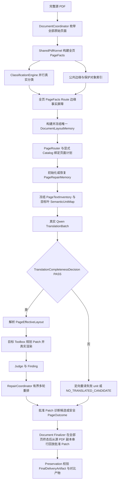

# Transflow Toolbox 逐类别核心逻辑迁移与全流程验收计划 v0.1

| 项 | 内容 |
|---|---|
| 文档状态 | 待执行（逐叶人工确认） |
| 编制时间 | 2026-07-21 08:12:25（Asia/Shanghai） |
| 最近修订 | 2026-07-21 09:01:29（Asia/Shanghai） |
| 修订说明 | 补齐计划产生背景、初始设计符合性、完备测试与全链路追踪定义，并恢复总体设计 T4 的逐叶顺序 |
| 执行位置 | P9B 完成后，按本计划逐叶推进 |
| 上位设计 | `docs/设计/Transflow_PDF翻译排版引擎_总体设计_v0.1.md` |
| 原详细计划 | `docs/计划/Transflow_PDF翻译排版引擎_详细开发计划_v0.1.md` |
| 迁移来源 | `spikes/page_toolbox_engine_puncture_v1/toolboxes` |
| 生产目标 | `src/transflow/toolboxes`、显式 Toolbox Catalog 与 DocumentCoordinator 主链 |

---

## 1. 计划产生背景与目的

### 1.1 初始设计为什么要迁移两套 Spike

总体设计把分类穿刺和工具箱穿刺定义为 Transflow 的两类核心迁移基线：

- 分类穿刺负责通过规则、千问主判、最多一次复核和确定性 Resolver 产出唯一 ClassificationRoute；
- 工具箱穿刺负责每个分类叶私有的 Template、owner、reading order、TranslationUnit、Layout、Renderer/Patch、Judge、Repair、Prompt 和 fallback；
- DocumentCoordinator 负责把“完整 PDF → 页面事实 → 分类 → 显式 Catalog → 对应 PageToolbox → 翻译 → 排版/裁决/修复 → 页面终态 → 源 PDF Patch 回放”编排为唯一主链。

因此，最初设计中的“分类迁移”和“Toolbox 迁移”是两件缺一不可的工作。分类结果相同，只证明页面被送到了正确的 Route；只有该 Route 的分类专用 Toolbox 核心也进入生产执行链，才能得到与穿刺能力可比较的翻译排版结果。

总体设计 §20.6 和 §22/T4 已经明确规定：`toolboxes/<leaf>/tools` 必须逐叶 Lift-and-Wrap，先包住旧入口、完成迁移等价，再按统一 PageToolbox 合同拆分；每个叶独立迁移、独立 Gate，不批量重写。总体设计 §7 和 §24 同时规定，生产验收单位必须是一份未经拆页的完整 PDF，单页 runner 只能做叶能力诊断。

### 1.2 为什么原 P9/P9B 通过后仍然出现迁移缺口

现有阶段完成的是不同层次的工程目标：

1. P7 建立了统一 PageToolbox、Catalog、Legacy Adapter 和三态 Gate 骨架。
2. P8 让 `visual_only`、`body.flow_text.single` 具备启用结论，并对 chart/diagram 做了证据复核；后两者因独立盲测不足保持 disabled。
3. P9 为 cover、contents、end、multi、table、anchored_blocks 建立了结构所有权、硬 guard、通用布局/回退骨架和完整文档收敛证据。P9 报告明确把交付描述为“六阶段迁移骨架”，并明确六叶均为 `PASS_DISABLED_WITH_FALLBACK`、生产不注册 factory、P9 文档中的六叶页面保持源页，不能解释为已经完成生产翻译。
4. P9C 补上 PageTextInventory、SemanticUnitMap、翻译完整性、诊断候选、路由能力错配和三类结论。
5. P9A/P9B 补上只读 DocumentLayoutMemory、当前 run 的 PageRepairMemory、RepairAtomCatalog、确定性多轮重排、Checkpoint 和失败候选双轨。

这些阶段证明了主链能收敛、失败能留证、页面不会丢失，但 P9A/P9B 不负责自动补齐每个叶在 Spike 中已有的分类私有 Template/Layout/Judge/Repair。于是形成了一个必须明确区分的状态：

> “阶段 Gate 通过、disabled fallback 可工作”不等于“Spike 分类专用核心已经迁入生产并产生真实译文效果”。

这一点可由当前事实复核：

- `resources/catalogs/page_toolbox_catalog_v4.json` 中只有 `visual_only` 和 `body.flow_text.single` enabled；P9 六叶、chart/diagram、visual_anchored、composite 和 freeform 均 disabled。
- `src/transflow/toolboxes/leaves/ordinary.py` 是六个普通叶的结构所有权与有界回退骨架，不等同于 Spike 各叶目录中的专用 template builder、layout planner、renderer、Judge 和 Repair 全量迁移。
- `docs/reports/P9阶段_工具箱第二批证据不足普通叶_20260720_155043.md` 明确记录六叶不能解释为已完成生产翻译。
- 同类别、同输入的受控结果 `output/pdf/P9B_toolbox_comparison/comparison_metrics.json` 显示：六个 Spike Toolbox 均产生了可见翻译/排版变化，而当前六个 Transflow translated candidate 与 input 的像素变化率均为 `0.0`，safe output 也与 input hash 相同。

所以，本计划不是因为最初的引擎设计要求发生了变化，而是为了让当前实现重新落到最初已经规定的逐叶核心迁移路径上。

### 1.3 为什么采用“逐个迁移、完备测试、全链路跟踪”

如果继续批量迁移，以下问题会再次混在一起：

- 分类是否正确；
- 译文是否真实且完整；
- 当前页是否真的命中目标 Toolbox；
- 差异来自迁移适配还是来自模型随机性；
- Layout/Judge/Repair 哪一层与 Spike 不一致；
- safe output 是高质量译文还是源页透传；
- 某叶失败是否被其他叶或阶段总 Gate 掩盖。

一次只迁移一个 Route，可以把变量固定为“同一源页、同一类别、同一真实 TranslationBundle、同一字体/配置”，逐层证明核心来源、结构等价、完整 PDF 接线、Repair 收敛和最终 Artifact。完成后立即输出原文/Spike/Transflow 对比并人工复核，能在进入下一叶前关闭问题，避免错误扩散到 composite 和 freeform。

### 1.4 本计划的直接目标

本计划解决当前“分类核心已经迁移，但多个分类叶只有生产骨架、轻量通用实现或 disabled fallback，没有迁入 Spike 分类专用 Toolbox 真正核心逻辑”的问题。

本轮不再按一批类别同时实现、最后统一看结果，而是执行严格的单叶串行闭环：

> 一次只迁移一个 Route；该 Route 的同类别样本完成 Spike/Transflow 受控对比和完整 PDF 全流程后，保存原文、Spike 输出、Transflow 译文候选、修复候选、安全输出及可视化对比；形成一份可追溯报告并暂停，待负责人确认效果后才进入下一个 Route。

本计划是对原 P8～P11 Toolbox 工作的执行展开和前向纠偏，不覆盖原设计、原计划、历史 Gate、历史报告或历史产物。历史结论只代表当时基线，不自动等于本计划下的“核心迁移完成”。

---

## 2. 前提、解释与边界

### 2.1 明确前提

1. ClassificationEngine 的分类控制流作为冻结上游使用；本计划不重写分类树、规则、Prompt 或 Resolver。
2. “真正核心逻辑迁移”是指目标叶运行可达的 Template、事实投影、owner、reading order、TranslationUnit、Layout、Renderer/Patch、Judge、Repair、Prompt 和 fallback 均有来源映射并进入生产执行链，不以目录、空类、通用文本替换或页面透传代替。
3. 迁移采用总体设计规定的 Lift-and-Wrap：先包住原叶入口并证明行为等价，再拆分“构建翻译请求”和“消费译文排版”；不先重写算法。
4. `src/transflow` 生产代码不得从 `spikes/`、`tests/` 或历史 `runs/` 目录导入或动态加载 Toolbox 实现。Spike 只作为迁移来源和对照执行设施；验收 runner 可以显式装配现有 migration-only 千问 Adapter，但必须在证据中声明，不能据此宣称生产 Provider 接线已完成。
5. 每个 Route 严格串行推进；不得同时迁移两个叶，不得用一个叶成功掩盖另一个叶失败。
6. 所有用于效果验收的分类和翻译调用均使用真实千问响应。为保证 A/B 可比，可以将一次真实调用返回的 TranslationBundle 内容寻址后同时交给 Spike 和 Transflow，但不得手工编写、伪造或 mock 返回结果。
7. 完整 PDF 全流程必须使用生产 ClassificationEngine、PageRouter、ToolboxCatalog、DocumentCoordinator、P9A DocumentLayoutMemory、P9B RepairCoordinator 和 Document Finalizer；单页 runner 只能提供叶内诊断，不能代替产品全流程。
8. 每个阶段完成后进入 `REVIEW_PENDING`，必须由负责人查看对比产物并明确接受、要求继续修复，或接受 disabled 后，才能进入下一阶段。

### 2.2 两个不能混淆的结论

每个叶分别报告下列三轴结论：

| 结论轴 | 可选值 | 含义 |
|---|---|---|
| CoreMigration | `COMPLETE / INCOMPLETE` | Spike 运行可达核心资产是否已全部映射并进入 Transflow |
| EngineeringClosure | `PASS / FAIL` | 合同、回退、完整 PDF 收敛和证据是否闭合 |
| ProductAcceptance | `PASS / FAIL / NOT_EVALUATED` | 是否产生真实、完整、可读且效果可接受的翻译排版结果 |
| PromotionEligibility | `PASS_ENABLE / PASS_DISABLED_WITH_FALLBACK / FAIL` | 是否允许 Catalog 默认启用 |

源 PDF 透传可以是 EngineeringClosure 的安全终态，但对含可翻译文本的叶，不能因此获得 `CoreMigration=COMPLETE` 或 `ProductAcceptance=PASS`。TranslatedDiagnosticCandidate 也不能冒充 FinalDeliveryArtifact。

### 2.3 不在本计划内的工作

- 不修改 MerqFin 产品数据库、任务状态机或 API。
- 不提前执行 P12～P14 以及第二部分生产融合阶段。
- 不新增 OCR、图片内文字翻译或像素级重绘能力。
- 不建设模型动态选工具、运行时目录发现、跨叶临时组合或开放式 Agent。
- 不因某叶迁移困难而修改分类结果、热改 Catalog 或调用其他叶私有工具兜底。

### 2.4 与初始引擎设计流程的符合性结论

结论：本计划在恢复 T4 原始迁移顺序后，符合总体设计的引擎主流程、迁移策略和测试 Gate；它没有另造一条 PDF 执行链。

| 初始设计要求 | 设计依据 | 本计划落点 | 符合性 |
|---|---|---|---|
| 产品/验收入口是一份完整 PDF | 总体设计 §7、§24.1、§24.3 | §6.7 要求 DocumentCoordinator 自动枚举完整 PDF；单页只作诊断 | 符合 |
| SharedPdfKernel 先冻结权威页面事实和文字分母 | §7、§9.6.1 | §6.3、§6.7 使用 PageFacts、PageTextInventory、SemanticUnitMap | 符合 |
| 分类后才绑定唯一 Route/Toolbox | §7、§8 | §6.2 同类别门禁，§6.6 显式 Catalog，禁止强制改 Route | 符合 |
| 每个叶保留分类私有 Template/Layout/Judge/Repair | §9.2、§9.4、§20.6 | §6.1、§6.4 要求逐文件来源映射和独立叶目录，拒绝骨架冒充 | 符合 |
| 先 Lift-and-Wrap，再拆翻译调度 | §9、§20.6 | §6.4 先 Legacy/narrow Adapter 等价，再拆 request/bundle | 符合 |
| TranslationPort 由协调器统一调度 | §16、§20.6 | §6.3 统一真实 TranslationBatch，Toolbox 不自行制造 Provider 请求 | 符合 |
| 完整性 PASS 后才允许布局 | §7、§9.6.1、§16.1.1 | §6.3、§6.7 将 TranslationCompletenessDecision 设为硬门禁 | 符合 |
| DocumentLayoutMemory 全页屏障后构建一次并只读 | §7、§9.5.1 | §6.7 复用 P9A，禁止页面/Repair 回写 | 符合 |
| Repair 使用当前 run 页级记忆和确定性原子，有界收敛 | §9.5、§15 | §6.7、G-TM-08 复用 P9B，要求每轮真实候选和唯一终态 | 符合 |
| 诊断候选、安全终态和产品验收不能混淆 | §9.6.2、§12、§18 | §2.2、§6.8 分开保存并分别报告 | 符合 |
| 最终 PDF 从源副本串行回放批准 Patch | §7、§18.2 | §6.7 禁止拼接页级候选，交给 Document Finalizer | 符合 |
| 每叶独立迁移、独立 Gate，证据通过才启用 | §8.3、§20.6、§22/T4 | §4、§6.6、§7 串行执行并保持三态 Catalog 纪律 | 符合 |
| freeform 在已知叶之后做有界恢复 | §11、§22/T5 | TM17 最后处理，测试注入不冒充自然分类 | 符合 |

### 2.5 “完备测试”的具体含义

“完备测试”不是只跑 pytest，也不是承诺数学意义上的穷尽；它表示对当前 Route 完整覆盖总体设计 §24 要求的证据层：

| 测试层 | 主要证明 | 对应设计 |
|---|---|---|
| 来源与架构扫描 | 核心资产全部映射，生产包不依赖 Spike/测试目录 | §20.6、§24.8 |
| 合同/单元测试 | Route、Catalog、owner、SemanticUnitMap、Patch、Repair 合同正确 | §24.1 |
| 迁移等价测试 | 同源页、同类别、同 Bundle 下 Unit/protected/Patch/Finding/verdict/render 可解释等价 | §20.4、§24.2 |
| 真实语义测试 | 真实千问返回、完整性裁决、译文实际写入并可提取 | §9.6.1、§16.1.1、§24.3 |
| 结构扰动与反过拟合 | 页尺寸、位置、文字长度、对象数量变化后仍由结构驱动 | §24.5 |
| 故障与回退 | Provider、字体、布局、Judge、Repair、Artifact 失败均有界终态 | §12、§15、§24.4 |
| 完整 PDF E2E | 完整输入、全页终态、页数/页序、Preservation 和最终化正确 | §7、§18、§24.3 |
| 上游/已迁叶回归 | Classification、Kernel、P9C、P9A、P9B 和已接受叶不退化 | §22/T4、§24.6 |
| 人工效果复核 | 通过并排图检查自动指标难以覆盖的排版可读性 | 迁移治理审核，不进入 PDF runtime |

只有上述适用于当前 Route 的层次全部有真实命令证据，才能写 EngineeringClosure=PASS。独立盲样不足时可以完成代码迁移和工程验证，但不得写 PromotionEligibility=PASS_ENABLE。

### 2.6 “全链路跟踪”的具体含义

同一次正式 run 必须能从最终 PDF 反向追溯到源文档、分类、译文、Toolbox、Repair 和 Patch：

| 追踪层 | 必须记录的稳定身份/哈希 |
|---|---|
| 文档 | `job_id/run_id/source_hash/config_hash/catalog_hash/document_memory_hash` |
| 页面与分类 | `page_no/page_hash/classification_evidence_hash/route/failed_node` |
| Toolbox | `toolbox_key/toolbox_version/implementation_fingerprint/leaf_evidence_hash` |
| 语义与翻译 | `page_text_inventory_hash/semantic_unit_map_hash/translation_batch_hash/translation_bundle_hash/completeness_decision` |
| 排版与修复 | `effective_layout_hash/patch_hash/repair_memory_hash/attempt_no/atom_id/candidate_hash/finding_hash/quality_decision` |
| 页面终态 | `page_outcome/degradation_reason/diagnostic_candidate_hash/approved_patch_hash` |
| 文档交付 | `final_artifact_hash/preservation_result/page_count/page_order/artifact_manifest_hash` |

API Key、Authorization、完整 Provider 原始响应和不必要的原文不得进入追踪 Artifact。

### 2.7 人工停点与“运行时不允许人工介入”

总体设计 §7.5 禁止 PDF 翻译排版运行在中途等待人工选择。本计划完全保留该不变量：

- 单次完整 PDF run 从开始到所有页面终态、最终化和 Artifact 发布必须自动完成；
- 人工不能在某个 Repair round 中选择动作，不能手工改 Route，也不能让 Job 进入“等待人工后继续”；
- 本计划的 `REVIEW_PENDING` 只发生在一次 run 已经结束、报告和 Artifact 已经生成之后，用于决定是否开始下一个类别的开发/发布；
- 因此，人工停点是阶段治理，不是引擎运行状态，也不是页面失败恢复手段。

---

## 3. 当前基线与逐叶处理方式

| 顺序 | Route | Spike 当前事实 | Transflow 当前事实 | 本计划动作 |
|---:|---|---|---|---|
| 1 | `visual_only` | 无独立 Spike 专用核心 | 已启用透传实现 | 先做全流程校准与零修改复核，不伪称 Spike 迁移 |
| 2 | `body.flow_text.single` | `PASS` | 已启用通用 TextPatch 生产实现 | 逐文件重新对账，补足或证明核心等价，作为迁移样板 |
| 3 | `body.chart` | `PASS_NON_BLIND` | 轻量原生标签实现、disabled | 迁移完整 chart 核心并重新盲测 |
| 4 | `body.diagram` | `PASS_NON_BLIND` | 轻量原生标签实现、disabled | 迁移完整 diagram 核心并重新盲测 |
| 5 | `cover` | `EVIDENCE_INSUFFICIENT` | 普通叶骨架、disabled | 迁移封面专用核心 |
| 6 | `contents` | `EVIDENCE_INSUFFICIENT` | 普通叶骨架、disabled | 迁移目录专用核心 |
| 7 | `end` | `EVIDENCE_INSUFFICIENT` | 普通叶骨架、disabled | 迁移结束页专用核心 |
| 8 | `body.flow_text.multi` | `NOT_EVALUATED` | 普通叶骨架、disabled | 迁移多栏专用核心 |
| 9 | `body.table` | `NOT_EVALUATED` | 普通叶骨架、disabled | 迁移表格专用核心 |
| 10 | `body.anchored_blocks` | `EVIDENCE_INSUFFICIENT` | 普通叶骨架、disabled | 迁移锚定块专用核心 |
| 11 | `body.flow_text.visual_anchored` | `FAIL` | pending、disabled | 复现失败后迁移和叶内修复 |
| 12 | `body.composite.flow_text_table` | 有资产但无根级 Gate | pending、disabled | 建立首个根级 Gate并迁移专用组合核心 |
| 13 | `body.composite.chart_table` | `EVIDENCE_INSUFFICIENT` | pending、disabled | 迁移专用组合核心 |
| 14 | `body.composite.flow_text_chart` | `EVIDENCE_INSUFFICIENT` | pending、disabled | 迁移专用组合核心 |
| 15 | `body.composite.flow_text_diagram` | `EVIDENCE_INSUFFICIENT` | pending、disabled | 迁移专用组合核心 |
| 16 | `body.composite.anchored_blocks_chart` | `FAIL` | pending、disabled | 最后复现失败并迁移专用组合核心 |
| 17 | `body.freeform` | 只有分类语义，无可迁移 Toolbox | pending、disabled | 明确作为受控新增，不写成“迁移” |

上表的顺序固定。Composite 必须等待其依赖的原子叶完成；已知 FAIL 叶放在对应依赖稳定后处理。

---

## 4. 总体执行序列

| 阶段 | 唯一工作单元 | 依赖 | 阶段结束动作 |
|---|---|---|---|
| TM0 | 冻结基线并建立单叶通用迁移/验收器 | P9B | 只建立一次公共设施 |
| TM1 | `visual_only` 全流程校准 | TM0 | 输出对比并人工确认 |
| TM2 | `body.flow_text.single` 核心对账/迁移 | TM1 | 输出对比并人工确认 |
| TM3 | `body.chart` | TM2 | 输出对比并人工确认 |
| TM4 | `body.diagram` | TM3 | 输出对比并人工确认 |
| TM5 | `cover` | TM4 | 输出对比并人工确认 |
| TM6 | `contents` | TM5 | 输出对比并人工确认 |
| TM7 | `end` | TM6 | 输出对比并人工确认 |
| TM8 | `body.flow_text.multi` | TM7、TM2 | 输出对比并人工确认 |
| TM9 | `body.table` | TM8 | 输出对比并人工确认 |
| TM10 | `body.anchored_blocks` | TM9 | 输出对比并人工确认 |
| TM11 | `body.flow_text.visual_anchored` | TM2、TM8、TM10 | 输出对比并人工确认 |
| TM12 | `body.composite.flow_text_table` | TM2、TM9 | 输出对比并人工确认 |
| TM13 | `body.composite.chart_table` | TM3、TM9 | 输出对比并人工确认 |
| TM14 | `body.composite.flow_text_chart` | TM2、TM3 | 输出对比并人工确认 |
| TM15 | `body.composite.flow_text_diagram` | TM2、TM4 | 输出对比并人工确认 |
| TM16 | `body.composite.anchored_blocks_chart` | TM3、TM10 | 输出对比并人工确认 |
| TM17 | `body.freeform` 有界新增 | TM2～TM4、TM8～TM11 | 输出自然/注入证据并人工确认 |
| TM18 | 全叶 Catalog、完整 PDF 与历史叶总回归 | TM1～TM17 均已人工处理 | 冻结新 Catalog 基线 |

任何阶段出现 `FAIL`、`REVIEW_PENDING` 或分类不一致时，下一阶段不得启动。若负责人明确接受该叶保持 disabled，记录 `ACCEPT_DISABLED` 后才可继续。

---

## 5. TM0：公共设施，只实现一次

### 5.1 最小公共产物

复用已有 P9B runner、DocumentCoordinator、RepairCoordinator、LeafGateEvaluator 和 PDF 对比能力，只补一个参数化单叶入口，避免为十六个叶复制脚本：

- `scripts/run_toolbox_leaf_migration.py`：按 `--route`、`--manifest` 和 `--run-id` 执行受控 A/B 与完整 PDF 主链。
- `scripts/verify_toolbox_leaf_migration.py`：读取真实运行产物逐项验收，不生成虚假成功数据。
- `resources/manifests/toolbox_leaf_migration/<route_slug>.json`：只记录样本来源、目标 Route、完整文档映射、页码、语言方向和授权集合。
- `resources/evidence/toolbox_leaf_migration/<route_slug>/<run_id>/`：保存结构化 Gate 证据。
- `output/pdf/toolbox_leaf_migration/<stage>/<run_id>/`：保存可人工查看的输入、输出和对比。

公共 runner 只能参数化“选择哪个已注册叶”，不得根据文件名、sample_id、gold 或目标 Route 修改分类结果、构造特殊坐标或选择不同算法。

### 5.2 配置与路径

1. Python 文件的仓库根路径统一由 `Path(__file__).resolve().parent.parent` 获得。
2. 禁止在代码、配置、Manifest、日志和报告中写盘符绝对路径。
3. 千问配置继续由全局配置入口读取以下环境变量：
   - `TRANSFLOW_MIGRATION_QWEN_BASE_URL`
   - `TRANSFLOW_MIGRATION_QWEN_API_KEY`
   - `TRANSFLOW_MIGRATION_QWEN_MODEL`
4. API Key 不落盘、不写报告、不写日志、不写 Git；报告只记录“已配置/未配置”和脱敏 Provider 快照。
5. 新增的类、函数和核心分支必须有完整中文注释；关键入口、路由、翻译、布局、Judge、Repair、接受/回滚均记录中文意图日志。
6. 新增 Python 文件末尾提供 `main()` 使用示例；生产模块不得依赖样本目录。

### 5.3 TM0 验收

- 同一 runner 可在不改代码的情况下选择任意一个显式 Catalog Route。
- runner 不能强制覆盖 ClassificationEngine 结果。
- 真实 Qwen 响应可内容寻址保存并脱敏复用。
- Spike 与 Transflow 可以消费同一 TranslationBundle hash。
- 完整 PDF 可通过 DocumentCoordinator 枚举、逐页终态并由 Finalizer 生成单一 PDF。
- 任一 Gate 失败时脚本非零退出，且报告不得写“通过”。

TM0 只提供设施，不修改任何叶的 enabled 状态。

---

## 6. 每个 Route 必须执行的固定闭环

### 6.1 步骤 A：冻结来源与核心资产清单

对当前叶生成 `source_inventory.json`，至少登记：

- Spike 叶目录、全部运行可达 Python 模块和 SHA-256；
- TemplateBuilder、LayoutPlanner、Renderer/Patch、Judge、Repair、models、contracts、Prompt、策略与字体依赖；
- 原 `toolbox_manifest.json`、`stage_gate.json`、已知失败和样本资产；
- 每个源资产的生产落点、迁移方式：`LIFT`、`WRAP`、`ADAPT_CONTRACT`、`TEST_ONLY` 或 `NOT_USED_WITH_REASON`；
- 允许差异、差异理由和批准状态；
- Transflow 目标实现、版本和实现指纹。

运行可达核心资产映射覆盖率必须为 `100%`。仅写“由通用 TextPatch/ordinary 处理”但未证明原专用逻辑等价，视为未迁移。

### 6.2 步骤 B：建立同类别可比样本

1. 从授权真实样本和原始完整年报中选择目标页，保存源文件 hash、page_no 和页面 hash。
2. Spike 对照侧的类别必须由该 Toolbox 的根级 manifest/stage gate、叶合同和去身份样本映射共同证明；不得重新使用含 sample_id、文件名或 gold 的旧模型载荷作为分类真值。
3. 对同一页执行生产 ClassificationEngine 的匿名真实分类，保存 Route、failed_node、结构证据和模型决策 hash。
4. 只有“Spike Toolbox 叶合同 Route = 生产 ClassificationRoute = 本阶段目标 Route”时，才进入 Toolbox 对比集合。
5. 任一分类不一致时记录 `CLASSIFICATION_ROUTE_MISMATCH`，该页不允许通过注入 Route 进入产品效果统计。
6. 测试 wiring 可以为 owner/guard 故障用例显式注入 Route，但必须单独标记 `TEST_ONLY`，不能作为真实分类或 ProductAcceptance 证据。
7. 模型输入不得包含文件名、sample_id、gold、目录名或可推导身份。

用于人工看效果的最低输入是一份未经拆页的完整真实 PDF，且其中至少一页真实命中目标 Route。该最低输入只证明本次效果，不自动满足 Promotion Gate。Promotion 继续遵守原计划已冻结阈值；若某叶没有冻结的独立盲测门槛，默认至少需要来自六份不同完整文档的匿名真实目标页。数量不足时保持 disabled，并明确 `ProductAcceptance=NOT_EVALUATED` 或 `PromotionEligibility=PASS_DISABLED_WITH_FALLBACK`。

### 6.3 步骤 C：产生唯一真实译文基线

1. 从 SharedPdfKernel 的 PageTextInventory 和目标叶投影生成 SemanticUnitMap。
2. 双向覆盖核对通过后，对该页先发起一个真实逻辑 TranslationBatch；只有完整性失败的 unit 可以在冻结预算内组成定向重试 Batch，禁止退化为逐容器请求风暴。
3. 将真实千问响应校验为 TranslationBundle，记录请求/响应/模型/Prompt/Schema/hash，但脱敏授权头。
4. 同一个 TranslationBundle 分别输入 Spike 和 Transflow，禁止两边各调一次模型后比较随机结果。
5. 缺失、重复、新增 ID、空串、占位符、异常回显、无授权原文照抄、required literal 丢失或残留源语言不达标时，译文基线失败，禁止进入布局效果结论。

### 6.4 步骤 D：按 Lift-and-Wrap 迁移当前叶

1. 在 `src/transflow/toolboxes/leaves/<route_slug>/` 建立当前叶私有实现，保持源叶阶段划分和调用顺序。
2. 第一小步由 LegacyToolboxAdapter/窄 Adapter 注入已校验 TranslationBundle，先证明原核心可在统一 PageExecutionContext 下运行。
3. 等价通过后，再将原叶内部 `provider.translate()` 拆为“构建 TranslationUnit”和“消费 TranslationBundle 后布局”。
4. 只复用 SharedPdfKernel、字体、Patch、约束、P9A/P9B Memory 等已经冻结的公共能力；不为了减少文件数量合并不同叶的专用 owner、布局或 Judge。
5. 不修改其他叶代码；若当前改动使本阶段新增导入或变量失效，只清理本阶段产生的孤儿。
6. 不从 Spike 路径运行生产代码，不复制历史 run/output 作为运行时依赖。

### 6.5 步骤 E：受控 Spike/Transflow 等价对比

同一源页、同一目标 Route、同一 TranslationBundle、同一字体和同一配置下，比较：

- TranslationUnit ID、顺序、原文、owner 和 source mapping；
- protected object、clip、anchor、row/column/cell/region 所有权；
- LayoutPlan 和 Patch 的修改集合；
- Finding、Judge verdict、Repair 触发条件、RepairAtom 和终态；
- 译文是否真实物化到候选 PDF；
- 允许修改区域内的版面差异；
- 允许修改区域外的文本、图片、drawing、链接、批注和几何差异。

PDF 字节不要求一致；任何结构差异都必须由批准的 `allowed_difference` 解释。无法解释的差异视为失败。

### 6.6 步骤 F：接入当前叶 Catalog

1. 先使用 run 私有 Catalog overlay 试运行，不直接修改默认 Catalog。
2. overlay 只允许当前目标叶发生变化，其他 Route 的 key/version/fingerprint/enabled 必须与阶段开始时一致。
3. 受控等价和叶内硬 Gate 通过后，才允许生成签名 LeafGate evidence。
4. 只有 `PASS_ENABLE` 才修改默认 Catalog 为 enabled；证据不足时保留实现但默认 disabled。
5. disabled、初始化失败、执行失败和 evidence/hash 失配都必须确定性进入本叶 fallback，不得切换到其他叶。

### 6.7 步骤 G：完整 PDF 生产主链

每个叶必须用同一份完整源 PDF 执行下面的真实链路：



全流程硬要求：

- 完整文档中目标页必须由真实 ClassificationEngine 命中目标 Route。
- runtime trace 必须命中目标 Toolbox 及其版本，不允许只命中 ordinary skeleton 或 fallback 后宣称已迁移。
- DocumentLayoutMemory 只能在全页 PageFacts、全页 Route 和公共边缘事实屏障之后构建一次；冻结前 TranslationPort 调用数为 `0`。
- P9A 文档记忆只读；P9B 页级记忆、RepairAtomCatalog 和静态 Registry 不跨页/跨文档学习。
- 每个 Repair round 必须真实渲染、真实 Judge，并形成接受、回滚、失败或预算耗尽的唯一终态。
- 所有页面都形成 PageOutcome；页数、页序和最终 PDF 可打开性保持。
- Document Finalizer 只能从完整源 PDF 副本串行回放批准 Patch；页级候选 PDF 参与最终拼接数为 `0`。
- 本次 run 必须写出 §2.6 所列文档、页面、分类、Toolbox、语义、翻译、Repair、Patch 和最终 Artifact 之间的双向追踪索引。
- 对含可翻译文本的目标页，至少一个真实验收样本必须形成非占位、非源文复制、实际写入 PDF 的译文并通过质量裁决；否则该阶段不能标记 ProductAcceptance=PASS。

### 6.8 步骤 H：保存输入、输出和可视化对比

每次正式运行使用以下固定目录，不覆盖历史 run：

```text
output/pdf/toolbox_leaf_migration/<stage>/<run_id>/
├─ input/
│  ├─ source_document.pdf
│  ├─ target_page.pdf
│  └─ source_manifest.json
├─ spike/
│  ├─ output.pdf
│  ├─ page.png
│  └─ trace.json
├─ transflow/
│  ├─ translated_candidate.pdf
│  ├─ repaired_candidate_round_00.pdf
│  ├─ repaired_candidate_round_N.pdf
│  ├─ translated_diagnostic_candidate.pdf
│  ├─ final_delivery.pdf
│  ├─ page.png
│  └─ trace.json
├─ comparison/
│  ├─ source_spike_transflow.png
│  ├─ source_vs_transflow.pdf
│  ├─ changed_regions.png
│  └─ metrics.json
├─ route_attestation.json
├─ translation_bundle.json
├─ migration_inventory.json
└─ run_manifest.json
```

若没有某类候选，Manifest 必须记录明确原因，不创建同名源 PDF 冒充译文候选。FinalDeliveryArtifact 如果因失败而是源页透传，必须同时写 `ProductAcceptance=FAIL`，并保留真实失败候选供查看。

### 6.9 步骤 I：报告与人工硬停

每个类别只生成一份报告：

```text
docs/reports/TMxx阶段_<route_slug>核心逻辑迁移与全流程验收_YYYYMMDD_HHMMSS.md
```

报告必须包含：

1. 阶段、Route、开始/结束时间到秒；
2. 当前假设与范围；
3. Spike→Transflow 逐文件来源/hash/落点/差异表；
4. 同类别 Route 证明；
5. 所有实际执行命令及其原始输出代码块；
6. 真实模型调用、TranslationBundle 和脱敏配置证据；
7. Spike/Transflow 结构化等价 diff；
8. 完整 PDF 全链路 trace 和目标 Toolbox 命中证据；
9. 输入、各候选、安全输出和并排对比路径；
10. 每项验收标准逐条“通过/失败 + 命令证据”；
11. CoreMigration、EngineeringClosure、ProductAcceptance、PromotionEligibility 四项结论；
12. 已知问题、fallback 与是否允许启用；
13. `REVIEW_PENDING` 人工查看结论。

报告中的结论不能来自手写断言；必须可追溯到本次命令、测试或脚本产物。

---

## 7. 所有叶共用的硬 Gate

| Gate | 验收标准 |
|---|---|
| G-TM-01 同类别 | 纳入效果对比的页中，Spike Toolbox 叶合同 Route、生产 ClassificationRoute 与目标 Route 一致率 `100%`；强制 Route 计入产品证据数 `0` |
| G-TM-02 来源完整 | Spike 运行可达核心资产映射覆盖率 `100%`；`src/transflow` 对 `spikes/`、`tests/`、历史 run 的导入/动态加载数 `0`；migration-only Provider Adapter 单独声明 |
| G-TM-03 同译文 | Spike/Transflow 使用的 TranslationBundle hash 一致率 `100%`；手工/mock 返回数 `0` |
| G-TM-04 语义完整 | PageTextInventory 与 SemanticUnitMap 双向覆盖率 `100%`；缺失/重复/悬空/非法原文回填接受数 `0` |
| G-TM-05 核心等价 | Unit、owner、protected、Patch、Finding、verdict、Repair 结构等价，或每项差异都有批准记录；无解释差异数 `0` |
| G-TM-06 真实物化 | 含可翻译文本的叶至少一个正式样本产生真实目标语言 PDF；源 PDF/占位结果冒充译文数 `0` |
| G-TM-07 版面与保护 | overflow、collision、越 owner/clip、锁定对象修改和允许区域外无解释变化均为 `0` |
| G-TM-08 Repair 收敛 | Repair 不越预算；重复动作/状态循环 `0`；每轮有真实 candidate、Judge 和唯一终态 |
| G-TM-09 完整主链 | 完整 PDF 全页终态率、页数/页序保持率和可打开率均 `100%`；目标叶 runtime 命中可追溯 |
| G-TM-10 输出可看 | input、Spike output、Transflow candidate、repair、final 和三联对比完整；缺件都有机器可读原因 |
| G-TM-11 回归隔离 | 之前已人工接受的 Route、P9A/P9B、Classification、PdfKernel 无解释差异 `0` |
| G-TM-12 启用纪律 | 只有签名 `PASS_ENABLE` 可改默认 Catalog；无证据启用、动态换链和跨叶调用数 `0` |
| G-TM-13 报告证据 | 每项结论都有实际命令输出；手工伪造证据数 `0` |
| G-TM-14 人工确认 | 当前阶段为 `ACCEPTED` 或负责人明确 `ACCEPT_DISABLED` 前，下一阶段启动数 `0` |

`visual_only` 是 G-TM-06 的唯一例外：它必须证明 TranslationPort 调用、TranslationUnit、Patch 和语义对象修改均为 `0`，输出与源页保持。

---

## 8. 各阶段专用迁移要求

以下每个阶段均叠加第 6、7 章的全部步骤与 Gate。

### TM1 · `visual_only` 全流程校准

- 不复制不存在的 Spike 核心，只审计当前透传实现。
- 使用纯图片、纯矢量、扫描页和混合无可编辑文本真实页。
- 分类命中、Catalog 命中和全流程 Finalizer 必须真实发生。
- TranslationPort、OCR、TranslationUnit、Patch、Repair 调用均为 `0`。
- 图片、drawing、文本对象和页面语义保持；输出三联图用于校准后续比较器。

### TM2 · `body.flow_text.single`

- 以 Spike `PASS` 叶为迁移样板，逐文件核对 container、reading order、unit、layout、renderer、Judge、Repair 和 Prompt。
- 当前通用 TextPatch 实现只有在逐项等价证据成立后才能保留；缺失的专用逻辑必须迁入独立叶目录。
- 覆盖短译文、长译文、换行、页眉页脚、图片/矢量保护和字体缺失。
- 重跑 P4、P8、P9A、P9B 的 single 相关回归。

### TM3 · `body.chart`

- 迁移 chart 标题、图例、轴标签和数据标签的原生文本 owner、布局、Judge 和 Repair。
- plot、image、drawing 和图片内文字 protected，不 OCR、不像素修改。
- 原 `PASS_NON_BLIND` 只作线索，必须重新使用匿名未知真实页决定 Promotion。
- 当前轻量 TextPatch 包装不能代替 Spike chart 专用核心。

### TM4 · `body.diagram`

- 迁移 node/connector/label 关系、label owner、布局、Judge 和 Repair。
- node shape、connector、arrow、图片全部 protected。
- 原 `PASS_NON_BLIND` 不自动晋级。
- 对比必须覆盖节点位置变化、连接数量变化和长标签。

### TM5 · `cover`

- 迁移 title/subtitle/date 等容器层级、视觉 anchor、字体层级、布局、Judge 和 Repair。
- Logo、背景图、装饰线、图片和纯视觉对象只读。
- 禁止退化为 single 正文流。
- 效果对比必须清楚展示标题层级、居中/对齐和长译文处理。

### TM6 · `contents`

- 迁移目录行、跨行条目、层级、缩进、点线、页码、链接映射、布局、Judge 和 Repair。
- 页码、点线和链接不翻译但必须保持关联和目标。
- 最小回退单位为完整目录条目，半条翻译数必须为 `0`。
- 完整 PDF 验收必须验证链接/目标和页序。

### TM7 · `end`

- 分别迁移 blank、visual、text、mixed 模板和终态。
- 联系方式、版权、声明可翻译；Logo、二维码、背景和装饰 protected。
- 不允许用“最后一页索引”或文件名决定行为。
- 纯视觉 end 应透传；含文本 end 必须产生真实译文效果。

### TM8 · `body.flow_text.multi`

- 迁移 column bands、gutter、跨栏标题/对象、列内/列间 reading order、布局、Judge 和 Repair。
- Patch 必须绑定列 owner，不得跨 gutter 或借用相邻栏。
- 覆盖双栏、三栏、不等宽栏、跨栏标题和一栏失败。
- 允许原子/栏/页逐级回退，但安全栏不得被无关失败撤销。

### TM9 · `body.table`

- 迁移有框/无边框/合并单元格结构探针、row/column/cell 稳定 ID、owner、布局、Judge 和 Repair。
- 表格线、背景、图片表格 protected，V1 不做 OCR。
- 任一 cell owner 或结构不闭合时整表回退，半表权威输出数必须为 `0`。
- 对比图必须能检查行列对齐、长译文和合并单元格。

### TM10 · `body.anchored_blocks`

- 迁移 block、anchor、slot、clip、owner、reading order、布局、Judge 和 Repair。
- anchor 只读；每个 block 只能修改自己的 owned text。
- 禁止改送 single/multi，禁止借相邻 block 空间。
- 一个 block 失败时验证 owner 级原子回退及其他 block 保留。

### TM11 · `body.flow_text.visual_anchored`

- 先逐项重现 Spike `FAIL`，形成失败账本，不修改 single/multi/PdfKernel 迎合样本。
- 迁移 visual anchor、flow bands、owner、reading order、布局、Judge 和 Repair。
- 正文 Patch 不得覆盖或移动视觉对象。
- 失败未关闭时可以保留 disabled，但必须输出真实诊断候选和安全终态，不能伪装 PASS。

### TM12 · `body.composite.flow_text_table`

- 先登记 `NO_ROOT_GATE`，不能引用 single/table 子叶结论代替组合叶证据。
- 迁移正文域与表格域的唯一 owner、阅读/执行顺序、Patch merge、组合 Judge/Repair。
- 正文失败与表格失败分别验证；表格仍坚持整表原子回退。
- 禁止运行时临时拼接 single + table Toolbox。

### TM13 · `body.composite.chart_table`

- 迁移 chart 标签域与 table cell 域的独立 owner、执行顺序、组合 Judge/Repair 和回退。
- plot/image/drawing、表格线和背景 protected。
- 覆盖 chart-only fail、table-only fail 和双 fail。
- 禁止切换为 chart-only/table-only 执行链。

### TM14 · `body.composite.flow_text_chart`

- 迁移正文 flow、chart region、原生标签、全页 reading order 和组合 Judge/Repair。
- 图片图表内部文字不 OCR；正文和 chart 标签不得跨 owner 写入。
- 分别验证正文失败、chart 失败和双侧失败的确定性终态。

### TM15 · `body.composite.flow_text_diagram`

- 迁移正文、diagram label、node/connector anchor、reading order 和组合 Judge/Repair。
- node、connector、arrow 和 image protected。
- 正文失败不得破坏 diagram；diagram 失败不得撤销无关安全正文。
- 禁止反向修改 single/diagram 子叶以通过组合样本。

### TM16 · `body.composite.anchored_blocks_chart`

- 作为最后一个已知 FAIL 组合叶，先重现并冻结全部失败。
- 迁移 block、chart label、共享只读 anchor、owner 冲突规则、组合 Judge/Repair。
- 可写文本不得双 owner；chart plot/image 不 OCR。
- 所有原 FAIL 必须逐项得到“已修复并通过”或“仍失败并 disabled”结论。

### TM17 · `body.freeform` 有界新增

该 Route 在 Spike 没有可直接迁移的生产 Toolbox，因此本阶段不得写“核心迁移完成”，而应写“受控新增完成/未完成”。

- 只在生产 ClassificationEngine 自然输出 `body.freeform` 时进入生产路径。
- 测试注入 Route 只能验收收敛、owner、clip 和回退，不能作为自然分类或产品质量证据。
- 采用一次确定性区域分解和固定 allow-list Adapter；只包装已通过对应叶 Gate 的能力。
- 不递归分类、不模型规划、不动态建工具。
- 没有自然真实 freeform 样本时，ProductAcceptance 必须为 `NOT_EVALUATED`，质量覆盖率不声明。

### TM18 · Catalog 和全路线收口

1. 汇总 TM1～TM17 每个 Route 的 source/version/fingerprint/evidence/四轴结论。
2. 每条 Route 必须只有一个 enabled Toolbox 或一个明确 disabled fallback。
3. 运行包含所有可构造 Route 的完整真实 PDF 组合，覆盖最后一页失败、多个 disabled、初始化失败和版本失配。
4. 重跑 Classification、PdfKernel、P9C、P9A、P9B 以及全部已人工接受叶的回归。
5. 冻结 Catalog hash、实现指纹和 Checkpoint 兼容边界。

TM18 不得重新解释或掩盖单叶失败；任何叶只能保持其人工确认后的状态。

---

## 9. 每阶段计划命令

以下为 TM0 应实现的统一命令形态；正式报告必须记录实际参数和原始输出：

```powershell
python scripts/run_toolbox_leaf_migration.py --stage TM02 --route body.flow_text.single --manifest resources/manifests/toolbox_leaf_migration/body_flow_text_single.json
python scripts/verify_toolbox_leaf_migration.py --stage TM02 --route body.flow_text.single --run-id <run_id>
pytest tests/toolboxes/body_flow_text_single tests/integration/test_body_flow_text_single_e2e.py -q
```

要求：

- 不为某个样本在命令或代码中加入隐藏坐标、gold 或强制 Route。
- 测试输入可以构造故障，但返回结果必须来自真实代码执行；效果验收的模型返回必须是真实响应。
- 命令失败时保留 stdout、stderr、exit code 和已生成 Artifact，不手工补写“预期输出”。
- 正式全流程命令必须读取完整 PDF，不能只以单页 PDF 结果宣称主链完成。

---

## 10. 阶段状态机与停止条件

```text
NOT_STARTED
  -> SOURCE_FROZEN
  -> SAME_ROUTE_CONFIRMED
  -> CORE_MIGRATED
  -> PARITY_PASS
  -> FULL_E2E_PASS
  -> REVIEW_PENDING
  -> ACCEPTED 或 ACCEPT_DISABLED
```

出现以下任一条件立即停止当前叶，不进入下一叶：

- Spike/Transflow 分类结果不是同一目标 Route；
- 核心来源清单不完整或生产仍依赖 Spike 运行目录；
- 使用手写/mock 翻译结果作为效果结论；
- 含可翻译文本但没有真实译文物化到 PDF；
- 只得到源 PDF 透传，却写成翻译排版成功；
- 目标 Toolbox 没有被生产 runtime trace 命中；
- Patch 越 owner/clip、修改 protected 对象或破坏完整文档；
- Repair 循环、越预算或没有真实重渲染/重裁决；
- 缺少 input/output/compare Artifact；
- 报告结论无法追溯到实际命令；
- 负责人尚未完成当前叶效果确认。

失败时默认保持该叶 Catalog disabled 和确定性 fallback；不得为了继续排期而临时启用，也不得删除失败证据。

---

## 11. 本计划的完成定义

只有同时满足以下条件，才认为“逐类别迁移计划完成”：

1. TM1～TM17 每个分类 Route 都有独立报告和人工处理结论；
2. 所有 Spike 有核心代码的叶均有 `100%` 运行可达来源映射；
3. 每个可翻译且被接受的叶都至少有一份完整真实 PDF 的真实译文全流程效果；
4. 每个叶均保存 source、Spike、Transflow candidate、repair、final 和并排对比；
5. disabled 叶的实现、失败原因和 fallback 均可审计，不被包装成成功；
6. Classification 与目标 Route 一致，运行时没有强制分类或跨叶偷用工具；
7. Catalog、实现指纹、P9A/P9B 记忆和全部已接受叶回归闭合；
8. TM18 输出冻结 Catalog、全路线矩阵和完整 PDF 最终报告。

在此之前，不再使用“所有 Toolbox 已迁移”或“P9 分类对应核心已全部接入”的表述。
