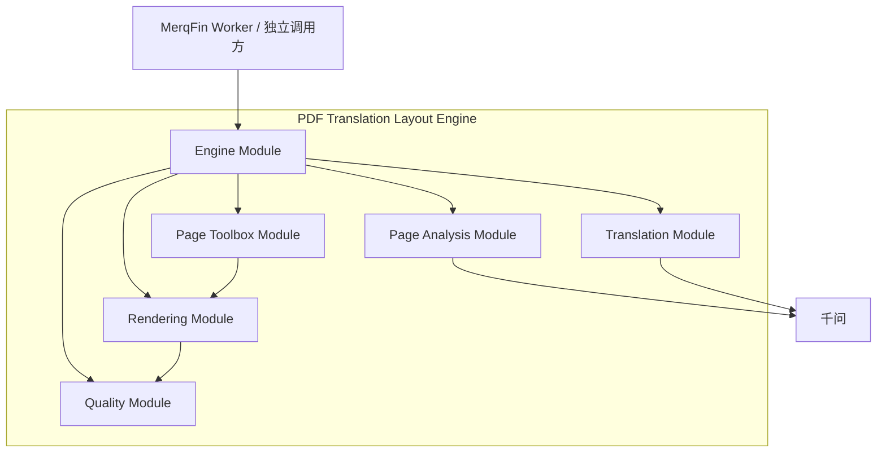
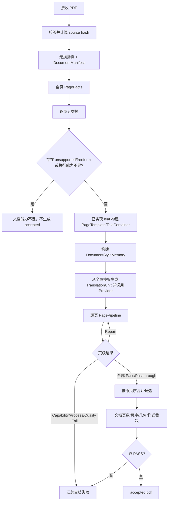
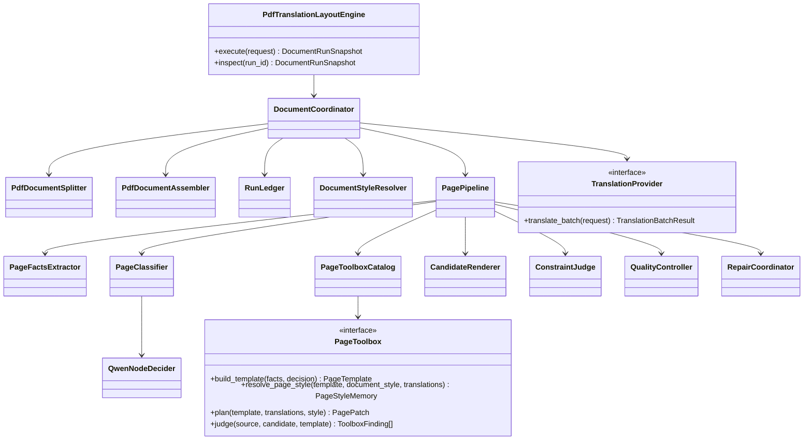

# PDF 翻译排版引擎：文档级编排与页级工具箱优化设计 v2

> 文档状态：新引擎实现基线提案，待评审确认后进入 D0
> 修订日期：2026-07-12
> 拟建目录：`pdf_translation_layout_engine/`
> 上位背景：`docs/背景/PDF_翻译排版引擎_演进背景_既有资产与踩坑记录.md`
> 被优化基线：`docs/设计/PDF_翻译排版独立引擎_总体设计.md`
> 分类依据：`spikes/page_classification_engine_puncture_v1/`
> 输入说明：本文的“多页文档”指 PDF；`.ppt/.pptx` 不在本引擎范围内

## 1. 结论先行

新引擎采用两层结构：

1. **文档级 Engine** 接收一份一页或多页 PDF，负责无损拆页、稳定 page_id、页面调度、文档样式记忆、结果汇总、按原顺序合并和整文档裁决。
2. **页级 Pipeline** 每次只处理一页：提取事实、逐节点分类、翻译原生文字、进入唯一 PageToolbox 回填排版、生成候选、裁决和可选局部 Repair。

核心设计目标不是让一个通用工具适配所有页面，而是让维护者能够回答：

```text
这页被分到哪里？
哪个 PageToolbox 在负责？
用了什么工具？
工具修改了哪些 TextContainer？
哪条 Finding 没通过？
该改哪个 leaf，影响哪些回归？
```

最终执行主线：

```text
多页 PDF
→ 无损拆页并建立 DocumentManifest
→ 全页 PageFacts + 可编辑文字能力观测
→ 每页逐节点分类并绑定唯一 leaf
→ 已实现 leaf 构建 PageTemplate/TextContainer
→ 建立当前文档 DocumentStyleMemory
→ 生成并校验文档级 TranslationUnit
→ 按页调用唯一 PageToolbox
→ 单页候选 + 硬约束 + leaf Judge
→ 必要时 leaf-local Repair 并完整重裁
→ 所有页达到可合并条件
→ 按原页序合并文档候选
→ 文档页数/页序/页几何/页结果裁决
→ Process PASS + Product PASS 才产生 accepted.pdf
```

## 2. 设计重置

### 2.1 保留什么

- 原 PDF 页是不可变底板；
- 只操作可安全绑定的 PDF 原生文字对象；
- 图片、背景、Logo、装饰、颜色、表格网格、图表主体和图片内部内容不可动；
- TranslationProvider 是中立 Seam；
- candidate 与 accepted 严格分离；
- process/product verdict 严格分离；
- 状态、artifact、Finding、Repair 和恢复必须可审计；
- 页面分类逐节点进行，千问每次只判断一个维度；
- 每个 leaf 拥有唯一 PageToolbox；
- 同类型正文的文档级样式保持一致。

### 2.2 改变什么

| 旧设计 | v2 |
|---|---|
| Engine 拒绝多页 PDF | Engine 接收整份 PDF，内部无损拆页和合并 |
| 只有单页 PageStyleMemory | 增加 DocumentStyleMemory，PageStyleMemory 引用文档基线 |
| `cover/contents/body` | 增加 `end/visual_only` |
| `text/table/chart/freeform` | 改为 `flow_text/table/chart/diagram/anchored_blocks/composite` |
| `single/multi` | 增加 `visual_anchored` |
| mixed 页强行交给主体工具 | 明确有限 composite leaf |
| `freeform` 是普通工具箱 | `freeform` 是正文分类缺口兜底，默认能力不足 |
| 每个分类节点必须规则+千问 | 已校准直接证据可直接裁决；其余才双路判断 |
| 全局 Repair/工具映射 | Repair、参数口和接受条件归当前 PageToolbox |
| 追求通用工具防过拟合 | 禁止样本身份特例，但允许 PageType 专用工具和代码复制 |

### 2.3 明确不建设

- 不建设 HTTP 服务、数据库、消息队列或独立 Worker；
- 不建设动态插件系统和全局 ToolRegistry；
- 不让 LLM 开放式选择工具、修改状态或发布 accepted；
- 不翻译图片内部文字；
- 不支持 OCR、扫描页擦字和背景修复；
- 不支持 `.ppt/.pptx`；需要时由独立 Adapter 先转为 PDF；
- 不按年报、中报、季报或公司行业路由；
- 不在架构文档猜测每个工具的最佳参数；工具参数由 leaf 穿刺产生；
- 不要求 V1 一次支持全部 leaf；未实现 leaf 必须诚实返回能力不足。

## 3. 设计原则

### 3.1 Locality 优先

修改 `body.table` 的 tools、Judge、Repair 或 Prompt，不应改变 `body.flow_text.single` 的行为。相似代码允许复制；只有没有 PageType 语义的机械原语才共享。

### 3.2 深 Module、窄 Interface

对外只保留两个真实 Seam：

- `TranslationProvider`：当前千问和未来 MerqFin 翻译 Adapter 确实会变化；
- `PageToolbox`：不同 leaf 确实有多个实现。

拆页、合并、状态、账本和 PDF 机械操作首版只有一个实现，不提前制造空 Interface。

### 3.3 直接事实优先于模型

工具可以证明的客观 proposition 不交给模型投票。例如：

- PDF 页数、MediaBox、对象哈希；
- tagged/vector/cell geometry 证明“存在表格”；
- 译文 unit 是否缺失、重复；
- bbox 是否越界、对象是否被修改；
- 页面是否可渲染。

模型只处理结构所有权、边界语义和机械证据不能唯一决定的当前节点。

### 3.4 分类服务于工具箱

只有当两类页面需要不同工具、Judge 或 Repair 时，才拆分类 leaf。语言、精确栏数、密度和图表种类首版作为观测，不形成笛卡尔积。

### 3.5 失败必须诚实

```text
没有分类能力 → CAPABILITY_BLOCKED
没有可编辑原生文字 → PASSTHROUGH 或 CAPABILITY_BLOCKED（按页面能力范围）
没有工具 → CAPABILITY_BLOCKED
违反硬合同 → PROCESS_INVALID
有候选但质量不合格 → PRODUCT_FAIL
```

不得用 placeholder、白底覆盖、默认正文、万能 freeform 或 candidate 文件冒充成功。

## 4. 系统组成

内部保持六个能力 Module，不再增加平台级层次：

| Module | 负责 | 不负责 |
|---|---|---|
| Engine Module | 文档编排、拆页/合并调度、状态、账本、恢复、结果汇总 | 页面分类规则、leaf 工具参数 |
| Page Analysis Module | PageFacts、执行能力观测、分类证据、分类树和 trace | 修改 PDF、选择 leaf 内工具 |
| Translation Module | TranslationProvider、批量合同和结果校验 | 页面坐标、排版和裁决 |
| Page Toolbox Module | PageTemplate、Document/PageStyleMemory 应用、leaf tools/Judge/Repair | 其他 leaf、文档终态 |
| Rendering Module | 按 PagePatch 机械生成单页候选、无损拆页与合并机械函数 | 自行决定样式或页面类型 |
| Quality Module | 公共硬约束、leaf Finding 归约、Repair 接受/回滚、文档合并门禁 | 开放式选工具、改译文语义 |



## 5. 文档级与页级责任

### 5.1 文档级 Engine

文档级 Engine 只做跨页必需的事情：

- 接收 PDF 并计算源文档 hash；
- 无损拆分为单页 PDF；
- 固化页数、页序、页尺寸和 page_id；
- 调度全页分析和分类；
- 建立临时 DocumentStyleMemory；
- 聚合 TranslationUnit；
- 顺序执行页级 Pipeline；
- 记录每页终态和最佳候选；
- 所有页面满足条件后按原序合并；
- 执行文档级页数、页序、页几何和 accepted 聚合门禁；
- 产生唯一 DocumentRunSnapshot。

文档级 Engine 不看 leaf 私有工具名，不修改 PagePatch，不为某一页临时改变分类。

### 5.2 页级 Pipeline

页级 Pipeline 每次处理一个 `PageWorkItem`，但为满足整文档样式和批量翻译，Interface 分成两个确定性阶段：

```python
class PagePipeline:
    def prepare(self, page: PageRef) -> "PreparedPage": ...

    def execute(
        self,
        prepared: "PreparedPage",
        translations: TranslationMap,
        document_style: DocumentStyleMemory,
    ) -> "PageExecutionResult": ...
```

`prepare()` 完成：

```text
PageFacts → PageDecision → PageTemplate/TextContainer
```

`execute()` 完成：

```text
PreparedPage + TranslationMap
→ PageStyleMemory
→ PagePatch
→ CandidatePage
→ ConstraintFinding + ToolboxFinding
→ PageQualityDecision
→ PageExecutionResult
```

文档级 Engine 必须先收齐所有 `PreparedPage`，才能建立 DocumentStyleMemory 和文档级 TranslationUnit。页级 Pipeline 不知道其他页的工具和内容，只读取只读的 DocumentStyleMemory。

```python
@dataclass(frozen=True)
class PreparedPage:
    page_ref: PageRef
    facts: PageFacts
    decision: PageDecision
    template: PageTemplate | None
    execution_mode: Literal["TOOLBOX", "PASSTHROUGH", "UNSUPPORTED"]
```

- `TOOLBOX` 必须有 PageTemplate 和 leaf_key；
- `PASSTHROUGH` 用于 `visual_only`、`IMAGE_ONLY` 或 `NONE`，不生成 TranslationUnit/PagePatch；
- `UNSUPPORTED` 用于 freeform、未实现 leaf、parallel bilingual 正文或模板无法安全构建，阻止 accepted document。

### 5.3 为什么不把所有逻辑放进 Document Engine

删除页级 Pipeline 后，分类、模板、工具、Judge 和 Repair 会重新散入文档循环，旧架构问题会重现。页级 Pipeline 隐藏了大部分页面行为，提供 Depth；文档级 Engine 只学习一个稳定执行结果，获得 Leverage。

## 6. 对外 Interface

```python
@dataclass(frozen=True)
class TranslateDocumentRequest:
    source_pdf: Path
    source_language: str
    target_language: str
    run_id: str | None = None


class PdfTranslationLayoutEngine:
    def __init__(
        self,
        artifact_root: Path,
        translation_provider: "TranslationProvider",
    ) -> None: ...

    def execute(self, request: TranslateDocumentRequest) -> "DocumentRunSnapshot": ...
    def inspect(self, run_id: str) -> "DocumentRunSnapshot": ...
```

V1 约束：

- 输入必须是可打开的 PDF，允许一页或多页；
- `source_language` 和 `target_language` 必须明确；
- 正文中英近似 1:1 的 parallel bilingual 页面不在当前执行范围，分类可以继续，执行返回能力不足；封面/标题页是否支持由对应 Toolbox 单独证明；
- source PDF 在运行前后 hash 必须不变；
- `execute()` 同步运行；异步调度由 MerqFin worker 负责；
- 同一 `run_id + execution_fingerprint` 可恢复；fingerprint 不同则冲突；
- 调用方只读取 DocumentRunSnapshot，不读取内部工具或 Prompt。

```python
@dataclass(frozen=True)
class DocumentRunSnapshot:
    run_id: str
    lifecycle: Literal["RUNNING", "INTERRUPTED", "TERMINAL"]
    state_code: "DocumentStateCode"
    process_contract_verdict: Literal["PENDING", "PASS", "FAIL"]
    product_quality_verdict: Literal["PENDING", "PASS", "FAIL", "NOT_REACHED"]
    page_count: int
    page_results: tuple["PageResultSummary", ...]
    accepted_pdf: ArtifactRef | None
    best_candidate_pdf: ArtifactRef | None
    reason_codes: tuple[str, ...]
```

只有双 PASS 时 `accepted_pdf` 存在。

## 7. 文档拆页、页 ID 与合并合同

### 7.1 DocumentManifest

```python
@dataclass(frozen=True)
class DocumentManifest:
    document_id: str
    source_pdf_sha256: str
    page_count: int
    pages: tuple[PageRef, ...]


@dataclass(frozen=True)
class PageRef:
    page_id: str
    page_index: int
    source_page_pdf_ref: ArtifactRef
    source_page_sha256: str
    media_box: Box
    crop_box: Box
    rotation: int
```

`page_id` 确定性生成：

```text
page_id = <document_id>.p<page_index+1:04d>
```

不得使用源文件名、分类标签或公司名作为 page_id。

### 7.2 拆页不变量

1. 拆分页数等于源 PDF 页数；
2. 每个单页 PDF 恰好一页；
3. 页序、MediaBox、CropBox、rotation 不变；
4. 源页内容对象不修改；
5. source PDF hash 不变；
6. manifest 中 page_index 唯一且连续。

### 7.3 合并门禁

只允许以下页面进入文档合并：

- Product PASS 的已验收单页；
- `visual_only`、`image_only` 或 `none` 的原样透传页，且 source/candidate hash 对应规则通过；
- 由已实现 Toolbox 明确允许的 passthrough 页。

任一页处于 capability/process/quality failure 时，可以保留诊断用文档候选，但不得产生 accepted.pdf。

合并后必须验证：

- 页数与 manifest 一致；
- 页序与 page_index 一致；
- 每页 MediaBox/CropBox/rotation 与源页一致；
- 每个输出页来自该 page_id 的 accepted/passthrough artifact；
- 不存在重复页、漏页或串页。

## 8. 页面事实与执行能力范围

```python
@dataclass(frozen=True)
class PageFacts:
    page_ref: PageRef
    extraction_mode: Literal["NATIVE_TEXT", "MIXED", "RASTER"]
    editable_text_scope: Literal["NATIVE", "HYBRID", "IMAGE_ONLY", "NONE"]
    language_layout: Literal[
        "SINGLE_LANGUAGE",
        "PARALLEL_BILINGUAL",
        "MIXED_INLINE",
        "UNKNOWN",
    ]
    text_objects: tuple[TextObject, ...]
    non_text_objects: tuple[ObjectRef, ...]
    source_render_ref: ArtifactRef
    layout_observations: PageLayoutObservations
```

`editable_text_scope` 是执行能力观测，不是页面角色：

| 值 | 分类 | 执行 |
|---|---|---|
| `NATIVE` | 正常分类 | 处理已绑定原生文字 |
| `HYBRID` | 正常分类 | 只处理原生文字；图片内部内容保持原样 |
| `IMAGE_ONLY` | 截图仍可判 role | 原样透传，不创建翻译单元 |
| `NONE` | 截图仍可判 role | 原样透传 |

栅格正文可以被分类为 body，但当前 V1 不 OCR、不翻译，执行结果是 passthrough，并在结果中明确 `editable_text_scope=IMAGE_ONLY`。

## 9. 页面分类树

### 9.1 正式树

```text
page.role
├─ cover
├─ contents
├─ end
├─ visual_only
└─ body
   └─ body.layout_owner
      ├─ table
      ├─ chart
      ├─ diagram
      ├─ anchored_blocks
      ├─ composite
      │  └─ body.composite.kind
      │     ├─ flow_text_table
      │     ├─ anchored_blocks_chart
      │     ├─ chart_table
      │     ├─ flow_text_chart
      │     └─ flow_text_diagram
      └─ flow_text
         └─ body.flow.topology
            ├─ single
            ├─ multi
            └─ visual_anchored

body/freeform = 确定性兜底，不是千问候选，不默认绑定 Toolbox
```

### 9.2 路由维度与观测维度

| 维度 | 是否路由 | 原因 |
|---|---|---|
| page.role | 是 | 首页、目录、正文、结束和纯视觉页工具不同 |
| body.layout_owner | 是 | 主要翻译排版权和不变量不同 |
| flow topology | 是 | 单流、多流和视觉锚定工具不同 |
| composite kind | 是 | 需要固定的有限工具组合 |
| source language | 否 | TranslationProvider 参数 |
| column_count | 否 | flow_text 工具参数，首版不拆 2/3 栏 |
| density | 否 | leaf 内 fit 参数 |
| pie/bar | 否 | chart 观测；只有工具明显不同才升级 |
| cover scope | 否 | cover 工具参数 |

### 9.3 leaf key 与目录恒等式

```text
".".join(PageDecision.path)
== PageDecision.leaf_key
== PageTemplate.toolbox_key
== PagePatch.toolbox_key
== ToolboxFinding.toolbox_key
```

例如：

```text
path      = ("body", "composite", "flow_text_table")
leaf_key  = body.composite.flow_text_table
目录      = page_tree/body/composite/flow_text_table/
```

`body.freeform` 没有正式 leaf_key/toolbox_key；它记录 `failed_node` 和证据，进入能力不足。

上述恒等式只适用于 `PreparedPage.execution_mode=TOOLBOX`。`PASSTHROUGH` 不创建 PageTemplate/PagePatch；`UNSUPPORTED` 保留分类路径和 `failed_node`，但 `leaf_key/toolbox_key=None`。

## 10. 分类裁决协议

### 10.1 EvidenceClaim

直接证据必须声明它证明的 proposition，避免把“存在表格”误用成“整页属于纯表格”：

```python
@dataclass(frozen=True)
class EvidenceClaim:
    evidence_id: str
    node_key: str
    proposition: str
    evidence_kind: Literal["DIRECT", "DERIVED", "VISUAL_MODEL"]
    confidence: float
    evidence_refs: tuple[ArtifactRef, ...]
    extractor_version: str
```

示例：

```text
proposition = table_exists
proposition = table_is_layout_owner
proposition = flow_text_and_table_share_ownership
```

只有 proposition 和当前候选完全对应，直接证据才能直接裁决。

### 10.2 节点归约顺序

```text
当前节点
→ 构建节点专属机械证据
→ 是否存在经过校准、达到阈值且 proposition 完整对应的直接证据？
   ├─ 是：DIRECT_EVIDENCE，跳过千问初判
   └─ 否：RuleSet 与 Qwen Primary 独立判断
        ├─ 两者确定且一致：DIRECT_AGREEMENT
        └─ 不一致或任一不确定：构建细粒度证据
             → Qwen Fine Review 一次
             ├─ 确定：FINE_GRAINED_REVIEW
             └─ 仍不确定：UNSUPPORTED/FREEFORM
```

当前表格专项阈值 `0.90` 只属于 `body.layout_owner` 对应的版本化表格证据规则，不建立一个全节点通用的 0.90 常量。

### 10.3 千问权限

千问每次只接收：

- 当前 node_key；
- 当前节点直接子项；
- 已确认父路径；
- 匿名页面截图；
- 当前节点所需结构证据；
- 当前节点正例、强反例和边界例。

禁止：

- 文件名、路径、人工 expected label；
- RuleSet 的选择输入给 Primary；
- 工具实现、工具名和下一层候选；
- 一次判断首页、表格、栏数、密度和工具；
- 输出自由文本替代 JSON Schema；
- 第三轮投票。

### 10.4 当前证据边界

分类穿刺 86 页回归总体为 88.37%，问题页为 65.38%。因此：

- 可以迁移树、合同、trace、direct-evidence 模式和现有实现作为 v0；
- 高置信度表格规则继续扩大校准；
- 其余 Prompt/RuleSet 必须继续按节点回归；
- 不得以本次结果宣称所有 leaf 已生产可用。

## 11. TextContainer 与不可动约束

```python
@dataclass(frozen=True)
class TextContainer:
    container_id: str
    container_kind: ContainerKind
    source_object_refs: tuple[ObjectRef, ...]
    source_text: str
    source_bbox: Box
    fixed_origin: Point
    resize_bounds: Box
    anchor: Anchor
    reading_order: int
    binding_id: str | None
    original_style: TextStyle
    style_scope: str
```

不可动：

- 页尺寸、坐标系、rotation；
- 背景、图片、Logo、颜色、矢量图形、装饰；
- 图片内部文字和内容；
- TextContainer 左上角、anchor、reading_order 和 binding；
- 表格网格、行数、列关系和单元格绑定；
- 图表/结构图主体和连接关系；
- protected token；
- 已提交 PageDecision 和 leaf。

允许修改：

- 只移除 `source_object_refs` 指定的源文字；
- 把译文写回同一个 container_id；
- 在 resize_bounds 内改变右/下边界；
- 使用允许字体 fallback；
- 在样式合同和当前 leaf 允许范围内调整换行、字距、行距和段落间距；
- 当前 leaf 明确允许的局部 Repair。

禁止用白色矩形或大色块粗暴覆盖源文字。无法安全分离源文字和底板时进入能力不足。

## 12. DocumentStyleMemory

### 12.1 目的

同一份 PDF 的正文页需要统一字体、字号、行距、字距和段落间距。这个一致性不能由每页 Toolbox 各自猜测。

### 12.2 两级记忆

```python
@dataclass(frozen=True)
class DocumentStyleMemory:
    document_id: str
    source_pdf_sha256: str
    source_language: str
    target_language: str
    body_typography: ResolvedTypography | None
    scoped_typography: Mapping[str, ResolvedTypography]
    font_fallback_chain: tuple[str, ...]
    memory_version: str


@dataclass(frozen=True)
class PageStyleMemory:
    page_id: str
    document_style_memory_sha256: str
    toolbox_key: str
    container_styles: tuple[ContainerStyleMemory, ...]
```

`style_scope` 示例：

```text
body.paragraph
body.footnote
table.header
table.cell
contents.entry
cover.title
chart.label
```

正文 `body.paragraph` 在整份文档中使用一个确定的 typography。颜色、alignment 和标题层级仍按原容器/页面保存，不要求所有对象变成同一样式。

### 12.3 建立顺序

1. 全页 PageFacts 和 PageTemplate 就绪；
2. 从支持的正文页面中收集原始 style 事实；
3. 按版本化规则选择正文基线和字体 fallback；
4. 写 `working/document_style_memory.json`；
5. 每页 PageToolbox 只能引用或派生允许的 scope；
6. PagePatch 固化最终样式；
7. 中断时保留并校验 hash；
8. 任一文档终态后删除 working memory。

V1 不允许某一页为了 fit 私自缩小全局正文基准。若译文无法在合同内适配，应返回 leaf Finding；后续若要调整正文基准，必须生成文档级 style revision，并重跑所有受影响正文页。第一条 tracer 不实现文档级 style Repair。

## 13. TranslationProvider

```python
@dataclass(frozen=True)
class TranslationUnit:
    unit_id: str                  # <page_id>/<container_id>
    source_text: str
    protected_tokens: tuple[str, ...]


@dataclass(frozen=True)
class TranslationBatchRequest:
    idempotency_key: str
    source_language: str
    target_language: str
    units: tuple[TranslationUnit, ...]


class TranslationProvider(Protocol):
    def translate_batch(
        self,
        request: TranslationBatchRequest,
    ) -> TranslationBatchResult: ...
```

TranslationProvider 不知道 bbox、PageType、Toolbox、Finding 或 Repair。Engine 验证：

- 输入 unit 恰好返回一次；
- 不缺失、不重复、不额外；
- 译文非空；
- protected token 保留；
- 图片内文字没有进入 batch；
- passthrough 页面没有 TranslationUnit。

首版使用 Qwen Adapter；合入 MerqFin 时替换 Adapter，不修改 Engine 和 PageToolbox。

## 14. PageToolbox

### 14.1 Interface

```python
class PageToolbox(Protocol):
    @property
    def toolbox_key(self) -> str: ...

    def build_template(
        self,
        facts: PageFacts,
        decision: PageDecision,
    ) -> PageTemplate: ...

    def resolve_page_style(
        self,
        template: PageTemplate,
        document_style: DocumentStyleMemory,
        translations: TranslationMap,
    ) -> PageStyleMemory: ...

    def plan(
        self,
        template: PageTemplate,
        translations: TranslationMap,
        style: PageStyleMemory,
    ) -> PagePatch: ...

    def judge(
        self,
        source: RenderedPage,
        candidate: RenderedPage,
        template: PageTemplate,
    ) -> tuple[ToolboxFinding, ...]: ...
```

有真实 Repair 能力的 leaf 才实现额外的 `RepairCapablePageToolbox`。不预建空 Repair Interface。

### 14.2 leaf 与工具箱

| leaf | 执行方式 | 核心不变量 |
|---|---|---|
| `cover` | CoverToolbox | 主视觉和标题锚点不变 |
| `contents` | ContentsToolbox | 条目/页码 binding 和引导关系不变 |
| `end` | EndToolbox 或经证明的 passthrough | 品牌、联系信息、结束视觉不变 |
| `visual_only` | Passthrough | 页面对象 hash 不变 |
| `body.flow_text.single` | SingleFlowTextToolbox | 单阅读流、正文共享样式 |
| `body.flow_text.multi` | MultiFlowTextToolbox | 原栏归属、禁止跨栏 |
| `body.flow_text.visual_anchored` | VisualAnchoredFlowToolbox | 阅读流和主视觉锚定关系不变 |
| `body.table` | TableToolbox | 行列、网格、单元格 binding 不变 |
| `body.chart` | ChartToolbox | plot/axis/legend/data binding 不变 |
| `body.diagram` | DiagramToolbox | 节点、连线和空间关系不变 |
| `body.anchored_blocks` | AnchoredBlocksToolbox | 块间隔离、固定左上锚点 |
| `body.composite.*` | 对应有限 CompositeToolbox | 固定区域、固定子工具顺序、跨区域零影响 |
| `body.freeform` | 无默认 Toolbox | 分类缺口，能力不足 |

### 14.3 composite 不是通用编排器

每个 composite leaf 写死有限区域类型和子工具顺序。例如 `flow_text_table`：

```text
固定 flow_text 区域
固定 table 区域
分别建立 TextContainer
先锁定两区不可侵入范围
调用 leaf 内私有 flow 工具
调用 leaf 内私有 table 工具
联合 Judge 检查跨区域零影响
```

它不能运行时组合任意工具，也不建立 ZoneGraph。

## 15. 工具归属与复用规则

### 15.1 可以共享的机械原语

- PDF 打开、无损拆页、合并；
- 坐标换算；
- 文本测量和字体加载；
- 对象 hash；
- 原页/候选渲染；
- bbox 基本运算；
- artifact 写入和 sha256；
- workspace path guard；
- TranslationUnit 一一对应校验。

### 15.2 必须私有的页面知识

- TextContainer 分组；
- resize_bounds 计算；
- fit 顺序和阈值；
- 表格单元格 binding；
- 多栏阅读流；
- 卡片/指标块隔离；
- chart/diagram 标签关系；
- leaf Finding；
- Repair handler 和接受条件；
- leaf Prompt 和 exemplar。

### 15.3 修改影响范围

| 修改位置 | 必跑回归 |
|---|---|
| page.role 分类节点 | 全部分类 gold |
| body.layout_owner | 全部 body gold |
| flow topology | 全部 flow_text gold |
| composite kind | 全部 composite gold |
| 某 leaf Toolbox | 目标 leaf 正向集 + 全部非目标 leaf 哨兵 |
| pdf_kernel / renderer / ConstraintJudge | 全部已实现 leaf |
| DocumentStyleMemory | 全部正文 leaf 和文档级合并用例 |
| splitter / assembler | 全部文档合同用例 |

## 16. 候选生成与质量裁决

### 16.1 PagePatch

```python
@dataclass(frozen=True)
class PagePatch:
    page_id: str
    toolbox_key: str
    base_template_sha256: str
    document_style_memory_sha256: str
    page_style_memory_sha256: str
    container_writes: tuple[ContainerWrite, ...]
```

每个 TextContainer 恰好对应一个 ContainerWrite；同一个 container_id 不得由多个工具写入。

### 16.2 Finding 分层

```text
ConstraintFinding  # 公共硬事实
ToolboxFinding     # 当前 leaf 的局部产品规则
DocumentFinding    # 页数/页序/合并/全局样式
```

Finding 至少包含：

```text
finding_code
severity = BLOCKER | WARNING
scope
evidence_refs
judge_version
repairable
```

模型不能把 BLOCKER 硬事实改成 PASS。

### 16.3 PageQualityDecision

| Decision | 条件 | 下一动作 |
|---|---|---|
| `PRODUCT_PASS` | process PASS，公共硬约束和 leaf Judge 无 BLOCKER | 页验收 |
| `REPAIR_REQUIRED` | 只有当前 leaf 可修 finding，且有真实 Repair 能力和预算 | leaf-local Repair |
| `PRODUCT_FAIL` | 有候选但不可修或预算耗尽 | 页质量失败 |
| `CAPABILITY_BLOCKED` | 分类、文字分离、Toolbox、字体或工具缺失 | 页能力不足 |
| `PROCESS_INVALID` | 状态、证据、对象、样式或写入合同失真 | 页流程失败 |

### 16.4 Repair 接受

Repair 必须满足：

```text
目标 finding 改善
AND 总 blocking finding 不增加
AND 非目标硬 finding 不回退
AND ConstraintJudge 通过
AND 当前 leaf Judge 通过
```

不满足则回滚，保留原 best candidate。Repair 不得改变 leaf、译文语义、locked objects 或 DocumentStyleMemory；需要改变文档样式基线时，必须走未来独立的 DocumentStyleRevision，不作为普通页级 Repair。

## 17. 文档级状态机

### 17.1 文档状态

状态显示用中文，持久化使用稳定机器码：

| 中文状态 | 机器码 | 核心产物 |
|---|---|---|
| 文档已接收 | `D_RECEIVED` | request、source hash |
| 文档已拆页 | `D_SPLIT` | DocumentManifest、单页源文件 |
| 页面事实已就绪 | `D_PAGE_FACTS_READY` | 全页 PageFacts |
| 页面分类已完成 | `D_CLASSIFIED` | 全页 PageDecision |
| 页面模板已就绪 | `D_TEMPLATES_READY` | PreparedPage、PageTemplate/TextContainer |
| 文档样式已就绪 | `D_STYLE_READY` | DocumentStyleMemory |
| 译文已就绪 | `D_TRANSLATION_READY` | TranslationMap |
| 页面执行中 | `D_PAGES_RUNNING` | PageRunSnapshot[] |
| 页面执行已完成 | `D_PAGES_COMPLETED` | PageExecutionResult[] |
| 文档候选已合并 | `D_CANDIDATE_MERGED` | candidate document |
| 文档裁决已完成 | `D_JUDGED` | DocumentFinding、verdict |
| 产品验收通过 | `D_DONE_PRODUCT_ACCEPTED` | accepted.pdf |
| 产品质量失败 | `D_FAIL_QUALITY` | best candidate、失败页 |
| 必要能力不可用 | `D_FAIL_CAPABILITY` | capability reasons |
| 流程契约失败 | `D_FAIL_PROCESS_CONTRACT` | process violations |

优先级：

```text
PROCESS_INVALID > CAPABILITY_BLOCKED > PRODUCT_FAIL > PRODUCT_PASS
```

只要任一页 process invalid，文档 process verdict 为 FAIL。无 process failure 但存在能力不足时，产品 verdict 为 NOT_REACHED。所有页均有候选但至少一页质量失败时，文档 product verdict 为 FAIL。只有所有页 accepted/passthrough 且文档合并门禁通过时双 PASS。

### 17.2 页级状态

| 中文状态 | 机器码 | 说明 |
|---|---|---|
| 页面已接收 | `P_RECEIVED` | PageRef 已提交 |
| 页面事实已就绪 | `P_FACTS_READY` | PageFacts 已提交 |
| 页面分类已完成 | `P_CLASSIFIED` | PageDecision 已提交 |
| 页面模板已就绪 | `P_TEMPLATE_READY` | PreparedPage 已提交 |
| 页面译文已就绪 | `P_TRANSLATION_READY` | 当前页 TranslationMap 已校验 |
| 页面排版计划已就绪 | `P_PLAN_READY` | PageStyleMemory、PagePatch 已提交 |
| 页面候选已就绪 | `P_CANDIDATE_READY` | 正式候选版本已提交 |
| 页面裁决已完成 | `P_JUDGED` | Constraint/Toolbox Finding 和 PageQualityDecision 已提交 |
| 页面局部修复中 | `P_REPAIRING` | 当前 leaf 的一次 Repair attempt |
| 页面验收通过 | `P_DONE_ACCEPTED` | 页级双 PASS |
| 页面原样透传 | `P_DONE_PASSTHROUGH` | 无可编辑目标内容，源页保持原样 |
| 页面产品质量失败 | `P_FAIL_QUALITY` | 有候选但质量不通过 |
| 页面必要能力不可用 | `P_FAIL_CAPABILITY` | 分类、模板、字体或工具缺失 |
| 页面流程契约失败 | `P_FAIL_PROCESS_CONTRACT` | 状态、证据或硬合同失真 |

`P_DONE_PASSTHROUGH` 不是“翻译成功”，只表示该页按已声明能力范围无需修改，并通过源页不变门禁。

## 18. 主流程



分类发生一次。译文返回后按照已提交 leaf_key 调回原 PageToolbox，不重新分类。

## 19. 核心类图



### 19.1 核心类职责

| 类/Interface | 类型 | 负责 | 明确不负责 |
|---|---|---|---|
| `PdfTranslationLayoutEngine` | 外部入口 | 校验请求、启动/恢复文档运行、返回 Snapshot | 页面规则和工具参数 |
| `DocumentCoordinator` | Application | 按状态编排拆页、prepare、样式、翻译、页执行、合并和文档裁决 | 直接改 PDF、选择 leaf 私有工具 |
| `PdfDocumentSplitter` | Mechanical | 无损拆页并生成 DocumentManifest | 分类和翻译 |
| `PdfDocumentAssembler` | Mechanical | 按 manifest 合并 approved pages | 接受失败页、改变页序 |
| `RunLedger` | Runtime | commit、artifact hash、恢复、inspect | 重新解释产品质量 |
| `DocumentStyleResolver` | Domain | 从全部 PreparedPage 解析文档样式基线 | 为单页绕过全局样式 |
| `PagePipeline` | Application | `prepare()` 和 `execute()` 两阶段页级闭环 | 跨页合并和文档终态 |
| `PageFactsExtractor` | Mechanical/Domain | 提取原页事实和执行能力观测 | 判断 leaf、修改 PDF |
| `PageClassifier` | Domain | 逐节点证据、Rule/Qwen 协议和确定性归约 | 选择 Toolbox 内工具 |
| `QwenNodeDecider` | Internal Adapter | 当前节点 Primary/Fine Review 结构化调用 | 翻译、工具选择和终态 |
| `TranslationProvider` | External Interface | 按 unit_id 批量翻译 | 页面坐标、PageType 和排版 |
| `PageToolboxCatalog` | Domain | 根据已提交 leaf_key 返回唯一 Toolbox | 动态试工具和 fallback |
| `PageToolbox` | Interface | 隐藏当前 leaf 的模板、样式、计划和 Judge | 其他 leaf 和文档终态 |
| `CandidateRenderer` | Mechanical | 按 PagePatch 生成不可覆盖的单页候选 | 自选字体、重新分类 |
| `ConstraintJudge` | Mechanical | locked objects、几何、写入和可渲染硬约束 | 审美和 leaf 私有质量 |
| `QualityController` | Domain | 把 typed Finding 归约成唯一 Decision | 测量 PDF、开放选工具 |
| `RepairCoordinator` | Application | 当前 leaf Repair 的试渲染、重裁和接受/回滚 | 改变 leaf、译文语义和文档样式基线 |

## 20. Artifact 与恢复

```text
<artifact_root>/<run_id>/
├─ commits/
├─ source/
│  ├─ source.pdf
│  └─ document_manifest.json
├─ pages/
│  └─ <page_id>/
│     ├─ source.pdf
│     ├─ evidence/
│     ├─ page_facts.json
│     ├─ classification_trace.json
│     ├─ page_decision.json
│     ├─ page_template.json
│     ├─ translations.json
│     ├─ page_patch.json
│     ├─ candidates/
│     ├─ findings/
│     ├─ repairs/
│     └─ page_result.json
├─ working/
│  └─ document_style_memory.json
├─ document/
│  ├─ candidate.pdf
│  ├─ document_findings.json
│  ├─ accepted.pdf
│  └─ best_candidate.pdf
├─ state_trace.jsonl
├─ decision_log.jsonl
├─ artifact_manifest.json
└─ run_snapshot.json
```

不可变 commit 是阶段完成的唯一事实源。文件存在但无 commit 是 orphan；commit 存在但 snapshot 未更新时从 commit 重建。恢复 fingerprint 至少包括：

- source hash、语言方向；
- classification tree/RuleSet/Prompt/evidence extractor 版本；
- PageToolbox catalog 和实现版本；
- DocumentStyleMemory 版本；
- font bundle；
- TranslationProvider descriptor；
- renderer/quality contract 版本；
- 已提交 artifact hash。

## 21. 拟建目录

```text
pdf_translation_layout_engine/
├─ README.md
├─ pyproject.toml
├─ provenance/
│  └─ promoted_assets.json
├─ src/pdf_translation_layout_engine/
│  ├─ __init__.py
│  ├─ engine.py
│  ├─ contracts.py
│  ├─ runtime/
│  │  ├─ document_coordinator.py
│  │  ├─ state_machine.py
│  │  ├─ state_registry.py
│  │  ├─ run_ledger.py
│  │  └─ path_guard.py
│  ├─ document/
│  │  ├─ splitter.py
│  │  ├─ assembler.py
│  │  └─ style_memory.py
│  ├─ analysis/
│  │  ├─ facts_extractor.py
│  │  ├─ observations.py
│  │  └─ classification/
│  │     ├─ classifier.py
│  │     ├─ resolver.py
│  │     ├─ evidence.py
│  │     ├─ qwen_node_decider.py
│  │     ├─ page_role/
│  │     ├─ body_layout_owner/
│  │     ├─ body_flow_topology/
│  │     └─ body_composite_kind/
│  ├─ translation/
│  │  ├─ interface.py
│  │  ├─ validation.py
│  │  ├─ qwen_adapter.py
│  │  └─ prompts/
│  ├─ page_pipeline.py
│  ├─ page_tree/
│  │  ├─ interface.py
│  │  ├─ catalog.py
│  │  ├─ cover/
│  │  ├─ contents/
│  │  ├─ end/
│  │  └─ body/
│  │     ├─ flow_text/
│  │     │  ├─ single/
│  │     │  ├─ multi/
│  │     │  └─ visual_anchored/
│  │     ├─ table/
│  │     ├─ chart/
│  │     ├─ diagram/
│  │     ├─ anchored_blocks/
│  │     └─ composite/
│  │        ├─ flow_text_table/
│  │        ├─ anchored_blocks_chart/
│  │        ├─ chart_table/
│  │        ├─ flow_text_chart/
│  │        └─ flow_text_diagram/
│  ├─ rendering/
│  │  └─ candidate_renderer.py
│  ├─ quality/
│  │  ├─ constraint_judge.py
│  │  ├─ controller.py
│  │  ├─ repair_coordinator.py
│  │  └─ document_judge.py
│  └─ pdf_kernel/
│     ├─ pdf_io.py
│     ├─ geometry.py
│     ├─ font_metrics.py
│     ├─ object_hash.py
│     └─ render.py
└─ tests/
   ├─ contracts/
   ├─ runtime/
   ├─ document/
   ├─ analysis/
   ├─ translation/
   ├─ page_tree/
   ├─ quality/
   └─ end_to_end/
```

目标树不是第一天创建的空目录。D0 只创建实际使用的文件；其他 leaf 在开始工具箱穿刺时创建。

## 22. 依赖规则

1. `pdf_kernel` 不 import classification、page_tree、quality 或 engine；
2. Engine 不 import leaf 私有 tools/judge/repair；
3. classifier 不 import PageToolbox；
4. PageToolbox 不 import其他 leaf 私有实现；composite 需要的逻辑复制到自己的目录；
5. TranslationProvider 不接收 PageType 和坐标；
6. CandidateRenderer 只消费 PagePatch，不自行 fit 或选择字体；
7. QualityController 只归约 typed Finding，不重新测量 PDF；
8. RepairCoordinator 只调用当前 leaf 暴露的 Repair；
9. 新引擎运行时不 import v4、core、lab 或 puncture；通过批准的资产复制/改写并登记 provenance；
10. classification tree、目录、catalog 和 leaf key 由合同测试校验同构。

## 23. 验证策略

### 23.1 分类验证

- 按 `document_lineage_id` 划分 dev/regression/holdout；
- 每个节点单独报告 confusion matrix、precision/recall、review trigger 和 unsupported；
- 直接证据单独报告 coverage、precision 和 calibration；
- 文件名、路径和 gold 不进入千问；
- 当前 86 页结果是专项证据，不替代全分类 gold。

### 23.2 页级合同

1. source page 不变；
2. locked objects 内容、颜色、位置、尺寸和层级不变；
3. mask 外 render diff 在版本化容差内；
4. 每个源文字对象最多绑定一个 TextContainer；
5. 每个 ContainerWrite 引用真实 container_id；
6. fixed_origin 不变，output bbox 不越 resize_bounds；
7. PageDecision/PageTemplate/PagePatch/Finding leaf key 一致；
8. 图片内部内容没有进入 TranslationUnit；
9. 表格行列/网格/binding/protected token 不变；
10. Repair 目标改善且非目标硬约束不回退；
11. candidate 不被标记 accepted；
12. capability/process/quality 失败路径均有真实回归。

### 23.3 文档级合同

1. 拆页/合并页数和顺序完全一致；
2. 每页尺寸和 rotation 不变；
3. 每个输出页只来自同 page_id 的 accepted/passthrough；
4. 任一页失败时无 accepted document；
5. DocumentStyleMemory 中 `body.paragraph` 一致；
6. 某页不能私自改变文档正文基线；
7. 中断可恢复且不重复已提交翻译/页面；
8. 终态删除 working memory，但 PagePatch 保留最终样式；
9. source PDF hash 不变；
10. 所有运行写入都在 artifact_root。

### 23.4 Locality 验证

每次修改一个 leaf：

- 目标 leaf 正向集必须改善或保持；
- 目标 leaf 困难集必须给出真实结果；
- 其他 leaf 哨兵的 PageDecision、canonical render 和 blocking Finding 不变；
- 如果修改公共原语，则全 leaf 回归。

## 24. 分阶段落地

### D0：合同和空闭环

实现：DocumentRequest/Snapshot、DocumentManifest、拆页/合并、状态、账本、PagePipeline 骨架、TranslationProvider、PageToolbox Interface、Finding/Decision、artifact layout。

不实现真实翻译和排版。使用测试 Adapter 和 passthrough page 证明多页拆分、状态和合并合同。

退出条件：页数/页序/页几何、双 verdict、accepted-only-on-double-PASS、恢复和工作区边界测试通过。

### D1：迁移分类穿刺

把 puncture 的 tree、Evidence、RuleSet、Resolver、QwenNodeDecider、Prompt、trace 和报告缩小 DTO 后复制/改写进 analysis。增加 `editable_text_scope` 和文档 page_id，不能运行时 import spike。

退出条件：现有分类测试和 86 页专项回归可重放；指标不低于当前基线；direct-evidence 和 Qwen 调用可区分统计。

### D2：DocumentStyleMemory 与翻译 Seam

实现整文档 TextContainer/TranslationUnit 汇总、Qwen Adapter、译文一一对应校验、正文样式基线和页面样式引用。

退出条件：多页正文样式一致；图片内文字无 TranslationUnit；parallel bilingual 正文明确能力不足。

### D3：第一条产品 tracer

只实现：

- `visual_only/image_only/none` 原样透传；
- `body.flow_text.single` PageToolbox；
- 一份包含多页单栏正文和透传页的测试 PDF；
- 中译英和英译中各一个 document Product PASS；
- 一个真实失败 document 不产生 accepted。

不实现 Repair。

### D4：`body.flow_text.single` Repair

只处理本 leaf 的换行、容器内 fit 和共享正文样式约束；不得使用通用 expand slot。

退出条件：目标改善、非目标不回退、文档样式一致。

### D5：逐 leaf 工具箱

建议顺序：

```text
flow_text.multi
→ contents
→ cover/end
→ table
→ anchored_blocks
→ chart/diagram
→ composite
```

每次只增加一个 leaf 的 tools、Judge、必要 Repair 和回归。工具先在 lab 穿刺，达到晋升门槛后复制进正式引擎。

### D6：holdout 与 MerqFin 集成

- 每个声明支持 leaf 和语言方向有 holdout Product PASS；
- MerqFin 注入 TranslationProvider Adapter；
- worker 负责异步调度，但不绕过 Engine；
- candidate 不登记为成品；
- 文档失败映射由 MerqFin 外部定义。

## 25. 首条 tracer 的明确范围

第一条实现只证明：

> 一份多页 PDF 能被无损拆页；页面能按最新树分类；纯视觉页原样透传；`body.flow_text.single` 页使用统一文档正文样式完成翻译、原容器回填、单页验收；所有页面通过后按原顺序合并，并且只有双 PASS 才产生 accepted PDF。

首条不证明：

- 全 leaf 支持；
- OCR/扫描页翻译；
- mixed bilingual 正文；
- 表格/图表/复杂 composite；
- 自动 Repair；
- 并发调度；
- HTTP/数据库；
- v4/core 工具已经晋升。

## 26. 已锁定决策

- 新建 `pdf_translation_layout_engine`，不原地改造 v4/core；
- 接收一页或多页 PDF；
- 内部文档级 Engine + 页级 Pipeline；
- 图片内部内容不翻译、不重排；
- 页面分类使用当前 puncture 树作为 v0；
- direct evidence 可以在 proposition 完整对应且达到版本化阈值时跳过千问；
- `freeform` 是缺口兜底，不是默认工具箱；
- 文档正文样式由 DocumentStyleMemory 管理；
- 每个 leaf 私有 tools/Judge/Repair/Prompt/测试；
- 允许代码重复；
- 只有机械 PDF 原语共享；
- 工具必须经过 leaf-local promotion；
- process/product verdict 分离；
- candidate/accepted 分离；
- 任一页失败不产生 accepted document；
- V1 同步、单进程、顺序执行；
- TranslationProvider 留 Seam，其余不提前抽象；
- 新引擎不运行时 import 旧项目。

## 27. 待后续真实证据决定

- 分类树是否需要新增 leaf；
- flow_text 的 density 是否真的需要拆工具箱；
- `end` 是独立 Toolbox 还是特定条件 passthrough；
- 各 leaf 最佳 TextContainer 识别和 fit 顺序；
- 文档正文基线选取的版本化统计规则；
- 表格 direct-evidence 在更大 holdout 上的阈值；
- chart/diagram 的直接结构证据；
- composite 工具执行顺序；
- Repair 预算；
- mixed bilingual 正文支持方式；
- OCR/扫描页未来是否建立独立引擎。

这些问题不阻止 D0/D1，但在相应 leaf 宣称 Product PASS 前必须解决。

## 28. 实施前检查清单

进入 D0 前确认：

- [ ] 本文的多页边界获得确认；
- [ ] 最新分类树获得确认；
- [ ] `freeform` 无默认 Toolbox 获得确认；
- [ ] DocumentStyleMemory 的正文统一范围获得确认；
- [ ] 任一页失败不生成 accepted document 获得确认；
- [ ] 新目录名称获得确认；
- [ ] 背景文档作为旧资产迁移依据；
- [ ] D0 不迁移旧工具，只建合同和空闭环；
- [ ] D1 才迁移分类穿刺；
- [ ] D3 才实现第一个真实 PageToolbox。

## 29. 下一步

评审本文后，先创建 D0：合同、文档拆分/合并、状态、账本、页级 Pipeline 空骨架和测试。不要在 D0 搬入 v4/core 的 layout planner、generator 或 Repair Atom。

D0 通过后进入 D1，只迁移分类穿刺，并用现有样本重新跑出同口径报告。分类基线可重放后，再实现 DocumentStyleMemory、TranslationProvider 和 `body.flow_text.single` tracer。
