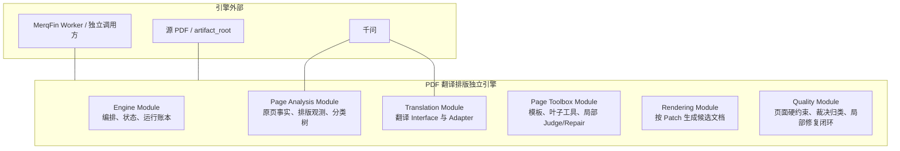
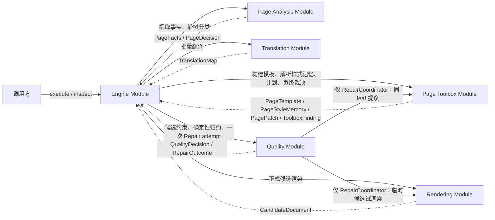
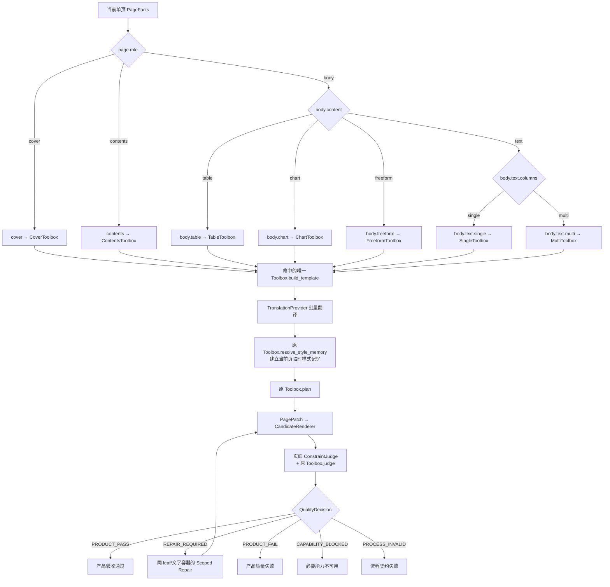
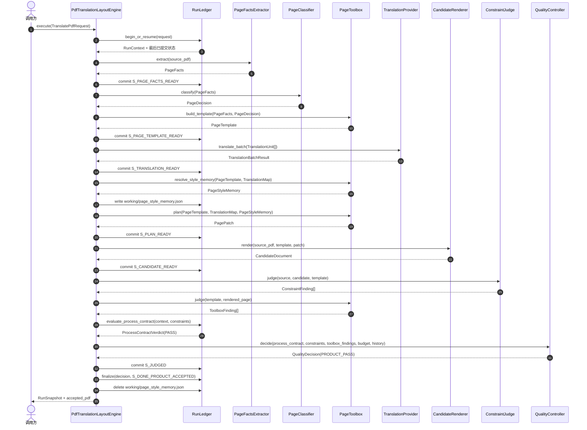
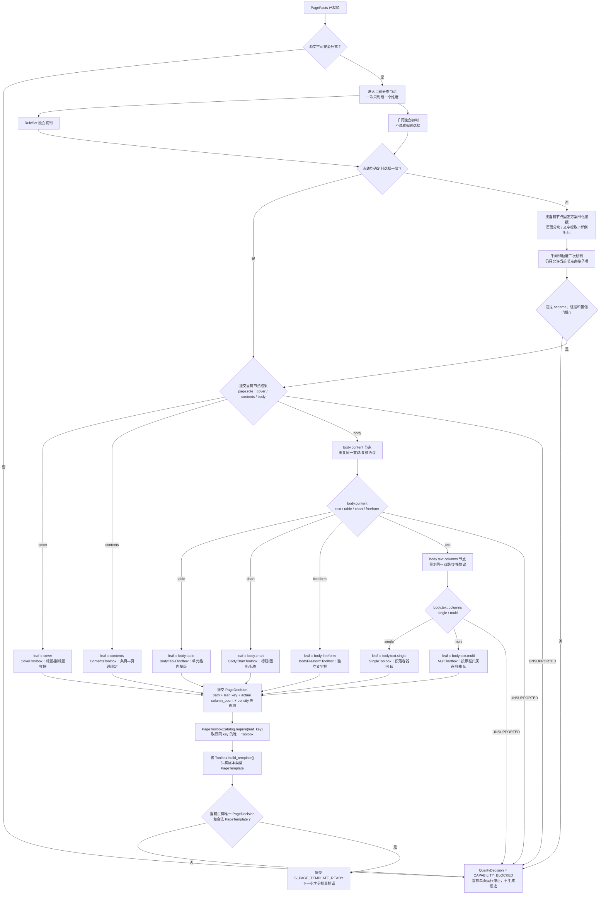
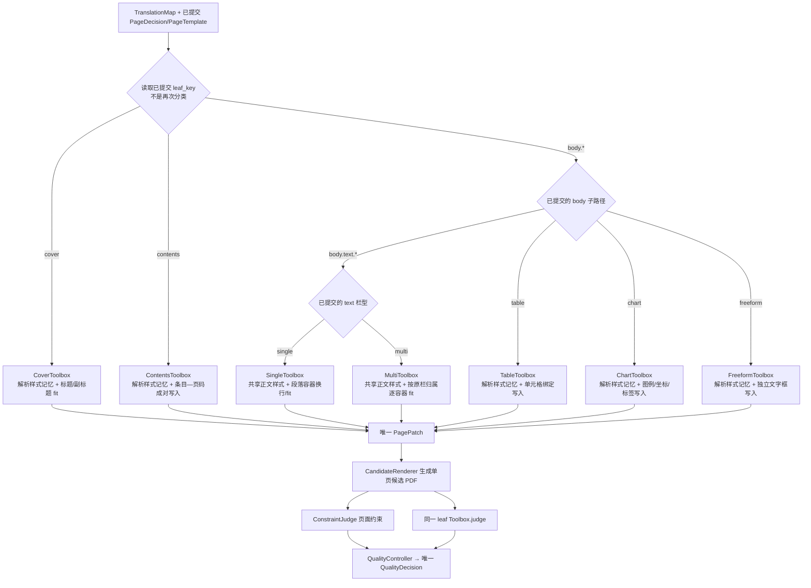
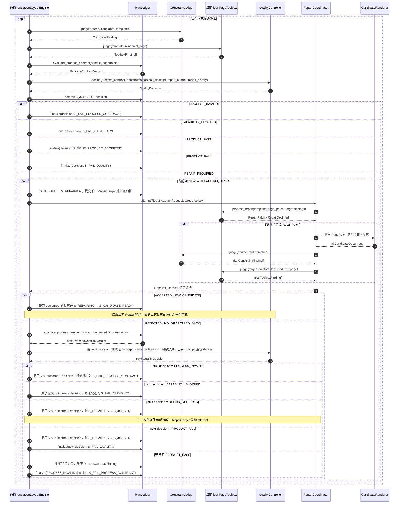
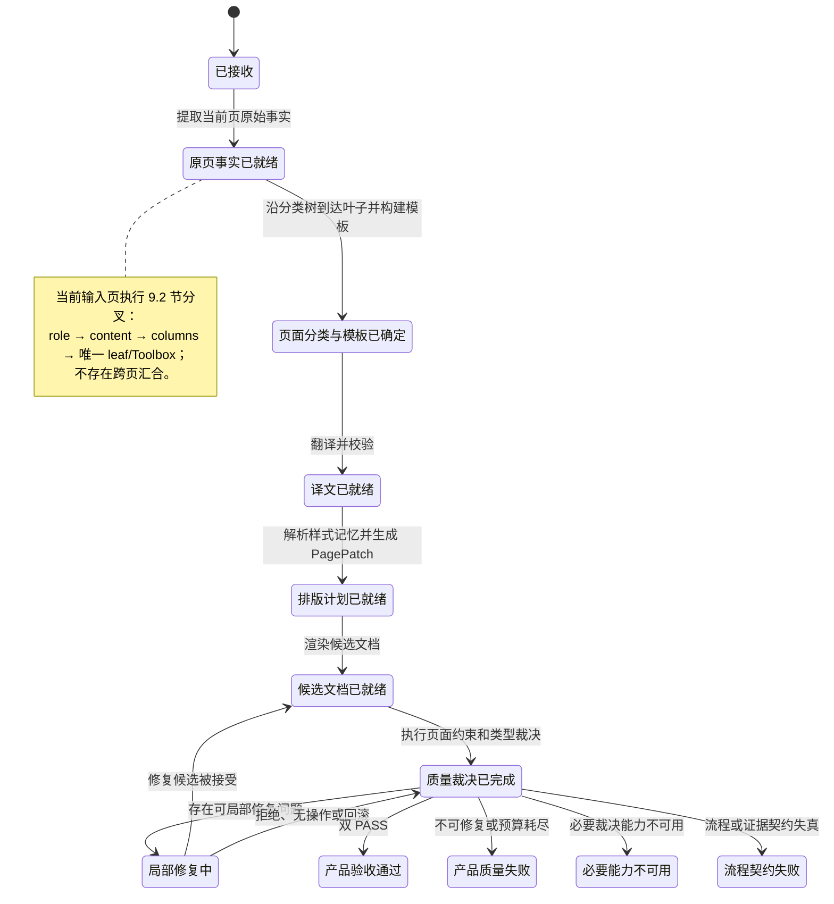

# PDF 翻译排版独立引擎总体与详细设计

> 文档状态：详细设计提案，待评审后作为新引擎实现基线
>
> 修订日期：2026-07-10
>
> 拟建目录：`spikes/独立测试/pdf_translation_layout_engine/`
>
> 当前效力：只描述下一代实现，不改变 `pdf_translation_workflow_core`、`pdf_translation_workflow_lab` 或 v4 的现有运行契约

## 1. 结论先行

新引擎的单次输入是恰好一页的 PDF，只关心这一页的翻译排版，不判断原始文档是年报、中报、季报还是公告。

核心原则：

1. 单页 PDF 是不可变底板：页面尺寸、坐标系、背景、图片、颜色、矢量图形、表格线和图表主体不能动。
2. 引擎只识别文字容器：固定 bbox 左上角、锚点和阅读顺序，宽高可在安全范围内随译文变化。
3. 输入页沿分类树到达一个叶子，并交给同 key 的唯一 `PageToolbox` 处理。
4. 分类树的每个节点只判断一个维度：RuleSet 与千问独立初判，一致则进入下一节点；不一致时只允许一次当前节点的细粒度复核。
5. 每个 PageToolbox 私有拥有自己的工具、裁决、可选 Repair、阈值和测试；确有模型调用时 Prompt 也归本 leaf；相似代码允许复制。
6. 当前页面使用一份临时 PageStyleMemory，保持正文和容器内字体、字号、行距等样式一致；终态后删除。
7. 内部只分六个能力 Module，并由一组明确核心类协作；不建设平台级微服务、Worker 或插件框架。
8. “质量裁决已完成”必须产生五种 QualityDecision 之一，每一种都有唯一下一动作。
9. 翻译通过一个中立 `TranslationProvider` Seam 接入；首版直接调用千问，未来替换 MerqFin Adapter。

执行主线：

```text
原页事实
  → 每个分类节点双路初判；一致直通，不一致则细粒度复核一次
  → 沿分类树生成 PageDecision
  → 原页模板
  → 文字翻译
  → 建立当前页样式记忆
  → 对应 PageToolbox 排版
  → 页面约束与 PageToolbox 裁决
  → QualityDecision：通过 / 修复 / 质量失败 / 能力不足 / 流程失败
  → 必要时局部修复并完整重裁
  → 流程审计与双裁决
```

新目录与 `pdf_translation_workflow_core` 同级。v4 和当前 core 不再作为新主干，只作为工具、算法和历史证据来源。

## 2. 本次设计重置

上一版受到 core/v4 影响，保留了过多为“通用编排”服务的概念。这些概念经过删除测试后，不再进入新设计：

| 删除对象 | 删除理由 | 替代方式 |
|---|---|---|
| `DocumentFamily` / Family Module | 页面排版不需要知道年报、中报或公告 | 完全从执行模型删除；需要时仅作为报表 metadata |
| `ZoneGraph` | 禁止跨区域自由重排后，不需要通用关系图 | 使用平面的 `PageTemplate + TextContainer` |
| `OwnershipMap` | 一页只有一个 PageToolbox，所有写入必须引用文字容器 | 使用 `leaf_key + page_id + container_id` |
| `ScopeClaim/FALLBACK/PROTECT` | 不再有多个跨 Toolbox writer 争抢区域 | 模板直接声明 locked objects 和 text containers |
| `PlanComposer/LayoutSlotMap` | 不再合并多个 Strategy 的计划 | PageToolbox 直接生成一个 `PagePatch` |
| 文档族/页面角色两级 catalog | 没有足够 Leverage | 一棵页面分类树和一个静态 `PAGE_TOOLBOX_CATALOG` |
| 持久化“终态归并中”状态 | 终态归并只是确定性函数 | 用幂等 reducer 原子提交 verdict 和终态 |

设计优先级改为：

```text
简单闭环 > Locality > DRY > 代码行数
```

代码量不是主要成本。真正需要避免的是：改一个页面类型的工具或裁决，其他页面类型也跟着变化。

## 3. 目标、范围与非目标

### 3.1 V1 目标

- 支持恰好一页的 native-text PDF 中英双向翻译排版；非单页输入直接拒绝。
- 保持单页 MediaBox、CropBox、旋转和原坐标系。
- 保持图片、背景、Logo、装饰、颜色、表格网格和图表主体不变。
- 只在显式文字容器内替换文字；容器左上角、锚点和阅读顺序固定。
- 用当前页临时样式记忆维持正文和容器内字体、字号、行距等样式一致。
- 针对首页、目录、单栏正文、多栏正文、表格页、图表页和自由版式页分别处理。
- 分类节点一次只判断一个维度；保存规则/千问初判一致性和必要的细粒度复核证据。
- 每种页面类型拥有独立工具、裁决、按证据增加的 Repair 和回归集。
- 给出六个能力 Module、核心类图、类职责、运行协作和类到目录映射。
- 所有 QualityDecision、RepairOutcome 和状态迁移都有确定性下一动作。
- 项目自维护 Prompt 默认中文并版本化。
- 运行可审计、可恢复，并严格区分候选 PDF 与验收 PDF。

### 3.2 V1 非目标

- 不判断整份文档属于哪种业务文档。
- 不理解背景图片、照片、Logo 或装饰图形的语义。
- 不移动、缩放、裁剪或重绘 locked objects。
- 不负责把原始多页 PDF 拆成单页，也不负责把单页结果重新合并；这属于调用方流程。
- 不支持源文字已烧录进扫描图片、轮廓路径或无法安全分离的页面。
- 不自建 HTTP 服务、任务队列、数据库或 MerqFin 业务任务系统。
- 不提供通用 ToolRegistry、动态插件或让 LLM 开放式选择工具的入口。
- 不深入设计翻译业务；只保留 TranslationProvider Interface。
- 不在架构文档臆测每类工具的最佳参数/调用顺序；未成熟能力留在 lab 验证。

扫描页以后若要支持，必须单独设计 OCR、文字移除和背景修复能力，不能伪装成普通排版能力。

### 3.3 参考文档的使用方式

| 参考文档 | 只借用的范式 | 明确不借用 |
|---|---|---|
| `D:/项目/DataFabric/docs/设计/AI_Native数据要素编织中心_P1_系统组成设计_v1.0.md` | 能力→Module、组成图与运行协作图分离、Module 负责/不负责、happy path 与分支流程分开 | MBSE 编号、前后端/BFF、平台存储、部署和需求追溯体系 |
| `D:/项目/DataFabric/docs/设计/AI_Native数据要素编织中心_P1_后端架构详细设计文档_v1.9(1).md` | 核心类图、类职责表、状态迁移副作用表、alt/else 时序、类到目录映射 | 多服务、数据库、API、Worker、队列、权限、部署和组织治理 |

两份文档只提供书写范式。新引擎是单个进程内 Module，所以系统组成与详细设计合在本文，不拆成两套互相漂移的文档。

## 4. 最小页面模型

新引擎的数据合同沿一条主链传递，不为每个阶段再造平行画像体系：

```text
PageFacts
  → PageDecision
  → PageTemplate
  → TranslationMap
  → PageStyleMemory
  → PagePatch
  → CandidateDocument
  → ProcessContractVerdict + ConstraintFinding + ToolboxFinding
  → QualityDecision
  → 可选 RepairPatch / RepairOutcome
```

### 4.1 PageFacts

`PageFacts` 是从原 PDF 读取的确定性事实：

```python
@dataclass(frozen=True)
class PageFacts:
    page_id: str
    media_box: Box
    crop_box: Box
    rotation: int
    extraction_mode: Literal["NATIVE_TEXT", "RASTER", "MIXED"]
    text_objects: tuple[TextObject, ...]
    non_text_objects: tuple[ObjectRef, ...]
    source_render_ref: ArtifactRef
```

这里不做业务判断，也不理解图片内容。图片、矢量线、填充和装饰只需要稳定引用、位置、变换矩阵和哈希。

分类时同时生成少量可复核的排版观测量，避免只留下“文字多”“文字少”这类无法回归的主观标签：

```python
@dataclass(frozen=True)
class PageLayoutObservations:
    column_count: int | None
    column_boxes: tuple[Box, ...]
    column_detection_version: str
    text_block_count: int
    text_line_count: int
    source_character_count: int
    text_area_ratio: float
    median_source_font_size: float | None
    density_band: Literal["LOW", "MEDIUM", "HIGH", "UNKNOWN"]
    density_rule_version: str
    table_cell_count: int | None = None
    chart_kind: Literal["PIE", "BAR", "OTHER"] | None = None
```

`column_boxes`、计数、面积占比和原字号是可复核观测；`column_count` 必须与 `column_boxes` 数量一致。`density_band` 是派生结果，必须记录规则版本。无法可靠提取文字的页面使用 `UNKNOWN`，不能被迫填成低密度。不同语种不能只用字符数互相比密度，至少要结合文字面积占比、行数和原字号。V1 不追求一个适用于所有页面的神奇总分。

### 4.2 PageTemplate

不引入通用关系图。页面只需要一个容易理解的模板：

```python
@dataclass(frozen=True)
class PageTemplate:
    page_id: str
    page_type: PageType
    classification_path: tuple[str, ...]
    toolbox_key: str
    layout_observations: PageLayoutObservations
    toolbox_version: str
    template_version: str

    media_box: Box
    crop_box: Box
    rotation: int

    locked_object_refs: tuple[ObjectRef, ...]
    locked_background_fingerprint: str
    text_containers: tuple[TextContainer, ...]
```

可以把它理解成：

```text
PageTemplate
├─ 原页尺寸和坐标系
├─ 不可动底板
│  ├─ 背景
│  ├─ 图片 / Logo
│  ├─ 矢量线 / 装饰
│  ├─ 表格网格
│  └─ 图表主体
└─ 可编辑文字容器
   ├─ 标题
   ├─ 正文
   ├─ 目录条目
   ├─ 表格单元格文字
   └─ 图表标题 / 图例 / 标签
```

不需要通用的 `contains/overlaps/anchors/before` 图结构。阅读顺序和表格/图表对应关系直接放在文字容器字段中。

### 4.3 文字容器 TextContainer

文字容器不是一个固定大小的“插槽”。它表示原页上的一个独立文字单元，例如一个标题、一段正文、一个目录条目、一个表格单元格或一个图表标签。每个容器绑定原文字对象、固定左上角和阅读顺序；翻译后仍写回同一个容器，只允许右边界和下边界在安全范围内变化。

```python
@dataclass(frozen=True)
class TextContainer:
    container_id: str
    container_kind: ContainerKind
    source_object_refs: tuple[ObjectRef, ...]
    source_text: str

    source_bbox: Box
    fixed_origin: Point
    resize_bounds: Box
    anchor: Anchor
    original_style: TextStyle
    style_limits: TextStyleLimits
    reading_order: int

    binding_id: str | None = None
```

字段含义：

- `fixed_origin` 等于原 `source_bbox` 的左上角，任何 Plan 或 Repair 都不能修改；
- `resize_bounds` 是当前栏、表格单元格或安全文字区域允许到达的最大范围，不是强制输出尺寸；
- 对 `TABLE_CELL`，`resize_bounds` 固定为原单元格内部，不能通过扩大文字容器改变表格行高、列宽或网格；
- 输出 bbox 的左上角固定，宽度和高度可以随译文长度变化，但不能越出 `resize_bounds`；
- `anchor`、`reading_order` 和 `binding_id` 固定，保证文字仍属于原来的标题、段落、目录项、单元格或图表标签；
- 一个容器只使用一组最终字体、字号、行距和颜色；需要不同文字样式时，应在模板阶段拆成不同容器。

V1 只需要少量稳定的 `container_kind`：

```text
TITLE
SUBTITLE
PARAGRAPH
FOOTNOTE
CONTENTS_ENTRY
TABLE_CELL
CHART_TITLE
CHART_LABEL
PAGE_NUMBER
```

`binding_id` 只用于局部对应：

- 目录条目与页码；
- 表格单元格的行列 ID；
- 图表标题、图例、坐标或标签 ID。

这已经足够支持针对性工具和裁决，不再为这些关系建立通用图模型。

### 4.4 不可动与可动约束

单次请求的输入必须是恰好一页的 PDF。调用方负责在进入引擎前拆页，并在所有页面分别完成后决定是否合并；引擎本身既不感知其他页面，也不维护跨页状态。

不可动：

- 单页画布的 MediaBox、CropBox、旋转和原坐标系；
- 背景、图片、Logo、矢量图形、装饰、表格线和图表主体的内容、颜色、位置、尺寸、变换矩阵和层级；
- 原文字颜色；
- 每个文字容器 bbox 的左上角坐标；
- 每个文字容器的锚点、归属关系和阅读顺序；
- 表格网格、行数、列关系和单元格绑定；译文必须回填到原单元格容器，不能增删行或换到其他单元格；
- 表格中的数字、日期、金额、代码和其他 protected token；只翻译可翻译文字，数据值必须原样回填；
- 已提交的 PageDecision、PageType 和 Toolbox 归属。

允许修改：

- 只移除 `source_object_refs` 指定的源文字对象；
- 把译文写回同一个 `container_id`；
- 在 `resize_bounds` 内改变文字容器 bbox 的宽度和高度，左上角保持不变；
- 使用已声明的字体 fallback；
- 在 `style_limits` 内调整字体、字号、行距、字距、段前段后、换行和对齐；
- PageToolbox 明确允许的容器内 Repair 参数。

`模板外写入`、`跨页流动`和`跨栏串写`不再作为 LLM 或 QualityController 需要选择的业务分支：单页输入、container_id 绑定和 resize_bounds 已从 Interface 上排除了这些动作。若实现仍产生这类结果，说明违反 typed contract，直接记为 `PROCESS_INVALID`，不能交给模型判断或 Repair“修回来”。

正文一致性规则：

- 本页所有 `PARAGRAPH` 正文容器使用同一组最终字体、字号、行距、字距和段落间距；
- 同一个文字容器内部不得混用多套字体或字号；
- 文字颜色按原容器固定，可以在不同容器之间不同，但不能被排版或 Repair 改写；
- 标题、脚注、表格和图表标签可以有各自样式，但同一 `container_kind` 的样式应优先复用；
- 如果 Repair 要改变正文共享字号或行距，必须同步更新本页全部 `PARAGRAPH` 容器，不能只缩小出问题的一个容器。

明确禁止用白色矩形粗暴覆盖源文字。若源文字无法与背景安全分离，必须进入能力不足，不能破坏背景后继续生成候选。

### 4.5 临时样式记忆 PageStyleMemory

样式记忆不是跨文档的 LLM 长期记忆，只是当前单页运行期间的一个小型确定性工作文件，用来保证同页正文和同容器样式一致：

```python
@dataclass(frozen=True)
class ResolvedTypography:
    font_ref: str
    font_size: float
    line_height: float
    character_spacing: float
    paragraph_spacing: float


@dataclass(frozen=True)
class ContainerStyleMemory:
    container_id: str
    container_kind: ContainerKind
    typography: ResolvedTypography
    alignment: str
    text_color: Color


@dataclass(frozen=True)
class PageStyleMemory:
    page_id: str
    source_pdf_sha256: str
    template_sha256: str
    toolbox_key: str
    toolbox_version: str
    body_typography: ResolvedTypography | None
    container_styles: tuple[ContainerStyleMemory, ...]
    memory_version: str
```

只记录字体、字号、行距、字距、段落间距、对齐和文字颜色，不保存译文全文、分类推理、质量裁决或跨文档知识。工作文件固定为：

```text
<artifact_root>/<run_id>/working/page_style_memory.json
```

生命周期固定：

1. PageTemplate 中每个 TextContainer 的 `original_style` 提供源样式种子，此时不单独写记忆文件；
2. TranslationMap 就绪后，由当前 PageToolbox 结合全部文字容器一次性创建 PageStyleMemory，确定正文共享 typography 和各类容器样式；
3. PagePatch、CandidateRenderer 和 RepairCoordinator 都读取同一份记忆，不各自猜字体和字号；
4. 运行中断时保留，恢复时按 source/template/toolbox hash 校验后复用；
5. 任一终态提交后删除工作文件。实际使用的最终样式已经逐容器写入 PagePatch 和 commit，因此删除工作记忆不影响审计。

## 5. 页面分类树

分类、工具箱、局部裁决和 trace 使用同一棵树：

```text
page
├─ cover                         → cover 工具箱
├─ contents                      → contents 工具箱
└─ body
   ├─ text
   │  ├─ single                  → body.text.single 工具箱
   │  └─ multi                   → body.text.multi 工具箱
   ├─ table                      → body.table 工具箱
   ├─ chart                      → body.chart 工具箱
   └─ freeform                   → body.freeform 工具箱
```

分类从根节点逐层比较，不允许一次判断所有维度，也不允许模型直接从所有工具中挑一个。

### 5.1 当前叶子与工具箱

`PageType` 不维护另一套字符串值；枚举值就是 leaf key：

```python
class PageType(StrEnum):
    COVER = "cover"
    CONTENTS = "contents"
    BODY_TEXT_SINGLE = "body.text.single"
    BODY_TEXT_MULTI = "body.text.multi"
    BODY_TABLE = "body.table"
    BODY_CHART = "body.chart"
    BODY_FREEFORM = "body.freeform"
    UNSUPPORTED = "unsupported"
```

| 分类路径/枚举值 | PageType 枚举名 | toolbox_key | 关键局部裁决 |
|---|---|---|---|
| `cover` | `COVER` | `cover` | 标题层级、锚点、主视觉不被遮挡 |
| `contents` | `CONTENTS` | `contents` | 条目、引导线、页码对应与对齐 |
| `body.text.single` | `BODY_TEXT_SINGLE` | `body.text.single` | 阅读顺序、文字适配、残留和溢出 |
| `body.text.multi` | `BODY_TEXT_MULTI` | `body.text.multi` | 文字容器固定原栏、原阅读顺序、栏间不串写 |
| `body.table` | `BODY_TABLE` | `body.table` | 单元格绑定、数字和网格不变 |
| `body.chart` | `BODY_CHART` | `body.chart` | 图例/坐标/标签绑定，图形不变 |
| `body.freeform` | `BODY_FREEFORM` | `body.freeform` | 独立文字框锚点和对象遮挡 |
| 无法安全到达叶子 | `UNSUPPORTED` | 无 | 能力不足，不生成候选 |

强制恒等式：

```text
".".join(PageDecision.path)
  == PageDecision.page_type.value
  == PageDecision.leaf_key
  == PageTemplate.toolbox_key
  == PagePatch.toolbox_key
  == ToolboxFinding.toolbox_key
  == RepairPatch.toolbox_key
```

该恒等式只比较当前阶段已经存在的对象，并只适用于成功到达叶子的页面；`UNSUPPORTED` 保留已走过的部分 path，但没有 leaf_key 和 Toolbox。持久化的 `PageDecision.path` 不包含展示用虚拟根节点 `page`，例如三栏页保存 `("body", "text", "multi")`。没有第二张“页面类型到工具”的隐式映射表。看 PageDecision 的 leaf_key，就知道哪个目录、哪个工具箱和哪个 Judge 在负责。

### 5.2 每个节点的输出

```python
@dataclass(frozen=True)
class NodeJudgement:
    source: Literal["RULE", "QWEN_PRIMARY", "QWEN_FINE_REVIEW"]
    selected_child: str | None
    status: Literal["DECIDED", "INCONCLUSIVE"]
    confidence: float
    evidence_refs: tuple[ArtifactRef, ...]
    judge_version: str
    input_sha256: str
    output_sha256: str


@dataclass(frozen=True)
class DecisionNodeResult:
    node_key: str
    candidate_children: tuple[str, ...]
    rule_judgement: NodeJudgement
    primary_model_judgement: NodeJudgement
    consistency: Literal["AGREED", "DISAGREED", "INCOMPLETE"]
    fine_review_judgement: NodeJudgement | None
    selected_child: str | None
    status: Literal["DECIDED", "UNSUPPORTED"]
    resolution: Literal["DIRECT_AGREEMENT", "FINE_GRAINED_REVIEW", "NONE"]
    confidence: float
    evidence_refs: tuple[ArtifactRef, ...]


@dataclass(frozen=True)
class PageDecision:
    page_id: str
    path: tuple[str, ...]
    page_type: PageType
    leaf_key: str | None
    trace: tuple[DecisionNodeResult, ...]
    layout_observations: PageLayoutObservations
```

`consistency=AGREED` 只表示两路初判都为 DECIDED 且选择相同；两路都确定但选择不同为 `DISAGREED`；任一方 INCONCLUSIVE 为 `INCOMPLETE`。直接一致时 `fine_review_judgement=None`；发生分歧或不完整时必须存在该字段。复核仍不确定时，单个 NodeJudgement 保留 INCONCLUSIVE，而最终 DecisionNodeResult 使用 `status=UNSUPPORTED、resolution=NONE、selected_child=None`。

`PageDecision` 本身就是完整分类 trace：节点序列记录过程，path/leaf_key 记录结果。`leaf_key` 是由构造器从 path 确定性计算并为序列化暴露的只读派生值，调用方不能独立赋值，因而不会形成第二份可漂移分类结果。

`layout_observations` 记录当前不参与叶子路由、但工具箱会使用且未来可能升级为分支的维度，例如：

- 文字密度；
- 图表种类（饼图、柱状图等）；
- 以单元格数量表示的表格复杂度。

这些维度首版会参与当前 Toolbox 内的确定性参数选择，但不改变 leaf_key，也不提前拆分工具箱。

### 5.3 节点判断顺序与最小证据

每个节点只回答一个问题，并只消费回答该问题所需的事实：

| 节点 | 当前问题 | 主要证据 | 明确不做 |
|---|---|---|---|
| `page.role` | cover、contents 还是 body | 标题层级与面积、连续正文比例、重复“条目 + 页码”模式、引导线、主视觉占比、页面位置辅助证据 | 不判断栏数，不选择工具 |
| `body.content` | text、table、chart 还是 freeform | 连续文字流占比、表格网格与单元格重复、图表 plot/legend/axis 结构、彼此独立的文字框 | 不判断密度，不调用 Repair |
| `body.text.columns` | single 还是 multi | 文字块在 x 轴形成的稳定流槽数量、流槽纵向覆盖、栏间空白、阅读顺序 | 不判断首页/目录，不选择二栏或三栏专用工具 |
| 到达叶子后 | 实际几栏、文字多少 | `column_count`、块/行/字符计数、文字面积占比、原字号、density 阈值版本 | 不改变 leaf_key |

最小规则：

1. `contents` 必须有可复核的重复条目结构，不能因为页面上有很多短句就判为目录。
2. `cover` 不能只靠“第一页”判断；页面位置只能作为辅助证据。
3. `body.table` 和 `body.chart` 要求主体结构占主导；正文中嵌入的小表或小图不抢走整页所有权。
4. `body.freeform` 指“多个独立文字框形成明确自由版式”，不是歧义页的兜底桶。
5. `column_count` 保存实际正整数；`single/multi` 只负责一级路由，所以三栏页仍属于 `body.text.multi`。
6. 节点规则和阈值都要版本化。两个候选没有拉开规定差距时，不允许强行选一个。

每个节点使用同一个“双路初判 + 一次细粒度复核”协议，但各自拥有独立 RuleSet、初判 Prompt 和复核证据方案：

```text
计算本节点特征
  ├─ 版本化 RuleSet 独立输出 source=RULE 的 NodeJudgement
  └─ QwenNodeDecider.decide_primary() 独立输出 source=QWEN_PRIMARY 的 NodeJudgement
       # 初判千问不读取 RuleSet 的选择，避免顺从规则结论
  → 两边均为 DECIDED 且 selected_child 相同：DIRECT_AGREEMENT，进入下一节点
  → 两边选择不同，或任一方为 INCONCLUSIVE：构建当前节点的细粒度证据
  → QwenNodeDecider.review_disagreement() 只对当前节点二次研判一次
  → 二次结果通过 schema、evidence ref 和 confidence 门槛：FINE_GRAINED_REVIEW，进入下一节点
  → 二次结果仍为 INCONCLUSIVE 或输出非法：UNSUPPORTED，整页能力不足
```

`DIRECT_AGREEMENT` 只表示规则和千问初判在当前维度一致，不代表整页分类完成；只有后续所需节点也逐一完成，才能形成 leaf_key。细粒度复核结果是当前节点的最终裁决，不再发起第三轮模型投票，避免开放式循环。

V1 的可执行成立条件如下；具体数值放在 RuleSet 版本和 gold manifest 回归中，不写进 Engine：

| 节点 | 子项成立条件 |
|---|---|
| `page.role` | `contents`：重复“条目文字 + 页码”关系、引导线或规则行结构达到门槛；`cover`：标题/机构/期间等主身份块占主导、连续正文稀少，且不满足目录结构；`body`：至少一种正文主体结构（稳定文字流、主体表格、主体图表或明确自由文字框）达到门槛，且 cover/contents 均不成立。`body` 不是默认兜底。 |
| `body.content` | `table`：网格/单元格关系在主体区域占主导；`chart`：plot/axis/legend/数据标签结构在主体区域占主导；`text`：一条或多条稳定阅读流占主导，且 table/chart 不占主导；`freeform`：多个独立文字框占主导、没有稳定阅读流，且 table/chart 不占主导。混合页按 5.6 节的主体区域规则处理。 |
| `body.text.columns` | 过滤页眉页脚、图注和小孤立块后，稳定有效流槽数为 1 则 `single`，大于等于 2 则 `multi`；流槽交叠、纵向覆盖不足或阅读序冲突时 RULE NodeJudgement 返回 INCONCLUSIVE。实际 2/3/... 栏数继续保存在 `column_count`。 |

千问初判的输入是 `PageEvidenceBundle`：当前 node_key、allowed children、当前节点的基础结构化特征/evidence refs，以及可选的 canonical page preview ArtifactRef；不包含 RULE NodeJudgement 的选择。配置视觉千问时可以读取固定渲染图；只配置文本模型时不传图片。模型永远看不到工具实现或下一层候选。

初判不一致或任一方不完整时，PageClassifier 按当前节点的固定 `FineReviewEvidencePlan` 构建 `FineGrainedEvidenceBundle`。V1 只允许三类可审计的细化方式，节点按需选用，不要求每次全部执行：

| 细化方式 | 产出 | 适用示例 |
|---|---|---|
| 页面分块 | 主体块、边缘块、文字块和非文字块的区域证据 | 区分首页主视觉、目录重复结构和正文主体 |
| 文字提取 | 按块提取的原文、短句/长段比例、页码及标题模式 | 区分首页身份文字、目录条目和连续正文 |
| 标注样例对比 | 当前节点版本化 exemplar 的特征摘要与固定预览引用 | 对比相似首页、目录、正文、表格或栏型样例 |

细粒度复核接收当前节点、直接子项、两路初判的结构化分歧摘要和新增证据；不得调用任意工具、扩大候选集合或判断下一层。分块、文字提取和样例检索由节点代码确定性执行，千问只消费结果并完成一次受限复核。

`FineReviewEvidencePlan` 不是新的公共 Interface、Module 或模型工具注册表，只是每个分类节点随 RuleSet 一起版本化的私有证据构建方案；删除它会把分块、提取和样例选择逻辑散回 PageClassifier，因此保留在节点实现内部。

样例对比只能读取从 `dev` split 显式批准并版本化的 exemplar，不得读取当前样本的 expected_path、reviewer label，也不得选取与当前样本相同 `document_lineage_id` 的页面；回归集和 holdout 的真值只用于离线评分，不能进入模型输入。

源语言和目标语言属于运行上下文，不成为页面分类分支。同一个 Toolbox 可根据语言方向选择字体和 fit 参数；只有以后出现完全不同的工具或 Judge，才讨论是否拆分。

### 5.4 两个页面示例

| 示例 | 决策路径 | 观测维度 | 当前工具箱 |
|---|---|---|---|
| 三栏信息列表页 | `page → body → text → multi` | `column_count=3`、文字面积占比、密度、段落数 | `body.text.multi` |
| 单栏密集正文页 | `page → body → text → single` | `column_count=1`、文字面积占比、密度、行距 | `body.text.single` |

分类器负责把“单栏还是多栏、实际几栏、文字多少”说清楚；工具箱只处理自己叶子下的问题。`body.text.multi` 可以先读取明确的 `column_count` 做二栏或三栏排版，不需要知道首页、目录或表格页怎么处理。

### 5.5 什么时候给树增加新分支

只有满足以下条件，观测维度才能升级为分类节点：

1. 现有同一叶子内已经出现两套不同工具或不同 Judge；
2. 两类页面的 Repair 操作或失败语义明显不同；
3. 有真实样本和独立回归集；
4. 拆分后能提高 Locality，而不是只增加标签。

例如，若后续证明密集单栏正文和普通单栏正文必须使用不同工具箱，再把：

```text
body.text.single
```

扩展为：

```text
body.text.single
├─ normal
└─ dense
```

在此之前，density 只作为 `body.text.single` 工具箱内部参数，不创建 `normal/dense` 目录。

图表的 `pie/bar/other` 也遵守同一规则：只有工具或裁决真的不同，才成为子节点。

### 5.6 混合页和歧义页

不设置万能 `mixed` 工具箱：

- 多栏正文中嵌入小表格：仍走 `body.text.multi`，由该工具箱的私有 table-cell 工具处理。
- 表格占页面主体：`body.table`。
- 图表占页面主体：`body.chart`。
- 没有明确主版式：`UNSUPPORTED`。

低置信度不得默认为正文。不能安全到达唯一叶子时，由 reducer 进入能力不足。

### 5.7 规则与大模型双路判断

规则和千问初判在每个实际经过的节点都执行，并且只允许在当前节点的直接子项中选择：

- 在根节点只能选 `cover/contents/body` 或 `INCONCLUSIVE`；
- 在 `body` 节点只能选 `text/table/chart/freeform` 或 `INCONCLUSIVE`；
- 在 `body.text` 节点只能选 `single/multi` 或 `INCONCLUSIVE`。

大模型不得跳层、不得看到工具实现、不得输出工具名、不得直接写 leaf_key、不得修改终态。到达叶子后，工具箱由恒等式确定。

每次节点裁决必须记录候选子项、RULE NodeJudgement、千问初判、两者一致性、存在时的细粒度复核、最终 resolution、confidence、evidence、各判断器版本以及输入输出哈希；不记录隐藏推理过程。

双路初判的比较和最终归约由 PageClassifier 确定性执行；私有 `QwenNodeDecider` 只提供 `decide_primary()` 和 `review_disagreement()` 两个行为。翻译用的 `TranslationProvider` 不复用、不承载分类调用。二次 NodeJudgement 仍为 `INCONCLUSIVE` 时，最终 DecisionNodeResult 为 `UNSUPPORTED`，不能继续加轮次或默认落入某个 leaf。

## 6. 服务组成与核心类设计

### 6.1 设计粒度与运行形态

本文把“PDF 翻译排版独立引擎”视为一个产品能力服务，但 V1 落地形态仍是一个可被 MerqFin worker 进程内调用的 Python Module：同步执行、文件产物、无 HTTP、无数据库、无独立 Worker、无消息队列。

本章只回答四个问题：

1. 引擎内部有哪些能力 Module；
2. Module 之间如何调用；
3. 哪些核心类承担这些能力；
4. 修改某种页面时应进入哪个 Module 和目录。

具体字体参数、阈值和工具最佳调用序列不在本章拍死；这些属于样本实验结果。当前只有两个真实 Seam：多个叶子实现同一个 `PageToolbox` Interface，以及千问/未来 MerqFin 翻译能力实现同一个 `TranslationProvider` Interface。其余只有单实现的机械类不为“以后也许替换”提前造 Port。

物理 owner 写死：分类特征、RuleSet、初判/复核 Prompt、`FineReviewEvidencePlan` 和 `QwenNodeDecider` 全部属于 Page Analysis Module，落在 `analysis/classification/`；到达叶子后的模板、排版、页级 Judge 和 Repair 属于 Page Toolbox Module，落在 `page_tree/<leaf path>/`。修改分类与修改某类页面工具不会落到同一个模糊目录。

### 6.2 服务能力到 Module 映射

内部只划分六个能力 Module：

| 服务能力 | 主 Module | 核心类/Interface | 输入 | 输出 | 明确不负责 |
|---|---|---|---|---|---|
| 运行编排与状态 | Engine Module | `PdfTranslationLayoutEngine`、`RunStateMachine`、`RunLedger` | TranslatePdfRequest、已有 checkpoint | RunSnapshot、阶段 commit、ProcessContractVerdict | 不包含页面分类规则、排版参数或质量阈值 |
| 页面事实与分类 | Page Analysis Module | `PageFactsExtractor`、`PageClassifier`、私有 `QwenNodeDecider` | 原 PDF 页面 | PageFacts、PageLayoutObservations、双路判断 trace、PageDecision | 不选择 Toolbox 内工具，不改 PDF |
| 页面模板与排版 | Page Toolbox Module | `PageToolboxCatalog`、`PageToolbox`、各叶子 Toolbox | PageFacts、PageDecision、TranslationMap | PageTemplate、PageStyleMemory、PagePatch、ToolboxFinding、可选 RepairPatch | 不处理其他 leaf，不写终态 |
| 翻译接入 | Translation Module | `TranslationProvider`、`QwenTranslationAdapter` | TranslationBatchRequest | TranslationBatchResult | 不知道页面类型、坐标、工具或裁决 |
| 候选文档执行 | Rendering Module | `CandidateRenderer` | 原 PDF、PageTemplate、PagePatch | 不可覆盖的 CandidateDocument | 不重判页面类型，不自行调整排版策略 |
| 质量闭环 | Quality Module | `ConstraintJudge`、`QualityController`、`RepairCoordinator` | CandidateDocument、流程契约结果、页面约束、Toolbox Finding、修复预算 | QualityDecision、RepairOutcome、split verdict 输入 | 不解释原始状态账本，不绕过 Toolbox 生成修复 |

### 6.3 系统组成图

下图只表达“由什么组成”，不表达调用时序：



组成约束：

- 整个引擎只有一个对外执行入口，调用方看不到分类节点、工具名或 Repair 参数。
- 页面相关知识集中在 Page Analysis 与对应叶子 PageToolbox，Engine 保持“笨编排”。
- 千问位于引擎外部；`QwenTranslationAdapter` 位于 Translation Module 内，私有 `QwenNodeDecider` 位于 Page Analysis Module 内，二者不共享业务 Interface。
- artifact_root 是本地运行事实源，不引入数据库或远程 ArtifactStore Port。

### 6.4 Module 运行协作图

实线表示调用，虚线表示结果返回。Engine 拥有当前单页的阶段循环；Quality Module 内的 `RepairCoordinator` 只封装一次局部 Repair attempt，不接管整个运行循环。



依赖方向必须单向：Analysis 不调用 Engine；Toolbox 不调用另一个 Toolbox；Rendering 和 Judge 不反向决定分类；TranslationProvider 不读取 PageTemplate；QualityController 只归约已形成的流程契约结果和 Finding，不执行 PDF 写入。RepairCoordinator 可以调用同 leaf Toolbox、CandidateRenderer 和 ConstraintJudge，但只能完成一次 attempt 并把结果交回 Engine。

### 6.5 核心类图

```mermaid
classDiagram
    class PdfTranslationLayoutEngine {
        +execute(request) RunSnapshot
        +inspect(run_id) RunSnapshot
    }
    class RunStateMachine {
        +assert_transition(current, next)
        +next_state(current, event) StateCode
    }
    class RunLedger {
        +begin_or_resume(request) RunContext
        +commit_stage(state, artifacts)
        +save_style_memory(memory)
        +cleanup_working_memory()
        +evaluate_process_contract(context, constraints) ProcessContractVerdict
        +finalize(decision, terminal_state)
    }
    class PageFactsExtractor {
        +extract(source_pdf) PageFacts
    }
    class PageClassifier {
        +classify(facts) PageDecision
    }
    class QwenNodeDecider {
        +decide_primary(evidence_bundle) NodeJudgement
        +review_disagreement(fine_evidence_bundle) NodeJudgement
    }
    class PageToolboxCatalog {
        +require(leaf_key) PageToolbox
    }
    class PageToolbox {
        <<interface>>
        +toolbox_key str
        +toolbox_version str
        +build_template(facts, decision) PageTemplate
        +resolve_style_memory(template, translations) PageStyleMemory
        +plan(template, translations, style_memory) PagePatch
        +judge(template, rendered_page) ToolboxFinding[]
    }
    class TranslationProvider {
        <<interface>>
        +translate_batch(request) TranslationBatchResult
    }
    class QwenTranslationAdapter
    class CandidateRenderer {
        +render(source_pdf, template, patch) CandidateDocument
    }
    class ConstraintJudge {
        +judge(source_pdf, candidate, template) ConstraintFinding[]
    }
    class QualityController {
        +decide(process_contract, constraints, toolbox_findings, budget, repair_history) QualityDecision
    }
    class RepairCoordinator {
        +attempt(request, toolbox) RepairOutcome
    }

    PdfTranslationLayoutEngine --> RunStateMachine
    PdfTranslationLayoutEngine --> RunLedger
    PdfTranslationLayoutEngine --> PageFactsExtractor
    PdfTranslationLayoutEngine --> PageClassifier
    PageClassifier --> QwenNodeDecider
    PdfTranslationLayoutEngine --> PageToolboxCatalog
    PdfTranslationLayoutEngine --> TranslationProvider
    PdfTranslationLayoutEngine --> CandidateRenderer
    PdfTranslationLayoutEngine --> ConstraintJudge
    PdfTranslationLayoutEngine --> QualityController
    PdfTranslationLayoutEngine --> RepairCoordinator
    PageToolboxCatalog --> PageToolbox
    RepairCoordinator --> PageToolbox
    RepairCoordinator --> CandidateRenderer
    RepairCoordinator --> ConstraintJudge
    QwenTranslationAdapter ..|> TranslationProvider
    CoverToolbox ..|> PageToolbox
    ContentsToolbox ..|> PageToolbox
    BodyTextSingleToolbox ..|> PageToolbox
    BodyTextMultiToolbox ..|> PageToolbox
    BodyTableToolbox ..|> PageToolbox
    BodyChartToolbox ..|> PageToolbox
    BodyFreeformToolbox ..|> PageToolbox
```



类图只列行为核心和七个叶子实现，不为每种 Finding 或状态建立继承体系。具体叶子私有工具仍由分类树和目录表达，不在总类图展开。

### 6.6 核心类职责

| 类/Interface | 类型 | 核心职责 | 被谁调用 | 主要依赖 | 输入/输出 | 非职责 |
|---|---|---|---|---|---|---|
| `PdfTranslationLayoutEngine` | Facade / Application | 按确定顺序调用各 Module，处理恢复和终态 | MerqFin worker、独立调用方 | 本表其余核心类 | 请求 → RunSnapshot | 不写具体页面规则，不直接调千问 SDK |
| `RunStateMachine` | Domain | 保存合法迁移表，拒绝非法边；产出状态边的流程契约证据 | Engine | State Registry | 当前状态 + 事件 → 下一状态/ProcessContractFinding | 不写 artifact，不做产品质量判断 |
| `RunLedger` | Infrastructure | 原子保存阶段事实，管理临时 PageStyleMemory 的恢复/终态清理，并校验 commit、artifact、fingerprint 和 key 一致性 | Engine | 本地文件系统、RunStateMachine | stage commit → 可恢复运行事实/流程契约结果 | 不选择下一业务动作或评价候选美观 |
| `PageFactsExtractor` | Analysis | 提取文字对象、坐标、字体、图片/矢量引用和排版原始量 | Engine | PyMuPDF 机械函数 | PDF → PageFacts | 不给页面贴类型标签 |
| `PageClassifier` | Domain | 沿分类树逐节点执行规则/千问双路初判、一致性比较和必要的一次细粒度复核，生成 PageDecision 和 trace | Engine | PageFacts、版本化 RuleSet/FineReviewEvidencePlan、QwenNodeDecider | PageFacts → PageDecision | 不输出工具名，不构建 PagePatch，不开放循环研判 |
| `QwenNodeDecider` | Analysis 私有类 | 用中文节点 Prompt 完成独立初判；不一致时消费节点已构建的细粒度证据完成一次受限复核 | PageClassifier | 千问结构化/可选视觉输入 | PageEvidenceBundle/FineGrainedEvidenceBundle → NodeJudgement | 不作为公共 Interface，不自行提取证据、选择工具、判断下一层或增加轮次 |
| `PageToolboxCatalog` | Registry | 校验并返回 leaf_key 唯一对应的 Toolbox | Engine | 静态 Toolbox 实例 | leaf_key → PageToolbox | 不做运行时工具挑选 |
| `PageToolbox` | Internal Interface | 隐藏当前 leaf 的模板、样式记忆、排版、局部 Judge 和可选 Repair 知识 | Engine、RepairCoordinator | 叶子私有 tools/prompts | 页面事实/译文/候选 → Memory/Patch/Finding | 不处理其他 leaf，不写终态 |
| `TranslationProvider` | External Interface | 批量翻译稳定 unit_id 对应的文字 | Engine | 具体 Adapter | TranslationBatchRequest → Result | 不接收坐标和 PageType |
| `QwenTranslationAdapter` | Adapter | 将批量翻译合同适配到千问 | Engine 经 Provider | 千问 SDK/HTTP | 批量请求 → 结构化译文 | 不做排版、分类或裁决 |
| `CandidateRenderer` | Infrastructure | 在单页原 PDF 副本上机械应用 PagePatch | Engine、RepairCoordinator | PyMuPDF 机械函数 | 原页 + Patch → 单页 CandidateDocument | 不自选字体策略，不移动容器左上角或越出 resize_bounds |
| `ConstraintJudge` | Domain/Mechanical | 验证 locked objects、颜色、文字容器写入、单页几何和候选可渲染性 | Engine | 源/候选渲染及对象哈希 | 候选 → ConstraintFinding | 不评价某类页面的审美规则 |
| `QualityController` | Domain | 消费已形成的 ProcessContractVerdict、页面/Toolbox Finding、预算和 Repair 历史，产生唯一 QualityDecision | Engine | 确定性决策表 | typed facts + budget → decision | 不重新解释状态账本，不直接修 PDF，不调用模型选工具 |
| `RepairCoordinator` | Application | 完成一次 Repair attempt：提议、scope/precondition 校验、派生 PagePatch、试渲染、页面约束与当前 Toolbox 复验、接受或回滚 | Engine | RepairCapablePageToolbox、CandidateRenderer、ConstraintJudge | RepairAttemptRequest + toolbox → RepairOutcome | 不控制运行循环、不调用 QualityController、不改变 leaf 或译文语义 |

这组类通过小 Interface 隐藏完整运行复杂度，提供 Depth；页面规则集中到叶子目录，提供 Locality。删除 `PageToolbox` 或 `TranslationProvider` 会把分支知识重新散回 Engine，因此二者通过删除测试。其他机械类保留具体实现，不额外套一层空 Port。

### 6.7 PageToolbox Interface

分类树的每个可执行叶子对应一个 PageToolbox 实现/子模块，不增加第七个能力 Module。Engine 只学习一个 Interface，Toolbox 在其后隐藏本叶子的模板构建、工具和裁决；局部 Repair 在 D3 才作为扩展能力加入。

```python
class PageToolbox(Protocol):
    @property
    def toolbox_key(self) -> str: ...

    @property
    def toolbox_version(self) -> str: ...

    def build_template(
        self,
        facts: PageFacts,
        decision: PageDecision,
    ) -> PageTemplate: ...

    def resolve_style_memory(
        self,
        template: PageTemplate,
        translations: TranslationMap,
    ) -> PageStyleMemory: ...

    def plan(
        self,
        template: PageTemplate,
        translations: TranslationMap,
        style_memory: PageStyleMemory,
    ) -> PagePatch: ...

    def judge(
        self,
        template: PageTemplate,
        rendered_page: RenderedPage,
    ) -> tuple[ToolboxFinding, ...]: ...
```

`build_template()` 必须消费已经提交的 PageDecision，不能重新计算页面分类、栏数或密度。返回值必须满足：

```text
PageTemplate.classification_path == PageDecision.path
PageTemplate.page_type == PageDecision.page_type
PageTemplate.toolbox_key == PageDecision.leaf_key
PageTemplate.layout_observations == PageDecision.layout_observations
PageTemplate.toolbox_version == selected PageToolbox.toolbox_version
```

静态映射只有一层：

```python
PAGE_TOOLBOX_CATALOG = {
    "cover": CoverToolbox(),
    "contents": ContentsToolbox(),
    "body.text.single": BodyTextSingleToolbox(),
    "body.text.multi": BodyTextMultiToolbox(),
    "body.table": BodyTableToolbox(),
    "body.chart": BodyChartToolbox(),
    "body.freeform": BodyFreeformToolbox(),
}
```

固定不变量：

1. 单次输入页只有一个 leaf_key 和一个同 key PageToolbox。
2. Engine 不直接选择 Toolbox 内工具、Judge 或 Repair。
3. 一个 Toolbox 不得 import 另一个 Toolbox 的私有实现。
4. Toolbox 只能修改自己页面模板中的 text containers，且必须服从同一份 PageStyleMemory。
5. PageToolbox 缺失或模板无法构建时进入能力不足。
6. 相似 Toolbox 允许复制；只有纯机械原语才允许共享。
7. 启动时验证 catalog key、PageType.value、实例 toolbox_key 和目录路径一致且无重复；不一致直接拒绝启动。

### 6.8 各叶子的私有工具类别

下表只划定工具归属，不要求第一版一次实现完，也不形成全局工具注册表：

| PageToolbox | 私有排版工具类别 | 私有裁决/修复关注点 |
|---|---|---|
| `cover` | 标题/副标题容器 fit、字体 fallback、锚点内对齐 | 标题层级、主视觉遮挡、固定锚点 |
| `contents` | 条目与页码成对写入、引导线保留、逐行 fit | 条目—页码绑定、行对齐、目录残留 |
| `body.text.single` | 段落容器内换行、共享正文样式解析、脚注处理 | 阅读顺序、溢出、过密/过疏、源文残留、样式一致性 |
| `body.text.multi` | 按实际 `column_count` 识别原栏归属、逐容器应用共享正文样式 | 原栏归属、原阅读顺序、二栏/三栏不串写 |
| `body.table` | 单元格绑定写入、数字/token 保护、单元格内 fit | 网格不变、行列绑定、单元格溢出 |
| `body.chart` | 标题、图例、坐标轴和标签的绑定写入与局部 fit | 图形主体不变、标签不串位、不遮挡 |
| `body.freeform` | 独立文字框逐框写入、框内 fit、锚点对齐 | 文字框边界、层级和对象遮挡 |

`density_band` 只影响当前 Toolbox 内允许的 fit 顺序和阈值。例如密集单栏正文可以在解析 PageStyleMemory 时更早尝试行距/字距调整，但正文共享样式一经确定，就不能为单个容器私自改变字号。Engine 和分类模型都看不到这些私有工具名。

## 7. PagePatch 与候选生成

PageToolbox 不生成任意全局 policy，只返回当前页的 PagePatch：

```python
@dataclass(frozen=True)
class PagePatch:
    page_id: str
    page_type: PageType
    toolbox_key: str
    base_template_hash: str
    style_memory_sha256: str
    container_writes: tuple[ContainerWrite, ...]


@dataclass(frozen=True)
class ContainerWrite:
    container_id: str
    translated_text: str
    output_bbox: Box
    font_ref: str
    font_size: float
    line_height: float
    character_spacing: float
    paragraph_spacing: float
    alignment: str
    text_color: Color


@dataclass(frozen=True)
class CandidateDocument:
    candidate_id: str
    candidate_kind: Literal["FORMAL", "TRIAL"]
    candidate_version: int | None
    source_pdf_sha256: str
    page_patch_sha256: str
    pdf_ref: ArtifactRef
```

一个 TextContainer 必须恰好对应一个 ContainerWrite；同一个 container_id 不能拆成多条不同字体/字号的写入。`ContainerWrite` 的 typography 必须等于 PageStyleMemory 中该容器的记录，`text_color` 必须等于源容器颜色。

CandidateRenderer 固定执行：

1. 验证输入 PDF 恰好一页，再载入原页和 PageTemplate。
2. 只移除文字容器绑定的源文字对象。
3. 保留所有 locked objects。
4. 验证每个 output_bbox 的左上角等于 fixed_origin，宽高没有越出 resize_bounds。
5. 验证每个写入引用真实 container_id，并与 PageStyleMemory 一致。
6. 把译文写入对应文字容器，保持原文字颜色。
7. 生成不可覆盖的单页候选 PDF。

初始渲染产生第一个正式 candidate_version。每次 Repair attempt 可以产生不可变 trial candidate evidence；只有 `ACCEPTED_NEW_CANDIDATE` 才把该 trial 晋升为新的正式 candidate_version，拒绝/no-op/回滚不会占用正式版本号，也绝不覆盖旧候选。`FORMAL` 必须有正整数 candidate_version，`TRIAL` 的 candidate_version 必须为 None；其他组合属于流程契约错误。CandidateDocument 永远不是验收件；只有终态 reducer 可以建立 accepted pointer。不再需要 PlanComposer、LayoutIntent 合并或 LayoutSlotMap。

## 8. Engine 与翻译接口

### 8.1 对外 Engine Interface

```python
@dataclass(frozen=True)
class TranslatePdfRequest:
    source_pdf: Path
    target_language: str
    source_language: str | None = None
    page_id: str | None = None
    run_id: str | None = None


class PdfTranslationLayoutEngine:
    def __init__(
        self,
        artifact_root: Path,
        translation_provider: "TranslationProvider",
    ) -> None: ...

    def execute(self, request: TranslatePdfRequest) -> "RunSnapshot": ...
    def inspect(self, run_id: str) -> "RunSnapshot": ...
```

`RunSnapshot` 是调用方唯一需要读取的运行结果：

```python
@dataclass(frozen=True)
class ArtifactRef:
    kind: str
    path: Path
    sha256: str
    media_type: str
    accepted: bool


@dataclass(frozen=True)
class RunSnapshot:
    run_id: str
    lifecycle: Literal["RUNNING", "INTERRUPTED", "TERMINAL"]
    state_code: "StateCode"
    process_contract_verdict: Literal["PENDING", "PASS", "FAIL"]
    product_quality_verdict: Literal["PENDING", "PASS", "FAIL", "NOT_REACHED"]
    accepted_pdf: ArtifactRef | None
    best_candidate_pdf: ArtifactRef | None
    reason_codes: tuple[str, ...]
```

中文状态名和 public_phase 不作为第二份字段保存，读取时只通过 `STATE_REGISTRY[state_code]` 派生。跨字段不变量：

- `TERMINAL` 时 `state_code` 必须是四个终态之一，两个 verdict 都不能是 `PENDING`。
- `RUNNING/INTERRUPTED` 的 `state_code` 必须是八个执行态之一，至少一个 verdict 为 `PENDING`，且 `accepted_pdf=None`；`INTERRUPTED` 不是失败终态。
- `accepted_pdf` 当且仅当终态为“产品验收通过”且 Process/Product 都为 `PASS` 时存在，并满足 `accepted_pdf.accepted=True`。
- `best_candidate_pdf` 即使存在也不是验收件，必须满足 `best_candidate_pdf.accepted=False`。

- `execute()` 同步执行；MerqFin worker 负责异步调度和重试。V1 不设计实时取消接口。
- `execute()` 预检 source_pdf 必须可打开且 `page_count == 1`；多页输入抛 `InvalidRequestError`，不自动拆页。
- `inspect()` 只读最后一次原子提交，不重跑。
- `run_id=None` 时由 Engine 生成；MerqFin 集成时显式传入稳定业务 run_id。
- `page_id=None` 时由 Engine 根据 source PDF hash 生成；MerqFin 拆页时应传入原文档中的稳定页 ID。
- `source_language=None` 时在预检中根据已提取文字解析并固化语言代码；无法可靠确定则进入能力不足，Provider 始终收到明确语言代码。
- 同一 `run_id + execution fingerprint` 已终态时直接返回，未终态时恢复。
- 同一 run_id 但 fingerprint 不同，抛 `RunConflictError`。
- 每个 run 使用 OS 生命周期独占锁；进程崩溃后锁自动释放。

调用方看不到 PageToolbox、工具、Prompt 或 Repair 参数。

### 8.2 TranslationProvider

```python
@dataclass(frozen=True)
class TranslationUnit:
    unit_id: str
    source_text: str
    protected_tokens: tuple[str, ...] = ()


@dataclass(frozen=True)
class TranslationBatchRequest:
    idempotency_key: str
    source_language: str
    target_language: str
    units: tuple[TranslationUnit, ...]


@dataclass(frozen=True)
class ProviderDescriptor:
    provider_name: str
    model_name: str
    adapter_version: str


@dataclass(frozen=True)
class TranslationItem:
    unit_id: str
    translated_text: str


@dataclass(frozen=True)
class TranslationBatchResult:
    items: tuple[TranslationItem, ...]


TranslationMap = Mapping[str, str]  # container_id -> translated_text


class TranslationProvider(Protocol):
    @property
    def descriptor(self) -> ProviderDescriptor: ...

    def translate_batch(
        self,
        request: TranslationBatchRequest,
    ) -> TranslationBatchResult: ...
```

V1 一个 TextContainer 对应一个 TranslationUnit，`unit_id == container_id`，因此译文只能回填到原文字容器。Provider 只知道稳定 unit_id 和文字，不知道页面类型、坐标、工具、裁决或 Repair。Engine 校验结果后才构建 TranslationMap。每个输入 unit_id 必须恰好返回一个非空 TranslationItem；缺失、重复或额外 unit_id 都是无效响应。

调用方向只有一种：

```text
Engine → TranslationProvider
         ├─ QwenTranslationAdapter → 千问
         └─ MerqFinTranslationAdapter → 翻译同事提供的批量翻译能力
```

首版独立运行时在启动处注入 `QwenTranslationAdapter.from_env()`。以后合入时，`MerqFinTranslationAdapter` 放在 MerqFin 一侧；Engine 不 import MerqFin 的 job、repository、数据库或任务模型。Adapter 只能包装批量翻译能力，禁止通过它再创建嵌套 TranslationJob。

### 8.3 中文 Prompt 模板规范

千问是当前模型，因此本项目维护的自然语言控制说明、判断标准、失败反馈和适用的 few-shot 示例默认使用中文；source/target 原文、必要的双语示例、JSON 字段名、PageType、leaf_key、finding code 和状态机器码保持原样，避免翻译内容或代码合同被中文化。纯机械工具没有模型调用，也就不创建 Prompt。

Prompt 不集中成一个万能模板，而是跟随实际职责放置：

| Prompt 类别 | 归属目录 | 何时调用 | 允许输出 | 明确禁止 |
|---|---|---|---|---|
| 翻译 Prompt | `translation/prompts/qwen_translation.zh-CN.md` | QwenTranslationAdapter 翻译 batch | unit_id 对应的译文 | 输出排版建议、改写 unit_id、遗漏段落 |
| 页面角色初判 Prompt | `analysis/classification/prompts/decide_role.zh-CN.md` | 每次实际到达 `page.role` 节点 | 当前三个候选之一或 INCONCLUSIVE | 读取 RULE NodeJudgement、判断正文子类型、输出工具名 |
| 页面角色复核 Prompt | `analysis/classification/prompts/review_role.zh-CN.md` | 页面角色双路初判不一致或不完整时，最多一次 | 当前三个候选之一或 INCONCLUSIVE | 扩大候选范围、判断下一节点 |
| 正文内容初判 Prompt | `analysis/classification/body/prompts/decide_content.zh-CN.md` | 每次实际到达 `body.content` 节点 | 当前四个候选之一或 INCONCLUSIVE | 读取 RULE NodeJudgement、跳到单栏/多栏或 Repair |
| 正文内容复核 Prompt | `analysis/classification/body/prompts/review_content.zh-CN.md` | 正文内容双路初判不一致或不完整时，最多一次 | 当前四个候选之一或 INCONCLUSIVE | 扩大候选范围、判断栏数 |
| 栏型初判 Prompt | `analysis/classification/body/text/prompts/decide_columns.zh-CN.md` | 每次实际到达 `body.text.columns` 节点 | `single/multi/INCONCLUSIVE` | 读取 RULE NodeJudgement、重写 column_boxes、选择排版工具 |
| 栏型复核 Prompt | `analysis/classification/body/text/prompts/review_columns.zh-CN.md` | 栏型双路初判不一致或不完整时，最多一次 | `single/multi/INCONCLUSIVE` | 改变原栏归属、判断密度或工具 |
| 叶子局部裁决 Prompt（V1 不启用） | 对应 leaf 的 `prompts/` | 未来某 leaf 经独立评测允许模型裁决时 | 该 leaf 允许的 finding code | 覆盖页面硬门禁、跨 leaf 给建议 |

没有实际模型调用的叶子不预建空 Prompt。V1 的视觉质量裁决只使用机械 Judge；未来若启用叶子模型，输出也只能补充当前 leaf 的受限判断。

每个 Prompt 模板至少包含：

```text
prompt_key
version
locale = zh-CN
purpose
allowed_choices / output_schema
system_template
user_template
examples                 # 仅在确有评测价值时提供
```

运行 trace 必须记录 `prompt_key`、版本、模板 sha256、模型名、输入 artifact sha256、结构化输出 sha256、`stage=PRIMARY|FINE_REVIEW` 和 attempt；不记录隐藏推理过程。Prompt 版本进入 execution fingerprint。

节点分类 Prompt 的最小中文写法：

```text
你只负责判断当前节点，不负责选择工具或修改 PDF。

当前节点：{node_key}
允许选项：{allowed_choices}
页面证据：{evidence_summary}

请只返回符合给定 JSON Schema 的结果：
- status：确定时填 DECIDED；证据不足时填 INCONCLUSIVE
- selected_child：status=DECIDED 时必须是允许选项之一；status=INCONCLUSIVE 时必须为 null
- confidence：0 到 1
- evidence_refs：只能引用输入中已有的证据编号

不要判断下一层，不要输出工具名，不要提供隐藏推理过程。
```

细粒度复核 Prompt 在上述最小模板上额外提供：两路初判的结构化分歧摘要、当前节点 `FineReviewEvidencePlan` 生成的页面分块/文字提取/样例对比证据，以及“本次是最后一次研判”的约束。它仍使用相同 allowed_choices 和输出 schema；不能要求千问自行调用工具，也不能把初判 Prompt 简单原样重试后称为复核。

### 8.4 模型权限边界

- TranslationProvider 只翻译文字，不参与页面分类和质量裁决。
- 页面分类的千问初判和细粒度复核只通过 Page Analysis Module 私有 `QwenNodeDecider` 调用；它不是 TranslationProvider 的另一种用法，也不新增公共 Port。
- 分类模型每次只在当前节点直接子项中选择，不能一次判断首页、密度、表格和工具。
- 同一节点的千问初判固定一次；只有双路结果不一致或不完整时，才允许一次细粒度复核，禁止第三轮投票或开放循环。
- 叶子模型只能产生该 PageToolbox 允许的 finding code，`finding code → Repair handler` 仍由确定性代码映射。
- 模型不能把 `ConstraintJudge` 的 hard failure 改成 PASS，不能写 StateCode、verdict 或 accepted artifact。
- 单次模型调用的结构化输出校验失败时允许按同一模板重试一次；这只是传输/schema 重试，不算新增研判轮次。初判仍失败则进入细粒度复核；复核仍失败则 NodeJudgement 为 INCONCLUSIVE、DecisionNodeResult 为 UNSUPPORTED，不使用自由文本猜测结果。

## 9. 关键业务流程

本章先用总览图直接展示页面类型分叉，再用无失败时序串起 happy path，最后展开分类证据和“候选—裁决—修复”闭环，避免一张图同时承担所有细节。

### 9.1 完整主流程总览与 Happy Path

先把用户最关心的“判什么类型、进入哪条分支、何时汇合”放在总流程中。分类只发生一次；翻译后按已提交 leaf_key 回到同一个 Toolbox：



下面的时序图只展开上述总流程的无失败 happy path；节点判断证据和七个 Toolbox 的具体分叉见 9.2 节。



### 9.2 页面类型判断、分叉与汇合流程

这一段不是从 PageFacts 直接跳到通用排版。当前输入页必须按 5.3 节的“规则/千问双路初判 → 一致则直通 → 不一致或不完整则一次细粒度复核 → 复核仍不确定则 UNSUPPORTED”协议沿树到达一个唯一叶子，并立即绑定该叶子的 Toolbox；不同分支使用不同模板、工具和 Judge：



译文返回后不会改走“通用排版”。Engine 按已提交的 leaf_key 回到原来绑定的 Toolbox：



分类阶段只决定 leaf，不选择 leaf 内的具体工具；具体工具由已绑定的 Toolbox 私有决定。每个节点最多一次千问初判和一次条件性细粒度复核；任何节点复核后仍无法唯一决定时均为 `UNSUPPORTED`，不能默认落到正文或 freeform。`density_band`、实际栏数等作为 Toolbox 参数随 PageDecision 进入分支，不在 Engine 中再次选择工具。

### 9.3 候选文档、裁决与修复闭环



关键规则：

- Repair 和执行重试是两件事：Repair 处理真实排版缺陷；重试只处理网络、限流、临时文件锁等瞬时执行失败。
- RepairCoordinator 是一次 attempt 的唯一 owner；它必须在临时候选上重新运行页面 ConstraintJudge 和当前 leaf Judge，才有资格产生 RepairOutcome。
- Repair 接受条件必须同时满足“目标 blocker 改善、页面硬约束仍通过、未新增其他 blocker、PageStyleMemory 一致性仍成立”。仅渲染成功不等于接受。
- Repair 被接受后只能回到 `S_CANDIDATE_READY`，必须完整重裁，不能直接进入产品验收通过。
- Repair 被拒绝、no-op 或回滚后，必须基于未变化的原候选形成新的 QualityDecision。正常的 `REPAIR_REQUIRED/PRODUCT_FAIL` 把 Outcome 与 decision 一起提交后回到 `S_JUDGED`；`PROCESS_INVALID/CAPABILITY_BLOCKED` 使用任意执行态通配边直接终止。若新的 decision 仍是 `REPAIR_REQUIRED`，下一次循环必须使用不同的、尚未尝试的唯一 RepairTarget，不能对同一候选和同一 target 空转；原候选仍有 blocker 却得到 PRODUCT_PASS 属于流程契约错误。
- Warning 进入报告但不阻断；任何未消除的 BLOCKER 都不能 PRODUCT_PASS。

### 9.4 失败路径与优先级

同一次裁决可能同时发现多类问题，终态按以下优先级归约：

```text
PROCESS_INVALID
  > CAPABILITY_BLOCKED
  > PRODUCT_FAIL / REPAIR_REQUIRED
  > PRODUCT_PASS
```

| 发现时点 | 例子 | QualityDecision | 下一步 |
|---|---|---|---|
| 候选前 | 扫描文字无法安全移除、PageToolbox 未实现、必需字体不可用 | `CAPABILITY_BLOCKED` | `S_FAIL_CAPABILITY`，Product NOT_REACHED |
| 任意阶段 | 非法状态边、artifact 缺失、leaf/toolbox key 不一致、越界写入 | `PROCESS_INVALID` | `S_FAIL_PROCESS_CONTRACT` |
| 候选后 | 无 blocker | `PRODUCT_PASS` | 双 PASS 后 `S_DONE_PRODUCT_ACCEPTED` |
| 候选后 | blocker 可由当前 leaf 在当前文字容器安全修复，且预算充足 | `REPAIR_REQUIRED` | `S_REPAIRING` |
| 候选后 | blocker 不可安全修复、修复被拒绝且无其他方案、或预算耗尽 | `PRODUCT_FAIL` | `S_FAIL_QUALITY` |

### 9.5 顺序不变量

1. 没有可靠 PageFacts，不得分类。
2. 没有唯一 PageDecision leaf 和对应 PageTemplate，不得翻译和排版。
3. 当前输入页为 `UNSUPPORTED` 时，运行进入能力不足，不能猜测 PageType 后继续。
4. 没有完整有效译文，不得生成候选。
5. 没有真实候选，Product 只能是 `NOT_REACHED`。
6. 有候选就必须完成页面约束和当前 PageToolbox 裁决。
7. PageToolbox、Judge、Repair、Prompt 和模型都不能直接写终态。
8. 只有当前页 PRODUCT_PASS 且流程契约 PASS，才能生成 accepted PDF。

## 10. 中文确定性状态机

中文名称是正式领域状态；稳定机器码用于 Artifact、Enum 和恢复。二者只在 State Registry 中维护一份映射。

```python
class StateCode(StrEnum):
    S_RECEIVED = "S_RECEIVED"
    S_PAGE_FACTS_READY = "S_PAGE_FACTS_READY"
    S_PAGE_TEMPLATE_READY = "S_PAGE_TEMPLATE_READY"
    S_TRANSLATION_READY = "S_TRANSLATION_READY"
    S_PLAN_READY = "S_PLAN_READY"
    S_CANDIDATE_READY = "S_CANDIDATE_READY"
    S_JUDGED = "S_JUDGED"
    S_REPAIRING = "S_REPAIRING"

    S_DONE_PRODUCT_ACCEPTED = "S_DONE_PRODUCT_ACCEPTED"
    S_FAIL_QUALITY = "S_FAIL_QUALITY"
    S_FAIL_CAPABILITY = "S_FAIL_CAPABILITY"
    S_FAIL_PROCESS_CONTRACT = "S_FAIL_PROCESS_CONTRACT"
```

`StateCode` 是封闭集合；State Registry 为其中每一项提供唯一中文名和 public_phase。任何未知机器码都属于流程契约错误。



图中只展开正常候选链路。任一非终态执行状态都还有两条高优先级异常边：必需能力不可用时，由幂等 reducer 原子进入 `S_FAIL_CAPABILITY`；状态、证据、写入范围或类型契约失真时，原子进入 `S_FAIL_PROCESS_CONTRACT`。这两条通配边在 10.3 节定义，不为画图而重复十余条线。归并过程不是持久执行态；归并得到的 QualityDecision、终态和 verdict 必须原子持久化。

### 10.1 中文状态与机器码映射

| 中文状态 | 稳定机器码 | 已提交事实 | 对外阶段 |
|---|---|---|---|
| 已接收 | `S_RECEIVED` | 请求、fingerprint 和运行账本已建立 | `ANALYZING` |
| 原页事实已就绪 | `S_PAGE_FACTS_READY` | 当前页 PageFacts 已提交 | `ANALYZING` |
| 页面分类与模板已确定 | `S_PAGE_TEMPLATE_READY` | 当前页 PageDecision、PageTemplate 和 PageToolbox 版本已提交 | `TRANSLATING` |
| 译文已就绪 | `S_TRANSLATION_READY` | 译文对应和翻译门禁已通过 | `LAYOUT` |
| 排版计划已就绪 | `S_PLAN_READY` | PageStyleMemory hash 和当前页 PagePatch 已提交 | `LAYOUT` |
| 候选文档已就绪 | `S_CANDIDATE_READY` | 真实、可渲染候选已提交 | `VERIFYING` |
| 质量裁决已完成 | `S_JUDGED` | 页面约束和 PageToolbox 裁决已提交 | `VERIFYING` |
| 局部修复中 | `S_REPAIRING` | 带 container scope 的 Repair attempt 已登记 | `LAYOUT` |
| 产品验收通过 | `S_DONE_PRODUCT_ACCEPTED` | Process PASS、Product PASS | `FINALIZING` |
| 产品质量失败 | `S_FAIL_QUALITY` | Process PASS、Product FAIL | `FINALIZING` |
| 必要能力不可用 | `S_FAIL_CAPABILITY` | Process PASS、Product NOT_REACHED | `FINALIZING` |
| 流程契约失败 | `S_FAIL_PROCESS_CONTRACT` | Process FAIL | `FINALIZING` |

`RUNNING/INTERRUPTED/TERMINAL` 是生命周期，不是执行状态。`INTERRUPTED` 保留最后一个已提交机器码，恢复后继续执行。规则/千问双路初判和条件性细粒度复核都发生在 `S_PAGE_FACTS_READY → S_PAGE_TEMPLATE_READY` 这一原子阶段内部，不为每次模型调用增加持久状态。

PageStyleMemory 是 `S_TRANSLATION_READY → S_PLAN_READY` 内部的临时工作事实，不增加新的持久状态；其 hash 随 PagePatch 一起提交，文件本身按 4.5 节生命周期保留或删除。

### 10.2 终态与双裁决映射

| 中文终态 | 机器码 | Process | Product | 可产生 accepted PDF |
|---|---|---|---|---|
| 产品验收通过 | `S_DONE_PRODUCT_ACCEPTED` | `PASS` | `PASS` | 是 |
| 产品质量失败 | `S_FAIL_QUALITY` | `PASS` | `FAIL` | 否 |
| 必要能力不可用 | `S_FAIL_CAPABILITY` | `PASS` | `NOT_REACHED` | 否 |
| 流程契约失败 | `S_FAIL_PROCESS_CONTRACT` | `FAIL` | 已完成裁决则保留 PASS/FAIL，否则 NOT_REACHED | 否 |

任何终态都不得保留 `PENDING`。

### 10.3 状态迁移与提交副作用

| 当前状态 | 触发事件/判断 | 前置条件 | 下一状态 | 原子提交内容 |
|---|---|---|---|---|
| `S_RECEIVED` | 原页事实提取成功 | 请求和源 PDF fingerprint 已建立 | `S_PAGE_FACTS_READY` | PageFacts、源页渲染、提取器版本 |
| `S_PAGE_FACTS_READY` | 当前页到达唯一 leaf 且模板成功 | 所经节点均以 `DIRECT_AGREEMENT` 或 `FINE_GRAINED_REVIEW` 完成，双路/复核 trace 完整、Toolbox 存在 | `S_PAGE_TEMPLATE_READY` | PageDecision、PageTemplate、RuleSet/初判 Prompt/复核证据方案/复核 Prompt 版本、Toolbox 版本 |
| `S_PAGE_TEMPLATE_READY` | 翻译 batch 一一对应并通过翻译门禁 | 每个 TextContainer 的 `unit_id == container_id` | `S_TRANSLATION_READY` | TranslationMap、Provider descriptor、Prompt 版本 |
| `S_TRANSLATION_READY` | 当前 Toolbox 生成合法样式记忆和 PagePatch | Patch key 与模板/leaf 相同，正文样式一致 | `S_PLAN_READY` | PageStyleMemory hash、PagePatch、规划证据 |
| `S_PLAN_READY` | 单页候选 PDF 成功渲染并可重新打开 | 每个写入引用真实 container_id，固定左上角且未越出 resize_bounds | `S_CANDIDATE_READY` | 不可覆盖候选、hash、渲染证据 |
| `S_CANDIDATE_READY` | 页面 ConstraintJudge 和当前 Toolbox Judge 均执行 | 候选真实存在且证据输入完整 | `S_JUDGED` | ProcessContractVerdict、ConstraintFinding、ToolboxFinding、QualityDecision |
| `S_JUDGED` | `PRODUCT_PASS` | Process PASS、当前页无 blocker | `S_DONE_PRODUCT_ACCEPTED` | split verdict、accepted pointer、终态 |
| `S_JUDGED` | `REPAIR_REQUIRED` | Repair 安全、同 leaf/文字容器、预算充足 | `S_REPAIRING` | Repair attempt、目标 finding、预算扣减 |
| `S_JUDGED` | `PRODUCT_FAIL` | 存在不可修复 blocker 或预算耗尽 | `S_FAIL_QUALITY` | Product FAIL、best candidate、终态 |
| `S_REPAIRING` | `ACCEPTED_NEW_CANDIDATE` | 目标改善、页面硬约束和样式一致性通过、无新增 blocker | `S_CANDIDATE_READY` | 新候选版本、RepairOutcome、接受依据 |
| `S_REPAIRING` | `REJECTED/NO_OP/ROLLED_BACK` | 候选未被接受，原候选仍为基线，且新 decision 为 `REPAIR_REQUIRED/PRODUCT_FAIL` | `S_JUDGED` | RepairOutcome、剩余预算、基于原候选的新 QualityDecision |
| `<任一非终态执行状态>` | `CAPABILITY_BLOCKED` | ProcessContractVerdict 为 PASS，但完成当前或后续必需步骤的能力不存在 | `S_FAIL_CAPABILITY` | QualityDecision（candidate NOT_REACHED）、reason/evidence、Process PASS、Product NOT_REACHED、终态 |
| `<任一非终态执行状态>` | `PROCESS_INVALID` | ProcessContractVerdict 为 FAIL；优先级高于其他结果 | `S_FAIL_PROCESS_CONTRACT` | QualityDecision、ProcessContractFinding、Process FAIL；Product 保留已完成结果，否则 NOT_REACHED；终态 |

通配迁移仍由同一个 `RunStateMachine` 校验，不是绕开状态机。候选前也必须先生成并提交 QualityDecision，但不伪造 `S_JUDGED`；此时 `candidate_quality_verdict=NOT_REACHED`。除上表正常边和两条通配边外，其余迁移一律非法。

四个终态的原子 commit 完成后，RunLedger 删除 `working/page_style_memory.json`；`INTERRUPTED` 不删除，以便恢复。

### 10.4 非法迁移和中断

- `RunStateMachine.assert_transition()` 在写 artifact 前校验边；非法边不允许“记录警告后继续”，必须进入流程契约失败。
- 不能跳过 `S_CANDIDATE_READY` 直接裁决，也不能从 `S_REPAIRING` 直接进入产品验收通过。
- 四个终态没有任何出边；同 run_id 再次 execute 只返回已提交 RunSnapshot。
- `INTERRUPTED` 不推进 StateCode，只保存最后 commit；恢复时从该状态的下一原子动作继续。
- artifact 写入成功但 stage commit 未完成时，artifact 是 orphan；恢复不会把 orphan 当成已完成状态。

## 11. 裁决

候选质量证据只有两层：页面 ConstraintJudge 和当前叶子 PageToolbox Judge。二者只产出 Finding；Engine Module 先形成流程契约结果，唯一 `QualityController` 再把流程结果与 Findings 确定性归约成 QualityDecision。

### 11.1 流程契约结果

流程契约没有第二个裁决 owner：`RunStateMachine` 负责状态边，`RunLedger` 负责 commit、artifact、fingerprint 和 key 的一致性，并汇总候选约束中明确标记的越界写入/locked object 修改证据。它们共同形成一个已归约结果，QualityController 只消费结果，不重新读取原始账本猜测。

```python
@dataclass(frozen=True)
class ProcessContractFinding:
    finding_id: str
    stage: str
    code: str
    evidence_refs: tuple[ArtifactRef, ...]


@dataclass(frozen=True)
class ProcessContractVerdict:
    verdict: Literal["PASS", "FAIL"]
    finding_ids: tuple[str, ...]
```

`ConstraintJudge` 可以发现“写出容器安全范围、移动固定左上角、修改 locked object/颜色”等候选事实并产生 `PROCESS_INVALID` 证据，但不能自己写 Process verdict；Engine 把这些证据连同状态/账本证据交给 RunLedger 归约。非法状态边、缺失 commit、artifact hash 不符、fingerprint 失真和 leaf/toolbox key 漂移也统一进入 ProcessContractFinding。

### 11.2 页面 ConstraintJudge

当前单页验证：

```text
page_count == 1
MediaBox / CropBox / rotation unchanged
locked objects and colors unchanged
raster diff outside text container masks within versioned tolerance
every removed source object belongs to exactly one container
every write references an existing container_id
output bbox top-left == fixed_origin
output bbox stays within resize_bounds
resolved styles match PageStyleMemory
translation coverage complete
single-page candidate parseable and renderable
```

背景图片不需要理解，只需要证明它没有被改动。

页面硬约束问题使用独立类型：

```python
@dataclass(frozen=True)
class ConstraintFinding:
    finding_id: str
    page_id: str | None
    code: str
    disposition: Literal[
        "PROCESS_INVALID", "CAPABILITY_BLOCKED", "BLOCKER", "WARNING"
    ]
    evidence_refs: tuple[ArtifactRef, ...]
```

ConstraintJudge 检出的 locked object/颜色修改、容器左上角移动和 resize_bounds 越界属于 `PROCESS_INVALID`；artifact/key/状态链失真由 RunStateMachine/RunLedger 产生同类流程证据。两者最终都进入 ProcessContractVerdict，不能交给 Repair“修回来”。必需度量或解析能力不可用属于 `CAPABILITY_BLOCKED`。阈值接近但没有违反硬约束可记录 WARNING。

### 11.3 PageToolbox Judge

PageToolbox 的局部问题使用同一个 leaf key 标记归属：

```python
@dataclass(frozen=True)
class ToolboxFinding:
    finding_id: str
    page_id: str
    page_type: PageType
    toolbox_key: str
    container_ids: tuple[str, ...]
    code: str
    disposition: Literal["CAPABILITY_BLOCKED", "BLOCKER", "WARNING"]
    evidence_refs: tuple[ArtifactRef, ...]
    repairability: Literal["REPAIRABLE", "UNREPAIRABLE", "NOT_APPLICABLE"]
```

页面 ConstraintJudge 的问题不伪装成 ToolboxFinding，也不能触发页面类型私有 Repair。

| PageType | 只在该 Toolbox 内执行的局部裁决 |
|---|---|
| `COVER` | 标题层级、锚点、主视觉遮挡 |
| `CONTENTS` | 目录条目、页码、引导线、对齐 |
| `BODY_TEXT_SINGLE` | 阅读顺序、文字适配、源文残留、溢出 |
| `BODY_TEXT_MULTI` | 原栏归属、原阅读顺序、栏间不串写 |
| `BODY_TABLE` | 单元格绑定、数字、网格和单元格溢出 |
| `BODY_CHART` | 标题、图例、坐标、标签与原图绑定 |
| `BODY_FREEFORM` | 独立文字框锚点和对象遮挡 |

同名问题也不共享 Judge 实现。例如 `BODY_TEXT_SINGLE` 和 `BODY_TEXT_MULTI` 的 text fit Judge 分别放在自己的 Toolbox 内。

V1 不使用 LLM 做视觉裁决。required gate 无法确定时，Toolbox 必须产生 `disposition=CAPABILITY_BLOCKED`、`code=JUDGE_INCONCLUSIVE`、`repairability=NOT_APPLICABLE` 的 typed Finding；QualityController 将它归约为能力不足，不能当 PASS。BLOCKER 才能讨论是否 Repair，WARNING 只进入报告。

### 11.4 QualityDecision

```python
class QualityDecisionKind(StrEnum):
    PRODUCT_PASS = "PRODUCT_PASS"
    REPAIR_REQUIRED = "REPAIR_REQUIRED"
    PRODUCT_FAIL = "PRODUCT_FAIL"
    CAPABILITY_BLOCKED = "CAPABILITY_BLOCKED"
    PROCESS_INVALID = "PROCESS_INVALID"


@dataclass(frozen=True)
class RepairTarget:
    page_id: str
    toolbox_key: str
    finding_code: str
    container_ids: tuple[str, ...]
    finding_ids: tuple[str, ...]


@dataclass(frozen=True)
class QualityDecision:
    kind: QualityDecisionKind
    process_contract_verdict: Literal["PASS", "FAIL"]
    candidate_quality_verdict: Literal["PASS", "FAIL", "NOT_REACHED"]
    blocking_finding_ids: tuple[str, ...]
    repair_target: RepairTarget | None
    reason_codes: tuple[str, ...]
```

`QualityDecision` 是所有裁决出口的正式输出。完整候选经过 Judge 后提交它并进入 `S_JUDGED`；候选前发生能力/流程失败时也提交它，但 `candidate_quality_verdict=NOT_REACHED`，不伪造 `S_JUDGED`。Judge、Toolbox、Repair 或模型都不能绕过它直接决定终态。

`REPAIR_REQUIRED` 必须且只能携带一个 RepairTarget；其他四类 decision 的 `repair_target` 必须为 None。目标内所有 finding 必须属于当前唯一 `page_id + toolbox_key + finding_code`。若当前页有多个问题组，固定按 `finding_code → 最小 container_id → finding_id` 排序，选择第一个尚未在当前候选上尝试的组；重裁后再选择下一组。这样 Engine 不需要让模型或页面共享工具临场挑 Repair。

跨字段合法组合是封闭表；不在表内的对象本身就是 `PROCESS_INVALID`：

| kind | process_contract_verdict | candidate_quality_verdict | repair_target |
|---|---|---|---|
| `PRODUCT_PASS` | PASS | PASS | None |
| `REPAIR_REQUIRED` | PASS | FAIL | 必须恰好一个 |
| `PRODUCT_FAIL` | PASS | FAIL | None |
| `CAPABILITY_BLOCKED` | PASS | NOT_REACHED | None |
| `PROCESS_INVALID` | FAIL | NOT_REACHED，或保留此前已完成候选的 PASS/FAIL | None |

### 11.5 裁决结果与下一动作矩阵

| 输入事实 | QualityDecision | Process | 对外 Product | 下一状态/动作 |
|---|---|---|---|---|
| ProcessContractVerdict 为 FAIL，或任一 ConstraintFinding 为 `PROCESS_INVALID` | `PROCESS_INVALID` | FAIL | 已裁则保留，否则 NOT_REACHED | `S_FAIL_PROCESS_CONTRACT` |
| 无流程错误，但任一必需能力为 `CAPABILITY_BLOCKED/INCONCLUSIVE` | `CAPABILITY_BLOCKED` | PASS | NOT_REACHED | `S_FAIL_CAPABILITY` |
| 任一页面 ConstraintFinding 为 `BLOCKER` | `PRODUCT_FAIL` | PASS | FAIL | `S_FAIL_QUALITY`；页面硬约束不进入 leaf Repair |
| 没有 BLOCKER，只有 PASS/WARNING | `PRODUCT_PASS` | PASS | PASS | `S_DONE_PRODUCT_ACCEPTED` |
| 无页面硬约束 BLOCKER，且所有剩余 ToolboxFinding BLOCKER 可安全局部修复，并存在未尝试目标和预算 | `REPAIR_REQUIRED` | PASS | PENDING（本候选为 FAIL） | 选择唯一 RepairTarget，进入 `S_REPAIRING` |
| 任一 ToolboxFinding BLOCKER 为 `UNREPAIRABLE` | `PRODUCT_FAIL` | PASS | FAIL | `S_FAIL_QUALITY` |
| ToolboxFinding BLOCKER 可修复但预算耗尽，或所有 Repair 均拒绝/no-op/回滚 | `PRODUCT_FAIL` | PASS | FAIL | `S_FAIL_QUALITY` |

归约顺序固定：

1. 先检查流程契约；失败立即停止，不再尝试 Repair。
2. 再检查完成裁决所需能力；无法裁决不能冒充质量 FAIL 或 PASS。
3. 再汇总当前页的 BLOCKER；当前页未通过就不能 PRODUCT_PASS。
4. 页面 ConstraintFinding BLOCKER 永不进入 leaf Repair；只有无页面硬约束 BLOCKER、剩余 ToolboxFinding BLOCKER 全部可安全局部修复且预算充足，才进入 Repair。
5. accepted PDF 的“双方 PASS”明确指 `process_contract_verdict=PASS` 且 `product_quality_verdict=PASS`。

`candidate_quality_verdict` 描述当前候选，不等于非终态 RunSnapshot 的公开 Product verdict。进入 Repair 时公开 Product 保持 `PENDING`；只有终态 reducer 才写最终 Product PASS/FAIL/NOT_REACHED。

## 12. Scoped Repair

```python
@dataclass(frozen=True)
class RepairPatch:
    repair_id: str
    base_candidate_sha256: str
    base_page_patch_sha256: str
    base_style_memory_sha256: str
    page_id: str
    page_type: PageType
    toolbox_key: str
    target_finding_ids: tuple[str, ...]
    container_ids: tuple[str, ...]
    operation: TypedRepairOperation
    style_memory_update: PageStyleMemory | None
    preconditions: tuple[Precondition, ...]
```

Engine 启动一次 attempt 时提供完整而封闭的输入，RepairCoordinator 不回读全局可变上下文：

```python
@dataclass(frozen=True)
class RepairAttemptRequest:
    target: RepairTarget
    source_pdf_ref: ArtifactRef
    base_candidate: CandidateDocument
    template: PageTemplate
    page_patch: PagePatch
    style_memory: PageStyleMemory
    target_findings: tuple[ToolboxFinding, ...]
    attempt_no: int
```

`base_candidate` 必须是当前 `FORMAL` candidate。`target_findings`、PageTemplate、PagePatch 和 PageStyleMemory 的 page/toolbox/container key 必须与 RepairTarget 完全一致。RepairCoordinator 只能派生新的 PagePatch；PageTemplate 按 hash 原样复用。若需要改变正文字体、字号或行距，必须通过 `style_memory_update` 一次性更新本页全部 `PARAGRAPH` 容器。

D3 起，需要局部修复的叶子才扩展这一能力：

```python
class RepairCapablePageToolbox(PageToolbox, Protocol):
    def propose_repair(
        self,
        template: PageTemplate,
        patch: PagePatch,
        style_memory: PageStyleMemory,
        findings: tuple[ToolboxFinding, ...],
    ) -> RepairPatch | RepairDeclined: ...
```

不建立第二个 Repair catalog。仍由同一个 leaf PageToolbox 提议 RepairPatch，再由 RepairCoordinator 确定性校验 scope/preconditions、派生 PagePatch、试渲染，并调用页面 ConstraintJudge 和当前 leaf Judge 做前后比较；Toolbox 不能直接改候选 PDF。未实现此扩展的 Toolbox 只能给出不可修复 finding。

RepairCoordinator 必须返回明确结果：

```python
class RepairOutcomeKind(StrEnum):
    ACCEPTED_NEW_CANDIDATE = "ACCEPTED_NEW_CANDIDATE"
    REJECTED = "REJECTED"
    NO_OP = "NO_OP"
    ROLLED_BACK = "ROLLED_BACK"


@dataclass(frozen=True)
class RepairOutcome:
    kind: RepairOutcomeKind
    repair_id: str
    attempt_no: int
    candidate_ref: ArtifactRef | None
    before_finding_refs: tuple[ArtifactRef, ...]
    after_finding_refs: tuple[ArtifactRef, ...]
    new_blocking_finding_ids: tuple[str, ...]
    reason_codes: tuple[str, ...]
```

| RepairOutcome | 含义 | 下一步 |
|---|---|---|
| `ACCEPTED_NEW_CANDIDATE` | 目标 blocker 改善、硬约束通过、没有新增 blocker | 提交新候选，回 `S_CANDIDATE_READY` 重裁 |
| `REJECTED` | Toolbox 拒绝，或 scope/precondition 在应用前不成立 | 保留原候选，按下文重新归约 |
| `NO_OP` | 新候选 hash/指标与原候选无有效变化 | 保留原候选，按下文重新归约 |
| `ROLLED_BACK` | 目标虽改善但出现产品约束退化或新 blocker | 丢弃临时候选，按下文重新归约 |

其中存在临时候选时，`candidate_ref` 指向本次 trial candidate evidence；只有 `ACCEPTED_NEW_CANDIDATE` 才能把它晋升为新的正式 candidate_version。`REJECTED` 可以没有临时候选，`NO_OP/ROLLED_BACK` 的临时候选只保留在 evidence 中，不能覆盖当前候选或 best pointer。

若 RepairPatch 包含 `style_memory_update`，只有 `ACCEPTED_NEW_CANDIDATE` 才能把新记忆原子替换为当前 working memory；`REJECTED/NO_OP/ROLLED_BACK` 必须继续使用原 PageStyleMemory，不能留下半更新样式。

Repair 只能：

- 在保持 fixed_origin 不变的前提下调整指定文字容器宽高和换行；
- 使用本 Toolbox 已声明的字体 fallback；
- 通过 PageStyleMemory 原子调整本页共享正文 typography，并按容器保留对齐方式和文字颜色；
- 修改 PagePatch 和临时 PageStyleMemory，不能修改 PageTemplate。

Repair 禁止：

- 重新分类页面；
- 新建、删除文字容器，或移动容器左上角/锚点；
- 修改 locked objects；
- 修改原文字颜色、表格行数/网格或把单元格译文写入其他容器；
- 让同页正文容器出现不同字体、字号或行距；
- 改译文语义换取 fit。

当前页最多尝试两次，每次只处理同一 leaf 下的一组明确 finding。拒绝、no-op 和回滚同样消耗 attempt。每次 attempt 都保存 RepairPatch、样式记忆前后 hash、Finding 快照、候选 hash 和接受/回滚理由；没有这些证据视为流程契约失败。

RepairCoordinator 返回后不直接决定下一终态：

```text
ACCEPTED_NEW_CANDIDATE
  → 提交新 candidate_version
  → S_CANDIDATE_READY
  → 当前单页重新执行完整 Judge

REJECTED / NO_OP / ROLLED_BACK
  → 以未变化的原候选 + 剩余预算 + Repair 历史重新归约
  → PROCESS_INVALID：连同 Outcome 直接进入 S_FAIL_PROCESS_CONTRACT
  → CAPABILITY_BLOCKED：连同 Outcome 直接进入 S_FAIL_CAPABILITY
  → REPAIR_REQUIRED：提交 Outcome + decision + S_JUDGED，再选择下一个唯一目标
  → PRODUCT_FAIL：提交 Outcome + decision + S_JUDGED，再进入 S_FAIL_QUALITY
  → PRODUCT_PASS：原候选仍有 blocker，属于非法归约，转 PROCESS_INVALID
```

## 13. Artifact、恢复与错误

### 13.1 运行目录

```text
<artifact_root>/<run_id>/
├─ request.json
├─ checkpoint.json
├─ artifact_manifest.json
├─ commits/
├─ working/
│  └─ page_style_memory.json   # 仅运行中/中断恢复；终态后删除
├─ public/
│  ├─ artifacts.json
│  ├─ verdict.json
│  ├─ quality_report.json
│  ├─ run_report.md
│  ├─ accepted.pdf             # 仅双 PASS
│  └─ best_candidate.pdf       # 可选，非交付件
└─ evidence/
   ├─ page_facts/
   ├─ classification_evidence/
   ├─ page_decisions.json
   ├─ page_templates/
   ├─ translations/
   ├─ prompt_traces/
   ├─ page_patches/
   ├─ candidates/
   ├─ constraint_findings/
   ├─ toolbox_findings/
   ├─ quality_decisions/
   ├─ repairs/
   ├─ repair_outcomes/
   ├─ audit/
   ├─ state_trace.jsonl
   └─ decision_log.jsonl
```

不可变 commit record 是阶段完成的唯一事实源。每条 commit 至少记录 from_state、to_state、输入 artifact hash、输出 artifact hash、Module/Toolbox/Prompt/Provider 版本和时间戳。`checkpoint.json`、`artifact_manifest.json`、`state_trace.jsonl`、`decision_log.jsonl` 和 `audit/` 都是由 commits/materialized artifacts 生成的索引或人读视图，不是并列真相源。Artifact 已写但没有 commit 时视为 orphan；commit 已存在但 checkpoint 未更新时，从 commits 重建 checkpoint，不重复执行已提交阶段。

恢复验证：

```text
source_pdf_sha256
request languages
engine contract version
classification tree, RuleSet, FineReviewEvidencePlan and node-decider versions
page toolbox catalog and toolbox versions
page style memory version and current hash
prompt keys, versions and hashes
font bundle version
TranslationProvider descriptor
committed artifact hashes
```

任一 execution fingerprint 构成变化时，必须使用新 run_id，不能混合续跑。

### 13.2 错误语义

| 情况 | 行为 |
|---|---|
| 输入不存在、不是恰好一页、目标语言为空、运行根不可写 | 抛 `InvalidRequestError`，不创建 run |
| 同一 run_id 对应不同 fingerprint | 抛 `RunConflictError` |
| 同一 run 已有 writer | 抛 `RunBusyError`，仍可 inspect |
| 临时网络、限流、Provider 超时 | `INTERRUPTED`，允许恢复 |
| PageDecision 为 `UNSUPPORTED` | `S_FAIL_CAPABILITY` |
| 无法安全分离源文字和 locked background | `S_FAIL_CAPABILITY` |
| 对应 PageToolbox 尚未实现 | `S_FAIL_CAPABILITY` |
| 候选完成但质量门禁未过 | `S_FAIL_QUALITY` |
| 非法状态、证据缺失、移动文字容器左上角、越出 resize_bounds、样式记忆失配或修改 locked object/颜色 | `S_FAIL_PROCESS_CONTRACT` |
| 连最小运行账本都无法写入 | 抛 `RunPersistenceError` |

本引擎有意不设置独立的“工具失败”终态：临时依赖问题是 INTERRUPTED，永久缺失能力是 capability failure，契约失真是 process failure，候选质量问题是 quality failure。

## 14. 拟建目录

```text
pdf_translation_layout_engine/
├─ README.md
├─ pyproject.toml
├─ provenance/
│  └─ promoted_assets.json
├─ src/pdf_translation_layout_engine/
│  ├─ __init__.py
│  ├─ engine.py
│  ├─ contracts.py
│  ├─ runtime/
│  │  ├─ state_machine.py
│  │  ├─ state_registry.py
│  │  └─ run_ledger.py
│  ├─ analysis/
│  │  ├─ facts_extractor.py
│  │  ├─ classifier.py
│  │  ├─ qwen_node_decider.py
│  │  ├─ observations.py
│  │  └─ classification/
│  │     ├─ decide_role.py
│  │     ├─ prompts/
│  │     │  ├─ decide_role.zh-CN.md
│  │     │  └─ review_role.zh-CN.md
│  │     └─ body/
│  │        ├─ decide_content.py
│  │        ├─ prompts/
│  │        │  ├─ decide_content.zh-CN.md
│  │        │  └─ review_content.zh-CN.md
│  │        └─ text/
│  │           ├─ decide_columns.py
│  │           └─ prompts/
│  │              ├─ decide_columns.zh-CN.md
│  │              └─ review_columns.zh-CN.md
│  ├─ translation/
│  │  ├─ interface.py
│  │  ├─ qwen_adapter.py
│  │  └─ prompts/
│  │     └─ qwen_translation.zh-CN.md
│  ├─ page_tree/
│  │  ├─ interface.py
│  │  ├─ catalog.py
│  │  ├─ cover/
│  │  │  ├─ toolbox.py
│  │  │  ├─ tools.py
│  │  │  ├─ judge.py
│  │  │  └─ tests/
│  │  ├─ contents/
│  │  │  ├─ toolbox.py
│  │  │  ├─ tools.py
│  │  │  ├─ judge.py
│  │  │  └─ tests/
│  │  └─ body/
│  │     ├─ text/
│  │     │  ├─ single/
│  │     │  │  ├─ toolbox.py
│  │     │  │  ├─ tools.py
│  │     │  │  ├─ judge.py
│  │     │  │  ├─ repair.py          # 仅该 leaf 通过 Repair 准入后创建
│  │     │  │  └─ tests/
│  │     │  └─ multi/
│  │     │     ├─ toolbox.py
│  │     │     ├─ tools.py
│  │     │     ├─ judge.py
│  │     │     └─ tests/
│  │     ├─ table/
│  │     │  ├─ toolbox.py
│  │     │  ├─ tools.py
│  │     │  ├─ judge.py
│  │     │  └─ tests/
│  │     ├─ chart/
│  │     │  ├─ toolbox.py
│  │     │  ├─ tools.py
│  │     │  ├─ judge.py
│  │     │  └─ tests/
│  │     └─ freeform/
│  │        ├─ toolbox.py
│  │        ├─ tools.py
│  │        ├─ judge.py
│  │        └─ tests/
│  ├─ rendering/
│  │  └─ candidate_renderer.py
│  ├─ quality/
│  │  ├─ constraint_judge.py
│  │  ├─ controller.py
│  │  └─ repair_coordinator.py
│  └─ pdf_kernel/
│     ├─ pdf_io.py
│     ├─ geometry.py
│     ├─ font_metrics.py
│     ├─ object_hash.py
│     └─ evidence_render.py
└─ tests/
   ├─ runtime/
   ├─ analysis/
   ├─ translation/
   ├─ page_tree/
   ├─ rendering/
   ├─ quality/
   ├─ contracts/
   └─ end_to_end/
```

上图是目标结构，不是第一天创建的空架子。第一条 tracer bullet 只创建 Engine/runtime、analysis、translation、rendering、最小 quality、必要 pdf_kernel，以及 `page_tree/body/text/single/`；其余叶子到实现时再建。某 leaf 只有确实支持 Repair 时才增加 `repair.py`。没有模型调用时也不创建空 Prompt。TranslationProvider 的录制/假实现只放在 `tests/translation/`，不提前进入生产目录。分类树/RuleSet 测试放 `tests/analysis/`；叶子行为测试放叶子自己的 `tests/`；顶层 `tests/page_tree/` 只放 catalog 和跨叶合同测试。`normal/dense`、`pie/bar` 等尚未晋升为分类节点，因此当前目录中没有这些层级。

目录与分类路径机械同构：

```text
leaf_key = body.text.single
目录     = page_tree/body/text/single/
```

### 14.1 核心类到文件路径映射

| 核心类/Interface | 建议路径 |
|---|---|
| `PdfTranslationLayoutEngine` | `src/pdf_translation_layout_engine/engine.py` |
| 公共数据合同 | `src/pdf_translation_layout_engine/contracts.py` |
| `RunStateMachine` / State Registry | `src/pdf_translation_layout_engine/runtime/state_machine.py`、`state_registry.py` |
| `RunLedger` | `src/pdf_translation_layout_engine/runtime/run_ledger.py` |
| `PageFactsExtractor` | `src/pdf_translation_layout_engine/analysis/facts_extractor.py` |
| `PageClassifier` | `src/pdf_translation_layout_engine/analysis/classifier.py`；节点规则在 `analysis/classification/` |
| `QwenNodeDecider` | `src/pdf_translation_layout_engine/analysis/qwen_node_decider.py` |
| `TranslationProvider` | `src/pdf_translation_layout_engine/translation/interface.py` |
| `QwenTranslationAdapter` | `src/pdf_translation_layout_engine/translation/qwen_adapter.py` |
| `PageToolbox` / `RepairCapablePageToolbox` | `src/pdf_translation_layout_engine/page_tree/interface.py` |
| `PageToolboxCatalog` | `src/pdf_translation_layout_engine/page_tree/catalog.py` |
| 具体 `PageToolbox` | 对应 `page_tree/<leaf path>/toolbox.py` |
| 具体 Repair 实现 | 对应 `page_tree/<leaf path>/repair.py`，按需存在 |
| `CandidateRenderer` | `src/pdf_translation_layout_engine/rendering/candidate_renderer.py` |
| `ConstraintJudge` | `src/pdf_translation_layout_engine/quality/constraint_judge.py` |
| `QualityController` | `src/pdf_translation_layout_engine/quality/controller.py` |
| `RepairCoordinator` | `src/pdf_translation_layout_engine/quality/repair_coordinator.py` |

### 14.2 依赖规则

共享规则：

1. 分类特征、节点 RuleSet、FineReviewEvidencePlan 和初判/复核 Prompt 只放在 `analysis/classification/`；到达叶子后的模板、排版、页级 Judge 和 Repair 才放在当前 PageToolbox。
2. 两个 Toolbox 相似也先复制。
3. 只有 PDF 打开/复制、坐标换算、字体测量、对象哈希和证据渲染等无页面类型语义的机械原语才能进入 pdf_kernel。
4. pdf_kernel 不得 import `page_tree`、analysis、quality 或 engine，也不能读取 PageType、leaf_key 或 toolbox_key。
5. `analysis/classification/` 和 `QwenNodeDecider` 只能输出当前节点的直接子项；细粒度证据构建由当前节点代码固定，不能由千问开放选工具，不能 import `page_tree/<leaf>/` 私有实现，也不能通过 TranslationProvider 发起分类调用。
6. Engine 只能通过 `PAGE_TOOLBOX_CATALOG` 和 PageToolbox Interface 调用叶子。
7. Toolbox 私有 tools/judge/repair/prompt 不得被其他 Toolbox 或 Engine 直接 import。
8. PageDecision、PageTemplate、PagePatch、ToolboxFinding，以及存在时的 RepairPatch，必须由合同测试逐页验证为同一个 leaf/toolbox key。
9. 新引擎不得 import v4、core 或 `pdf_translation_workflow_lab`；通过准入的能力复制/改写到新目录，并保留来源记录。

这些依赖方向必须由自动合同测试检查，不能只写在文档里。

## 15. 既有资产迁移与实验室关系

### 15.1 总原则

```text
迁移能力，不迁移框架；
机械 PDF 原语可复用；
分类节点 RuleSet 归 Page Analysis；到达叶子后的排版、Judge、Repair 归具体 leaf；
未取得目标 leaf 适用 Product gates 和同 leaf holdout 证据的 lab 资产只能标记为“先实验”。
```

路径缩写：

```text
V4_ROOT   = spikes/translation_layout_harness_engine_spike_v4
CORE_ROOT = spikes/独立测试/pdf_translation_workflow_core
LAB_ROOT  = spikes/独立测试/pdf_translation_workflow_lab
```

### 15.2 资产处置矩阵

| 能力资产 | 当前真实路径 | 处置 | 进入新 Module | 原因/限制 |
|---|---|---|---|---|
| 全页渲染与源/候选局部对照 | `CORE_ROOT/tools/renderers/render_pdf.py`、`CORE_ROOT/tools/renderers/render_source_output_crop.py` | 复用核心渲染算法，重写 package/I-O/CLI 外壳 | `pdf_kernel/evidence_render.py` | 核心机械逻辑可复用，但原脚本含 `_common`、CLI 和 manifest 外壳 |
| 原页复制、文字擦除、textbox 写入、fit 回读 | `V4_ROOT/translation_layout_harness/formats/pdf_io.py` 中相关函数 | 只抽所需函数并改写移植，禁止整体复制大文件 | `pdf_kernel/pdf_io.py`、`CandidateRenderer` | 必须重新证明只擦绑定文字且背景不变；旧 redaction 行为不能直接信任 |
| PDF 结构事实提取 | `CORE_ROOT/tools/probes/extract_pdf_structure.py` | 改写移植 | `analysis/PageFactsExtractor` | 保留 bbox/font/color/drawing/image 等事实；删除同文件旧 `classify_page` 和旧类型名 |
| TextContainer 几何与绑定思路 | `V4_ROOT/translation_layout_harness/atoms/gather/layout_binding.py`、`V4_ROOT/translation_layout_harness/orchestrator/models.py` | 参考后重写，不迁移 LayoutBinding 模型 | 各 leaf `build_template()` | 旧 Binding 可参考源节点绑定，但新合同要求固定左上角、可变宽高和 container_id 回填 |
| 页面类型、栏数和 density 观测 | `LAB_ROOT/rounds/round28_column_flow_elastic/tools/planners/classify_pages.py` | 先实验，再按分类树重写 | `analysis/PageClassifier` + 节点 decider | 已有栏聚类思路，但类型扁平、阈值写死、当前产品结果未通过 |
| 单/多栏 column-flow | `LAB_ROOT/rounds/round28_column_flow_elastic/tools/planners/apply_column_flow_elastic.py` | 先实验；通过后分别复制到 single/multi Toolbox | `body.text.single`、`body.text.multi` 私有 tools | 保持栏宽、纵向生长方向正确，但高度估算和触底裁切尚不可靠 |
| 表格单元格/表头/障碍布局 | `LAB_ROOT/rounds/round22_table_layout/tools/planners/plan_roles.py`、`LAB_ROOT/rounds/round22_table_layout/tools/planners/plan_layout.py`、`LAB_ROOT/rounds/round22_table_layout/tools/generators/generate_candidate.py`；事实来源 `LAB_ROOT/rounds/round22_table_layout/promotion/promotion_manifest.json` | 先实验 | `body.table` 私有 toolbox/judge/repair | promotion 仍是 candidate_only/not_accepted，不能作为正式实现 |
| 图表保护与标签处理 | `CORE_ROOT/tools/planners/build_role_plan.py`、`CORE_ROOT/tools/validators/collect_visual_region_metrics.py` | 先实验 | `body.chart` 私有 toolbox/judge/repair | 目前只有标签/图形保护思路，没有产品验收通过的饼图/柱图执行器 |
| fit、残留、anchor、容器 overlap、背景/图片完整性指标 | `CORE_ROOT/tools/validators/collect_visual_region_metrics.py`、`CORE_ROOT/tools/validators/evaluate_pdf_quality.py`；`V4_ROOT/translation_layout_harness/formats/pdf_io.py` 度量函数 | 按纯指标拆分后改写移植 | `ConstraintJudge`、`quality` 机械函数、叶子 Judge | 旧文件混入旧 PageType 和阈值，不能整体成为共享 Judge |
| Finding → RepairPatch → 应用 → 重裁 → 接受/回滚纪律 | `CORE_ROOT/tools/repairs/`、`LAB_ROOT/rounds/round28_column_flow_elastic/tools/repairs/` | 合同改写移植，具体 Repair 继续实验 | `RepairCoordinator` + 叶子 `repair.py` | round28 的 erase_rect 扩张行为可能越出源文字，禁止直接搬 |
| 显式状态迁移与三类账本 | `V4_ROOT/translation_layout_harness/orchestrator/transitions.py`、`CORE_ROOT/contracts/state_machine.md`、`CORE_ROOT/tools/validators/validate_process_artifacts.py` | 纪律改写移植 | `RunStateMachine`、`RunLedger` | 保留非法边即失败、artifact/decision/operation 可追踪；不保留旧状态名和大流程 |
| TranslationProvider Port | `V4_ROOT/translation_layout_harness/providers/translation_provider.py` | 缩小 DTO 后改写移植；旧 backend Adapter 不迁移 | `translation/interface.py`、`qwen_adapter.py` | 保留 unit_id/语言/译文/provider 元数据；去掉页面布局上下文和 v4 QualitySignal 依赖 |
| 历史 Prompt 的结构化 output schema | `CORE_ROOT/prompts/templates/`、`LAB_ROOT/rounds/round28_column_flow_elastic/prompts/templates/` | 只参考结构化输出合同；有模型参与时将可中文化的控制文本重写为中文 | translation、节点或 leaf 的 `prompts/*.zh-CN.*` | 新合同使用 container_id；源/目标文字和稳定机器字段不翻译；旧 Prompt 不能直接复制 |
| core/round28 顶层 runner | `CORE_ROOT/tools/run_semantic_product_quality_round.py`、`LAB_ROOT/rounds/round28_column_flow_elastic/run_round28_contract_case.py` | 不迁移实现，只参考阶段顺序和产物 | `PdfTranslationLayoutEngine` 重新实现类协作 | subprocess 脚本编排不适合作为服务核心类 |
| core 巨型候选生成器 | `CORE_ROOT/tools/generators/generate_semantic_backfill.py` | 明确不整体迁移 | 无 | 混合分类、背景、字体、布局和写入；只抽机械 PDF 原语 |
| v4 万能 relayout 与文档 repair loop | `V4_ROOT/translation_layout_harness/atoms/repair/relayout/relayout_slot.py`、`V4_ROOT/translation_layout_harness/orchestrator/document_repair_loop.py` | 明确不迁移 | 无 | 高耦合且当前闭环证据仍为 `closed=False`、`consecutive_no_improvement` |

任何迁移项都必须在新目录中形成新文件。lab 侧 `rounds/<round>/promotion/promotion_manifest.json` 只记录实验结论和“建议晋升”，不授权修改正式引擎；正式引擎侧唯一迁入账本是 `pdf_translation_layout_engine/provenance/promoted_assets.json`，至少记录 `asset_key`、目标 Module/leaf、legacy 路径、源文件 sha256、lab round、lab manifest sha256、实验 verdict 和迁入 commit。正式引擎运行时不得 import V4_ROOT、CORE_ROOT 或 LAB_ROOT。

### 15.3 当前证据不能被高估

- Round28 两个 20 页双向案例当前都是 `process_contract_verdict=PASS`、`product_quality_verdict=FAIL`、`terminal_state=S_FAIL_QUALITY`。
- Round28 的 `R28_AIA_EN_TO_ZH_pages_001_020` Loop1 将 `text_fit_overflow` 从 120 降到 15，却把非目标 `cross_slot_overlap` 从 25 增到 110，因此为 `REJECTED_ROLLBACK`；两个 batch case 的 Loop2 都记录了 `IMPROVED` 且 `repair2_accepted=true`，但整案最终仍是 Product FAIL / `S_FAIL_QUALITY`。
- v4 `runs/49_p9m_document_repair_loop/00_result_index.md` 当前为 `closed=False`、`stop_reason=consecutive_no_improvement`。

因此 column-flow、表格、图表和 Repair 只能作为假设或实验种子。新设计不能写成“已有工具可以直接覆盖这些页面”。

### 15.4 `pdf_translation_workflow_lab` 的职责

若现有工具不符合新 leaf 的 Interface，由新的 Codex 在 `pdf_translation_workflow_lab/rounds/<new_round>/` 建独立实验，不直接修改新引擎。每个实验只回答一个窄问题，例如：

- 三栏正文在固定栏宽下如何放置译文；
- 密集单栏正文的最小字号/行距调整顺序；
- 表格单元格内数字/token 保护与 fit；
- 饼图或柱图标签如何在不动图形主体时重排；
- 某一种 Finding 的局部 Repair 是否会引入非目标 blocker。

实验目录至少包含：

```text
README.md                 # 假设、目标 leaf、明确不做
contracts/                # 输入/输出和允许写范围
tools/                    # 本轮候选工具
cases/                    # 固定样本与基线
reports/                  # before/after、findings、verdict
promotion/
  └─ promotion_manifest.json # 实验 verdict 与晋升建议，不是正式引擎授权
```

### 15.5 工具晋升准入

候选工具只有同时满足以下条件，才能作为某个 leaf 的实现复制到正式引擎：

1. 绑定一个明确 leaf 和一个明确问题，不宣称通用。
2. 输入/输出可映射到 PageFacts/PageTemplate/PagePatch/Finding/RepairPatch，不依赖 round 私有大字典。
3. 写范围只覆盖声明的 page_id/container_id；固定左上角、locked objects、颜色和非目标文字容器不变。
4. 目标问题改善，非目标硬 Finding 不回退；Repair 有接受和回滚证据。
5. 目标 leaf/目标页面适用的 Product gates 通过；至少一个未参与调参的同 leaf holdout 也通过；所有非目标 leaf 哨兵无硬回退。
6. 仅模型参与的候选能力需要 Prompt；按 8.3 节以中文控制文本为默认并结构化输出。纯机械工具不创建 Prompt。代码不含样本文件名、页号或文档特例。
7. 新引擎侧重新写合同测试，不能把 lab runner 当正式依赖。

叶子工具晋升不等于引擎发布。工具晋升只证明目标 leaf 的单页样本；正式引擎发布要求所有声明支持的单页 PageType/语言方向分别达到双 PASS。多页拆分、并发调度和结果合并属于 MerqFin 调用流程，不纳入本引擎 Product verdict。晋升失败的工具继续留在 lab；不建立“候选工具注册表”让 Engine 运行时试错。lab 中工作的 Codex 也不得自行写正式引擎，promotion 必须是一次独立、显式批准的 engine-side 变更。

### 15.6 明确不迁移的架构概念

- DocumentFamily、ZoneGraph、OwnershipMap、PlanComposer 和多级 catalog；
- 全局可变 layout policy 和旧文档级全局 RepairPatch；
- 通用 disease → tool 映射、巨型 Prompt 和 LLM 开放工具调度；
- v4 document repair loop、万能 relayout、core/round 顶层 runner；
- 为旧项目建立永久 Legacy Adapter 或运行时兼容层。

## 16. 验证策略

数据按 `document_lineage_id` 整组划分开发集、回归集和 holdout。同一底层文档的不同语言版本、裁剪子集和派生单页 PDF 必须使用同一个 lineage，整组只能进入一个 split，避免 AIA 中英版本或前 20 页子集跨集合泄漏。每个执行样本必须是 `page_count=1`，指标按决策节点和 leaf_key 报告，不按年报、季报等文档业务类型调度。样本数量由版本化人工标注 manifest 记录，设计文档不写死易过期的计数。

最小 gold manifest 必须提供：

```text
document_lineage_id
document_id
source_language
split = dev | regression | holdout
samples[]:
  input_pdf
  page_id
  expected_path
  expected_leaf_key
  expected_column_count       # int | null；非正文文字页为 null
  expected_density_band
  expected_source_text_separable
  reviewer
  label_version
```

没有这份人工真值，precision/recall 只能算自洽率，不能作为分类准确性证据。

### 16.1 分类与模板验证

- 每个单页样本输出完整 PageDecision：path、leaf_key、每个经过节点的 RULE NodeJudgement、千问初判、一致性、存在时的细粒度复核、最终 resolution、confidence 和 evidence，并逐项对照 gold manifest。
- 分别报告各节点的双路初判一致率、细粒度复核触发率、复核准确率和复核后 `UNSUPPORTED` 比例；不能只报告最终 leaf 准确率。
- 分别报告根节点、`body` 节点、`body.text` 节点和最终 leaf_key 的 precision/recall，以及 `UNSUPPORTED` 比例。
- 对单栏/多栏样本报告 `column_count` 的精确率；至少覆盖 1、2、3 栏。
- 保存文字块数、行数、字符数和文字面积占比的原始值，并验证版本化 `density_band`；密度档位暂不等于新 leaf。
- 报告 native-text、mixed、raster 的模板构建成功率。
- 验证每个 TextContainer 的源对象绑定、fixed_origin、resize_bounds、anchor 和阅读顺序。
- 无法安全剥离文字的页面必须失败，不得生成伪模板。

### 16.2 合同测试

1. 输入和候选都恰好一页；MediaBox、CropBox、旋转和坐标系不变。
2. locked object 的数量、对象层级/z-order、内容、颜色、位置、尺寸和变换矩阵不变。
3. text container mask 外 raster diff 在版本化容差内为零变化；与第 2 项的对象事实共同作为双证据，不能二选一。
4. 每个被移除源对象恰好属于一个 TextContainer。
5. 每个 ContainerWrite 引用真实 container_id；左上角等于 fixed_origin，宽高不越出 resize_bounds。
6. TranslationProvider 的 `unit_id == container_id`，输入输出严格一一对应。
7. Repair 不能修改 PageTemplate、locked objects、颜色、容器锚点或阅读顺序。
8. PageTemplate 原样继承 PageDecision 的 path、PageType 和 layout observations，并记录所选 PageToolbox 版本。
9. 当前页的 PageDecision、PageTemplate、PageStyleMemory、PagePatch、ToolboxFinding，以及存在时的 RepairPatch 使用同一个 key；各对象的 `page_type.value == toolbox_key == leaf_key`。
10. 修改一个 Toolbox 后，其他 leaf 的候选和裁决结果不变。
11. pdf_kernel、Engine、节点 decider 和 Toolbox 私有实现的依赖方向自动检查。
12. 只有双 PASS 才生成 accepted PDF。
13. 五种 QualityDecision 都有状态、verdict、artifact 和下一动作合同测试。
14. 四种 RepairOutcome 都验证预算扣减、候选保留/丢弃和回跳状态。
15. capability/process/quality 三条失败路径都有真实 artifact 回归。
16. 崩溃恢复不重复已提交阶段，不覆盖历史候选。
17. Prompt 只允许输出 schema 内字段和当前节点/leaf 允许值；非法输出不能进入工具或终态。
18. 源 PDF 在运行前后的 SHA-256 完全一致；所有输出只能写入 artifact_root。
19. 同一 `document_lineage_id` 不得跨 dev/regression/holdout，分类指标必须引用 reviewer 和 label_version。
20. Toolbox Judge 的 INCONCLUSIVE 必须形成 typed `CAPABILITY_BLOCKED` Finding，不能落成 WARNING 或空 Finding。
21. QualityDecision 只允许 11.4 节五种跨字段组合；页面 ConstraintFinding BLOCKER 不能生成 RepairTarget。
22. `FORMAL` candidate 必须有正整数版本，`TRIAL` 必须无正式版本；只有 ACCEPTED_NEW_CANDIDATE 能晋升版本。
23. PageStyleMemory 中所有 `PARAGRAPH` 容器使用同一字体、字号、行距、字距和段落间距；同容器不得混用多套字体/字号，每个容器的文字颜色与源容器一致。
24. Repair 若改变正文共享样式，必须原子更新全部 `PARAGRAPH` ContainerWrite；只改变一个正文容器直接失败。
25. `INTERRUPTED` 保留 `working/page_style_memory.json`；任一终态提交后删除，PagePatch 中的最终样式仍可审计。
26. 表格网格、行数、列关系和单元格 binding_id 不变；`TABLE_CELL` 的数字、日期、金额、代码和 protected token 原样保留，并写回同一个 container_id。
27. 每个实际经过的分类节点都产生 `source=RULE` 和 `source=QWEN_PRIMARY` 的 NodeJudgement；千问初判输入不得包含 RULE NodeJudgement 的选择。
28. 两路均为 DECIDED 且选择一致时必须直接使用 `DIRECT_AGREEMENT`，不得调用细粒度复核。
29. 两路选择不同或任一方 INCONCLUSIVE 时必须且只能调用一次细粒度复核；复核只能看到当前节点直接子项和该节点声明的细粒度证据。
30. 细粒度复核为 DECIDED 且通过 schema、证据和置信门槛时使用 `FINE_GRAINED_REVIEW` 进入下一节点；否则当前页为 `UNSUPPORTED`，不得第三次研判或默认路由。
31. PageDecision trace 和 execution fingerprint 必须包含 RuleSet、初判 Prompt、FineReviewEvidencePlan、复核 Prompt、模型和输入输出哈希版本。
32. 样例对比只能使用批准的 `dev` exemplar；当前样本及同 `document_lineage_id` 页面、regression/holdout 真值不得进入 FineGrainedEvidenceBundle。

### 16.3 按 PageType 回归

| leaf_key | PageType | 核心样本 |
|---|---|---|
| `cover` | `COVER` | 首页、章节首页、主视觉背景 |
| `contents` | `CONTENTS` | 目录条目、页码、引导线 |
| `body.text.single` | `BODY_TEXT_SINGLE` | 稀疏/密集单栏正文、中英双向 |
| `body.text.multi` | `BODY_TEXT_MULTI` | 双栏/三栏信息页、原栏归属与阅读顺序、中英双向 |
| `body.table` | `BODY_TABLE` | 小表、大表、数字密集、跨行列 |
| `body.chart` | `BODY_CHART` | 饼图、柱状图、图例、坐标轴和标签 |
| `body.freeform` | `BODY_FREEFORM` | 独立文字框、自由排版和演示页 |

每次 Toolbox 修改都运行目标 leaf 正向集和所有非目标 leaf 哨兵集。非目标 leaf 发生变化，直接视为 Locality 失败。密集/非密集、饼图/柱状图当前作为同一 leaf 内的覆盖维度；只有按 5.5 节正式晋升后，才建立独立回归分支。

### 16.4 修改影响范围

叶子私有代码应局部变化；父节点和机械 pdf_kernel 本来就是显式共享 Seam，修改时必须按真实影响子树回归：

| 被修改 Module | 必跑回归范围 |
|---|---|
| `analysis/classification/decide_role.py` | 全部已实现 leaf |
| `analysis/classification/body/decide_content.py` | 全部 `body.*` leaf |
| `analysis/classification/body/text/decide_columns.py` | `body.text.single` 与 `body.text.multi` |
| pdf_kernel、CandidateRenderer、ConstraintJudge、公共合同 | 全部已实现 leaf |
| 某个叶子 PageToolbox 私有实现 | 目标 leaf 正向集 + 所有非目标 leaf 哨兵集 |

分类树、RuleSet、FineReviewEvidencePlan、初判/复核 Prompt、节点 decider、Toolbox、pdf_kernel/CandidateRenderer 和公共合同版本都进入 execution fingerprint。改动落在上述范围之外，或未跑完规定回归，不能发布。这张表承认少数公共点的合法影响范围，同时禁止隐藏的跨叶依赖。Locality 比较只比较 canonical page render、PageDecision、PageTemplate、Finding 和 Product gate；timestamp、run_id、commit id、execution fingerprint 等必然变化字段不参与“其他 leaf 零变化”判断。

### 16.5 关键业务流程验收

| 场景 | 必须观察到的状态/裁决链 | 验收点 |
|---|---|---|
| Happy path | `S_RECEIVED → ... → S_CANDIDATE_READY → S_JUDGED → S_DONE_PRODUCT_ACCEPTED` | 当前单页 PASS、双 verdict PASS、唯一 accepted.pdf、临时样式记忆已删除 |
| Repair 被接受 | `S_JUDGED → S_REPAIRING → S_CANDIDATE_READY → S_JUDGED` | 新 candidate_version；重新执行页面和当前 leaf Judge；旧候选未覆盖 |
| Repair 被拒绝/no-op/回滚 | 正常质量路径：`S_REPAIRING → S_JUDGED → (S_REPAIRING 或 S_FAIL_QUALITY)`；高优先级异常：直接到 capability/process 终态 | 原子提交 outcome + 新 decision；有新目标时再次修复，无目标时质量失败；证据/能力异常走通配边；非法 PRODUCT_PASS 转流程失败 |
| 候选前能力不足 | 任一执行态 → `S_FAIL_CAPABILITY` | Product NOT_REACHED；无 accepted/candidate 冒充成品 |
| 流程契约失真 | 任一执行态 → `S_FAIL_PROCESS_CONTRACT` | Process FAIL；移动固定左上角、容器越界、颜色变化或样式记忆失配可定位 |
| Provider 临时超时 | lifecycle=`INTERRUPTED`，StateCode 不变 | 恢复使用同 idempotency key，不重复已提交 batch |
| 分类初判 Prompt 非法输出 | 触发当前节点一次细粒度复核 | 初判失败留痕；不使用自由文本猜结果 |
| 分类细粒度复核仍非法或不确定 | NodeJudgement 保留 `INCONCLUSIVE`，DecisionNodeResult=`UNSUPPORTED` → capability blocked | 不进行第三轮研判、不猜 leaf、不调用 Toolbox |

## 17. 分阶段落地

### D0：最小合同

交付：六个 Module 的包边界；PdfTranslationLayoutEngine、RunStateMachine、RunLedger、PageFactsExtractor、PageClassifier、私有 QwenNodeDecider、PageToolboxCatalog、CandidateRenderer、ConstraintJudge、QualityController 的最小类骨架；PageFacts/NodeJudgement/DecisionNodeResult/PageDecision/PageTemplate/TextContainer/PageStyleMemory/PagePatch/Finding/ProcessContractVerdict/QualityDecision 合同；PageToolbox、TranslationProvider Interface；单页输入门禁、中文状态映射和 split verdict。Repair 扩展不进入 D0。

退出条件：单页门禁、状态迁移、文字容器 fixed_origin/resize_bounds、locked object/颜色不可变、样式记忆生命周期和 accepted-only-on-double-PASS 有可执行合同测试。

### D1：原页事实、分类树和底板能力验证

不翻译、不生成候选。先在全样本生成 PageFacts、PageDecision 和 PageLayoutObservations，并用机械 probe 验证源文字是否能与 locked background 安全分离。每个实际经过的分类节点都执行 RuleSet 与千问独立初判；一致则直通，不一致或不完整时按节点固定方案构建细粒度证据并由千问复核一次。未实现 Toolbox 的叶子只报告分类和模板可行性，不宣称已支持排版。

退出条件：分类 trace 可逐节点复核；双路一致率、复核触发率、复核准确率和复核后 `UNSUPPORTED` 比例可报告；一栏、二栏、三栏和文字密度观测有标注集回归；明确统计 native-text 页可安全分离文字的支持范围；失败页有真实 capability reason，不能用白底覆盖伪造成功。

### D2：第一条端到端 tracer bullet

只实现 `body.text.single` PageToolbox：固定单页底板、固定文字容器左上角、可变安全宽高、中文千问 Prompt、container_id 回填、PageStyleMemory 正文一致性、背景/颜色不变裁决和单栏正文局部裁决。输入页若属于其他 leaf，诚实返回能力不足。

退出条件：至少一组英译中和一组中译英达到 Product PASS；一个真实失败候选证明不会产出 accepted PDF；同一 run 中断后可恢复。

### D3：`body.text.single` Repair

新增 RepairPatch 和 RepairCapablePageToolbox 合同，只实现 `body.text.single` 的容器内 Repair和正文共享样式原子更新，当前页最多两次。

退出条件：目标文字容器改善，locked objects、颜色、其他容器和正文样式一致性不回退；四种 RepairOutcome 和质量失败路径可复现。

### D4：逐个增加 PageToolbox

按 `body.text.multi → contents → cover → body.table → body.chart → body.freeform` 逐个实现。每次只增加一个 Toolbox 的工具、Judge、回归清单，以及证据表明必要的局部 Repair；工具若来自 lab，必须先有 lab `promotion/promotion_manifest.json`，迁入时再更新 engine `provenance/promoted_assets.json`。密度、图表种类等新分支只能按 5.5 节的证据门槛增加。

退出条件：每个新增 Toolbox 至少有一个中译英和一个英译中 Product PASS，且所有非目标 leaf 哨兵不变。

### D5：全样本与 holdout

在全量单页样本上报告节点分类指标、leaf_key、排版观测量、模板支持率、PageToolbox 支持率和失败边界；在 holdout 上做单页产品回归。

退出条件：每个声明支持的 PageType 和语言方向至少有一份 holdout 达到 Product PASS；所有 accepted PDF 都可追溯到完整 evidence 和双 PASS。

### D6：MerqFin 集成

MerqFin worker 负责把原 PDF 拆成单页、为每页构造稳定 run_id、注入翻译同事提供的 Adapter，并只读取公开 artifact 和 verdict；多页结果如何合并由 MerqFin 决定。

退出条件：Engine 不 import MerqFin；Engine 拒绝多页输入；worker 重试不重复已提交工作；candidate 不会登记为成品。

## 18. 首条 tracer bullet 的明确边界

第一条实现只有：

```text
一个 PdfTranslationLayoutEngine
+ RunStateMachine / RunLedger
+ PageFactsExtractor / PageClassifier / 私有 QwenNodeDecider
+ 一个 Qwen Translation Adapter 与中文翻译 Prompt
+ PageFacts / PageDecision / PageTemplate / TextContainer / PageStyleMemory
+ body.text.single PageToolbox
+ CandidateRenderer / locked background ConstraintJudge
+ body.text.single local Judge
+ QualityController 与五种 QualityDecision
```

以下内容不进入第一条实现：Repair、其他 PageToolbox、密度子分支、OCR、扫描页背景修复、多页拆分/合并、图表重绘、模型视觉质量裁决、远程 Store、HTTP 服务、动态插件和 MerqFin 数据库模型。

第一条 tracer 最先证明的不是“所有页面类型都能翻译”，而是：

> 对一个 `body.text.single` 单页样本修改文字排版时，容器左上角、锚点、阅读顺序、背景、图片和颜色不变，正文样式保持一致；修改该 Toolbox 后其他 PageType 回归样本不受影响。

## 19. 已锁定决策与待定事项

### 19.1 已锁定

- 新建同级 `pdf_translation_layout_engine`，不原地改造 v4/core。
- V1 是一个进程内 Python Module，不建设 HTTP、数据库、Worker 或消息队列。
- 单次输入和输出都必须是恰好一页的 PDF；拆页、调度和合并属于调用方。
- 内部固定为 Engine、Page Analysis、Translation、Page Toolbox、Rendering、Quality 六个能力 Module。
- 不使用 DocumentFamily，不判断年报、中报或季报。
- 删除 ZoneGraph、OwnershipMap、PlanComposer 和多级 catalog。
- 原 PDF 页面是不可变底板；只按 container_id 写回 TextContainer。
- TextContainer 的 bbox 左上角、锚点和阅读顺序固定；宽高只能在 resize_bounds 内变化。
- 背景、图片、颜色、矢量图形、表格网格/行数和图表主体不可动；表格译文回填原单元格容器。
- 当前页使用临时 PageStyleMemory 保证正文及容器内样式一致；中断保留、终态删除。
- 分类 path、leaf_key、`page_tree` 叶子目录、Toolbox、Judge、Repair 和 trace 使用同一棵逻辑树；分类 RuleSet 的物理 owner 仍是 `analysis/classification/`。
- 可支持页面只有一个 PageDecision leaf、一个 PageType 和一个同 key PageToolbox；歧义页为 `UNSUPPORTED`。
- PageToolbox 私有拥有工具、Judge、按证据增加的 Repair、阈值和测试；只有模型参与时才拥有 Prompt。
- 实际栏数和文字量必须记录；density 首版是 Toolbox 内参数，不提前成为分类分支。
- 相似代码允许复制；共享仅限无 PageType 语义的机械原语。
- 每个实际经过的分类节点都由版本化 RuleSet 和千问独立初判同一维度；一致则直通，不一致或不完整时只允许一次当前节点的细粒度复核，仍不确定则 `UNSUPPORTED`。
- 项目维护的 Prompt 控制说明和判断标准默认中文；源/目标原文、必要双语示例、机器字段、枚举和 JSON Schema 保持原样。
- V1 不使用模型做视觉质量裁决。
- V1 不支持无法安全分离源文字的扫描/轮廓化页面。
- V1 保持单页几何，不存在跨页 Repair。
- “质量裁决已完成”必须产生五种 QualityDecision 之一；RepairOutcome 必须明确接受、拒绝、no-op 或回滚。
- v4/core/lab 只作为资产和实验来源，正式引擎不得运行时 import；lab 工具必须先有 lab promotion verdict，正式迁入再登记到 engine `provenance/promoted_assets.json`。
- 只有双 PASS 才产生 accepted PDF。

### 19.2 待真实证据后决定

- 千问具体模型、endpoint 和鉴权配置。
- 翻译同事最终提供的批量翻译调用形式。
- 哪些 mixed/native 页面能可靠分离文字和背景。
- 单栏、多栏、表格、图表和自由版式各自的最佳工具调用顺序；由 lab 实验决定，不在架构文档猜测。
- 各语种下 density 的版本化阈值；原始计数和面积值必须始终保留。
- 是否需要新增分类分支/PageType；必须有独立工具或裁决差异才能新增。
- OCR、扫描页文字移除和背景修复方案。
- MerqFin 如何映射 Product FAIL。

### 19.3 建议补齐的三项前置物

1. **页级标注 manifest**：按 16 节 schema 标注 lineage、语言、split、`pdf/page → expected path → column_count → density_band → 是否可安全分离文字` 和 reviewer/version。没有这份基线，PageClassifier 无法客观评估。
2. **字体基线**：明确中英文可嵌入字体、授权、fallback 顺序和最小字号范围。字体能力缺失应在 D1 暴露，不能到候选阶段才发现。
3. **lab 实验 backlog**：按 `原页文字安全移除 → body.text.single → body.text.multi → contents/cover → table → chart → freeform → 各 leaf Repair` 排序；每轮只验证一个窄问题并产出 lab `promotion/promotion_manifest.json`。

这三项不要求现在实现，但实施开始前必须有 owner 和产物位置。

## 20. 下一步

本文只用于评审，不授权创建新引擎代码。评审首先确认六个 Module、核心类图、五类 QualityDecision、目录映射和旧工具处置矩阵。用户另行确认实施后，才进入 D0，且先不搬旧工具；随后用 D1 验证两件最关键的事：分类树能否稳定识别页面角色、主体形态、实际栏数和文字量；native-text 原页能否只移除源文字并保持背景和其他对象不变。

只有这两条能力在真实样本上成立，才开始实现 `body.text.single` tracer。若基础分类或底板保护不成立，继续增加工具箱和 Repair 都没有意义。
