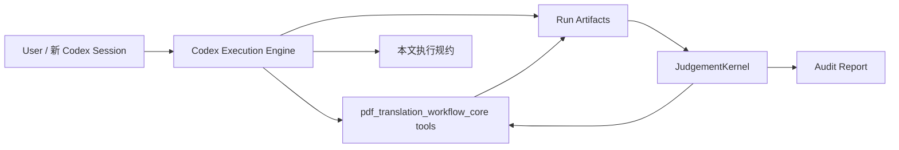
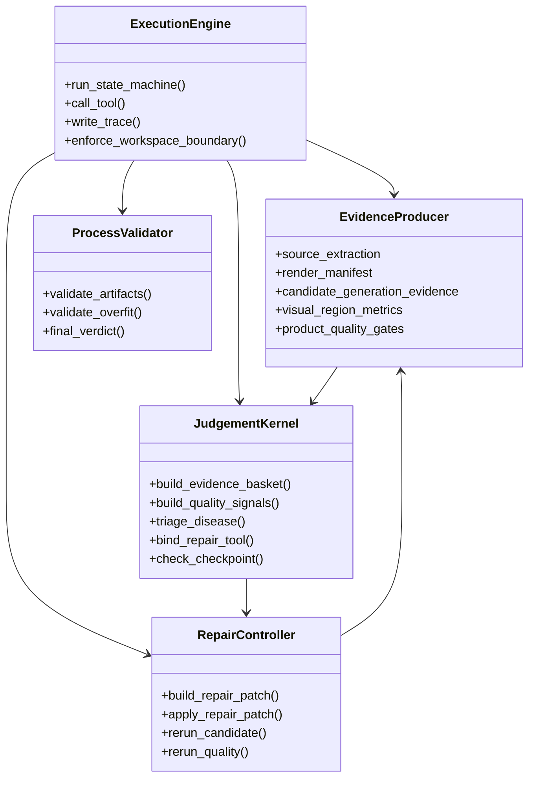
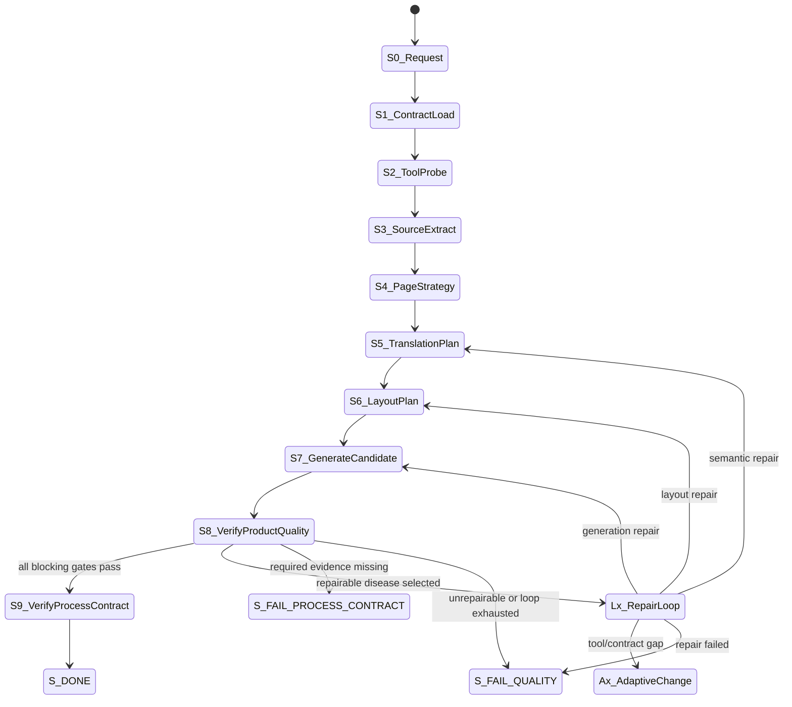
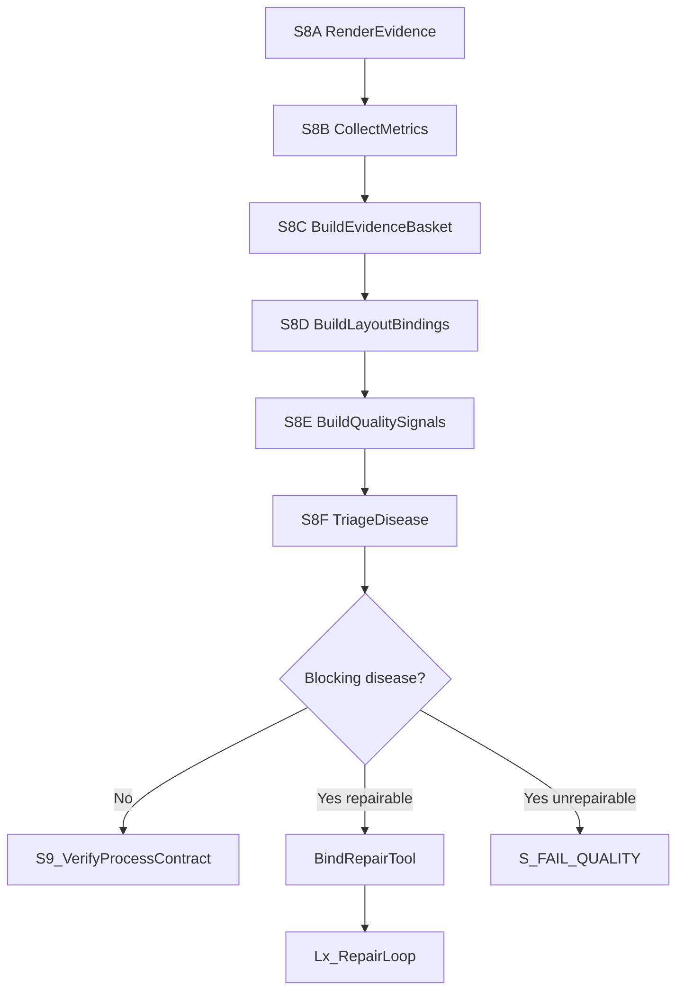
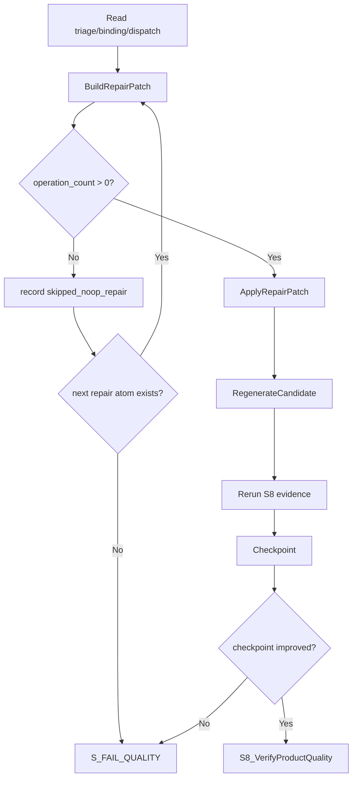

# PDF 语义翻译回填：V4 研判机制融合设计

版本：v0.1  
日期：2026-07-09  
状态：设计草案，可用于下一轮最小闭环验证  
适用范围：`pdf_translation_workflow_core` 的流程、工具分类、质量判断、修复分发和 Codex 执行规约

## 1. 设计目的

本文解决一个具体问题：

> 现有 `pdf_translation_workflow_core` 已经有不少可用工具，Codex 本身也可以作为强执行引擎，但缺少一套稳定规矩，导致质量判断、修复分发、loop 验收和防过拟合边界容易散落在 prompt、工具和临时 round 里。

因此本文不主张重造工具，也不主张整体搬入 V4，而是复用 V4 的研判机制和思想，把现有 core 工具分类成可调度的 Module，并在 `S8_VerifyProductQuality` 与 `Lx_RepairLoop` 内部引入一个最小 `JudgementKernel`。

目标是先验证判断链是否成立：

```text
source/candidate evidence
  -> EvidenceBasket
  -> QualitySignal
  -> TriageResult
  -> BindingResult
  -> DispatchDecision
  -> RepairPatch
  -> CheckpointResult
  -> S8 rejudge
```

不是先追求整份 PDF 一次性完美。

## 2. 实盘依据

本设计只基于已在磁盘上核查过的事实。

### 2.1 当前 core 已有工具

`pdf_translation_workflow_core\tools` 当前包含以下主要工具：

| 分类 | 已有工具 | 已核查契约 |
|---|---|---|
| 执行器 | `run_semantic_product_quality_round.py` | 文件头声明 `tool_name`、`input_contract`、`output_contract`；CLI 有 `--round-id`、`--source-dir`、`--semantic-dir`、`--input-dir`、`--output-dir`、`--report-dir`、`--max-repair-loops` |
| 源证据 | `probes\extract_pdf_structure.py` | 输出 pages、text lines、bbox、fonts、drawings、image counts |
| 渲染 | `renderers\render_pdf.py`、`renderers\render_source_output_crop.py` | 输出 PNG 和 render/crop manifest |
| 翻译批次 | `planners\build_translation_batch_manifest.py`、`generators\materialize_d2_translation_batches.py`、`generators\assemble_semantic_translations.py` | 输出 batch manifest、prompt/model output、semantic translations |
| 布局规划 | `planners\build_layout_policy.py`、`planners\build_role_plan.py`、`planners\build_layout_plan.py` | 输出 layout policy、role plan、layout plan |
| 候选生成 | `generators\generate_semantic_backfill.py` | 输出 candidate PDF、candidate generation evidence、translations、layout evidence |
| 质量采集 | `validators\collect_visual_region_metrics.py`、`validators\write_visual_adjudication.py`、`validators\evaluate_pdf_quality.py` | 输出 visual metrics、visual adjudication、product quality gates |
| 修复规划 | `repairs\plan_visual_region_repairs.py`、`repairs\build_repair_patch.py`、`repairs\apply_repair_patch.py`、`repairs\repair_policy_patch.py` | 输出 visual repair plan、repair patch、repaired layout policy |
| 过程校验 | `validators\validate_workspace_boundary.py`、`validators\validate_process_artifacts.py`、`validators\scan_core_overfit.py` | 输出边界、流程、反过拟合报告 |

结论：工具基本具备。当前主要缺口不是“工具数量”，而是“工具之间的判断规约和深 Interface”。

### 2.2 当前标准流程已有基础

`docs\业务流程\PDF_语义翻译回填_标准流程设计.md` 已经写入：

| 能力 | 位置 | 已有内容 |
|---|---|---|
| S8 产品质量验证 | 第 4 章状态机、S8 行 | 候选渲染、块级视觉指标、视觉修复计划、视觉裁决和机器质量门禁 |
| Lx 修复循环 | 第 4 章状态机、Lx 行 | 对阻塞失败执行一次修复循环 |
| 多研判融合 | `8.2 多研判融合算法` | 已声明 S8 不是单一截图判断 |
| loop 完整性 | `9. 修复循环` | 已要求修复后重新生成、重新采集、重新裁决 |
| Round22 影子接口 | 文末 Phase 1 | 已开始引入 role/layout plan 影子接口 |

缺口：当前文档把大量 gate、repair atom、prompt 约束和工具调用揉在一个长流程里，新 Codex 很难判断“证据是什么、病因是什么、工具是什么、验收是什么”。

### 2.3 V4 可复用思想

已核查的 V4 代码提供了以下思想：

| V4 能力 | 实盘锚点 | 复用方式 |
|---|---|---|
| `QualitySignal` | `orchestrator\models.py` 中立质量信号 | 把 core 的 gate failure 统一转成中立信号 |
| `LayoutBinding` | `orchestrator\models.py` 源/候选区域缝合 | 把 source bbox、candidate bbox、role、relation 做成显式绑定 |
| `TriageRequest` | `orchestrator\models.py` 选病输入 | Codex/模型只在候选 disease 中做选择 |
| `BindingRequest` | `orchestrator\models.py` 工具绑定输入 | Codex/模型只能在工具可调参数口内裁决 |
| `ToolParamSpec` | 区分 `repair_knob` 与 `detection_fact` | 检测事实不能让模型修改，只能读；repair knob 才能调 |
| `DISPATCH_TABLE` | `dispatch\table.py` disease -> tool | repair 工具由表绑定，不由 Codex 即兴选择 |
| `CHECKPOINT_CONTRACTS` | `dispatch\table.py` tool -> success fields | 修复后必须按 checkpoint 验收 |
| `VisualContract` | `evaluation\visual_contract.py` 源/候选视觉合同 | 候选不是追 bbox，而是追源文视觉角色和比例关系 |

复用边界：不复制 V4 目录和实现，不把 V4 的实验 helper 直接并入 core。只迁移判断结构和规约。

## 3. 核心设计判断

### 3.1 Codex 是执行引擎，不是自由裁判

Codex 的职责：

1. 读取当前 run 的证据 artifact。
2. 调用登记在 core 中的工具。
3. 按本文状态机和判断表产物化决策。
4. 把所有判断写成 JSON/JSONL/Markdown 报告。
5. 遇到工具或契约缺口时进入 `Ax_AdaptiveChange`，不能静默绕过。

Codex 不允许：

1. 跳过证据直接凭截图印象裁决。
2. 在 core 中写入特定 PDF 文件名、页码、股票代码、样本文本、绝对坐标或已知颜色。
3. 因为某个 gate 不好修就重翻译掩盖布局问题。
4. 绕过 `RepairPatch` 直接改 layout policy 或 generator。
5. 只生成 repair plan 就声称 loop 已执行。

### 3.2 工具是 Module，判断链是 Interface

现有工具多数已经可用。下一步不是继续堆工具，而是定义这些 Module 之间的 Interface。

```text
Tool Module:
  extract_pdf_structure.py
  build_layout_policy.py
  generate_semantic_backfill.py
  collect_visual_region_metrics.py
  evaluate_pdf_quality.py
  build_repair_patch.py

Judgement Interface:
  evidence_basket.json
  layout_bindings.json
  quality_signals.json
  triage_result.json
  binding_result.json
  dispatch_decision.json
  checkpoint_result.json
```

Leverage：新 PDF 到来时，Codex 只要重新填这些 Interface，不需要重新发明判断逻辑。  
Locality：质量问题的归因和修复分发集中在 JudgementKernel，不散落到 generator、prompt、临时脚本。

## 4. 系统上下文



约束：

1. `Design` 是执行规约，不是建议。
2. `Core tools` 是工具事实来源。
3. `Artifacts` 是裁决事实来源。
4. `JudgementKernel` 只读事实、输出中立判断和工具绑定。
5. `Report` 必须记录每次判断、每个工具调用、每次 loop 结果。

## 5. Block Definition Diagram



## 6. Tool Module 分类

### 6.1 EvidenceProducer

职责：只产事实，不做修复决策。

| 工具 | 输入 | 输出 | 备注 |
|---|---|---|---|
| `extract_pdf_structure.py` | source PDF | `source_extraction.json` | 源文本、bbox、字体、绘图对象、图片数量 |
| `render_pdf.py` | PDF | render PNG + manifest | 源/候选都要渲染 |
| `render_source_output_crop.py` | source/candidate/crop | crop pair | 只为局部裁决提供证据 |
| `collect_visual_region_metrics.py` | source/candidate/generation evidence | `visual_region_metrics.json` | 块级视觉指标、role gates、crop evidence |
| `evaluate_pdf_quality.py` | source/candidate/evidence | `product_quality_gates.json` | 产品质量 gate |

规则：EvidenceProducer 不允许修改 layout policy，不允许选择 repair atom。

### 6.2 PlanProducer

职责：规划布局，不判断产品成功。

| 工具 | 输出 | 规则 |
|---|---|---|
| `build_layout_policy.py` | `layout_policy.json` | 参数必须来自源证据、语言方向、通用 profile，不得来自样本文档身份 |
| `build_role_plan.py` | `role_plan.json` | 给每组文本分配 role、source rect、target text |
| `build_layout_plan.py` | `layout_plan.json` | 给 generator 使用的目标 rect、erase rect、draw mode、font profile |

### 6.3 CandidateGenerator

职责：按计划生成候选，不自行裁决是否美观。

| 工具 | 输出 | 规则 |
|---|---|---|
| `generate_semantic_backfill.py` | candidate PDF、generation evidence | 必须消费 `layout_policy.json`，有 `layout_plan.json` 时必须优先消费 |

### 6.4 RepairAdapter

职责：把 JudgementKernel 输出的 repair intent 变成可执行 policy patch。

| 工具 | 输出 | 规则 |
|---|---|---|
| `plan_visual_region_repairs.py` | `visual_repair_plan.json` | 只消费 visual metrics，给出初步 repair plan |
| `build_repair_patch.py` | `repair_patch_<n>.json` | 必须有 selected failure、repair atom、operation_count |
| `apply_repair_patch.py` | repaired layout policy | 只改 run-local policy |
| `repair_policy_patch.py` | patch operations | 兼容入口，不得绕过 patch 记录 |

## 7. JudgementKernel Interface

### 7.1 EvidenceBasket

用途：把 S8 需要的所有证据聚合成一个只读篮子，供 Codex/模型裁决。

最小 schema：

```json
{
  "schema_version": "evidence_basket.v1",
  "case_id": "string",
  "source_pdf": "path",
  "candidate_pdf": "path",
  "artifacts": {
    "source_extraction": "path",
    "candidate_generation_evidence": "path",
    "render_manifest": "path",
    "visual_region_metrics": "path",
    "visual_repair_plan": "path",
    "visual_adjudication": "path",
    "product_quality_gates": "path"
  },
  "artifact_presence": {
    "source_extraction": "PASS|FAIL",
    "visual_region_metrics": "PASS|FAIL",
    "product_quality_gates": "PASS|FAIL"
  }
}
```

失败规则：

1. 必填 artifact 缺失 -> `S_FAIL_PROCESS_CONTRACT`。
2. artifact 存在但无法解析 -> `S_FAIL_PROCESS_CONTRACT`。
3. artifact 存在且质量失败 -> 进入 `QualitySignal` 生成，不直接失败。

### 7.2 LayoutBinding

用途：把源文本区域与候选插入区域绑定，避免只看孤立 bbox。

最小 schema：

```json
{
  "schema_version": "layout_bindings.v1",
  "bindings": [
    {
      "unit_id": "string",
      "page_number": 1,
      "role": "title|body|table|legend|metric|sidebar|footnote|image_overlay|unknown",
      "source_bbox": [0, 0, 0, 0],
      "candidate_bbox": [0, 0, 0, 0],
      "relation": "same_role|expanded_flow|constrained_slot|missing|overlap_conflict",
      "evidence_refs": ["visual_region_metrics:..."]
    }
  ]
}
```

规则：

1. `source_bbox` 是证据，不是强制目标。
2. `candidate_bbox` 可以扩展，但必须保持 role similarity、阅读顺序和结构完整性。
3. 正文和流式区域允许重排；表格、图例、矩阵、目录等 constrained slot 默认不允许自由扩展。

### 7.3 QualitySignal

用途：把各种 gate failure 转成中立质量信号。

最小 schema：

```json
{
  "schema_version": "quality_signals.v1",
  "signals": [
    {
      "signal_id": "string",
      "axis": "layout|typography|content|background|structure|process",
      "defect_type": "local_text_overlap|font_size_regression|background_residue|table_integrity_regression|semantic_missing|...",
      "severity": "blocking|warning|info",
      "repairability": "repairable|unrepairable|needs_adaptive_change",
      "unit_ids": ["string"],
      "evidence_ids": ["string"],
      "source": "rule|visual_adjudication|product_quality|codex_review",
      "numeric_evidence": {}
    }
  ]
}
```

来源映射：

| 输入 | 转成 QualitySignal |
|---|---|
| `product_quality_gates.gates[*].status=FAIL` | `source=product_quality` |
| `visual_region_metrics.role_gates[*].status=fail` | `source=rule` |
| `visual_adjudication.dimensions[*].verdict=FAIL` | `source=visual_adjudication` |
| Codex 人工复核发现明显问题 | `source=codex_review`，必须附 crop/render 证据 |

规则：

1. 一个失败可以生成多个 signal。
2. 多个 signal 可以指向同一个 disease。
3. 没有 evidence ref 的 signal 不得进入 repair。

### 7.4 TriageResult

用途：选择一个主 disease。

最小 schema：

```json
{
  "schema_version": "triage_result.v1",
  "selected_disease": "l2_cross_slot_overlap",
  "selected_axis": "layout",
  "primary_signal_ids": ["signal_001"],
  "secondary_signal_ids": [],
  "rejected_diseases": [
    {
      "disease": "l2_font_size_regression",
      "reason": "font issue is caused by overlap, not primary root cause"
    }
  ],
  "confidence": 0.0,
  "next_state": "Lx_RepairLoop|S_FAIL_QUALITY|Ax_AdaptiveChange"
}
```

Codex/模型裁决边界：

1. 只能从候选 disease 表中选择。
2. 不能直接发明工具。
3. 不能把 layout disease 伪装成 translation disease，除非 semantic validation 证据明确缺译或误译。

### 7.5 BindingResult

用途：把 disease 绑定到 repair atom 和可调参数。

最小 schema：

```json
{
  "schema_version": "binding_result.v1",
  "disease": "l2_cross_slot_overlap",
  "repair_atom": "region_collision_layout_repair",
  "target_state": "S6_LayoutPlan",
  "target_scope": {
    "pages": [1],
    "unit_ids": ["unit_001"]
  },
  "repair_knobs": {},
  "detection_facts_used": ["overlap_ratio", "source_role", "candidate_bbox"],
  "forbidden_changes": ["semantic_translation_text", "source_pdf", "global_generator_constants"]
}
```

规则：

1. `detection_facts_used` 只能读，不能调。
2. `repair_knobs` 必须来自 tool spec。
3. 如果没有可执行 repair atom，进入 `S_FAIL_QUALITY` 或 `Ax_AdaptiveChange`，不能假装修复。

### 7.6 DispatchDecision

用途：固定 disease 到工具，不让 Codex 即兴选择。

最小表：

| disease | repair_atom | target_state | core tool path | checkpoint |
|---|---|---|---|---|
| `l2_cross_slot_overlap` | `region_collision_layout_repair` | `S6_LayoutPlan` | `build_repair_patch.py -> apply_repair_patch.py` | overlap pair count / overlap area 下降 |
| `l2_font_size_regression` | `font_size_and_region_density_rebalance` | `S6_LayoutPlan` | `build_repair_patch.py -> apply_repair_patch.py` | source-relative font ratio 改善且无新增 overlap |
| `l2_background_residue` | `background_cover_strategy_repair` | `S7_GenerateCandidate` | generator policy repair | 背景 delta 下降且无文字丢失 |
| `l2_table_integrity_regression` | `constrained_table_layout_repair` | `S6_LayoutPlan` | layout policy repair | table cell count/order/line integrity 不退化 |
| `p1_translation_segment_missing` | `patch_missing_segments` | `S5_TranslationPlan` | translation batch repair | missing unit count 下降 |

第一轮最小验证只要求实现或模拟一个 disease：`l2_cross_slot_overlap`。

### 7.7 CheckpointResult

用途：修复后按 disease-specific checkpoint 验收。

最小 schema：

```json
{
  "schema_version": "checkpoint_result.v1",
  "disease": "l2_cross_slot_overlap",
  "repair_atom": "region_collision_layout_repair",
  "before": {
    "overlap_pair_count": 10,
    "max_overlap_ratio": 0.42
  },
  "after": {
    "overlap_pair_count": 3,
    "max_overlap_ratio": 0.12
  },
  "checkpoint_verdict": "PASS|FAIL|PARTIAL",
  "regression_checks": {
    "table_integrity_regression": "PASS|FAIL|NOT_APPLICABLE",
    "background_residue_regression": "PASS|FAIL|NOT_APPLICABLE",
    "semantic_coverage_regression": "PASS|FAIL|NOT_APPLICABLE"
  },
  "next_state": "S8_VerifyProductQuality|S_FAIL_QUALITY|Ax_AdaptiveChange"
}
```

规则：

1. checkpoint 只能比较修复目标和已声明的退化检查。
2. checkpoint PASS 不等于整页质量 PASS。
3. checkpoint FAIL 且 loop 未耗尽，可以继续 Lx；重复同类失败无改善则 `S_FAIL_QUALITY`。

## 8. 主状态机改造

顶层 S3-S9 不大改，只把 S8 和 Lx 变成可审计复合状态。



## 9. S8 内部活动流



每步必须落盘：

| 子步骤 | 输出 |
|---|---|
| S8A | `candidate_render_manifest.json` |
| S8B | `visual_region_metrics.json` |
| S8C | `evidence_basket.json` |
| S8D | `layout_bindings.json` |
| S8E | `quality_signals.json` |
| S8F | `triage_result.json` |
| S8H | `binding_result.json`、`dispatch_decision.json` |

## 10. Lx 内部活动流



每次 loop 必须落盘：

| 文件 | 用途 |
|---|---|
| `repair_loop_<n>.json` | loop 主记录 |
| `repair_patch_<n>.json` | patch 操作 |
| `layout_policy.repair<n>.json` | run-local 修复后 policy |
| `candidate.repair<n>.pdf` | 修复候选 |
| `visual_region_metrics.repair<n>.json` | 修后视觉指标 |
| `product_quality_gates.repair<n>.json` | 修后质量 gate |
| `checkpoint_result.repair<n>.json` | disease-specific 修复验收 |

## 11. 大模型/Codex 裁决边界

### 11.1 不能交给模型裁决的内容

| 内容 | 原因 |
|---|---|
| 文件是否存在 | 工具事实，直接检查 |
| bbox、字体、颜色、图片数量 | 工具事实，来自抽取/渲染 |
| repair tool 是否存在 | 由 dispatch 表决定 |
| workspace boundary | 工具事实，必须 validator |
| 是否写入 core | 由流程规约决定，不由模型临时决定 |

### 11.2 可以交给模型/Codex 研判的内容

| 研判 | 输入 | 输出 |
|---|---|---|
| 质量问题主因 | `quality_signals.json`、crop/render evidence | `triage_result.json` |
| 多失败优先级 | blocking signals、budget、loop history | selected primary disease |
| repair knob 取值 | `binding_request` 中明确暴露的 repair knobs | `binding_result.repair_knobs` |
| 不可修原因 | 工具缺口、checkpoint 无改善、预算耗尽 | `unrepairable_reason` |

### 11.3 提示词模板要求

未来 prompt 必须是槽位化模板，不允许自由写判断任务。

最小槽位：

```json
{
  "role": "judge",
  "task": "triage_disease",
  "allowed_diseases": [],
  "evidence_basket_ref": "path",
  "quality_signals_ref": "path",
  "layout_bindings_ref": "path",
  "budget_state": {},
  "required_output_schema": "triage_result.v1",
  "forbidden_actions": [
    "invent_tool",
    "change_translation_without_semantic_failure",
    "use_sample_identity",
    "ignore_missing_evidence"
  ]
}
```

## 12. Gate 到 Disease 的最小映射

| gate / signal | disease | target state | repair family |
|---|---|---|---|
| `insertion_collision`、`local_text_overlap` | `l2_cross_slot_overlap` | S6 | region/layout reflow |
| `source_relative_font_floor`、`font_hierarchy_ratio` | `l2_font_size_regression` | S6 | font/density rebalance |
| `background_cover_metrics.status=fail`、`text_image_background_delta` | `l2_background_residue` | S7 | erase/background repair |
| `table_integrity`、`matrix_diagram_integrity` | `l2_table_integrity_regression` | S6 | constrained table repair |
| `semantic_coverage` missing units | `p1_translation_segment_missing` | S5 | patch missing translation |
| `semantic_omission` | `p1_translation_semantic_omission` | S5 | retranslate/backfill |
| process artifact missing | `p0_process_contract_missing` | fail | no repair until contract fixed |

注意：同一个页面可以有多个 gate fail，但每次 Lx 只能选择一个主 disease；其他失败进入 deferred list。

## 13. 防过拟合规则

允许来源：

1. 当前源 PDF 抽取出的 bbox、字体、颜色、行距、图片、绘图对象。
2. 当前候选 PDF 渲染和视觉指标。
3. 当前 source/candidate 差异比例。
4. 通用语言方向：`zh_to_en`、`en_to_zh`。
5. 通用角色：title、body、table、legend、metric、sidebar、footnote。

禁止来源：

1. PDF 文件名。
2. 固定页码。
3. 样本文本。
4. 股票代码、公司名等特定实体。
5. 固定绝对坐标。
6. 只为某张截图调出的颜色或字号。
7. 对照样本中的人工译文布局直接进入运行时。

参数规则：

1. 阈值应以 source-relative ratio 或 role-relative ratio 表达。
2. 绝对字号只能作为报告维度，除非 role 明确声明 `absolute_font_floor_blocks=true`。
3. 任何新增参数必须记录来源：`source_derived`、`language_profile`、`role_contract` 或 `repair_knob`。
4. core 中不得出现样本敏感 token；每次合入前运行 `scan_core_overfit.py`。

## 14. 最小验证闭环

### 14.1 验证目标

第一轮只验证一个 disease：

```text
l2_cross_slot_overlap
```

目标不是整份 PDF PASS，而是证明以下链路真实运行：

```text
visual overlap evidence
  -> quality_signals.json
  -> triage_result.selected_disease=l2_cross_slot_overlap
  -> binding_result.repair_atom=region_collision_layout_repair
  -> repair_patch operation_count > 0
  -> candidate regenerated
  -> checkpoint_result overlap metric improves
```

### 14.2 最小输入

选择一个已有失败样本，原则：

1. 有明显文字重叠或插入碰撞。
2. 不依赖人工对照样本参与运行。
3. 源 PDF 与候选 PDF 都可渲染。
4. 现有 core 工具可生成 `visual_region_metrics.json`。

### 14.3 最小输出

运行目录必须至少包含：

```text
source_extraction.json
layout_policy.json
role_plan.json
layout_plan.json
candidate_generation_evidence.json
candidate_render_manifest.json
visual_region_metrics.json
visual_repair_plan.json
visual_adjudication.json
product_quality_gates.json
evidence_basket.json
layout_bindings.json
quality_signals.json
triage_result.json
binding_result.json
dispatch_decision.json
repair_patch_0001.json
layout_policy.repair0001.json
candidate.repair0001.pdf
visual_region_metrics.repair0001.json
product_quality_gates.repair0001.json
checkpoint_result.repair0001.json
repair_loop_0001.json
process_validation.json
final_report.md
```

### 14.4 最小通过标准

```text
[ ] 所有必填 artifact 存在
[ ] quality_signals.json 至少有一个 blocking signal
[ ] triage_result.selected_disease 在 dispatch 表中
[ ] binding_result 只引用允许的 repair atom
[ ] repair_patch_0001.operation_count > 0
[ ] 修复后 candidate 重新生成
[ ] checkpoint_result 显示 overlap 指标下降
[ ] 修复未引入 table/background/semantic 明显退化
[ ] validate_process_artifacts PASS
[ ] scan_core_overfit PASS
```

如果 `product_quality_verdict` 仍为 FAIL，但 checkpoint 证明目标 disease 改善，本轮仍可算“判断机制最小闭环通过，产品质量未完全通过”。

## 15. 执行器规则

Codex 执行时必须按以下规则工作：

1. 先读设计文档和工具契约。
2. 建 run 目录并做 workspace boundary 预检。
3. 每调用一次工具，写 operation log。
4. 每做一次裁决，写 decision log。
5. 每次状态迁移，写 state trace。
6. 任何大模型/Codex 研判都必须写输入 artifact refs、提示词模板、输出 schema、裁决结果。
7. 如果某个工具缺失能力，不许临时在 prompt 里绕过，必须进入 `Ax_AdaptiveChange`。
8. 如果为了跑通做了小幅工具修改，必须写入 change manifest 和 final report。
9. 不得读取对照人工译文作为运行输入；对照样本只允许在运行结束后做结果性评估。

## 16. 与旧标准流程文档的关系

`docs\业务流程\PDF_语义翻译回填_标准流程设计.md` 仍是当前完整流程文档。

本文是对它的收敛版补充，职责如下：

| 文档 | 职责 |
|---|---|
| `PDF_语义翻译回填_标准流程设计.md` | 顶层状态机、目录约定、工具命令、历史固化规则 |
| 本文 | V4 研判机制融合、core 工具分类、S8/Lx 判断链、Codex 执行规约、最小验证闭环 |

如果最小闭环通过，应把本文中的稳定部分再回填到标准流程文档。

## 17. 下一步建议

1. 不先改全部 core。
2. 在 `pdf_translation_workflow_lab` 或新 run 目录做一个 `judgement_kernel_minimal` tracer。
3. 只接入 `l2_cross_slot_overlap`。
4. 运行一个 1-3 页样本。
5. 检查 artifact 链是否完整。
6. 若判断链成立，再把 `EvidenceBasket / QualitySignal / Triage / Binding / Dispatch / Checkpoint` 的 schema 和最小工具迁入 core。
7. 再回归 AIA、00005、临时测试 PDF。

## 18. 诚实失败定义

以下情况不是产品失败，而是设计仍需补齐：

| 情况 | 终态 |
|---|---|
| 证据 artifact 缺失 | `S_FAIL_PROCESS_CONTRACT` |
| signal 能生成但无 disease 可映射 | `Ax_AdaptiveChange` |
| disease 可识别但无 repair atom | `S_FAIL_QUALITY` 或 `Ax_AdaptiveChange` |
| repair patch 为 no-op | `S_FAIL_QUALITY`，除非有下一个非 no-op atom |
| checkpoint 无改善 | `S_FAIL_QUALITY` |
| 修复改善一个 gate 但引入更严重退化 | `S_FAIL_QUALITY` |
| 判断链完整但整页仍不完美 | 记录 `product_quality_verdict=FAIL`，但可标记 tracer 闭环是否 PASS |

## 19. 本文结论

可以按这个方向做最小验证。

核心不是“V4 替代 core”，也不是“round22 整体并入 core”，而是：

```text
core tools 继续负责真实 PDF 处理；
V4 思想提供判断机制；
Codex 作为执行引擎按规约调度；
JudgementKernel 把证据、疾病、工具和 checkpoint 串起来；
round/lab 负责新能力孵化；
通过最小闭环后再迁入 core。
```

这条路径的最小收益是：下一轮失败时，可以明确知道失败发生在证据、信号、分诊、绑定、dispatch、patch、checkpoint 还是产品质量，而不是继续靠肉眼猜“是不是工具不行”。
