# PDF 语义翻译回填：执行契约

版本：v1.0（草案）
状态：待评审
定位：**本文是 Codex 执行的唯一权威依据（normative）。** 它把"问题分级 → 用什么工具采证 → 在哪一层怎么裁决 → 派什么工具修 → 怎么回测"这条链路用图锁死。
与其他文档的关系：
- `pdf_translation_workflow_core/contracts/registry/*.json` = 本文所有 ID 的**机器可读真理源**。本文的每个 `problem_domain` / `failure_class` / `repair_family` / `repair_atom` / `tool` / `artifact` ID 都必须在注册表中存在，由 `validate_decision_graph.py` 强制校验。
- `pdf_translation_workflow_core/contracts/*.md`（8 份 core 契约）= 各工具、门禁、状态的详细字段契约，本文引用不复述。

---

## 0. 怎么读这份文档（给人和给 Codex）

本文用**多张图分层穿插**表达一条主链，每张图都只画一层，靠共享的 ID 注册表和产物依赖链彼此锁死。阅读顺序：

1. **§1 主脊图** —— PDF 从进到出的产物大状态机。先看这张，知道"现在这份 PDF 处于哪个状态"。
2. **§2 六段研判流水线** —— S8/Lx 内部把"发现问题→修好"拆成六段，每段产出一个文件，缺上一个就禁止下一个。这是"锁死"的真身。其中 **§2.5 修复记忆与终止条件** 是跨轮记忆层，专治"改不对→回滚→再改→再回滚"的死循环。
3. **§3 一级分诊树** —— 候选 PDF 出问题时，先归哪个问题域。不先归域不许选工具。
4. **§4 分级分类总表** —— 10 问题域 × 严重度 × 采证工具 × 判断机制 × 修复族 × 回跳状态。这是 Codex 查表的地方。
5. **§5 LayoutIssue 问题对象状态机** —— 单个问题从被发现到被关闭/失败的权威状态机（替代 v0.4 的 4 张漂移版本）。
6. **§6 每问题 trace 卡** —— 强制的人话输出格式，让你和 Codex 都能一眼看懂"这个问题是什么、为什么这么判、修没修好"。
7. **§7 骨架状态（S0-S7、S9）** —— 非痛点状态，只锁边界不展开。
8. **§8 锁死机制与校验器** —— 说明这些图靠什么保持一致、不漂移。

> 术语约定：本文 `failure_class`、`repair_atom`、`tool`、`state` 一律用注册表里的**英文 ID**；问题域给中文 label 便于阅读，但 ID 是英文 kebab。凡本文出现的 ID，注册表里必有一条同名记录。

### 0.1 全局导航总图（"你在这里"）

下图是**图与图之间的跳转主干**：它不画状态细节，只回答一个问题——"我现在在哪张图，接下来该翻到哪张图"。每个方框是本文的一节（一张图），箭头上标注**触发跳转的条件**。Codex 执行时先在这张图上定位自己，再进入对应小节看细节图；每张细节图的正下方都挂了一张**「传送门」跳转表**（§1.1 / §2.4 / §3.3 / §5.4），把"当前节点 → 条件 → 跳到哪节 → 产出什么文件"写死。

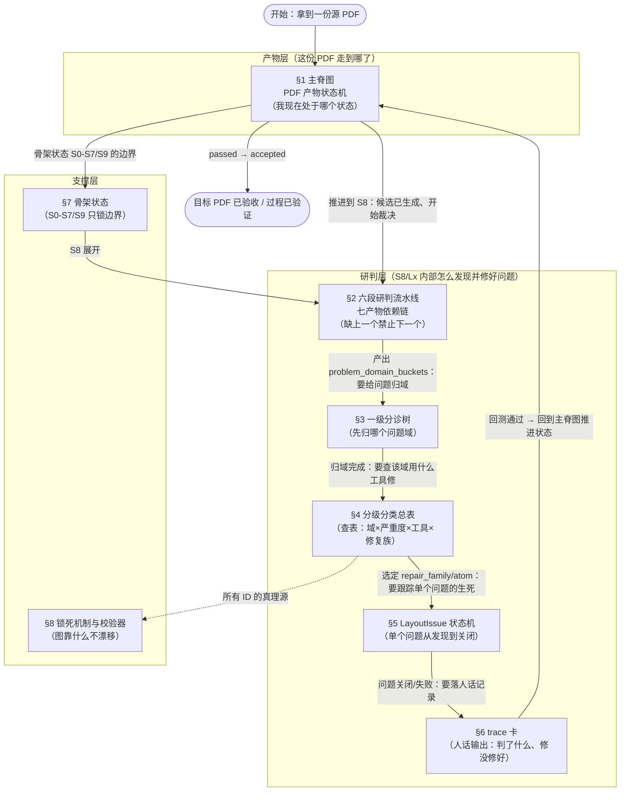

**怎么用这张图（Codex 强制流程）：**

1. 每次执行前，先在本图定位当前所在节（§几）。
2. 进入该节，看该节的**细节图**。
3. 看该节细节图**正下方的「传送门」子节**（§1.1 / §2.4 / §3.3 / §5.4），确认"当前节点 → 满足什么条件 → 跳到哪张图哪一节 → 该产出什么文件"。
4. 产出文件后，才允许按跳转表跳到下一节。**未产出规定文件不得跳转**（依赖链见 §2）。

> 术语：下文每张主要图的正下方都有一张 **「传送门」跳转表**（§1.1 主脊图、§2.4 六段流水线、§3.3 分诊树、§5.4 问题对象状态机），列四列——`当前节点/状态`、`触发/放行条件`、`跳到哪节（图）`、`该产出的文件`。这是把多张图"串起来"的唯一机制；图内箭头只表达图内逻辑，跨图跳转一律以跳转表为准。

---

## 1. 主脊图：PDF 产物状态机

这是最外层的一张图，回答"这份 PDF 现在处于什么状态、能往哪走"。状态是**PDF 产物的事实**（源可解析、候选已生成、候选存在阻塞问题…），不是执行动作。执行动作（提取、翻译、回填、裁决、修复）发生在**状态之间的边**上，边上标注了主责状态 `Sx` 和用到的关键工具。

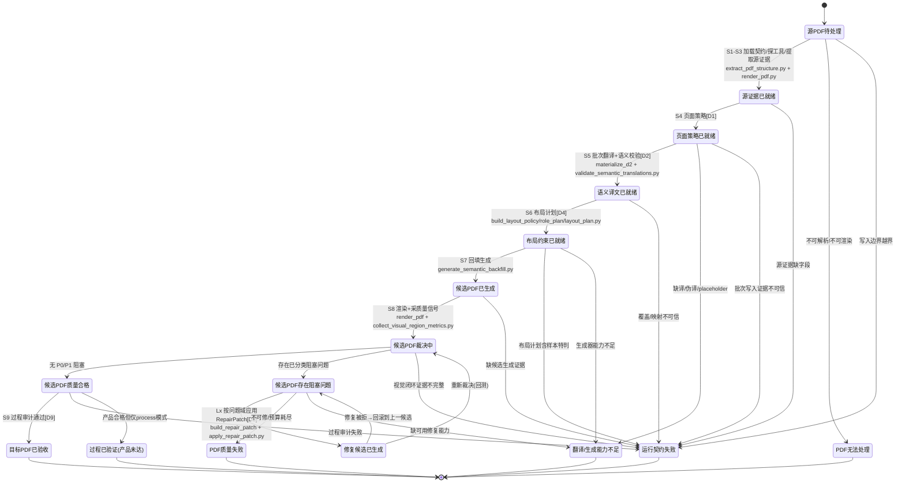

**主脊图的三条硬规则（Codex 不得违反）：**

1. **状态不能跳级。** 必须逐边推进；每条边的 `entry_condition` 见 §7 与 core `state_machine.md`。想进 `候选PDF裁决中`，必须先有 `候选PDF已生成` 及其生成证据。
2. **四个失败终态语义不可互换**（对应 core 四个 `S_FAIL_*`）：
   - `PDF无法处理` = 源 PDF 读不了（tooling）
   - `翻译/生成能力不足` = 缺真实翻译/生成/修复能力（capability）——**缺译绝不许降级成 placeholder 混过去**
   - `PDF质量失败` = 有候选但质量修不好或预算耗尽（quality）
   - `运行契约失败` = 证据链/写入边界/反过拟合不可信（process contract）
3. **产品 verdict 与过程 verdict 分开记。** `目标PDF已验收` 要求产品+过程都过；`过程已验证(产品未达)` 是 process 模式下的合法成功终态。禁止用一个 `final=PASS` 盖掉两者（承 core `run_modes.md`）。

> 这张图只管"PDF 走到哪"。**候选 PDF 一旦进入 `候选PDF存在阻塞问题`，真正的研判发生在 §2 的六段流水线里**——那才是 Codex 最吃力、最需要锁死的地方。

#### 🧭 §1 跳转表（Codex 站在主脊图任一状态时，查这张表决定下一跳）

> 读法：找到"我现在在哪个状态"这一行 → 看"触发条件"是否满足 → 按"跳到哪"打开对应图/节 → 把"必须产出"的文件落盘后，才允许沿边推进。**没有产出文件，不许跳。**

| 我现在在（状态） | 触发条件 | 跳到哪（图·节） | 落地这一步必须产出的文件 |
|---|---|---|---|
| 源PDF待处理 | 拿到源 PDF | §7 骨架 S1-S3 → 回本图 `源证据已就绪` | `pdf_structure.json`、`render/*.png` |
| 源证据已就绪 | 源证据字段齐 | §7 骨架 S4（页面策略[D1]） | `page_strategy.json (D1)` |
| 页面策略已就绪 | D1 就绪 | §7 骨架 S5（翻译+语义校验[D2]） | `translations.json (D2)`、`semantic_validation.json` |
| 语义译文已就绪 | D2 通过语义校验 | §7 骨架 S6（布局计划[D4]） | `layout_plan.json (D4)` |
| 布局约束已就绪 | D4 无样本特判 | §7 骨架 S7（回填生成） | 候选 `candidate.pdf`、生成证据 |
| 候选PDF已生成 | 有候选+生成证据 | **§2.1 流水线①证据篮** 开始采证 | `evidence_basket.json`（①） |
| 候选PDF裁决中 | 证据篮就绪 | **§2 六段流水线** 全程（②→⑦） | 见 §2.1 七产物 |
| **候选PDF存在阻塞问题** | 裁决出 P0/P1 阻塞 | **§3 一级分诊树** → 再回 **§2.1 ④分诊** | `problem_domain_buckets.json`（③） |
| 修复候选已生成 | RepairPatch 已应用 | **§2.1 ⑦回测** → 重回 `候选PDF裁决中` | `repair_acceptance.json`（⑦） |
| 候选PDF质量合格 | 无 P0/P1 | §7 骨架 S9（过程审计[D9]） | `process_audit.json (D9)` |
| 任一失败终态 | 命中失败判据 | 本图三条硬规则 §1 + core `run_modes.md` | 对应 `S_FAIL_*` 记录 |

> 单个问题对象在 `候选PDF存在阻塞问题` 内部的生老病死（发现→修→关/失败），走的是 **§5 LayoutIssue 状态机**；主脊图这一层只记"整份候选还有没有阻塞"。

---

## 2. 六段研判流水线（S8/Lx 内核）

> 这是全文最重要的一节。候选 PDF 进入"存在阻塞问题"后，**所有研判和修复都必须走这条流水线**，不许一个大提示词直接从"看了一眼截图"跳到"改了布局"。
>
> 核心思想：把"发现问题 → 修好"拆成**七个产物、六段动作**。每段的产出是下一段的唯一合法输入，**缺上一段的产物，物理上禁止进入下一段**。这就是"锁死"——不是靠嘴约束，是靠文件依赖链。

### 2.1 七产物依赖链（锁的真身）


每个产物是一道闸门。**没有前一个文件，就不许产出后一个文件**：

| 序 | 产物（中文 / 文件名） | 谁产出（工具/裁决） | 这一段只能做什么 | 缺了它会怎样 |
|---|---|---|---|---|
| ① | 证据篮 `evidence_basket.json` | 采证工具汇总（见 §4 采证列） | 把源/候选/渲染/生成证据放进同一可重放事实集 | 无证据 → `运行契约失败` |
| ② | 信号账本 `quality_signal_ledger.json` | `S8A 信号归一`（收集器 + 归一） | 把每个 gate/区域指标标准化成一条 `QualitySignal`，标 `problem_domain`/`failure_class`/`severity`/证据引用 | 无账本 → 禁止分诊 |
| ③ | 问题域桶 `problem_domain_buckets.json` | `S8A` 归类 | 把信号按 10 个问题域聚合，标每域阻塞数、上下游关系 | 无桶 → 禁止选主问题 |
| ④ | 分诊结果 `triage_result.json` | `S8B 分诊`[D8 一部分] | 只选**一个**主 `failure_class`、定严重度、列 deferred、判是否补证 | 无分诊 → 禁止分发 |
| ⑤ | 分发结果 `dispatch_result.json` | `S8C 分发`（查静态注册表） | 只把 `failure_class` 映到 `repair_family` + 目标状态 + 允许 operation 类型 | 无分发 → 禁止绑定 |
| ⑥ | 修复补丁 `repair_patch_<n>.json` | `S8C 绑定`（`build_repair_patch.py`） | 只在已选族的参数口内绑定 operation；`operation_count>0` 才算数 | 无补丁 → 禁止改布局/重生成 |
| ⑦ | 回测账本 `repair_acceptance.json` | `Lx 回测`（重生成+重采证） | 按域对比修前/修后，出接受/回滚/继续 | 无回测 → 不算"修过"，`运行契约失败` |

> **当前 core 的缺口（实盘）**：现在只有一个扁平的 `quality_signals.json`（round24 里是 `{group_signals:1411, overlap_signals:70}`），**没有 ②信号账本、③问题域桶、⑤分发结果、⑦独立回测账本**。这正是 Codex "输出一堆 JSON 你看不懂"的根因——问题从没被归过域，`text_fit_overflow`、`cross_slot_overlap`、`font_size_regression` 全混在一个扁平 list 里。补齐这七个产物是让流程可读、可锁的前提。

### 2.2 六段的职责边界（每段只能做自己的事）

这张表是防止"一个大 prompt 什么都干"的核心。**每段的"禁止"列比"允许"列更重要。**

| 段 | 中文名 | 输入 | 输出 | ✅ 只允许判断 | ⛔ 禁止越权 |
|---|---|---|---|---|---|
| S8A | 信号归一 | 源证据、候选证据、渲染/裁剪图、生成账 | 信号账本② | 证据够不够、信号属于哪个原始 gate、归哪个域 | 选工具、改布局、推翻语义 |
| — | 问题域归类 | 信号账本② | 问题域桶③ | 按域聚合、标严重度、标上下游因果 | 携带 repair 参数 |
| S8B | 主问题分诊 | 问题域桶③、页面策略 | 分诊结果④ | 选**一个**主问题、定严重度、列 deferred、判是否补证 | 输出工具名/参数、直接修 |
| S8C | 修复分发 | 分诊结果④、**静态分发注册表** | 分发结果⑤ | `failure_class`→`repair_family`+目标状态 | 改判问题域、发明表外工具 |
| S8C | RepairPatch 绑定 | 分发结果⑤、当前 layout policy/plan、证据 | 修复补丁⑥ | 在已选族参数口内绑 operation | 改判 `failure_class`、跨族借工具 |
| Lx | 回测裁决 | 修前/修后 gate、修前/修后信号、patch 应用 | 回测账本⑦ | 接受/回滚/继续/失败 | 只看目标指标忽略硬负面、不重测就宣称成功 |

**三条铁律**（对应 v4 研判引擎的"分发表是 LLM 决策权边界栏"）：

1. **分诊只判"是什么病"，不判"用什么药"。** `triage_result` 里不许出现工具名、参数、几何数值。
2. **分发只能查静态注册表**（`repair_families.json` / `repair_atoms.json`），不许模型自由发明工具。表外病种 → `无可用修复能力`。
3. **绑定只调参数口，不改病种。** 不许把 `font_size_regression` 在绑定阶段改判成 `background_resample`。

### 2.4 传送门（六段流水线每段的出口指示牌）

> **Codex 站在流水线任一段，查这张表决定下一步去哪。** 每段只有"产出规定文件"才放行下一段；产不出就按"缺件时"列跳走，**不许跳段**。

| 当前在这段 | 满足什么条件放行 | 跳到哪张图·哪节 | 必须先产出什么文件 | 缺件时跳到哪 |
|---|---|---|---|---|
| ①证据篮采集 | 源/候选/渲染/生成证据齐全且可重放 | §2.1 → ②信号归一 | `evidence_basket.json` | 缺证据 → §1 `运行契约失败` |
| ②信号归一 | 每条指标标齐 `problem_domain`/`failure_class`/`severity`/证据引用 | §2.1 → ③问题域桶 | `quality_signal_ledger.json` | 无账本 → 禁止分诊，停在②补采（回①） |
| ③问题域桶 | 信号按 10 域聚合、标阻塞数与上下游 | §3 分诊树（归主问题域） | `problem_domain_buckets.json` | 无桶 → 禁止选主问题，回② |
| ④主问题分诊 | 只选一个主 `failure_class`、定严重度、列 deferred | §4 查该域小节 → 定采证/判断机制 | `triage_result.json` | 判为缺证 → 回①补采；判为流程/语义 → §1 对应失败终态 |
| ⑤修复分发 | 查 `repair_families.json` 映到 `repair_family`+目标状态 | §4 该域"修复族→atom"列 + §5 进入问题对象状态机 | `dispatch_result.json` | 表外病种/能力`missing` → §1 `翻译/生成能力不足` |
| ⑥补丁绑定 | 在已选族参数口内绑定 operation 且 `operation_count>0` | §5 状态机 `③待修复→④修复应用中` | `repair_patch_<n>.json` | 绑不出 operation → 回④改判或 deferred |
| ⑦回测裁决 | 双闸门：目标域改善 **且** 无硬负面回退 | 修好→§1 回主脊图 `重新裁决`；未修好→**先查 §2.5 记忆台账**，未命中终止条件才回 §2.1 ④ | `repair_acceptance.json` + 更新 `repair_memory_ledger.json` | 命中 §2.5 任一终止条件 → 发布**历史最优候选** + 走 `PDF质量失败`/`Ax`；预算耗尽 → §1 `PDF质量失败`；被拒 → 回滚到历史最优候选 |

> **读法**："跳到哪张图·哪节"是**下一个动作看哪里**；"必须先产出什么文件"是**本段不产出就物理禁止前进**的闸门。两列合起来 = §2.1 那条依赖链的可执行版。

---

## 2.5 修复记忆与终止条件（防死循环 / 防合法震荡）

> **这一节治的病**：候选被判 FAIL → 修 → 回测又 FAIL → 再修…… 如果每一轮都是"崭新的一轮、不记得上一轮试过什么"，Codex 会反复用同一个失败招数（round24 反复用 `vertical_flow_relayout` 就是这样），或者在"修好 A 弄坏 B、修好 B 又弄坏 A"之间**合法地无限震荡**——每一步双闸门都判"通过"，但整页永远收敛不到 0。
>
> **§2 的双闸门和 §5.3 只看"单个问题 + 单个 atom + 单轮"，看不到跨轮的转圈。** 要看见转圈，必须有一个**跨轮累积、永不在轮间清空**的记忆台账，外加"什么时候必须停手"的硬终止。本节把**记什么**和**下一轮怎么读、怎么判、怎么动**逐字段写死。

### 2.5.1 记忆载体：`repair_memory_ledger.json`（跨轮持久，永不清空）

现有 `repair_loop_<n>.json` 是**单轮**产物；本节新增一个**跨候选、跨轮累积**的台账 `repair_memory_ledger.json`，贯穿一份 PDF 的整个修复生命周期，**只追加、不在轮间清空**（除非换了新的源 PDF）。它是 §2.1 `⑦→④` 和 §5 `⑪→⑥` 两条回跳边的**唯一守卫依据**。

**台账三块，每个字段都标注"下一轮谁来读、读它判什么"：**

**A. 尝试记录 `attempts[]`（每次修复一条，按问题实例累积）**

| 字段 | 记什么 | **下一轮谁读·判什么** |
|---|---|---|
| `issue_key` | 问题实例主键 = `page:region_id:failure_class`（**不含坐标数值**，防过拟合） | 分诊时用它把"本问题"与历史对齐：同 key 才算"同一个问题的再次尝试" |
| `round` / `candidate_id` | 第几轮、作用在哪个候选上 | 计"这个问题已试过几轮"，喂给终止判据①②ᵍ |
| `repair_family` / `repair_atom` | 这次派了哪个族、哪个 atom | §5.3 判据：**同 issue_key 不许再选 attempts 里已 FAIL 过的同一 atom** |
| `params_digest` | 绑定参数的摘要（不是全量数值，是"扩框/压字/换列"等**操作类别+档位**） | 判"是不是换汤不换药"：同 atom 同 params_digest 再来一次 = 视为重试，禁止 |
| `delta_target` | 本次目标域阻塞数 修前→修后（如 溢出 135→2） | 判据③：闸1 有没有真改善 |
| `delta_regressions[]` | 本次**其它域**阻塞数变化（如 重叠 49→132） | 判据③：闸2 有没有硬负面回退；也是"震荡"的证据来源 |
| `verdict` | `accepted` / `rolled_back` / `capability_missing` | 决定这条是"成功经验"还是"失败黑名单" |
| `rollback_reason` | 回滚原因（闸2哪个域回退 / 预算 / 能力缺） | 决定下一步走"换 atom"还是"升级族"还是"补工具 Ax" |

**B. 状态签名历史 `signature_history[]`（每轮一条，抓合法震荡）**

| 字段 | 记什么 | **下一轮谁读·判什么** |
|---|---|---|
| `round` | 第几轮 | 定位 |
| `open_signature` | 当前**所有未关闭问题**的规范化签名（见 §2.5.2 的算法） | 终止判据②：**新签名 == 历史任一旧签名 → 判定在转圈，立即停** |
| `best_score` | 该轮候选的综合质量分（阻塞加权总数，越低越好） | 终止判据④：连续 M 轮 `best_score` 不再下降 → 停 |

**C. 最优候选指针 `best_candidate`（全局最好，不是最后一个）**

| 字段 | 记什么 | **下一轮/终止时谁读·判什么** |
|---|---|---|
| `candidate_id` | 迄今**综合分最低（最好）**的那个候选 | 任何终止都**发布这个**，不是发布"最后一次"那个可能更烂的候选 |
| `score` | 它的分 | 每轮回测后比一比：更好就更新指针；不更好不动 |
| `round` | 它出现在第几轮 | 配合判据④：距今超过 M 轮没被超越 → 说明到顶了，停 |

> **反过拟合红线（承 §3.2）**：`issue_key` 用 `page:region_id:failure_class`，`params_digest` 用**操作类别+档位**，**都不落具体坐标/字号数值**。记忆是为了"记住试过什么招、走到过什么状态"，不是为了给某一页某一坐标开特例。

### 2.5.2 状态签名怎么算（`open_signature`）

签名要"够稳、不误判"：同一个卡死状态必须算出同一个签名，轻微无关抖动不该改变它。规范化算法：

```
open_signature = hash( 排序后的 [ (problem_domain, severity, open_count) for 每个仍有 open 问题的域 ] )
```

- **只取域级计数向量**（每个域各严重度还剩几个 open），**不取具体坐标**——因为"转圈"的本质是"问题的域分布回到了老样子"，不是像素级复现。
- 例：`{geometry-layout: P1×2, text-loading: P1×1}` 与三轮前完全一致 → 判定震荡。
- 粒度默认取**域×严重度计数向量**（粗而稳）。若发现两个不同卡点被误判成同签名，再在 core 配置里升一档到"域×failure_class 计数"，**但不下探到坐标**。

### 2.5.3 下一轮的判断链：读台账 → 四个终止判据 → 决定动作

**每次准备走 `⑦→④`（§2.1）或 `⑪→⑥`（§5）回跳边之前，Codex 必须先按下面顺序查台账。命中任一终止条件 → 不许再跳，走对应终态。**

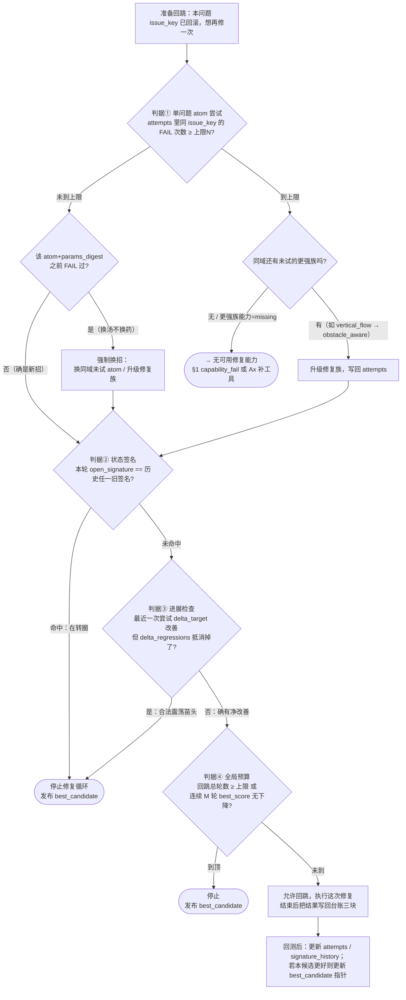

**四个终止判据（先到者停，缺一不可）：**

| # | 判据 | 读台账哪块 | 触发后动作 |
|---|---|---|---|
| ① | **单问题 atom 尝试上限**：同 `issue_key` 用同一 atom FAIL 次数达 N（默认 **N=2**，即最多试 2 次）；或同 atom+同 `params_digest` 重复 | `attempts[]` | 换同域未试 atom → 用尽则升级族 → 更强族 `missing` 则 → `capability_fail`/`Ax` |
| ② | **状态签名重复**：本轮 `open_signature` 命中 `signature_history` 里任一旧值 | `signature_history[]` | 判定在转圈，**立即停**，发布 `best_candidate` |
| ③ | **合法震荡检测**：本次 `delta_target` 有改善，但 `delta_regressions` 把总分抵消/反超（净分不降） | `attempts[]` 最近一条 | 停，发布 `best_candidate`（这种循环双闸门抓不到，只能靠台账抓） |
| ④ | **全局预算**：回跳总轮数达上限（默认 **8 轮**），或连续 **M=3** 轮 `best_score` 不再下降 | `signature_history[]` + `best_candidate` | 停，发布 `best_candidate` |

> **默认阈值（N=2 / 全局 8 轮 / M=3）先写死在这里做兜底，可被 core 配置覆盖**；但"必须存在上限、必须发布 best 而非 last"这两条是硬规则，不可关闭。

### 2.5.4 三条铁律（补在 §2.3 三条铁律之后）

4. **回跳必先查记忆。** 走任何一条回跳边（`⑦→④` / `⑪→⑥`）前，必须先读 `repair_memory_ledger.json` 跑完 §2.5.3 判断链；**未查台账直接重修 = 运行契约违规**。
5. **失败不许原地复现。** 同 `issue_key` 的同 `atom`+同 `params_digest` 不许出现第二次（§5.3 的可执行化）。想再试必须换 atom、换档位、或升级族。
6. **终止发布"历史最优"而非"最后一次"。** 任何终止（判据①-④）都发布 `best_candidate` 指针指向的候选；若全程无一候选达标，走 §1 `PDF质量失败`，但仍**保留 best 供人工介入**，绝不发布比 best 更差的最后候选。

---

## 3. 一级分诊树：先归问题域，再选工具

> 候选 PDF 出问题时，Codex 的**第一个动作不是选工具，是归问题域**。这张树规定了归域的**固定顺序**——顺序不能颠倒，因为上游问题会污染下游判断（证据不可信时谈美观没意义；缺译时谈排版是白费）。

### 3.1 分诊树（判断顺序不可颠倒）

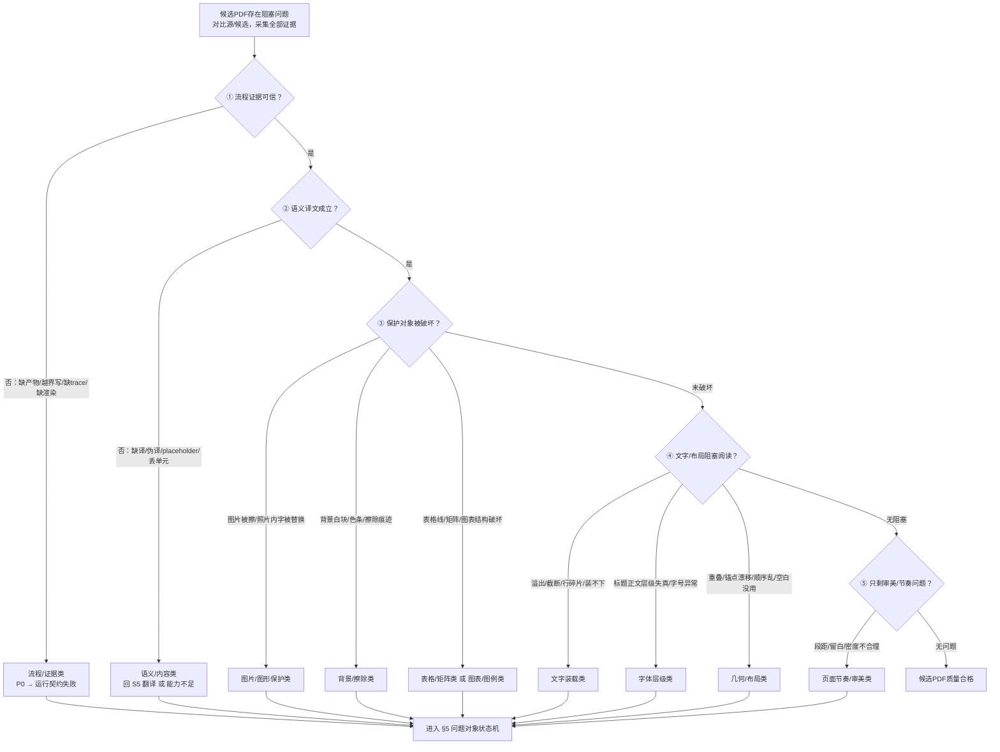

### 3.2 为什么顺序不能颠倒（因果优先级）

| 顺序 | 先判什么 | 为什么必须先判 | 判到了怎么走 |
|---|---|---|---|
| ① | 流程/证据可信否 | 证据不可信，后面任何视觉判断都是空中楼阁 | 直接 `运行契约失败`，**不做产品修复** |
| ② | 语义译文成立否 | 缺译是能力问题，不是排版问题；用布局修复掩盖缺译是错的 | 回 `S5 翻译` 或 `能力不足` |
| ③ | 保护对象破坏否 | 图片/表格/背景被破坏是硬负面，且常被普通文字修复**二次破坏** | 优先修保护对象，**排在普通文字前面** |
| ④ | 文字/布局阻塞否 | 大多数翻译回填的主战场；内部还要分上下游（见 §4.2） | 归入文字装载/字体层级/几何布局 |
| ⑤ | 仅审美节奏否 | 审美只能在硬问题清零后处理，否则修了也被硬问题盖掉 | 归入页面节奏类，或直接合格 |

> **反过拟合红线**：归域只能依据**当前运行的证据**（bbox、字号、颜色、渲染像素、生成账），**绝不许**因为"这个文件名/这一页/这个坐标特殊"就跳过分诊或改判。

### 3.3 传送门（分诊树每个落点 → 去 §4 哪个小节）

> **分诊树只负责把问题归到"哪个域"，归完立刻带着域名去 §4 查该域小节。** 这张表是分诊树叶子节点到 §4 小节的直达路由。

| 分诊树落点（问题域） | 去 §4 哪个小节查表 | 该域优先级 | 归到这里下一步做什么 |
|---|---|---|---|
| 流程/证据类 | §4.1 process-evidence | P0 阻断 | 不做产品修复，直接 §1 `运行契约失败` |
| 语义/内容类 | §4.2 semantic-content | P1 | 回 §1 `S5 翻译` 或 `翻译/生成能力不足` |
| 图片/图形保护类 | §4.3 image-graphic-protection | P2 保护 | 优先修，排在文字类前；查该域 veto |
| 背景/擦除类 | §4.4 background-erasure | P2 保护 | 同上，注意与文字修复的二次破坏 |
| 表格/矩阵类 | §4.5 table-matrix | P2 保护 | 查表格族能力状态再决定修/deferred |
| 图表/图例类 | §4.8 chart-legend | P2 保护 | 同表格类 |
| 文字装载类 | §4.6 text-loading | P3 主修 | 主战场；注意 §4.2 因果上游是否更该先修 |
| 字体层级类 | §4.7 font-hierarchy | P3 主修 | 查该族能力状态（多为 partial） |
| 几何/布局类 | §4.9 geometry-layout | P3 主修 | 重点看 `obstacle_aware_reflow` 能力缺口 |
| 页面节奏/审美类 | §4.10 page-rhythm | P4 审美 | 仅当 P0-P3 全清零才允许修 |

> **统一去向**：任一落点归域后都进 §5 问题对象状态机走"待分诊→待修复→修复→回测"生命周期；§4 提供的是该域**采什么证、怎么判、派什么修、修后接受条件**。

---

## 4. 分级分类总表（10 问题域主矩阵）

> 这是 Codex 查表的地方，也是全文最核心的"什么问题、用什么工具采证、怎么判、派什么工具修、修后怎么算数"。**每个问题域一个小节**，小节内固定六块：典型问题 / 严重度 / 采证（工具→字段） / 判断机制 / 修复族→atom（含能力状态） / 修后接受条件 + 硬负面 veto。
>
> **能力状态**三档，直接决定 Codex 该不该指望这个工具修好：
> - `full` = 有真实执行器，改 layout policy 并重生成，能真修。
> - `partial` = 只被规划/路由，无 policy 级执行器，**或有已知回退风险**（修了会把别的域弄坏）。
> - `missing` = 注册表里有名字，但 core 里没有任何工具实现，选它 = 直接进 `无可用修复能力`。
>
> 域按分诊优先级排序（§3）：0 流程 → 1 语义 → 2 保护对象（图片/背景/表格/图表）→ 3 文字/字体/几何 → 4 审美。**高优先级域未清空前，低优先级域只能 deferred。**

### 4.0 十域关系图：不是孤立的，是三种关系并存

> **这是回答"这些域之间是依赖还是孤立"的总图。** 答案：**既不是全独立，也不是全依赖**，而是三种关系同时成立。看这一张图就能明白 Codex 每一轮该修谁、为什么不能乱修。

**关系①——分诊优先级（纵向：谁先被选为主问题）**

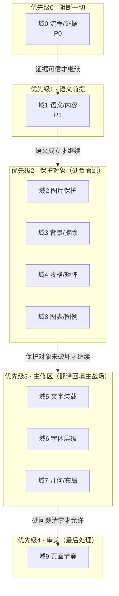

> **纵向规则**：本轮主问题**永远从当前最高未清空优先级里选**。高优先级域还有阻塞问题时，低优先级域的问题只能进 `deferred`，不许先修。这就是为什么"证据不可信时谈美观没意义、缺译时谈排版是白费"。

**关系②——因果上下游（横向：谁引发谁，只在主修区 P3 内部）**

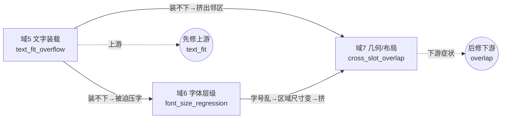

> **横向规则（因果优先级）**：P3 内部三个域**不是平级**，有明确上下游。`文字装载(text_fit)` 是**上游**——文字装不下，会被迫压小字号（引发域6）、或被挤进邻区（引发域7）。所以**同为 P3 时，先修 text_fit，overlap 多半是它的下游症状**。round24 的错误正是反过来先修下游 `cross_slot_overlap`。

**关系③——硬负面 veto（反向：修 A 会不会破坏 B）**

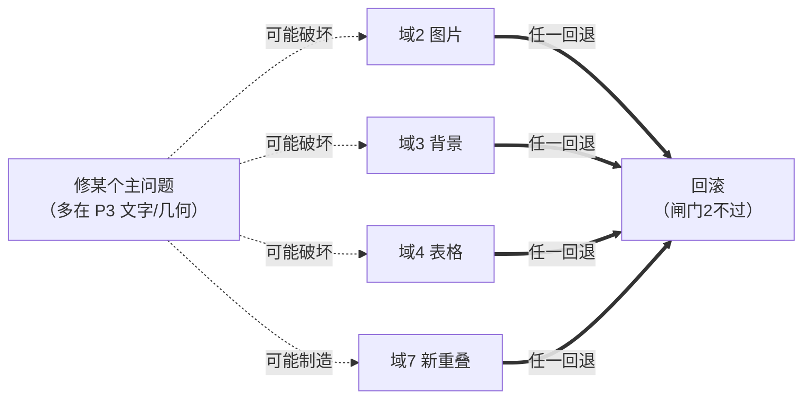

> **反向规则（回测双闸门，见 §2）**：修一个域的问题时，**必须回测其它域没有被二次破坏**。目标域改善（闸1）+ 保护域/几何域无回退（闸2），两个都过才接受。round25 就是修好了域5（溢出 9→0）却破坏了域7（重叠 70→78），闸2 不过 → 回滚。

**一句话总结三种关系：**

| 关系 | 方向 | 规则 | 违反的后果（实盘） |
|---|---|---|---|
| ① 分诊优先级 | 纵向 0→4 | 高优先级未清空，低优先级只能 deferred | 先修美观 → 硬问题盖掉白修 |
| ② 因果上下游 | 横向（仅P3内） | 先修上游 text_fit，overlap 多为下游 | round24 先修下游 overlap → 越修越糟 |
| ③ 硬负面 veto | 反向 | 修 A 不许破坏 B，双闸门回测 | round25 修好域5 破坏域7 → 回滚 |

> **所以：域与域既不是全独立（有①②的顺序依赖、有③的相互破坏），也不是全依赖（同优先级、无因果的域之间是并列的，如域2/3/4 三个保护对象之间无固定先后）。Codex 每一轮必须先按①定优先级、再按②在主修区内定上下游、修完按③回测——三步都不能跳。**

### 4.0.1 判断机制总览：哪些域靠规则判、哪些靠提示词判

> 你问的"哪个是规则判、哪个是提示词判、判什么、怎么修"——先看这张总览，再看每个域正下方的流程图。**核心原则：规则是硬判据，提示词只能在规则允许的范围内做质量/取舍裁决，绝不能推翻规则发现的硬问题。**

**图例（下文每张域流程图统一用这套记号）：**

- **`【规则】` 规则闸** = 确定性判据（schema、阈值、bbox 碰撞、覆盖率…），由工具算出，**模型不可翻案**。这是"证据说了算"。
- **`【提示词】` 提示词闸** = LLM 裁决，只在规则闸放行或规则无法量化的地方补判"质量好不好、该不该取舍"。**只在规则允许范围内生效**。
- **能力状态**（修复框里标注）：`full`=能真修 / `partial`=只规划或有回退风险 / `missing`=注册表有名字但无实现，选它=直接进 `无可用修复能力`。

| 域 | 中文 label | 判断机制类型 | 第一道·**规则**判什么 | 第二道·**提示词**判什么 | 修复能力概况 |
|---|---|---|---|---|---|
| 0 | 流程/证据 | **纯规则** | 产物齐全 / 路径边界 / 页数·页几何一致 | 无（模型不可覆盖） | 不做产品修复，只补证据链 |
| 1 | 语义/内容 | **规则 + 提示词** | 覆盖率 / placeholder / forbidden pattern | 语义质量裁决（仅文本真存在时） | **full**（重译/补译） |
| 2 | 图片/图形保护 | 规则为主（+模型辅助） | 图层判断（文本层 vs 像素）/ image bbox overlap | crop diff 辅助（照片内字保护） | partial |
| 3 | 背景/擦除 | 规则为主（+crop 辅助） | 背景采样差 / 宽条残留检测 | 局部 crop diff 辅助 | atom **full** / 族 partial |
| 4 | 表格/矩阵 | **规则 + 提示词** | grid / cell / line 检测 | 表格 crop 对比 | grid 逻辑 **missing** / cell partial |
| 5 | 文字装载 | **规则 + 提示词** | fit / overflow / 装载率 | 源↔候选 crop 对比 | **partial·回退风险** |
| 6 | 字体层级 | **规则 + 提示词** | role-relative 字号比 | 源↔候选视觉层级对比 | partial |
| 7 | 几何/布局 | **规则 + 提示词** | 碰撞检测 / 间距图 | 页面密度 / 阅读顺序 | **missing**(障碍感知) / partial·高风险 |
| 8 | 图表/图例 | 规则为主（+距离/模型） | 颜色-标签绑定检查 | swatch/label 距离 + 可读性 | proposed / **missing** |
| 9 | 页面节奏/审美 | 规则 + **提示词**(审美) | density / white-space metric | 模型审美裁决（不替代硬 gate） | proposed |

> **一眼结论**：只有**域0 是纯规则**（证据可信度不容模型置喙）；**域1/4/5/6/7 是"规则先判、提示词后判"的双道**（主战场，规则定有没有问题、提示词定质量取舍）；**域2/3/8 以规则为主、模型仅辅助**；**域9 的第二道以模型审美为主**，但绝不替代前面的硬 gate。

**通用判断-修复流程（下面每个域都是这张骨架的具体填空版）：**

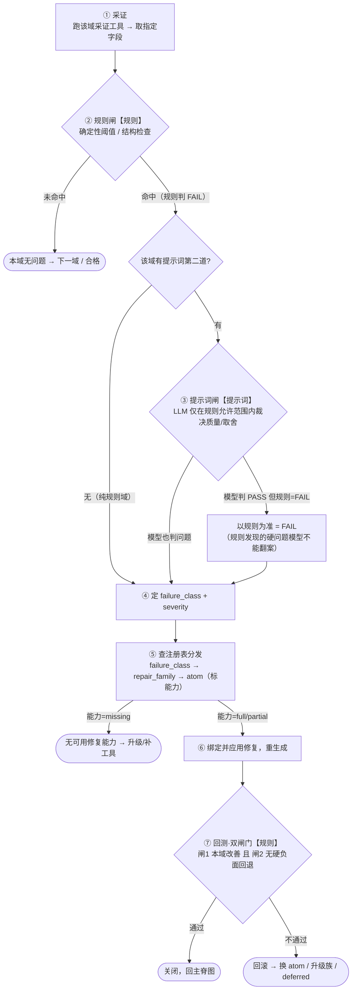

### 域0 · 流程/证据类（`process-evidence`，优先级最高）

| 项 | 内容 |
|---|---|
| **典型问题** | 缺 state trace、缺工具日志、缺渲染证据、写入越界、候选无生成证据、页数/页几何对不上 |
| **严重度** | **P0**（证据不可信，产品无法评价） |
| **采证 → 字段** | `validate_process_artifacts.py`→产物清单；`validate_workspace_boundary.py`→路径 containment；`evaluate_pdf_quality.py`→`page_count`/`page_geometry` |
| **判断机制** | schema/路径/日志规则检查（**模型不可覆盖**） |
| **修复族 → atom** | 不做产品修复。`rebuild_source_or_generation_linkage`(partial) 或 `fix_process_artifact_or_contract`(proposed) |
| **回跳状态** | `S3 提取源证据` 或 `Ax 方法论适配`；不可修 → `运行契约失败` |
| **接受条件 / veto** | 证据链补齐且 process gate PASS 才继续。**任一 P0 直接 veto 一切产品修复**——证据不可信时任何视觉判断都无意义。 |

**域0 流程图（纯规则，无提示词第二道）：**

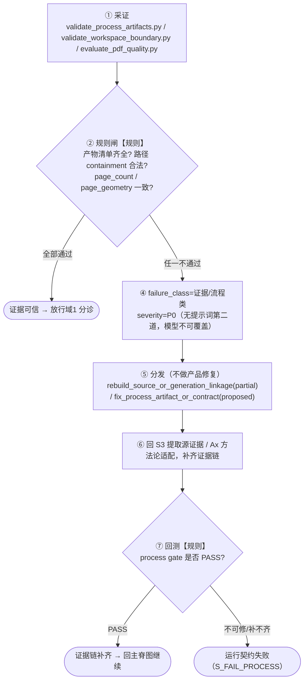

> **域0 特殊**：它是全文唯一**纯规则**域，没有提示词第二道——证据可不可信是事实问题，不容模型裁量。且它是 **veto 一切产品修复**的总闸：只要域0 有 open P0，下面 9 个域全部禁止进入。

### 域1 · 语义/内容类（`semantic-content`）

| 项 | 内容 |
|---|---|
| **典型问题** | 缺译、placeholder、伪译文（"本行说明…/This line reports…"）、文本单元丢失、覆盖率不足 |
| **严重度** | **P1** |
| **采证 → 字段** | `validate_semantic_translations.py`→`semantic_translation_validation`；翻译单元清单→`unit_coverage`；`forbidden_pattern_check` |
| **判断机制** | 覆盖率 + placeholder 规则检查（第一道）；语义模型裁决（第二道，仅在文本真实存在时判质量） |
| **修复族 → atom** | `retranslate_or_patch_translation_unit` → `regenerate_D2_translation_without_meta_description`(full) / `regenerate_missing_D2_units`(full) |
| **回跳状态** | `S5 语义译文` 或 `翻译/生成能力不足` |
| **接受条件 / veto** | 覆盖率 PASS、非 placeholder、数字/标记 token 保留。**缺译绝不许用布局修复掩盖**，也绝不许降级成 placeholder 混过 product_quality。 |

**域1 流程图（规则先判"有没有译全"，提示词后判"译得好不好"）：**

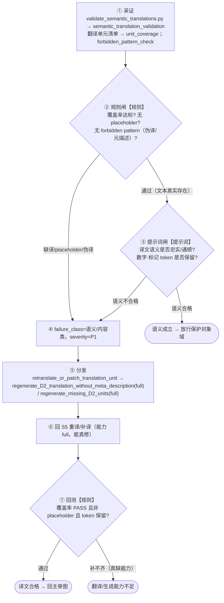

> **域1 铁律**：规则闸发现缺译时**提示词闸无权判 PASS**——缺译是能力问题，不是质量问题。**绝不许用布局修复掩盖缺译，也绝不许降级成 placeholder 混过 product_quality**（这是 §3 分诊顺序②"缺译时谈排版是白费"的落地）。

### 域2 · 图片/图形保护类（`image-graphic-protection`，保护对象优先）

| 项 | 内容 |
|---|---|
| **典型问题** | 图片被擦、浮层可抽取文字未翻译、图标/图例错位、照片内文字被误替换 |
| **严重度** | **P1**（保护对象破坏优先于普通文字 fit） |
| **采证 → 字段** | `collect_visual_region_metrics.py`→`page_metrics`(图片数/整页色差)、image bbox overlap、`redactions[].image_overlay_background_decision` |
| **判断机制** | 图层判断（PDF文本层 vs 图片像素）+ crop diff（**照片内文字默认保护；浮在图片上的可抽取文字仍须翻译**） |
| **修复族 → atom** | `protect_image_layer_or_overlay_text`(partial) / `image_overlay_text_relayout`(partial)；对应 core atom `image_redaction_exclusion_repair`(partial) |
| **回跳状态** | `S7 回填生成` 或 `S6 布局计划` |
| **接受条件 / veto** | 图片像素差受控、浮层文字已翻译且不遮主体。**图片被擦是 P1 硬负面，veto 通过。** |

**域2 流程图（规则先分"是图片像素还是文本层"，模型只做 crop 辅助）：**

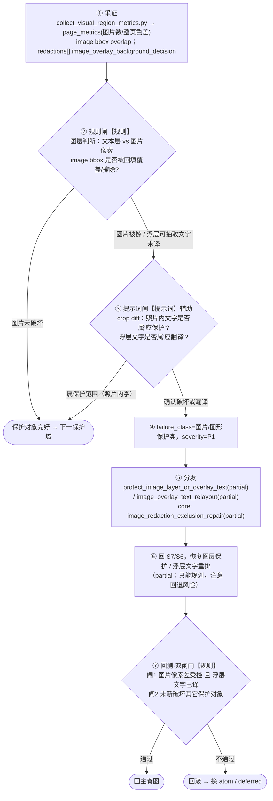

> **域2 要点**：**照片内文字默认保护、浮在图片上的可抽取文字仍须翻译**——这条边界靠规则的图层判断先分，模型 crop diff 只在边界模糊时辅助，不能推翻"图片被擦=P1硬负面"。

### 域3 · 背景/擦除类（`background-erasure`，保护对象优先）

| 项 | 内容 |
|---|---|
| **典型问题** | 擦除白块、背景色不一致、彩条残留、宽行擦除带、redaction 破坏渐变/照片、文字图像底色不匹配 |
| **严重度** | **P1** |
| **采证 → 字段** | `collect_visual_region_metrics.py`→`redaction_metrics`(fill_delta/patch_score/`wide_line_patch_risk`)、`background_cover_metrics`(draw_mode/area/saturation)、`inner_background_delta`/`text_image_background_delta` |
| **判断机制** | 背景采样差 + 宽条残留检测 + 局部 crop diff（**大面积色块/白条是硬负面**） |
| **修复族 → atom** | `background_resample_or_redaction_limit`(partial) / `redaction_scope_shrink`(proposed)；core atom `background_fill_resample`(full) / `background_residue_fill_resample`(full) |
| **回跳状态** | `S7 回填生成` |
| **接受条件 / veto** | 局部背景 delta 下降且不丢文字、不覆盖图片/表格线。**大面积背景破坏 veto 通过；`solid_vector_fill` 覆盖高饱和大面积 = 硬负面。** |

**域3 判断-修复流程（规则为主 + crop 辅助）：**

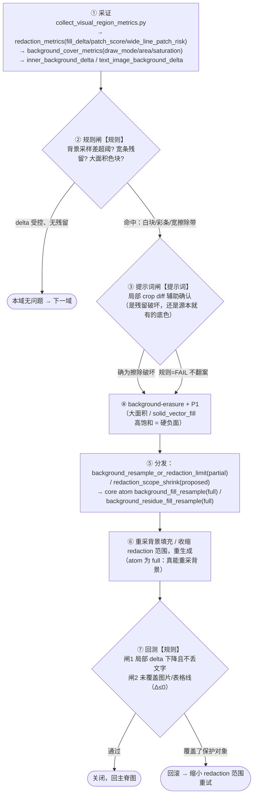

### 域4 · 表格/矩阵类（`table-matrix`，保护对象优先）

| 项 | 内容 |
|---|---|
| **典型问题** | 表头错列、列宽破坏、数字不对齐、表格线穿字、单元格文字不可读、矩阵页误走 body_flow |
| **严重度** | **P1**（表格结构硬约束优先于普通正文 fit） |
| **采证 → 字段** | `page_strategy`→`page_type`；`build_layout_plan.py`→表格线/单元格 bbox；`collect_visual_region_metrics.py`→`role_gates.table_text_legibility`/`matrix_diagram_integrity` |
| **判断机制** | grid/cell/line 检测（第一道）+ 表格 crop 对比（第二道） |
| **修复族 → atom** | `table_region_reflow_or_preserve_table`(**grid逻辑 missing**) / `table_cell_text_fit`(partial) / `table_header_alignment_repair`(proposed)；core atom `matrix_diagram_table_cell_preserve_repair`(partial) |
| **回跳状态** | `S6 布局计划` 或 `S7 回填生成` |
| **接受条件 / veto** | 行列结构不破坏、表头/数字列可读不串列。**完整 `table_integrity`/`chart_integrity` 确定性 validator 目前 `missing`——只能判单元格可读性/矩阵body_flow误用，完整网格校验需补工具或人工/模型补证。** |

**域4 判断-修复流程（规则 + 提示词，⚠️ 完整 grid 校验 missing）：**

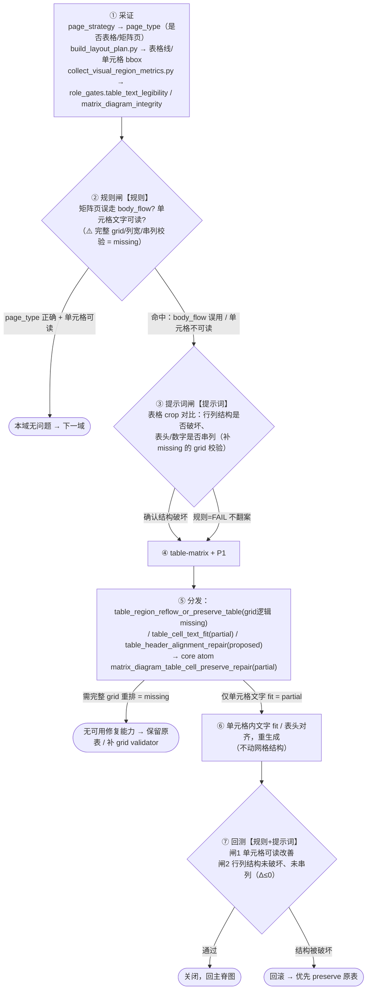

### 域5 · 文字装载类（`text-loading`，主修区）

| 项 | 内容 |
|---|---|
| **典型问题** | 文本溢出、截断、行碎片、单行过短、正文被压成极小字号、fallback point 插入 |
| **严重度** | **P1** |
| **采证 → 字段** | `collect_visual_region_metrics.py`→`region_metrics[].status`/`output_to_source_font_ratio`；`candidate_generation_evidence`→`insertions[].status/font_size`；`evaluate_pdf_quality.py`→`text_fit` |
| **判断机制** | fit/overflow/装载率规则（第一道）+ 源候选 crop 对比（第二道，规则发现溢出时模型不能判 PASS） |
| **修复族 → atom** | `expand_or_reflow_slot`(**partial·已知回退风险**) / `body_flow_region_reflow`(partial) / `line_break_rebalance`(proposed) |
| **回跳状态** | `S6 布局计划`（策略问题）或 `S7 回填生成`（生成器执行问题） |
| **接受条件 / veto** | 溢出/截断下降、字号不低于源相对下限、**不新增跨槽重叠**。<br>⚠️ **round25 实盘**：`expand_or_reflow_slot` 把溢出 135→2（目标闸过），但简单扩框把文本推入邻区，`cross_slot_overlap` 49→132（硬负面闸未过）→ 回滚。**这就是为什么 `expand_or_reflow_slot` 标 partial：它不读障碍物/邻接图。** |

**域5 判断-修复流程（规则 + 提示词，⚠️ round25 回退现场）：**

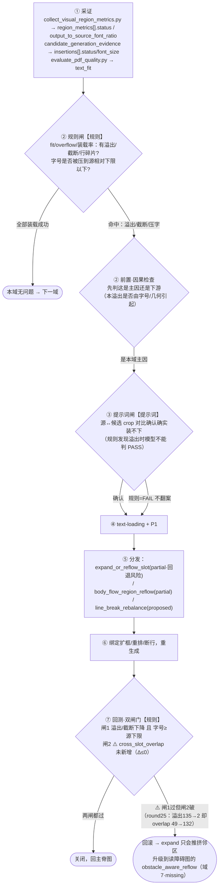

### 域6 · 字体层级类（`font-hierarchy`，主修区）

| 项 | 内容 |
|---|---|
| **典型问题** | 标题不像标题、正文过小、脚注过大、层级比例失真、KPI/指标值塌陷、强调色/粗细丢失 |
| **严重度** | **P1** |
| **采证 → 字段** | `collect_visual_region_metrics.py`→`output_to_source_font_ratio`/`source_median_font_size`/`role_gates`；font quantile |
| **判断机制** | role-relative 字号比（第一道）+ 源候选视觉层级对比（第二道，**不许用固定字号阈值替代源相对比例**） |
| **修复族 → atom** | `restore_role_font_hierarchy`(partial) / `reflow_before_shrink`(partial)；core atom `metric_value_font_hierarchy_repair`(partial) / `role_font_profile_or_region_classification`(partial) |
| **回跳状态** | `S6 布局计划` |
| **接受条件 / veto** | role 比例收敛、文字仍装载成功、metric/header/body 层级保持。**不许大幅压缩正文换取层级相似。** |

**域6 判断-修复流程（规则 + 提示词）：**

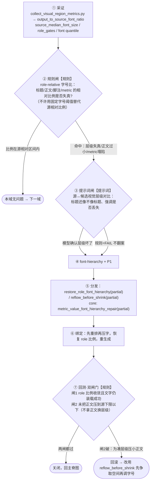

### 域7 · 几何/布局类（`geometry-layout`，主修区 · round24 翻车点）

| 项 | 内容 |
|---|---|
| **典型问题** | 区块重叠、锚点漂移、阅读顺序乱、可用空白没利用、跨槽重叠、侧栏方向错 |
| **严重度** | **P1** |
| **采证 → 字段** | `collect_visual_region_metrics.py`→`insertion_collision`/`region_metrics[].bbox`；`evaluate_pdf_quality.py`→`source_anchor_order`；bbox/邻接图 |
| **判断机制** | 碰撞检测 + 间距图（第一道）+ 页面密度/阅读顺序（第二道，**必须引用当前页 bbox 和邻接关系**） |
| **修复族 → atom** | `obstacle_aware_reflow`(**missing**·目标升级方向) / `vertical_flow_relayout`(**partial·高回退风险**) / `column_flow_rebalance`(proposed) / `region_collision_layout_repair`(proposed) |
| **回跳状态** | `S6 布局计划` |
| **接受条件 / veto** | 重叠下降、阅读顺序稳定、**不挤占图片/表格/页眉页脚**。<br>⚠️ **round24 实盘**：Triage 选 `cross_slot_overlap`→`vertical_flow_relayout`，应用 33 operation，重叠 70→92、阻塞 80→102 → 回滚 → `PDF质量失败`。**根因：`vertical_flow_relayout` 只按页/角色移动文本流，无障碍物图、无列内局部重排、无表格/图片/页脚保护。正确动作是升级到 `obstacle_aware_reflow`（当前 missing，需先补工具），而不是重试同一 atom。** |

**域7 判断-修复流程（规则 + 提示词 · round24 翻车点，重点看能力缺口）：**

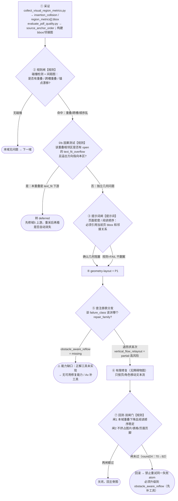

> **这张图是"泛化差"的病灶特写**：正确修复族 `obstacle_aware_reflow` 是 `missing`，Codex 只能退用无障碍物图的 `vertical_flow_relayout`，于是每次"修重叠"都制造新重叠。**文档能锁住"不许重试同一失败 atom"，但真正治本要 core 补 `obstacle_aware_reflow` 执行器——这是工具能力问题，不是文档能单独解决的。**

### 域8 · 图表/图例类（`chart-legend`）

| 项 | 内容 |
|---|---|
| **典型问题** | 饼图标签错位、图例不对齐、颜色-标签脱钩、图表文字遮挡图形 |
| **严重度** | **P2**（除非颜色-标签绑定破坏则升 P1） |
| **采证 → 字段** | `collect_visual_region_metrics.py`→`role_gates.legend_label_alignment`；swatch color bbox、legend label bbox、chart region bbox |
| **判断机制** | 颜色-标签绑定检查（第一道）+ swatch/label 距离（第二道，**不能只看文字是否装下**） |
| **修复族 → atom** | `chart_label_legend_relayout`(proposed) / `legend_swatch_label_binding`(proposed)；core atom `chart_region_preserve_or_label_reflow`(**missing**) |
| **回跳状态** | `S6 布局计划` 或 `S7 回填生成` |
| **接受条件 / veto** | swatch 与 label 仍绑定、标签可读不遮图形。**只移动文字导致颜色绑定失真 = 硬负面。完整 chart validator 当前 missing。** |

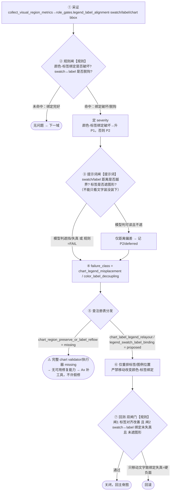

### 域9 · 页面节奏/审美类（`page-rhythm`，最低优先级）

| 项 | 内容 |
|---|---|
| **典型问题** | 段落过密/过散、上半拥挤下半空白、标题正文比例不协调、整页相似度偏差 |
| **严重度** | **P2 / P3** |
| **采证 → 字段** | 页面密度、留白带、段落 gap、`paragraph_density`/`internal_paragraph_gap`；源候选 rhythm 向量 |
| **判断机制** | density/white-space metric（第一道）+ 模型审美裁决（第二道，作为综合审美层，**不替代硬 gate**） |
| **修复族 → atom** | `page_rhythm_rebalance`(proposed) / `section_spacing_reflow`(proposed) |
| **回跳状态** | `S6 布局计划` |
| **接受条件 / veto** | 密度和段距接近源页相对关系。**只有 P0/P1 全清空后才允许处理；绝不为审美破坏 P1 硬约束。** |

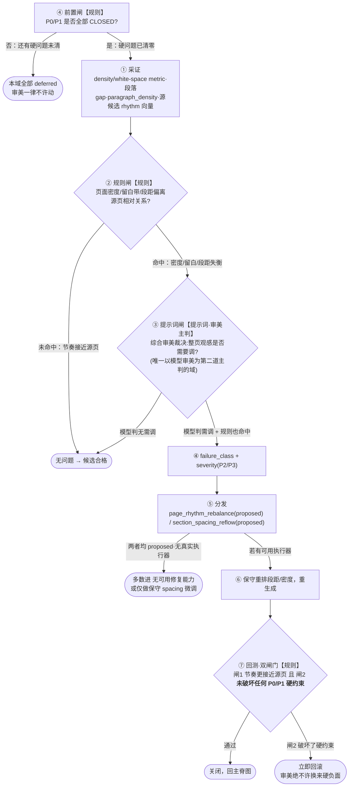

> **域9 独特点**：这是**唯一以模型审美为第二道主判**的域——因为"好不好看"难以纯规则量化。但有两条铁律：(1) **前置闸**——P0/P1 没全清零，审美一律 deferred，绝不允许在硬问题还在时动审美；(2) **回测闸2**——审美修复若破坏任何硬 gate(挤压文字/重叠/覆盖保护对象)立即回滚。**审美永远是最后、最弱、最容易被否决的一档。** 且两个修复族都是 `proposed`(无真实执行器)，Codex 多数情况只能做保守微调或直接判无能力，不许为"更好看"制造硬负面。

### 4.10 能力状态总览（Codex 选修复族前必看）

这张表把"哪些修复族现在能真修、哪些是坑、哪些还没实现"一次说清。**选到 `missing` 的直接进 `无可用修复能力`→`Ax 方法论适配` 或 `PDF质量失败`，不许假修。**

| 修复族（中文 / ID） | 能力状态 | Codex 该怎么办 |
|---|---|---|
| 重译/补译 `retranslate_or_patch_translation_unit` | **full** | 放心用，能真修 |
| 重建源/生成链接 `rebuild_source_or_generation_linkage` | partial | 可用但先确认证据链 |
| 扩展/重排槽 `expand_or_reflow_slot` | **partial·回退风险** | 会把文本推入邻区、恶化重叠（round25）。单独用要预期回滚 |
| 正文流式重排 `body_flow_region_reflow` | partial | 可用于连续正文，勿跨源锚点 |
| 恢复字体层级 `restore_role_font_hierarchy` / 先重排后缩字 `reflow_before_shrink` | partial | 可用，先找空间再缩字 |
| 障碍感知重排 `obstacle_aware_reflow` | **missing** | **目标升级方向，但 core 未实现**。选它→`Ax 方法论适配`补工具 |
| 纵向流式重排 `vertical_flow_relayout` | **partial·高回退风险** | round24 翻车主角，无障碍物图。勿反复重试，升级到 obstacle_aware |
| 列流重平衡 `column_flow_rebalance` / 区域碰撞修复 `region_collision_layout_repair` | proposed | 注册表有名字，core 无执行器，等价 missing |
| 表格重排/保表 `table_region_reflow_or_preserve_table` | **grid逻辑 missing** | 只能判可读性，完整网格校验需补工具 |
| 图表标签重排 `chart_label_legend_relayout` | **missing** | 完整 chart validator 未实现 |
| 页面节奏重平衡 `page_rhythm_rebalance` | proposed | 仅硬问题清空后，且多为 missing |
| 背景重采样 `background_resample_or_redaction_limit` | partial（底层 core atom full） | 可用，勿用固定色盖复杂背景 |
| 保护图片层/浮层文字 `protect_image_layer_or_overlay_text` | partial | 可用，区分照片内文字与浮层文字 |

> **这张表就是你要的"泛化差"的答案**：round22/24 在特定页"改得好"，是因为那些页的问题恰好落在 `full`/`partial` 能修的域；一换 PDF 撞上 `geometry-layout` 需要 `obstacle_aware_reflow`（missing）或 `table-matrix` 需要完整 grid validator（missing），就必然翻车。**文档层能做的是让这个缺口"可见、可诊断、可诚实失败"；真正补上要靠新工具（见 §8 后续工作）。**

---

## 5. LayoutIssue 问题对象状态机（权威版）

> §1 主脊图管"整份 PDF 走到哪"，本节管"**单个问题**走到哪"。候选 PDF 里每个 P0/P1 阻塞问题，都是一个 `LayoutIssue` 对象，有自己的生命周期。Codex 的报告里，**每个阻塞问题都必须能说出它当前停在这张图的哪个状态**。
>
> 这张图是**唯一权威版**。v0.4 里有 4 张互相漂移的问题状态机（§7.10 / §7.14.1 / §7.15 / §7.20.1），状态名都对不上——本节取代它们，其余作废。

### 5.1 权威状态机

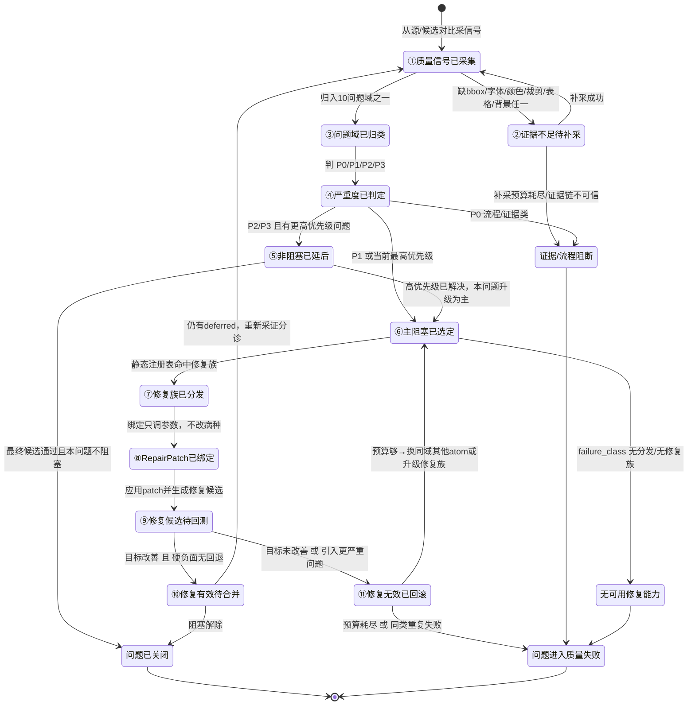

### 5.2 六道硬约束（这张图为什么这么连）

| # | 约束 | 防的是什么坑 |
|---|---|---|
| 1 | `①信号采集` 之前没有问题状态，只有候选 PDF 状态 | 防"还没采证就开始猜问题" |
| 2 | `③问题域归类` 之前不许选工具 | 防"凭感觉直接选 repair atom" |
| 3 | 分诊只把问题推到 `⑥主阻塞已选定`，**不出工具参数** | 防分诊越权变成修复 |
| 4 | 分发只把问题推到 `⑦修复族已分发`，**必须来自静态注册表** | 防模型自由发明工具 |
| 5 | 绑定只推到 `⑧RepairPatch已绑定`，**只调 repair knob 不改病种** | 防绑定阶段偷改 failure_class |
| 6 | `⑨修复候选待回测` **必须重采同一批证据**才能进 `⑩修复有效待合并` | 防"没重测就宣称修好"（round24/25 的反面教材） |

### 5.3 回滚后不许原地重试（关键规则）

`⑪修复无效已回滚 → ⑥主阻塞已选定` 这条边有一条硬规则：

> **回滚后，同一个 `failure_class` 不许再派同一个已失败的 `repair_atom`。** 必须换同域的其它 atom，或升级修复族（如 `纵向流式重排` 失败 → 升级到 `障碍感知重排`），或进 `适配方法论变更` 补工具。

这正是 round24 的病根：它对 `cross_slot_overlap` 反复用 `vertical_flow_relayout`，而这个 atom 不读障碍物图，所以每次都制造新重叠。§4.7 的能力状态表已把这条焊死。

> **"不许重试"靠什么记住？** 这条规则本身跨轮有效，但单轮的 `repair_acceptance.json` 记不住上几轮试过什么。**执行时以 §2.5 的 `repair_memory_ledger.json` 为准**——回滚回到 `⑥主阻塞已选定` 前，必须先查该问题键（`page-region+failure_class`）的 `tried[]`，命中过的 `atom` 一律不许再派；`escalation_stage` 已到顶或命中任一终止条件时，不许再跳回 ⑥，直接走 §2.5 规定的终态。

### 5.4 传送门：LayoutIssue 每个状态的下一跳

> Codex 处理**单个问题**走到状态机的任一状态时，用此表确定"下一步做什么、去哪一节、产出什么文件、什么条件放行"。此表把 §5 的状态机与 §2 的七产物、§4 的查表逐一对齐（一个问题对象的生命周期 = 六段流水线在单个问题上的投影）。

| 当前状态 | 触发条件 | 下一跳去哪 | 该产出/更新什么文件 | 放行门禁 |
|---|---|---|---|---|
| ①信号采集 | 候选已渲染、证据篮①就绪 | §2 信号归一 → ②信号账本 | `quality_signal_ledger.json` 增本问题一条 `QualitySignal` | 该信号已标 `problem_domain`/`failure_class`/`severity`/证据引用 |
| ②信号已记 | 信号账本已写入 | §3 分诊树 + §4.0 关系图 | `problem_domain_buckets.json` 把本信号入桶 | 已归入某问题域，且优先级不被高域抢占 |
| ③问题域归类 | 已入桶、本域是当前最高未清空优先级 | §5.2 约束2 + §4 对应域小节 | `triage_result.json` 起草本问题 | 本域确为本轮主修域（否则转 deferred，见下） |
| ⑥主阻塞已选定 | 本问题被选为本轮唯一主问题 | §2 分发 + §4 对应域"修复族→atom"列 | `dispatch_result.json` 写 `failure_class→repair_family` | 该 `repair_family` 在注册表存在且 `capability≠missing`（否则 → `无可用修复能力`） |
| ⑦修复族已分发 | 分发结果已写、目标状态已定 | §2 绑定 + §4.7 能力状态表 | `repair_patch_<n>.json`，`operation_count>0` | 只在本族参数口内绑 operation，未改 `failure_class` |
| ⑧RepairPatch已绑定 | 补丁 operation 数 >0 | §2 回测（重生成+重采证） | 重生成候选，`repair_acceptance.json` 起草 | 已用**同一批证据**重采（§5.2 约束6） |
| ⑨修复候选待回测 | 已重采修后信号 | §2 双闸门（§4 各域接受条件+硬负面 veto） | `repair_acceptance.json` 出 verdict | 闸门1目标改善 **且** 闸门2无硬负面回退 |
| ⑩修复有效待合并 | 双闸门通过 | §1 主脊图 `修复候选已生成→重新裁决` | 并入 `repair_loop_<n>.json`，问题置 CLOSED | 无 —— 本问题关闭，回主脊图看是否还有其它阻塞 |
| ⑪修复无效已回滚 | 闸门未过/预算耗尽 | **先查 §2.5 记忆台账**：命中任一终止条件 → 走 `PDF质量失败`/`Ax`（不许再回⑥）；否则按 §5.3 换 atom/升级族 → 回 ⑥ | 回滚，追加一条 `repair_memory_ledger.attempts[]`（记本次 atom+参数+Δ+裁决）；更新 `best_candidate` | **不许**对同 `failure_class` 再派台账里已试过的 atom（§5.3 + §2.5） |
| （deferred） | 本问题所属域非当前最高优先级 | 挂起，待高优先级域清零后回 §4.0 重排 | `triage_result.json` 的 `deferred[]` 记录本问题+被谁挡 | 高优先级域全部 CLOSED 后，本问题重新进 ③ 竞争主问题 |

---

---

## 6. 每问题 trace 卡（人可读强制格式）

> 这一节直接治你的痛点："Codex 输出一堆 JSON 我看不懂、他自己也说不清干了什么、我想修也不知道问题在哪。"
>
> 规则：**每个 P0/P1 阻塞问题，Codex 必须输出一张 trace 卡**——固定 8 行人话，不许只丢 JSON。JSON 是给机器和校验器的，trace 卡是给人的。两者的 ID 必须一致（校验器会核对）。

### 6.1 强制格式（8 问，缺一不可）

每张卡回答 8 个问题，顺序固定：

```
问题卡 #<页码>-<区域号>
1. 这是什么问题？        → <问题域中文> / <failure_class英文ID>
2. 为什么不是别的类型？   → 一句话排除相邻域（如"不是缺译，译文单元齐全；是回填后装不下"）
3. 严重度？              → P0/P1/P2/P3 + 依据（哪个 role、是否 critical）
4. 证据在哪？            → <工具名> 的 <文件>#<字段路径>，观测值=<实际数值>，阈值=<规则>
5. 本轮是不是主问题？    → 是（因果理由）/ 否（被谁 defer、排在第几）
6. 派什么修？不派什么？   → <repair_family> → <repair_atom>（能力状态：full/partial/missing）
7. 修后变化？            → 目标指标 <前→后>；硬负面指标 <前→后>（逐项）
8. 结论？                → 接受 / 回滚 / 继续loop / 质量失败 → 下一状态
```

### 6.2 实例：用 round25 的真实数据填一张卡

这张卡用 `pdf_translation_workflow_lab/rounds/round25.../reports/round25_final_verdict.json` 的真实数字填，示范"看得懂"长什么样：

```
问题卡 #(00005前20页整体)-text_fit
1. 这是什么问题？        文字装载类 / text_fit_overflow
2. 为什么不是别的类型？   译文单元覆盖完整（非缺译）；是中译英变长后回填装不下源框
3. 严重度？              P1（body 正文 role，critical，影响阅读）
4. 证据在哪？            collect_visual_region_metrics.py 的 visual_region_metrics.json
                        观测：text_fit_overflow 计数=9；阈值：overflow 应=0
5. 本轮是不是主问题？    是。因果理由：text_fit 是上游，overlap 多半是它的下游症状
6. 派什么修？不派什么？   expand_or_reflow_slot → 扩框/重排（能力状态：partial ⚠️
                        已知风险：简单扩框会把文字推入邻区，制造 cross_slot_overlap）
7. 修后变化？            目标指标 text_fit_overflow: 9 → 0 ✅（闸门1过）
                        硬负面 cross_slot_overlap: 70 → 78 ❌（闸门2不过，+8 回退）
8. 结论？                回滚（闸门2未过）。接受候选=修复前初版。
                        下一状态：换 obstacle_aware_reflow（但该 atom 能力=missing）
                        → 无可用修复能力 → 质量失败
```

**这张卡一眼说清了三件你以前看不到的事**：
- **为什么修失败**：不是没修，是 `expand_or_reflow_slot` 能力=partial，扩框制造了新重叠（第 6、7 行）。
- **该往哪修**：升级到 `obstacle_aware_reflow`，但它当前能力=missing（第 8 行）——**这是工具缺口，不是流程问题**，该去补工具。
- **哪个闸门卡住**：闸门1(目标)过了，闸门2(硬负面)没过（第 7 行）——精确到 +8 的重叠回退。

### 6.3 卡与 JSON 的对应

| trace 卡的行 | 对应 JSON 产物字段 | 校验器核对点 |
|---|---|---|
| 第1行 类型 | `quality_signal_ledger` 的 `failure_class`+`problem_domain` | ID 必须在注册表 |
| 第4行 证据 | `quality_signal_ledger` 的 `producer_tool`+`source_json_path`+`observed_value` | 字段路径必须可解析 |
| 第5行 主问题 | `triage_result` 的 `selected_failure_class`+`selection_reason`+`deferred_failures` | 主问题唯一 |
| 第6行 派修 | `dispatch_result` 的 `repair_family`+`repair_atom` | 必须命中静态注册表 |
| 第7行 修后 | `repair_acceptance` 的 `target_delta`+`hard_negative_regressions` | 逐域对比 |
| 第8行 结论 | `repair_loop_<n>.json` 的 `loop_verdict`+`next_state` | 状态合法 |

> **强制令**：报告里每个阻塞问题若只有 JSON 没有 trace 卡，或卡里的 ID 与 JSON 对不上，`validate_process_artifacts` 判 `运行契约失败`。人话卡不是可选的美化，是硬产物。

---

---

## 7. 骨架状态（S0-S7、S9）：只锁边界，不展开

> 这些是工程化流程状态，你已确认"没什么大问题"。本节只锁**进入/退出条件和必产产物**，不展开内部——细节在 core `state_machine.md`。痛点在 §2-§6，不在这里。

### 7.1 骨架状态一览（进入条件 → 必产产物 → 失败去向）

| 状态 | 中文 | 进入条件 | 必产产物 | 失败去向 |
|---|---|---|---|---|
| S0 | 受理请求 | 用户给了 PDF + 方向 + 模式 | 运行头 | 输入缺失→等用户 |
| S1 | 加载契约 | S0 完成 | 契约加载记录、`workspace_boundary_preflight.json` | 契约缺失/越界→运行契约失败 |
| S2 | 探测工具 | S1 通过 | `tool_probe.json` | 必需工具缺→PDF无法处理 |
| S3 | 提取源证据 | S2 通过 | `source_extraction.json`、源 PNG | 抽不出/渲不出→PDF无法处理 |
| S4 | 页面策略[D1] | S3 完成 | `page_strategy.json`（页型+区域角色） | 无依据→运行契约失败 |
| S5 | 批次翻译[D2] | S4 完成 | 批次产物、`*.translations.json`、`semantic_translation_validation.json` | 缺译/伪译→**能力不足（绝不 placeholder 混过）** |
| S6 | 布局计划[D4] | S5 语义校验通过 | `layout_policy/role_plan/layout_plan.json`（`可被生成器消费=true`） | 含样本特判→运行契约失败 |
| S7 | 回填生成 | S6 完成 | 候选 PDF、`candidate_generation_evidence.json`、`layout_execution.json` | 生成器不足→能力不足 |
| S9 | 过程审计[D9] | S8 无阻塞 | `process_validation.json`、`anti_overfit_scan.json`、双 verdict | trace/证据不可信→运行契约失败 |

### 7.2 两条骨架硬规则（承 core，不重述细节）

1. **S5 是有边界批次循环**，不是"一次性全文翻译"：建批次清单→逐批预检写入边界→逐批 D2→逐批校验→汇总→全量语义校验。缺译/伪译/placeholder 一律**能力不足**，不许降级混过（详见 core `state_machine.md` S5 段）。
2. **S1/S5 每次写运行时产物前必须过写入边界预检**（`validate_workspace_boundary.py`，PASS 才写）。任何计划路径解析到执行根外 → 运行契约失败。

---

---

## 8. 中英映射表 + 锁死机制 + 校验器

> 本节两个用途：① 给你一张**中文名 ↔ 英文ID ↔ 注册表/文件**对照表，对 Codex 输出时不费劲；② 说明这些图靠什么保持一致、不漂移（这正是 v0.4 那份文档"4 张 LayoutIssue 图互相打架"的病根解法）。

### 8.1 状态中英映射（主脊图 + 骨架）

| 中文状态名 | 英文 state ID | core 契约来源 |
|---|---|---|
| 源PDF待处理 | `S0_Request` / `S1_ContractLoad` / `S2_ToolProbe` | state_machine.md |
| 源证据已就绪 | `S3_SourceExtract` | state_machine.md |
| 页面策略已就绪 | `S4_PageStrategy` | state_machine.md |
| 语义译文已就绪 | `S5_TranslationPlan` | state_machine.md |
| 布局约束已就绪 | `S6_LayoutPlan` | state_machine.md |
| 候选PDF已生成 | `S7_GenerateCandidate` | state_machine.md |
| 候选PDF裁决中 | `S8_VerifyProductQuality` | state_machine.md |
| 修复候选已生成 | `Lx_RepairLoop` | state_machine.md |
| 目标PDF已验收 | `S_DONE_PRODUCT_ACCEPTED` | state_machine.md |
| 过程已验证(产品未达) | `S_DONE_PROCESS_VALIDATED` | state_machine.md |
| PDF无法处理 | `S_FAIL_TOOLING` | state_machine.md |
| 翻译/生成能力不足 | `S_FAIL_CAPABILITY` | state_machine.md |
| PDF质量失败 | `S_FAIL_QUALITY` | state_machine.md |
| 运行契约失败 | `S_FAIL_PROCESS_CONTRACT` | state_machine.md |
| 适配方法论变更 | `Ax_AdaptiveChange` | state_machine.md |

### 8.2 问题域中英映射（§4 主矩阵）

| 中文问题域 | 英文 problem_domain ID | 优先级 | 注册表 |
|---|---|---|---|
| 流程/证据类 | `process-evidence` | 0 | problem_domains.json |
| 语义/内容类 | `semantic-content` | 1 | problem_domains.json |
| 表格/矩阵类 | `table-matrix` | 2 | problem_domains.json |
| 图片/图形保护类 | `image-graphic-protection` | 2 | problem_domains.json |
| 背景/擦除类 | `background-erasure` | 2 | problem_domains.json |
| 文字装载类 | `text-loading` | 3 | problem_domains.json |
| 字体层级类 | `font-hierarchy` | 3 | problem_domains.json |
| 几何/布局类 | `geometry-layout` | 3 | problem_domains.json |
| 图表/图例类 | `chart-legend` | 4 | problem_domains.json |
| 页面节奏/审美类 | `page-rhythm` | 4 | problem_domains.json |

### 8.3 修复族中英映射（含能力状态）

> 完整 54 个 repair_atom、24 个 repair_family 见 `repair_atoms.json` / `repair_families.json`。这里只列 §4 用到的主修复族，重点标 **能力状态**——`partial`/`missing` 的族就是当前 Codex "泛化差"的真实硬伤所在。

| 中文修复族 | 英文 repair_family ID | 能力状态 | 已知风险（来自 round24/25 实盘） |
|---|---|---|---|
| 重译/补译翻译单元 | `retranslate_or_patch_translation_unit` | full | — |
| 扩展/重排文本槽 | `expand_or_reflow_slot` | ⚠️ partial | 简单扩框把文字推入邻区，恶化 cross_slot_overlap（round25: 70→78） |
| 正文流式区域重排 | `body_flow_region_reflow` | ⚠️ partial | 不读障碍图，跨区重排可能撞邻居 |
| 恢复角色字体层级 | `restore_role_font_hierarchy` | full | — |
| 先重排后缩字 | `reflow_before_shrink` | ⚠️ partial | 依赖可用空间探测，密集页可能无空间可用 |
| 纵向流式重排 | `vertical_flow_relayout` | ⚠️ partial | round24: 33 次操作，overlap 70→92，blocking 80→102，回滚 |
| 障碍感知重排 | `obstacle_aware_reflow` | ❌ missing | 提议中；round24/25 的正确升级目标，但障碍图/列内重排/保护对象感知**尚未实现** |
| 表格区域重排或保表 | `table_region_reflow_or_preserve_table` | ⚠️ partial | 网格检测逻辑不完整 |
| 保护图片层/浮层文字 | `protect_image_layer_or_overlay_text` | full | — |
| 背景重采样/限制擦除 | `background_resample_or_redaction_limit` | full | — |
| 图表标签图例重排 | `chart_label_legend_relayout` | ❌ missing | 无图表专用 validator |
| 页面节奏重平衡 | `page_rhythm_rebalance` | ⚠️ partial | 只有硬问题清零后才允许 |

> **这张表是你要的答案的一半**：Codex 泛化差，不只是文档乱，更是**一半的修复族根本没有真正的执行能力**（partial/missing）。文档锁死能让它诚实报告"我用的是 partial 工具、预期会有 X 风险",但要真正修好 round24/25 那类问题，**必须补 `obstacle_aware_reflow` 这个 missing 的能力**——这是工具开发任务，不是文档能解的。

### 8.4 七产物文件名映射（§2 流水线）

| 中文产物 | 文件名 | 当前 core 是否有 |
|---|---|---|
| 证据篮 | `evidence_basket.json` | ❌ 缺 |
| 信号账本 | `quality_signal_ledger.json` | ❌ 缺（现只有扁平 `quality_signals.json`） |
| 问题域桶 | `problem_domain_buckets.json` | ❌ 缺 |
| 分诊结果 | `triage_result.json` | ◐ 部分嵌在 verdict 里 |
| 分发结果 | `dispatch_result.json` | ❌ 缺（嵌在 patch 里） |
| 修复补丁 | `repair_patch_<n>.json` | ✅ 有 |
| 回测账本 | `repair_acceptance.json` | ◐ 嵌在 `repair_loop_<n>.json` |

### 8.5 锁死机制：图为什么不会再漂移

v0.4 的病根：同一个 LayoutIssue 状态机画了 4 遍（§7.10/§7.14.1/§7.15/§7.20.1），互相不一致，Codex 挑哪张全凭运气。本文的解法是**单一真理源 + 校验器强制**：

```mermaid
flowchart TD
  reg["注册表 registry/*.json<br/>(唯一真理源)"] --> doc["本执行契约文档<br/>(所有ID引用注册表)"]
  reg --> core["core 8份契约<br/>(字段级细节)"]
  doc --> validator["validate_decision_graph.py<br/>(校验器/锁)"]
  reg --> validator
  core --> validator
  validator -->|任一悬空引用=blocking| fail["❌ 拒绝合入"]
  validator -->|全部一致| pass["✅ 允许执行"]
```

**三条不漂移保证**：

1. **单一真理源**：每个 `failure_class`/`repair_atom`/`problem_domain`/`state` 只在注册表定义**一次**。本文和 core 契约都只**引用**，不重新定义。想改一个 ID 的归属，只改注册表一处。
2. **本文只画一次权威图**：LayoutIssue 状态机全文只有 §5 一张（不是 v0.4 的 4 张）。其它章节引用它，不重画。
3. **校验器强制**：`validate_decision_graph.py` 扫描——本文/core 里出现的每个 ID 必须在注册表存在；每个 `failure_class` 必须恰属一个域、能映射到 `repair_family`；每个 `repair_atom` 必须映射到真实 tool 或明确标 `missing`。**任一悬空 = blocking，拒绝合入**。

### 8.6 校验器职责（`validate_decision_graph.py`，待建）

| 检查项 | 通过条件 | 失败后果 |
|---|---|---|
| ID 存在性 | 本文/core 每个 ID 都在注册表有记录 | blocking |
| failure_class 归属唯一 | 每个 failure_class 恰属 1 个 problem_domain | blocking |
| 修复族可达 | 每个 failure_class 能映射到至少 1 个 repair_family | blocking |
| atom 落地 | 每个 repair_atom 映射到真实 tool 文件，或明确标 `capability_status=missing` | 缺 tool 且未标 missing = blocking |
| 别名一致 | `cross_slot_overlap`↔`insertion_collision_fail` 等别名对显式声明，不报幽灵孤儿 | warning |
| 产物依赖链 | §2 七产物的 `depends_on` 无环、无断链 | blocking |
| proposed 使用告警 | `proposed_v04` 的 failure_class 若被运行时使用，告警 | warning |

> 校验器和注册表补全属于**下一步落地任务**，不在本文范围。本文先把"图怎么锁"定清楚，落地时按 §8.6 实现校验器即可。

---

## 附录 A：给 Codex 的执行清单（TL;DR）

新会话执行时，按这个顺序，每步产出对应文件，缺一不可：

1. 按 §1 主脊图推进 S0→S7，逐边不跳级，每边写 `state_trace` + `workspace_boundary_check_ref`。
2. 到 S8，**不许**直接看截图下结论。按 §2 七产物依赖链，依次产出 ①证据篮→②信号账本→③问题域桶→④分诊结果→⑤分发结果→⑥修复补丁→⑦回测账本。缺上一个禁止下一个。
3. 每个信号按 §3 分诊树归域（顺序不可颠倒），按 §4 主矩阵查采证/判断/修复/接受条件。
4. 每轮 Lx 只修**一个**主 failure_class，其余进 deferred。按 §5 状态机走；回滚后不许原地重试同一 atom。
5. 每个 P0/P1 问题输出一张 §6 trace 卡（8 问全答）。
6. 修复族能力状态是 `partial`/`missing` 时，**必须在 trace 卡里诚实标注预期风险**（如扩框会恶化 overlap），不许假装能修好。
7. 终态按 §1 三条硬规则：四个失败终态不可互换，产品/过程 verdict 分开记。

> 一句话：**先归域、再选药、只修一个、修完必测、修坏回滚、能力不足就诚实失败。**
