# PDF 语义翻译回填：状态机与工具编排设计

> **文档定位（2026-07-09 更新）**：本文是**设计说明 / rationale 与 round 实盘证据集**，**不是执行依据**。
> - 执行器（Codex）运行时**只认**两个权威源：
>   1. `docs/设计/PDF_语义翻译回填_执行契约.md`（精简执行契约，含主脊图、六段研判流水线、权威 LayoutIssue 状态机、S8/Lx 分级研判）；
>   2. `pdf_translation_workflow_core/contracts/registry/*.json`（问题域 / failure_class / repair_family / repair_atom / tool / 产物依赖链的唯一真理源，由 `validate_decision_graph.py` 强制一致性）。
> - 本文保留的价值：设计推演、round24/25 真实失败链证据（§7.18）、风险登记（§12）、待补问题（§13）。
> - **已知问题**：本文对 LayoutIssue 状态机（§7.10 / §7.14.1 / §7.15 / §7.20.1）、问题域→修复族映射（§7.13 / §7.16 / §8.2 / §8.3）、六段研判流水线（§7.8 / §7.15 / §7.20）各写了多份且互相漂移。这些**多份副本以执行契约 + 注册表的单一版本为准**，本文内的重复描述仅作设计背景，不得作为运行时裁决依据。
> - 当执行契约 / 注册表与本文冲突时，**一律以执行契约 + 注册表为准**。

版本：v0.4
状态：已降级为设计说明（superseded as execution authority）
目标：先定义 PDF 产物状态、问题对象状态和迁移，再定义每个状态下的采集、判断、生成、修补工具。

## 1. 系统目标和边界

### 1.1 目标

本流程面向 PDF 语义翻译回填：输入一个 PDF，识别源语言，生成目标语言译文，并尽量保持原 PDF 的版式、视觉层级、图表结构、背景、图片和阅读体验。

本流程不是单个 PDF 的专用脚本，而是一套可由 Codex 或其他执行器调度的状态机。执行器必须能按状态读取证据、调用工具、记录判断、进入修复 loop，并输出可审计的运行报告。

### 1.2 非目标

1. 不把人工对照 PDF 当作运行时输入。
2. 不把样本文档文件名、固定页码、固定坐标、固定文本、固定颜色写进 core 工具、提示词或契约。
3. 不把候选 PDF 等同于产品通过。
4. 不用截图主观感觉替代工具证据和状态迁移记录。
5. 不把所有质量失败都退回翻译。多数视觉问题应优先回到布局或生成。

### 1.3 状态正确性原则

为了避免“前面状态错了，后面都白干”，本设计把 PDF 状态和执行动作分三层：

| 层级 | 含义 | 稳定性 | 来源 |
|---|---|---|---|
| L0 PDF 产物状态 | PDF 或候选 PDF 当前成立的事实，如“源证据已就绪”“候选 PDF 存在阻塞问题” | 高 | 本文第 3 节 PDF 产物状态机 |
| L1 状态迁移动作 | 让 PDF 从一个产物状态迁移到另一个产物状态的动作，如提取、翻译、回填、裁决、修复 | 中 | runner 真实调用、工具契约、V4 JUDGE/REPAIR 思想 |
| L2 原子工具动作 | 一个工具调用、一次模型裁决、一次 RepairPatch operation | 可变 | `pdf_translation_workflow_core/tools`、`prompts`、`contracts` |

PDF 产物状态不因某个修复工具变动而随意修改。迁移动作和原子工具动作可以演进，但必须保持 PDF 状态迁移和产物契约可追溯。

### 1.4 证据来源

本文基于当前磁盘上的这些事实整理：

| 来源 | 用途 |
|---|---|
| `pdf_translation_workflow_core/contracts/state_machine.md` | 当前主状态、复合状态、终态语义 |
| `pdf_translation_workflow_core/prompts/prompt_tool_bindings.json` | 状态到工具、提示词、产物的绑定 |
| `pdf_translation_workflow_core/contracts/tool_contracts.md` | 工具类别、写入边界、生成器和视觉 gate 契约 |
| `pdf_translation_workflow_core/contracts/page_type_repair_matrix.md` | failure class 到 repair atom 的映射 |
| `pdf_translation_workflow_core/tools/run_semantic_product_quality_round.py` | 当前实际 runner 中已执行的提取源证据、生成翻译计划、生成布局计划、生成候选 PDF、验证产品质量、执行修复循环轨迹 |
| `translation_layout_harness_engine_spike_v4/translation_layout_harness/orchestrator` | V4 五态、Triage/Binding/Judge/Repair 思想 |

## 2. PDF 产物状态和执行动作的边界

本设计中的“状态机”只描述 PDF 产物及其随附证据当前处于什么状态。
执行器准备动作，例如确认请求、加载契约、探测工具、检查写入边界，不属于 PDF 状态机；这些动作必须记录在流程日志里，但不能冒充 PDF 状态。

判断标准如下：

| 类型 | 例子 | 是否属于 PDF 状态机 | 说明 |
|---|---|---|---|
| PDF 产物状态 | 源 PDF 可解析、源证据已就绪、候选 PDF 已生成、候选 PDF 存在文字装载问题 | 是 | 描述 PDF 或候选 PDF 当前成立的事实 |
| 执行动作 | 提取源证据、翻译、生成布局计划、应用 RepairPatch | 否 | 动作发生在状态迁移边上 |
| 执行器准备动作 | 受理请求、加载契约、探测工具、校验写入边界 | 否 | 只写入运行日志和过程审计 |
| 终态 | 目标 PDF 已验收、PDF 质量失败、运行契约失败、能力不足 | 是 | 表示本轮对 PDF 的最终处理结论 |

旧 runner 中的 `S0/S1/S2/...` 只能作为兼容字段保留。新的文档主语义以 PDF 状态为准：

| PDF 状态 | 典型旧机器步骤 | 状态成立条件 | 允许的下一步动作 |
|---|---|---|---|
| 源 PDF 待处理 | `S0/S1/S2` 之后进入真实 PDF 处理 | 输入 PDF 存在，但尚未证明可解析 | PDF 可读性和渲染预检 |
| 源 PDF 可解析 | `S2_ToolProbe` 的 PDF 能力检查通过 | 能读取页数、尺寸，能渲染至少一个页面 | 提取源证据 |
| 源证据已就绪 | `S3_SourceExtract` 完成后的产物状态 | 文本、bbox、字体、颜色、图片、背景、页面尺寸、渲染图完整 | 建立页面策略 |
| 页面策略已就绪 | `S4_PageStrategy` 完成后的产物状态 | 页面类型、区域角色、结构约束可追溯 | 准备语义译文 |
| 语义译文已就绪 | `S5_TranslationPlan` 完成后的产物状态 | 翻译单元覆盖完整，非 placeholder，语义校验通过 | 生成布局约束 |
| 布局约束已就绪 | `S6_LayoutPlan` 完成后的产物状态 | 目标语布局计划可被生成器消费，且无样本特判 | 生成候选 PDF |
| 候选 PDF 已生成 | `S7_GenerateCandidate` 完成后的产物状态 | 候选 PDF、生成证据、擦除/插入记录存在 | 质量裁决 |
| 候选 PDF 待裁决 | `S8_VerifyProductQuality` 的入口状态 | 候选 PDF 可渲染，具备源/候选对比条件 | 采集质量信号并分类 |
| 候选 PDF 质量合格 | `S8` 裁决通过后的产物状态 | 无 P1/P0 阻塞问题，质量 gate 通过 | 流程审计和发布 |
| 候选 PDF 存在阻塞问题 | `S8` 裁决失败后的产物状态 | 至少一个 P1/P0 问题域成立，并已有证据 | 按问题域选择修复动作 |
| 修复候选 PDF 已生成 | `Lx_RepairLoop` 应用 patch 后的产物状态 | repaired candidate 存在，且带修复证据 | 重新质量裁决 |
| 目标 PDF 已验收 | 成功终态 | 产品质量和流程契约均通过 | 结束 |
| PDF 质量失败 | 失败终态 | 产品质量不过，且不可修或预算耗尽 | 结束 |
| PDF 无法处理 | 失败终态 | 源 PDF 不可读、不可渲染或关键证据不可提取 | 结束 |
| 翻译/生成能力不足 | 失败终态 | 缺真实翻译能力、缺必要生成能力或当前工具不能完成 | 结束 |
| 运行契约失败 | 失败终态 | 写入边界、日志、状态证据、反过拟合或审计不可信 | 结束 |

## 3. PDF 产物状态机图

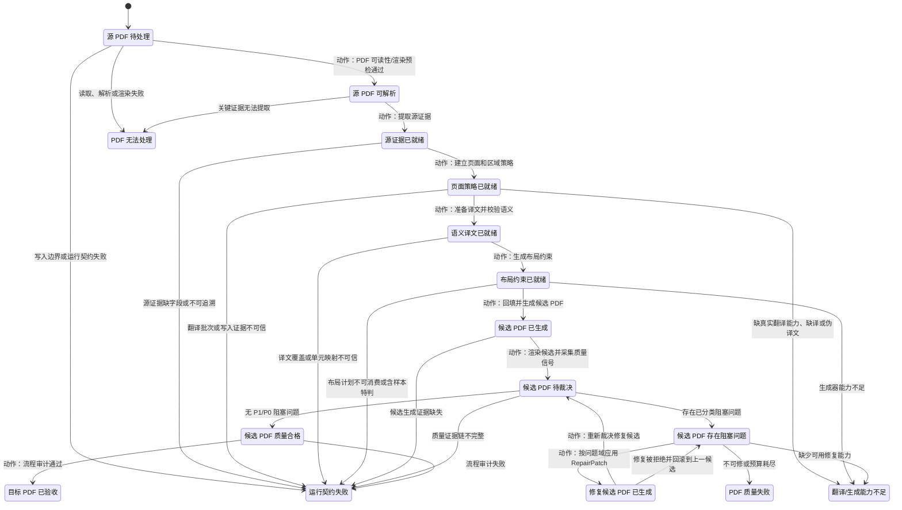

### 3.1 人话执行流程

当前流程按下面顺序执行：

1. **先确认边界**：确认这次要翻译哪个 PDF、目标语言是什么、输出到哪里、哪些文件允许写，避免执行器越界写文件或偷读参考答案。
2. **再确认工具能不能干活**：检查 PDF 提取、渲染、字体和生成能力；工具不够就停，不生成假结果。
3. **然后提取原文证据**：把源 PDF 的页面尺寸、文字、bbox、字号、颜色、图片、背景和渲染图提取出来，作为后续判断依据。
4. **判断页面怎么处理**：区分正文、图文、表格、指标页、封面/视觉页等，不同页面走不同布局约束。
5. **生成或接收译文**：把文本组织成翻译单元，得到目标语译文，并校验不是 placeholder、伪译文或缺译。
6. **生成布局计划**：用原文证据和译文生成可执行的布局计划；bbox 是锚点和擦除依据，不是所有目标语文本的死框。
7. **生成候选 PDF**：擦除源语文字，回填目标语文字，得到候选 PDF；候选 PDF 不等于通过。
8. **对比原文和候选**：采集文字溢出、字号失真、区域重叠、背景残留、表格破坏、图片遮挡等质量信号。
9. **分层研判主问题**：先判断“是什么问题”，再绑定“用什么 repair atom 修”，不能一个大 prompt 同时决定全部事情。
10. **只修一个主阻塞问题**：进入修复循环后，只针对本轮选中的 failure class 生成 RepairPatch。
11. **修后必须重验**：修复候选重新生成、重新采集质量信号、重新对比原文。
12. **修坏就回滚**：如果目标问题变好但其他硬问题恶化，例如文字不溢出了但区域重叠更多，就拒绝修复并回滚到上一候选。
13. **最后审计流程**：无论通过还是失败，都检查状态 trace、工具日志、提示词/模型记录、写入边界和反过拟合证据。

## 4. PDF 状态契约

### 4.1 状态契约模板

每个 PDF 状态必须能回答这些问题：

| 字段 | 含义 |
|---|---|
| `pdf_state` | PDF 产物状态名 |
| `machine_state_id` | 兼容旧 runner 的机器步骤 ID，可为空 |
| `state_invariant` | 状态成立时必须一直为真的事实 |
| `attached_artifacts` | 支撑该状态的证据文件 |
| `allowed_actions` | 该状态下允许执行的动作 |
| `transition_guards` | 迁移到下一状态的条件 |
| `failure_targets` | 失败后进入哪个 PDF 终态 |
| `trace_required` | 需要写进 state trace、operation log、decision log 的内容 |

### 4.2 PDF 状态契约表

| PDF 状态 | 兼容机器步骤 | 状态成立条件 | 允许动作 | 正常迁移 | 失败迁移 |
|---|---|---|---|---|---|
| 源 PDF 待处理 | `S0/S1/S2` 准备动作之后 | 输入 PDF 存在，尚未证明可解析 | PDF 可读性和渲染预检 | 源 PDF 可解析 | PDF 无法处理 / 运行契约失败 |
| 源 PDF 可解析 | `S2_ToolProbe` | 页数、页面尺寸、基础渲染可用 | 提取源证据 | 源证据已就绪 | PDF 无法处理 |
| 源证据已就绪 | `S3_SourceExtract` | 源文本、bbox、字号、颜色、图片、背景和渲染证据完整 | 建立页面策略 | 页面策略已就绪 | 运行契约失败 |
| 页面策略已就绪 | `S4_PageStrategy` | 页面类型、区域角色、结构约束可追溯 | 准备译文 | 语义译文已就绪 | 翻译/生成能力不足 / 运行契约失败 |
| 语义译文已就绪 | `S5_TranslationPlan` | 译文覆盖完整，非 placeholder，语义校验通过 | 生成布局约束 | 布局约束已就绪 | 翻译/生成能力不足 / 运行契约失败 |
| 布局约束已就绪 | `S6_LayoutPlan` | 布局计划可消费，无样本特判 | 生成候选 PDF | 候选 PDF 已生成 | 翻译/生成能力不足 / 运行契约失败 |
| 候选 PDF 已生成 | `S7_GenerateCandidate` | 候选 PDF、生成证据、擦除/插入记录存在 | 质量裁决 | 候选 PDF 待裁决 | 运行契约失败 |
| 候选 PDF 待裁决 | `S8_VerifyProductQuality` | 候选可渲染，具备源/候选对比证据 | 采集质量信号并归类问题域 | 候选 PDF 质量合格 / 候选 PDF 存在阻塞问题 | 运行契约失败 |
| 候选 PDF 存在阻塞问题 | `S8` 裁决产物 | P1/P0 问题域已分类，主 failure class 已选择 | 选择 repair family 并生成 RepairPatch | 修复候选 PDF 已生成 | PDF 质量失败 / 翻译/生成能力不足 |
| 修复候选 PDF 已生成 | `Lx_RepairLoop` | repaired candidate、repair patch、repair loop 记录存在 | 重新质量裁决 | 候选 PDF 待裁决 / 候选 PDF 存在阻塞问题 | PDF 质量失败 |
| 候选 PDF 质量合格 | `S8` 通过产物 | 无 P1/P0 阻塞问题 | 流程审计 | 目标 PDF 已验收 | 运行契约失败 |
| 目标 PDF 已验收 | 成功终态 | 产品质量和流程契约均通过 | 无 | 结束 | 无 |
| PDF 质量失败 | 失败终态 | 产品质量不过且不可修或预算耗尽 | 无 | 结束 | 无 |
| PDF 无法处理 | 失败终态 | 源 PDF 不可读、不可渲染或关键证据不可提取 | 无 | 结束 | 无 |
| 翻译/生成能力不足 | 失败终态 | 缺真实翻译、缺生成器能力或缺修复能力 | 无 | 结束 | 无 |
| 运行契约失败 | 失败终态 | 过程证据、写入边界、反过拟合或审计不可信 | 无 | 结束 | 无 |

## 5. 旧机器步骤内部活动流

本节不是新的顶层状态机，而是旧机器步骤的内部活动流。顶层 PDF 状态迁移只看第 3 节；本节只记录执行器为了把 PDF 从一个产物状态迁移到下一个产物状态，内部按什么步骤采集证据、归一信号、研判、绑定工具或生成产物。

### 5.1 生成翻译计划（机器状态 `S5_TranslationPlan`）

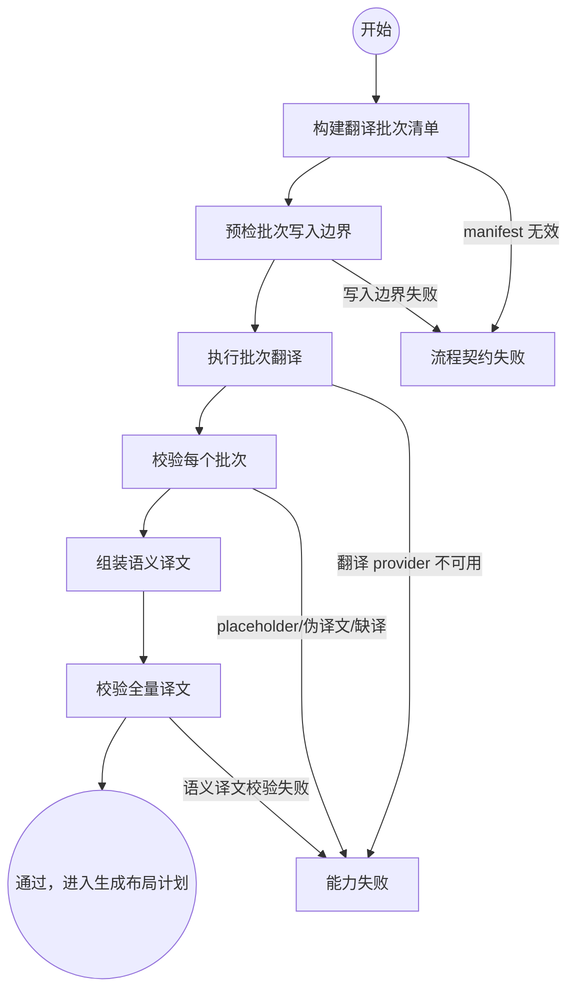

生成翻译计划的关键规则：

1. 不允许把整份 PDF 作为无边界大 prompt 一次性翻译。
2. 每个 batch 写入 `prompt_instance.json`、`model_output.json`、`decision_record.json` 前必须有写入边界证据。
3. 只有全量 `validate_semantic_translations.py` 通过，才能进入“生成布局计划”。
4. 缺真实语义翻译能力时应停在“能力失败”，不能生成 product-quality placeholder。

### 5.2 生成布局计划（机器状态 `S6_LayoutPlan`）

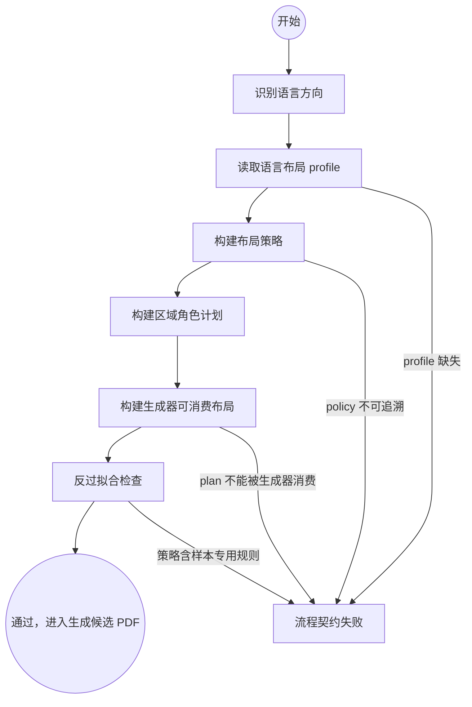

生成布局计划的关键规则：

1. `layout_policy.json` 是布局行为入口，不允许生成器把主要策略隐藏在代码常量里。
2. `role_plan.json` 必须基于当前页字体、bbox、颜色、结构和语义单元。
3. `layout_plan.json` 必须是 generator-consumable，而不是只给人看的计划。
4. 中译英和英译中可以使用不同 language profile，但 profile 必须是开口契约，不得依赖样本固定值。
5. bbox 是源文本的擦除、阅读顺序和 anchor 证据；对 `fluid_body/body_flow`，目标文本框可以按当前页面可用空间重排。

### 5.3 验证产品质量（机器状态 `S8_VerifyProductQuality`）

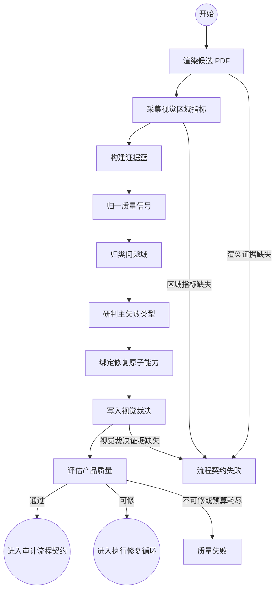

验证产品质量是多信号融合状态，不是“看一眼截图”。它必须把工具事实收敛为结构化问题。

建议使用 V4 的内部概念，但挂在“验证产品质量”下面：

| V4 概念 | 在验证产品质量中的作用 |
|---|---|
| `EvidenceBasket` | 汇总 source extraction、candidate evidence、visual metrics、render/crop 证据 |
| `QualitySignal` | 把 gate/视觉/结构问题标准化为 signal |
| `TriageRequest` | 把候选 failure class、证据摘要和预算交给研判 |
| `TriageResult` | 选择主要 failure class，或要求补采证，或拒绝修复 |
| `BindingRequest` | 根据 failure class 找到可用 repair atom 和参数口 |
| `BindingResult` | 输出可执行 repair plan |
| `JudgeDecision` | 对外唯一判断结果：通过、修复、补采证、失败 |

### 5.4 执行修复循环（机器状态 `Lx_RepairLoop`）

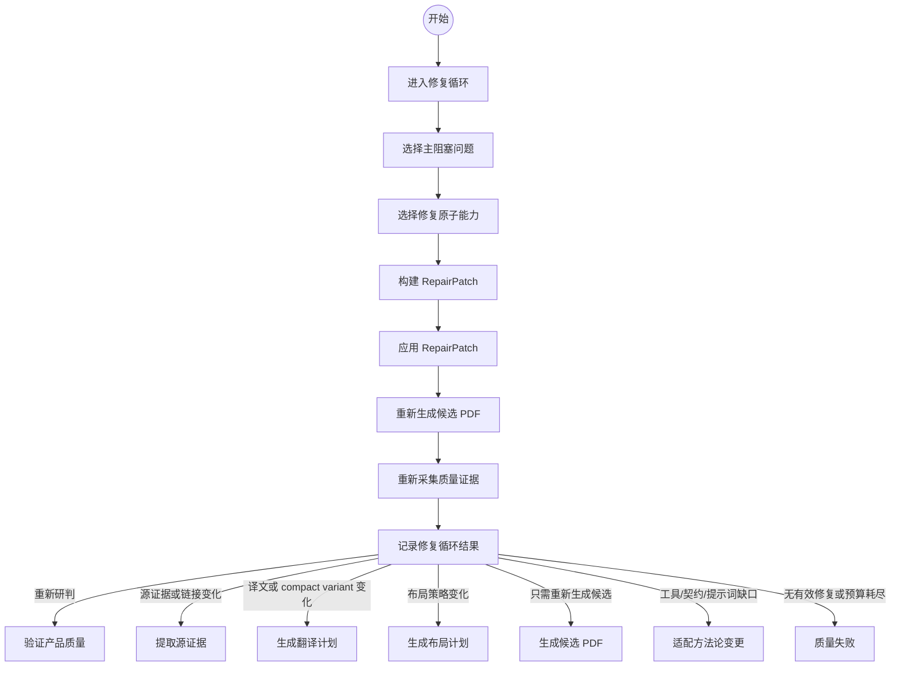

执行修复循环的关键规则：

1. 每次 loop 只选择一个主 failure class。
2. `visual_repair_plan.json` 只是计划，不代表 loop 已执行。
3. 进入执行修复循环后必须写 `repair_loop_<n>.json`。
4. 可执行修补必须通过 `build_repair_patch.py -> apply_repair_patch.py`。
5. `operation_count=0` 是 no-op，不能算有效修复。
6. 修补后必须重新生成候选并重新进入“验证产品质量”。

注意：本节图里的“选择主阻塞问题”“绑定修复原子能力”“重新采集质量证据”都是执行动作，不是 PDF 产物状态，也不是问题对象状态。真正的问题对象状态机见第 7.10 节。

### 5.5 适配方法论变更（机器状态 `Ax_AdaptiveChange`）

适配方法论变更不是产品修补状态，而是方法论修补状态。

进入适配方法论变更的场景：

1. failure class 无法映射到 repair atom。
2. repair atom 存在但工具没有实现。
3. 现有提示词无法表达必要判断。
4. 现有质量 gate 无法采集足够证据。
5. 现有状态契约不能描述真实必要迁移。

适配方法论变更必须产出：

| 产物 | 含义 |
|---|---|
| `adaptive_change_record.json` | 触发原因、假设、改动范围、验证方式 |
| before/after manifest | 改动前后文件哈希 |
| verification result | 小幅改动是否验证通过 |
| backport recommendation | 是否建议合入 core |

## 6. 执行动作对应的采集工具、判断工具、修补工具

本节记录“怎么把 PDF 从一个状态迁移到另一个状态”。这里的行是执行动作，不是 PDF 状态。

| 执行动作 | 兼容机器步骤 | 改变的 PDF 状态 | 采集工具 | 判断工具/提示词 | 生成工具 | 修补工具 | 主要产物 |
|---|---|---|---|---|---|---|---|
| 运行准备 | `S0/S1/S2` | 不改变 PDF 状态，只验证执行边界 | 文件系统、用户输入、`tools/probes/tool_probe.py` | 规则检查、路径 containment 检查 | 无 | 无 | `run_request.json`、`workspace_boundary_preflight.json`、`tool_probe.json` |
| PDF 可读性和渲染预检 | `S2_ToolProbe` | 源 PDF 待处理 -> 源 PDF 可解析 | PDF 页数、尺寸、渲染 smoke test | 规则检查 | 无 | 无 | `tool_probe.json`、render smoke evidence |
| 提取源证据 | `S3_SourceExtract` | 源 PDF 可解析 -> 源证据已就绪 | `extract_pdf_structure.py`、`render_pdf.py` | 规则检查 | 源 PNG | 可回源证据重建 | `source_extraction.json`、source render manifest |
| 建立页面策略 | `S4_PageStrategy` | 源证据已就绪 -> 页面策略已就绪 | 读取源证据产物 | `D1_page_strategy.prompt.json` 或 Codex 结构化判断 | `page_strategy.json` | 无 | 页面类型、区域角色、结构约束 |
| 准备语义译文 | `S5_TranslationPlan` | 页面策略已就绪 -> 语义译文已就绪 | `build_translation_batch_manifest.py` | `D2_translation.prompt.json`、translation validators | `materialize_d2_translation_batches.py`、`assemble_semantic_translations.py` | 补 batch、补 compact variant | batch artifacts、semantic translations |
| 生成布局约束 | `S6_LayoutPlan` | 语义译文已就绪 -> 布局约束已就绪 | 源证据、页面策略、译文、language profile | `D4_layout_plan.prompt.json` | `build_layout_policy.py`、`build_role_plan.py`、`build_layout_plan.py` | policy/role/layout repair | `layout_policy.json`、`role_plan.json`、`layout_plan.json` |
| 回填生成候选 PDF | `S7_GenerateCandidate` | 布局约束已就绪 -> 候选 PDF 已生成 | 源证据、译文、布局计划 | 规则检查 | `generate_semantic_backfill.py` | generation evidence linkage、background/fit repair | candidate PDF、generation evidence |
| 质量裁决 | `S8_VerifyProductQuality` | 候选 PDF 已生成 -> 候选 PDF 质量合格 或 候选 PDF 存在阻塞问题 | `render_pdf.py`、`collect_visual_region_metrics.py`、`render_source_output_crop.py` | `D5_D7_quality_gate.prompt.json`、`write_visual_adjudication.py`、`evaluate_pdf_quality.py` | quality artifacts | 触发执行修复动作 | metrics、adjudication、quality gates |
| 执行修复动作 | `Lx_RepairLoop` | 候选 PDF 存在阻塞问题 -> 修复候选 PDF 已生成 | 读取 failure evidence | `D8_repair_selection.prompt.json`、repair matrix | `build_repair_patch.py`、`apply_repair_patch.py` | repair atom 执行 | repair patch、repair loop record、repaired candidate |
| 适配方法论变更 | `Ax_AdaptiveChange` | 不直接改变 PDF 质量状态，改变工具/契约/提示词能力 | `collect_change_manifest.py` | Codex 方法论判断 | 文档/工具/提示词小幅改动 | apply_patch 仅用于代码/文档 | adaptive change record |
| 流程审计 | `S9_VerifyProcessContract` | 候选 PDF 质量合格 -> 目标 PDF 已验收 或 运行契约失败 | `validate_process_artifacts.py`、`scan_core_overfit.py` | `D9_final_acceptance.prompt.json` | final report | 无 | process validation、anti-overfit、final acceptance |

## 7. 多信号融合规则

### 7.1 信号来源

“验证产品质量”必须至少融合这些信号：

| 信号来源 | 说明 |
|---|---|
| 语义信号 | `semantic_translation_validation.json`、translation coverage、placeholder/pseudo translation 检查 |
| 生成信号 | redaction count、inserted unit count、layout plan consumed、layout execution |
| 字体层级信号 | source/output font hierarchy、role-relative ratio |
| 几何信号 | bbox、插入框、source anchor order、region collision |
| 结构信号 | table/grid/chart/matrix/sidebar/event card 是否保留结构 |
| 背景信号 | redaction fill、background delta、wide line residue、image overlay protection |
| 可读性信号 | title/body/table/note/sidebar/legend/card readability |
| 页面整体信号 | full-page render、crop comparison、visual similarity |

### 7.2 信号标准化

每个问题先标准化为 `QualitySignal`：

```json
{
  "problem_domain": "text|layout|image_background|table_structure|semantic|process|typography|page_rhythm",
  "axis": "layout|content|visual|structure|background|process",
  "defect_type": "line_fragmentation",
  "failure_class": "text_fit_overflow",
  "severity": "blocking|warning|info",
  "unit_ids": ["..."],
  "evidence_ids": ["..."],
  "judge_mechanism": "rule|visual_diff|layout_metric|model_adjudication|hybrid",
  "repair_family_hint": "expand_or_reflow_slot",
  "target_state_hint": "生成布局计划",
  "repairability": "repairable|unrepairable|needs_more_evidence",
  "source": "rule|model|human|tool"
}
```

### 7.2.1 质量信号采集总图

`QualitySignal` 不是一个黑盒判断。它必须由当前运行的源 PDF、候选 PDF 和中间证据逐层生成。执行器在报告中必须能说明每个信号来自哪个工具、哪个 JSON 字段、哪个判断函数或提示词槽位。

```mermaid
flowchart TD
  src_pdf[源 PDF] --> s3_extract[S3 extract_pdf_structure.py]
  src_pdf --> src_render[render_pdf.py 源页渲染]
  candidate_pdf[候选 PDF] --> cand_render[render_pdf.py 候选页渲染]
  s3_extract --> source_extraction[source_extraction.json<br/>pages[].text_lines[].line_id/bbox/font_size/color]

  layout_plan[layout_plan.json] --> generation[generate_semantic_backfill.py]
  translations[semantic_translations.json] --> generation
  generation --> gen_evidence[candidate_generation_evidence.json<br/>insertions/redactions/background_covers/translation_quality]
  generation --> candidate_pdf

  source_extraction --> vrm[collect_visual_region_metrics.py]
  src_render --> vrm
  cand_render --> vrm
  gen_evidence --> vrm
  candidate_pdf --> vrm
  src_pdf --> vrm
  vrm --> visual_region_metrics[visual_region_metrics.json<br/>page_metrics/region_metrics/redaction_metrics/background_cover_metrics/role_gates]

  visual_region_metrics --> d7[write_visual_adjudication.py]
  d7 --> visual_adjudication[visual_adjudication.json<br/>dimensions/verdict/blocking_failure_count]

  gen_evidence --> eval[evaluate_pdf_quality.py]
  visual_region_metrics --> eval
  visual_adjudication --> eval
  src_pdf --> eval
  candidate_pdf --> eval
  eval --> product_gates[product_quality_gates.json<br/>gates/page_metrics/blocking_failure_count]

  visual_region_metrics --> materialize[QualitySignal 归一化]
  product_gates --> materialize
  visual_adjudication --> materialize
  materialize --> issue_state[LayoutIssue 状态机]
```

关键约束：

1. `QualitySignal` 的源头必须是当前 run 的证据文件，不能来自人工对照 PDF、历史 round 截图或记忆。
2. `visual_region_metrics.json` 是视觉问题的主证据篮，`product_quality_gates.json` 是产品阻断口，二者缺一不可。
3. `write_visual_adjudication.py` 只是把 `role_gates` 物化为 D7 裁决；如果后续接入模型裁决，也必须输出同样的 `dimensions` 和 evidence refs。
4. 执行报告必须列出每个阻塞 `QualitySignal` 的 `producer_tool`、`producer_function_or_prompt`、`source_json_path`、`evidence_refs`、`threshold_or_rule_id`、`repair_atom_hint`。

### 7.2.2 代码级信号生产者表

| 信号层 | 生产工具/函数 | 读取字段 | 输出字段 | 典型 `QualitySignal.failure_class` |
|---|---|---|---|---|
| 源文本基线 | `extract_pdf_structure.py` | PDF text blocks、line bbox、font size、color | `source_extraction.pages[].text_lines[]` | `source_relative_visual_baseline_fail` |
| 候选生成账 | `generate_semantic_backfill.py` | `layout_plan`、译文、源 bbox | `candidate_generation_evidence.insertions[]`、`redactions[]`、`background_covers[]` | `candidate_generation_fail`、`text_fit_overflow`、`background_residue_artifact` |
| 页面基础质量 | `evaluate_pdf_quality.evaluate` | source/output PDF page count、page rect、文本层 | `gates[page_count/page_geometry/text_residue]`、`page_metrics[]` | `page_count_fail`、`page_geometry_fail`、`source_text_residue_fail` |
| 语义质量 | `evaluate_pdf_quality.evaluate` + `validate_semantic_translations.py` | `generation_evidence.translation_provider`、`semantic_coverage`、`semantic_translation_validation` | `gates[translation_authenticity/semantic_coverage/semantic_translation_preflight]` | `semantic_translation_authenticity_fail`、`semantic_coverage_fail` |
| 区域角色判断 | `collect_visual_region_metrics.region_role` | `insertions[].region_kind/page_type_guess/bbox`、页面 rect、源背景 | `region_metrics[].quality_role`、`gate_id` | role gate 失败前置条件 |
| 源相对字号 | `source_line_index` + `source_stats_for_insertion` | `source_extraction.text_lines[line_id].font_size/bbox`、`insertions[].unit_ids` | `source_median_font_size`、`source_union_bbox`、`output_to_source_font_ratio` | `font_hierarchy_ratio_mismatch`、`title_readability_fail` |
| 文本装载状态 | `status_for_region` | `insertions[].status/font_size/horizontal_compression_ratio`、role rules | `region_metrics[].status/reasons/repair_atoms` | `text_fit_overflow`、`body_paragraph_readability_fail` |
| 背景/擦除 | `status_for_region`、redaction loop、background cover loop | `background_delta`、`inner_background_delta`、`text_image_background_delta`、`redactions[].fill_color`、`background_covers[].draw_mode` | `redaction_metrics[]`、`background_cover_metrics[]`、`role_gates[background_residue_artifact]` | `background_delta_fail`、`background_residue_artifact` |
| 插入框碰撞 | `rect_overlap_ratio` collision loop | `region_metrics[].bbox/page_index/region_id` | `role_gates[insertion_collision]` | `insertion_collision_fail` |
| 图片颜色完整性 | `page_color_metrics` | source/output page render、embedded image count | `page_metrics[].image_color_status`、`role_gates[image_color_integrity]` | `image_color_integrity_fail` |
| 矩阵/表格图保护 | matrix region scan | `region_metrics[].page_type_guess/region_kind/generation_status/status` | `role_gates[matrix_diagram_integrity]` | `matrix_diagram_integrity_fail` |
| D7 视觉裁决 | `write_visual_adjudication.dimension_from_gate` | `visual_region_metrics.role_gates[]` | `visual_adjudication.dimensions[]` | 与 `gate_id` 同名或映射后的 failure class |
| 产品阻断汇总 | `evaluate_pdf_quality.evaluate` | `visual_adjudication`、`visual_region_metrics.role_gates`、`generation_evidence` | `product_quality_gates.gates[]`、`blocking_failure_count` | 进入 `LayoutIssue` 的阻塞问题 |

### 7.2.3 区域级视觉信号细化图

```mermaid
flowchart TD
  insertion[gen_evidence.insertions[i]] --> role[region_role<br/>由 region_kind/page_type/bbox/背景判定 role]
  insertion --> source_stats[source_stats_for_insertion<br/>unit_ids -> source line_id -> font_size/bbox]
  insertion --> crop[scaled_box + source/output crop]

  crop --> bg[edge_dominant_rgb / dominant_rgb / color_delta]
  bg --> bg_fields[background_delta<br/>inner_background_delta<br/>text_image_background_delta<br/>background_residue_delta]

  role --> status[status_for_region]
  source_stats --> status
  bg_fields --> status
  insertion --> status

  status --> region_metric[region_metrics[i]]
  region_metric --> role_bucket[role_gate_items[gate_id]]
  role_bucket --> role_gate[role_gates[]<br/>status/failure_count/warning_count/sample]
```

`status_for_region` 的代码级判断必须在报告中展开到这些维度：

| 判断分支 | 输入字段 | 判断结果 | 失败归因 |
|---|---|---|---|
| generation status 不可接受 | `insertions[].status in FAIL_STATUSES` | `region_metrics.status=fail` | 该 role 的默认 `repair_atom` |
| critical role 只达到 warning fit | `status in WARN_STATUSES` 且 role `critical=true` | fail | role readability failure |
| 源相对字号过低 | `output_to_source_font_ratio < fail_source_ratio` | fail | `font_hierarchy_ratio_mismatch` 或 role readability failure |
| 绝对字号地板 | `font_size < fail_font_pt` 且 role 声明 `absolute_font_floor_blocks=true` | fail | role readability failure；默认不允许全局固定字号阻断 |
| 文本图像压缩过度 | `horizontal_compression_ratio < fail_horizontal_compression_ratio` | fail | constrained text image readability failure |
| 背景边缘色差 | `background_delta` 超过当前常量阈值 | fail/warn | `background_delta_fail`，但 label 类需看 inner/residue 是否也失败 |
| 内部背景色差 | `inner_background_delta` 超过当前常量阈值 | fail/warn | `background_residue_artifact` |
| 文本图像底色差 | `text_image_background_delta` 超过当前常量阈值或缺 `image_background_color` | fail/warn | `background_residue_artifact` |
| 背景残留 | `background_residue_delta - source_residue_delta` 达到当前常量阈值 | fail/warn | `background_residue_artifact` |

这里的阈值名来自代码常量或 `ROLE_RULES`。它们可以作为通用规则存在，但执行报告必须写出“当前页/当前角色的实际阈值和值”，不能只写“质量信号失败”。

### 7.2.4 背景、擦除、图片保护信号细化图

```mermaid
flowchart TD
  redaction[gen_evidence.redactions[i]] --> ring[ring_dominant_rgb<br/>源/候选局部环形背景采样]
  redaction --> fill[fill_color / redaction_fill_mode]
  ring --> redaction_metric[redaction_metrics[i]]
  fill --> redaction_metric
  redaction_metric --> wide[wide_line_patch_risk]
  redaction_metric --> fill_delta[redaction_fill_delta + patch_score]

  cover[gen_evidence.background_covers[i]] --> cover_metric[background_cover_metrics[i]]
  cover_metric --> draw_mode[draw_mode / area_pt2 / saturation / source_fill_delta]

  page_render[源/候选整页 render] --> page_color[page_color_metrics]
  page_color --> image_gate[role_gates.image_color_integrity]

  redaction_metric --> residue_gate[role_gates.background_residue_artifact]
  cover_metric --> residue_gate
  region_background[region_metrics background fields] --> residue_gate
```

背景类问题的代码级判定必须分清三类：

| 子类 | 证据字段 | 触发条件 | 修复族 |
|---|---|---|---|
| redaction fill 不匹配 | `redaction_metrics[].redaction_fill_delta`、`patch_score`、`covered_by_background_cover` | 当前填充色和局部源背景差异形成可见补丁 | `background_residue_fill_resample` |
| 宽行擦除带风险 | `wide_line_patch_risk=true` | 彩色背景上的长窄 redaction 未被 background cover 覆盖 | `background_residue_fill_resample` |
| solid cover 造块 | `background_cover_metrics[].draw_mode=solid_vector_fill`、`area_pt2`、`source_background_saturation/source_fill_delta` | 大面积或高饱和背景用实心色覆盖 | `background_residue_fill_resample` |
| 文本图像底色不匹配 | `text_image_background_rgb` 缺失或 `text_image_background_delta` 过大 | constrained/rotated text image 背景可见 | `background_residue_fill_resample` |
| 图片层被破坏 | `page_metrics[].source_image_count/output_image_count`、`mean_rgb_delta` | 候选嵌入图片减少或整页颜色差过大 | `image_redaction_exclusion_repair` |

照片内部文字默认保护；浮在图片或色块上的可抽取 PDF 前景文字仍然进入翻译回填。判断依据只能是当前页文本层、image block、bbox overlap、局部像素采样和生成证据，不能用“看起来在图片上”一刀切。

### 7.2.5 表格、矩阵和图表信号细化图

```mermaid
flowchart TD
  page_strategy[page_strategy/page_type_guess] --> dense_kind{table_or_chart_dense<br/>matrix_or_table_diagram?}
  generation_insertions[insertions[].region_kind/status/bbox] --> dense_kind
  source_extraction[source text lines/bbox/font] --> dense_kind

  dense_kind --> matrix_scan[matrix region scan]
  matrix_scan --> matrix_gate[role_gates.matrix_diagram_integrity]

  generation_insertions --> table_role[region_role -> table_text/legend/short_label]
  table_role --> table_gate[table_text_legibility / legend_label_alignment / short_label_legibility]

  matrix_gate --> issue[QualitySignal]
  table_gate --> issue
```

当前 core 已有的确定性覆盖：

| 能力 | 当前证据 | 可以判定 | 不足 |
|---|---|---|---|
| `matrix_diagram_integrity` | `page_type_guess=matrix_or_table_diagram`、`region_kind`、`generation_status`、`region_metrics.status` | 矩阵页是否误走 `body_flow`、是否 fallback/失败 | 还不是完整表格网格检测 |
| `table_text_legibility` | `region_role=table_text`、字号、源相对字号、fit status、crop | 单元格/表头文字可读性 | 不能独立保证列线、数值列对齐 |
| `legend_label_alignment` | `region_role=legend`、fit/font/background/crop | 图例文字可读性 | swatch-label 绑定需要更细的图表检测 |
| `insertion_collision` | 不同 `region_metrics[].bbox` 重叠比例 | 插入框之间是否重叠 | 不能替代表格 cell 网格验证 |

因此，报告不能笼统说“表格通过”。如果只跑了当前 core，最多能说：表格文字可读性、插入框碰撞、矩阵页 body_flow 误用等通过；完整 `table_integrity` / `chart_integrity` 仍需要专门的 grid/cell/chart validator 或人工/模型裁决补证。

### 7.2.6 `QualitySignal` 物化契约

从工具产物进入 `LayoutIssue` 前，必须把 gate 或 region metric 物化为统一信号。推荐最小结构如下：

```json
{
  "signal_id": "qs_page003_region12_text_fit_overflow",
  "producer_tool": "collect_visual_region_metrics.py",
  "producer_function_or_prompt": "status_for_region",
  "source_json_path": "visual_region_metrics.region_metrics[12]",
  "page_index": 2,
  "region_id": "region_12",
  "problem_domain": "文字装载类",
  "failure_class": "text_fit_overflow",
  "severity": "P1",
  "status": "fail",
  "blocking": true,
  "observed_value": {
    "generation_status": "fallback_point_fit",
    "output_to_source_font_ratio": 0.48
  },
  "threshold_or_rule": {
    "role": "body",
    "fail_source_ratio": 0.62,
    "rule_source": "ROLE_RULES.body.fail_source_ratio"
  },
  "evidence_refs": [
    "candidate_generation_evidence.json#insertions[12]",
    "visual_region_metrics.json#region_metrics[12]",
    "source_extraction.json#pages[2].text_lines"
  ],
  "repair_atom_hint": "target_composition_body_reflow_repair",
  "repairability": "repairable",
  "anti_overfit_basis": "derived from current-run bbox, role, source font and output fit status"
}
```

物化规则：

1. `producer_tool` 和 `source_json_path` 必须精确到文件和数组项。
2. `observed_value` 必须写当前页实际观测值，不只写“失败”。
3. `threshold_or_rule` 必须写规则名或阈值来源；若阈值来自当前页统计，必须记录统计来源。
4. `problem_domain` 必须来自第 7.3 的闭集，不允许临时造域。
5. `failure_class` 必须能在第 8.2/8.3 找到 repair family；找不到就是“无可用修复能力”。
6. `repair_atom_hint` 是工具建议，不是最终裁决；最终工具仍由 Dispatch/Binding 阶段决定。
7. 如果同一个 gate 同时产生多个症状，必须保留多个 `QualitySignal`，再由 Triage 选择主阻塞问题。

### 7.3 问题域分级分类字典

“验证产品质量”不能只输出散乱的 failure class。每个问题必须先归入问题域，再按问题域选择判断机制、修复族和回跳状态。问题域是防止过拟合的核心：执行器不允许因为某个 PDF 的页码、文字或坐标特殊，就跳过问题域分类。

| 问题域 | 典型问题 | 必须证据 | 判断机制 | 默认修复族 | 默认目标状态 | 禁止做法 |
|---|---|---|---|---|---|---|
| 流程/证据类 | 缺状态 trace、缺工具日志、缺渲染证据、写入越界、候选 PDF 无生成证据 | `state_trace`、`operation_log`、`process_audit`、边界预检 | 规则检查、schema 检查、路径 containment 检查 | 无；必要时 `fix_process_artifact_or_contract` | 审计流程契约 / 适配方法论变更 | 用视觉质量修补掩盖流程缺证 |
| 语义/内容类 | 缺译、placeholder、伪译文、文本单元丢失、译文覆盖率不足 | 翻译单元清单、译文 JSON、语义校验报告 | 语义校验器、覆盖率规则、必要时模型裁决 | `retranslate_or_patch_translation_unit` | 生成翻译计划 | 把语义缺失误当成排版问题 |
| 文字装载类 | 文本溢出、截断、行碎片、单行过短、正文被压成很小字号 | 源/候选 bbox、字号、行数、装载率、文本单元 ID | text-fit 规则、行宽/高度利用率、源候选对比 | `expand_or_reflow_slot`、`body_flow_region_reflow` | 生成布局计划 | 只靠缩字体硬塞 |
| 字体层级类 | 标题不像标题、正文过小、脚注过大、层级比例失真 | 源/候选字号层级、role、颜色、粗细 | role-relative font ratio、层级差异规则 | `reflow_before_shrink`、`restore_role_font_hierarchy` | 生成布局计划 | 用固定字号或样本页参数 |
| 几何/布局类 | 区块重叠、段落间距异常、可用空白没利用、锚点漂移、阅读顺序混乱 | bbox、region graph、column/flow group、障碍物图 | 碰撞检测、间距统计、阅读顺序图、可用空间搜索 | `vertical_flow_relayout`、`obstacle_aware_reflow` | 生成布局计划 | 只扩大单个 bbox 不看邻居 |
| 表格/矩阵类 | 表头错乱、列宽破坏、数字对不齐、表格线穿字、单元格文字不可读 | 表格区域、行列线、单元格 bbox、数值对齐证据 | table grid 检测、cell occupancy、列对齐规则 | `table_region_reflow_or_preserve_table` | 生成布局计划 / 生成候选 PDF | 把表格当普通正文流式重排 |
| 图片/图形保护类 | 图片被擦、浮层文字误判为图片文字、图标/图例错位、照片内文字被替换 | image mask、绘图对象、文字层/图片层区分、crop 对比 | 图层判断、图片区域差异、OCR 仅作辅助 | `protect_image_layer_or_overlay_text` | 生成候选 PDF | 把浮在图片上的文字当成图片内文字跳过 |
| 背景/擦除类 | 擦除白块、背景色不一致、蓝底残留条、redaction 破坏渐变或照片 | redaction bbox、背景采样、源候选像素差、候选 crop | 背景采样差异、宽条残留检测、局部视觉 diff | `background_resample_or_redaction_limit` | 生成候选 PDF | 用固定颜色覆盖复杂背景 |
| 图表/图例类 | 饼图标签错位、图例不对齐、颜色与标签脱钩、图表文字遮挡 | 图表区域、legend swatch、label bbox、颜色绑定 | swatch-label proximity、颜色/标签绑定检查 | `chart_label_legend_relayout` | 生成布局计划 / 生成候选 PDF | 只移动文字不维护颜色绑定 |
| 页面节奏/审美类 | 段落过密或过散、页面上半部拥挤下半部空白、标题和正文比例不协调 | 页面空白分布、段落间距、字号分布、区域密度 | page density、white-space distribution、role rhythm | `page_rhythm_rebalance` | 生成布局计划 | 为追求原 bbox 相似牺牲阅读体验 |

### 7.4 问题严重度分级

每个 `QualitySignal` 必须带严重度。严重度决定是否进入修复循环，也决定修复失败时能否接受候选。

| 严重度 | 定义 | 示例 | 处理 |
|---|---|---|---|
| P0 流程阻断 | 证据链不可信，不能评价产品 | 写入越界、缺候选生成证据、缺渲染闭环 | 直接进入“流程契约失败”或“适配方法论变更” |
| P1 产品阻断 | 用户能肉眼看到严重质量问题 | 文本重叠、大片白块、表格错位、图片被擦、缺译 | 必须进入“执行修复循环”或“质量失败” |
| P2 产品警告 | 影响美观但不破坏阅读 | 段距略大、字号略小、局部不够齐 | 可进入修复循环，也可记录为 deferred |
| P3 信息项 | 不影响当前候选验收，但为后续优化提供线索 | 非关键色差、轻微节奏差异 | 记录，不阻塞 |

### 7.5 问题域到研判机制的分发规则

研判必须先看问题域，再选判断机制。模型可以参与审美或语义裁决，但不能绕开规则硬负面。

| 问题域 | 第一判断机制 | 第二判断机制 | 模型是否可裁决 | 说明 |
|---|---|---|---|---|
| 流程/证据类 | schema/路径/日志规则 | 无 | 不可覆盖规则 | 规则失败就是失败 |
| 语义/内容类 | 覆盖率和 placeholder 检查 | 语义模型裁决 | 可以 | 只在文本真实存在时判断语义质量 |
| 文字装载类 | fit/overflow/line metric | crop 视觉对比 | 可辅助 | 规则发现溢出时模型不能判 PASS |
| 字体层级类 | role-relative ratio | 源候选视觉层级对比 | 可辅助 | 不能用固定字号阈值替代源相对比例 |
| 几何/布局类 | 碰撞和间距图 | 页面密度/阅读顺序 | 可辅助 | 必须引用当前页 bbox 和邻接关系 |
| 表格/矩阵类 | grid/cell/line 检测 | 表格 crop 对比 | 可辅助 | 表格结构硬负面优先于普通 text-fit |
| 图片/图形保护类 | image/text layer 分离 | crop diff | 可辅助 | 浮在图片上的文字仍应翻译，照片内部文字默认保护 |
| 背景/擦除类 | 像素差/背景采样 | crop diff | 可辅助 | 大面积色块残留是硬负面 |
| 图表/图例类 | 颜色-标签绑定 | swatch/label 距离 | 可辅助 | 不能只看文字是否装下 |
| 页面节奏/审美类 | density/white-space metric | 模型审美裁决 | 可以 | 作为综合审美层，不替代硬 gate |

### 7.6 融合顺序

融合时按硬约束优先：

1. 过程证据缺失：直接进入“流程契约失败”。
2. 语义译文无效：回“生成翻译计划”，或进入“能力失败”。
3. 候选生成不真实：回“生成候选 PDF”，或进入“能力失败”。
4. 结构破坏：优先回“生成布局计划”或“生成候选 PDF”，不能只缩字体。
5. 背景/图片破坏：优先回“生成候选 PDF”。
6. 字体/密度/节奏问题：优先回“生成布局计划”。
7. 低置信度且证据不足：在“验证产品质量”内部补采证，不新增顶层 GATHER。
8. 阻塞问题可修：进入“执行修复循环”。
9. 无阻塞问题：进入“审计流程契约”。

### 7.7 多问题分发

一页可能同时存在多个问题，例如“文字过小且挤占图片”。处理规则：

1. 先判断是否存在 hard negative：图片破坏、表格结构破坏、语义缺失、过程证据缺失。
2. 再按“问题域优先级 + 因果优先级”选择一个主 failure class 进入本轮“执行修复循环”，而不是简单按数量多数投票。
3. 其他问题记录为 `deferred_failures`。
4. 如果一个 repair atom 可顺带修多个问题，允许执行，但必须记录主修和顺带修。
5. 修补后重新进入“验证产品质量”，而不是在“执行修复循环”内直接宣称成功。

默认问题域优先级：

| 优先级 | 问题域 | 原因 |
|---|---|---|
| 0 | 流程/证据类 | 证据不可信时不能评价产品 |
| 1 | 语义/内容类 | 缺译或伪译文不是排版问题 |
| 2 | 图片/图形保护类、背景/擦除类、表格/矩阵类 | 这些会造成明显硬负面，且经常被普通文字修复破坏 |
| 3 | 文字装载类、字体层级类、几何/布局类 | 这是大多数翻译回填的主修区域 |
| 4 | 图表/图例类、页面节奏/审美类 | 通常作为二阶视觉优化或综合审美修复 |

默认因果优先级：

| 优先级 | failure class | 原因 |
|---|---|---|
| 1 | `text_fit_overflow` | 译文未装入文本框会制造下游重叠、截断和字号压缩，是布局上游问题 |
| 2 | `font_size_regression` | 字号层级退化会影响可读性和后续视觉相似度 |
| 3 | `cross_slot_overlap` | 重叠通常是前两者或流式布局不足的下游症状；仅在没有上游 fit/font 问题时优先修 |

同一因果层级内再按当前运行的阻塞数量、严重度和页面覆盖面排序。

### 7.8 分层分级研判

本流程吸收 V4 的 JUDGE/REPAIR 思路，但不把所有判断塞进一个大 prompt。研判必须拆成可审计的层级：

| 层级 | 子状态 | 研判对象 | 允许输出 | 禁止输出 |
|---|---|---|---|---|
| 一级上下文研判 | 制定页面策略 / 生成布局计划 | 页面类型、区域角色、语言方向、可用空间、源字号层级 | page strategy、role plan、layout policy | 具体修补工具、样本特判 |
| 二级质量归一 | 验证产品质量：归一质量信号 | 源/候选 bbox、字体、颜色、重叠、背景、结构、语义覆盖 | `QualitySignal[]`、证据 ID、严重度 | repair 参数 |
| 三级 Triage | 验证产品质量：研判主失败类型 | 多个 `QualitySignal` 的主阻塞问题 | `failure_class`、证据是否充分、是否进入执行修复循环 | repair family、工具名、几何参数 |
| 四级 Dispatch | 验证产品质量：分发修复族 | `failure_class` 到允许修复族的映射 | `repair_family`、`target_state`、允许 operation type | 新造工具、绕开分发表 |
| 五级 Binding | 验证产品质量：绑定 RepairPatch | 当前运行证据、tool spec、layout plan | `RepairPatch` operations、rollback condition | 改变 failure class |
| 六级回测验收 | 执行修复循环 / 验证产品质量 | 修复前后同维度对比 | improved/unchanged/worse、next_state | 不重测直接宣称成功 |

关键规则：

1. `TriageResult` 只裁定“是什么病”，不裁定“用什么工具”。
2. `DispatchResult` 只能来自静态分发表或当前 run-local 契约，不允许由模型自由发挥。
3. `BindingResult` 只绑定参数，不能把 `font_size_regression` 改判成 `background_resample`。
4. 如果证据不足，留在“验证产品质量”内部补采证；`GATHER` 不是顶层状态。
5. 如果 failure class 无法映射 repair atom，进入“适配方法论变更”或“质量失败”，不能假修。

### 7.9 Repair 批次策略

修复不是“发现一个问题立刻随手改一个问题”。每个 loop 的批次策略如下：

1. 先按硬约束排序：过程缺证据、语义缺失、结构破坏、背景/图片破坏、布局节奏、字体层级。
2. 在当前 loop 只选择一个主 `failure_class`。
3. 对同一 `failure_class` 下的多个区域可以批量生成多个 operation。
4. 其他 failure class 写入 `deferred_failures`。
5. Patch 应用后必须重新生成候选 PDF，并重新运行“验证产品质量”的同一组信号采集。
6. 只有目标 failure class 改善，且 hard negative 与已修复轴没有回退，才算 loop 有效。
7. 若修复后目标轴未改善或其他硬轴回退，记录为 rollback/unchanged/worse，继续预算判断或失败。

### 7.10 排版问题诊断-修复-裁决状态机

本节才是“排版问题”的状态机。它的主体不是执行器，也不是整份 PDF，而是一个可审计的问题对象 `LayoutIssue`。
`LayoutIssue` 只在 PDF 处于“候选 PDF 待裁决”或“候选 PDF 存在阻塞问题”时创建；它描述当前候选 PDF 相对源 PDF 的具体问题、证据、修复状态和裁决状态。

V4 对本节的启发是：不要把证据、分诊、工具选择、参数绑定、修后裁决混在一个大 prompt 里。V4 的 `EvidenceBasket -> QualitySignal -> TriageRequest/TriageResult -> BindingRequest/BindingResult -> JudgeDecision -> BudgetState` 是一条问题闭环；在本流程里，这条闭环落成下面的问题对象状态机。

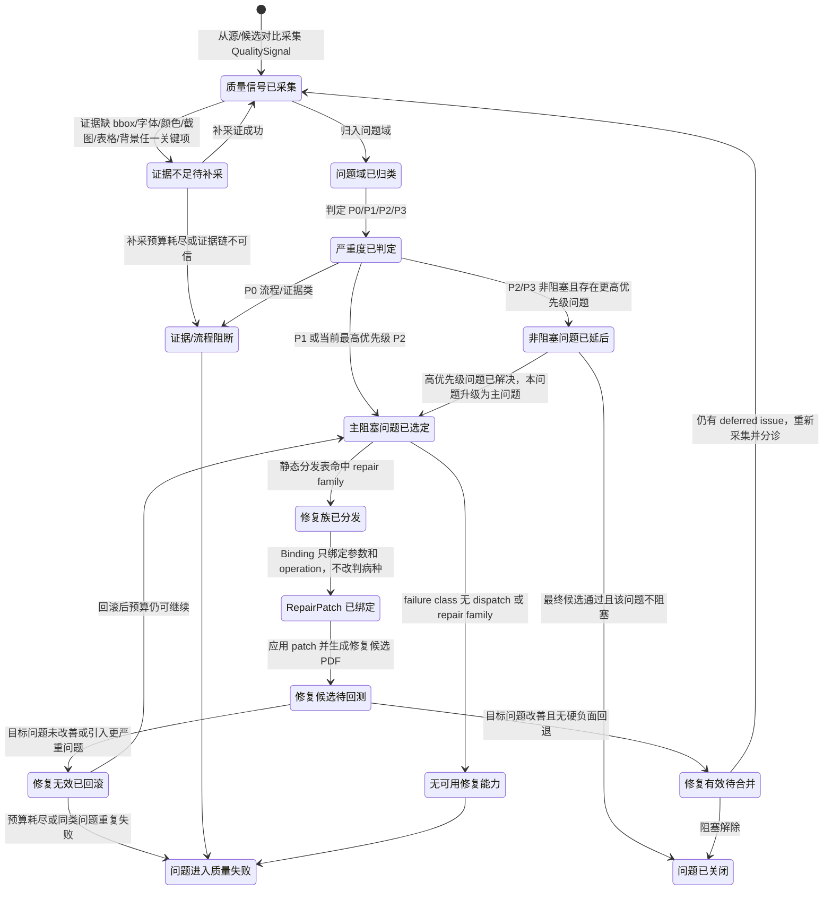

这张图的几个硬约束：

1. `质量信号已采集` 之前没有问题状态，只有候选 PDF 状态。
2. `问题域已归类` 之前不能选择工具；否则就是凭感觉修。
3. `Triage` 只把问题推进到“主阻塞问题已选定”，不允许输出具体工具参数。
4. `Dispatch` 只把问题推进到“修复族已分发”，必须来自静态分发表或 run-local 契约。
5. `Binding` 只把问题推进到“RepairPatch 已绑定”，只能调 repair knob，不能改病种。
6. `修复候选待回测` 必须重新采集同一类证据；不回测不能进入“修复有效待合并”。
7. 目标问题改善但图片、背景、表格、语义、流程任一硬负面恶化时，仍进入“修复无效已回滚”。

### 7.11 问题对象状态契约

| 问题对象状态 | 成立条件 | 必须证据 | 允许动作 | 下一迁移 |
|---|---|---|---|---|
| 质量信号已采集 | 源 PDF 和候选 PDF 已完成同页、同区域对比 | `QualitySignal[]`、源/候选 render、region metrics | 判断证据是否足够 | 证据不足待补采 / 问题域已归类 |
| 证据不足待补采 | 当前信号不能支撑问题域或严重度判断 | 缺失字段列表、补采预算 | 补采 bbox、字体、颜色、表格、背景、crop | 质量信号已采集 / 证据/流程阻断 |
| 问题域已归类 | 每个 signal 已落入固定问题域 | `problem_domain`、`failure_class`、`evidence_refs` | 判定严重度 | 严重度已判定 |
| 严重度已判定 | 每个问题有 P0/P1/P2/P3 | severity、blocking reason | 选择是否阻塞 | 非阻塞问题已延后 / 主阻塞问题已选定 / 证据/流程阻断 |
| 非阻塞问题已延后 | 问题存在但当前不是主阻塞 | deferred reason、优先级 | 等待主问题解决后重排队 | 问题已关闭 / 主阻塞问题已选定 |
| 主阻塞问题已选定 | 当前 loop 只选择一个主问题 | selected problem、因果优先级、deferred list | 查 dispatch | 修复族已分发 / 无可用修复能力 |
| 修复族已分发 | failure class 命中允许 repair family | dispatch entry、target state、tool spec | Binding 参数和 operation | RepairPatch 已绑定 |
| RepairPatch 已绑定 | repair family 已实例化为可执行 patch | patch operations、rollback conditions、anti-overfit statement | 应用 patch 并生成修复候选 | 修复候选待回测 |
| 修复候选待回测 | repaired candidate 已生成 | before/after candidate、repair loop record | 重新采集质量信号并裁决 | 修复有效待合并 / 修复无效已回滚 |
| 修复有效待合并 | 目标问题改善且硬负面未回退 | before/after 同维度指标、接受理由 | 合并为当前候选或继续处理 deferred | 问题已关闭 / 质量信号已采集 |
| 修复无效已回滚 | 修复无效、恶化或违反硬约束 | rejected candidate、rollback reason、accepted previous candidate | 重新 Triage 或失败 | 主阻塞问题已选定 / 问题进入质量失败 |
| 证据/流程阻断 | 证据链或写入边界不可信 | process audit、missing artifact list | 终止或进入方法论适配 | 问题进入质量失败 |
| 无可用修复能力 | 有问题但没有可派发 repair family | unmapped failure class、capability gap | 终止或进入方法论适配 | 问题进入质量失败 |
| 问题已关闭 | 问题不再阻塞最终候选 | closure reason、最终 gate summary | 无 | 结束 |
| 问题进入质量失败 | 当前 run 无法产出合格候选 | failure reason、预算状态 | 无 | 结束 |

### 7.12 V4 问题闭环到当前流程的映射

| V4 契约/能力 | 当前流程位置 | 解决的问题 | 不能越界做什么 |
|---|---|---|---|
| `EvidenceBasket` | 验证产品质量的证据篮 | 把源证据、候选证据、视觉指标、crop、修复结果放到同一个可重放事实集 | 不能塞人工参考答案、样本页码、固定文本 |
| `QualitySignal` | 质量信号标准化 | 把工具输出统一成问题域、failure class、严重度、证据引用 | 不能直接携带 repair 参数 |
| `TriageRequest/TriageResult` | 主问题分诊 | 在多个问题之间选择当前主阻塞问题，或要求补采证 | 不能输出工具名和参数 |
| `DispatchEntry/CHECKPOINT_CONTRACTS` | failure class 到 repair family/工具的静态分发表 | 保证“什么病用什么工具”可审计、可拒绝越权 | 不能靠模型临时发明工具 |
| `BindingRequest/BindingResult` | RepairPatch 绑定 | 只在已选工具的参数口里绑定 operation 和 repair knob | 不能改判问题域或 failure class |
| `JudgeDecision` | 对外裁决信封 | 收敛通过、修复、补采证、拒绝、证据引用和提示词版本 | 不能让多个 prompt 各自给最终结论 |
| `BudgetState` | loop 预算 | 限制分诊、绑定、补采证、修复轮数 | 不能无限 loop，也不能修坏后假装成功 |

### 7.13 问题域到诊断、修复、裁决的闭环表

| 问题域 | 诊断信号 | 主修复族 | 修后裁决口 | 硬负面 veto |
|---|---|---|---|---|
| 流程/证据类 | 缺 trace、缺产物、路径越界、schema 缺字段 | 不做产品修复；补契约或失败 | 证据链完整才可继续 | 任一 P0 直接 veto 产品通过 |
| 语义/内容类 | 缺译、placeholder、伪译文、coverage 不足 | `retranslate_or_patch_translation_unit` | `missing_segment_count=0` 且译文非 placeholder | 缺译不能用布局修复掩盖 |
| 文字装载类 | overset、截断、行碎片、装载率异常 | `expand_or_reflow_slot`、`body_flow_region_reflow` | 溢出下降、可读字号未破坏、行碎片下降 | 修后不能新增跨槽重叠、压图、表格破坏 |
| 字体层级类 | role font ratio 异常、标题/正文层级退化 | `restore_role_font_hierarchy`、`reflow_before_shrink` | 源候选层级差异收敛，文本仍装载成功 | 不能用大幅压缩正文换取层级相似 |
| 几何/布局类 | 区块重叠、锚点漂移、阅读顺序乱、空白未利用 | `obstacle_aware_reflow`、`vertical_flow_relayout` | 重叠下降、阅读顺序稳定、空白分布更合理 | 不能挤占图片、表格、页眉页脚等障碍物 |
| 表格/矩阵类 | 表头错列、线穿字、单元格占用异常、数字列不齐 | `table_region_reflow_or_preserve_table` | 表格线、列对齐、单元格可读性不退化 | 表格结构硬负面优先于普通正文 fit |
| 图片/图形保护类 | 图片层被擦、浮层文字未翻译、图标标签错位 | `protect_image_layer_or_overlay_text` | 图片像素差受控，浮层文字按文字层处理 | 照片内部文字默认保护，浮在图片上的文字不能跳过 |
| 背景/擦除类 | 白块、色差条、蓝底残留、渐变/照片背景被覆盖 | `background_resample_or_redaction_limit` | 局部背景差异下降，文本没有丢失 | 大面积背景破坏 veto 通过 |
| 图表/图例类 | swatch-label 脱钩、图例错位、图表标签遮挡 | `chart_label_legend_relayout` | 颜色-标签绑定保持，标签可读且不遮挡图形 | 不能只移动文字导致颜色绑定失真 |
| 页面节奏/审美类 | 上下密度失衡、段距异常、页面留白不合理 | `page_rhythm_rebalance` | density/white-space 更接近源页相对分布 | 不能为了节奏破坏 P1 硬约束 |

修后裁决必须按“同域目标改善 + 全局硬负面不回退”两道口同时通过。只修好了一个指标但把其他域修坏，按“修复无效已回滚”处理。

### 7.14 PDF 问题分级分类总模型

本节是后续执行器的核心。
PDF 回填质量问题必须先进入“问题域”，再进入“问题状态”，最后才允许选择工具。不能把所有视觉、文字、背景、图片、表格和语义问题塞给一个大提示词一次性裁决。

#### 7.14.1 问题域分层

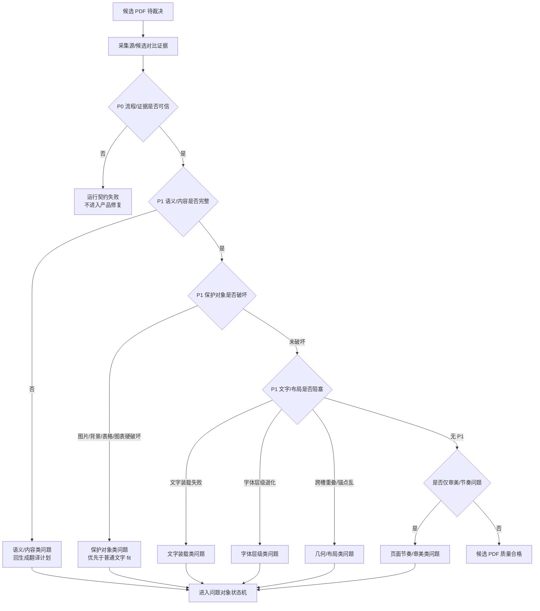

#### 7.14.2 严重度定义

| 严重度 | 含义 | 是否允许最终通过 | 典型问题 | 处理规则 |
|---|---|---|---|---|
| P0 | 流程或证据不可信 | 不允许 | 缺 state trace、写入越界、缺 source/candidate 证据、schema 缺必填 | 不做产品修复，先失败或进入方法论适配 |
| P1 | 产品硬阻塞 | 不允许 | 缺译、截断、严重重叠、表格破坏、图片被擦、背景大块残留 | 必须进入问题状态机并尝试可用 repair |
| P2 | 产品明显退化但可延后 | 视情况 | 字号略小、局部段距不佳、少量非关键 label 不齐 | 若有 P1，先 deferred；P1 清理后再处理 |
| P3 | 轻微审美差异 | 允许带 warn | 局部留白略多、非关键视觉节奏差异 | 只记录，不阻断，除非用户明确提高阈值 |

严重度不能由模型一句话给出。它必须由 `QualitySignal` 中的 `problem_domain`、`failure_class`、`source_candidate_delta`、`role_criticality`、`evidence_confidence` 一起确定。

### 7.15 分层研判状态机：从证据到修复，不走大提示词

`验证产品质量` 内部必须拆成四段。每段只能做自己的事。

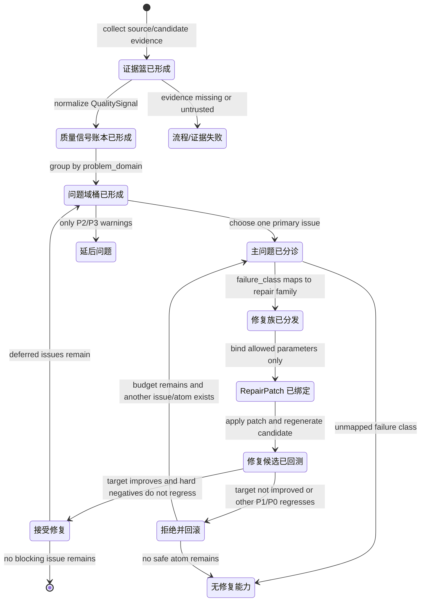

四段边界如下：

| 阶段 | 输入 | 输出 | 允许判断 | 禁止行为 | 当前对应工具/模板 |
|---|---|---|---|---|---|
| S8A 信号归一 | 源证据、候选证据、render/crop、generation evidence | `quality_signal_ledger.json` | 证据是否足够、信号属于哪个原始 gate | 选工具、改 layout、推翻语义 | `collect_visual_region_metrics.py`、`evaluate_pdf_quality.py`、`S8A_quality_signal_normalization.prompt.json` |
| S8B 问题分诊 | `QualitySignal[]`、问题域桶、页面策略 | `triage_result.json` | 主问题、严重度、deferred issues、是否补证据 | 输出工具参数、直接修复 | `S8B_quality_triage.prompt.json` 或确定性分诊 |
| S8C 修复分发/绑定 | `triage_result`、dispatch table、tool spec、当前 layout policy/plan | `dispatch_result.json`、`repair_patch_<n>.json` | failure class 到 repair family，绑定 operation 参数 | 改判问题域、发明工具、读人工对照 | `failure_dispatch_table.json`、`build_repair_patch.py`、`S8C_repair_patch_binding.prompt.json` |
| Lx 回测裁决 | before/after gates、before/after signals、patch application | `repair_loop_<n>.json` | 接受、回滚、继续、失败 | 只看目标指标而忽略硬负面 | `apply_repair_patch.py`、生成器、`Lx_repair_loop_execution.prompt.json` |

### 7.16 代码级问题域、信号、工具、状态映射

下表是执行器必须能落地的最小矩阵。没有进入这张表的问题，不能凭感觉修。

| 问题域 | 典型 failure class | 采证工具和关键字段 | 问题状态 | Triage 规则 | 修复工具/repair atom | 回跳 PDF 状态 | 修后接受条件 |
|---|---|---|---|---|---|---|---|
| 流程/证据类 | `missing_artifact`、`schema_invalid`、`workspace_escape`、`source_baseline_missing` | `validate_process_artifacts.py`、`validate_workspace_boundary.py`、`source_structure.json`、`generation_evidence.json` | `证据/流程阻断` | 任何 P0 直接阻断产品修复 | 无产品 repair；补契约或失败 | 运行契约失败 / 适配方法论变更 | 证据链补齐且 process gate PASS |
| 语义/内容类 | `translation_segment_missing`、`placeholder_translation`、`pseudo_translation`、`semantic_coverage_fail` | `validate_semantic_translations.py`、`semantic_translation_validation.json`、translation units | `语义问题已归类` | 缺译优先于布局问题 | `retranslate_or_patch_translation_unit`、`compact_translation_variant` | 语义译文已就绪 | coverage PASS，非 placeholder，token preservation PASS |
| 文字装载类 | `text_fit_overflow`、`target_text_clipped`、`line_fragmentation`、`tiny_text_fallback` | `generation_evidence.insertions[*].status/font_size`、`quality_gates.blocking_failures`、`visual_region_metrics.region_metrics` | `文字装载阻塞` | 是字体/重叠上游原因时优先 | `expand_or_reflow_slot`、`body_flow_region_reflow`、`line_break_rebalance` | 布局约束已就绪 | overflow/clipping 下降，字号不低于源相对下限，不新增 P1 重叠 |
| 字体层级类 | `font_size_regression`、`role_hierarchy_loss`、`metric_value_hierarchy` | `output_to_source_font_ratio`、`source_median_font_size`、`role_gates`、font quantile | `字体层级阻塞` | 如果文字未装载，先修装载；否则修层级 | `restore_role_font_hierarchy`、`metric_value_font_hierarchy_repair`、`reflow_before_shrink` | 布局约束已就绪 | role ratio 收敛，fit 不恶化，metric/header/body 层级保持 |
| 几何/布局类 | `cross_slot_overlap`、`insertion_collision`、`source_anchor_order_mismatch`、`unused_space_with_overflow` | `overlap_signals`、`insertion_collision` gate、bbox graph、source anchor order | `几何布局阻塞` | 若由 overflow 引发，可 deferred；若侵入保护对象则 P1 | `obstacle_aware_reflow`、`region_collision_layout_repair`、`vertical_flow_relayout`、`column_flow_rebalance` | 布局约束已就绪 | overlap 下降，阅读顺序不乱，表格/图片/背景不退化 |
| 表格/矩阵类 | `table_header_misalignment`、`cell_text_collision`、`matrix_diagram_integrity`、`table_region_intrusion` | `page_strategy.page_type`、drawing/table grid、`role_plan.table_cell`、`role_gates.table_text_legibility` | `表格矩阵阻塞` | 表格结构硬约束优先于普通正文 fit | `table_region_reflow_or_preserve_table`、`table_cell_text_fit`、`matrix_diagram_table_cell_preserve_repair` | 布局约束已就绪 / 候选 PDF 已生成 | 行列结构不破坏，表头/数字列可读且不串列 |
| 图片/图形保护类 | `image_content_erased`、`image_color_integrity`、`floating_text_on_image_untranslated`、`text_over_image_collision` | page image count、image bbox overlap、pixel delta、redaction records、overlay text layer | `图片图形阻塞` | 图片被擦是 P1；照片内文字和浮层文字分开 | `image_redaction_exclusion_repair`、`protect_image_layer_or_overlay_text`、`image_overlay_text_relayout` | 候选 PDF 已生成 / 布局约束已就绪 | 图片像素差受控，浮层文字翻译，照片内部文字不乱动 |
| 背景/擦除类 | `redaction_fill_mismatch`、`background_residue_artifact`、`wide_line_residue`、`text_image_background_delta` | `redaction_metrics`、`background_cover_metrics`、inner/ring background delta、crop evidence | `背景擦除阻塞` | 大面积色块/白条优先于普通审美 | `background_resample_or_redaction_limit`、`background_residue_fill_resample`、`redaction_scope_shrink` | 候选 PDF 已生成 | 背景 delta 下降，不丢文字，不覆盖图片/表格线 |
| 图表/图例类 | `legend_label_misalignment`、`swatch_label_binding_loss`、`chart_label_overlap` | swatch color bbox、legend label bbox、chart region bbox、role gate | `图表图例阻塞` | 颜色-标签绑定破坏是 P1 | `chart_label_legend_relayout`、`legend_swatch_label_binding` | 布局约束已就绪 / 候选 PDF 已生成 | swatch 和 label 仍绑定，标签不遮挡图形 |
| 页面节奏/审美类 | `page_density_imbalance`、`section_spacing_regression`、`visual_rhythm_loss`、`paragraph_density_mismatch` | page density、white-space band、paragraph gap、source/candidate rhythm vector | `页面节奏退化` | 只有 P1 清理后才处理 | `page_rhythm_rebalance`、`section_spacing_reflow` | 布局约束已就绪 | 密度和段距接近源页相对关系，不破坏 P1 硬约束 |

#### 7.16.1 必须物化的中间账本

为了避免“一个大 prompt 判断完但说不清为什么”，每轮 S8/Lx 至少写下面这些文件：

| 产物 | 目的 | 最小字段 | 如果缺失 |
|---|---|---|---|
| `evidence_basket.json` | 当前源/候选证据篮 | source refs、candidate refs、render refs、generation evidence refs、schema version | P0 流程/证据失败 |
| `quality_signal_ledger.json` | 全部质量信号账本 | signal_id、producer_tool、json_path、problem_domain、failure_class、severity、evidence_refs | 不允许 Triage |
| `problem_domain_buckets.json` | 按问题域聚合信号 | domain、severity_counts、blocking_count、sample_signals、upstream/downstream relation | 不允许选主问题 |
| `triage_result.json` | 主问题分诊结果 | selected_domain、selected_failure_class、selection_reason、deferred_failures、needs_more_evidence | 不允许 dispatch |
| `dispatch_result.json` | 病种到修复族映射 | dispatch_table、repair_family、target_state、allowed_operation_types、tool | 不允许绑定参数 |
| `repair_patch_<n>.json` | 可执行修复补丁 | operations、operation_count、scope、policy_context、rollback_conditions、anti_overfit_statement | 不允许修改布局或生成候选 |
| `repair_loop_<n>.json` | 修后裁决账本 | before/after by domain、target_delta、hard_negative_regressions、accepted/rejected、rollback reason | 不能声称修复执行过 |

当前 `round24/round25` 已经有其中一部分：`quality_signals.json`、`visual_adjudication.json`、`repair_patch_0001.json`、`repair_loop_0001.json`。
但它们还不够完整：缺少显式 `problem_domain_buckets.json` 和独立 `dispatch_result.json`，导致报告里仍然容易把 `text_fit_overflow`、`cross_slot_overlap`、`font_size_regression` 混在一个扁平 failure list 里。

### 7.17 问题状态与执行流程的对齐关系

执行器可以继续记录旧 `S0/S1/S2`，但真正驱动修复的状态必须来自问题对象。

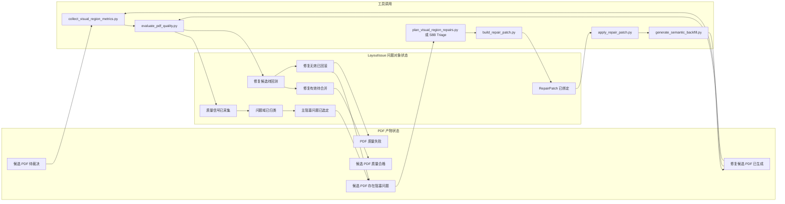

对齐规则：

1. `候选 PDF 待裁决` 进入 S8 后，必须产生 `LayoutIssue`，不能只有 `product_quality_verdict=FAIL`。
2. `LayoutIssue` 没进入 `主阻塞问题已选定`，不能调用 `build_repair_patch.py`。
3. `RepairPatch 已绑定` 之前，任何 layout policy 或 layout plan 变化都属于不可审计修改。
4. `修复候选 PDF 已生成` 必须重新跑同一套 S8 证据采集，不能复用修复前结论。
5. `修复有效待合并` 必须同时看目标问题和其他硬问题域。只看目标问题改善是不合格的。

### 7.18 真实 round 对照：round24、round25、core、round22 合入问题

本节来自当前磁盘实盘报告，不是推测。

#### 7.18.1 round24 真实状态链

证据文件：

| 证据 | 路径 |
|---|---|
| 最终裁决 | `pdf_translation_workflow_lab/rounds/round24_state_machine_repair_patch/reports/round24_final_verdict.json` |
| 运行报告 | `pdf_translation_workflow_lab/rounds/round24_state_machine_repair_patch/reports/round24_state_machine_repair_patch_report.md` |
| 修前信号 | `pdf_translation_workflow_lab/rounds/round24_state_machine_repair_patch/reports/quality_signals.json` |
| 修后信号 | `pdf_translation_workflow_lab/rounds/round24_state_machine_repair_patch/reports/quality_signals.repair0001.json` |
| RepairPatch | `pdf_translation_workflow_lab/rounds/round24_state_machine_repair_patch/reports/repair_patch_0001.json` |
| Loop 裁决 | `pdf_translation_workflow_lab/rounds/round24_state_machine_repair_patch/reports/repair_loop_0001.json` |

真实数据：

| 项 | 值 |
|---|---|
| 修前阻塞数 | 80 |
| 修前文字装载失败 | 9 个 `text_fit_overflow` |
| 修前跨槽重叠 | 70 个 `cross_slot_overlap` |
| Triage 选择 | `cross_slot_overlap` |
| Dispatch repair family | `vertical_flow_relayout` |
| RepairPatch operation | 33 个 `vertical_flow_relayout` operation |
| 修后阻塞数 | 102 |
| 修后跨槽重叠 | 92 |
| loop 结果 | `REJECTED_ROLLBACK` |
| 最终接受候选 | initial candidate，不是 repaired candidate |
| 产品终态 | `S_FAIL_QUALITY` |

状态解释：

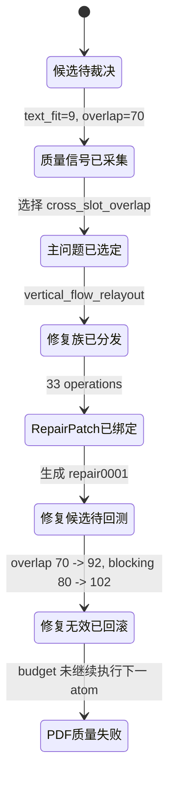

结论：

1. round24 的 RepairPatch 没有成功，真实状态是“修复无效已回滚”。
2. 如果某些页面视觉效果较好，主要来自 round22 系布局生成器/布局策略，而不是 round24 repair loop。
3. 失败根因是 `vertical_flow_relayout` 只按页/角色移动文本流，没有障碍物图、列内局部重排、表格/图片/页脚保护，所以移动一批区域会制造新的重叠。
4. 正确修复状态不应直接重试同一 atom，而应升级为 `obstacle_aware_reflow` 或进入“适配方法论变更”补工具。

#### 7.18.2 round25 真实状态链

证据文件：

| 证据 | 路径 |
|---|---|
| 批量摘要 | `pdf_translation_workflow_lab/rounds/round25_aia_first20_layered_validation/reports/round25_batch_summary.json` |
| 回归最终裁决 | `pdf_translation_workflow_lab/rounds/round25_aia_first20_layered_validation/reports/round25_final_verdict.json` |
| 回归运行报告 | `pdf_translation_workflow_lab/rounds/round25_aia_first20_layered_validation/reports/round25_state_machine_repair_patch_report.md` |
| 各 case 证据 | `pdf_translation_workflow_lab/rounds/round25_aia_first20_layered_validation/case_runs/*/reports/` |

三组 case 的真实结果：

| Case | 修前主要问题 | 选择主问题 | 修复后目标问题 | 硬负面回退 | loop 结果 |
|---|---|---|---|---|---|
| `R25_AIA_ZH_TO_EN_pages_001_020` | `text_fit_overflow=135`、`font_size_regression=26`、`cross_slot_overlap=140` | `text_fit_overflow` | `135 -> 2` | `cross_slot_overlap 140 -> 268` | `REJECTED_ROLLBACK` |
| `R25_AIA_EN_TO_ZH_pages_001_020` | `text_fit_overflow=95`、`font_size_regression=3`、`cross_slot_overlap=49` | `text_fit_overflow` | `95 -> 2` | `cross_slot_overlap 49 -> 132` | `REJECTED_ROLLBACK` |
| `R25_REGRESSION_00005_ZH_TO_EN_pages_001_020` | `text_fit_overflow=9`、`cross_slot_overlap=70` | `text_fit_overflow` | `9 -> 0` | `cross_slot_overlap 70 -> 78` | `REJECTED_ROLLBACK` |

状态解释：

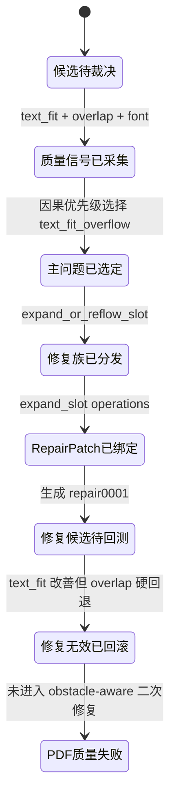

结论：

1. round25 比 round24 更诚实：它确实先修了上游 `text_fit_overflow`，且目标指标明显改善。
2. 但它仍然不是成功修复，因为简单扩框把文本推入邻接区域，导致 `cross_slot_overlap` 严重恶化。
3. 真正状态不是“没有响应”，而是“响应了、修了、回测失败、按规则回滚”。
4. 能力缺口是 `expand_or_reflow_slot` 缺少障碍物感知和同组流式重排。下一步 repair atom 应该读取邻接图、空白带、列带、保护对象，而不是只扩大当前 bbox。

#### 7.18.3 core 当前状态能力和缺口

当前 `pdf_translation_workflow_core` 已经具备这些可复用能力：

| 能力 | 当前文件 | 说明 |
|---|---|---|
| 主执行链路 | `tools/run_semantic_product_quality_round.py` | 已能跑提取、翻译、布局、生成、视觉 gate、RepairPatch loop |
| 工具契约 | `contracts/tool_contracts.md` | 已定义 redaction、generator、visual metrics、RepairPatch、反过拟合规则 |
| 状态契约 | `contracts/state_machine.md` | 已定义 S0-S9、Lx、Ax 和候选生成真实性 |
| 产品质量 gate | `contracts/product_quality_contract.md` | 已列出视觉/结构/语义 gate |
| 视觉信号采集 | `tools/validators/collect_visual_region_metrics.py` | 已生成 role gates、region metrics、redaction/background metrics |
| 质量裁决 | `tools/validators/evaluate_pdf_quality.py`、`write_visual_adjudication.py` | 已能消费视觉指标并输出 blocking gates |
| repair 规划 | `tools/repairs/plan_visual_region_repairs.py` | 已把 gate 映射到 repair atom |
| RepairPatch | `tools/repairs/build_repair_patch.py`、`apply_repair_patch.py` | 已有补丁物化和应用机制 |

但 core 仍缺少一等问题状态层：

| 缺口 | 后果 |
|---|---|
| `QualitySignal` 没有统一账本 schema | 信号分散在 `visual_region_metrics`、`product_quality_gates`、`visual_adjudication`，新执行器难以判断谁是主问题 |
| `ProblemDomainBucket` 没有物化 | 文字、表格、背景、图片等问题混成 flat failure list，容易修一个坏一个 |
| Triage 与 Dispatch 还不够分离 | 有时根据 gate 直接跳 repair atom，缺少“病种到工具”的可审计过渡 |
| Repair 接受规则已有但缺问题域维度 | 能发现 hard regression，但报告不能清楚说明是哪一类硬负面 veto 了修复 |
| S0-S9 名称仍像执行动作 | 新 Codex 容易把“加载契约/探测工具/生成计划”当成 PDF 状态机 |
| `D4_layout_plan.prompt.json` 等提示词承载过多 | 页面策略、布局策略、角色识别、修复倾向混在一起，容易 hallucination 和流程拟合 |

因此，core 不是“完全没有状态”，而是已有执行状态和部分质量 gate，缺少第一等的“PDF 问题状态机”和“问题域账本”。

#### 7.18.4 round22 合入困难的真实原因

round22 的价值在于它对 00005 前 20 页的布局生成策略更接近人工审美，尤其是表格、面板、局部容器和中译英长文本扩展。
但 round22 当时是实验包，不是完整问题状态机。

合入困难的根因：

1. round22 的好效果主要藏在局部 generator/layout heuristic 中，没有全部拆成 `QualitySignal -> ProblemDomain -> Triage -> Dispatch -> RepairPatch -> Acceptance`。
2. core 合入时先迁工具和 gate，但问题域状态没有同步成为一等产物，于是宽场景里表格、背景、文字、图片互相影响。
3. 以前的大提示词/大布局计划承担太多职责，导致执行器很难知道当前该修文字装载、表格保护、背景残留还是页面节奏。
4. 修复工具没有先看障碍物图和保护对象图，简单扩框或整体下推会破坏邻接区域。
5. 回测虽然能拒绝坏 patch，但缺少“拒绝后选择下一个同域或跨域 repair atom”的细粒度循环策略。

正确合入方向：

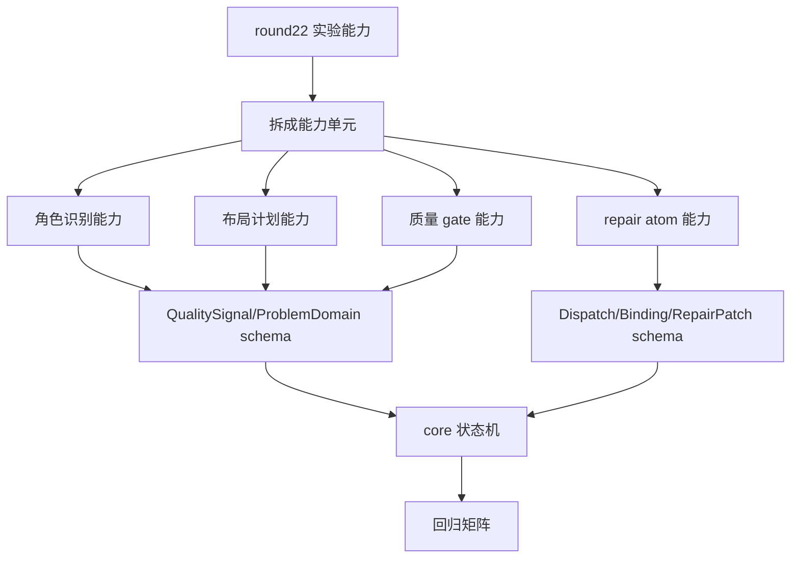

不能做的合入方式：

```text
把 round22 generator 或一段大 prompt 直接复制进 core
```

这样会得到局部样本效果，但无法解释为什么换 PDF 就错，也无法让新的 Codex 复现同样判断链。

### 7.19 实现级落地要求

下一轮工具和 runner 必须按下面产物推进，而不是只靠报告文字说明。

#### 7.19.1 S8 必须新增或补齐的产物

| 文件 | 当前是否完全具备 | 要求 |
|---|---|---|
| `evidence_basket.json` | 不完整 | 收集 source、candidate、render、generation evidence、source extraction 引用 |
| `quality_signal_ledger.json` | 不完整 | 从现有 `quality_signals`、`visual_region_metrics`、`quality_gates` 归一生成 |
| `problem_domain_buckets.json` | 缺 | 按问题域聚合 P0/P1/P2/P3 和 upstream/downstream |
| `triage_result.json` | 部分有 | 必须包含 selected domain、failure class、因果理由、deferred issues |
| `dispatch_result.json` | 部分嵌在 adjudication/patch | 必须独立输出，说明从哪个表命中哪个 repair family |
| `repair_acceptance.json` | 嵌在 loop | 必须按问题域列出 before/after、veto 原因和回滚理由 |

#### 7.19.2 提示词拆分要求

| 模板 | 只允许判断 | 输入槽位 | 输出槽位 |
|---|---|---|---|
| `S8A_quality_signal_normalization.prompt.json` | 工具信号是否可归一、证据是否足够 | source/candidate metrics、gate failures、crop refs | `QualitySignal[]`、missing evidence |
| `S8B_problem_triage.prompt.json` | 主问题选择、严重度、deferred list | `quality_signal_ledger`、`problem_domain_buckets` | `triage_result` |
| `S8C_repair_dispatch.prompt.json` | 是否命中 dispatch，是否需要方法论适配 | `triage_result`、dispatch table、tool specs | `dispatch_result` |
| `S8D_repair_binding.prompt.json` | 在已选 repair family 内绑定参数 | `dispatch_result`、layout policy/plan、evidence refs | `repair_patch` |
| `Lx_repair_acceptance.prompt.json` | 修复是否接受、回滚或继续 | before/after signals、hard negative table | `repair_acceptance` |

如果本地确定性工具可以完成某一步，可以不调用后端模型，但必须仍然按同一输入槽位和输出槽位写产物。这样新的 Codex 或外接模型才有统一接口。

### 7.20 PDF 问题分类研判图谱（细粒度版）

本节专门回答“PDF 到底出了什么版式问题、怎么判断、怎么派工具、怎么回测”的问题。
这里的主语不是 runner，也不是 `S0/S1/S2` 这种执行动作，而是候选 PDF 相对源 PDF 产生的 `LayoutIssue` 问题对象。

核心原则：

1. 先判断问题属于哪个域，再判断严重度，再判断主因，再选择修复族。
2. 任何修复动作都必须能反引到当前 run 的源 PDF 证据、候选 PDF 证据和工具证据。
3. 模型只能参与低置信审美、语义或复杂归因的辅助裁决，不能跳过硬规则、不能直接发明工具。
4. 修复不是“发现问题就改”；必须先进入问题状态，再按问题状态迁移。

#### 7.20.1 问题对象总状态机

这张图表达一个 `LayoutIssue` 从“被发现”到“被关闭/失败”的完整状态。执行器必须在报告中说明当前候选 PDF 的每个 P1/P0 问题走到了哪一个状态。

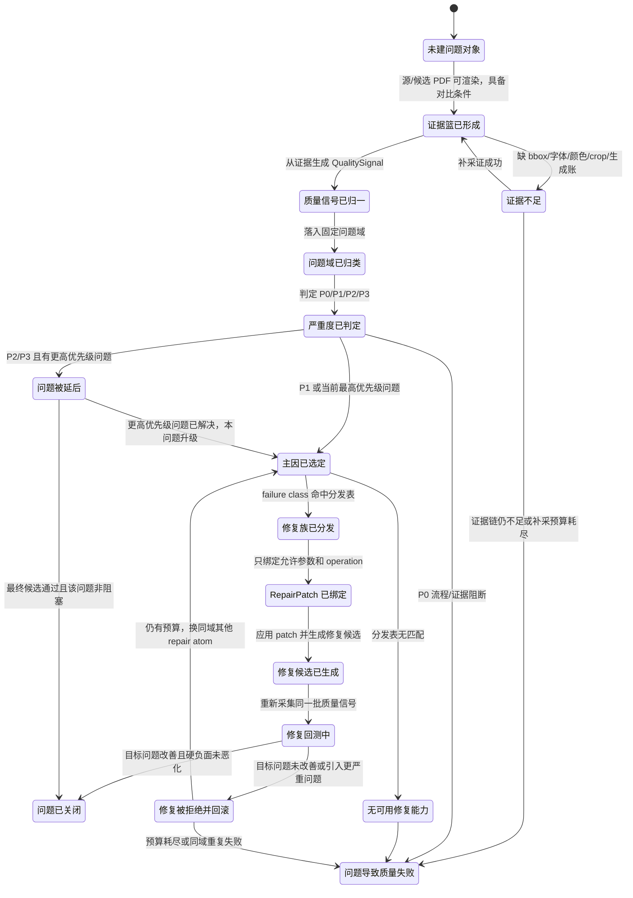

这张图对应人话：

1. “发现问题”不是状态，只有证据足够后才建立问题对象。
2. “选择工具”不是研判的第一步；必须先知道问题域、严重度和主因。
3. “修过一次”不是成功；必须重新采同一批信号并和修前比较。
4. 如果修复把另一个硬问题修坏，必须回滚，不能把修复候选当最终 PDF。

#### 7.20.2 一级分诊图：先分问题域，不直接选工具

这张图是所有候选 PDF 的入口。它把问题先分进固定问题域，执行器不得临时发明新域，也不得用页码、文件名、固定文字或固定坐标绕过分诊。

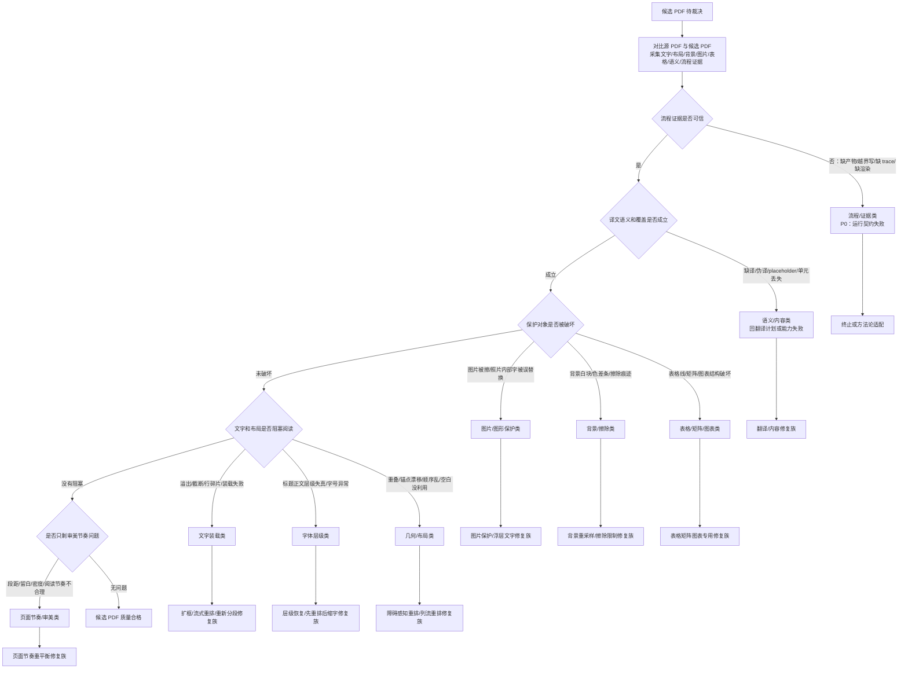

一级分诊的判断顺序不能颠倒：

1. 先看证据可信不可信；证据不可信时，任何审美判断都无意义。
2. 再看语义是否存在；缺译不是排版问题。
3. 再看保护对象；图片、背景、表格被破坏时，普通文字重排不能优先。
4. 再看文字装载、字体层级和几何布局。
5. 最后才看页面节奏和审美。

#### 7.20.3 证据采集图：每个问题必须有当前 run 的证据

这张图说明每个问题域需要从哪些事实里拿证据。报告里不能只写“视觉不好”，必须写“证据来自哪个篮子”。

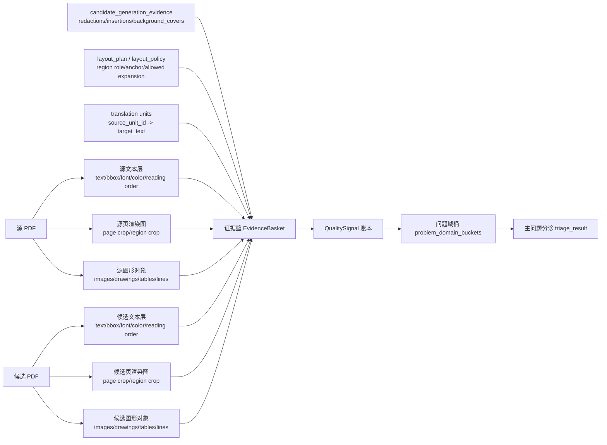

证据篮最少要覆盖这些维度：

1. 文字维度：源/候选文字、bbox、字号、颜色、行数、阅读顺序、role。
2. 几何维度：region bbox、列/组、相邻关系、障碍物、可用空白。
3. 背景维度：redaction 区域、填充色、局部像素采样、色差、覆盖面积。
4. 图片维度：图片 bbox、图片数量、图片像素差、文字层和图片层关系。
5. 表格维度：表格区域、行列线、单元格、表头/数值列、线穿字。
6. 图表维度：swatch、legend label、图例和标签距离、图形遮挡。
7. 语义维度：翻译单元覆盖、placeholder、伪译、缺段。
8. 流程维度：状态 trace、工具日志、写入边界、schema。

#### 7.20.4 文字类问题研判图

文字类问题不是一个 `text_fit_overflow` 就够。必须先拆成“丢字、塞不下、碎行、字号退化、层级错误、阅读顺序错误”。

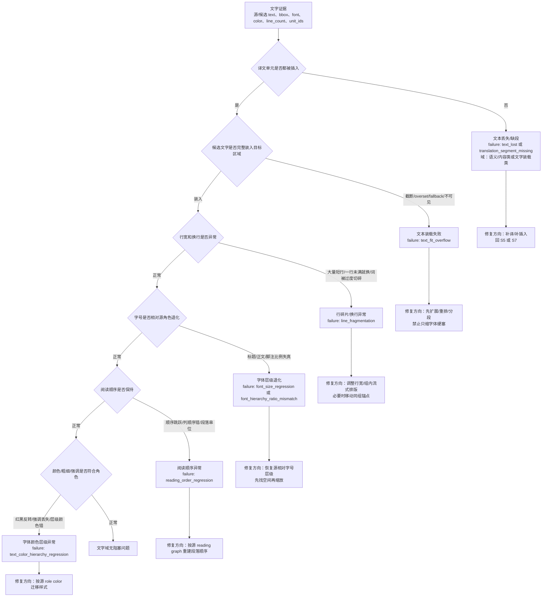

文字类判断维度用人话解释：

1. **覆盖**：原来有几个需要翻译的文字单元，候选里是否都有对应目标语。
2. **装载**：候选文字是否被截断、压到不可读、或者依赖 fallback 才勉强显示。
3. **行形**：同一段文字是否出现很多短行、异常换行、字词被挤碎。
4. **字号层级**：标题、正文、脚注、指标值之间的相对大小是否还像源页。
5. **阅读顺序**：多列、多框、图文混排时，阅读顺序是否和源页对应。
6. **样式语义**：红色提示、黑色正文、灰色脚注、粗体强调是否被错误迁移。

#### 7.20.5 几何和布局类问题研判图

几何问题不能只看两个框有没有重叠。它要看“文本变长后是否可以扩、往哪里扩、会不会撞到障碍物、是否可以整体下移、是否保持阅读秩序”。

```mermaid
flowchart TD
  region_graph[区域图<br/>region bbox + role + group + column + neighbor] --> obstacle[障碍物图<br/>图片/表格/图表/页眉页脚/固定装饰/页边界]
  region_graph --> density[页面密度图<br/>可用空白/段间距/列间距/下方余量]
  region_graph --> anchor[源锚点图<br/>区域起点/相对顺序/同组关系]

  obstacle --> can_expand{当前区域是否可扩展}
  density --> can_expand
  anchor --> can_expand

  can_expand -->|可横向扩展且不撞障碍| expand_x[横向扩展候选框<br/>repair: expand_slot_width]
  can_expand -->|可纵向扩展且同组可下移| expand_y[纵向扩展/同组下移<br/>repair: obstacle_aware_reflow]
  can_expand -->|不可扩但同组可重排| group_flow[组内流式重排<br/>repair: body_flow_region_reflow]
  can_expand -->|不可扩且重叠硬阻塞| fail_cap[当前修复能力不足或质量失败]

  expand_x --> collision_check{扩展后是否撞到邻区/图片/表格}
  expand_y --> collision_check
  group_flow --> collision_check

  collision_check -->|撞到硬保护对象| reject[拒绝 patch，回滚]
  collision_check -->|只影响同组且改善阅读| candidate[生成修复候选]
  candidate --> rejudge[重新跑文字/背景/表格/图片硬 gate]
```

布局类判断维度：

1. **邻接关系**：这个区域左、右、上、下是谁，是否同组，是否同列。
2. **障碍物**：周围有没有图片、表格、图表、页眉页脚、固定装饰、边界。
3. **可用空白**：右侧、下方、同组之间是否有足够空间承接目标语变长。
4. **锚点约束**：区域起点能否移动，移动后是否破坏阅读顺序和视觉层级。
5. **整体流式**：一个段落变长时，不应只扩单个框；同组段落可以整体下移。
6. **回测约束**：修复 text fit 不能让 overlap、图片遮挡、表格结构变坏。

#### 7.20.6 图片、浮层文字和背景问题研判图

这里要解决一个关键误区：照片内部文字默认保护；浮在图片或色块上的 PDF 前景文字仍然是文字层，应参与翻译回填。判断不能靠主观说“在图片上”。

```mermaid
flowchart TD
  text_box[文字 bbox] --> overlap_img{是否与图片 bbox 重叠}
  image_obj[图片对象/像素区域] --> overlap_img
  draw_obj[绘图色块/遮罩/透明层] --> bg_sample

  overlap_img -->|不重叠| normal_text[普通文字层<br/>进入文字/布局研判]
  overlap_img -->|重叠| layer_check{文字是否为可抽取 PDF 文本层}

  layer_check -->|是，可抽取 text span| overlay_text[浮层文字<br/>应翻译并回填<br/>需要保护底图]
  layer_check -->|否，只在图片像素里| photo_text[照片/图片内部文字<br/>默认保护，不翻译]

  overlay_text --> bg_sample[采样文字周围局部背景<br/>source crop vs candidate crop]
  bg_sample --> redaction{擦除/填充是否留下可见痕迹}

  redaction -->|白块/色差条/实心块/渐变破坏| bg_issue[背景/擦除类问题<br/>failure: background_residue_artifact]
  redaction -->|底图保持| overlay_fit{浮层文字是否可读且不挡主体}

  overlay_fit -->|遮挡主体/压图/文字不可读| image_overlay_issue[图片/图形保护类问题<br/>failure: text_over_image 或 image_overlay_collision]
  overlay_fit -->|正常| ok[图片背景域通过]

  photo_text --> protect[保护图片像素<br/>禁止擦除或替换]
  bg_issue --> repair_bg[修复方向：重采样背景/减少擦除/使用透明或局部纹理]
  image_overlay_issue --> repair_overlay[修复方向：浮层文字重排/移动到安全区域/缩短标签]
```

判断维度：

1. **层级**：文字是 PDF 文本层，还是图片像素的一部分。
2. **重叠**：文字 bbox 与 image bbox、draw object、色块是否重叠。
3. **背景采样**：擦除前后局部背景颜色、纹理、渐变是否一致。
4. **图片完整性**：候选图片数量、像素均值、局部 crop 是否被大面积覆盖。
5. **主体遮挡**：翻译后文字是否挡住人物、图标、图表主体。

#### 7.20.7 表格、矩阵和图表类问题研判图

表格和图表不能按普通正文处理。尤其是中译英时文字变长，不能简单把单元格文字塞进原 bbox；但也不能破坏行列线、数字列和图例绑定。

```mermaid
flowchart TD
  page[页面证据] --> detect{是否存在表格/矩阵/图表结构}
  detect -->|表格线/行列/数值列| table[表格结构域]
  detect -->|矩阵卡片/多框结构| matrix[矩阵结构域]
  detect -->|饼图/柱图/图例/swatch| chart[图表图例域]
  detect -->|否| normal[交给文字/布局域]

  table --> grid_check{行列线和单元格是否保持}
  grid_check -->|线穿字/列错位/单元格溢出| table_fail[表格结构失败<br/>failure: table_grid_or_cell_regression]
  grid_check -->|保持| numeric_check{数值列和表头是否对齐}
  numeric_check -->|错列/表头混乱/数字偏移| numeric_fail[表格对齐失败<br/>failure: numeric_column_alignment_fail]
  numeric_check -->|正常| table_text{单元格文字是否可读}
  table_text -->|过小/截断/重叠| table_text_fail[表格文字可读性失败]
  table_text -->|正常| table_ok[表格域通过]

  matrix --> matrix_check{卡片边界/标题/正文关系是否保持}
  matrix_check -->|卡片内文字压字/跨框| matrix_fail[矩阵卡片布局失败]
  matrix_check -->|正常| matrix_ok[矩阵域通过]

  chart --> legend_check{颜色 swatch 与标签是否绑定}
  legend_check -->|标签错位/颜色对应丢失| legend_fail[图例绑定失败]
  legend_check -->|绑定| label_check{图表标签是否遮挡图形}
  label_check -->|遮挡/过小/错位| chart_label_fail[图表标签失败]
  label_check -->|正常| chart_ok[图表域通过]

  table_fail --> repair_table[修复方向：表格专用重排/保线/按列约束缩放]
  numeric_fail --> repair_numeric[修复方向：按列锚点恢复数字列和表头]
  table_text_fail --> repair_table_text[修复方向：单元格内换行/列宽策略/必要时表格整体缩放]
  matrix_fail --> repair_matrix[修复方向：卡片内流式重排/保持边界]
  legend_fail --> repair_legend[修复方向：swatch-label 成组移动]
  chart_label_fail --> repair_chart_label[修复方向：标签避障重排]
```

表格/图表判断维度：

1. **结构线**：行线、列线、卡片边框、图例色块是否保持。
2. **单元格占用**：文字是否穿线、跨格、遮挡数值列。
3. **数值对齐**：数字列右对齐/小数点/表头对应是否保持。
4. **表头关系**：多级表头是否仍然覆盖正确列组。
5. **图例绑定**：颜色块和标签是否仍然一一对应。
6. **图形遮挡**：标签是否挡住饼图、柱图、折线、关键数据。

#### 7.20.8 页面节奏和审美问题研判图

页面节奏只能在硬问题都没有阻塞时处理。它不是“看起来差”这么粗，而是比较源页和候选页的相对密度、留白、段距和层级节奏。

```mermaid
flowchart TD
  hard_gate{是否仍有 P0/P1 硬问题}
  hard_gate -->|有| stop[先修硬问题<br/>不进入审美修复]
  hard_gate -->|无| rhythm_input[采集页面节奏指标<br/>区域密度/留白/段距/行距/标题间距/列宽]

  rhythm_input --> density{候选密度是否明显偏离源页}
  density -->|局部过密| too_dense[局部过密<br/>可能需要扩展/下移/分栏]
  density -->|局部过空| too_sparse[局部过空<br/>可能需要收紧段距/提高字号]
  density -->|正常| spacing{段距和行距是否合理}

  spacing -->|段间空隙过大或过小| spacing_issue[段落节奏问题]
  spacing -->|正常| hierarchy{视觉层级是否清楚}

  hierarchy -->|标题/正文/脚注层级弱| hierarchy_issue[层级节奏问题]
  hierarchy -->|正常| rhythm_ok[审美层通过]

  too_dense --> repair_rhythm[页面节奏修复族]
  too_sparse --> repair_rhythm
  spacing_issue --> repair_rhythm
  hierarchy_issue --> repair_rhythm
```

审美层的判定要用相对量：

1. 不问“字号是不是 12pt”，而问“候选正文相对源正文是否过小/过大”。
2. 不问“段距是不是固定值”，而问“候选段距相对源页角色和可用空间是否异常”。
3. 不问“有没有空白”，而问“空白是否帮助阅读，还是因为内容没排进去导致页面失衡”。

#### 7.20.9 多问题融合图：怎么决定本轮修什么

同一页经常同时出现：文字溢出、字号变小、区域重叠、背景痕迹。不能每个问题都立刻修，也不能简单按数量多数投票。

```mermaid
flowchart TD
  signals[QualitySignal 账本] --> buckets[按问题域聚合<br/>process/content/protection/text/layout/table/background/rhythm]
  buckets --> hard{是否存在硬阻断}

  hard -->|P0 流程证据| fail_process[流程失败，不做产品修复]
  hard -->|P1 语义缺失| choose_content[主问题=语义/内容]
  hard -->|P1 图片/背景/表格破坏| choose_protect[主问题=保护对象]
  hard -->|无保护对象硬破坏| causal[因果优先级排序]

  causal --> text_first{文字装载是否是上游原因}
  text_first -->|是| choose_text[主问题=文字装载]
  text_first -->|否| font_first{字体层级是否是上游原因}
  font_first -->|是| choose_font[主问题=字体层级]
  font_first -->|否| layout_first{几何重叠是否独立成立}
  layout_first -->|是| choose_layout[主问题=几何/布局]
  layout_first -->|否| choose_rhythm[主问题=页面节奏/审美]

  choose_content --> deferred[其他问题进入 deferred]
  choose_protect --> deferred
  choose_text --> deferred
  choose_font --> deferred
  choose_layout --> deferred
  choose_rhythm --> deferred

  deferred --> triage_result[写 triage_result<br/>selected_failure_class<br/>causal_reason<br/>deferred_failures]
```

融合规则：

1. P0 永远优先于产品质量修复。
2. 语义缺失优先于视觉修复。
3. 图片、背景、表格、图表这类保护对象硬破坏优先于普通文字装载。
4. 在普通排版问题内，优先判断 `text_fit_overflow` 是否是上游原因。
5. `cross_slot_overlap` 很多时候是下游症状；只有当 text fit 和 font hierarchy 不是主因时，才优先修它。
6. 本轮只选择一个主问题；其他问题必须进入 deferred，并在修后重新排队。

#### 7.20.10 RepairPatch 分发和回测图

这张图把“研判”和“修复工具”串起来。Triage 只判断病种，Dispatch 只查表，Binding 只绑参数，Acceptance 只看修前修后。

```mermaid
flowchart TD
  triage[TriageResult<br/>主问题域 + failure class + 证据 ID] --> dispatch{Dispatch 静态分发表是否命中}
  dispatch -->|否| no_cap[无可用修复能力<br/>进入方法论适配或质量失败]
  dispatch -->|是| family[RepairFamily<br/>允许工具 + 目标状态 + 禁止动作]

  family --> binding[Binding<br/>只绑定允许参数和 operation<br/>不允许改 failure class]
  binding --> patch[RepairPatch<br/>operations + rollback_condition + anti_overfit_basis]
  patch --> apply[应用 patch 生成修复候选 PDF]
  apply --> collect_again[重新采集同一批质量信号]

  collect_again --> target{目标 failure class 是否改善}
  target -->|否| reject1[拒绝并回滚<br/>目标未改善]
  target -->|是| hard_negative{硬负面是否恶化}
  hard_negative -->|是：图片/背景/表格/语义/流程/重叠明显恶化| reject2[拒绝并回滚<br/>修坏其他域]
  hard_negative -->|否| accept[接受修复<br/>更新当前候选]

  reject1 --> budget{loop 预算是否还够}
  reject2 --> budget
  budget -->|够| retriage[回到主问题分诊<br/>可换同域其他 repair atom]
  budget -->|不够| quality_fail[PDF 质量失败]
  accept --> deferred{是否还有 deferred 阻塞问题}
  deferred -->|有| retriage
  deferred -->|无| pass[候选 PDF 质量合格]
```

回测必须同时看两类指标：

1. **目标指标**：本轮要修的问题是否变好，例如溢出是否减少、背景痕迹是否下降、图例绑定是否恢复。
2. **硬负面指标**：其他关键域有没有明显恶化，例如修 text fit 后是否新增重叠、遮挡图片、破坏表格、产生白块。

只满足第一条不够；目标问题变好但硬负面恶化时，仍然必须拒绝并回滚。

#### 7.20.11 模型裁决插入点

模型不是总裁判，模型只是某些状态下的辅助研判器。所有模型调用都必须有固定输入槽位和固定输出槽位。

```mermaid
flowchart TD
  rule[确定性规则和工具证据] --> enough{证据和规则是否足够}
  enough -->|足够| deterministic[直接生成 QualitySignal / Triage / Dispatch / Acceptance]
  enough -->|不足或审美低置信| model_gate{是否允许模型介入}

  model_gate -->|流程/路径/schema 硬失败| no_model[模型不可覆盖<br/>直接失败]
  model_gate -->|语义理解/审美节奏/复杂归因| prompt[调用分层提示词<br/>只给当前 run 证据摘要]

  prompt --> model_output[模型输出<br/>问题域/严重度/主因/证据引用/置信度]
  model_output --> validate{输出是否反引证据且不越权}

  validate -->|通过| use[写入对应产物<br/>quality_signal 或 triage_result]
  validate -->|失败| reject[拒绝模型输出<br/>要求补证或流程失败]
```

模型提示词不能做这些事：

1. 不能直接选择未在分发表中的工具。
2. 不能把 P0/P1 硬规则判成通过。
3. 不能引用人工对照 PDF、历史 round 输出、样本文件名、页码特判。
4. 不能输出没有证据 ID 的结论。
5. 不能在 Binding 阶段改判 Triage 的 failure class。

#### 7.20.12 人能读懂的报告结构

每次运行报告必须按这个顺序写问题诊断结果，方便人工和新 Codex 验证：

```mermaid
flowchart TD
  report[运行报告] --> page_summary[页面摘要<br/>页类型/语言方向/主要区域]
  report --> issue_map[问题地图<br/>按页列出 P0/P1/P2/P3]
  issue_map --> issue_detail[问题详情<br/>问题域 -> failure class -> 证据 -> 判断维度]
  issue_detail --> triage[本轮主问题<br/>为什么选它，不选哪些 deferred]
  triage --> dispatch[修复分发<br/>命中哪个 repair family，为什么允许]
  dispatch --> patch[RepairPatch 摘要<br/>改了哪些区域，预期改善什么]
  patch --> before_after[修前/修后对比<br/>目标指标和硬负面指标]
  before_after --> verdict[接受/回滚/失败<br/>下一状态]
```

报告里的每个问题至少要用人话回答：

1. 这是什么类型的问题。
2. 为什么不是其他类型的问题。
3. 它是 P0/P1/P2/P3 哪一级。
4. 它的证据来自哪些工具和哪些字段。
5. 它为什么是本轮主问题，还是为什么被 deferred。
6. 它能用哪个修复族，不能用哪些修复族。
7. 修后哪些指标变好了，哪些指标没有变，哪些指标变坏了。
8. 最终是接受、回滚、继续 loop，还是质量失败。

## 8. RepairPatch 选择规则

### 8.1 选择输入

RepairPatch 选择只允许消费当前运行证据：

| 输入 | 来源 |
|---|---|
| `failed_gate_ids` | `product_quality_gates.json` |
| `quality_signals` | `quality_signals.json`，由“验证产品质量：归一质量信号”从源/候选对比归一 |
| `triage_result.failure_class` | “验证产品质量：研判主失败类型”只表示主阻塞问题类别 |
| `dispatch_result.repair_family` | 静态 dispatch table，不由 Triage prompt 自由选择 |
| `page_type`、`region_role` | `page_strategy.json`、`role_plan.json` |
| `target_language`、`source_language` | run request、translation manifest |
| `layout_policy` | 当前 run-local `layout_policy.json` |
| `generation_evidence` | `candidate_generation_evidence.json` |
| `visual_metrics` | `visual_region_metrics.json` |
| `tool_spec` | 当前 repair family 对应的允许 operation type 和可变参数 |

禁止输入：

1. 官方人工对照 PDF。
2. 文件名特判。
3. 固定页码特判。
4. 固定坐标特判。
5. 固定文本特判。
6. 记忆中的样本视觉结果。

### 8.2 问题域到 repair family 的一级分发表

RepairPatch 不能直接从 failure class 跳到某个工具。必须先按问题域进入一级分发表，再在该问题域内部选择具体 failure class 和 operation。

| 问题域 | 允许 repair family | 默认目标状态 | 必须证据 | loop 说明 |
|---|---|---|---|---|
| 流程/证据类 | 无；只能补契约、补证据或失败 | 审计流程契约 / 适配方法论变更 | process audit、state trace、operation log | 不进入产品修复；先修流程 |
| 语义/内容类 | `retranslate_or_patch_translation_unit`、`compact_translation_variant` | 生成翻译计划 | translation unit、source text、target text、coverage report | 只有语义证据失败才回翻译 |
| 文字装载类 | `expand_or_reflow_slot`、`body_flow_region_reflow`、`line_break_rebalance` | 生成布局计划 | fit metric、line metric、source/target bbox、可用空间 | 先扩展/重排，再考虑缩字号 |
| 字体层级类 | `restore_role_font_hierarchy`、`reflow_before_shrink` | 生成布局计划 | source/output role font ratio、role plan | 目标是恢复层级，不是固定字号 |
| 几何/布局类 | `obstacle_aware_reflow`、`vertical_flow_relayout`、`column_flow_rebalance` | 生成布局计划 | region graph、collision graph、障碍物图、空白分布 | 必须先看邻居和障碍物 |
| 表格/矩阵类 | `table_region_reflow_or_preserve_table`、`table_cell_text_fit`、`table_header_alignment_repair` | 生成布局计划 / 生成候选 PDF | table grid、cell bbox、row/column evidence | 表格结构优先，不能普通正文化 |
| 图片/图形保护类 | `protect_image_layer_or_overlay_text`、`image_overlay_text_relayout` | 生成候选 PDF / 生成布局计划 | image mask、text layer、crop diff | 区分照片内部文字和浮层文字 |
| 背景/擦除类 | `background_resample_or_redaction_limit`、`redaction_scope_shrink` | 生成候选 PDF | redaction bbox、background sample、pixel diff | 修擦除边界或背景采样 |
| 图表/图例类 | `chart_label_legend_relayout`、`legend_swatch_label_binding` | 生成布局计划 / 生成候选 PDF | chart region、swatch color、label bbox | 维护颜色和标签绑定 |
| 页面节奏/审美类 | `page_rhythm_rebalance`、`section_spacing_reflow` | 生成布局计划 | page density、white-space、role rhythm | 只在硬失败处理后执行 |

### 8.3 failure class 到目标状态和 repair family

“验证产品质量：研判主失败类型”只输出 failure class；“验证产品质量：分发修复族/绑定 RepairPatch”先通过 dispatch table 映射 repair family，再绑定参数。示例映射如下：

| 问题域 | failure class 类型 | repair family | 优先目标状态 | 说明 |
|---|---|---|---|---|
| 语义/内容类 | `translation_segment_missing`、placeholder、伪译文、compact variant 缺失 | `retranslate_or_patch_translation_unit` | 生成翻译计划（`S5_TranslationPlan`） | 只有语义证据失败才回翻译 |
| 流程/证据类 | 源证据、unit_id、font/linkage 缺失 | `rebuild_source_or_generation_linkage` | 提取源证据（`S3_SourceExtract`）或生成候选 PDF（`S7_GenerateCandidate`） | 重新提取或修 generation evidence |
| 文字装载类 | `text_fit_overflow`、`line_fragmentation`、`target_text_clipped` | `expand_or_reflow_slot` | 生成布局计划（`S6_LayoutPlan`） | 扩展/重排文本槽，不能优先压缩字号 |
| 字体层级类 | `font_size_regression`、`role_hierarchy_loss`、`heading_body_ratio_loss` | `reflow_before_shrink` | 生成布局计划（`S6_LayoutPlan`） | 字号相对源层级过小，先找可用空间重排 |
| 几何/布局类 | `cross_slot_overlap`、`paragraph_gap_collapse`、`unused_space_with_overflow` | `vertical_flow_relayout` / `obstacle_aware_reflow` | 生成布局计划（`S6_LayoutPlan`） | 修正文段间距、同列流式重排、障碍物感知扩展 |
| 表格/矩阵类 | `table_region_obstacle_pack`、`table_header_misalignment`、`cell_text_collision` | `table_region_reflow_or_preserve_table` | 生成布局计划（`S6_LayoutPlan`） | 表格/矩阵结构优先于普通正文回填 |
| 图片/图形保护类 | `image_content_erased`、`floating_text_on_image_untranslated`、`icon_label_misalignment` | `protect_image_layer_or_overlay_text` | 生成候选 PDF（`S7_GenerateCandidate`）或生成布局计划（`S6_LayoutPlan`） | 浮在图片上的文字要翻译，照片内部文字默认保护 |
| 背景/擦除类 | `redaction_fill_mismatch`、`background_residue_artifact`、`wide_line_residue` | `background_resample_or_redaction_limit` | 生成候选 PDF（`S7_GenerateCandidate`） | 重新生成候选或调整擦除边界 |
| 图表/图例类 | `legend_label_misalignment`、`chart_label_overlap`、`swatch_label_binding_loss` | `chart_label_legend_relayout` | 生成布局计划（`S6_LayoutPlan`）或生成候选 PDF（`S7_GenerateCandidate`） | 图表标签和颜色绑定必须保留 |
| 页面节奏/审美类 | `page_density_imbalance`、`section_spacing_regression`、`visual_rhythm_loss` | `page_rhythm_rebalance` | 生成布局计划（`S6_LayoutPlan`） | 硬问题修完后再做审美节奏 |
| 未分类 | 无法映射 repair atom | 无 | 适配方法论变更（`Ax_AdaptiveChange`）或质量失败（`S_FAIL_QUALITY`） | 看是否是方法论缺口 |

### 8.4 RepairPatch 最小结构

```json
{
  "patch_id": "repair_patch_0001",
  "selected_failure": {
    "problem_domain": "文字装载类",
    "failure_class": "text_fit_overflow",
    "failed_gate_ids": ["body_paragraph_readability"],
    "evidence_refs": ["visual_region_metrics.json#region_12"]
  },
  "dispatch_result": {
    "dispatch_table": "contracts/failure_dispatch_table.json",
    "problem_domain_dispatch": "文字装载类 -> expand_or_reflow_slot",
    "repair_family": "expand_or_reflow_slot",
    "tool": "tools/repairs/build_repair_patch.py",
    "allowed_operation_types": ["expand_slot"]
  },
  "repair_atom": "expand_or_reflow_slot",
  "target_state": "生成布局计划",
  "target_state_id": "S6_LayoutPlan",
  "policy_context": {
    "language_pair_profile": "zh_to_en",
    "page_type": "body_nav",
    "region_role": "body_flow"
  },
  "operations": [
    {
      "op": "set_layout_mode",
      "scope": {"page_index": 5, "region_id": "region_12"},
      "value": "region_flow",
      "reason": "current-run line fragmentation evidence"
    }
  ],
  "operation_count": 1,
  "deferred_failures": [],
  "rollback_conditions": [
    "selected failure not improved",
    "total blocking failure count increased",
    "hard negative in another problem domain regressed"
  ],
  "anti_overfit_statement": "No filename/page/text/fixed-coordinate branch used."
}
```

### 8.5 RepairPatch 判定规则

1. `operation_count=0` 不能算有效修复。
2. 一个 patch 只能改当前 run-local policy 或生成计划，不直接改 core。
3. core 修补必须走“适配方法论变更”，并有 before/after manifest。
4. 修补后必须重新生成候选和重新执行“验证产品质量”。
5. Patch 必须声明 `problem_domain`、`failure_class`、`repair_family`、`target_state` 和 `rollback_conditions`。
6. 如果 repair family 与问题域分发表不一致，必须进入“流程契约失败”或“适配方法论变更”，不能硬执行。

## 9. Loop 预算和退出规则

### 9.1 预算结构

建议采用 V4 的 `BudgetState` 思想，但映射到 PDF workflow：

```json
{
  "max_repair_loops": 3,
  "max_triage_calls_per_loop": 1,
  "max_binding_calls_per_loop": 1,
  "max_regather_per_loop": 1,
  "max_same_failure_repeats": 2,
  "loops_used": 0,
  "triage_calls_used": 0,
  "binding_calls_used": 0,
  "regather_used": 0
}
```

### 9.2 进入 loop 条件

必须同时满足：

1. “验证产品质量”有完整视觉闭环证据。
2. 存在 P1 或 P2 级别的 blocking failure。
3. blocking failure 已完成问题域归类。
4. failure class 可映射 repair atom，或能明确进入适配方法论变更。
5. 已记录其他问题域为 `deferred_failures`，不能丢弃。
6. 预算未耗尽。
7. 不是 process-contract 缺证据问题。

### 9.3 分类驱动的 loop 选择算法

每轮 loop 必须按下面算法选择修什么，不能由执行器临时发挥：

1. 收集全部 `QualitySignal`。
2. 按问题域归类，形成 `problem_domain_buckets`。
3. 如果存在 P0 流程/证据类问题：不进入产品修复，直接进入“审计流程契约”或“适配方法论变更”。
4. 如果存在 P1 语义/内容类问题：只回“生成翻译计划”，不做布局修复。
5. 如果存在 P1 图片/背景/表格硬负面：优先修这些问题，防止文字修复继续破坏图片、背景或表格。
6. 如果主要问题在文字/字体/几何布局链路：按因果顺序选择 `text_fit_overflow -> font_size_regression -> cross_slot_overlap`。
7. 如果硬问题已处理，只剩页面节奏/审美类：才允许执行 `page_rhythm_rebalance`。
8. 选择结果写入 `triage_result`，至少包含 `problem_domain`、`failure_class`、`severity`、`evidence_refs`、`deferred_failures`。
9. 根据问题域一级分发表选择 repair family，再根据 failure class 二级分发表绑定具体 operation。
10. 修复后重新回到“验证产品质量”，用同一问题域和同一指标对比 before/after。

示例 `triage_result`：

```json
{
  "selected_problem_domain": "文字装载类",
  "selected_failure_class": "text_fit_overflow",
  "severity": "P1",
  "selection_reason": "text_fit_overflow is upstream of cross_slot_overlap in the same text/layout causal chain",
  "evidence_refs": ["quality_signals.json#signal_12", "visual_region_metrics.json#region_5"],
  "deferred_failures": [
    {"problem_domain": "几何/布局类", "failure_class": "cross_slot_overlap", "reason": "downstream symptom"}
  ],
  "next_action": "bind_repair_patch"
}
```

### 9.4 退出 loop 条件

| 条件 | 目标状态 |
|---|---|
| 修补后“验证产品质量”的全部阻塞 gate 通过 | 审计流程契约（`S9_VerifyProcessContract`） |
| 修补影响源证据或 evidence linkage | 提取源证据（`S3_SourceExtract`） |
| 修补影响译文/compact variant | 生成翻译计划（`S5_TranslationPlan`） |
| 修补影响布局策略 | 生成布局计划（`S6_LayoutPlan`） |
| 修补只需重新生成 | 生成候选 PDF（`S7_GenerateCandidate`） |
| 需要新增/修改工具、契约、提示词 | 适配方法论变更（`Ax_AdaptiveChange`） |
| 同一问题域和同一 failure class 重复失败且无新证据 | 质量失败（`S_FAIL_QUALITY`） |
| 修复目标问题改善但其他 P1 硬问题域恶化 | 拒绝修复并回滚；若预算允许，重新 Triage，否则质量失败 |
| 预算耗尽 | 质量失败（`S_FAIL_QUALITY`） |
| 缺必须 trace 或 repair_loop 记录 | 流程契约失败（`S_FAIL_PROCESS_CONTRACT`） |

### 9.5 loop 记录要求

每次进入“执行修复循环”必须写：

```json
{
  "loop_id": "Lx_001",
  "entered_from_state": "验证产品质量",
  "entered_from_state_id": "S8_VerifyProductQuality",
  "loop_iteration": 1,
  "budget_before": {},
  "selected_problem_domain": "文字装载类",
  "selected_failure_class": "line_fragmentation",
  "selected_repair_atom": "body_flow_region_reflow",
  "target_state": "生成布局计划",
  "target_state_id": "S6_LayoutPlan",
  "repair_patch_ref": "repair_patch_0001.json",
  "repair_patch_operation_count": 1,
  "regenerated_candidate_ref": "candidate_repair001.pdf",
  "rejudge_artifacts": [
    "candidate_render_manifest.repair001.json",
    "visual_region_metrics.repair001.json",
    "product_quality_gates.repair001.json"
  ],
  "budget_after": {},
  "exit_state": "验证产品质量",
  "exit_state_id": "S8_VerifyProductQuality"
}
```

### 9.6 修复候选接受与回滚

RepairPatch 执行后产生的 PDF 只是 repaired candidate，不自动成为当前接受候选。接受规则如下：

1. 修复后产品 gate 全部通过：接受 repaired candidate，进入“审计流程契约”。
2. 修复后阻塞 failure count 下降，且 hard negative、已完成轴、背景/图片保护没有回退：可以接受为 improved candidate，并继续下一轮预算判断。
3. 修复后阻塞 failure count 持平或上升：拒绝 repaired candidate，当前接受候选回滚到修复前候选。
4. 修复后目标 failure class 改善但产生更严重的 hard negative：拒绝 repaired candidate。
5. 回滚也必须写入 `repair_loop_<n>.json`，包括 `repair_accepted=false`、`accepted_candidate_pdf`、`rejected_candidate_pdf`、before/after 质量摘要。
6. 被拒绝的 repaired candidate 可保留为证据，但不能作为最终候选 PDF 对外宣称。

## 10. 状态、工具、提示词的一致性检查

每次改工具或提示词后，必须检查：

1. `state_machine.md` 是否仍覆盖状态迁移。
2. `prompt_tool_bindings.json` 是否仍覆盖状态到工具和提示词。
3. `tool_contracts.md` 是否仍覆盖工具输入、输出、失败模式。
4. `page_type_repair_matrix.md` 是否仍覆盖新增 failure class 和 repair atom。
5. `run_semantic_product_quality_round.py` 是否真实执行了文档声称的状态。
6. `PDF_语义翻译回填_标准流程设计.md` 是否需要同步更新。

## 11. 最小验证闭环

最小闭环不是大规模测试，而是证明状态机能真实跑通：

1. 选一个 PDF 的 1-3 页。
2. 跑到“生成候选 PDF”，生成 candidate PDF。
3. 跑“验证产品质量”，生成 visual metrics、visual repair plan、visual adjudication、quality gates。
4. 人为选择一个可修 failure class。
5. 进入“执行修复循环”，生成 repair patch。
6. 应用 patch，重新生成 candidate。
7. 重新跑“验证产品质量”。
8. 输出 state trace、operation log、decision log、repair loop record。
9. 用 `validate_process_artifacts.py` 和 `scan_core_overfit.py` 验证过程。

只有这个闭环成立，才讨论扩大到 20 页、50 页或更多 PDF。

## 12. 当前设计风险

| 风险 | 说明 | 处理方式 |
|---|---|---|
| 顶层状态过多 | 当前中文顶层状态比 V4 五态复杂 | 保留中文顶层状态作为执行层；V4 五态只作解释层 |
| 子状态仍可能不全 | 生成布局计划、验证产品质量、执行修复循环后续可能继续细化 | 子状态可演进，但必须挂在大状态下 |
| 研判和修补混在一起 | 如果“验证产品质量”直接改 layout，会失去可审计性 | “验证产品质量”只判定，“执行修复循环”才修补 |
| RepairPatch 映射不完整 | 新 failure class 可能无 repair atom | 进入“适配方法论变更”或“质量失败”，不能假修 |
| 过拟合 | 为某个 PDF 写固定逻辑 | scan core，禁止文件名/页码/文本/坐标特判 |
| 翻译和布局耦合 | 视觉失败被误判成翻译失败 | 只有语义证据失败才回“生成翻译计划” |

## 13. 待补问题

这份文档先解决“状态怎么定、每个状态干什么、状态下有什么工具和 loop”。后续还需要继续补：

1. 将本文的问题域、严重度、failure class、repair family 正式落到 `pdf_translation_workflow_core/contracts`。
2. `QualitySignal`、`TriageRequest`、`TriageResult`、`BindingRequest`、`BindingResult` 在 core 中的正式 JSON 契约和 schema 测试。
3. “验证产品质量”的问题域优先级、因果优先级和硬负面 veto 是否需要代码化。
4. `RepairPatch` schema、rollback condition 和 problem-domain dispatch 是否要落到 `pdf_translation_workflow_core/contracts`。
5. `run_semantic_product_quality_round.py` 是否要抽出独立 engine 层。
6. 当前 `PDF_语义翻译回填_标准流程设计.md` 是否要按本文结构重排。
