# Transflow PDF 翻译排版引擎总体设计 v0.1

> 文档状态：经架构评审修订，可进入 T0 合同冻结  
> 更新日期：2026-07-19  
> 适用仓库：`transflow`、`MerqFin`（两个独立仓库）  
> 目标读者：Transflow 引擎开发、MerqFin 集成、翻译服务、测试与运维人员

本文冻结的是职责边界、主流程、状态不变量、失败降级和替换顺序。图中的类名与少量内部字段是推荐落点，不是必须逐字照搬的代码模板；实施时可以在不改变这些不变量的前提下做小幅校正。

---

## 1. 一页结论

Transflow 不是重做 MerqFin，也不是只替换一个 PDF 渲染函数。

MerqFin 继续作为完整产品系统，保留前端、API、用户、项目、任务、术语库、翻译记忆、Prompt、模型配置、审校、交付、权限和运维能力。对于 PDF 任务，Transflow 完整接管当前 MerqFin Translation Worker 的任务执行与编排职责，包括：

- PDF 任务领取与租约；
- PDF 页面枚举、事实提取和页面分类；
- 翻译单元识别、批次规划和翻译调用时机；
- 分类专用工具箱排版；
- 质量裁决、有限修复和降级；
- 页面候选验证、源 PDF 副本串行回放 Patch、预览和产物登记；
- 进度、暂停、恢复、重试和结构化日志。

生产 LLM 调用统一由 MerqFin 仓库中的独立 **AI Capability Service** 提供。该物理进程包含两个窄接口：供分类使用的结构化多模态 `ModelGateway`，以及供语义翻译使用的单页批量 `Translation Capability`。它不决定 PDF 工作流、页面顺序或下一批翻译内容。

Transflow 的生产 PDF 链只使用 PyMuPDF 原生对象和 API：提取 PDF 直接事实、生成并验证 `PagePatch`、`redact + insert_textbox` 写入、页面渲染、源 PDF 副本上的串行 Patch 回放以及最终保存。HTML、DOM/CSS、Chrome/Chromium 和任何 HTML-to-PDF 实现均不进入 Transflow PDF 主链。

生产部署继续共享现有 PostgreSQL 和文件系统，沿用 MerqFin 现有任务表、页面表、翻译段表、产物表和文件路径。MerqFin 前端及其外部 API 形态不改变，不建设第二套生产业务库，不复制整套任务状态。

PostgreSQL 在这里是持久化任务队列与状态/控制协调面，不是通用消息总线：MerqFin 写任务和用户命令，Transflow 通过轮询、原子 claim、租约和 CAS 领取并推进 PDF Job。PDF、预览和 Artifact 走共享文件系统，模型与翻译调用走 AI Capability Service HTTP，前端继续走 MerqFin API/SSE。

前端 PDF 预览兼容当前 MerqFin `main@3d831c5`：运行中的目标页由 Transflow 发布页级 PNG，完整目标 PDF 发布后继续由现有 MerqFin 预览端点使用 PyMuPDF 按页动态栅格化。前端不直接读取服务器文件路径，也不引入 HTML/PDF 重排。

实施分为两个大阶段：

1. 在 `transflow` 仓库内从零建立生产引擎，迁移并吃掉两个穿刺的核心能力，先使用可替换的测试翻译 Provider 完成独立闭环。
2. 在 `MerqFin` 中按 PDF 格式切换任务执行权，以 Transflow 替换现有 PDF Translation Worker 执行链，并接入独立 AI Capability Service。

---

## 2. 背景与问题定义

### 2.1 当前问题

MerqFin 是一套完整的企业文档翻译系统，但现有 PDF 解析、翻译回填和排版引擎效果不满足要求。问题不在前端交互、数据存储或产品流程，而在 PDF 任务内部执行链。

当前 PDF 最终产物由 `DocumentNextPdfModule` 生成结构化 package 和译后 HTML，再调用 `ChromeHtmlToPdfRenderer` 通过 Chrome/Chromium 重建 PDF。该链路会把原 PDF 的版式问题转换为 HTML 重排问题，正是本次替换要退出的旧渲染范式。新引擎采用 PyMuPDF 在源 PDF 上做受约束的原生对象回填，不要求、也不允许兼容两套渲染实现。

当前 `MerqFin/backend/runtime/worker.py` 所代表的 Translation Worker 并非单纯的模型调用 Worker，而是一个聚合式执行器。它会领取任务、注入 LLM、调用 `TranslationJobRunner`，并在同一条链路中完成解析、分段、翻译、质检、预览、渲染、产物登记和状态推进。

因此，本次替换边界是：

> 对 PDF 任务，Transflow 完整替代当前 MerqFin Translation Worker 的执行与编排职责；MerqFin 继续承担产品接入、用户交互、审校和交付。

旧 HTML/Chrome 结果只用于迁移期验证任务协议、语义覆盖、耗时、资源和人工 A/B，不作为 Transflow 的逐像素视觉金标准。新引擎的版式保真以源 PDF、声明修改区域和 PDF Preservation Contract 为判据。

### 2.2 已验证资产

#### 页面分类穿刺

路径：

```text
spikes/page_classification_engine_puncture_v1
```

已验证能力：

- 工程规则与千问多模态协同分类；
- 一次细粒度复核和确定性归约；
- 页面角色：`cover | contents | body | end | visual_only`；
- Body 所有权：`flow_text | table | chart | diagram | anchored_blocks | composite`；
- Flow 拓扑：`single | multi | visual_anchored`；
- Composite 类型：
  - `flow_text_table`；
  - `anchored_blocks_chart`；
  - `chart_table`；
  - `flow_text_chart`；
  - `flow_text_diagram`；
- 无法稳定归类时进入 `body.freeform`，并保留 `failed_node`。

分类图片只参与分类判断。图片像素、图片内部文字不翻译、不重排、不覆盖。

#### 页面工具箱穿刺

路径：

```text
spikes/page_toolbox_engine_puncture_v1
```

已形成的主要资产：

- `PageFacts`、`PageTemplate`、`PageTranslationRequest`、`PageTranslationBundle`；
- `PagePatch`、`Finding`、`PageQualityDecision`、`RunManifest`；
- `shared_pdf_kernel` 中的事实提取、字体、写入、渲染、约束、修复和工作区原语；
- cover、contents、end 和多数 body 分类叶子的专用工具箱；
- 分类私有的 Template、Layout、Judge、Repair、Prompt 和测试资产；
- 固定译文与真实千问调用适配器；
- 工程 Gate、运行证据和已知失败边界。

### 2.3 对穿刺成熟度的解释

两个穿刺已经证明技术路线可行，是新引擎的核心迁移基线。

同时，穿刺中的“工程验收”和“形式晋级”不是同一概念。现场 `stage_gate.json` 和 `toolbox_manifest.json` 中仍存在 `NOT_EVALUATED`、`EVIDENCE_INSUFFICIENT`、`FAIL`、非盲验证或缺少 `promotion_manifest.json` 的情况。当前起点包括：

- `body.flow_text.single` 为 `PASS`；
- `body.chart`、`body.diagram` 为 `PASS_NON_BLIND`；
- `body.flow_text.multi`、`body.table` 为 `NOT_EVALUATED`；
- `body.flow_text.visual_anchored`、`body.composite.anchored_blocks_chart` 为 `FAIL`；
- cover、contents、end、anchored_blocks 和其余已有根级 Gate 的 composite 多为 `EVIDENCE_INSUFFICIENT`；
- `body.composite.flow_text_table` 目录已有资产，但当前缺少根级 manifest 和 stage gate；
- `body.freeform` 目录当前只有分类语义说明，没有真实页面样本和可直接迁移的生产工具箱；
- 当前所有叶子都没有 `promotion_manifest.json`。

因此：

> 穿刺通过表示核心方法和实现路径已被验证；迁入生产引擎后仍必须完成行为等价回归、工程化回归和文档级集成回归，不能仅凭目录存在就宣称生产就绪。

“迁移代码”和“生产启用”是两个动作：核心逻辑可以先 Lift-and-Wrap 进入生产包，但只有通过对应 T4 Gate 的叶子才允许在生产 Catalog 中 `enabled=true`。已知 `FAIL`、`NOT_EVALUATED` 或缺少根级 Gate 的叶子不得因目录存在而自动启用。

---

## 3. 目标、范围与非目标

### 3.1 目标

1. 完整消费页面分类穿刺的分类逻辑和输出语义。
2. 完整消费页面工具箱穿刺中可复用的模板、排版、裁决和修复逻辑。
3. 建设文档级 PDF 执行引擎，补齐穿刺未覆盖的页级调度、暂停恢复、并发、日志、预览、源 PDF 串行 Patch 回放和交付能力。
4. 对任何可读取的源 PDF 都产生完整结果 PDF。
5. 对能力不足、质量失败和局部排版失败进行有限修复与确定性降级，不等待人工介入。
6. 保持 MerqFin 现有前端、数据库、文件系统和用户交互流程。
7. 最终替换 MerqFin 现有 PDF Translation Worker 执行链。

### 3.2 第一阶段范围

第一阶段只在 Transflow 内完成：

- 生产包和运行入口；
- 分类引擎迁移；
- 工具箱迁移；
- 公共 PDF 机械内核；
- 文档级协调器；
- `freeform` 有界恢复；
- Translation Port 与测试 Provider；
- 并发、状态、日志、暂停恢复、重试；
- 页面预览和整本 PDF 最终化；
- 完整回归与失败注入。

第一阶段不要求接入 MerqFin 的真实语义翻译能力。

第一阶段不建设 CLI。测试和技术验收通过内部 `StandaloneRunAdapter`（测试代码直接调用或仅开发环境开放的内部 HTTP 入口）提交一份完整源 PDF 的绝对路径、语言和固定配置；它只写 Transflow 运行账本与 Artifact，不创建第二套产品任务。对外入口不接受“预先拆好的单页 PDF 列表”。第二阶段生产 wiring 换成 `MerqFinJobQueueAdapter`。

第一阶段不提前修改 MerqFin 数据库。`StandaloneRunAdapter` 配合 `FilesystemCheckpointAdapter`，在受控 run workspace 中以原子 JSON manifest 保存运行账本和安全点，验证跨进程与服务器重启恢复。第二阶段 M0/M1 再通过 MerqFin 唯一 Alembic 链建立 PostgreSQL 账本表并切换到 `PostgresCheckpointAdapter`。

### 3.3 第二阶段范围

第二阶段完成：

- Transflow 读取和更新 MerqFin 现有 PDF 任务数据；
- PDF 任务领取权从 MerqFin Worker 切换到 Transflow；
- 接入独立 AI Capability Service 的模型和翻译接口；
- 保持现有进度、预览、审校、下载和产物路径；
- 灰度、回滚、并行对照和最终切换。

### 3.4 明确不做

- 不重写 MerqFin 前端。
- 不重新设计 MerqFin 的产品、用户、项目、审校和交付流程。
- 不迁移到另一套生产数据库或对象存储。
- 不要求 Docker 隔离；Docker 不是架构依赖。
- V1 不建设 CLI。
- 不使用 HTML、DOM/CSS、Chrome/Chromium、`insert_htmlbox` 或其他 HTML-to-PDF 路径生成 Transflow 最终 PDF。
- 不把页面候选 PDF 逐页重新拼接为最终文档；最终文档从源 PDF 副本串行回放已批准 Patch。
- 不做跨页 TranslationBatch；跨页只在调度层并发。
- 不在生产运行时引入 Codex 或开放式智能体自由选工具。
- 不建设全局万能排版规划器或开放式 Tool Registry。
- 不 OCR、翻译或覆盖图片内部文字。
- 不用文件名、样本 ID、固定页码或绝对坐标写运行时特例。
- 不以 PDF 字节完全一致作为迁移等价标准。
- 不在第一版存在之前重组已经验证过的分类与工具箱配合机制。

---

## 4. 核心术语

| 术语 | 定义 |
|---|---|
| 产品任务 | MerqFin 面向用户创建和展示的翻译任务，沿用现有任务记录和 API |
| PDF 执行任务 | Transflow 对同一 PDF 产品任务的内部执行视图，不要求新增第二条产品任务记录 |
| 页面路由 | 分类引擎输出的稳定叶子路径及其证据、失败节点和版本 |
| PageToolbox | 某个分类叶子私有的模板、排版、裁决、修复和 Prompt 能力 |
| SharedPdfKernel | 不含页面语义的 PDF 机械原语 |
| 翻译单元 | 带稳定 `unit_id/container_id` 的原生可翻译文字及其约束 |
| `body.freeform` | 分类无法稳定落入普通 Body 叶子时的上游输入状态，不是普通布局类型 |
| `region_composed` | Transflow 对 freeform 页面有界分解成功后形成的可执行区域计划 |
| 区域回退 | 某个区域无法安全排版时，仅回滚该区域并保留原文 |
| 页面透传 | 页面级硬约束或渲染完整性失败时，整页使用原始页面 |
| PDF Preservation Contract | 对页数、页序、页框、旋转、未授权修改对象及文档级特性的保留、显式降级或拒绝规则 |
| 完整产物 | 通过 PDF Preservation Contract、可打开且可交付的最终 PDF；不等同于全部页面高质量翻译 |

---

## 5. 总体架构

### 5.1 系统上下文

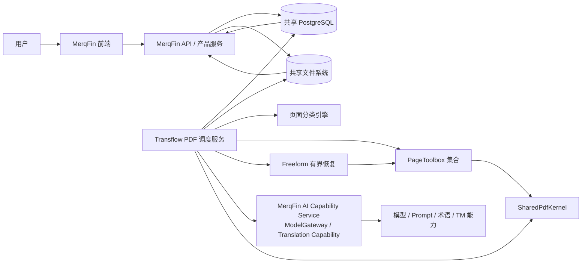

### 5.2 用例图

Mermaid 没有原生 UML Use Case 语法，下面用参与者与椭圆用例表达等价边界：

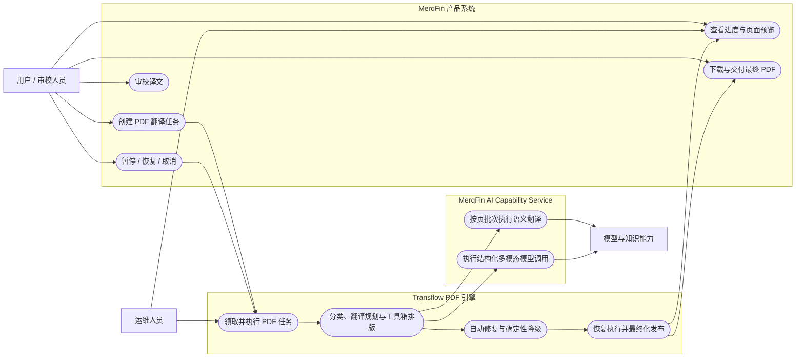

“运维人员”只负责服务健康、容量和故障处置，不参与某一页的翻译或排版选择；运行时页面恢复始终是自动的。

### 5.3 单机部署图

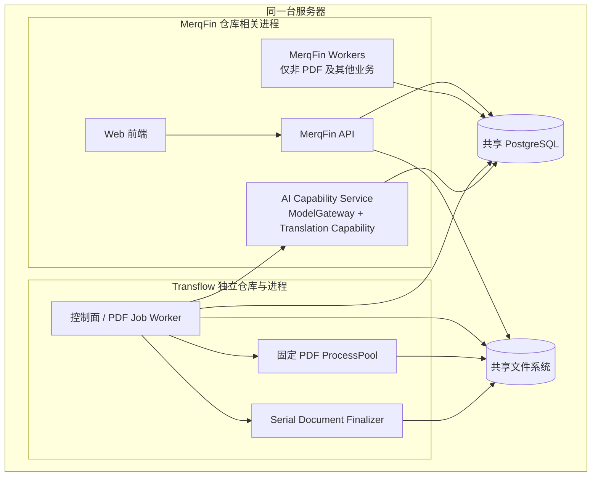

部署不要求 Docker。独立服务的含义是独立进程、Python 环境、启动停止和故障边界，而不是强制容器隔离。若任一服务采用容器运行，共享卷必须在 MerqFin、Transflow 和 AI Capability Service 需要访问的一侧挂载为相同规范路径；V1 不预先建设路径前缀换算层。

### 5.4 三个核心边界

#### MerqFin

保留：

- 用户、企业、项目和权限；
- 文件上传和下载；
- 产品任务创建；
- 用户控制操作；
- 进度和错误展示；
- 预览、审校、修订和交付；
- 术语、TM、Prompt、模型和知识资产管理；
- 非 PDF Translation Worker；
- learning、review、knowledge 等其他 Worker。

不再负责 PDF 内部：

- 领取并执行 PDF 工作流；
- 决定页面和翻译单元；
- 调度 PDF 单页翻译批次；
- PDF 排版、修复和最终化。

#### Transflow

负责：

- 只领取 PDF 任务；
- PDF 执行状态和资源调度；
- 页面分类和工具箱绑定；
- 翻译单元及批次规划；
- 通过两个 Port 调用 AI Capability Service；
- 排版、裁决、修复和降级；
- 预览、源 PDF 串行 Patch 回放和产物发布；
- 写回现有 PDF 任务执行数据。

#### MerqFin AI Capability Service

负责：

- 通过 ModelGateway 执行分类所需的结构化多模态模型调用；
- 接收 Transflow 提交的单页批量翻译请求；
- 统一 LiteLLM、Provider、模型配置、密钥、超时、限流、熔断、用量和审计；
- 解析 MerqFin 的 Prompt、术语、TM 和其他语义资产并执行翻译；
- Provider 级超时、限流和有限重试；
- 返回按 `unit_id` 对齐的译文、用量和错误。

不负责：

- 创建或领取 PDF 产品任务；
- 决定翻译哪些页面或单元；
- 拥有分类树、分类 Prompt、证据规则或 Resolver；
- PDF 分类、排版、预览或最终化；
- 文档级暂停恢复和整体进度。

### 5.5 数据和文件形态

生产形态保持不变：

- PostgreSQL 仍是任务和业务数据事实源；
- 本地共享文件系统继续存放 source、preview、target 和审计 Artifact；
- MerqFin 和 Transflow 在同一服务器运行；
- Transflow 与 AI Capability Service 使用独立进程和独立 Python 环境；
- 不要求通过 HTTP 传输大 PDF；
- MerqFin 继续通过现有 `target_file_path` 字段和下载 API 读取最终 PDF；字段可在发布事务中指向 run-specific 不可变文件；
- 若采用容器，双方看到的 source、preview、target 根目录必须是同一规范绝对路径。

### 5.6 集成通信与协调通道

| 信息 | 权威通道 | 不承载 |
|---|---|---|
| 任务创建、领取、租约、暂停/恢复/取消、进度和结果指针 | 共享 PostgreSQL | PDF 字节、模型大响应、任意事件流 |
| source、页级 PNG preview、最终 PDF 和审计 Artifact | 共享文件系统 | Job 状态机和服务间 RPC |
| 分类模型与语义翻译请求/响应 | AI Capability Service HTTP | PDF 文件传输和文档调度 |
| 用户进度、预览、审校和下载 | 现有 MerqFin API/SSE | Transflow 内部状态机 |

V1 沿用现有 Worker 的数据库轮询方式，不增加 Kafka、RabbitMQ、Redis，也不把 PostgreSQL `LISTEN/NOTIFY` 设为正确性前提。若以后用通知降低轮询延迟，通知只能作为唤醒信号；任务表、租约和 CAS 仍是权威。

---

## 6. 权威状态与写入边界

### 6.1 现有数据继续复用

生产集成优先复用：

| 现有数据 | 用途 |
|---|---|
| `translation_jobs` | 产品任务、执行阶段、进度、租约、控制和错误 |
| `translation_job_pages` | 当前 PDF JobRunner 的主页面记录，页级进度、质量和预览路径 |
| `translation_pages` | 仍被部分兼容查询使用的页面表，迁移期由 Adapter 处理兼容投影 |
| `translation_segments` | 稳定翻译单元、原文、译文和展示元数据 |
| `translation_artifacts` | 最终 PDF、审计文件和其他产物 |
| `source_file_path` | Transflow 读取的源 PDF |
| `target_file_path` | 数据库指向的 run 私有不可变最终 PDF |
| `preview_artifact_path` | 运行中目标页的 PNG 预览文件；MerqFin API 将其转换为前端预览 URL |

完整的分类证据、工具箱内部计划、质量 Finding 和修复轨迹不强塞进现有业务字段，优先写为同一任务目录下的 JSON Artifact，再通过现有 Artifact 记录引用。

### 6.2 ER 图与最小增量

现有业务表继续作为 MerqFin 的产品读模型。为保证 Transflow 的断点恢复、引擎版本追踪和页级幂等，建议在同一 PostgreSQL 中只增加两个运行账本表，并在 `translation_jobs` 增加一个执行所有者字段。它们不是第二套业务库，也不改变前端 API。

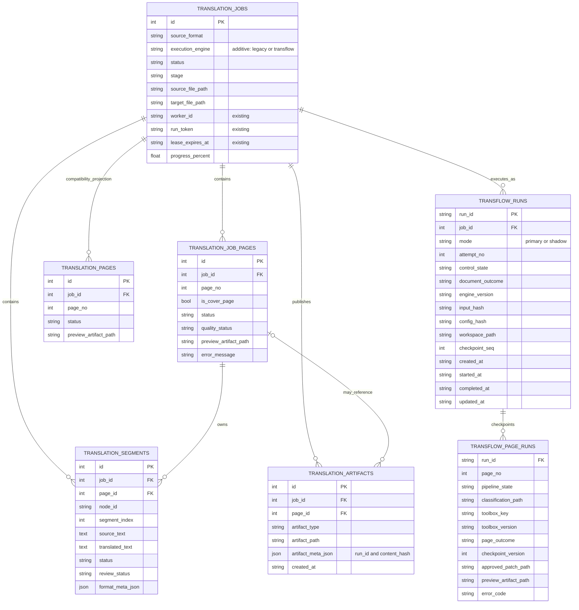

ER 图中的外键线首先表达逻辑关系；是否在现有大表上补物理外键，实施时根据历史脏数据和锁表风险决定，不是 V1 的前置条件。

`worker_id`、`run_token`、`lease_expires_at` 和 `review_status` 均为现有表字段；本次共享 Schema 的新增量只有 `translation_jobs.execution_engine` 与两张 Transflow 运行账本表。第一阶段的文件账本不进入 MerqFin Alembic，第二阶段才部署上述共享 Schema。

现场同时存在 `translation_job_pages` 与 `translation_pages`，而当前 JobRunner、任务预览和审校查询对两者的使用并不完全相同。V1 不在引擎核心里到处双写：`ProductProjectionAdapter` 以 `translation_job_pages` 为当前主记录，并在 M0 合同测试确认仍有消费者时，在同一事务内维护 `translation_pages` 兼容投影。待消费者清单证明可下线后，再单独合表；本次替换不顺手删除其中任何一张。

最小增量的用途：

- `execution_engine`：任务创建时确定 `legacy` 或 `transflow`，用于迁移期互斥抢单；领取后不得原地换引擎。
- `transflow_runs`：保存一次执行的模式、attempt、输入、配置、引擎版本、时间和最终结果。
- `transflow_page_runs`：保存每页最后一个已提交安全点，唯一键为 `(run_id, page_no)`。
- 大体积证据继续放共享文件系统，表中只保存状态、哈希和引用。

如果实施时已有等价的运行账本表，可以复用而不重复建表；但上述三种语义不能塞进无版本、无约束的日志文本中代替。

最小数据库约束：

- `execution_engine` 对历史任务回填并默认 `legacy`，生产值只允许 `legacy | transflow`；
- 同一 Job 同一时刻至多一个活动 `mode=primary` run；shadow 可与 primary 并存，但禁止写产品投影；
- `transflow_page_runs` 唯一键为 `(run_id, page_no)`，Checkpoint 只接受更大的 `checkpoint_version`；
- Artifact 使用 run-specific 不可变路径，`artifact_meta_json` 保存 `run_id + content_hash`，相同内容重放不得产生第二份权威产物；
- 在给现有 `translation_job_pages(job_id,page_no)` 或 `translation_segments(job_id,node_id)` 增加唯一约束前，M0 必须审计历史重复数据；若无法安全加约束，Adapter 持久保存首次创建的产品行 ID 并只按 ID 更新。

### 6.3 字段级写入所有权

为避免共享数据库中的双写冲突：

- MerqFin 创建任务并写入用户请求、文件路径和业务配置。
- MerqFin 只通过现有控制入口写入暂停、恢复、取消等用户命令。
- Transflow 持有 PDF 任务租约后，负责执行阶段、心跳、进度、页面、翻译单元、译文、预览和产物。
- AI Capability Service 不更新 PDF Job 状态；模型决定和译文均由 Transflow 校验后落库。
- 所有执行写入必须带租约或版本条件，禁止失去租约的旧进程覆盖新状态。

V1 继续复用 `translation_jobs.status` 作为用户控制面，不新增消息总线或控制命令表，但必须冻结以下条件更新：

| 动作 | 必须条件 | 原子写入 |
|---|---|---|
| API 请求暂停 | `execution_engine=transflow` 且非终态 | 产品 `status=paused`；run 进入 `PAUSING` |
| Worker heartbeat/checkpoint | `status=in_progress` 且 `worker_id/run_token` 匹配 | 只更新执行字段、租约或更高版本 Checkpoint |
| Worker 收敛暂停 | 产品 `status=paused` 且 token 匹配 | run 进入 `PAUSED`，条件释放租约 |
| API 恢复 | run 已为 `PAUSED` 且无有效租约 | 产品 `status=pending, stage=queued`；run 进入 `QUEUED` |
| API 取消 | queued/running/pausing/paused 等非终态 | 产品 `status=cancelled`；后续执行写和最终发布均被拒绝 |
| Worker 最终发布 | `status=in_progress`、owner/token 匹配且租约有效 | 登记不可变 Artifact、更新产品指针和完成状态 |

在 run 尚为 `PAUSING` 时立即恢复返回冲突，不清租约、不允许第二个 Worker 领取。Transflow Adapter 只执行窄字段 SQL + CAS，禁止复用 MerqFin 当前不带 token 的整行 `job_repo.update()`。

### 6.4 任务领取规则

当前 MerqFin Worker 的任务领取 SQL 未按文档格式过滤。集成时必须形成互斥规则：

```text
迁移期：
  source_format = pdf AND execution_engine = transflow
      -> 只能由 Transflow 领取
  source_format = pdf AND execution_engine = legacy
      -> 只能由旧 MerqFin Worker 领取
  source_format != pdf
      -> 只能由 MerqFin Translation Worker 领取

正式切换后：
  source_format = pdf     -> 只能由 Transflow 领取
  source_format != pdf    -> 只能由 MerqFin Translation Worker 领取
```

禁止两个 Worker 先领取任务、领取后再判断格式。格式和执行所有者条件必须同时进入候选任务查询及同一条原子抢占语句。任务创建时应把 `source_format` 归一化为 `pdf`，避免扩展名、MIME 和大小写产生路由分叉。

领取和租约过期判断使用 PostgreSQL `CURRENT_TIMESTAMP`，不依赖 Worker 本地时钟；M1 为最终 claim 谓词建立组合或部分索引，并以 `EXPLAIN` 和并发测试验证。claim 只完成所有权和租约切换，不顺手改写产品 `stage`；首个已提交业务步骤再写 `analyzing`。

任何执行更新都必须至少带 `job_id + status + worker_id + run_token` 条件；页级 Checkpoint 还必须带单调递增的 `checkpoint_version`。租约刷新失败后，旧进程立即停止提交状态和发布产物。

### 6.5 产品状态映射

Transflow 的执行结果比现有前端状态更丰富，但不需要修改第一版前端协议：

| Transflow 内部状态/结果 | `translation_jobs.status` | `translation_jobs.stage` | 补充事实 |
|---|---|---|---|
| 排队 | `pending` | `queued` | run 尚未开始 |
| 预检、分类 | `in_progress` | `analyzing` | 详细步骤在 run/page checkpoint |
| 翻译、排版 | `in_progress` | `translating` 或 `rendering` | 进度从已提交页面/单元聚合 |
| 暂停 | `paused` | 保留最后业务阶段 | 内部区分 `PAUSING/PAUSED` |
| 取消 | `cancelled` | 保留最后业务阶段 | 不发布新的最终文件 |
| 正常完成 | `completed` | `completed` | `document_outcome=COMPLETED` |
| 降级完成 | `completed` | `completed` | `document_outcome=COMPLETED_WITH_DEGRADATION` |
| 流程失败 | `failed` | `failed` | `document_outcome=PROCESS_FAILED` |

降级完成不能伪装成全量高质量成功：其覆盖率、回退页、错误码和报告必须写入 `transflow_runs` 与结果 Artifact；MerqFin 仍可按现有 `completed` 流程审校和下载。M0 先核对现有任务详情是否能展示这些事实；若不能，M5 前只增加一个向后兼容的降级摘要字段和 warning/badge，不重写前端流程。

### 6.6 Page/TranslationSegment 产品投影

Transflow 负责把内部合同投影为 MerqFin 已有页面和 `TranslationSegment` 数据：

- 一个源页面对应一个主 `translation_job_pages` 行；兼容表由 Adapter 维护，不由 Toolbox 双写。
- 每个 `TranslationUnit` 必须有跨重试稳定的 `node_id/unit_id` 和确定顺序，映射为 `translation_segments`。
- 新 Transflow Job 使用自身稳定的 unit/container ID；DocumentNext 的旧 node ID 不作为新引擎身份。旧任务不得带着旧 page/segment 半成品跨引擎恢复，必须从源文件建立新 run。
- AI Capability Service 的 Translation Capability 只返回译文；由 Transflow 校验后写 `translated_text`。
- 翻译调用失败时，segment 可标记失败并保留空译文，最终 PDF 对应区域使用原文。
- 译文有效但排版区域回退时，保留 `translated_text` 供审校，`format_meta_json` 记录 `applied_to_pdf=false`、region 和 fallback 原因。
- Job 完成后，MerqFin 人工审校对 `translated_text/review_status` 的修改属于产品侧写入；除非收到显式重建命令，Transflow 不得用旧 Checkpoint 覆盖人工结果。

`review_status` 存在于真实表但不在当前 `TranslationSegment` dataclass 中，因此 M2 必须以数据库表和 API 实际读写做合同测试，不能把 Python 模型镜像当成完整 Schema。

这样 MerqFin 的前端展示继续复用现有段落模型，同时最终 PDF 是否实际采用某段译文仍然可追溯。

### 6.7 MerqFin `main` 前端预览兼容合同

当前核验基线为 MerqFin GitHub `main@3d831c5b82faf85cf36bf6a351494624e4ee5b9c`（2026-06-14）。M0 若发现 `main` 已推进，必须重新运行合同测试，不能只沿用该提交号作假设。

现有前端并不使用 PDF.js 直接读取服务器 PDF。它先调用 `GET /api/tasks/{task_id}/preview` 获取页面、段落和 source/target 预览 URL，再以鉴权 Blob 请求 `GET /api/v1/translations/{job_id}/preview?kind=source|target&page=N&dpi=144`，最终显示 `image/png`。现有后端行为是：

- source：从 `source_file_path` 指向的完整 PDF 动态栅格化指定页；
- target 完成后：从 `target_file_path` 指向的完整 PDF 动态栅格化指定页；
- target 尚未完成：只在 `translation_job_pages.preview_artifact_path` 指向已存在的 `.png` 时返回页级预览；单页 PDF 不能作为该兼容字段；
- URL 的 `v` 参数来自目标文件或页级预览的修改时间/页面更新时间，用于避免读取旧缓存。

因此 Transflow 的产品投影必须满足：

1. 每个源页先建立稳定、1-based `page_no` 的 `translation_job_pages` 主记录，并按 M0 结果维护必要兼容投影。
2. 页面进入安全终态时，用 PyMuPDF 按 144 DPI 生成当前目标页 PNG；先写 `.partial`、校验 `image/png` 可解码，再原子 rename 为 run-specific 不可变文件。
3. 在同一页级 Checkpoint 事务中，以租约/CAS 条件写 `preview_artifact_path` 和页面 `updated_at`；不得让数据库指向半写文件。内部候选单页 PDF 只作裁决证据，不投影到该字段。
4. 完整目标 PDF 经 Preservation 校验并原子 rename 后，才在最终发布事务中更新 `target_file_path`；此后现有端点直接从完整 PDF 动态生成任意页预览。
5. `translation_segments` 继续提供前端块列表、译文、审校和高亮身份；只有页面图片而没有 Segment 投影不算完整兼容。

该合同不要求修改 MerqFin 前端。若实现方选择让现有后端预览接口支持单页 PDF，那属于额外 MerqFin 变更；V1 的最小兼容方案固定为“运行中 PNG，完成后完整 PDF”。

---

## 7. Transflow 文档级执行流程

### 7.1 推荐执行形态

生产入口的调度单位是一份完整 PDF，而不是穿刺阶段的单页 PDF。概念合同为：

```text
DocumentRunRequest
  source_pdf_path       # 一份只读、完整的 PDF
  source_hash
  source_language
  target_language
  config_snapshot/hash
  job_id / run_id
```

`StandaloneRunAdapter` 从开发/测试调用取得该合同，`MerqFinJobQueueAdapter` 从产品 Job 快照构造同一合同。`DocumentCoordinator` 必须自行打开完整 PDF、读取页数和原始页序，为每页建立稳定的 `page_no/PageFacts/PageExecutionPlan`，再交给分类和工具箱。PageToolbox 的生产输入是“完整源 PDF 路径 + page_no + 已序列化 PageFacts/共享事实”，不是用户提交的单页文件。

迁移期若某个 `LegacyToolboxAdapter` 因旧穿刺接口只能接收单页 PDF，可以在 run 私有目录中临时派生单页工作副本，但它必须满足：只由 Adapter 创建、只服务当前页、可重建、不进入产品输入合同、不作为最终拼接材料。对应叶迁移完成后应直接消费 `PageExecutionContext`；不得让“先把整本拆成单页 PDF，再拼回去”成为生产主链。

V1 采用“文档预检 + 页级并行验证 + 源 PDF 串行 Patch 回放”的保守模型：

1. 文档级预检读取全部页面元数据和直接事实。
2. 页面分类可并行执行，但在正式页面排版前形成完整路由清单。
3. 基于全书事实建立页眉、页脚、页码和重复边缘元素索引。
4. Document Coordinator 将页面计划放入有界 ready queue，只按文档/页面/Provider/PDF 进程预算放行，不能一次性启动年报全部页面。
5. 页面进入独立流水线，可按资源预算并行翻译和排版；每页安全点独立提交，暂停或重启后只重放未提交步骤。
6. 每页必须进入可最终化终态：批准 Patch、区域降级 Patch 或原页透传；不得因某一页失败漏掉该页或提前结束整本任务。
7. 全部原始页都进入终态后，Document Finalizer 只打开一次源 PDF 副本并按原页序串行回放已批准 Patch；透传页不执行写入。
8. 最终校验和原子发布产出一份页数、页序和文档特性满足 Preservation Contract 的完整目标 PDF。

该模型保留文档级一致性，同时避免把所有页面锁在一个巨大串行步骤中。

### 7.2 文档级活动图

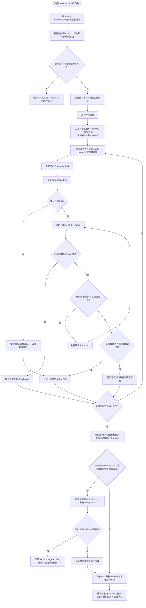

这张图冻结五个主流程不变量：只有 Transflow 领取 PDF；分类后才绑定工具箱；每页必须进入可最终化终态；Repair 有上限；全部页面终态后才能在源 PDF 副本上串行回放 Patch 和发布。

### 7.3 端到端步骤

| 步骤 | 执行者 | 主要输出 |
|---|---|---|
| 1. 领取完整 PDF 任务 | Transflow Scheduler | 租约、run_id、DocumentRunRequest |
| 2. 文档预检与枚举 | Document Coordinator | 文件哈希、完整页数、原始页序、可读性、页框清单 |
| 3. 页面事实 | SharedPdfKernel | PageFacts、保护对象、页面渲染证据 |
| 4. 页面分类 | Classification Engine | ClassificationRoute |
| 5. 公共边缘识别 | Margin Region Processor | 页眉、页脚、页码、保护元素 |
| 6. 绑定执行计划 | Router | PageToolbox 或 FreeformRecoveryPlan |
| 7. 构建翻译单元 | Toolbox / Recovery | TranslationUnit 列表 |
| 8. 调度翻译 | Transflow | TranslationBatch |
| 9. 执行语义翻译 | AI Capability Service / Translation Capability | TranslationBundle |
| 10. 排版规划 | Toolbox | PagePatch / RegionPatch |
| 11. 渲染和裁决 | Toolbox + Kernel | Candidate、Finding、QualityDecision |
| 12. 有限修复 | Repair Policy | 新候选或降级决定 |
| 13. 页面终态 | Page Finalizer | 批准 Patch、产品预览 PNG、页级结果或透传决定 |
| 14. 文档最终化 | Document Finalizer | 从源 PDF 副本串行回放 Patch 后的完整临时 PDF |
| 15. 不可变发布 | Artifact Publisher | immutable target、target_file_path、Artifact、最终状态 |

### 7.4 主执行时序图

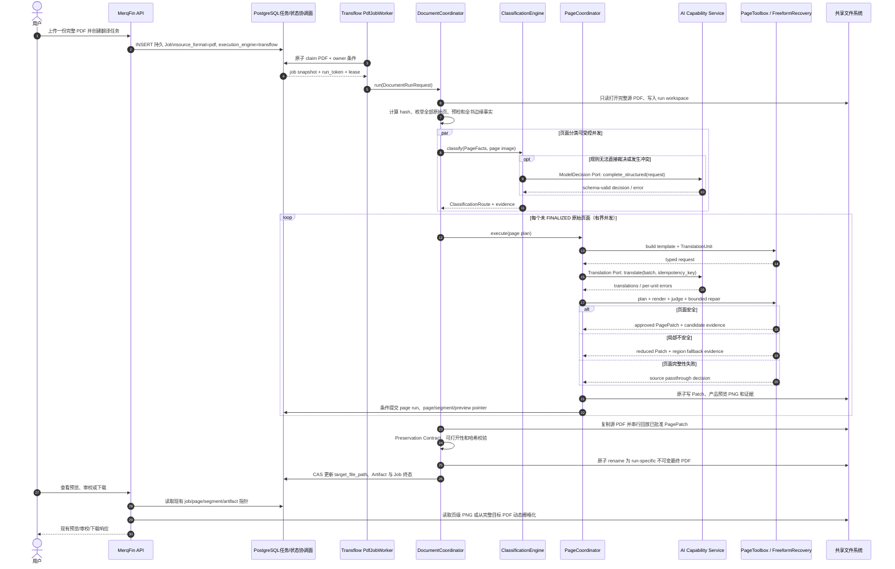

### 7.5 不允许人工介入

翻译和排版执行过程中不等待用户选择，也不进入“待人工处理后继续”的运行状态。

人工审校属于 MerqFin 在任务产出后的产品流程，不是 Transflow PDF 运行时的恢复手段。

---

## 8. 页面分类与工具箱路由

### 8.1 分类树保持不重构

V1 直接迁移现有分类树、规则、Prompt、一次复核和确定性归约。允许增加日志、超时、重试、依赖注入和工程包装，不在迁移阶段重新设计分类阈值和组合关系。

当前穿刺会把 `sample_id` 放入模型载荷，生产迁移必须删除 sample ID、文件名、源路径、gold 和人工标签。该修复会改变模型输入，因此迁移 Gate 保持控制流、失败语义和 Resolver 合同，不要求匿名载荷结果逐项等于旧载荷；T2 必须建立新的匿名分类基线。

### 8.2 路由表

| ClassificationRoute | V1 执行策略 |
|---|---|
| `cover` | Catalog 启用时使用 cover toolbox，否则确定性降级 |
| `contents` | Catalog 启用时使用 contents toolbox，否则确定性降级 |
| `end` | Catalog 启用时使用 end toolbox，否则确定性降级 |
| `visual_only` | SharedPdfKernel 原页透传和不可变校验 |
| `body.flow_text.single` | Catalog 启用时使用 single toolbox，否则确定性降级 |
| `body.flow_text.multi` | Catalog 启用时使用 multi toolbox，否则确定性降级 |
| `body.flow_text.visual_anchored` | Catalog 启用时使用 visual_anchored toolbox，否则确定性降级 |
| `body.table` | Catalog 启用时使用 table toolbox，否则确定性降级 |
| `body.chart` | Catalog 启用时使用 chart toolbox，否则确定性降级 |
| `body.diagram` | Catalog 启用时使用 diagram toolbox，否则确定性降级 |
| `body.anchored_blocks` | Catalog 启用时使用 anchored_blocks toolbox，否则确定性降级 |
| `body.composite.*` | Catalog 启用时使用对应的已迁移 composite 工具箱；不由全局引擎临时组合 |
| `body.freeform` | Freeform Recovery，不直接绑定普通工具箱 |
| `complete_to_leaf=false`，特别是 `failed_node=page.role` | V1 的 UnclassifiedPageRecovery 记录证据后整页透传；不借 freeform 实验扩大分类语义 |
| Catalog 未注册、合同版本不兼容或 Toolbox 初始化失败 | 记录能力失败；尝试同一有界恢复，失败则整页透传 |

### 8.3 显式 Catalog

生产路由使用版本化、显式映射，不建设可任意发现工具的全局插件系统。

概念结构：

```text
classification_path
  -> toolbox_key
  -> toolbox_version
  -> implementation_fingerprint
  -> supported_contract_version
  -> evidence_status
  -> enabled
  -> disabled_reason
```

`evidence_status` 保存穿刺与迁移证据，`enabled` 是唯一运行开关。只有迁移等价、硬约束、必要盲测和文档集成 Gate 通过后才允许 `enabled=true`；目录存在或代码已迁移不等于生产启用。未注册、未启用、版本不兼容或初始化失败时进入确定性降级，不允许模型临时猜测工具链。

---

## 9. PageToolbox 生产合同

统一 PageToolbox 外形是生产迁移目标，不是穿刺当前已经具备的事实。第一版允许 `LegacyToolboxAdapter` 包住各叶既有入口；对应叶通过等价 Gate 后，再收敛到下列合同，内部逻辑继续分类私有：

```text
PageExecutionContext = {source_pdf_path, source_hash, page_no, PageFacts, SharedRegions}

build_template(PageExecutionContext) -> PageTemplate
build_translation_request(PageTemplate, JobContext) -> TranslationRequest
plan_layout(PageTemplate, TranslationBundle) -> PagePatch
render(PageExecutionContext, PagePatch) -> CandidatePage
judge(PageExecutionContext, CandidatePage, PagePatch) -> QualityDecision
repair(QualityDecision, budget) -> RepairPatch | Stop
```

`PagePatch` 必须是可序列化的声明式操作，绑定 `source_hash + page_no + page_geometry + owner/region`，只引用受控字体和内容哈希；不得携带打开的 `fitz.Document`、临时页 PDF、HTML 或宿主机隐式资源。候选页和最终文档使用同一 Patch 解释器，Document Finalizer 回放前再次核对源哈希与页几何。

### 9.1 关键类图

类名用于说明职责和依赖方向，实施时允许按仓库风格微调；关系和边界不可反转。

```mermaid
classDiagram
    class PdfJobWorker {
        +poll_and_claim()
        +heartbeat()
        +observe_control()
    }
    class DocumentRunRequest {
        +source_pdf_path
        +source_hash
        +source_language
        +target_language
        +config_hash
    }
    class DocumentCoordinator {
        +run(DocumentRunRequest)
        +resume(RunCheckpoint)
        +finalize_document()
    }
    class PageCoordinator {
        +execute(PageExecutionPlan)
        +commit(PageOutcome)
    }
    class ClassificationEngine {
        +classify(PageFacts) ClassificationRoute
    }
    class BoundedDecisionRunner {
        +decide(spec, evidence, allowed_actions) DecisionResult
    }
    class ModelDecisionPort {
        <<interface>>
        +complete_structured(ModelDecisionRequest) ModelDecisionResult
    }
    class PageRouter {
        +bind(ClassificationRoute) PageExecutionPlan
    }
    class ToolboxCatalog {
        +resolve_enabled(key, version) PageToolbox
    }
    class PageToolbox {
        <<interface>>
        +build_template()
        +build_translation_request()
        +plan_layout()
        +render()
        +judge()
        +repair()
    }
    class FreeformRegionAdapter {
        +build_template(RegionExecutionContext)
        +build_translation_units()
        +plan_layout() RegionPatch
        +judge_local() QualityDecision
        +repair_limited() RegionPatch
    }
    class FreeformRecovery {
        +decompose(PageExecutionContext) RegionComposedPlan
        +resolve_from_fixed_map()
        +execute_regions()
        +merge_region_patches()
        +fallback_failed_regions()
    }
    class UnclassifiedPageRecovery {
        +passthrough_with_evidence(PageFacts) PageExecutionPlan
    }
    class SharedPdfKernel {
        +extract_facts()
        +apply_patch()
        +render_page()
        +check_constraints()
        +passthrough()
    }
    class TranslationPort {
        <<interface>>
        +translate(TranslationBatch) TranslationBatchResult
    }
    class JobQueuePort {
        <<interface>>
        +claim_pdf_job()
        +refresh_lease()
        +read_control()
    }
    class CheckpointPort {
        <<interface>>
        +load_run()
        +commit_page()
        +complete_run()
    }
    class ArtifactPort {
        <<interface>>
        +put_atomic()
        +verify()
    }
    class MerqFinJobQueueAdapter
    class StandaloneRunAdapter
    class FilesystemCheckpointAdapter
    class PostgresCheckpointAdapter
    class MerqFinProductProjectionAdapter
    class SharedFilesystemArtifactAdapter
    class FixedTranslationAdapter
    class HttpAiCapabilityAdapter
    class DocumentFinalizer {
        +replay_approved_patches()
        +validate_preservation_contract()
    }

    PdfJobWorker --> JobQueuePort
    PdfJobWorker --> DocumentRunRequest : builds
    PdfJobWorker --> DocumentCoordinator
    DocumentCoordinator --> DocumentRunRequest
    DocumentCoordinator --> ClassificationEngine
    DocumentCoordinator --> PageRouter
    DocumentCoordinator --> PageCoordinator
    DocumentCoordinator --> CheckpointPort
    DocumentCoordinator --> DocumentFinalizer
    PageRouter --> ToolboxCatalog
    PageRouter --> FreeformRecovery
    PageRouter --> UnclassifiedPageRecovery
    ClassificationEngine --> BoundedDecisionRunner
    BoundedDecisionRunner --> ModelDecisionPort
    ToolboxCatalog o-- PageToolbox
    FreeformRecovery --> ToolboxCatalog
    FreeformRecovery o-- FreeformRegionAdapter
    FreeformRegionAdapter ..> PageToolbox : reuses existing leaf logic
    PageCoordinator --> PageToolbox
    PageCoordinator --> TranslationPort
    PageCoordinator --> CheckpointPort
    PageToolbox --> SharedPdfKernel
    FreeformRegionAdapter --> SharedPdfKernel
    DocumentFinalizer --> SharedPdfKernel
    DocumentFinalizer --> ArtifactPort
    JobQueuePort <|.. MerqFinJobQueueAdapter
    JobQueuePort <|.. StandaloneRunAdapter
    CheckpointPort <|.. FilesystemCheckpointAdapter
    CheckpointPort <|.. PostgresCheckpointAdapter
    PostgresCheckpointAdapter --> MerqFinProductProjectionAdapter
    ArtifactPort <|.. SharedFilesystemArtifactAdapter
    TranslationPort <|.. FixedTranslationAdapter
    TranslationPort <|.. HttpAiCapabilityAdapter
    ModelDecisionPort <|.. HttpAiCapabilityAdapter
```

核心约束：

- `DocumentRunRequest` 只指向一份完整只读 PDF；页枚举和页计划由 `DocumentCoordinator` 生成。
- `domain` 合同不依赖 MerqFin 表、HTTP 客户端或 PyMuPDF 对象。
- `DocumentCoordinator` 只编排，不实现某一分类的布局算法。
- `PageToolbox` 消费 page context 并产出声明式 Patch，不把单页 PDF 当作产品输入或文档合并单元。
- 已验证的整页 `PageToolbox` 合同、分类路由和 Catalog 不因 freeform 实验而改变。
- `FreeformRegionAdapter` 是 freeform 私有兼容层，只包装既有叶工具/Judge/Repair；不向每个 Toolbox 强加新的 region 接口。
- `PageToolbox` 不能自行领取任务、改变文档状态或直接调用 MerqFin API。
- `TranslationPort` 返回语义结果，不返回排版决定。
- `SharedPdfKernel` 只提供机械能力，不判断页面属于表格还是正文。

### 9.2 工具箱私有内容

- 容器所有权和语义分组；
- 分类特有布局参数；
- 分类特有 Finding；
- 分类特有修复顺序；
- 分类特有 Prompt；
- 分类特有回归样本和 Gate。

### 9.3 公共内容

- PDF 事实提取；
- 字体资产解析、探测和字形覆盖；
- 原页保护对象；
- Patch 机械写入；
- 渲染和截图；
- 越界、溢出、遮挡、残留和不可变对象校验；
- Artifact、哈希和状态轨迹；
- 修复预算、接受和回滚。

生产字体策略保持最小：发布资产只冻结一套主要 CJK 字体和必要的 Latin/fallback 字体，不从 `C:/Windows/Fonts` 或其他宿主机系统目录隐式取字体。字体文件可以作为 release asset 随包部署，不要求提交进 Git；路径、版本、许可证和 SHA-256 进入配置快照。字体冻结后必须重录布局基线，并在灰度前通过字形覆盖、跨平台加载和最终 PDF 体积 Gate。V1 不预先引入 fonttools 或另一套字体子集流水线；只有体积 Gate 证明需要时，才在 T6 增加最小子集化实现并单独回归。

### 9.4 不做过早抽象

同一逻辑只有满足以下条件才下沉公共层：

1. 已在至少两个工具箱中出现；
2. 输入输出合同一致；
3. 不依赖具体页面类别语义；
4. 下沉前后等价回归通过。

在此之前允许工具箱内存在重复实现，避免为了“代码漂亮”破坏已经验证的行为。

---

## 10. 页眉、页脚与公共边缘区域

现有多个工具箱已经各自处理语义页眉、语义页脚、页码和边缘保护对象。新引擎应抽取窄的公共前处理和保护合同，但不一次性重写所有工具箱内部算法。

### 10.1 公共处理职责

`MarginRegionProcessor` 负责：

- 使用当前页直接事实和全书重复性证据识别页眉、页脚和页码候选；
- 区分语义文字、纯页码、年份/期号、URL、Logo 和不可编辑对象；
- 为语义文字生成稳定 owner 和安全区域；
- 将页码、图形和其他锁定对象写入保护清单；
- 把公共结果交给具体 Toolbox 消费。

### 10.2 行为约束

- 语义页眉和语义页脚可翻译；
- 纯数字页码保持原位；
- 图片、Logo 和装饰图形不翻译；
- 公共处理不能吞并正文、表注或图表标签；
- 如果公共判断不确定，所有权保留给具体 Toolbox；
- 初次迁移允许 Toolbox 继续调用原实现，待等价证据充分后再统一。

---

## 11. Freeform 有界恢复与兜底

### 11.1 语义

`body.freeform` 表示上游分类不确定，不代表页面没有结构，也不等于某个普通工具箱。

生产引擎不得像穿刺阶段一样在 freeform 处直接停止。它必须尝试有界恢复，并无论结果好坏都形成可最终化页面。

当前分类结果目录没有真实 freeform 页面，所以下述能力是第一阶段的受控新增，不伪装成已由穿刺证明的高质量工具箱。V1 对它的首要 Gate 是必收敛、所有权安全、无越界和证据完整；真实页面出现后再补质量覆盖率 Gate。

该实验只在 ClassificationEngine 已经输出 `body.freeform` 后触发，不回写分类结果、不增加分类叶、不改变已知叶到整页 Toolbox 的绑定，也不要求先重构任何已穿刺通过的 Toolbox。

由于现有分类结果缺少真实 freeform 页，T5 可以从授权的混合正文样本中选取结构多样页面，在**测试 wiring** 中显式注入 `body.freeform` Route 来观察拆区效果；该注入不得进入 production wiring，不改原样本 gold，也不能反向证明 Classification 应把这些页面归为 freeform。自然产生的真实 freeform 页面出现后，再加入独立盲测集。

### 11.2 区域输入与输出合同

Freeform 不重新猜一个整页分类，而是把 Body 解析为互不重叠的区域计划。输入只来自完整 PDF 当前页的直接事实与已冻结探针：

- 原生 text span/block、字体、bbox、基线和阅读顺序候选；
- image、drawing、line、rect、填充和相互包含/相交关系；
- `page.find_tables()` 与分类穿刺已有的无边框表格行列锚点证据；
- 稳定列带、垂直留白 gutter、对齐关系和跨块间距；
- 全书公共页眉、页脚、页码和保护对象；
- 原整页 Toolbox 的 Gate 状态，以及 freeform 私有 Adapter 是否已通过单独实验 Gate。

概念合同：

```text
RegionPlan
  region_id
  region_kind
  bbox / clip
  owned_object_ids
  protected_object_ids
  reading_order
  confidence + evidence_refs
  toolbox_key + toolbox_version
  fallback = KEEP_SOURCE

RegionComposedPlan
  page_no + source_hash
  ordered_regions[]
  passthrough_object_ids[]
  ownership_manifest
```

每个可编辑文本原子必须恰好属于一个 `RegionPlan`，或被明确登记为 `KEEP_SOURCE`；图片、绘图等锁定对象可以被某区域引用为 anchor，但所有权仍为 protected。没有登记的“悬空文字”和同一对象被两个区域同时改写都属于合同失败。

### 11.3 正文拆分顺序与工具匹配

`FreeformRecovery` 只执行一次由“高特异结构到普通正文”的确定性分解，避免普通 flow_text 先吞掉表格单元格或图表标签：

1. 先扣除公共页眉、页脚、页码、Logo、图片化文字和不可编辑对象。
2. 用显式网格或稳定行列锚点领取高置信表格区域及其原生单元格文字。
3. 从 image/drawing/connector 等视觉主体出发，只吸附空间关系明确的标题、图例、轴标签或节点标签，形成 chart/diagram 候选。
4. 识别围绕稳定视觉 anchor 连续流动的正文，以及彼此独立、各自绑定 anchor/slot 的文本块。
5. 对剩余原生正文按连通性、对齐和留白切成文本区域；存在贯穿足够高度的稳定 gutter 时形成多栏，否则形成单栏。
6. 以具体结构优先级解决重叠，收缩到安全边界；仍有冲突的对象不强行归类，直接登记为 `KEEP_SOURCE`。
7. 只有全部对象所有权闭合、区域互不重叠且对应 freeform 私有 Adapter 已通过实验 Gate 时，才生成 `region_composed` 计划。

固定区域类型和能力映射如下：

| `region_kind` | 最小结构证据 | 复用能力 | 区域级失败 |
|---|---|---|---|
| `flow_text.single` | 同一主 x-band 内存在连续阅读流，无稳定分栏 gutter，无更高优先级结构占有文字 | freeform 私有 Adapter 包装 `body.flow_text.single` 既有 tools/Judge/Repair | 原文保留 |
| `flow_text.multi` | 两个及以上稳定列带，由贯穿正文高度的留白 gutter 分隔，列内阅读顺序可闭合 | freeform 私有 Adapter 包装 `body.flow_text.multi` 既有 tools/Judge/Repair | 原文保留 |
| `flow_text.visual_anchored` | 连续正文围绕一个或多个受保护视觉 anchor 流动，仍存在单一正文阅读流 | freeform 私有 Adapter 包装 `body.flow_text.visual_anchored` 既有 tools/Judge/Repair | 原文保留 |
| `table` | `find_tables` 网格，或无边框表格的重复行、稳定列锚点与同行配对证据 | freeform 私有 Adapter 包装 `body.table` 既有 tools/Judge/Repair | 整表原文保留，不逐单元格冒险拼接 |
| `chart` | 图像/绘图主体及明确关联的原生标题、图例、轴/数据标签；图像内部文字不 OCR | freeform 私有 Adapter 包装 `body.chart` 既有 tools/Judge/Repair | 只保留该图表区域原文 |
| `diagram` | 连接线/节点几何及明确归属的原生标签 | freeform 私有 Adapter 包装 `body.diagram` 既有 tools/Judge/Repair | 只保留该图示区域原文 |
| `anchored_blocks` | 多个独立文本容器分别绑定图形/槽位，不构成连续正文流或连接图 | freeform 私有 Adapter 包装 `body.anchored_blocks` 既有 tools/Judge/Repair | 按独立 owner 回退；所有权不清则整区原文 |
| `protected_passthrough` | 图片化文字、OCR 才可读、能力未启用或证据冲突 | 不调用翻译/排版工具 | 原样保留 |

这些 Adapter 只存在于 `freeform` 模块的固定映射中，不修改 Classification taxonomy、PageRouter、现有整页 Toolbox 入口、原执行顺序或原 Gate。第一版优先包装现有可直接调用的 Template/Layout/Judge/Repair；不为了适配 freeform 先重构叶工具箱。如果既有实现不能在 `RegionExecutionContext = PageExecutionContext + clip + owned_object_ids` 约束下安全运行，该区域就记为 `MISSING_TOOL` 并保留原文。

Adapter 不能把完整页面 Toolbox 不加约束地套在裁剪框上：它必须拦截输入和输出，保证 Patch 只能修改本区域 owner。freeform 实验通过后是否把区域能力反向沉淀到各 Toolbox，属于后续版本决策，不是 V1 前置工作。

已知 `body.composite.*` 分类仍走各自通过 Gate 的整页 composite Toolbox；freeform 不猜测 composite 叶。freeform 的 `region_composed` 只是固定 allow-list 下的恢复计划，不改变原分类结果，也不建立运行时自由组合器。

### 11.4 区域执行活动图

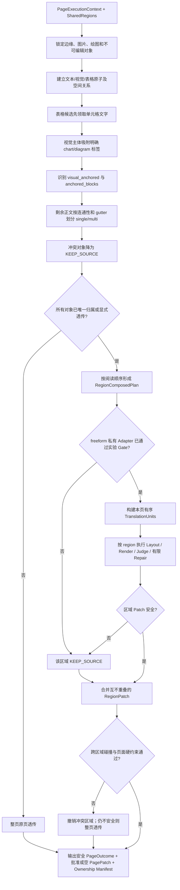

同一 freeform 页的 TranslationUnit 仍组成一个单页 TranslationBatch，并携带稳定 `region_id/container_id/unit_id`；Transflow 按全页阅读顺序发送，译文返回后再按 region 分派布局。这样不会因区域拆分退化为跨页或无序的小请求风暴。

### 11.5 所有权、合并与冲突消解

- 所有权优先级固定为：protected 对象 > 表格单元格 > chart/diagram 明确标签 > anchored owner > 普通正文；优先级只用于避免双重领取，不表示低优先级内容可以被删除。
- bbox 相交本身不足以认定同一 owner；必须有表格 cell、anchor、connector、对齐/阅读流等结构证据。
- `RegionPatch` 必须绑定 `region_id + owned_object_ids + source_hash + page_no`；合并器拒绝跨 owner 修改和重叠写区域。
- 争议对象直接保留原文；移除争议对象后若区域合同不再成立，整个区域降级，不把它硬塞进 flow_text。
- 所有区域局部 Judge 通过后还必须执行一次全页碰撞、溢出、残留、锁定对象和阅读完整性检查。

### 11.6 有界原则

- 只允许固定次数的证据校验和叶子内部 Repair；
- V1 最多执行一次区域分解，不递归分解、不循环重分类；
- 不建设单独的通用区域分类 Agent，不让模型从全局工具集中自由编排；
- 不在运行时创造新工具；
- 一旦预算耗尽，立即进入区域回退或页面透传。

现有叶子内部可以继续使用其已经验证的有限 Repair 预算，但 freeform 不额外叠加第二套开放式规划循环。具体 Repair 次数在 T0 合同中冻结并纳入回归，不作为开放式用户配置。

### 11.7 原子区域回退

页面由多个区域组成时：

- 安全完成的翻译区域保留；
- 不安全区域撤销本区域 Patch，恢复原始内容；
- 表格、chart、diagram 等结构区域的 owner 合同一旦失效，按整个区域回退，不留下半张表或半组标签；
- 仅当页面级硬约束、渲染完整性或文档最终化校验失败时整页透传；
- 最终页面允许中英混排，但必须完整、可打开、可追溯。

### 11.8 非 Body 根节点失败

若 `page.role` 没有归约成功，生产引擎不得把它伪造为 `body.freeform`，因为两者证据语义不同。Router 进入更保守的 `UnclassifiedPageRecovery`：

1. 锁定全部图片、矢量对象、页码和不确定对象。
2. V1 不调用 freeform 私有 Adapter，不把本次正文模块化实验扩大到 `page.role` 未知页面。
3. 不推断 cover、contents、end 或 body 语义，不使用类别特有重排。
4. 记录 `failed_node`、证据和能力降级后整页原页透传。

因此分类树的每个失败出口都有终态：已知叶工具箱、`body.freeform`、Unclassified 恢复或页面透传，不存在“无路由、等待人工或停止整本”的第五种状态。

---

## 12. “失败也必须出结果”的结果模型

### 12.1 状态与质量分离

不能用单一 `success/failed` 表达执行结果。至少记录：

| 维度 | 值 |
|---|---|
| ArtifactProduced | `YES`、`NO` |
| ArtifactIntegrity | `PASS`、`FAIL` |
| TranslationCoverage | `FULL`、`PARTIAL`、`NONE` |
| Capability | `SUPPORTED`、`PARTIAL`、`MISSING_TOOL` |
| Quality | `PASS`、`FAIL` |
| Fallback | `NONE`、`REGION_FALLBACK`、`PAGE_PASSTHROUGH` |
| DocumentOutcome | `COMPLETED`、`COMPLETED_WITH_DEGRADATION`、`PROCESS_FAILED` |

### 12.2 完成规则

- 源 PDF 可读取且目标位置可写：必须尽最大努力产生完整 PDF。
- 所有页面正常通过：`COMPLETED`。
- 任一页面区域回退、页面透传或质量未通过：`COMPLETED_WITH_DEGRADATION`。
- Patch 串行回放或 Preservation Contract 校验失败：按同一发布协议复制并校验源 PDF，成功则作为整本文档透传，结果为 `COMPLETED_WITH_DEGRADATION`。
- 只有源文件不可读取，或连原始 PDF 副本也无法写入/校验/原子发布时：`PROCESS_FAILED`。

`PROCESS_FAILED` 也必须保留日志、状态轨迹和已有诊断 Artifact，但不能伪称已产生可交付 PDF。

### 12.3 PDF Preservation Contract

最终 PDF 不是由页级候选 PDF 拼接出来，而是从源 PDF 副本开始，按页码串行回放已批准的 `PagePatch`。页级候选 PDF 只用于渲染、裁决和审计。

V1 的最低完整性合同为：

- 页数、页序、MediaBox、CropBox 和旋转信息不变；
- 未批准修改的页面与区域不得被重建；
- 目录/书签、页标签、链接、批注、Widget/表单、附件、元数据、加密/权限、数字签名和结构化标签在预检中登记；
- 对无法证明可安全保留的文档级特性，不得静默丢失：该文档改为整本源 PDF 透传并记录明确降级；
- 任何内容修改都会使已有数字签名失效，V1 对已签名 PDF 默认整本透传，不输出“看似仍有效”的修改版；
- 最终产物只有通过该合同和可打开性检查，`ArtifactIntegrity` 才能记为 `PASS`。

Preservation Contract 只承诺已经列明并有测试覆盖的特性；新增 PDF 特性先补基线样本和 Gate，再扩大承诺。

---

## 13. 状态机、暂停与恢复

### 13.1 JobControlState

控制状态与页面业务状态分离：

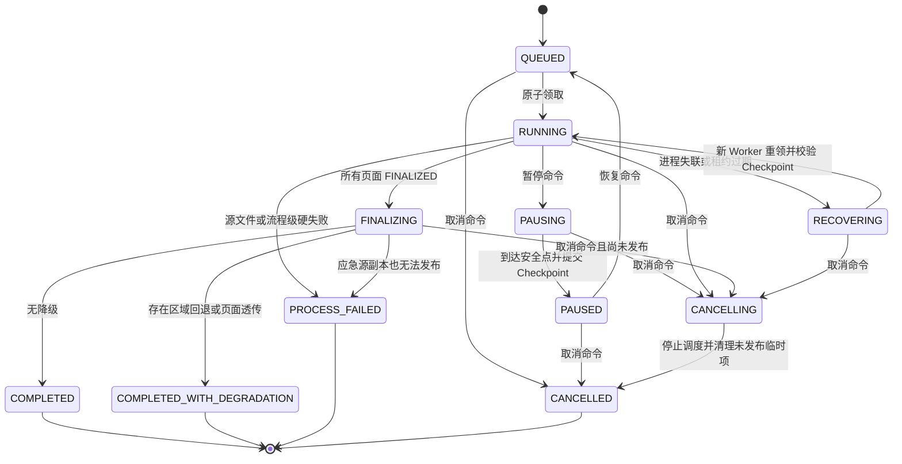

生产落库时映射到 MerqFin 现有 JobStatus/JobStage，不要求为了内部枚举立即修改前端协议。

### 13.2 PagePipelineState

推荐内部状态：

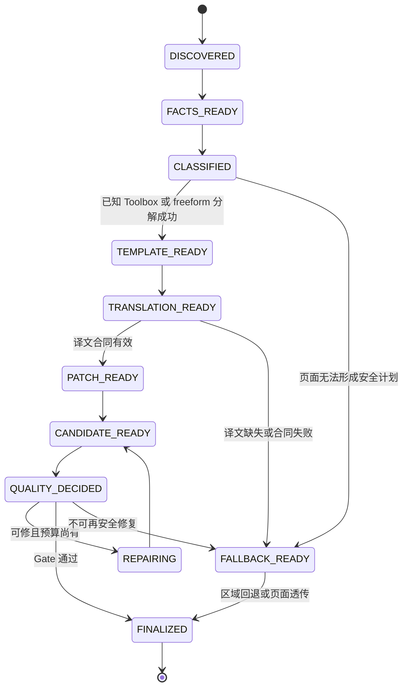

`FINALIZED` 是页面可进入文档最终化的终态，具体结果由 PageOutcome 区分正常、区域降级或页面透传。

### 13.3 暂停语义

收到暂停命令后：

1. 不再调度新的页面或翻译批次。
2. 正在执行的原子步骤允许完成或在安全点中断。
3. 完成的步骤写入幂等 Checkpoint。
4. 释放模型并发槽和进程池任务占用。
5. 状态进入 `PAUSED`。

### 13.4 恢复语义

- 服务或服务器重启后可恢复；
- 已 FINALIZED 的页面不重跑；
- 已通过合同校验并提交 Checkpoint 的译文不重复请求；
- 未原子提交的步骤可以重放；
- 文档最终化和最终发布必须幂等；
- 恢复前重新校验源文件哈希、配置快照和工具箱版本。

源文件哈希、配置快照、字体资产或工具箱实现指纹不一致时，不得继续旧 Checkpoint；旧 run 保留为审计记录，从源 PDF 创建新 run/attempt。产品 Job 重新进入现有 `queued` 语义，内部页面 Checkpoint 不直接暴露为产品 stage。

### 13.5 暂停、进程重启与恢复时序

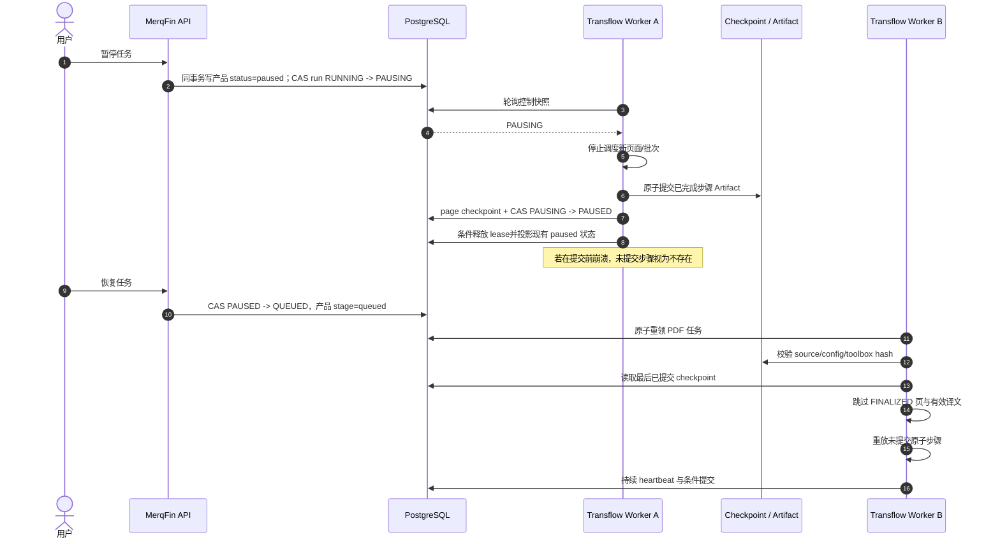

暂停命令对用户立即可见；内部 `PAUSING` 到 `PAUSED` 的短暂收敛由运行账本表达。处于 `PAUSING` 时再次恢复返回冲突，必须等待安全点收敛。任何迟到的旧 Worker 更新都必须因 `status + worker_id + run_token + lease/checkpoint_version` 条件不匹配而失败。

---

## 14. 并发与资源模型

### 14.1 进程结构

采用混合并发：

```text
Transflow 主进程
├─ 控制面：任务租约、状态、日志、暂停恢复
├─ asyncio I/O：通过两个 Port 调用 AI Capability Service
├─ 固定 ProcessPool：PDF 提取、工具箱排版、渲染、裁决
└─ 串行 Document Finalizer：源 PDF 副本 Patch 回放、校验与发布
```

### 14.2 PDF 进程安全

- 不在线程间并发操作同一个 PyMuPDF Document。
- 不把打开的 `fitz.Document` 跨进程传递。
- Worker 进程只接收文件路径、页码和序列化合同。
- 每个进程自行打开并关闭 PDF。
- 临时文件按 job/run/page 隔离。

### 14.3 并发控制

并发预算至少分为：

- 同时执行的文档数；
- 每文档活跃页面数；
- 分类模型并发数；
- 翻译服务并发数；
- PDF 进程池大小；
- 每页修复预算。

默认值在性能基线后冻结。V1 不引入 Celery、RabbitMQ 或 Redis，仅复用 PostgreSQL 任务领取与 Python 标准并发设施。

---

## 15. 重试、修复与超时

三种重试必须分开：

| 类型 | 处理 |
|---|---|
| 网络/Provider 重试 | AI Capability Service 处理 Provider 超时、限流和短暂 5xx；Transflow HTTP Adapter 只重试满足幂等条件的传输失败 |
| 原子任务重试 | Transflow 重放页面事实、模板、渲染等幂等步骤 |
| 产品修复循环 | Toolbox 根据 Finding 执行有限 Repair 后重渲染、重裁决 |

禁止使用同一个通用 `retry_count` 混合三种语义。

达到预算后必须落入明确结果：

- 翻译缺失：对应区域保留原文；
- 排版不安全：区域回退；
- 页面硬约束失败：页面透传；
- Patch 回放或 Preservation Contract 失败：改用原始 PDF 做整本文档级透传；连应急副本也无法发布才流程失败。

除上述页内预算外，必须有文档 run/attempt 硬上限，防止坏任务因租约恢复无限循环。达到上限后由应急 Finalizer 直接发布源 PDF 透传结果；仅当源副本也无法发布时才 `PROCESS_FAILED`。同一 Provider 连续失败达到运行阈值后，本 run 内快速转入确定性 fallback，不让后续数百页重复等待相同超时；具体次数在 T0 配置合同中冻结。

---

## 16. LLM 与 Translation Ports

### 16.1 逻辑接口

```text
translate(batch: TranslationBatch) -> TranslationBatchResult

complete_structured(request: ModelDecisionRequest) -> ModelDecisionResult
```

两个逻辑 Port 由同一个 `HttpAiCapabilityAdapter` 实现，但领域合同保持分离：Translation Port 只返回按 unit 对齐的语义译文；ModelDecision Port 只承载分类所需的结构化多模态模型调用。模型地址、API Key、LiteLLM 和 Provider 兼容逻辑不进入 Transflow 生产包。

`TranslationBatch` 只包含单页内按阅读顺序排列的 TranslationUnit；跨页只有调度并发，不合并为同一翻译请求。V1 不解决跨页断句，术语一致性通过同一不可变 Prompt/术语/TM/模型配置快照保证。

最小请求内容：

- request_id / idempotency_key；
- job_id、page_id；
- source_language、target_language；
- 有序 TranslationUnit；
- 必须保留字面量；
- Prompt/术语/TM/模型配置快照引用；
- 超时和追踪信息。

最小响应内容：

- request_id；
- 按 unit_id 对齐的译文；
- Provider、模型和请求 ID；
- token/用量；
- 每单元错误和批次错误；
- 响应哈希。

配置快照引用在任务领取时必须解析为不可变内容或内容哈希，恢复时可验证；密钥和短期令牌不得进入快照。`idempotency_key` 只在服务端确实有去重账本或 Provider 去重保证时承诺 exactly-once；否则接口和审计明确采用 at-least-once，并允许记录可能的重复计费，不能以“服务无状态”掩盖这一点。

### 16.2 第一阶段

提供：

- FixedTranslationProvider；
- DeterministicTestProvider；
- 仅用于迁移等价测试的 Qwen spike Adapter。

Qwen spike Adapter 不进入 production wiring/wheel，也不成为最终模型运行时。第一阶段用 Fixed/Deterministic Provider 验证工作流，用 fake HTTP AI Capability Service 验证两个 Port 合同；不复制 MerqFin 全部翻译能力。

### 16.3 第二阶段

在 MerqFin 仓库中建立一个独立进程的 AI Capability Service，内部只有一套 ModelGateway，向 Transflow 提供结构化模型调用和单页批量翻译两个接口。

AI Capability Service 可以读取共享数据库中的模型和知识资产，但不领取 PDF Job、不推进 PDF 状态、不写 PDF 产物。Transflow 校验翻译响应后写入现有 `translation_segments.translated_text`；分类结果仍由 Transflow 的规则、Prompt、Schema 和 Resolver 负责解释。

Translation Port 隔离具体传输方式；同机部署首选仅监听 loopback/内网接口的 HTTP 请求/响应，并使用服务令牌、请求大小限制和明确超时。PDF 和大型 Artifact 仍通过共享文件系统传递。

第一版 AI Capability Service 代码留在 MerqFin 仓库并作为独立进程启动，不新建第三个仓库：它最靠近现有 Provider、Prompt、术语和 TM 资产；Transflow 只依赖稳定的 HTTP 合同。Provider 地址、模型和超时全部来自配置，启动健康检查失败或运行期持续不可用时按 §15 快速降级。

### 16.4 Prompt 与 JSON 合同适配

MerqFin 旧 PDF 翻译 Prompt 与 Transflow 合同不能整套直接复用。MerqFin 当前 Prompt 虽以 Markdown/文本方式组合，但实际输入依赖 compact XML-like 数据、`[[[SEG:n|NODE:id]]]` 和部分 `[LINE n/m]` 标记，输出由旧 marker parser 对齐；Transflow 则以稳定 `unit_id/container_id`、有序单页 units 和严格 JSON Schema 为权威。两者若直接拼接，会造成 ID 丢失、解析 fallback 和旧 DocumentNext 语义渗入新引擎。

复用边界固定为：

| 层 | V1 处理 |
|---|---|
| LiteLLM、Provider 兼容、模型配置、密钥、超时、限流、熔断、用量与审计 | AI Capability Service 内唯一实现，直接复用 |
| 忠实翻译、数字/金融表达、受控术语优先级等稳定语义政策 | 复用为公共 system policy |
| MerqFin 术语、TM、Prompt Example、Style Pack 和模型选择 | 按任务快照匹配后，以受限 runtime context 注入 |
| 旧 XML-like source、SEG/NODE marker、LINE marker、DocumentNext node ID 和旧输出 parser | 不迁入 Transflow 合同 |
| Transflow `PageTranslationRequest/PageTranslationBundle` | 新增独立 Prompt 场景和严格 JSON Schema |

MerqFin Prompt Runtime 新增 `transflow.page_units.v1` 场景，不修改仍服务旧 JobRunner 的 legacy 场景：

```text
system = 公共语义政策 + page_units_json_v1 输出合同
user   = {request_id, page_id, languages, ordered units, required_literals,
          bounded glossary/TM/style context}
response_format = 严格 PageTranslationBundle JSON Schema
```

每个输入 unit ID 必须恰好返回一次、不得新增或改写；模型不接收 bbox、字体、Patch 或布局决策。旧 legacy marker 场景只在回滚观察期保留，M6 后随旧 PDF JobRunner 单独删除。分类 Prompt 不复用 MerqFin 翻译 Prompt：它继续由 Transflow 持有，但通过同一个 ModelGateway 执行。

### 16.5 公共库和安装边界

“公共能力只有一套”不等于共享一个物理 Python 环境：

- 禁止把项目源码手工复制到全局 `site-packages`；`site-packages` 是安装结果，不是源码和版本事实源；
- 禁止建立无版本、无所有者的 `public/common` 目录供两个独立仓库通过相对路径或 `PYTHONPATH` 交叉 import；
- Transflow 与 AI Capability Service 使用独立 venv/进程和各自 lock file；共同依赖锁定兼容版本，但升级可独立回滚；
- LiteLLM、Provider、密钥和模型选择只安装在 AI Capability Service；Transflow 生产环境只需要 HTTP client、合同模型和自身 PDF 依赖；
- V1 以版本化 OpenAPI/JSON Schema 作为跨仓库唯一合同源，发布时记录 schema version/hash，并用双方合同测试防漂移；
- V1 不为少量 DTO 新建第三个公共包。只有纯合同/纯算法已经被两个以上进程内消费者稳定复用、HTTP 边界确实不合适时，才提取独立版本、可发布 wheel，并经包仓库安装；不得使用共享可变目录替代版本管理。

| 内容 | V1 唯一归属 | 复用方式 |
|---|---|---|
| LiteLLM、Provider、密钥和模型治理 | MerqFin AI Capability Service | Transflow 经两个 HTTP Port 使用，不复制库封装 |
| Prompt Runtime、术语、TM、Style 和语义政策 | MerqFin AI Capability Service | 按任务快照解析；Transflow 不 import MerqFin 源码 |
| ModelDecision / PageTranslation 跨服务 DTO | 版本化 OpenAPI/JSON Schema | AI Service 发布，Transflow 保存合同快照并做兼容测试 |
| PyMuPDF、PdfKernel、分类树和 Toolbox | Transflow | 不作为 MerqFin 公共库 |
| Python/FastAPI/Pydantic/httpx 等第三方依赖 | 各进程自己的 lock file | 对齐兼容版本，不共享 venv |

将一个独立发布、带版本的 wheel 通过包管理器安装进各自 venv 的 `site-packages` 是允许的；禁止的是手工复制源码到全局 `site-packages`。V1 尚无足够证据需要这个 wheel，因此先不建。

---

## 17. 日志、证据与可观测性

每条结构化日志至少包含：

- service；
- job_id；
- run_id；
- page_no；
- classification_path；
- toolbox_key/version；
- unit_id 或 region_id；
- stage/state；
- attempt；
- duration_ms；
- outcome；
- fallback；
- error_code；
- artifact_ref。

必须保存：

- 任务配置快照；
- 分类路由和证据摘要；
- 工具箱版本与实现指纹；
- 翻译请求/响应审计摘要；
- Patch 和 Finding；
- 修复轨迹；
- 页级最终结果；
- Patch 回放清单；
- 最终质量和降级摘要。

日志不得写入 API Key、完整密钥、无界原文或敏感 Provider 响应。

V1 不强制引入 Prometheus。结构化日志和运行报告至少能聚合：队列等待时间、页耗时、租约丢失次数、进程池占用、翻译/分类超时率、`degradation_rate`、`region_fallback_rate`、`page_passthrough_rate`、翻译覆盖率和工作目录字节数。

保留策略按三类执行：最终 PDF 与产品记录、审计/回归证据、可重建临时文件。任何清理只依据 run manifest 删除已登记路径；具体期限和容量阈值在 T6 用 1/20/100/300 页基线冻结，不在总体设计中虚构 SLO。

---

## 18. Artifact 与原子发布

### 18.1 工作目录

沿用 MerqFin 现有任务目录，在其下增加受控的 Transflow 运行子目录：

```text
<job-workspace>/
├─ source
├─ transflow/
│  └─ <run_id>/
│     ├─ job/
│     ├─ pages/<page_no>/
│     ├─ previews/page-<page_no>-<checkpoint>-<hash>.png
│     ├─ logs/
│     ├─ reports/
│     └─ final/
├─ _page_previews/
└─ <可选固定文件名兼容副本；非权威>
```

权威最终文件位于 `<run_id>/final/`，可以保留现有下载文件名；第二阶段由数据库 `target_file_path` 指向它。具体目录名在集成详细设计中与现有路径做兼容确认。

文件边界：源 PDF 始终只读；所有新增私有工作文件必须落在当前 `job_id/run_id` 目录。产品兼容预览是已校验的 run-specific PNG，`preview_artifact_path` 可以直接指向它；只有现有运维路径明确要求时才由 Adapter 投影到既有 `_page_previews`。Adapter 对解析后的绝对路径和符号链接/重解析点做允许根校验；清理任务只能删除本 run manifest 明确登记的文件，不递归清理未知目录。

### 18.2 文档最终化与发布

```text
复制源 PDF 到 <run_id>/final/<name>.pdf.partial
  -> 按页码串行回放已批准 PagePatch；透传页不做修改
  -> 保存并校验可打开性、PDF Preservation Contract 和哈希
  -> 失败时重新复制源 PDF 构造应急 partial 并再次校验
  -> 原子 rename 为 run 私有、不可变的 <name>.pdf
  -> 开短事务并锁定 translation_jobs 行
  -> 再次验证 worker_id + run_token + lease
  -> 同事务登记 translation_artifacts(path/hash/run_id)
  -> 将现有 target_file_path 指向该不可变文件并更新最终状态
  -> 提交事务
```

页级候选 PDF 不参与最终拼接。`.partial` 和不可变最终文件必须位于同一文件系统，才能承诺文件级原子 rename；文件系统与数据库之间不宣称分布式原子性。MerqFin 以数据库已提交的 `target_file_path`/Artifact 行为唯一发布权威，现有下载 URL 和前端流程不变。若仍需固定文件名兼容副本，只能在提交后尽力生成且不得作为权威指针。

### 18.3 Checkpoint 提交协议

页级步骤不使用跨 PDF 计算过程的长数据库事务。相同顺序由 `CheckpointPort` 保证：Transflow 独立阶段使用原子 JSON manifest 的 `FilesystemCheckpointAdapter`；接入 MerqFin 后切换到 `PostgresCheckpointAdapter`。两者不做双写。每次安全点按以下顺序提交：

1. 在页面私有目录写 `*.partial`，关闭文件并完成可打开性/哈希校验；产品预览还必须验证为可解码 PNG。
2. 原子 rename 为带内容哈希的不可变 Artifact 路径。
3. Filesystem Adapter 原子替换 manifest；或 Postgres Adapter 开短事务并重新验证 `job_id + worker_id + run_token + lease`。
4. 以更大的 `checkpoint_version` 提交页状态。
5. 由 Postgres Adapter 在同一事务投影 `translation_job_pages`、`translation_segments`、已存在 PNG 的 `preview_artifact_path`，并仅在已确认现有消费者需要时维护 `translation_pages` 兼容行和其他 `translation_artifacts`。
6. 从已提交页面/单元重新聚合 Job 进度并提交 Checkpoint。

崩溃窗口的确定性处理：

| 崩溃位置 | 恢复行为 |
|---|---|
| Artifact rename 前 | 删除或覆盖 `.partial`，重放当前步骤 |
| Artifact rename 后、Checkpoint 提交前 | 文件是未引用孤儿；可按相同哈希复用，否则由保留策略清理 |
| Checkpoint 提交后 | Checkpoint 是权威；校验 Artifact 哈希后跳过该步骤 |
| 最终文件 rename 后、run 完成提交前 | 不可变文件是未发布孤儿；恢复时按 final manifest/hash 复用或清理，已发布指针/manifest 仍不变 |
| run 完成提交后 | PostgreSQL 指针或 standalone final manifest 指向不可变最终文件；兼容副本失败不改变结果 |

不得先把页面标记 `FINALIZED` 再异步补写其页面文件；数据库终态必须引用已存在且已校验的 Artifact。

---

## 19. 代码组织建议

新生产引擎在 `transflow` 仓库中新建 `src/transflow/`，两个 `spikes/` 保持为迁移来源和回归证据，不直接改造成生产包。

### 19.1 目标目录结构

```text
transflow/
├─ pyproject.toml
├─ README.md
├─ docs/
│  ├─ 设计/
│  ├─ 合同/
│  └─ 迁移/
├─ resources/
│  ├─ prompts/
│  │  ├─ classification/
│  │  └─ toolboxes/
│  ├─ manifests/
│  │  ├─ classification_taxonomy.json
│  │  └─ toolbox_catalog.json
│  ├─ schemas/
│  │  ├─ model_decision.v1.schema.json
│  │  └─ page_translation.v1.schema.json
│  ├─ fonts/font_manifest.json         # 字体文件可作为受控发布资产，不要求进入 Git
│  └─ exemplars/classification/        # 仅迁移运行时必需且已批准的匿名对照样本
├─ src/transflow/
│  ├─ domain/
│  │  ├─ jobs.py                     # DocumentRunRequest、JobSnapshot、控制状态、文档结果
│  │  ├─ pages.py                    # PageFacts、PageExecutionContext、PagePlan、PageOutcome
│  │  ├─ classification.py           # 路由和分类证据合同
│  │  ├─ translation.py              # Unit、Batch、Bundle 合同
│  │  ├─ toolbox.py                  # Template、Patch、Finding、Decision
│  │  ├─ artifacts.py
│  │  └─ errors.py
│  ├─ application/
│  │  ├─ pdf_job_worker.py
│  │  ├─ document_coordinator.py
│  │  ├─ document_finalizer.py         # 源 PDF 副本上的串行 Patch 回放与完整性校验
│  │  ├─ page_coordinator.py
│  │  ├─ page_router.py
│  │  ├─ checkpoint_policy.py
│  │  └─ retry_policy.py
│  ├─ ports/
│  │  ├─ job_queue.py
│  │  ├─ checkpoint.py
│  │  ├─ artifact_store.py
│  │  ├─ translation.py
│  │  └─ model_decision.py
│  ├─ classification/
│  │  ├─ engine.py
│  │  ├─ evidence.py
│  │  ├─ rules.py
│  │  ├─ resolver.py
│  │  └─ decision_adapter.py
│  ├─ pdf_kernel/
│  │  ├─ facts.py
│  │  ├─ fonts.py
│  │  ├─ patch.py
│  │  ├─ render.py
│  │  ├─ constraints.py
│  │  ├─ repair.py
│  │  ├─ passthrough.py
│  │  └─ workspace.py
│  ├─ toolboxes/
│  │  ├─ catalog.py
│  │  ├─ common/margins.py
│  │  ├─ cover/
│  │  ├─ contents/
│  │  ├─ end/
│  │  └─ body/
│  │     ├─ flow_text/{single,multi,visual_anchored}/
│  │     ├─ table/
│  │     ├─ chart/
│  │     ├─ diagram/
│  │     ├─ anchored_blocks/
│  │     └─ composite/
│  │        ├─ flow_text_table/
│  │        ├─ anchored_blocks_chart/
│  │        ├─ chart_table/
│  │        ├─ flow_text_chart/
│  │        └─ flow_text_diagram/
│  ├─ freeform/
│  │  └─ recovery.py                   # 一次确定性分解、私有 RegionAdapter、所有权闭合与兜底
│  ├─ adapters/
│  │  ├─ merqfin/
│  │  │  ├─ job_queue.py
│  │  │  ├─ control_signal.py
│  │  │  ├─ product_projection.py
│  │  │  └─ schema_contract.py
│  │  ├─ standalone/run_source.py       # 仅第一阶段测试/内部验收装配
│  │  ├─ postgres/run_store.py
│  │  ├─ checkpoint/{filesystem,postgres}.py
│  │  ├─ filesystem/artifact_store.py
│  │  ├─ translation/fixed.py
│  │  └─ ai_service/
│  │     ├─ client.py                  # 唯一 HTTP/鉴权/超时实现
│  │     ├─ model_decision.py          # 实现 ModelDecisionPort
│  │     └─ translation.py             # 实现 TranslationPort
│  └─ runtime/
│     ├─ service.py
│     ├─ wiring.py
│     ├─ settings.py
│     ├─ health.py
│     └─ logging.py
└─ tests/
   ├─ unit/{domain,classification,pdf_kernel,toolboxes,freeform}/
   ├─ contract/{ai_service,translation,toolbox,merqfin}/
   ├─ integration/{postgres,filesystem,ai_service}/
   ├─ migration/                       # 可放 Qwen spike 等价适配器，不进 production wheel
   ├─ workflow/
   ├─ regression/
   ├─ fault_injection/
   └─ fixtures/                         # 小型、授权、可提交的固定测试材料
```

目录中的文件名是建议粒度。实施时允许把只有数十行且高内聚的相邻文件合并，禁止为了匹配目录图制造空壳类。

### 19.2 各层职责和依赖方向

| 层 | 负责 | 不负责 |
|---|---|---|
| `domain` | 稳定数据合同、状态、结果和错误码 | 数据库、HTTP、PyMuPDF 操作 |
| `application` | Job/Document/Page 编排和策略调用顺序 | 分类算法、某类页面布局细节 |
| `ports` | 定义外部能力最小接口 | 具体实现和自动发现 |
| `classification` | 保持分类 spike 的决策树和 Resolver | 页面排版和任务推进 |
| `pdf_kernel` | PDF 事实、Patch、渲染、约束、透传 | 页面语义分类 |
| `toolboxes` | 分类私有 Template/Layout/Judge/Repair | Job claim、最终文档状态 |
| `freeform` | 受限区域分解、所有权闭合和兜底 | 发明新工具、无限规划 |
| `adapters` | MerqFin DB、共享文件、模型和翻译服务接入 | 业务主流程 |
| `runtime` | 依赖装配、进程入口、健康检查和关停 | 页面算法 |

依赖方向为：`runtime -> adapters + application -> ports + domain + 核心算法`。Adapter 实现 Port；`domain` 不反向 import 任何外层模块。

### 19.3 仓库内容边界

约束：

- 生产代码不得运行时 import `spikes/`。
- 不先建立抽象插件框架。
- 分类路由到 Toolbox 使用显式字典和版本清单。
- 同一用途只保留一个生产入口。
- spike 中的 `runs/`、`reports/`、临时目录、`.runtime/`、大样本和录制响应不进入生产 wheel。
- Prompt、JSON Schema、Catalog 和确实参与运行的批准 exemplar 放在 `resources/`，并参与版本指纹。
- 开发脚本可以存在于 `scripts/`，但 V1 不发布面向用户的 CLI。
- 共享数据库只保留一条权威迁移历史；第二阶段的共享表变更进入 MerqFin 现有 Alembic 链，Transflow 用 `schema_contract.py` 在启动时做兼容校验，不另建竞争的 migration head。
- Transflow 生产包不得依赖 MerqFin 源码路径、共享 `PYTHONPATH`、全局 `site-packages` 或工作区级 `public/common` 目录；跨仓库只走数据库/文件所有权合同与版本化 HTTP Schema。
- `resources/schemas/` 保存 Transflow 使用的已发布合同快照和哈希；AI Capability Service 的 OpenAPI/JSON Schema 是上游权威，CI 合同测试验证两侧一致。

---

## 20. 穿刺迁移策略

采用 Lift-and-Wrap，即“行为保持迁移 + 小幅工程化改造”。

### 20.1 迁移原则

每个迁移单元记录：

- 原路径；
- 原提交或文件哈希；
- 迁移目标路径；
- 修改清单；
- 行为变化声明；
- 等价回归结果；
- 已知边界和 Gate 状态。

### 20.2 允许的小幅改造

- 结构化日志和追踪；
- 暂停、恢复、取消检查点；
- 超时和有限重试；
- 线程/进程调度；
- 依赖注入；
- Translation Port；
- Artifact、配置和错误类型统一；
- 消除不安全的全局可变状态；
- 将不安全并发步骤改为串行或进程隔离。

### 20.3 必须单独评审的行为变化

- 分类阈值和 Prompt；
- 页面/区域所有权规则；
- 布局算法和字体策略；
- Repair 触发条件；
- Quality Gate；
- 保护对象定义；
- freeform 分解规则。

有一个已经确认的安全修正不追求旧行为等价：从分类模型输入、Prompt 和 exemplar 中移除文件名、`sample_id`、gold 标签及其可推导信息。修正后必须用匿名输入重建分类基线，旧的逐样本路由结果只作排查线索，不能作为生产 Gate。

### 20.4 等价标准

工具箱迁移等价不要求输出 PDF 字节一致，要求：

- 在匿名分类基线上的路由语义和 fallback 边界符合分类树，而不是机械追平可能受泄漏影响的旧标签；
- 翻译单元 ID、顺序和原文语义一致；
- 保护对象和硬约束一致；
- 关键 Finding 和 verdict 一致；
- 视觉行为不发生无解释退化；
- 已声明的能力失败继续被诚实记录。

旧 MerqFin 的 `DocumentNext -> translated.html -> ChromeHtmlToPdfRenderer` 结果只用于产品接口、覆盖率、耗时和人工 A/B，不是新引擎的像素金标准。新 PDF 主链以“源 PDF + 声明修改区域 + PDF Preservation Contract”为结构基线。

### 20.5 分类 spike 到生产模块

| 现有来源 | 生产落点 | 迁移方式 |
|---|---|---|
| `src/page_classifier/models.py` | `domain/classification.py` | 提炼稳定 Route/Judgement 合同，保留字段语义 |
| `evidence.py` | `classification/evidence.py` | 先做等价包装；再让它消费统一 `PageFacts`，避免生产中重复打开 PDF |
| `rules.py`、`resolver.py` | `classification/rules.py`、`resolver.py` | Lift 为主，不改阈值、分支和一次复核语义 |
| `qwen.py`、`provider.py` | `classification/decision_adapter.py` + `ports/model_decision.py` | 保留 schema 校验和证据引用；直接 Qwen/httpx 实现仅用于迁移等价测试，生产改由 `HttpAiCapabilityAdapter` 调公共 ModelGateway |
| `engine.py` | `classification/engine.py` | 移除自己的批量目录调度和固定线程池，由 DocumentCoordinator 提供单页调用与并发预算 |
| `prompts/` | `resources/prompts/classification/` | 原文迁移、版本化、计算哈希 |
| `exemplars/` | `resources/exemplars/classification/` | 只迁移运行时实际引用且通过审批的最小对照集 |
| gold、样本、分类结果、reports | `tests/regression/` 或仓库外测试材料 | 仅作测试证据，不打进生产 wheel |

生产调用仍是原逻辑：`rule -> qwen primary -> conflict 时一次 review -> deterministic resolver -> route/freeform`。这里的 qwen 调用经 ModelDecision Port 进入公共 ModelGateway；除删除样本身份泄漏和收敛 Provider 运行时外，不改变分类控制流。

### 20.6 工具箱 spike 到生产模块

| 现有来源 | 生产落点 | 迁移方式 |
|---|---|---|
| `contracts/`、`page_toolbox_puncture/contracts.py` | `domain/toolbox.py`、`domain/translation.py` | 合并重复 DTO，保留 container/unit ID 校验和硬约束 |
| `src/shared_pdf_kernel/` | `pdf_kernel/` | Lift-and-Wrap；不加入页面类别判断 |
| `src/page_toolbox_puncture/translation.py` | `adapters/translation/fixed.py`、`adapters/ai_service/translation.py` | 第一阶段保留 Fixed 行为，Qwen 直连仅作迁移测试；生产通过 `transflow.page_units.v1` JSON 合同调用 AI Capability Service |
| `toolboxes/<leaf>/tools/` | `toolboxes/<leaf>/` | 每个叶子独立迁移，先包旧入口，再按统一 PageToolbox 合同拆分阶段 |
| `toolboxes/<leaf>/prompts/` | `resources/prompts/toolboxes/<leaf>/` | 只迁移运行必需 Prompt 并纳入版本指纹 |
| `src/toolbox_cadence/` | 测试/发布 Gate 工具 | 保留工程治理价值，不进入页面运行主链 |
| `runs/`、`reports/`、`recorded_inputs/`、大样本 | 回归证据或本地材料 | 不打进生产 wheel，不作为运行时隐式依赖 |

现有 toolbox engine 往往在内部直接调用 `provider.translate(request)`。迁移采用两步，避免大爆炸：

两个穿刺中的单页 runner、单页样本目录和按单页 PDF 生成 run 的脚本只作为叶能力验证设施，不迁移为生产调度器。生产调用从 `DocumentCoordinator` 提供的 `PageExecutionContext` 开始；旧入口确需单页路径时由 `LegacyToolboxAdapter` 临时物化，叶执行结果必须归一为 `PagePatch/PageOutcome`，不能把单页结果 PDF 交给文档层拼接。

T5 的 freeform 私有 Adapter 是迁移完成后的下游实验消费者：优先调用叶中已经存在、无需改签名的工具/Judge/Repair，并用 clip/owner guard 拦截结果。不得为了提高 freeform 覆盖率反向修改 Classification、原 Toolbox wiring 或尚未通过的叶；无法安全包装时直接保留该区域原文。

1. 首版 `LegacyToolboxAdapter` 注入实现 Translation Port 的兼容 Provider，使原执行顺序和结果保持不变。
2. 该叶等价回归通过后，再把“构建请求”和“消费译文后排版”拆开，由 `PageCoordinator` 统一调度翻译；拆分前后对同一 Bundle 的 Patch/Finding/verdict 必须一致。

这保证 Translation 调度最终归 Transflow，同时不在第一个版本出现前重写全部工具箱。

### 20.7 MerqFin 到防腐层和 AI Capability Service

| MerqFin 现状 | 目标处理 |
|---|---|
| `backend/runtime/worker.py` 领取任务并调用完整 JobRunner | 保留进程但最终只领取非 PDF；PDF 由 Transflow `PdfJobWorker` 领取 |
| `backend/repositories/legacy.py::claim_next_job` 未按格式过滤 | 迁移期加入 `source_format + execution_engine` 原子谓词；Transflow 实现互补谓词 |
| `backend/translation/translation_service.py::TranslationService` | 这是当前 Job 门面，不是目标 AI Capability Service；Transflow 不调用其 `run_translation_job()` |
| `backend/translation/job_runner.py` 与 `backend/document/next/` HTML/Chrome 渲染链 | 作为旧产品基线和回滚代码暂存，正式切换后退出 PDF 生产调用路径；HTML/Chrome 渲染实现不迁入 Transflow |
| `runtime/translation_runtime.py`、`llm/`、Prompt/术语/TM/模型选择 | 先以薄 `ModelGatewayFacade` 收敛现有多入口，再提供无 Job 调度权的模型与翻译能力；不做一次性全量 LLM 重构 |
| `compat/services/tasks.py`、`main.py` | 保持产品 API；仅增加任务执行所有者写入和必要状态映射 |
| `compat/services/review.py` | 继续读写 `translation_segments`、批注和修订，不进入 Transflow 运行时页面决策 |
| 现有 PostgreSQL 和运行目录 | 通过 `adapters/merqfin` 与文件 Adapter 复用，不跨仓库 import MerqFin Python 模块 |

AI Capability Service 复用 MerqFin 的 LiteLLM Provider 兼容、模型配置以及 Prompt/术语/TM 资产，但不复用旧 marker/DocumentNext 输入输出合同。新增 `transflow.page_units.v1` JSON 场景，并去掉以下职责：claim `translation_jobs`、解析 PDF、创建页面、推进文档状态、渲染和登记 PDF Artifact。

现场审校链当前主要更新 `translation_segments`，Review Worker 只做异步状态流转，并未自动重建最终 PDF。V1 先保持这一产品行为，不把审校改造混入引擎替换。如果后续要求“人工修改译文后重新生成 PDF”，应增加由 Transflow 执行的显式 `RENDER_FROM_APPROVED_SEGMENTS` 命令，不能重新启用旧 JobRunner；该能力单独设计和验收。

### 20.8 三类资产的融合图

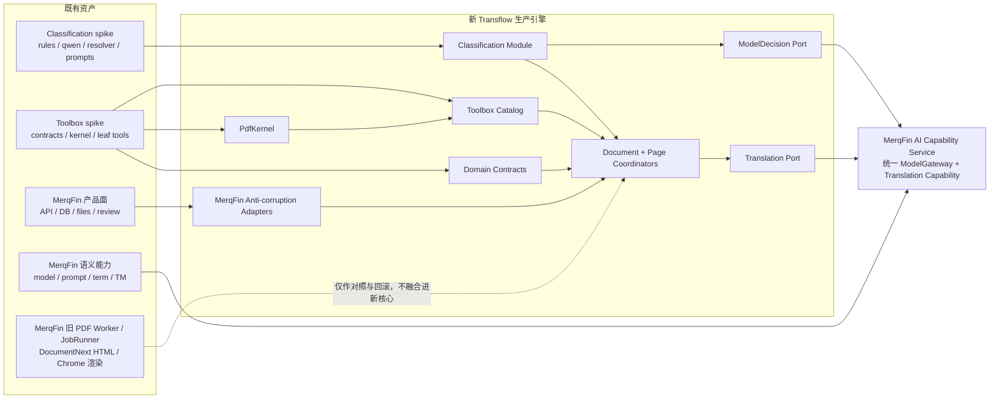

融合不是把三个目录复制到一起，而是：分类 spike 提供路由决定，工具箱 spike 提供页面执行能力，MerqFin 提供产品事实源和语义资产；Transflow 的 Coordinator 用稳定合同把三者串成唯一 PDF 主流程。

---

## 21. 技术选型

### 21.1 基础工程选型

| 领域 | V1 选型 | 理由 |
|---|---|---|
| 语言 | Python；T0 锁定准确 minor 版本，首选与 MerqFin 当前运行基线一致的 3.13 | 直接迁移穿刺核心能力，避免多套解释器 |
| API/健康检查 | FastAPI/Uvicorn，仅内部服务接口 | MerqFin 已使用，维护成本低 |
| 任务领取 | 现有 PostgreSQL + `FOR UPDATE SKIP LOCKED` | 保持现有形式，不引入新队列 |
| PostgreSQL 客户端 | psycopg 3 + pool | MerqFin 已有依赖；便于窄 SQL、短事务和连接池复用 |
| PDF | PyMuPDF 原生 PDF 操作 | 穿刺已有资产；生产链禁止 HTML/DOM/CSS/Chrome/Chromium 和 `insert_htmlbox` |
| LLM Provider Runtime | LiteLLM，仅部署在 MerqFin AI Capability Service | 统一模型、密钥和 Provider 行为，Transflow 不重复实现 |
| HTTP | httpx | Transflow 只实现 AI Capability/产品 Adapter，支持异步和超时 |
| 跨仓库合同 | 版本化 OpenAPI + JSON Schema | 不依赖共享源码目录或全局 Python 环境 |
| 并发 | asyncio + ProcessPoolExecutor | I/O 与 PDF 计算分离 |
| 状态/合同 | dataclass 或现有项目已采用的轻量模型 | 避免引入复杂工作流框架 |
| 测试 | pytest/unittest + PDF 结构/视觉回归 | 兼容既有测试资产 |
| 日志 | Python logging + JSON 结构化字段 | 不增加重型观测平台依赖 |

T0 同时锁定 PyMuPDF 及直接依赖版本，记录字体和二进制资产的版本、许可与 SHA256。发布前完成 PyMuPDF 双许可条件与所选字体许可的合规确认；本文不以技术偏好代替许可审核。

两个仓库各自生成和提交 lock file；公共依赖版本通过兼容矩阵与 CI 合同测试对齐，不共用可变 venv。AI Capability Service 的依赖升级与 Transflow PDF 依赖升级可以独立回滚。

V1 不引入：

- Celery；
- RabbitMQ；
- Redis 任务队列；
- Kubernetes 依赖；
- 必须使用的 Docker；
- 通用工作流引擎。

### 21.2 Agent / Workflow 框架选型

现场事实是：

- 分类 spike 只依赖 `httpx + PyMuPDF`，核心是规则、千问初判、最多一次复核和确定性 Resolver。
- 工具箱 spike 只依赖轻量 HTTP Provider，核心是显式状态、typed contract、确定性 Layout/Judge/Repair。
- MerqFin 虽然声明了 CrewAI 依赖，也有自研 `AgentBrain + ToolRegistry + AgentSession`，但它属于旧 Harness/JobRunner 语境，不是两个 spike 已验证组合的前提。

因此 V1 选择：

> **显式 Python 状态机 + Port/Adapter + 项目内最小 `BoundedDecisionRunner`，不引入通用 Agent 编排框架。**

| 候选 | 能力与适配判断 | V1 决策 |
|---|---|---|
| 项目内显式状态机 + 有界 Decision Node | 与两个 spike 当前行为一致；状态、预算、降级和审计都由业务合同控制 | **采用** |
| [LangGraph](https://docs.langchain.com/oss/python/langgraph/overview) | 官方定位是长运行、有状态 Agent 的低层编排与持久化；能力完整，但会与本文 PostgreSQL 租约、页级 Checkpoint 和固定流水线重叠 | 不引入 |
| [CrewAI](https://docs.crewai.com/core-concepts/Agents) | 官方强调 Crews 的角色协作以及 Flows；MerqFin 已有依赖，但 PDF 页处理不是开放式角色协作问题 | 不迁入 Transflow 主链 |
| [AutoGen AgentChat](https://microsoft.github.io/autogen/stable/user-guide/agentchat-user-guide/tutorial/agents.html) | 适合有消息状态、工具调用和多 Agent 协作的应用；本项目不需要会话式协商与 Agent 间委派 | 不引入 |
| MerqFin 自研 Agent Loop | 有 allow-list Tool、Session 和硬上限等可借鉴机制，但依赖旧 DocumentIR/Harness，且未成为 spike 的生产合同 | 借鉴约束，不复制主实现 |

不采用通用框架不是否定 Agent 能力，而是避免两套状态机、两套持久化和两套重试语义同时存在。PDF 主流程的分支已知、终态明确，普通代码更容易证明“不会漏页、不会无限循环、失败仍能最终化文档”。

### 21.3 有界 Decision Node

V1 实际启用的模型判断节点只有 **ClassificationDecision**：原规则 + 千问主判 + 冲突时一次复核 + Resolver，保持分类 spike 行为。

Toolbox Repair 继续使用穿刺已有的确定性逻辑，Freeform 也不增加模型节点，只按 §11 做一次确定性分解和固定 allow-list 路由。未来若某个叶子确有证据需要模型在固定 Repair 候选中选择，必须单独设计和 Gate，不属于本 V1 基线。

最小接口：

```text
decide(
  node_spec,
  typed_evidence,
  allowed_actions,
  attempt_budget,
) -> DecisionResult
```

每个 Decision Node 必须满足：

- 输入是裁剪后的 typed evidence，不传文件名、gold、样本 ID 或无界上下文；
- 输出通过 JSON Schema/领域模型校验；
- action 来自 allow-list，模型不能发明工具名；
- 调用次数有硬上限，超限进入确定性 fallback；
- 保存 prompt/version、输入哈希、输出哈希、耗时和裁决来源；
- 不跨 Job 保存对话记忆，不允许递归委派，不给模型任意数据库、Shell 或文件系统工具。

`BoundedDecisionRunner` 只是上述约束的薄包装，不承担 Job 调度、页面状态、重试、Checkpoint 或工具自动发现。

### 21.4 重新评估框架的触发条件

只有同时出现以下情况，才重新评估 LangGraph/CrewAI 等框架：

- 真实生产流程出现大量运行时动态分支，显式状态机已经难以维护；
- 多个模型节点确实需要共享长期会话状态或相互委派；
- 框架能复用现有 PostgreSQL 事实源，而不是建立第二套冲突 Checkpoint；
- 引入前后的恢复、幂等、性能和可观测性对照试验通过。

在这些证据出现前，不为“以后可能需要 Agent”提前引入框架。

---

## 22. 第一阶段：Transflow 独立引擎建设

### T0：冻结基线和生产合同

交付：

- 新生产包骨架；
- 最小领域合同；
- 分类树版本；
- 带 `enabled/disabled_reason` 的 Toolbox Catalog；
- 状态和错误模型；
- 完整 PDF `DocumentRunRequest`、稳定页枚举和 `PageExecutionContext` 合同；
- PyMuPDF-only、单页 TranslationBatch、字体、Checkpoint、重试上限和 PDF Preservation Contract；
- `model_decision.v1`、`page_translation.v1` 的 JSON Schema、版本和哈希；
- `ModelDecisionPort`、`TranslationPort` 与 AI Capability Service 的所有权边界；
- 穿刺来源清单；
- 固定输入和基线结果清单。

Gate：

- 不依赖 spikes 运行生产包；
- 生产入口只接受一份完整 PDF，不接受单页 PDF 列表；
- 生产 PDF 依赖图不含 HTML/Chrome 渲染器；
- Transflow 生产依赖不含 LiteLLM、模型 API Key 或 Provider SDK，不存在直连 Qwen 的 production wiring；
- 固定样本可重放；
- 所有迁移来源可追溯。

### T1：首条文档级纵向闭环

先不接分类模型，输入一份真实完整多页 PDF，使用固定路由选择已验证且边界清晰的 `visual_only` 和 `body.flow_text.single`，打通：

固定路由由 T1 测试 fixture 显式声明，不读取文件名或样本 ID；未声明页面一律透传。T2 用真实 ClassificationEngine 替换该测试装配，不把固定路由留在生产 wiring。

```text
PDF -> 枚举页面 -> PageFacts -> 固定路由 -> Toolbox
    -> Fixed Translation -> 排版 -> Judge -> 页面终态
    -> 源 PDF 副本串行回放 PagePatch -> 完整 PDF
```

Gate：

- 产生完整多页 PDF；
- 从 `样本/年报` 选择至少一份未拆页的真实 PDF，以内容哈希登记 fixture；除 fixture 声明的固定路由外不得按文件名、公司名或页码写行为分支；
- 支持页面预览；
- 任一页面故障仍可通过透传完成最终化；
- `FilesystemCheckpointAdapter` 重启可恢复；
- fake AI Capability Service 的两个 HTTP 合同测试通过；
- 具备最小日志、不可变 Artifact 和 Preservation 校验。

### T2：迁移分类引擎

交付：

- 规则、Prompt、ModelDecision Port 适配和 Resolver 迁移；
- 分类并发控制；
- 超时、重试和审计；
- 匿名分类基线、逐叶指标和反过拟合测试。

Gate：

- 匿名基线达到冻结的逐叶 precision/recall、freeform 率和高代价误路由门槛；
- `failed_node` 和 fallback 语义保持；
- 直连 Qwen/httpx 只存在于迁移测试，生产分类请求经 `HttpAiCapabilityAdapter`；
- 不把文件名、页码标签和 gold 泄漏给模型。

### T3：迁移 SharedPdfKernel

交付：

- PageFacts；
- 字体和字形探测；
- Patch 写入；
- 渲染；
- 硬约束；
- passthrough；
- Repair 原语；
- 工作区安全；
- 受控字体资产；
- 文档级 Preservation 预检、Patch 串行回放与校验。

Gate：

- 输入只读；
- 锁定对象可验证；
- 并发进程互不污染；
- 旋转/CropBox、书签、链接、批注、表单和签名策略样本通过合同测试。

### T4：逐叶迁移工具箱

建议顺序按现有证据强弱推进，不把“代码已迁移”当作“运行已启用”：

1. `visual_only`、`body.flow_text.single`；
2. 重新盲测 `chart`、`diagram` 后分别启用；
3. cover、contents、end、multi、table、anchored_blocks 等证据不足叶逐个补 Gate；
4. `visual_anchored` 和各 composite 单独迁移，已知失败叶最后处理；
5. 全叶 Catalog 与 fallback 回归。

每个叶子独立迁移、独立 Gate，不批量重写所有工具箱。

Gate：

- 迁移等价回归通过；
- 当前已知失败不被伪装成 PASS；
- 工具箱可以在文档协调器中稳定运行；
- 只有 Gate 通过的叶在 Catalog 中 `enabled=true`，其余叶明确 disabled 并走确定性 fallback。

### T5：Freeform 与区域级兜底

交付：

- 单文件起步的 `freeform/recovery.py`；
- `region_composed` 合同；
- single/multi/visual_anchored/table/chart/diagram/anchored_blocks 的确定性区域探针和固定映射；
- freeform 私有 `FreeformRegionAdapter`，只包装现有 Toolbox tools/Judge/Repair，不修改整页 Toolbox 与 Classification wiring；
- 测试专用的 `body.freeform` Route 注入 fixture，用于当前没有自然 freeform 样本时验证混合正文拆分；
- 区域所有权检查；
- RegionPatch 合并和全页二次裁决；
- 跨区域硬约束；
- 区域回退和页面透传。

Gate：

- freeform 不会停止整本任务；
- 每页都有最终页面；
- 只有一次确定性分解，不递归分类或规划；
- 已知分类叶的路由、整页 Toolbox 行为和既有回归结果不因 freeform 实验改变；
- 测试 Route 注入不存在于 production wiring，也不改变任何分类 gold；
- Adapter 的输入被 clip/owner 限定，任何越权 Patch 都被拒绝并触发区域原文回退；
- 不安全 Patch 不进入最终 PDF；
- 在真实 freeform 样本不足时只宣称收敛、所有权和无溢出通过，不伪称布局质量已验证。

### T6：生产工程化

交付：

- 租约式调度抽象；
- 持久化暂停恢复；
- 并发预算；
- 文档级有界 page ready queue、背压和全部页终态屏障；
- 三层重试；
- 文档 run/attempt 硬上限和 Provider 快速降级；
- 结构化日志；
- 原子 Artifact；
- 三类保留策略；
- 失败注入。

Gate：

- 进程重启可恢复；
- 暂停后不继续调度新步骤；
- 重放不重复翻译已提交单元；
- 并发任务无文件和状态串扰；
- 大文档不会一次性创建全部页面的无界执行任务；
- 1/20/100/300 页容量基线完成，冻结并发和磁盘阈值；
- 达到 attempt 上限仍可收敛为源 PDF 透传结果。

### T7：第一阶段验收

必须证明：

- 所有分类路径有明确生产行为；
- 可处理则翻译排版；
- 不可安全处理则区域回退或页面透传；
- 所有可读源 PDF 产生完整 PDF；
- 至少一份 `样本/年报` 中的完整多页 PDF 完成“自动枚举全部页 → 分类/路由 → 页级执行/降级 → 串行 Patch 回放 → 单一完整目标 PDF”验收，且输出页数、页序与源文档一致；
- 最终 PDF 来自源 PDF 副本串行 Patch 回放，且通过 Preservation Contract；
- 生产依赖和运行轨迹均不使用 HTML/Chrome PDF 渲染；
- 生产依赖和运行轨迹均不包含 LiteLLM、模型密钥、Provider SDK 或直连模型端点；
- 两个 AI HTTP Schema 的版本/哈希可追溯，Transflow 只依赖其合同快照；
- 固定翻译 Provider 下全链路可复现；
- 输出、日志、状态和 Artifact 可供第二阶段消费。

---

## 23. 第二阶段：替换 MerqFin PDF 执行链

### 23.1 当前链路与目标链路

当前真实调用链：

```text
MerqFin API 创建 translation_jobs
  -> MerqFin backend/runtime/worker.py 轮询
  -> TranslationService.claim_next_job()
  -> TranslationJobRepository.claim_next_job()
  -> TranslationService.run_translation_job()
  -> TranslationJobRunner.run()
  -> DocumentNext 中间包 + translated.html
  -> ChromeHtmlToPdfRenderer 重建 PDF + Artifact + 状态
```

目标调用链：

```text
MerqFin API 创建 translation_jobs，并确定 execution_engine
  -> PDF/transflow: Transflow PdfJobWorker 原子领取
       -> DocumentCoordinator 打开完整源 PDF、枚举全部页并有界调度
       -> ClassificationEngine -(需要模型时)-> ModelDecision Port
       -> PageCoordinator + PageToolbox/Freeform
       -> Translation Port
       -> 两个 Port 共用 MerqFin AI Capability Service
       -> 页面终态 -> 源 PDF 副本串行 Patch 回放 -> MerqFin ProductProjectionAdapter
  -> 非 PDF: MerqFin Translation Worker 继续执行现有链路
```

替换完成的判定不是“Transflow 能生成一个 PDF”，而是生产 PDF Job 已不再经过 `TranslationService.run_translation_job()`、`TranslationJobRunner.run()` 或 `backend/document/next/` 的 HTML/Chrome PDF 渲染链。

### 23.2 代码接缝清单

#### MerqFin 必须修改

| 接缝 | 最小修改 |
|---|---|
| Alembic | 增加 `execution_engine`、`transflow_runs`、`transflow_page_runs`；不改变现有前端字段 |
| 任务创建服务 | 对新任务写入规范化 `source_format` 和执行所有者；灰度策略只在这里决定新任务归属 |
| `repositories/legacy.py::claim_next_job` | 加入与 Transflow 互补的原子领取谓词 |
| `runtime/worker_common.py::TRANSLATION_QUEUE` | 即使当前主 Worker 未直接使用，也必须同步限制，避免未来或旁路进程重新抢 PDF |
| `runtime/worker.py` | 保留租约、心跳和非 PDF 处理；正式切换后不进入 PDF JobRunner |
| 产品状态映射 | 接受 Transflow 投影的现有 job/page/segment/artifact 数据，不改变 API URL 和 DTO 主形态 |

#### MerqFin 明确不改

- 前端任务创建、进度、预览、审校和下载页面的交互形态；
- `frontend-new/src/components/DocumentPageViewer` 以鉴权 Blob 加载页级 `image/png` 的行为；
- `/api/tasks/{task_id}/preview` 与 `/api/v1/translations/{job_id}/preview` 的现有 URL 和动态 PyMuPDF 栅格化行为；
- 用户、企业、项目、权限、术语、TM、Prompt 和模型配置的产品管理；
- Review、Learning、Knowledge 等非 PDF Worker 的职责；
- 现有源文件和目标文件的对外访问路径。

#### Transflow 新增

- `PdfJobWorker` 和互补的 PDF claim SQL；
- 接收完整源 PDF、枚举全部页、建立有界 page ready queue 并等待全部页终态的文档调度；
- `MerqFinJobQueueAdapter`、`ProductProjectionAdapter`、`ControlSignalAdapter`；
- 共享 PostgreSQL RunStore 和共享文件 ArtifactStore；
- `ProductProjectionAdapter` 对页面/Segment、运行中 PNG preview 和最终 `target_file_path` 的兼容投影；
- 目标字段/状态映射合同测试；
- 失去租约后禁止提交和发布的 fencing 逻辑。

#### MerqFin AI Capability Service 新增

- 结构化多模态 ModelGateway HTTP 合同，供 `ModelDecisionPort` 调用；
- 以 `unit_id` 为主键语义、每批只含一页单元的 Translation Capability HTTP 合同；
- 统一 Provider、密钥、术语、TM、Prompt、模型配置、超时、限流、熔断和用量审计；
- 独立 `transflow.page_units.v1` Prompt 场景和严格 JSON Schema；
- 请求去重账本或明确的 at-least-once 语义、限流、超时和用量返回；
- 健康检查。

它不包含 Job claim、PDF 路由、分类树、页面状态或 PDF 文件处理。MerqFin 旧 marker Prompt 场景继续服务旧链路，不能作为 Transflow JSON 合同直接复用。

### 23.3 迁移期路由矩阵

| 阶段 | 新 PDF 默认 owner | 旧 MerqFin Worker | Transflow Worker | 用户可见结果 |
|---|---|---|---|---|
| 基线 | `legacy` | 领取 PDF 与非 PDF | 关闭领取 | 旧结果 |
| 影子 | `legacy` | 仍是唯一产品执行者 | 不 claim 产品 Job，只建 `mode=shadow` 的独立 run | 只发布旧结果 |
| 小流量灰度 | 按白名单写 `legacy/transflow` | 旧 PDF owner + 非 PDF | 只领 transflow PDF owner | owner 对应的唯一结果 |
| 扩大灰度 | 默认 `transflow`，例外为 legacy | 例外旧 PDF + 非 PDF | 大多数 PDF | 唯一结果 |
| 正式切换 | `transflow` | 只领非 PDF | 领取全部 PDF | Transflow 结果 |

影子 run 读取同一源文件和配置快照，但使用独立 workspace，只写 `transflow_runs/page_runs` 与影子差异 Artifact；禁止写产品页、段、预览、`target_file_path` 或最终 Job 状态。这样不会出现两个引擎同时改一个产品任务。

### 23.4 切换活动图

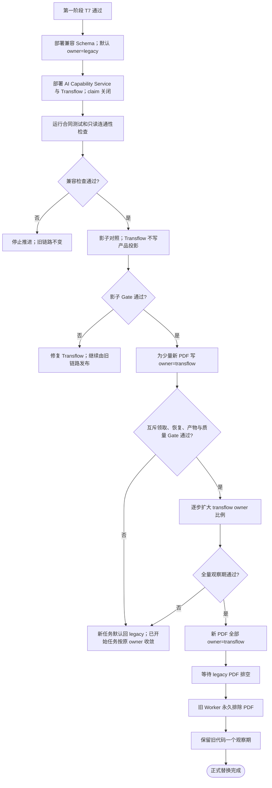

### 23.5 回滚规则

回滚按 Job 所有权执行，不做运行中热切换：

1. 先停止给新任务分配 `transflow` owner，必要时暂停 Transflow 新 claim。
2. 未领取的 PDF 可以在无租约条件下改为 `legacy`。
3. 已领取任务保持原 owner：优先让当前稳定版本完成；暂停后也只能由同一引擎恢复。
4. 禁止旧 JobRunner 直接续跑 Transflow 已创建的 page/segment/checkpoint，反之亦然。
5. 若某个已开始任务必须改用旧引擎，执行受控“从源文件重开”流程：确认无有效租约，归档 Transflow run 和 Artifact，按清单清理该次未发布投影，创建新 run，再改 owner；不复用半成品状态。
6. 回滚默认值、停止新 claim、恢复旧领取和验证无双重领取必须形成一次演练。

部署版本回滚与业务 Job 回滚是两件事：可以把 Transflow 二进制回退到上一稳定版本，同时保持 Job owner 不变；这通常比把运行中 Job 交给旧 MerqFin 引擎更安全。

### M0：冻结兼容基线

保存当前 MerqFin：

- 当前 GitHub `main` 提交；设计核验基线为 `3d831c5b82faf85cf36bf6a351494624e4ee5b9c`，集成时若已推进则重新冻结；
- PDF 任务创建请求和响应；
- job/page/segment/artifact 表快照；
- 状态事件序列；
- 暂停、恢复、取消行为；
- `/api/tasks/{task_id}/preview`、`/api/v1/translations/{job_id}/preview` 和下载 URL 的请求、响应、鉴权、`image/png` 与缓存更新行为；
- 文件目录和清理行为；
- `translation_job_pages`/`translation_pages` 的真实消费者、重复数据和约束现状；
- `target_file_path`、Artifact、前端降级提示的现有读写路径；
- 当前 DocumentNext HTML/Chrome PDF 链只作为产品行为基线，不作为像素基线；
- 当前语义政策、术语/TM 注入、模型选择和 legacy marker Prompt 行为分别留档；只复用可脱离 marker 合同的语义资产，不把 marker I/O 当作新合同。

### M1：增加互斥任务路由

- 用 MerqFin Alembic 增加 `execution_engine`、`transflow_runs`、`transflow_page_runs`，回填并校验默认 `legacy`；
- 审计历史重复后再建立必要唯一约束和 claim 索引；
- 用 `EXPLAIN` 和并发测试确认 claim SQL；
- MerqFin 与 Transflow 使用互补的 owner/格式谓词；
- 抢占 SQL 保持原子；
- 同时检查所有 Translation queue 入口，没有旁路领取；
- 正式切换后再把 MerqFin Worker 收紧为只领取非 PDF。

### M2：MerqFin Runtime Adapter

在 Transflow 中实现窄防腐层：

- JobStoreAdapter；
- Page/Segment/Artifact Adapter；
- 完整 PDF Job 到 `DocumentRunRequest` 的映射，以及 PNG preview/最终 PDF 指针投影；
- SharedFilesystemAdapter；
- ControlSignalAdapter；
- ProductStatusMapper。

引擎核心不得散落 MerqFin 表名和前端状态名。

### M3：独立 AI Capability Service 与 JSON Prompt Profile

- 代码先留在 MerqFin 仓库，但以独立进程运行，不新建第三个仓库；
- 先用薄 `ModelGatewayFacade` 收敛 MerqFin 已有模型调用入口，不做大爆炸式 LLM 重构；
- 通过结构化多模态接口实现 `ModelDecisionPort`，通过单页 JSON 接口实现 `TranslationPort`；
- 复用语义政策、术语、TM、Prompt Example、Style Pack 和模型配置，新增 `transflow.page_units.v1`，不复用 legacy marker I/O；
- LiteLLM、Provider SDK、模型密钥和运行治理只保留一套，全部位于该服务；
- 不把现有 JobRunner 的文档级调度权迁入该服务；
- 由 Transflow 决定批次和调用时机；
- 仅监听受控接口，使用服务令牌、健康检查、请求大小和超时限制。

### M4：影子对照

对选定 PDF：

- 旧 Worker 和 Transflow 分别执行；
- 仅一个结果对用户发布；
- Transflow 不领取和不更新该产品 Job，只写影子运行账本；
- 分别对比产品合同、Transflow 相对源 PDF 的 Preservation/修改区域，以及人工 A/B 质量和耗时；
- 不要求 Transflow 像素复刻旧 HTML/Chrome 输出；
- 保留双方 Artifact 和差异报告。

### M5：灰度切换

在任务创建时按内部任务或配置组写入不可变 owner，逐步把新 PDF 的执行权切换到 Transflow；不通过“两个 Worker 都能抢，再看谁先抢”实现灰度。

扩大条件至少包括：

- 无任务重复领取；
- 无不可恢复的数据兼容错误；
- 暂停恢复通过；
- 完整 PDF 产出率达标；
- Preservation Contract 通过率达标；
- 区域回退、页面透传、翻译覆盖和降级率在冻结阈值内且用户可见；
- 严重布局退化在阈值内；
- 前端、审校和下载无协议变化。

### M6：正式替换

- Transflow 成为 PDF 唯一执行者；
- MerqFin Worker 保留非 PDF 职责；
- 所有新 PDF 默认 owner 为 `transflow`；
- 旧 Worker 的所有 claim 入口从 SQL 层永久排除 PDF；
- 旧 PDF 分支暂时保留为回滚资产；
- 稳定观察期结束后，再单独评审并删除旧 PDF JobRunner 与 HTML/Chrome 渲染分支。

---

## 24. 测试与 Gate

### 24.1 合同测试

- ClassificationRoute schema；
- Classification 主判/单次复核/Resolver 调用上限；
- BoundedDecision 的 allow-list、输出 schema 和确定性 fallback；
- 分类请求不含文件名、`sample_id`、gold 或可推导身份字段；
- Toolbox Catalog 的 `enabled/disabled_reason` 与 fallback；
- freeform 固定 region-kind 映射只在路由为 `body.freeform` 时生效，不能改写 ClassificationRoute 或抢占已知叶；
- RegionComposedPlan 的对象唯一所有权、显式 passthrough、区域不重叠和 RegionPatch owner/clip 限制；
- `DocumentRunRequest` 只接受一份完整 PDF，页数、原始页序和稳定 page identity 由引擎枚举；
- `PageExecutionContext` 绑定完整源哈希和 page_no，Toolbox 不以单页 PDF 列表作为生产输入；
- TranslationUnit/Bundle ID 对齐、单页 TranslationBatch 和配置快照哈希；
- `model_decision.v1` 的图像/结构化输入、输出 Schema、错误和超时映射；
- `page_translation.v1` 要求输入 unit ID 在输出中恰好出现一次，并拒绝缺失、重复、新增或改写 ID；
- `transflow.page_units.v1` 返回严格 JSON，不依赖 Markdown、`SEG/NODE`、`LINE` marker 或 DocumentNext node ID；
- AI Capability Service 发布的 OpenAPI/JSON Schema 与 Transflow 合同快照版本/哈希一致；
- PagePatch 的序列化、source/page geometry 绑定和所有权；
- PageOutcome；
- PDF Preservation Contract；
- 不可变 Artifact Manifest 与数据库发布指针；
- 暂停、恢复、取消、领取和最终发布的 CAS；
- MerqFin 数据映射，包括 `translation_job_pages` 主记录与必要兼容投影；
- MerqFin 预览映射：运行中 `.png`、最终 `target_file_path` PDF、`image/png` 响应和缓存版本更新。

### 24.2 迁移等价测试

分类先用匿名样本报告逐叶 precision/recall、freeform 率和高代价误路由；不以可能受身份泄漏影响的旧逐样本标签作机械等价。对每个工具箱叶子比较：

- 单元；
- 保护对象；
- Patch；
- Finding；
- verdict；
- 页面渲染。

旧 MerqFin HTML/Chrome PDF 不参与像素等价 Gate，只参与产品接口、覆盖率、耗时和人工 A/B。

语义翻译迁移只验证公共语义政策、术语/TM/Style 等资产在新 JSON 场景下被正确解析和注入，不要求新场景复刻 legacy marker 文本；同一固定 TranslationBatch 必须稳定得到按 unit ID 对齐的 Bundle。

freeform 实验不得改变已知分类叶的迁移等价结果：同一已知叶输入在启用/关闭 freeform recovery 时，仍绑定原 Toolbox 并得到相同 Route、执行顺序和等价 Patch/Finding/verdict。freeform 私有 Adapter 只针对明确的 `body.freeform` fixture 单独验收。

### 24.3 文档级回归

- 不同页数组合；
- `样本/年报` 中至少一份未经拆页的完整真实 PDF；
- 混合分类文档；
- 重复页眉页脚；
- visual_only；
- freeform；
- freeform 的 `single + table`、`multi + chart`、`visual_anchored + 普通正文`、`diagram + anchored_blocks` 和“冲突对象全部原文保留”组合 fixture；
- composite；
- 某页能力缺失；
- 某页质量失败；
- 最后一页失败；
- 全页透传；
- 旋转页、非默认 CropBox/MediaBox、目录/书签、页标签、链接、批注、Widget/表单、附件、加密/权限和数字签名策略样本；
- 页级候选 PDF 不参与最终拼接，最终文件只从源 PDF 副本回放 Patch；
- 完整输入和输出的页数、页序、源哈希绑定及 Preservation 特性一致；Legacy Adapter 临时单页副本删除后仍可从完整源 PDF + Checkpoint 重建。

### 24.4 工程故障注入

- AI Capability Service 的 ModelGateway 超时、非法 JSON 和 Schema 不匹配；
- AI Capability Service 的 Translation Capability 超时、5xx、缺失/重复 unit ID；
- Worker 进程中断；
- `BrokenProcessPool` 和子进程异常退出；
- 租约过期和重领；
- 同一坏任务反复租约过期直至 run/attempt 上限；
- 失去租约的旧 Worker 迟到提交被拒绝；
- 暂停/恢复；
- 磁盘空间不足和临时写失败；
- 页级 PNG 在 rename 前失败、rename 后数据库提交前崩溃，以及陈旧 preview URL 缓存更新；
- Patch 回放或 Preservation 校验失败；
- 处理页最终化失败后整本源 PDF 应急发布；
- Artifact rename 前、rename 后数据库提交前、数据库提交后分别崩溃；
- 固定文件名兼容副本失败不影响数据库权威产物。

### 24.5 反过拟合

- 文件名和样本 ID 扫描；
- 页面缩放和尺寸扰动；
- 文本替换但结构不变；
- 页面顺序变化；
- freeform 区域整体平移/缩放、栏宽变化、表格增减行和视觉 anchor 移位后，区域数量与所有权应随结构合理变化；
- 对同类未知文档做盲测；
- 所有权和容器数量随结构变化而合理变化。

### 24.6 发布 Gate

第一阶段发布必须满足：

- 独立 Transflow 闭环通过；
- 所有可读测试 PDF 有完整结果；
- freeform 和失败路径有真实降级证据；
- 重启恢复和并发通过；
- 无 spikes 运行时依赖；
- PDF 主链无 HTML/Chrome 运行依赖，字体资产和 Preservation Contract 可复现。

第二阶段发布必须满足：

- PDF 任务互斥领取；
- MerqFin 交互契约不变；
- 完整 PDF 输入、全部页终态屏障、页级 PNG 和最终 PDF 动态预览合同通过；
- AI Capability Service 两个接口及 `transflow.page_units.v1` 合同稳定；
- 影子对照与灰度通过；
- 降级报告、警告和指标对产品可见；
- 回滚演练通过。

### 24.7 替换专项测试

- 对 `pdf/non-pdf × legacy/transflow × pending/lease-expired` 做领取矩阵测试；
- 并发启动旧 Worker 与 Transflow，证明同一 Job 最多一个成功 claim；
- 影子 run 证明不会修改产品 page/segment/preview/target/status；
- 已领取 Job 的 `execution_engine` 不允许普通状态更新改写；
- 切换前后对同一快照执行前端任务详情、预览、审校和下载合同测试；
- 最终 PDF 尚未发布时，现有 target preview URL 能从 `preview_artifact_path` 返回当前页 `image/png`；发布后同一类 URL 能从 `target_file_path` 的完整 PDF 动态栅格化任意页；
- 页面 PNG 或完整目标 PDF 更新后 `v` 版本变化，前端不会继续显示旧缓存；
- 降级完成仍可由 MerqFin 下载，并能读取降级报告；
- `target_file_path` 指向 run 私有不可变文件，现有下载 URL 仍可用；
- 人工审校后的 `translated_text` 不会被迟到 Checkpoint 覆盖；
- 默认 owner 回滚、待处理任务回切和旧 PDF 排空过程完成演练。

### 24.8 架构边界测试

- 生产包不存在对 `spikes` 的 import；
- production Adapter 的对外输入不存在单页 PDF 列表；Legacy 单页副本只允许位于 run 私有临时目录且不参与最终合并；
- Transflow 不 import `MerqFin/backend`；
- AI Capability Service 不 claim 或更新 PDF Job 状态；
- Transflow 生产依赖不含 LiteLLM、Provider SDK 或模型密钥配置，且不直连模型 `/chat/completions` 端点；
- 直连 Qwen/httpx Adapter 只允许位于 `tests/migration`，不得进入 production wheel 或 wiring；
- 两个仓库不通过全局 `site-packages`、共享 `PYTHONPATH` 或工作区 `public/common` 目录交叉 import；
- Toolbox 不直接访问 PostgreSQL、MerqFin API 或 Job lease；
- `domain` 不依赖 httpx、数据库驱动或 PyMuPDF；
- Toolbox Catalog 的每条分类叶都有唯一行为或显式 fallback；
- freeform Adapter 不出现在已知叶的 PageRouter/Catalog wiring，不修改原 Toolbox 文件或公开合同；
- 强制 `body.freeform` Route 的装配只允许位于 tests/fixtures，不得按文件名、样本 ID 或配置开关进入 production routing；
- freeform RegionPatch 修改任一非 owned object、越过 clip 或与其他 RegionPatch 冲突时必须被合并器拒绝；
- `document_finalizer` 不通过页级 PDF 拼接、`show_pdf_page` 或页面重建生成最终文档；
- 生产包不包含 HTML PDF Renderer、Chrome/Chromium 启动或 `insert_htmlbox` 调用；
- V1 依赖锁中不因 PDF 主链新增 CrewAI/LangGraph/AutoGen。

---

## 25. 主要风险与控制

| 风险 | 控制 |
|---|---|
| 穿刺代码被直接复制后形成不可维护生产包 | Lift-and-Wrap、来源清单、逐叶迁移 |
| 过早抽象破坏已验证行为 | 只抽机械公共层，分类逻辑保持私有 |
| 为验证正文模块化而提前改造 Classification 或全部 Toolbox | 实验只挂在 `body.freeform`；使用 freeform 私有 Adapter，已知叶路由和整页 Toolbox wiring 冻结 |
| freeform 复制一份叶工具/Judge/Repair 后与原实现分叉 | Adapter 包装既有可调用实现并记录来源哈希；不能安全包装就记 `MISSING_TOOL`，不复制重写 |
| MerqFin 和 Transflow 同时领取 PDF | 在原子抢占 SQL 中按 source_format 互斥 |
| 共享数据库双写 | 字段级所有权、租约和条件更新 |
| 把 PostgreSQL 当高频消息总线，写入大响应或无界事件流 | PostgreSQL 只保存 durable Job/状态/指针；PDF 与证据走文件系统，模型调用走 HTTP |
| 两张页面表语义不一致 | ProductProjectionAdapter 统一主记录和兼容投影，合同测试后再决定合表 |
| PyMuPDF 并发不安全 | 进程隔离、每进程独立打开 Document |
| 沿用穿刺的单页输入，把整本年报拆页后再拼 PDF | 产品入口只接完整 PDF；页工具箱产出 PagePatch，Document Finalizer 在源 PDF 副本上按原页序回放 |
| 年报页数多时一次性启动全部页面导致内存、进程或 Provider 失控 | 文档级有界 ready queue、背压和文档/页面/Provider/PDF 四类并发预算 |
| 用旧 HTML/Chrome 输出做像素金标准，带回原有排版缺陷 | 只对照产品合同和人工质量；结构基线改为源 PDF + 修改区域 + Preservation Contract |
| PDF 书签、链接、批注、表单、签名等被静默丢失 | 预检登记、特性样本 Gate；不能证明安全则整本源 PDF 透传 |
| 系统字体差异导致跨机结果漂移或字体许可不清 | 受控字体资产、版本/许可/SHA 指纹和跨平台回归 |
| 已迁移但未验证的叶子被自动上线 | Catalog 的 `enabled/disabled_reason` 独立于代码存在和证据状态 |
| freeform 导致任务停止 | 有界区域分解、区域回退、页面透传 |
| freeform 尚无真实样本却宣称质量通过 | V1 只验收收敛/所有权/无溢出；真实样本补齐后再扩大质量声明 |
| 某页失败导致整本无结果 | 每页强制 Finalized，最终在源 PDF 副本上统一回放 Patch |
| 直接复用 MerqFin legacy marker Prompt，导致 Transflow JSON ID 丢失或解析回退 | 只复用语义政策和知识资产；新增 `transflow.page_units.v1` + 严格 JSON Schema + ID 完整性合同测试 |
| 两个仓库各自实现 LiteLLM、Provider 和密钥治理，行为逐渐分叉 | AI Capability Service 持有唯一 ModelGateway；Transflow 只通过两个 Port 调用 |
| 把公共源码放入全局 `site-packages` 或无版本 `public/common`，形成隐式耦合 | 独立 venv/lock；跨仓库使用版本化 HTTP Schema；确有稳定复用后才发布独立版本 wheel |
| AI Capability Service 变成第二个调度器 | 两个窄能力合同均不含文档工作流，PDF 调度权只在 Transflow |
| AI Capability Service 持续故障导致每页重复超时或重复计费 | run 内快速降级；只有真实去重账本/Provider 保证时才承诺 exactly-once |
| 形式 Gate 与技术验收混淆 | 保留真实 maturity、verdict 和证据引用 |
| 文件 rename 与数据库提交不原子 | run 私有不可变文件 + 数据库权威指针；孤儿由 manifest 清理 |
| 最终文件被读取到半成品 | partial 文件校验后原子 rename，提交后才更新数据库指针 |
| `preview_artifact_path` 指向单页 PDF 或半写 PNG，现有前端目标预览失败 | 只投影原子发布、可解码的 run-specific PNG；完整目标发布后改由 `target_file_path` 动态栅格化 |
| 处理页无法最终化导致整本无产物 | 最后使用原始 PDF 做整本文档级透传发布 |
| 重试失控或毒任务无限恢复 | 三套独立预算 + 文档 run/attempt 硬上限 + 应急 Finalizer |
| 降级只写日志、用户误以为完整成功 | 产品状态映射、降级报告、警告和聚合指标共同展示 |
| 临时预览和孤儿 Artifact 填满磁盘 | 最终/审计/临时三类保留策略，只按 run manifest 清理 |
| PyMuPDF 或字体许可不满足发布条件 | 版本锁和许可清单进入 T0 Gate，发布前合规确认 |
| 通用 Agent 框架引入第二套状态机 | V1 使用显式状态机和有界 Decision Node |
| 灰度或回滚中热切换在途 Job | owner 领取后不可变，只允许从源文件受控重开 |

---

## 26. 已确认的设计决策

1. MerqFin 是完整产品系统，本项目只替换其 PDF 执行链。
2. 对 PDF，Transflow 完整接管现有 Translation Worker 的执行与编排。
3. Transflow 与 MerqFin 是独立仓库、独立包、独立服务进程。
4. 两者在同一服务器运行，共享现有 PostgreSQL 和文件系统。
5. MerqFin 前端、数据存储形态和交互流程继续复用。
6. PDF 任务只允许 Transflow 领取；MerqFin Worker 不再执行 PDF。
7. MerqFin AI Capability Service 以一个物理进程提供结构化多模态 ModelGateway 和无文档工作流的单页批量 Translation Capability。
8. Transflow 决定何时翻译以及翻译哪些单元。
9. 第一阶段可以不接 MerqFin 的真实翻译能力。
10. 分类与工具箱组合机制先按穿刺行为迁移，再做小幅工程化调整；样本身份泄漏必须删除并重建匿名基线。
11. 允许增加日志、恢复重试、线程/进程管理和适配层。
12. 采用混合并发：I/O 异步、PDF 进程池、源 PDF 副本上的最终 Patch 回放串行。
13. 暂停恢复必须跨服务重启和服务器重启。
14. 运行过程中不等待人工介入。
15. 失败也必须尽量产生完整 PDF，并记录真实降级。
16. 区域级回退优先于整页透传。
17. `freeform` 使用有界区域恢复，不建设万能全局规划器。
18. V1 不建设 CLI，Docker 不是强制部署方式。
19. 生产 PDF 链只使用 PyMuPDF 原生操作，不引入 HTML/DOM/CSS/Chrome/Chromium 渲染。
20. 页级候选 PDF 只用于验证；最终 PDF 从源 PDF 副本串行回放已批准 `PagePatch`。
21. Toolbox 代码存在、证据状态与生产启用是三件事；只有独立 Gate 通过才允许 Catalog `enabled=true`。
22. 第一阶段使用 `FilesystemCheckpointAdapter`，接入 MerqFin 后切换到 `PostgresCheckpointAdapter`，不双写。
23. 最终 Artifact 是 run 私有不可变文件，数据库指针是发布权威；不宣称文件系统与数据库跨介质原子。
24. AI Capability Service 第一版代码留在 MerqFin 仓库并独立运行，不新建第三个仓库。
25. 已签名或其他无法证明可安全保留的 PDF 默认整本源文件透传，不静默破坏文档特性。
26. 字体是受控发布资产，版本、许可与 SHA 必须进入任务/发布指纹。
27. LiteLLM、Provider SDK、模型密钥、超时、限流、熔断、用量和审计只有一套生产实现，归 AI Capability Service 所有。
28. MerqFin 的语义政策、术语、TM、Style 和模型配置可复用；legacy marker/Markdown 文本合同不复用，Transflow 使用独立 `transflow.page_units.v1` 严格 JSON 场景。
29. Transflow 与 MerqFin 使用独立 venv 和 lock file，不共享全局 `site-packages`、`PYTHONPATH` 或无版本 `public/common` 源码目录。
30. V1 以版本化 OpenAPI/JSON Schema 和合同测试作为跨仓库边界，不为少量 DTO 新建公共包；只有稳定的纯合同/纯算法形成两个以上进程内消费者后，才评审独立版本 wheel。
31. PostgreSQL 是持久化任务队列和状态/控制协调面，不是通用消息总线；V1 依赖轮询、原子 claim、租约和 CAS，不依赖 `LISTEN/NOTIFY`。
32. Transflow 产品入口只接收一份完整 PDF；Document Coordinator 枚举并有界调度全部页，PageToolbox 只处理 page context，任何临时单页 PDF 都是可重建的迁移内部物。
33. MerqFin 前端预览沿用 `main@3d831c5` 合同：运行中目标页投影原子 PNG，完成后从 `target_file_path` 的完整 PDF 动态栅格化；不修改前端协议。
34. V1 不因正文模块化设想改造 Classification taxonomy、已知叶路由或整页 Toolbox 合同；区域拆分只在 `body.freeform` 内用私有 Adapter 做受控实验，后续是否上升为通用模式另行评审。

---

## 27. 后续详细设计项

以下内容不阻塞总体设计，但实施前需要在相应阶段冻结：

- AI Capability Service 的 ModelGateway 与 Translation Capability HTTP 契约完整字段、错误码和超时映射；
- `transflow.page_units.v1` 的 Prompt 解析、语义资产快照上限和 JSON Schema 版本演进规则；
- AI Capability Service 的去重账本或明确 at-least-once 选择；
- OpenAPI/JSON Schema 发布、哈希校验、兼容窗口和两个仓库 CI 合同测试方式；
- 两侧 lock file 的兼容矩阵；是否提取公共 wheel 只按 §16.5 的实际复用触发条件重新评审；
- Python/PyMuPDF 精确版本及字体资产、许可清单；
- 分类、翻译和 PDF 进程池默认并发数；
- 网络、原子任务、Repair、Provider 快速降级和文档 run/attempt 的具体预算；
- MerqFin 现有字段与内部状态的逐字段映射；
- 任务工作目录的最终命名；
- 最终/审计/临时 Artifact 的保留期限和容量阈值；
- 第一批纵向闭环样本；
- 分类逐叶、Toolbox 启用、Preservation 和降级率阈值；
- freeform 区域探针阈值、组合 fixture、私有 Adapter allow-list，以及是否值得在后续版本沉淀通用 RegionCapability 的评估标准；
- 影子对照和灰度阈值；
- 旧 PDF 分支稳定观察期和最终删除条件。

这些详细项不得反向改变本文已确认的系统边界。

---

## 28. 参考资产

Transflow：

- `docs/背景/PDF_翻译排版引擎_演进背景_既有资产与踩坑记录.md`
- `spikes/page_classification_engine_puncture_v1/README.md`
- `spikes/page_classification_engine_puncture_v1/src/page_classifier/`
- `spikes/page_toolbox_engine_puncture_v1/contracts/`
- `spikes/page_toolbox_engine_puncture_v1/src/page_toolbox_puncture/contracts.py`
- `spikes/page_toolbox_engine_puncture_v1/src/page_toolbox_puncture/translation.py`
- `spikes/page_toolbox_engine_puncture_v1/prompts/page_translation.zh-CN.md`
- `spikes/page_toolbox_engine_puncture_v1/src/shared_pdf_kernel/`
- `spikes/page_toolbox_engine_puncture_v1/toolboxes/`
- `spikes/page_toolbox_engine_puncture_v1/docs/计划/分类专用工具箱穿刺建设计划.md`

MerqFin：

- GitHub `main@3d831c5b82faf85cf36bf6a351494624e4ee5b9c`（2026-07-19 设计核验时的远端 head）
- `../MerqFin/frontend-new/src/components/DocumentPageViewer/index.tsx`
- `../MerqFin/backend/runtime/worker.py`
- `../MerqFin/backend/runtime/worker_common.py`
- `../MerqFin/backend/translation/translation_service.py`
- `../MerqFin/backend/translation/job_runner.py`
- `../MerqFin/backend/runtime/translation_runtime.py`
- `../MerqFin/backend/llm/llm_adapter.py`
- `../MerqFin/backend/llm/llm_runtime.py`
- `../MerqFin/backend/prompt/assets/translation.py`
- `../MerqFin/backend/document/processing.py`
- `../MerqFin/backend/document/next/pdf_module.py`
- `../MerqFin/backend/document/next/package.py`
- `../MerqFin/backend/document/next/translation.py`
- `../MerqFin/backend/document/next/html_pdf.py`
- `../MerqFin/backend/repositories/legacy.py`
- `../MerqFin/backend/alembic/schema_baseline.json`
- `../MerqFin/backend/main.py`
- `../MerqFin/backend/compat/routers/tasks.py`
- `../MerqFin/backend/compat/services/tasks.py`
- `../MerqFin/backend/compat/services/review.py`
- `../MerqFin/Dockerfile`
- `../MerqFin/pyproject.toml`

PyMuPDF 官方资料：

- [Page API 与 `show_pdf_page` 限制](https://pymupdf.readthedocs.io/en/latest/page.html#Page.show_pdf_page)
- [PyMuPDF 许可说明](https://pymupdf.io/pymupdf)

Agent 框架官方资料：

- [LangGraph overview](https://docs.langchain.com/oss/python/langgraph/overview)
- [CrewAI Agents and Flows](https://docs.crewai.com/core-concepts/Agents)
- [AutoGen AgentChat Agents](https://microsoft.github.io/autogen/stable/user-guide/agentchat-user-guide/tutorial/agents.html)
