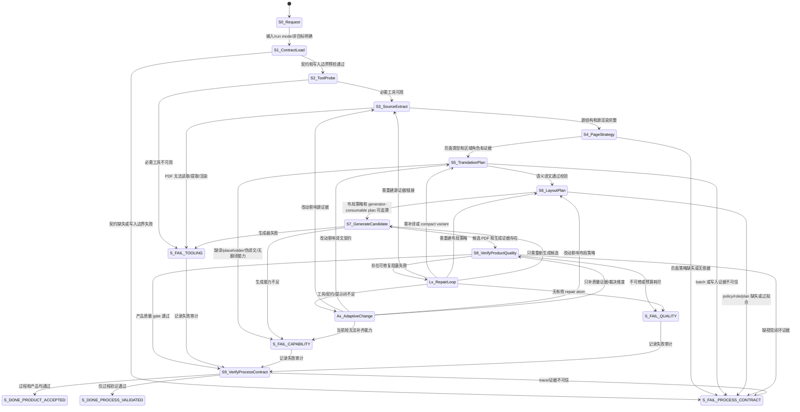
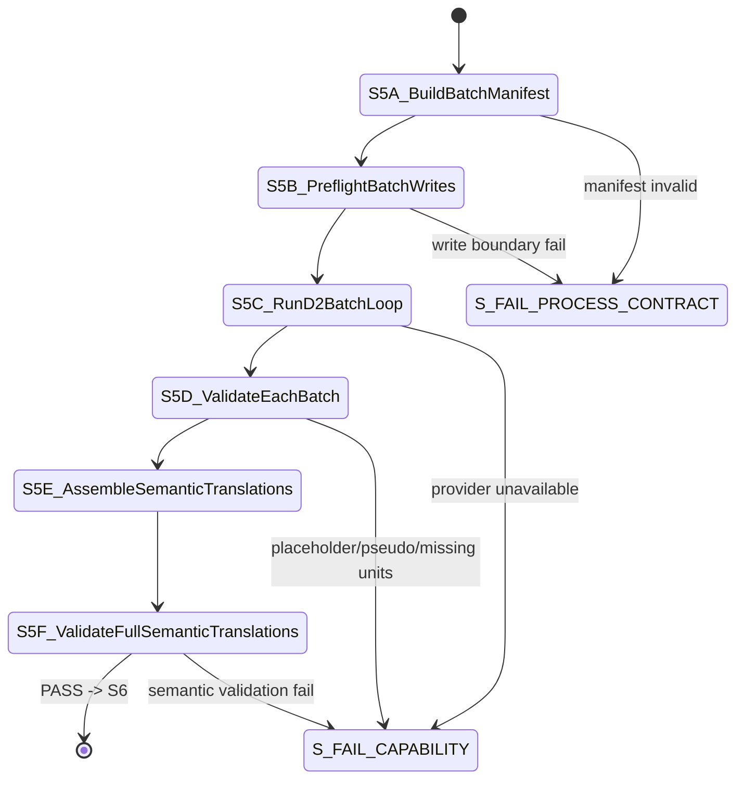
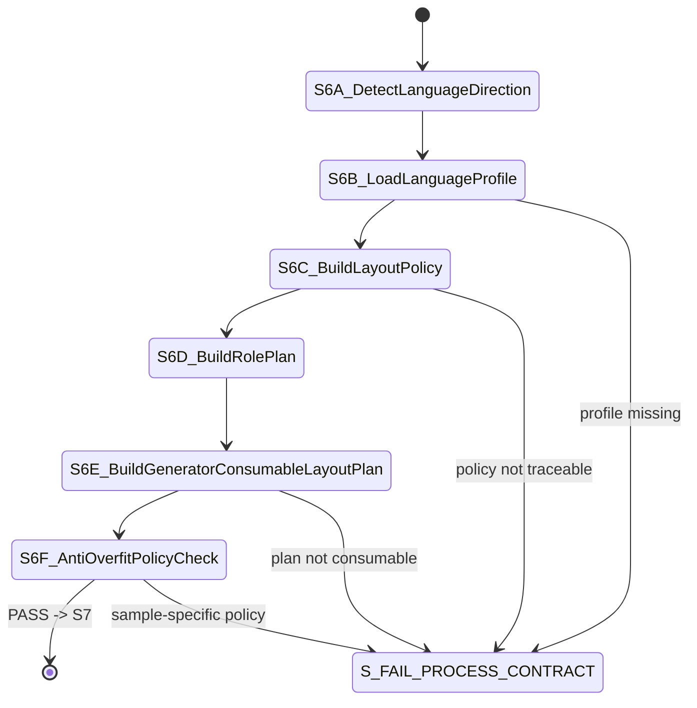
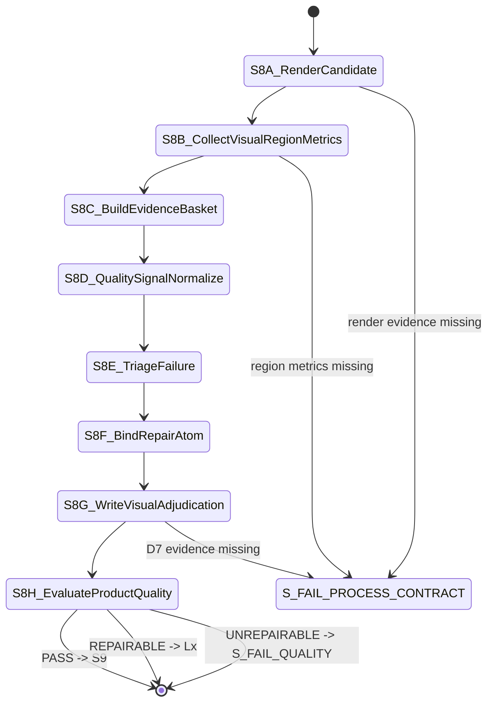
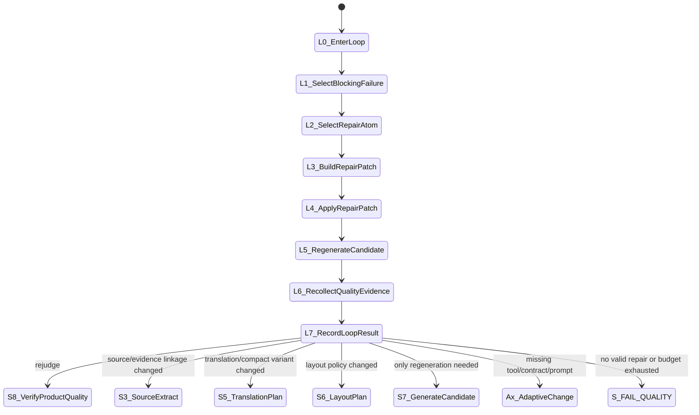

# PDF 语义翻译回填：状态机与工具编排设计

版本：v0.1
状态：讨论稿
目标：先定义状态和迁移，再定义每个状态下的采集、判断、生成、修补工具。

## 1. 系统目标和边界

### 1.1 目标

本流程面向 PDF 语义翻译回填：输入一个 PDF，识别源语言，生成目标语言译文，并尽量保持原 PDF 的版式、视觉层级、图表结构、背景、图片和阅读体验。

本流程不是单个 PDF 的专用脚本，而是一套可由 Codex 或其他执行器调度的状态机。执行器必须能按状态读取证据、调用工具、记录判断、进入修复 loop，并输出可审计的运行报告。

### 1.2 非目标

1. 不把人工对照 PDF 当作运行时输入。
2. 不把样本文档文件名、固定页码、固定坐标、固定文本、固定颜色写进 core 工具、提示词或契约。
3. 不把候选 PDF 等同于产品通过。
4. 不用截图主观感觉替代工具证据和状态迁移记录。
5. 不把所有质量失败都退回翻译。多数视觉问题应优先回到布局或生成。

### 1.3 状态正确性原则

为了避免“前面状态错了，后面都白干”，本设计把状态分三层：

| 层级 | 含义 | 稳定性 | 来源 |
|---|---|---|---|
| L0 顶层生命周期 | PDF 从请求到终态的主状态 | 高 | `pdf_translation_workflow_core/contracts/state_machine.md`、`docs/业务流程/PDF_语义翻译回填_标准流程设计.md` |
| L1 复合状态 | S5/S6/S8/Lx/Ax 内部子状态 | 中 | core 契约、runner 真实调用、V4 JUDGE/REPAIR 思想 |
| L2 原子动作 | 一个工具调用、一次模型裁决、一次 RepairPatch | 可变 | `pdf_translation_workflow_core/tools`、`prompts`、`contracts` |

顶层状态不因某个修复工具变动而随意修改。子状态和原子动作可以演进，但必须保持顶层迁移和产物契约可追溯。

### 1.4 证据来源

本文基于当前磁盘上的这些事实整理：

| 来源 | 用途 |
|---|---|
| `pdf_translation_workflow_core/contracts/state_machine.md` | 当前主状态、复合状态、终态语义 |
| `pdf_translation_workflow_core/prompts/prompt_tool_bindings.json` | 状态到工具、提示词、产物的绑定 |
| `pdf_translation_workflow_core/contracts/tool_contracts.md` | 工具类别、写入边界、生成器和视觉 gate 契约 |
| `pdf_translation_workflow_core/contracts/page_type_repair_matrix.md` | failure class 到 repair atom 的映射 |
| `pdf_translation_workflow_core/tools/run_semantic_product_quality_round.py` | 当前实际 runner 中已执行的 S3/S5/S6/S7/S8/Lx 轨迹 |
| `translation_layout_harness_engine_spike_v4/translation_layout_harness/orchestrator` | V4 五态、Triage/Binding/Judge/Repair 思想 |

## 2. V4 五态和当前 S0-S9 的映射

V4 的顶层五态是：

```text
INTAKE -> PRODUCE -> JUDGE <-> REPAIR -> DECIDE
```

当前 PDF workflow 的顶层状态更细：

```text
S0_Request
S1_ContractLoad
S2_ToolProbe
S3_SourceExtract
S4_PageStrategy
S5_TranslationPlan
S6_LayoutPlan
S7_GenerateCandidate
S8_VerifyProductQuality
Lx_RepairLoop
Ax_AdaptiveChange
S9_VerifyProcessContract
Terminal States
```

映射关系如下：

| V4 五态 | 当前 PDF 状态 | 解释 |
|---|---|---|
| `INTAKE` | `S0_Request`、`S1_ContractLoad`、`S2_ToolProbe`、`S3_SourceExtract` | 确认输入、契约、工具能力和源 PDF 证据 |
| `PRODUCE` | `S4_PageStrategy`、`S5_TranslationPlan`、`S6_LayoutPlan`、`S7_GenerateCandidate` | 生成页面策略、译文、布局计划和候选 PDF |
| `JUDGE` | `S8_VerifyProductQuality` | 多信号质量判断，决定接受、修复、补采证或失败 |
| `REPAIR` | `Lx_RepairLoop`、必要时 `Ax_AdaptiveChange` | 执行一个阻塞问题的修复，或记录方法论/工具缺口 |
| `DECIDE` | `S9_VerifyProcessContract` 和终态 | 验证过程契约、产品 verdict 和最终终态 |

关键结论：

1. 不把 V4 五态直接替换当前 S0-S9。
2. V4 的价值主要进入 `S8_VerifyProductQuality` 和 `Lx_RepairLoop`。
3. `Triage`、`Binding`、`need_more_evidence` 是 `S8/JUDGE` 内部子状态，不新增为顶层状态。

## 3. 顶层状态机图



## 4. 每个大状态的状态契约

### 4.1 状态契约模板

每个顶层状态必须能回答这些问题：

| 字段 | 含义 |
|---|---|
| `state_id` | 状态编号 |
| `state_type` | `top`、`composite`、`terminal` |
| `purpose` | 为什么存在 |
| `entry_condition` | 从上一个状态进入时必须满足什么 |
| `collection_tools` | 采集事实的工具 |
| `judgement_tools` | 大模型/Codex/规则裁决 |
| `generation_tools` | 生成产物的工具 |
| `repair_tools` | 可在该状态或从该状态触发的修补工具 |
| `required_artifacts` | 必须生成或读取的证据 |
| `exit_conditions` | 如何迁移到下一个状态 |
| `failure_targets` | 失败后去哪里 |
| `trace_required` | 需要写进 state trace/operation log/decision log 的内容 |

### 4.2 顶层状态契约表

| 状态 | 类型 | 目的 | 入口条件 | 必须产物 | 正常出口 | 失败出口 |
|---|---|---|---|---|---|---|
| `S0_Request` | top | 确认目标、输入、输出、run mode、非目标 | 用户目标明确 | `run_request.json` 或等价 run header | `S1` | 等待用户 |
| `S1_ContractLoad` | top | 读取流程、契约、提示词、工具说明，并验证执行根写入边界 | S0 完成 | `contract_load_record.json`、`workspace_boundary_preflight.json` | `S2` | `S_FAIL_PROCESS_CONTRACT` |
| `S2_ToolProbe` | top | 探测 Python、PDF 库、字体、渲染、可选 OCR/Poppler | S1 通过 | `tool_probe.json` | `S3` | `S_FAIL_TOOLING` |
| `S3_SourceExtract` | top | 提取源 PDF 页尺寸、文本、bbox、字体、图像、绘图对象，渲染源图 | 工具可用 | `source_extraction.json`、源 PNG/manifest | `S4` | `S_FAIL_TOOLING` |
| `S4_PageStrategy` | top | 判断页面类型、区域角色和特殊约束 | 源证据完整 | `page_strategy.json` | `S5` | `S_FAIL_PROCESS_CONTRACT` |
| `S5_TranslationPlan` | composite | 构建翻译单元、执行 D2 批次、校验语义译文 | 页面策略存在 | `translation_batch_manifest.json`、batch records、`*.translations.json`、`semantic_translation_validation.json` | `S6` | `S_FAIL_CAPABILITY` / `S_FAIL_PROCESS_CONTRACT` |
| `S6_LayoutPlan` | composite | 生成语言方向、角色、布局策略和 generator-consumable plan | 语义译文有效 | `layout_policy.json`、`role_plan.json`、`layout_plan.json` | `S7` | `S_FAIL_PROCESS_CONTRACT` |
| `S7_GenerateCandidate` | top | 擦除源语文本，回填目标语，生成候选 PDF | 布局计划可消费 | candidate PDF、`candidate_generation_evidence.json`、`layout_execution.json` | `S8` | `S_FAIL_TOOLING` / `S_FAIL_CAPABILITY` |
| `S8_VerifyProductQuality` | composite | 渲染候选、采集视觉证据、多信号融合、决定通过或修补 | 候选和生成证据存在 | `candidate_render_manifest.json`、`visual_region_metrics.json`、`visual_repair_plan.json`、`visual_adjudication.json`、`product_quality_gates.json` | `S9` 或 `Lx` | `S_FAIL_QUALITY` / `S_FAIL_PROCESS_CONTRACT` |
| `Lx_RepairLoop` | composite | 对一个阻塞 failure class 执行一次修复闭环 | S8 给出可修复失败 | `repair_patch_<n>.json`、`layout_policy.repair<n>.json`、`repair_loop_<n>.json` | `S3/S5/S6/S7/S8` | `S_FAIL_QUALITY` / `S_FAIL_CAPABILITY` |
| `Ax_AdaptiveChange` | composite | 当前工具/契约/提示词不足时做小幅方法论修补 | Lx 或 S8 判定能力缺口 | `adaptive_change_record.json`、前后 manifest、验证结果 | 触发状态或相关上游状态 | `S_FAIL_CAPABILITY` |
| `S9_VerifyProcessContract` | top | 验证状态 trace、操作日志、写入边界、反过拟合和最终审计 | 到达终局审计 | `process_validation.json`、`anti_overfit_scan.json`、`final_acceptance.json`、审计报告 | 成功终态 | `S_FAIL_PROCESS_CONTRACT` |

## 5. 复合状态展开

### 5.1 `S5_TranslationPlan`



S5 的关键规则：

1. 不允许把整份 PDF 作为无边界大 prompt 一次性翻译。
2. 每个 batch 写入 `prompt_instance.json`、`model_output.json`、`decision_record.json` 前必须有写入边界证据。
3. 只有全量 `validate_semantic_translations.py` 通过，才能进入 S6。
4. 缺真实语义翻译能力时应停在 `S_FAIL_CAPABILITY`，不能生成 product-quality placeholder。

### 5.2 `S6_LayoutPlan`



S6 的关键规则：

1. `layout_policy.json` 是布局行为入口，不允许生成器把主要策略隐藏在代码常量里。
2. `role_plan.json` 必须基于当前页字体、bbox、颜色、结构和语义单元。
3. `layout_plan.json` 必须是 generator-consumable，而不是只给人看的计划。
4. 中译英和英译中可以使用不同 language profile，但 profile 必须是开口契约，不得依赖样本固定值。
5. bbox 是源文本的擦除、阅读顺序和 anchor 证据；对 `fluid_body/body_flow`，目标文本框可以按当前页面可用空间重排。

### 5.3 `S8_VerifyProductQuality`



S8 是多信号融合状态，不是“看一眼截图”。它必须把工具事实收敛为结构化问题。

建议使用 V4 的内部概念，但挂在 S8 下面：

| V4 概念 | 在 S8 中的作用 |
|---|---|
| `EvidenceBasket` | 汇总 source extraction、candidate evidence、visual metrics、render/crop 证据 |
| `QualitySignal` | 把 gate/视觉/结构问题标准化为 signal |
| `TriageRequest` | 把候选 failure class、证据摘要和预算交给研判 |
| `TriageResult` | 选择主要 failure class，或要求补采证，或拒绝修复 |
| `BindingRequest` | 根据 failure class 找到可用 repair atom 和参数口 |
| `BindingResult` | 输出可执行 repair plan |
| `JudgeDecision` | 对外唯一判断结果：通过、修复、补采证、失败 |

### 5.4 `Lx_RepairLoop`



Lx 的关键规则：

1. 每次 loop 只选择一个主 failure class。
2. `visual_repair_plan.json` 只是计划，不代表 loop 已执行。
3. 进入 Lx 后必须写 `repair_loop_<n>.json`。
4. 可执行修补必须通过 `build_repair_patch.py -> apply_repair_patch.py`。
5. `operation_count=0` 是 no-op，不能算有效修复。
6. 修补后必须重新生成候选并重新进入 S8。

### 5.5 `Ax_AdaptiveChange`

Ax 不是产品修补状态，而是方法论修补状态。

进入 Ax 的场景：

1. failure class 无法映射到 repair atom。
2. repair atom 存在但工具没有实现。
3. 现有提示词无法表达必要判断。
4. 现有质量 gate 无法采集足够证据。
5. 现有状态契约不能描述真实必要迁移。

Ax 必须产出：

| 产物 | 含义 |
|---|---|
| `adaptive_change_record.json` | 触发原因、假设、改动范围、验证方式 |
| before/after manifest | 改动前后文件哈希 |
| verification result | 小幅改动是否验证通过 |
| backport recommendation | 是否建议合入 core |

## 6. 每个状态对应的采集工具、判断工具、修补工具

| 状态 | 采集工具 | 判断工具/提示词 | 生成工具 | 修补工具 | 主要产物 |
|---|---|---|---|---|---|
| `S0_Request` | 文件系统、用户输入 | Codex 执行器 | 无 | 无 | `run_request.json` |
| `S1_ContractLoad` | 文件读取、路径解析 | 规则检查 | 无 | 无 | `contract_load_record.json`、`workspace_boundary_preflight.json` |
| `S2_ToolProbe` | `tools/probes/tool_probe.py` | 规则检查 | 无 | 无 | `tool_probe.json` |
| `S3_SourceExtract` | `extract_pdf_structure.py`、`render_pdf.py` | 规则检查 | 源 PNG | 可回源证据重建 | `source_extraction.json`、source render manifest |
| `S4_PageStrategy` | 读取 S3 产物 | `D1_page_strategy.prompt.json` 或 Codex 结构化判断 | `page_strategy.json` | 无 | 页面类型、区域角色 |
| `S5_TranslationPlan` | `build_translation_batch_manifest.py` | `D2_translation.prompt.json`、translation validators | `materialize_d2_translation_batches.py`、`assemble_semantic_translations.py` | 补 batch、补 compact variant | batch artifacts、semantic translations |
| `S6_LayoutPlan` | S3/S4/S5 产物、language profile | `D4_layout_plan.prompt.json` | `build_layout_policy.py`、`build_role_plan.py`、`build_layout_plan.py` | policy/role/layout repair | `layout_policy.json`、`role_plan.json`、`layout_plan.json` |
| `S7_GenerateCandidate` | 读取 S3/S5/S6 产物 | 规则检查 | `generate_semantic_backfill.py` | generation evidence linkage、background/fit repair | candidate PDF、generation evidence |
| `S8_VerifyProductQuality` | `render_pdf.py`、`collect_visual_region_metrics.py`、`render_source_output_crop.py` | `D5_D7_quality_gate.prompt.json`、`write_visual_adjudication.py`、`evaluate_pdf_quality.py` | quality artifacts | 触发 Lx | metrics、adjudication、quality gates |
| `Lx_RepairLoop` | 读取 S8 failure evidence | `D8_repair_selection.prompt.json`、repair matrix | `build_repair_patch.py`、`apply_repair_patch.py` | repair atom 执行 | repair patch、repair loop record |
| `Ax_AdaptiveChange` | `collect_change_manifest.py` | Codex 方法论判断 | 文档/工具/提示词小幅改动 | apply_patch 仅用于代码/文档 | adaptive change record |
| `S9_VerifyProcessContract` | `validate_process_artifacts.py`、`scan_core_overfit.py` | `D9_final_acceptance.prompt.json` | final report | 无 | process validation、anti-overfit、final acceptance |

## 7. 多信号融合规则

### 7.1 信号来源

`S8_VerifyProductQuality` 必须至少融合这些信号：

| 信号来源 | 说明 |
|---|---|
| 语义信号 | `semantic_translation_validation.json`、translation coverage、placeholder/pseudo translation 检查 |
| 生成信号 | redaction count、inserted unit count、layout plan consumed、layout execution |
| 字体层级信号 | source/output font hierarchy、role-relative ratio |
| 几何信号 | bbox、插入框、source anchor order、region collision |
| 结构信号 | table/grid/chart/matrix/sidebar/event card 是否保留结构 |
| 背景信号 | redaction fill、background delta、wide line residue、image overlay protection |
| 可读性信号 | title/body/table/note/sidebar/legend/card readability |
| 页面整体信号 | full-page render、crop comparison、visual similarity |

### 7.2 信号标准化

每个问题先标准化为 `QualitySignal`：

```json
{
  "axis": "layout|content|visual|structure|background|process",
  "defect_type": "line_fragmentation",
  "severity": "blocking|warning|info",
  "unit_ids": ["..."],
  "evidence_ids": ["..."],
  "repairability": "repairable|unrepairable|needs_more_evidence",
  "source": "rule|model|human|tool"
}
```

### 7.3 融合顺序

融合时按硬约束优先：

1. 过程证据缺失：直接 `S_FAIL_PROCESS_CONTRACT`。
2. 语义译文无效：回 `S5` 或 `S_FAIL_CAPABILITY`。
3. 候选生成不真实：回 `S7` 或 `S_FAIL_CAPABILITY`。
4. 结构破坏：优先回 `S6/S7`，不能只缩字体。
5. 背景/图片破坏：优先回 `S7`。
6. 字体/密度/节奏问题：优先回 `S6`。
7. 低置信度且证据不足：在 S8 内部补采证，不新增顶层 GATHER。
8. 阻塞问题可修：进入 `Lx_RepairLoop`。
9. 无阻塞问题：进入 `S9`。

### 7.4 多问题分发

一页可能同时存在多个问题，例如“文字过小且挤占图片”。处理规则：

1. 先判断是否存在 hard negative：图片破坏、表格结构破坏、语义缺失、过程证据缺失。
2. 再选择一个主 failure class 进入本轮 Lx。
3. 其他问题记录为 `deferred_failures`。
4. 如果一个 repair atom 可顺带修多个问题，允许执行，但必须记录主修和顺带修。
5. 修补后重新进入 S8，而不是在 Lx 内直接宣称成功。

### 7.5 分层分级研判

本流程吸收 V4 的 JUDGE/REPAIR 思路，但不把所有判断塞进一个大 prompt。研判必须拆成可审计的层级：

| 层级 | 子状态 | 研判对象 | 允许输出 | 禁止输出 |
|---|---|---|---|---|
| 一级上下文研判 | `S4/S6` | 页面类型、区域角色、语言方向、可用空间、源字号层级 | page strategy、role plan、layout policy | 具体修补工具、样本特判 |
| 二级质量归一 | `S8A` | 源/候选 bbox、字体、颜色、重叠、背景、结构、语义覆盖 | `QualitySignal[]`、证据 ID、严重度 | repair 参数 |
| 三级 Triage | `S8B` | 多个 `QualitySignal` 的主阻塞问题 | `failure_class`、证据是否充分、是否进入 Lx | repair family、工具名、几何参数 |
| 四级 Dispatch | `S8C-Dispatch` | `failure_class` 到允许修复族的映射 | `repair_family`、`target_state`、允许 operation type | 新造工具、绕开分发表 |
| 五级 Binding | `S8C-Binding` | 当前运行证据、tool spec、layout plan | `RepairPatch` operations、rollback condition | 改变 failure class |
| 六级回测验收 | `Lx/S8` | 修复前后同维度对比 | improved/unchanged/worse、next_state | 不重测直接宣称成功 |

关键规则：

1. `TriageResult` 只裁定“是什么病”，不裁定“用什么工具”。
2. `DispatchResult` 只能来自静态分发表或当前 run-local 契约，不允许由模型自由发挥。
3. `BindingResult` 只绑定参数，不能把 `font_size_regression` 改判成 `background_resample`。
4. 如果证据不足，留在 `S8` 内部补采证；`GATHER` 不是顶层状态。
5. 如果 failure class 无法映射 repair atom，进入 `Ax_AdaptiveChange` 或 `S_FAIL_QUALITY`，不能假修。

### 7.6 Repair 批次策略

修复不是“发现一个问题立刻随手改一个问题”。每个 loop 的批次策略如下：

1. 先按硬约束排序：过程缺证据、语义缺失、结构破坏、背景/图片破坏、布局节奏、字体层级。
2. 在当前 loop 只选择一个主 `failure_class`。
3. 对同一 `failure_class` 下的多个区域可以批量生成多个 operation。
4. 其他 failure class 写入 `deferred_failures`。
5. Patch 应用后必须重新生成候选 PDF，并重新运行 S8 的同一组信号采集。
6. 只有目标 failure class 改善，且 hard negative 与已修复轴没有回退，才算 loop 有效。
7. 若修复后目标轴未改善或其他硬轴回退，记录为 rollback/unchanged/worse，继续预算判断或失败。

## 8. RepairPatch 选择规则

### 8.1 选择输入

RepairPatch 选择只允许消费当前运行证据：

| 输入 | 来源 |
|---|---|
| `failed_gate_ids` | `product_quality_gates.json` |
| `quality_signals` | `quality_signals.json`，由 S8A 从源/候选对比归一 |
| `triage_result.failure_class` | S8B，只表示主阻塞问题类别 |
| `dispatch_result.repair_family` | 静态 dispatch table，不由 Triage prompt 自由选择 |
| `page_type`、`region_role` | `page_strategy.json`、`role_plan.json` |
| `target_language`、`source_language` | run request、translation manifest |
| `layout_policy` | 当前 run-local `layout_policy.json` |
| `generation_evidence` | `candidate_generation_evidence.json` |
| `visual_metrics` | `visual_region_metrics.json` |
| `tool_spec` | 当前 repair family 对应的允许 operation type 和可变参数 |

禁止输入：

1. 官方人工对照 PDF。
2. 文件名特判。
3. 固定页码特判。
4. 固定坐标特判。
5. 固定文本特判。
6. 记忆中的样本视觉结果。

### 8.2 failure class 到目标状态和 repair family

S8B 只输出 failure class；S8C 先通过 dispatch table 映射 repair family，再绑定参数。示例映射如下：

| failure class 类型 | repair family | 优先目标状态 | 说明 |
|---|---|---|---|
| `translation_segment_missing`、placeholder、伪译文、compact variant 缺失 | `retranslate_or_patch_translation_unit` | `S5_TranslationPlan` | 只有语义证据失败才回翻译 |
| 源证据、unit_id、font/linkage 缺失 | `rebuild_source_or_generation_linkage` | `S3_SourceExtract` 或 `S7_GenerateCandidate` | 重新提取或修 generation evidence |
| `text_fit_overflow` | `expand_or_reflow_slot` | `S6_LayoutPlan` | 扩展/重排文本槽，不能优先压缩字号 |
| `font_size_regression` | `reflow_before_shrink` | `S6_LayoutPlan` | 字号相对源层级过小，先找可用空间重排 |
| `cross_slot_overlap` | `vertical_flow_relayout` | `S6_LayoutPlan` | 修正文段间距、同列流式重排 |
| `table_region_obstacle_pack` | `table_region_reflow_or_preserve_table` | `S6_LayoutPlan` | 表格/矩阵结构优先于普通正文回填 |
| `source_graphic_boundary_limit`、背景擦除、图片保护、redaction fill、probe residue | `background_resample_or_redaction_limit` | `S7_GenerateCandidate` | 重新生成候选或调整擦除边界 |
| 无法映射 repair atom | 无 | `Ax_AdaptiveChange` 或 `S_FAIL_QUALITY` | 看是否是方法论缺口 |

### 8.3 RepairPatch 最小结构

```json
{
  "patch_id": "repair_patch_0001",
  "selected_failure": {
    "failure_class": "text_fit_overflow",
    "failed_gate_ids": ["body_paragraph_readability"],
    "evidence_refs": ["visual_region_metrics.json#region_12"]
  },
  "dispatch_result": {
    "dispatch_table": "contracts/failure_dispatch_table.json",
    "repair_family": "expand_or_reflow_slot",
    "tool": "tools/repairs/build_repair_patch.py",
    "allowed_operation_types": ["expand_slot"]
  },
  "repair_atom": "expand_or_reflow_slot",
  "target_state": "S6_LayoutPlan",
  "policy_context": {
    "language_pair_profile": "zh_to_en",
    "page_type": "body_nav",
    "region_role": "body_flow"
  },
  "operations": [
    {
      "op": "set_layout_mode",
      "scope": {"page_index": 5, "region_id": "region_12"},
      "value": "region_flow",
      "reason": "current-run line fragmentation evidence"
    }
  ],
  "operation_count": 1,
  "deferred_failures": [],
  "anti_overfit_statement": "No filename/page/text/fixed-coordinate branch used."
}
```

### 8.4 RepairPatch 判定规则

1. `operation_count=0` 不能算有效修复。
2. 一个 patch 只能改当前 run-local policy 或生成计划，不直接改 core。
3. core 修补必须走 `Ax_AdaptiveChange`，并有 before/after manifest。
4. 修补后必须重新生成候选和重新执行 S8。

## 9. Loop 预算和退出规则

### 9.1 预算结构

建议采用 V4 的 `BudgetState` 思想，但映射到 PDF workflow：

```json
{
  "max_repair_loops": 3,
  "max_triage_calls_per_loop": 1,
  "max_binding_calls_per_loop": 1,
  "max_regather_per_loop": 1,
  "max_same_failure_repeats": 2,
  "loops_used": 0,
  "triage_calls_used": 0,
  "binding_calls_used": 0,
  "regather_used": 0
}
```

### 9.2 进入 loop 条件

必须同时满足：

1. S8 有完整视觉闭环证据。
2. 存在 blocking failure。
3. failure class 可映射 repair atom，或能明确进入 Ax。
4. 预算未耗尽。
5. 不是 process-contract 缺证据问题。

### 9.3 退出 loop 条件

| 条件 | 目标状态 |
|---|---|
| 修补后 S8 全部阻塞 gate 通过 | `S9_VerifyProcessContract` |
| 修补影响源证据或 evidence linkage | `S3_SourceExtract` |
| 修补影响译文/compact variant | `S5_TranslationPlan` |
| 修补影响布局策略 | `S6_LayoutPlan` |
| 修补只需重新生成 | `S7_GenerateCandidate` |
| 需要新增/修改工具、契约、提示词 | `Ax_AdaptiveChange` |
| 同一 failure 重复失败且无新证据 | `S_FAIL_QUALITY` |
| 预算耗尽 | `S_FAIL_QUALITY` |
| 缺必须 trace 或 repair_loop 记录 | `S_FAIL_PROCESS_CONTRACT` |

### 9.4 loop 记录要求

每次进入 `Lx_RepairLoop` 必须写：

```json
{
  "loop_id": "Lx_001",
  "entered_from_state": "S8_VerifyProductQuality",
  "loop_iteration": 1,
  "budget_before": {},
  "selected_failure_class": "line_fragmentation",
  "selected_repair_atom": "body_flow_region_reflow",
  "target_state": "S6_LayoutPlan",
  "repair_patch_ref": "repair_patch_0001.json",
  "repair_patch_operation_count": 1,
  "regenerated_candidate_ref": "candidate_repair001.pdf",
  "rejudge_artifacts": [
    "candidate_render_manifest.repair001.json",
    "visual_region_metrics.repair001.json",
    "product_quality_gates.repair001.json"
  ],
  "budget_after": {},
  "exit_state": "S8_VerifyProductQuality"
}
```

### 9.5 修复候选接受与回滚

RepairPatch 执行后产生的 PDF 只是 repaired candidate，不自动成为当前接受候选。接受规则如下：

1. 修复后产品 gate 全部通过：接受 repaired candidate，进入 `S9`。
2. 修复后阻塞 failure count 下降，且 hard negative、已完成轴、背景/图片保护没有回退：可以接受为 improved candidate，并继续下一轮预算判断。
3. 修复后阻塞 failure count 持平或上升：拒绝 repaired candidate，当前接受候选回滚到修复前候选。
4. 修复后目标 failure class 改善但产生更严重的 hard negative：拒绝 repaired candidate。
5. 回滚也必须写入 `repair_loop_<n>.json`，包括 `repair_accepted=false`、`accepted_candidate_pdf`、`rejected_candidate_pdf`、before/after 质量摘要。
6. 被拒绝的 repaired candidate 可保留为证据，但不能作为最终候选 PDF 对外宣称。

## 10. 状态、工具、提示词的一致性检查

每次改工具或提示词后，必须检查：

1. `state_machine.md` 是否仍覆盖状态迁移。
2. `prompt_tool_bindings.json` 是否仍覆盖状态到工具和提示词。
3. `tool_contracts.md` 是否仍覆盖工具输入、输出、失败模式。
4. `page_type_repair_matrix.md` 是否仍覆盖新增 failure class 和 repair atom。
5. `run_semantic_product_quality_round.py` 是否真实执行了文档声称的状态。
6. `PDF_语义翻译回填_标准流程设计.md` 是否需要同步更新。

## 11. 最小验证闭环

最小闭环不是大规模测试，而是证明状态机能真实跑通：

1. 选一个 PDF 的 1-3 页。
2. 跑到 S7，生成 candidate PDF。
3. 跑 S8，生成 visual metrics、visual repair plan、visual adjudication、quality gates。
4. 人为选择一个可修 failure class。
5. 进入 Lx，生成 repair patch。
6. 应用 patch，重新生成 candidate。
7. 重新跑 S8。
8. 输出 state trace、operation log、decision log、repair loop record。
9. 用 `validate_process_artifacts.py` 和 `scan_core_overfit.py` 验证过程。

只有这个闭环成立，才讨论扩大到 20 页、50 页或更多 PDF。

## 12. 当前设计风险

| 风险 | 说明 | 处理方式 |
|---|---|---|
| 顶层状态过多 | S0-S9 比 V4 五态复杂 | 保留 S0-S9 作为执行层；V4 五态只作解释层 |
| 子状态仍可能不全 | S6/S8/Lx 后续可能继续细化 | 子状态可演进，但必须挂在大状态下 |
| 研判和修补混在一起 | 如果 S8 直接改 layout，会失去可审计性 | S8 只判定，Lx 才修补 |
| RepairPatch 映射不完整 | 新 failure class 可能无 repair atom | 进入 Ax 或 S_FAIL_QUALITY，不能假修 |
| 过拟合 | 为某个 PDF 写固定逻辑 | scan core，禁止文件名/页码/文本/坐标特判 |
| 翻译和布局耦合 | 视觉失败被误判成翻译失败 | 只有语义证据失败才回 S5 |

## 13. 待补问题

这份文档先解决“状态怎么定、每个状态干什么、状态下有什么工具和 loop”。后续还需要继续补：

1. 每个 failure class 的标准化 `QualitySignal` schema。
2. `TriageRequest`、`TriageResult`、`BindingRequest`、`BindingResult` 在 core 中的正式 JSON 契约。
3. S8 的多信号融合优先级是否需要代码化。
4. `RepairPatch` schema 是否要落到 `pdf_translation_workflow_core/contracts`。
5. `run_semantic_product_quality_round.py` 是否要抽出独立 engine 层。
6. 当前 `PDF_语义翻译回填_标准流程设计.md` 是否要按本文结构重排。
