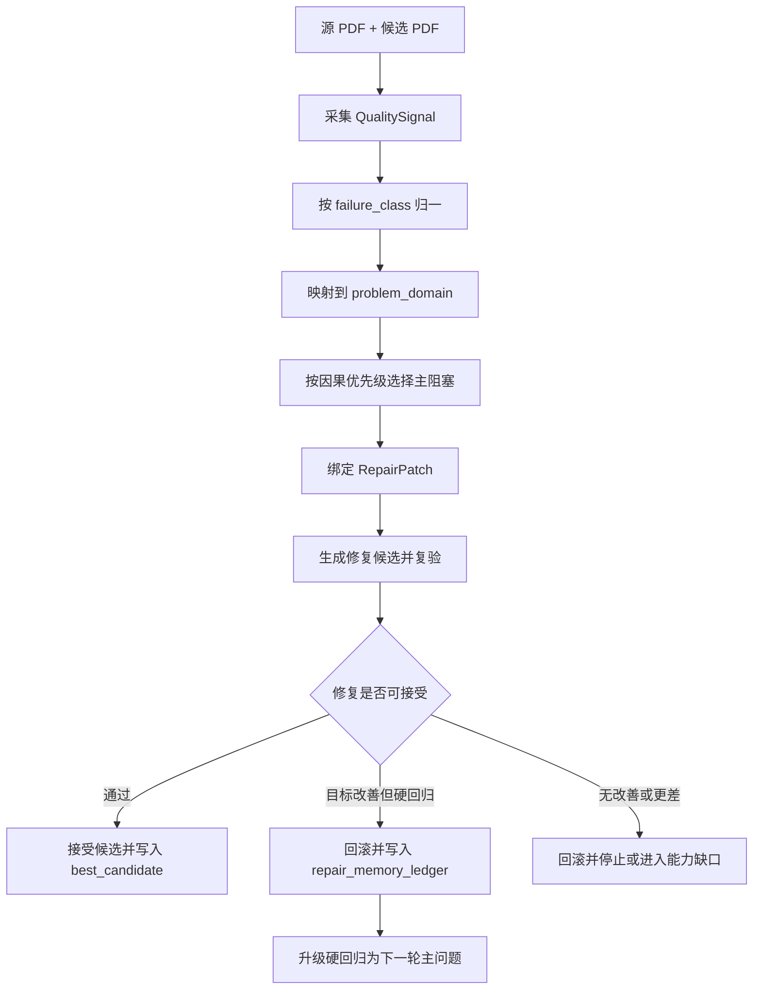
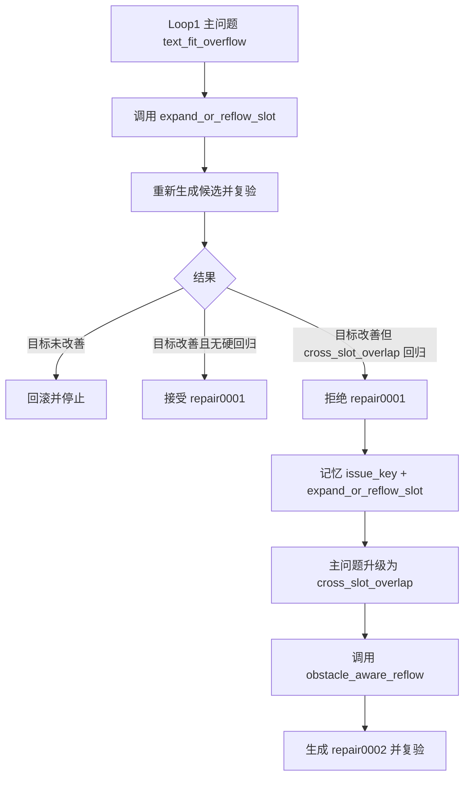

# Round27 分层分级记忆与二轮修复说明

## 1. 本轮目的

Round27 不直接合入 core，也不修改全局设计文档。它验证一个更细的闭环：

1. 先把候选 PDF 的问题分到问题域。
2. 每轮只选一个主阻塞问题。
3. 修复后重新验收。
4. 如果修复主问题时破坏其它硬问题域，则回滚、写入记忆，并把硬回归升级为下一轮主问题。
5. 同一 `issue_key + repair_atom` 不允许重复尝试。

## 2. 问题分层

本轮使用当前候选与原文的结构化对比，不使用人工参考译文，也不使用固定页码、固定文本或固定数字。



## 3. 问题域和修复原子

| 问题域 | 典型 failure_class | 采集证据 | 当前修复原子 |
|---|---|---|---|
| `text-loading` | `text_fit_overflow` | fit 状态、源/候选 bbox、高度/宽度比、字号下限 | `expand_or_reflow_slot` |
| `font-hierarchy` | `font_size_regression` | 源字号、候选字号、源相对字号下限 | 暂未在 round27 主修 |
| `geometry-layout` | `cross_slot_overlap` | 候选重叠减源重叠、参与重叠的 group_id、needed_shift | `obstacle_aware_reflow` |
| `background-redaction` | `background_residue_artifact` | 背景色、擦除区域、渲染差异 | 暂未在 round27 主修 |
| `table-matrix` | `table_text_legibility_fail` | 表格行列区域、单元格文字、线框关系 | 暂未在 round27 主修 |
| `chart-legend` | `chart_integrity_fail` | 图表、图例、色块、标签关系 | 暂未在 round27 主修 |

## 4. 记忆契约

`repair_memory_ledger.json` 是本轮新增的核心闭环证据。

```json
{
  "attempts": [
    {
      "issue_key": "case:aggregate:text_fit_overflow",
      "round": 1,
      "repair_atom": "expand_or_reflow_slot",
      "verdict": "rolled_back",
      "delta_target": {"failure_class": "text_fit_overflow", "before": 9, "after": 0},
      "delta_regressions": {"cross_slot_overlap": {"before": 70, "after": 78}}
    },
    {
      "issue_key": "case:aggregate:cross_slot_overlap",
      "round": 2,
      "repair_atom": "obstacle_aware_reflow",
      "verdict": "accepted"
    }
  ],
  "stop_policy_probe": {
    "same_atom_retry_allowed": false
  }
}
```

## 5. 二轮升级规则

Round27 的升级逻辑只处理一个明确模式：



## 6. `obstacle_aware_reflow` 当前能力边界

当前实现是 `partial`，不是完整障碍图求解器。

它会：

- 读取当前运行的 `quality_signals.repair0001.json` 中的 overlap signals。
- 从 `layout_plan.repair0001.json` 找到参与 overlap 的上下 group。
- 只移动当前 overlap 中的下方锚点 group。
- 每个 group 每轮最多移动一次。
- 避免 `table_cell`、`chart_label`、`chart_legend`、`nav_footer`、`image_caption` 等受保护角色。
- 输出 `repair_patch_0002.json`，不直接写 PDF。

它不会：

- 构建完整页面级障碍图。
- 重新分栏、跨页重排或重写翻译。
- 使用人工参考 PDF 做运行时判断。

## 7. 本轮实跑结果

| Case | Loop1 | Loop2 | 主要改善 | 产品结果 |
|---|---|---|---|---|
| `R27_00005_ZH_TO_EN_pages_001_020` | `REJECTED_ROLLBACK` | `IMPROVED` | `cross_slot_overlap` 78 -> 70 | `FAIL` |
| `R27_AIA_ZH_TO_EN_pages_001_020` | `REJECTED_ROLLBACK` | `IMPROVED` | `cross_slot_overlap` 268 -> 230 | `FAIL` |

结论：分层、记忆、升级和回滚机制已跑通；产品仍失败，说明当前修复原子只解决了部分几何冲突，后续需要更完整的 obstacle graph / whitespace-band / section-flow 重排能力。
